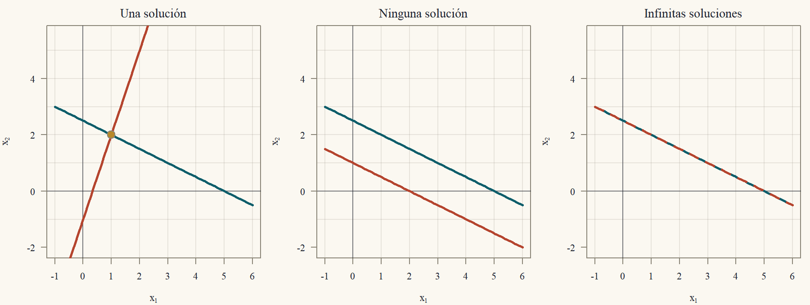
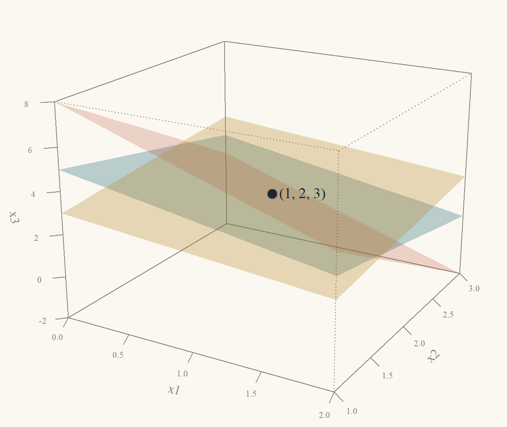
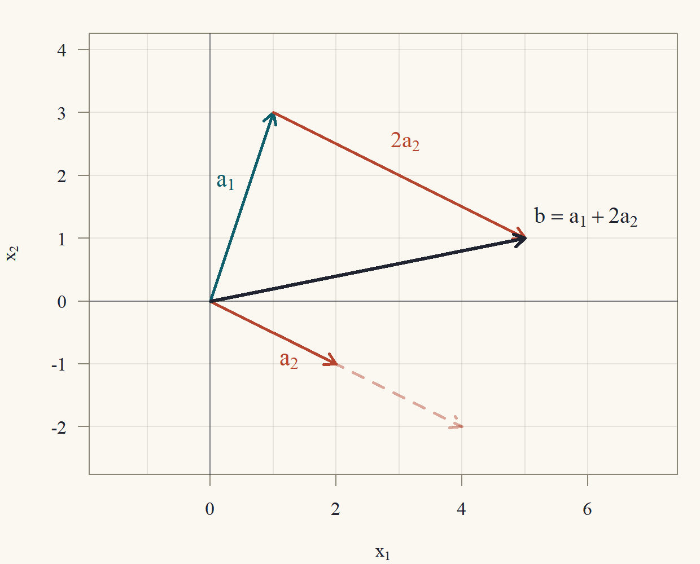

::: {.content-visible when-format="html"}
<a class="descarga-pdf" href="clase-01.pdf">Descargar esta clase en PDF</a>
:::

# Dos mercados, dos ecuaciones

Empecemos con un problema de economía. Dos bienes, café (bien 1) y té (bien 2), son **sustitutos**: cuando sube el precio de uno, parte de los consumidores se cambia al otro. Con precios $P_1$ y $P_2$, las demandas y ofertas de cada mercado son

| | Demanda | Oferta |
|---|---|---|
| Café | $Q^d_1 = 10 - 2P_1 + P_2$ | $Q^s_1 = 1 + P_1$ |
| Té | $Q^d_2 = 5 + P_1 - P_2$ | $Q^s_2 = 3 + P_2$ |

Cada demanda baja con el precio propio y **sube con el precio del otro bien** (los coeficientes $+1$), y cada oferta sube con el precio propio. Queremos los precios de **equilibrio**: los que hacen que en ambos mercados la cantidad demandada sea igual a la ofrecida.

En el mercado del café, $Q^d_1 = Q^s_1$ y, pasando las incógnitas a la izquierda,
$$
10 - 2P_1 + P_2 = 1 + P_1\quad\Longleftrightarrow\quad 3P_1 - P_2 = 9.
$$
En el mercado del té, $Q^d_2 = Q^s_2$:
$$
5 + P_1 - P_2 = 3 + P_2\quad\Longleftrightarrow\quad -P_1 + 2P_2 = 2.
$$
Es un **sistema de dos ecuaciones lineales con dos incógnitas**. Los mercados no se pueden resolver por separado: el equilibrio del café depende del precio del té, y viceversa. La segunda ecuación dice $P_1 = 2P_2 - 2$. Reemplazando en la primera: $3(2P_2 - 2) - P_2 = 5P_2 - 6 = 9$, así que $P_2 = 3$ y $P_1 = 2\cdot3 - 2 = 4$. Las cantidades de equilibrio son $Q_1 = 1 + 4 = 5$ (y, por el lado de la demanda, $10 - 8 + 3 = 5$ ✓) y $Q_2 = 3 + 3 = 6$ (y $5 + 4 - 3 = 6$ ✓). La @fig-mercados muestra los dos equilibrios.

{#fig-mercados width=100%}

Con dos incógnitas cualquier método sirve. Pero un modelo de equilibrio general tiene decenas de mercados interdependientes, una matriz insumo-producto de un país tiene cientos de sectores y un modelo del clima tiene millones de incógnitas. Hace falta un **método sistemático**, que funcione igual para dos o para un millón de ecuaciones, y que diga además **cuándo** hay solución y **cuántas** hay. Ese método es la **eliminación gaussiana**, y es el tema de esta clase.[^gauss]

[^gauss]: El método aparece ya en el texto chino *Los nueve capítulos sobre el arte matemático*, compilado hace unos dos mil años, donde se resuelven sistemas de hasta cinco ecuaciones disponiendo los coeficientes en una tabla. El nombre de Gauss se le asoció porque lo usó sistemáticamente a comienzos del siglo XIX para calcular la órbita de asteroides con mínimos cuadrados (Clase 6).

# Notación: matrices y vectores

Un **sistema lineal** de $m$ ecuaciones con $n$ incógnitas $x_1,\dots,x_n$ es
$$
\begin{aligned}
a_{11}x_1 + a_{12}x_2 + \dots + a_{1n}x_n &= b_1\\
a_{21}x_1 + a_{22}x_2 + \dots + a_{2n}x_n &= b_2\\
&\;\;\vdots\\
a_{m1}x_1 + a_{m2}x_2 + \dots + a_{mn}x_n &= b_m.
\end{aligned}
$$ {#eq-sistema}
Los números $a_{ij}$ (el coeficiente de la incógnita $j$ en la ecuación $i$) forman la **matriz de coeficientes** $A$, de $m$ filas y $n$ columnas ($m\times n$). Las incógnitas forman el vector $x$ y los lados derechos, el vector $b$:
$$
A = \begin{pmatrix}a_{11}&a_{12}&\cdots&a_{1n}\\a_{21}&a_{22}&\cdots&a_{2n}\\\vdots&&&\vdots\\a_{m1}&a_{m2}&\cdots&a_{mn}\end{pmatrix},\qquad x = \begin{pmatrix}x_1\\\vdots\\x_n\end{pmatrix},\qquad b = \begin{pmatrix}b_1\\\vdots\\b_m\end{pmatrix}.
$$
El sistema @eq-sistema se escribe, en forma compacta, $Ax = b$. Para los dos mercados,
$$
A = \begin{pmatrix}3&-1\\-1&2\end{pmatrix},\qquad x = \begin{pmatrix}P_1\\P_2\end{pmatrix},\qquad b = \begin{pmatrix}9\\2\end{pmatrix}.
$$
Una **solución** es un vector $x$ que satisface las $m$ ecuaciones a la vez. El conjunto de todas las soluciones es el **conjunto solución**. Los vectores siempre son columnas, y escribimos $a_j$ para la columna $j$ de $A$.

# Tres maneras de mirar $Ax = b$

La misma ecuación $Ax = b$ admite tres lecturas, y cada una aporta una intuición distinta. Usaremos como ejemplo el sistema
$$
\begin{aligned}
x_1 + 2x_2 &= 5\\
3x_1 - x_2 &= 1
\end{aligned}
\qquad\text{es decir}\qquad
\begin{pmatrix}1&2\\3&-1\end{pmatrix}\begin{pmatrix}x_1\\x_2\end{pmatrix} = \begin{pmatrix}5\\1\end{pmatrix}.
$$ {#eq-ejemplo2}

## Por filas: rectas y planos que se cortan

Cada ecuación de @eq-ejemplo2 es una **recta** del plano: $x_1 + 2x_2 = 5$ pasa por $(5,0)$ y $(1,2)$; $3x_1 - x_2 = 1$ pasa por $(0,-1)$ y $(1,2)$. Una solución del sistema es un punto que está en **las dos** rectas a la vez: su **intersección**. Las dos rectas pasan por $(1,2)$, que es la solución: $1 + 2\cdot2 = 5$ ✓ y $3\cdot1 - 2 = 1$ ✓.

Dos rectas del plano pueden cortarse en un punto, ser paralelas (no se cortan) o ser la misma recta (se cortan en todos sus puntos). Son los tres casos de la @fig-rectas, y anticipan algo que demostraremos: **un sistema lineal tiene una solución, ninguna o infinitas**. Nunca exactamente dos.

{#fig-rectas width=100%}

Con tres incógnitas, cada ecuación $a_1x_1 + a_2x_2 + a_3x_3 = b$ es un **plano** del espacio, y resolver un sistema de tres ecuaciones es encontrar el punto común a tres planos. Por ejemplo,
$$
\begin{aligned}
x_1 + x_2 + x_3 &= 6\\
2x_1 + 3x_2 + x_3 &= 11\\
x_1 - x_2 + 2x_3 &= 5
\end{aligned}
$$ {#eq-ejemplo3}
tiene la única solución $(1,2,3)$: $1 + 2 + 3 = 6$ ✓, $2 + 6 + 3 = 11$ ✓ y $1 - 2 + 6 = 5$ ✓. Es el punto de la @fig-planos.

{#fig-planos width=70%}

Tres planos también pueden no tener un único punto común. Si el tercer plano contiene la recta donde se cortan los dos primeros, hay infinitas soluciones (toda esa recta). Si el tercero no toca esa recta, no hay ninguna (@fig-planos-casos).

{#fig-planos-casos width=100%}

La lectura por filas es la más intuitiva en dos y tres dimensiones, pero en dimensiones más altas no se puede dibujar. La siguiente lectura escala mejor.

## Por columnas: combinaciones de vectores

Escribamos @eq-ejemplo2 separando las columnas:
$$
x_1\begin{pmatrix}1\\3\end{pmatrix} + x_2\begin{pmatrix}2\\-1\end{pmatrix} = \begin{pmatrix}5\\1\end{pmatrix}.
$$
La pregunta ahora es: **¿qué múltiplos de las columnas $a_1 = (1,3)'$ y $a_2 = (2,-1)'$ hay que sumar para obtener $b = (5,1)'$?** La respuesta es $x_1 = 1$ y $x_2 = 2$: $1\cdot(1,3)' + 2\cdot(2,-1)' = (1 + 4,\ 3 - 2)' = (5,1)'$ ✓. La @fig-columnas lo muestra: se camina $a_1$ una vez y $a_2$ dos veces, y se llega a $b$.

{#fig-columnas width=62%}

Una expresión de la forma $x_1a_1 + x_2a_2 + \dots + x_na_n$, con números $x_j$, se llama **combinación lineal** de los vectores $a_j$. Entonces:

> $Ax = b$ tiene solución **si y solo si** $b$ es una combinación lineal de las columnas de $A$.

Esta lectura explica de inmediato los casos de la @fig-rectas. En el caso central, las columnas son $(1,2)'$ y $(2,4)'$: la segunda es el doble de la primera, así que todas sus combinaciones $x_1(1,2)' + x_2(2,4)' = (x_1 + 2x_2)(1,2)'$ caen sobre **una misma recta** que pasa por el origen. Si $b$ no está en esa recta (como $b = (5,4)'$), no hay solución. Si está (como $b = (5,10)'$), hay infinitas maneras de repartir el peso entre las dos columnas.

Las dos lecturas son la misma cuenta ordenada de dos maneras. Lo hacemos explícito porque usaremos ambas todo el curso.

::: {#def-producto}
## Producto de matriz por vector
Para $A$ de $m\times n$ y $x\in\mathbb{R}^n$, el producto $Ax$ es el vector de $\mathbb{R}^m$ cuya componente $i$ es
$$
(Ax)_i = a_{i1}x_1 + a_{i2}x_2 + \dots + a_{in}x_n = \sum_{j = 1}^na_{ij}x_j,\qquad i = 1,\dots,m.
$$
:::

::: {#prp-filas-columnas}
## Las dos lecturas coinciden
Para toda $A$ de $m\times n$ con columnas $a_1,\dots,a_n$ y todo $x\in\mathbb{R}^n$,
$$
Ax = x_1a_1 + x_2a_2 + \dots + x_na_n.
$$
:::

::: {.callout-note title="Borrador"}
Dos vectores son iguales cuando son iguales componente a componente. Así que basta comparar la componente $i$ de cada lado. A la izquierda, por definición, es $\sum_ja_{ij}x_j$. A la derecha tengo una suma de vectores escalados: la componente $i$ de $x_ja_j$ es $x_j$ por la componente $i$ de $a_j$, que es $a_{ij}$.
:::

::: {.proof}
Fijemos una fila $i\in\{1,\dots,m\}$.

*Paso 1 (lado izquierdo).* Por la @def-producto, $(Ax)_i = \sum_{j = 1}^na_{ij}x_j$.

*Paso 2 (lado derecho).* La columna $a_j$ es el vector $(a_{1j},a_{2j},\dots,a_{mj})'$, así que su componente $i$ es $a_{ij}$. Multiplicar un vector por el número $x_j$ multiplica cada componente por $x_j$: la componente $i$ de $x_ja_j$ es $x_ja_{ij}$. Sumar vectores suma componente a componente: la componente $i$ de $x_1a_1 + \dots + x_na_n$ es $x_1a_{i1} + \dots + x_na_{in} = \sum_{j = 1}^nx_ja_{ij}$.

*Paso 3.* Como $x_ja_{ij} = a_{ij}x_j$ (los números conmutan), las expresiones de los pasos 1 y 2 son iguales. Como $i$ era arbitrario, los dos vectores coinciden en todas sus componentes.
:::

::: {#exm-producto}
## Un producto $3\times3$ calculado de las dos maneras
Con la matriz de @eq-ejemplo3 y $x = (1,2,3)'$:

*Por filas:* $(1\cdot1 + 1\cdot2 + 1\cdot3,\ 2\cdot1 + 3\cdot2 + 1\cdot3,\ 1\cdot1 + (-1)\cdot2 + 2\cdot3)' = (6,\ 11,\ 5)'$.

*Por columnas:* $1\begin{pmatrix}1\\2\\1\end{pmatrix} + 2\begin{pmatrix}1\\3\\-1\end{pmatrix} + 3\begin{pmatrix}1\\1\\2\end{pmatrix} = \begin{pmatrix}1 + 2 + 3\\2 + 6 + 3\\1 - 2 + 6\end{pmatrix} = \begin{pmatrix}6\\11\\5\end{pmatrix}$.

Ambas dan $b = (6,11,5)'$: $(1,2,3)$ resuelve @eq-ejemplo3.
:::

## Como transformación

La tercera lectura mira a $A$ como una **máquina** que recibe un vector $x\in\mathbb{R}^n$ y entrega el vector $Ax\in\mathbb{R}^m$. Resolver $Ax = b$ es preguntar **qué entrada produce la salida $b$**. Esta lectura es la que explica los determinantes (cuánto agranda $A$ las áreas, Clase 4), los valores propios (qué direcciones no cambian de dirección, Clase 7) y la SVD (cómo deforma $A$ un círculo, Clase 9). Por ahora basta registrar una propiedad: la máquina es **lineal**.

::: {#prp-linealidad}
## Linealidad del producto
Para toda $A$ de $m\times n$, todos $x,y\in\mathbb{R}^n$ y todo número $c$: $A(x + y) = Ax + Ay$ y $A(cx) = c(Ax)$.
:::

::: {.proof}
Comparamos la componente $i$. *Suma:* $(A(x + y))_i = \sum_ja_{ij}(x_j + y_j) = \sum_j(a_{ij}x_j + a_{ij}y_j) = \sum_ja_{ij}x_j + \sum_ja_{ij}y_j = (Ax)_i + (Ay)_i$, donde se usó la distributividad de los números y que una suma de sumas se puede reordenar. *Escalar:* $(A(cx))_i = \sum_ja_{ij}(cx_j) = c\sum_ja_{ij}x_j = c(Ax)_i$, sacando el factor común $c$.
:::

# Operaciones elementales

La idea de la eliminación es transformar el sistema en otro **más fácil** que tenga **exactamente las mismas soluciones**. Las transformaciones permitidas son tres.

::: {#def-operaciones}
## Operaciones elementales de fila
1. **Reemplazo:** sumar a una ecuación un múltiplo de otra ($F_i\leftarrow F_i + cF_k$, con $k\ne i$).
2. **Intercambio:** intercambiar dos ecuaciones ($F_i\leftrightarrow F_k$).
3. **Escalamiento:** multiplicar una ecuación por un número **distinto de cero** ($F_i\leftarrow cF_i$, con $c\ne0$).
:::

Para no arrastrar las incógnitas, se trabaja con la **matriz aumentada** $[A\mid b]$, que pone el lado derecho como una columna más:
$$
\left[\begin{array}{ccc|c}1&1&1&6\\2&3&1&11\\1&-1&2&5\end{array}\right]\quad\text{representa @eq-ejemplo3}.
$$
Una operación elemental sobre las ecuaciones es la misma operación sobre las filas de la matriz aumentada.

::: {#thm-equivalencia}
## Las operaciones elementales no cambian las soluciones
Si el sistema $\tilde Ax = \tilde b$ se obtiene de $Ax = b$ con una operación elemental, entonces ambos sistemas tienen exactamente el mismo conjunto solución.
:::

::: {.callout-note title="Borrador"}
"Mismo conjunto solución" son dos inclusiones: toda solución del original resuelve el nuevo, y toda solución del nuevo resuelve el original. Para la primera, tomo una solución $x$ y verifico cada ecuación nueva: las que no cambiaron se siguen cumpliendo, y la que cambió es una combinación de ecuaciones que $x$ cumple. Para la segunda, uso que cada operación se **deshace** con otra operación del mismo tipo: entonces el original se obtiene del nuevo con una operación elemental, y aplico la primera inclusión al revés.
:::

::: {.proof}
Escribimos la ecuación $i$ del sistema original como $F_i(x) = b_i$, donde $F_i(x) = a_{i1}x_1 + \dots + a_{in}x_n$. Notar que $F_i(x) + cF_k(x) = (a_{i1} + ca_{k1})x_1 + \dots + (a_{in} + ca_{kn})x_n$: sumar un múltiplo de una fila a otra, en la matriz, es lo mismo que sumar las expresiones.

*Paso 1: toda solución del original resuelve el nuevo.* Sea $x$ con $F_\ell(x) = b_\ell$ para todo $\ell$. Revisamos cada operación.

- *Reemplazo* $F_i\leftarrow F_i + cF_k$: todas las ecuaciones salvo la $i$ son las mismas, y $x$ las cumple. La nueva ecuación $i$ es $F_i(x) + cF_k(x) = b_i + cb_k$. Como $F_i(x) = b_i$ y $F_k(x) = b_k$, el lado izquierdo vale $b_i + cb_k$: se cumple.
- *Intercambio* $F_i\leftrightarrow F_k$: el nuevo sistema tiene las mismas ecuaciones en otro orden, y $x$ las cumple todas.
- *Escalamiento* $F_i\leftarrow cF_i$: la nueva ecuación $i$ es $cF_i(x) = cb_i$, y se cumple porque $F_i(x) = b_i$; las demás no cambian.

*Paso 2: cada operación se deshace con otra operación elemental.* El reemplazo $F_i\leftarrow F_i + cF_k$ se deshace con $F_i\leftarrow F_i - cF_k$ (la fila $k$ no cambió, así que restar $c$ veces la fila $k$ devuelve la fila $i$ original). El intercambio se deshace repitiéndolo. El escalamiento por $c\ne0$ se deshace escalando por $1/c$, que existe **porque $c\ne0$**; por eso la definición prohíbe escalar por cero.

*Paso 3: toda solución del nuevo resuelve el original.* Por el paso 2, el sistema original se obtiene del nuevo aplicando una operación elemental. Por el paso 1 (aplicado con los papeles invertidos), toda solución del nuevo resuelve el original.

Los pasos 1 y 3 dan las dos inclusiones, y los conjuntos solución son iguales.
:::

Notar por qué el escalamiento por cero está prohibido: multiplicar $x_1 + x_2 = 3$ por $0$ la convierte en $0 = 0$, que cumple cualquier $x$; se "pierde" una ecuación y aparecen soluciones falsas. Aplicando el teorema varias veces: **una sucesión de operaciones elementales tampoco cambia las soluciones**.

# La eliminación gaussiana

## Forma escalonada

El objetivo de la eliminación es llegar a un sistema **triangular**, que se resuelve de abajo hacia arriba.

::: {#def-escalonada}
## Forma escalonada
Una matriz está en **forma escalonada** si:

1. las filas de ceros, si hay, están al final;
2. en cada fila no nula, la primera entrada distinta de cero (el **pivote**) está estrictamente a la derecha del pivote de la fila de arriba.

Las columnas que contienen un pivote son **columnas pivote**; las incógnitas correspondientes son **variables pivote**, y las demás son **variables libres**.
:::

Debajo de cada pivote, por la condición 2, solo hay ceros. Por ejemplo, con $\ast$ un número cualquiera y $\blacksquare$ un pivote (distinto de cero),
$$
\begin{pmatrix}\blacksquare&\ast&\ast\\0&\blacksquare&\ast\\0&0&\blacksquare\end{pmatrix}\qquad\begin{pmatrix}\blacksquare&\ast&\ast\\0&0&\blacksquare\\0&0&0\end{pmatrix}
$$
están en forma escalonada: la primera tiene tres pivotes y ninguna variable libre; la segunda, pivotes en las columnas 1 y 3, y $x_2$ es libre.

## El algoritmo

::: {.callout-caution title="Algoritmo: eliminación gaussiana"}
Entrada: la matriz aumentada $[A\mid b]$.

1. Tomar la primera columna que tenga alguna entrada distinta de cero (en las filas que quedan por procesar). Si la entrada de arriba es cero, **intercambiar** con una fila de más abajo que tenga entrada distinta de cero. Esa entrada es el **pivote**.
2. Para cada fila debajo del pivote, restarle el múltiplo de la fila del pivote que anula su entrada en esa columna: $F_i\leftarrow F_i - \ell_iF_{\text{piv}}$, con el **multiplicador** $\ell_i = (\text{entrada de }F_i)/(\text{pivote})$.
3. Repetir los pasos 1 y 2 con las filas de abajo (olvidando la fila del pivote), hasta que no queden filas o columnas.
4. **Sustitución hacia atrás:** si no aparece una fila $(0\ \cdots\ 0\mid c)$ con $c\ne0$, resolver la última ecuación con pivote para su variable pivote, sustituir hacia arriba y continuar.

**Falla** (detiene el pivote) si toda la columna restante es cero: entonces esa columna no tiene pivote y se pasa a la siguiente. Numéricamente, un pivote **muy pequeño** amplifica los errores de redondeo; la solución (pivoteo parcial) está en la Clase 2.
:::

::: {#exm-elim2}
## Eliminación en el sistema $2\times2$
Para @eq-ejemplo2:
$$
\left[\begin{array}{cc|c}1&2&5\\3&-1&1\end{array}\right]\xrightarrow{F_2\leftarrow F_2 - 3F_1}\left[\begin{array}{cc|c}1&2&5\\0&-7&-14\end{array}\right].
$$
El multiplicador es $\ell_2 = 3/1 = 3$. La nueva fila 2 es $(3 - 3\cdot1,\ -1 - 3\cdot2\mid1 - 3\cdot5) = (0,\ -7\mid-14)$. Pivotes: $1$ y $-7$. Sustitución hacia atrás: la fila 2 dice $-7x_2 = -14$, así que $x_2 = 2$; la fila 1 dice $x_1 + 2\cdot2 = 5$, así que $x_1 = 1$.
:::

::: {#exm-elim3}
## Eliminación en el sistema $3\times3$
Para @eq-ejemplo3:

*Columna 1.* El pivote es $1$ (fila 1). Multiplicadores: $\ell_2 = 2/1 = 2$ y $\ell_3 = 1/1 = 1$.
$$
\left[\begin{array}{ccc|c}1&1&1&6\\2&3&1&11\\1&-1&2&5\end{array}\right]
\xrightarrow[F_3\leftarrow F_3 - 1\cdot F_1]{F_2\leftarrow F_2 - 2F_1}
\left[\begin{array}{ccc|c}1&1&1&6\\0&1&-1&-1\\0&-2&1&-1\end{array}\right].
$$
Cuentas: $F_2 - 2F_1 = (2 - 2,\ 3 - 2,\ 1 - 2\mid11 - 12) = (0,\ 1,\ -1\mid-1)$; $F_3 - F_1 = (1 - 1,\ -1 - 1,\ 2 - 1\mid5 - 6) = (0,\ -2,\ 1\mid-1)$.

*Columna 2.* Olvidamos la fila 1. El pivote es $1$ (fila 2). Multiplicador: $\ell_3 = -2/1 = -2$, así que $F_3\leftarrow F_3 - (-2)F_2 = F_3 + 2F_2$:
$$
\left[\begin{array}{ccc|c}1&1&1&6\\0&1&-1&-1\\0&-2&1&-1\end{array}\right]
\xrightarrow{F_3\leftarrow F_3 + 2F_2}
\left[\begin{array}{ccc|c}1&1&1&6\\0&1&-1&-1\\0&0&-1&-3\end{array}\right].
$$
Cuenta: $(0 + 0,\ -2 + 2,\ 1 - 2\mid-1 - 2) = (0,\ 0,\ -1\mid-3)$.

*Sustitución hacia atrás.* Fila 3: $-x_3 = -3$, luego $x_3 = 3$. Fila 2: $x_2 - x_3 = -1$, luego $x_2 = -1 + 3 = 2$. Fila 1: $x_1 + x_2 + x_3 = 6$, luego $x_1 = 6 - 2 - 3 = 1$. La solución es $(1,2,3)$, el punto de la @fig-planos. Los pivotes son $1$, $1$ y $-1$.
:::

## Cuando hace falta intercambiar filas

::: {#exm-propano}
## Balance de la combustión del propano
Al quemar propano ($\mathrm{C_3H_8}$) con oxígeno ($\mathrm{O_2}$) se obtiene dióxido de carbono ($\mathrm{CO_2}$) y agua ($\mathrm{H_2O}$):
$$
\mathrm{C_3H_8} + x_2\,\mathrm{O_2}\ \longrightarrow\ x_3\,\mathrm{CO_2} + x_4\,\mathrm{H_2O}.
$$
Fijamos en $1$ el coeficiente del propano y buscamos $x_2,x_3,x_4$ para que cada elemento aparezca la misma cantidad de veces a cada lado:

- carbono: $3 = x_3$;
- hidrógeno: $8 = 2x_4$;
- oxígeno: $2x_2 = 2x_3 + x_4$, es decir $2x_2 - 2x_3 - x_4 = 0$.

Con las incógnitas en el orden $(x_2,x_3,x_4)$, la matriz aumentada es
$$
\left[\begin{array}{ccc|c}0&1&0&3\\0&0&2&8\\2&-2&-1&0\end{array}\right].
$$
La entrada $(1,1)$ es **cero**: no sirve de pivote (no se puede dividir por ella). La única fila con entrada no nula en la columna 1 es la tercera, así que **intercambiamos** $F_1\leftrightarrow F_3$:
$$
\left[\begin{array}{ccc|c}2&-2&-1&0\\0&0&2&8\\0&1&0&3\end{array}\right]\xrightarrow{F_2\leftrightarrow F_3}\left[\begin{array}{ccc|c}2&-2&-1&0\\0&1&0&3\\0&0&2&8\end{array}\right].
$$
En la columna 2, la entrada de la fila 2 era cero y la de la fila 3 era $1$: un segundo intercambio deja la matriz escalonada (no hizo falta ningún reemplazo). Sustitución hacia atrás: $2x_4 = 8\Rightarrow x_4 = 4$; $x_3 = 3$; $2x_2 - 2\cdot3 - 4 = 0\Rightarrow 2x_2 = 10\Rightarrow x_2 = 5$. La ecuación balanceada es
$$
\mathrm{C_3H_8} + 5\,\mathrm{O_2}\longrightarrow3\,\mathrm{CO_2} + 4\,\mathrm{H_2O}.
$$
Verificación: carbono $3 = 3$; hidrógeno $8 = 4\cdot2$; oxígeno $5\cdot2 = 10 = 3\cdot2 + 4\cdot1$ ✓.
:::

# Forma escalonada reducida y variables libres

Cuando hay variables libres conviene seguir eliminando hasta una forma más limpia.

::: {#def-reducida}
## Forma escalonada reducida
Una matriz está en **forma escalonada reducida** si está en forma escalonada, cada pivote vale $1$ y cada pivote es la **única** entrada distinta de cero de su columna.
:::

Se llega a ella desde la forma escalonada (método de **Gauss–Jordan**): se escala cada fila para que su pivote valga $1$ y se eliminan también las entradas **sobre** cada pivote, de abajo hacia arriba.

::: {#exm-infinitas}
## Un sistema con infinitas soluciones
Cambiemos la tercera ecuación de @eq-ejemplo3 por la suma de las dos primeras, $3x_1 + 4x_2 + 2x_3 = 17$ (el caso izquierdo de la @fig-planos-casos):
$$
\left[\begin{array}{ccc|c}1&1&1&6\\2&3&1&11\\3&4&2&17\end{array}\right]
\xrightarrow[F_3\leftarrow F_3 - 3F_1]{F_2\leftarrow F_2 - 2F_1}
\left[\begin{array}{ccc|c}1&1&1&6\\0&1&-1&-1\\0&1&-1&-1\end{array}\right],
$$
$$
\left[\begin{array}{ccc|c}1&1&1&6\\0&1&-1&-1\\0&1&-1&-1\end{array}\right]
\xrightarrow{F_3\leftarrow F_3 - F_2}
\left[\begin{array}{ccc|c}1&1&1&6\\0&1&-1&-1\\0&0&0&0\end{array}\right].
$$
Cuentas: $F_3 - 3F_1 = (3 - 3,\ 4 - 3,\ 2 - 3\mid17 - 18) = (0,\ 1,\ -1\mid-1)$, y luego $F_3 - F_2 = (0,0,0\mid0)$. La matriz está en forma escalonada con pivotes en las columnas 1 y 2: **$x_3$ es libre**. Para la forma reducida eliminamos el $1$ sobre el segundo pivote, $F_1\leftarrow F_1 - F_2$:
$$
\left[\begin{array}{ccc|c}1&0&2&7\\0&1&-1&-1\\0&0&0&0\end{array}\right],
$$
con $F_1 - F_2 = (1,\ 1 - 1,\ 1 - (-1)\mid6 - (-1)) = (1,\ 0,\ 2\mid7)$. Ahora cada variable pivote se **despeja** en función de la libre: $x_1 = 7 - 2x_3$ y $x_2 = -1 + x_3$. Llamando $t$ a la variable libre, las soluciones son
$$
\begin{pmatrix}x_1\\x_2\\x_3\end{pmatrix} = \begin{pmatrix}7 - 2t\\-1 + t\\t\end{pmatrix} = \begin{pmatrix}7\\-1\\0\end{pmatrix} + t\begin{pmatrix}-2\\1\\1\end{pmatrix},\qquad t\in\mathbb{R}.
$$
Es la **ecuación paramétrica de una recta** en el espacio: la recta común de la @fig-planos-casos. Con $t = 3$ se obtiene $(1,2,3)$, la solución del sistema original, que en efecto está en esa recta.
:::

::: {#exm-ninguna}
## Un sistema sin solución
Si en cambio el lado derecho de la tercera ecuación es $20$, la misma eliminación da
$$
\left[\begin{array}{ccc|c}1&1&1&6\\0&1&-1&-1\\0&1&-1&2\end{array}\right]\xrightarrow{F_3\leftarrow F_3 - F_2}\left[\begin{array}{ccc|c}1&1&1&6\\0&1&-1&-1\\0&0&0&3\end{array}\right],
$$
con $20 - 3\cdot6 = 2$ en la fila 3 tras el primer paso, y $2 - (-1) = 3$ tras el segundo. La última fila dice $0x_1 + 0x_2 + 0x_3 = 3$, es decir $0 = 3$: **ningún** $x$ la cumple. El sistema no tiene solución (caso derecho de la @fig-planos-casos).
:::

# Existencia y unicidad

Los tres ejemplos anteriores muestran todo lo que puede pasar. El siguiente teorema lo dice en general.

::: {#thm-existencia}
## Existencia y unicidad de soluciones
Sea $[U\mid c]$ una forma escalonada de la matriz aumentada $[A\mid b]$ de un sistema de $m$ ecuaciones con $n$ incógnitas.

1. El sistema **no tiene solución** si y solo si $[U\mid c]$ tiene una fila de la forma $(0\ 0\ \cdots\ 0\mid c_i)$ con $c_i\ne0$.
2. Si el sistema tiene solución, la solución es **única** si y solo si no hay variables libres (todas las columnas de $U$ son columnas pivote). Si hay al menos una variable libre, hay **infinitas** soluciones.
:::

::: {.callout-note title="Borrador"}
Por el @thm-equivalencia, puedo trabajar con $[U\mid c]$ en lugar de $[A\mid b]$. La dirección fácil de 1: la fila mala dice $0 = c_i$ y nadie la cumple. Para la otra dirección construyo soluciones: le doy a las variables libres valores cualesquiera y, de abajo hacia arriba, despejo cada variable pivote. Eso siempre se puede porque el pivote es distinto de cero, y en cada fila las variables a la derecha del pivote ya tienen valor: o son libres o son pivotes de filas de más abajo. Esa construcción también responde la parte 2: cada elección de las libres da exactamente una solución.
:::

::: {.proof}
Por el @thm-equivalencia (aplicado a cada operación de la eliminación), $Ax = b$ y $Ux = c$ tienen el mismo conjunto solución. Trabajamos con $Ux = c$. Sean $r$ el número de filas no nulas de $U$ y $p_1<p_2<\dots<p_r$ las columnas de sus pivotes (crecientes por la forma escalonada).

*Parte 1, dirección ($\Leftarrow$).* Si una fila de $[U\mid c]$ es $(0\ \cdots\ 0\mid c_i)$ con $c_i\ne0$, la ecuación correspondiente es $0x_1 + \dots + 0x_n = c_i$. Su lado izquierdo vale $0$ para cualquier $x$, y $0\ne c_i$: ningún $x$ la cumple, y el sistema no tiene solución.

*Parte 1, dirección ($\Rightarrow$), por contrarrecíproco.* Supongamos que no hay ninguna fila $(0\ \cdots\ 0\mid c_i)$ con $c_i\ne0$. Las filas de $U$ nulas (las $m - r$ últimas) tienen entonces $c_i = 0$, y sus ecuaciones $0 = 0$ las cumple cualquier $x$. Construimos un $x$ que cumple las $r$ primeras:

- (a) A cada variable libre le damos un valor cualquiera (por ejemplo, $0$).
- (b) Procesamos las filas $k = r, r - 1, \dots, 1$ en ese orden. La fila $k$ dice
$$
u_{k,p_k}x_{p_k} + \sum_{j>p_k}u_{kj}x_j = c_k.
$$
(No hay términos con $j<p_k$ porque las entradas a la izquierda del pivote son cero.) Cada $x_j$ con $j>p_k$ ya tiene valor: si $j$ es una columna no pivote, se fijó en (a); si es una columna pivote, es $p_\ell$ para algún $\ell>k$ (los pivotes de filas más bajas están más a la derecha), y se fijó al procesar la fila $\ell$, antes que la $k$. Como el pivote $u_{k,p_k}\ne0$, la ecuación tiene una **única** solución para $x_{p_k}$:
$$
x_{p_k} = \frac1{u_{k,p_k}}\Big(c_k - \sum_{j>p_k}u_{kj}x_j\Big).
$$

Al terminar, todas las variables tienen valor y se cumplen todas las ecuaciones: el sistema tiene solución. Esto prueba el contrarrecíproco de ($\Rightarrow$).

*Parte 2.* Supongamos que hay solución (no hay fila mala). La construcción de la parte 1 muestra dos cosas. Primero, **toda** solución se obtiene así: si $x$ es una solución, sus variables libres tienen ciertos valores, y entonces cada variable pivote está obligada a valer lo que dice la fórmula de (b) (porque esa ecuación tiene solución única dados los valores a su derecha). Segundo, **cada** elección de las variables libres produce una solución. Hay dos casos:

- Si no hay variables libres, no hay nada que elegir: la construcción produce exactamente un $x$, y como toda solución se obtiene así, la solución es única.
- Si hay al menos una variable libre $x_f$, las elecciones $x_f = 0, 1, 2, \dots$ (con las demás libres fijas) producen soluciones **distintas**, porque difieren en la componente $f$. Hay infinitas soluciones.
:::

::: {#cor-cuadrado}
## Sistemas cuadrados
Sea $A$ de $n\times n$. Si una forma escalonada de $A$ tiene $n$ pivotes, entonces $Ax = b$ tiene **exactamente una** solución para **todo** $b$. Si tiene menos de $n$ pivotes, existe algún $b$ sin solución, y para los $b$ que sí tienen solución, hay infinitas.
:::

::: {.proof}
*Con $n$ pivotes.* Una matriz $n\times n$ escalonada con $n$ pivotes tiene un pivote en cada fila y en cada columna (los pivotes están en filas distintas y columnas distintas, y hay $n$ de cada una). Entonces no hay filas nulas en $U$: no puede aparecer $(0\ \cdots\ 0\mid c_i)$, sea cual sea $b$. Por la parte 1 del @thm-existencia hay solución, y como no hay variables libres, por la parte 2 es única.

*Con menos de $n$ pivotes.* Hay al menos una columna sin pivote (una variable libre) y, como hay menos de $n$ pivotes en $n$ filas, la última fila de $U$ es nula. Sean $E$ las operaciones elementales que llevan $A$ a $U$. Tomemos $c = (0,\dots,0,1)'$ y apliquemos a $[U\mid c]$ las operaciones de $E$ **al revés** (cada una se deshace, @thm-equivalencia, paso 2): obtenemos $[A\mid b]$ para cierto $b$. Ese sistema tiene, por construcción, la forma escalonada $[U\mid c]$, cuya última fila es $(0\ \cdots\ 0\mid1)$: por la parte 1 no tiene solución. Y para cualquier $b$ con solución, la variable libre da infinitas (parte 2).
:::

El número de pivotes de una forma escalonada se llama **rango** de $A$. Que no dependa de cómo se hizo la eliminación (qué intercambios se eligieron) se demuestra en la Clase 3. Con esa palabra, el @cor-cuadrado dice: una matriz cuadrada de rango completo define un sistema con solución única para cualquier lado derecho.

# El caso homogéneo: reacciones químicas

Un sistema con $b = 0$, $Ax = 0$, se llama **homogéneo**. Siempre tiene la solución $x = 0$, y la pregunta interesante es si tiene otras. Por el @thm-existencia, las tiene exactamente cuando hay variables libres; en particular, **si hay más incógnitas que ecuaciones** ($n>m$), como hay a lo más $m$ pivotes, sobra al menos una columna sin pivote, y hay infinitas soluciones.

::: {#exm-agua}
## Formación del agua
En $x_1\,\mathrm{H_2} + x_2\,\mathrm{O_2}\to x_3\,\mathrm{H_2O}$, el balance de hidrógeno es $2x_1 = 2x_3$ y el de oxígeno $2x_2 = x_3$:
$$
\left[\begin{array}{ccc|c}2&0&-2&0\\0&2&-1&0\end{array}\right]\xrightarrow[F_2\leftarrow\frac12F_2]{F_1\leftarrow\frac12F_1}\left[\begin{array}{ccc|c}1&0&-1&0\\0&1&-\tfrac12&0\end{array}\right].
$$
Ya está en forma reducida, con pivotes en las columnas 1 y 2: $x_3 = t$ es libre, y $x_1 = t$, $x_2 = t/2$. Los coeficientes de una reacción deben ser enteros positivos, y el menor $t$ que lo logra es $t = 2$: $(x_1,x_2,x_3) = (2,1,2)$, es decir $2\,\mathrm{H_2} + \mathrm{O_2}\to2\,\mathrm{H_2O}$. Que haya infinitas soluciones refleja que una reacción balanceada sigue balanceada si se multiplican todos los coeficientes por el mismo número.
:::

# Cuánto cuesta eliminar

Para comparar algoritmos se cuentan las **operaciones de punto flotante** (sumas, restas, multiplicaciones y divisiones), llamadas *flops*.

::: {#prp-costo}
## Costo de la eliminación sin intercambios
Para un sistema $n\times n$ que no requiere intercambios, la eliminación hasta la forma escalonada (incluido el lado derecho) cuesta
$$
\sum_{k = 1}^{n - 1}(n - k)\big(2(n - k) + 3\big) = \frac{(n - 1)n(2n - 1)}3 + \frac{3(n - 1)n}2\ \text{flops},
$$
y la sustitución hacia atrás cuesta $n^2$ flops. El término dominante es $\tfrac23n^3$.
:::

::: {.proof}
*Eliminación.* En la etapa $k$ (el pivote de la columna $k$, con $k = 1,\dots,n - 1$) hay $n - k$ filas debajo del pivote. Para cada una de ellas:

- se calcula el multiplicador $\ell_i = a_{ik}/a_{kk}$: $1$ división;
- se actualizan las entradas de las columnas $k + 1,\dots,n$ (son $n - k$ entradas), cada una con $a_{ij}\leftarrow a_{ij} - \ell_ia_{kj}$: $1$ multiplicación y $1$ resta, o sea $2(n - k)$ flops;
- se actualiza el lado derecho $b_i\leftarrow b_i - \ell_ib_k$: $2$ flops.

(La entrada de la columna $k$ no se calcula: se sabe que queda en cero.) Cada fila cuesta $1 + 2(n - k) + 2 = 2(n - k) + 3$, y con $n - k$ filas la etapa $k$ cuesta $(n - k)(2(n - k) + 3)$. Sumando sobre $k$ y cambiando el índice a $j = n - k$ (que recorre $1,\dots,n - 1$):
$$
\sum_{j = 1}^{n - 1}j(2j + 3) = 2\sum_{j = 1}^{n - 1}j^2 + 3\sum_{j = 1}^{n - 1}j = 2\cdot\frac{(n - 1)n(2n - 1)}6 + 3\cdot\frac{(n - 1)n}2,
$$
usando las fórmulas $\sum_{j = 1}^Nj = N(N + 1)/2$ y $\sum_{j = 1}^Nj^2 = N(N + 1)(2N + 1)/6$ con $N = n - 1$. El primer término es $\frac{(n - 1)n(2n - 1)}3 = \frac{2n^3 - 3n^2 + n}3$, cuyo término dominante es $\frac23n^3$; el segundo es de orden $n^2$.

*Sustitución hacia atrás.* La ecuación $i$ (contando desde arriba) tiene $n - i$ incógnitas ya conocidas a la derecha del pivote: se calculan $n - i$ productos y $n - i$ restas, y luego $1$ división por el pivote, $2(n - i) + 1$ flops. Sumando sobre $i = 1,\dots,n$ con $j = n - i$ de $0$ a $n - 1$: $\sum_{j = 0}^{n - 1}(2j + 1) = 2\cdot\frac{(n - 1)n}2 + n = n^2$.
:::

Con $n = 2$: la eliminación cuesta $1\cdot(2 + 3) = 5$ flops y la sustitución $4$; total $9$. Con $n = 3$: $2\cdot(4 + 3) + 1\cdot(2 + 3) = 14 + 5 = 19$ y $9$; total $28$ (Ejercicio 1.7). La lección importante es la **escala**: el costo crece como el **cubo** del tamaño. Duplicar el número de incógnitas multiplica el trabajo por $2^3 = 8$. Por eso, en problemas grandes, la estructura de la matriz (bandas, ceros) importa tanto; ese tema está en el curso de Álgebra lineal.

# ★ Para ir más allá: matrices elementales

::: {.callout-important title="★ Para ir más allá"}
Cada operación elemental es **multiplicar a la izquierda** por una matriz especial. Esto convierte la eliminación en un producto de matrices, que es la base de la factorización $A = LU$ de la Clase 2.
:::

Recordemos el producto de matrices: si $E$ es $m\times m$ y $A$ es $m\times n$, la fila $i$ de $EA$ es $\sum_\ell e_{i\ell}\,(\text{fila }\ell\text{ de }A)$; es decir, **cada fila de $EA$ es una combinación de las filas de $A$**, con los coeficientes de la fila correspondiente de $E$. (Es la lectura por columnas de la @prp-filas-columnas, aplicada a las filas.) Sea $e_i$ el $i$-ésimo vector canónico (un $1$ en la posición $i$ y ceros en el resto) y $I$ la identidad.

::: {#prp-elementales}
## Matrices elementales
Sean $i\ne k$ y $c$ un número.

1. La matriz $E = I + c\,e_ie_k'$ (la identidad con un $c$ en la posición $(i,k)$) cumple: $EA$ es $A$ con $F_i\leftarrow F_i + cF_k$.
2. La matriz $P$ que se obtiene de $I$ intercambiando las filas $i$ y $k$ cumple: $PA$ es $A$ con $F_i\leftrightarrow F_k$.
3. Con $c\ne0$, la matriz $D = I + (c - 1)e_ie_i'$ (la identidad con $c$ en la posición $(i,i)$) cumple: $DA$ es $A$ con $F_i\leftarrow cF_i$.

Las tres son invertibles: $E^{-1} = I - c\,e_ie_k'$, $P^{-1} = P$ y $D^{-1} = I + (1/c - 1)e_ie_i'$.
:::

::: {.proof}
*Parte 1.* La fila $\ell$ de $E$ es $e_\ell'$ si $\ell\ne i$, y $e_i' + c\,e_k'$ si $\ell = i$ (la identidad más la entrada $c$ en la columna $k$). Por la regla de arriba, la fila $\ell\ne i$ de $EA$ es $1\cdot(\text{fila }\ell\text{ de }A)$, sin cambio. La fila $i$ de $EA$ es $1\cdot(\text{fila }i) + c\cdot(\text{fila }k)$. Es exactamente $F_i\leftarrow F_i + cF_k$.

*Inversa de $E$.* Calculamos $(I + c\,e_ie_k')(I - c\,e_ie_k') = I - c\,e_ie_k' + c\,e_ie_k' - c^2\,e_i(e_k'e_i)e_k'$. Como $i\ne k$, el número $e_k'e_i$ (el producto de dos vectores canónicos distintos) es $0$. Queda $I$. Del mismo modo $(I - c\,e_ie_k')(I + c\,e_ie_k') = I$.

*Parte 2.* La fila $i$ de $P$ es $e_k'$, la fila $k$ es $e_i'$ y las demás son $e_\ell'$. Entonces la fila $i$ de $PA$ es la fila $k$ de $A$, la fila $k$ de $PA$ es la fila $i$ de $A$ y las demás no cambian. Aplicar el intercambio dos veces devuelve el original, así que $PP = I$ y $P^{-1} = P$.

*Parte 3.* La fila $i$ de $D$ es $c\,e_i'$ y las demás son $e_\ell'$: la fila $i$ de $DA$ es $c$ por la fila $i$ de $A$. La inversa: $D$ y $I + (1/c - 1)e_ie_i'$ son diagonales, con entradas diagonales $c$ y $1/c$ en la posición $i$ y $1$ en el resto; su producto es diagonal con $c\cdot\frac1c = 1$ en la posición $i$ y $1$ en el resto, es decir $I$.
:::

Con esto la eliminación se escribe como un producto. En el @exm-elim3 se usaron, en orden, $F_2\leftarrow F_2 - 2F_1$, $F_3\leftarrow F_3 - F_1$ y $F_3\leftarrow F_3 + 2F_2$:
$$
E_{21} = \begin{pmatrix}1&0&0\\-2&1&0\\0&0&1\end{pmatrix},\quad
E_{31} = \begin{pmatrix}1&0&0\\0&1&0\\-1&0&1\end{pmatrix},\quad
E_{32} = \begin{pmatrix}1&0&0\\0&1&0\\0&2&1\end{pmatrix},
$$
y la forma escalonada es $U = E_{32}E_{31}E_{21}A$. Esto da otra demostración del @thm-equivalencia: si $E$ es invertible, $Ax = b$ implica $EAx = Eb$, y $EAx = Eb$ implica $E^{-1}EAx = E^{-1}Eb$, es decir $Ax = b$. El Ejercicio 1.7 calcula el producto $E_{32}E_{31}E_{21}$ y descubre en su inversa los multiplicadores de la eliminación, ordenados en una matriz triangular: es la $L$ de la Clase 2.

::: {.callout-caution title="En más dimensiones"}
Todo lo de esta clase (la eliminación, el @thm-existencia, el costo $\tfrac23n^3$) vale tal cual para $n$ arbitrario: las demostraciones se escribieron para $n$ general. Lo que cambia en dimensión grande es la **práctica**: con $n$ en los millones, la eliminación densa es inviable y se aprovecha que la mayoría de las entradas son cero (matrices dispersas) o se usan métodos iterativos. Esos temas, junto con la teoría de sistemas en espacios vectoriales abstractos, están en el curso de Álgebra lineal.
:::

# Resumen

- Un sistema lineal se escribe $Ax = b$. Se lee **por filas** (intersección de rectas o planos), **por columnas** ($b$ como combinación de las columnas, @prp-filas-columnas) o como **transformación** $x\mapsto Ax$ (lineal, @prp-linealidad).
- Las tres **operaciones elementales** (reemplazo, intercambio y escalamiento por un número no nulo) no cambian las soluciones (@thm-equivalencia).
- La **eliminación gaussiana** lleva $[A\mid b]$ a forma **escalonada**; la sustitución hacia atrás resuelve. Gauss–Jordan sigue hasta la forma **escalonada reducida**, que despeja las variables pivote en función de las libres.
- **Existencia y unicidad** (@thm-existencia): no hay solución si aparece una fila $(0\ \cdots\ 0\mid c)$ con $c\ne0$; si hay solución, es única sin variables libres e infinita con alguna. Un sistema lineal tiene **cero, una o infinitas** soluciones.
- Un sistema homogéneo con más incógnitas que ecuaciones siempre tiene soluciones no nulas (balance de reacciones).
- El costo de la eliminación crece como $\tfrac23n^3$ (@prp-costo).

# Ejercicios

**Ejercicio 1.1.** Resuelve por eliminación el sistema $x_1 - x_2 = 1$, $2x_1 + x_2 = 8$. Verifica la solución por filas (las dos rectas pasan por ella) y por columnas ($b$ como combinación de las columnas).

::: {.callout-tip collapse="true" title="Solución 1.1"}
Matriz aumentada y eliminación con multiplicador $\ell_2 = 2/1 = 2$:
$$
\left[\begin{array}{cc|c}1&-1&1\\2&1&8\end{array}\right]\xrightarrow{F_2\leftarrow F_2 - 2F_1}\left[\begin{array}{cc|c}1&-1&1\\0&3&6\end{array}\right],
$$
con $F_2 - 2F_1 = (2 - 2,\ 1 - (-2)\mid8 - 2) = (0,\ 3\mid6)$. Sustitución: $3x_2 = 6\Rightarrow x_2 = 2$; $x_1 - 2 = 1\Rightarrow x_1 = 3$. *Por filas:* $3 - 2 = 1$ ✓ y $2\cdot3 + 2 = 8$ ✓: el punto $(3,2)$ está en ambas rectas. *Por columnas:* $3\begin{pmatrix}1\\2\end{pmatrix} + 2\begin{pmatrix}-1\\1\end{pmatrix} = \begin{pmatrix}3 - 2\\6 + 2\end{pmatrix} = \begin{pmatrix}1\\8\end{pmatrix} = b$ ✓.
:::

**Ejercicio 1.2.** Para el sistema $x_1 + kx_2 = 2$, $kx_1 + 4x_2 = 4$, determina para qué valores de $k$ hay una solución, ninguna o infinitas. Cuando hay una, encuéntrala en función de $k$. Interpreta geométricamente.

::: {.callout-tip collapse="true" title="Solución 1.2"}
Eliminación con multiplicador $\ell_2 = k/1 = k$:
$$
\left[\begin{array}{cc|c}1&k&2\\k&4&4\end{array}\right]\xrightarrow{F_2\leftarrow F_2 - kF_1}\left[\begin{array}{cc|c}1&k&2\\0&4 - k^2&4 - 2k\end{array}\right].
$$
La segunda fila es $(4 - k^2)x_2 = 4 - 2k$. Factorizamos: $4 - k^2 = (2 - k)(2 + k)$ y $4 - 2k = 2(2 - k)$.

- Si $k\ne2$ y $k\ne-2$: el coeficiente $4 - k^2$ no es cero (es un segundo pivote), hay **una** solución: $x_2 = \frac{2(2 - k)}{(2 - k)(2 + k)} = \frac2{2 + k}$ (se simplificó $2 - k\ne0$), y $x_1 = 2 - kx_2 = 2 - \frac{2k}{2 + k} = \frac{2(2 + k) - 2k}{2 + k} = \frac4{2 + k}$.
- Si $k = 2$: la fila es $0\cdot x_2 = 0$; no hay segundo pivote y no hay fila mala: $x_2$ es libre e infinitas soluciones. Las ecuaciones son $x_1 + 2x_2 = 2$ y $2x_1 + 4x_2 = 4$, **la misma recta**.
- Si $k = -2$: la fila es $0\cdot x_2 = 8$, una fila mala: **ninguna** solución. Las ecuaciones $x_1 - 2x_2 = 2$ y $-2x_1 + 4x_2 = 4$ (equivalente a $x_1 - 2x_2 = -2$) son rectas **paralelas** distintas.

Por ejemplo, con $k = 0$: $x = (2,1)$, y en efecto $2 + 0 = 2$ y $0 + 4 = 4$ ✓.
:::

**Ejercicio 1.3.** Resuelve por eliminación, con los intercambios que hagan falta:
$$
x_2 + x_3 = 2,\qquad x_1 + 2x_2 + x_3 = 4,\qquad 2x_1 + x_2 + 3x_3 = 6.
$$

::: {.callout-tip collapse="true" title="Solución 1.3"}
$$
\left[\begin{array}{ccc|c}0&1&1&2\\1&2&1&4\\2&1&3&6\end{array}\right]\xrightarrow{F_1\leftrightarrow F_2}\left[\begin{array}{ccc|c}1&2&1&4\\0&1&1&2\\2&1&3&6\end{array}\right]
$$
$$
\xrightarrow{F_3\leftarrow F_3 - 2F_1}\left[\begin{array}{ccc|c}1&2&1&4\\0&1&1&2\\0&-3&1&-2\end{array}\right].
$$
La entrada $(1,1)$ era cero y se intercambió con la fila 2. La cuenta: $F_3 - 2F_1 = (2 - 2,\ 1 - 4,\ 3 - 2\mid6 - 8) = (0,\ -3,\ 1\mid-2)$. Columna 2, pivote $1$, multiplicador $\ell_3 = -3/1 = -3$:
$$
\xrightarrow{F_3\leftarrow F_3 + 3F_2}\left[\begin{array}{ccc|c}1&2&1&4\\0&1&1&2\\0&0&4&4\end{array}\right],
$$
con $(0,\ -3 + 3,\ 1 + 3\mid-2 + 6) = (0,0,4\mid4)$. Sustitución: $4x_3 = 4\Rightarrow x_3 = 1$; $x_2 + 1 = 2\Rightarrow x_2 = 1$; $x_1 + 2 + 1 = 4\Rightarrow x_1 = 1$. Solución $(1,1,1)$. Verificación en el sistema original: $1 + 1 = 2$ ✓, $1 + 2 + 1 = 4$ ✓, $2 + 1 + 3 = 6$ ✓.
:::

**Ejercicio 1.4.** Encuentra todas las soluciones de
$$
x_1 + 2x_2 - x_3 = 3,\qquad 2x_1 + 4x_2 - 2x_3 = 6,\qquad -x_1 - 2x_2 + x_3 = -3,
$$
escríbelas en forma paramétrica e interpreta el resultado geométricamente.

::: {.callout-tip collapse="true" title="Solución 1.4"}
$$
\left[\begin{array}{ccc|c}1&2&-1&3\\2&4&-2&6\\-1&-2&1&-3\end{array}\right]\xrightarrow[F_3\leftarrow F_3 + F_1]{F_2\leftarrow F_2 - 2F_1}\left[\begin{array}{ccc|c}1&2&-1&3\\0&0&0&0\\0&0&0&0\end{array}\right].
$$
Cuentas: $F_2 - 2F_1 = (0,0,0\mid0)$ y $F_3 + F_1 = (0,0,0\mid0)$. Ya está en forma reducida: un solo pivote (columna 1), y **dos** variables libres, $x_2 = s$ y $x_3 = t$. La fila 1 da $x_1 = 3 - 2s + t$:
$$
x = \begin{pmatrix}3 - 2s + t\\s\\t\end{pmatrix} = \begin{pmatrix}3\\0\\0\end{pmatrix} + s\begin{pmatrix}-2\\1\\0\end{pmatrix} + t\begin{pmatrix}1\\0\\1\end{pmatrix},\qquad s,t\in\mathbb{R}.
$$
Geométricamente, las tres ecuaciones son **el mismo plano** (la segunda es el doble de la primera y la tercera, menos la primera), y las soluciones forman ese plano entero, descrito con un punto $(3,0,0)$ y dos direcciones. Verificación con $s = 1$, $t = 1$: $x = (2,1,1)$ y $2 + 2 - 1 = 3$ ✓.
:::

**Ejercicio 1.5.** Una red resistiva tiene tres mallas en fila. La malla 1 tiene una batería de $21$ V y una resistencia propia de $2\,\Omega$; las mallas 1 y 2 comparten una resistencia de $1\,\Omega$; la malla 2 tiene una resistencia propia de $1\,\Omega$; las mallas 2 y 3 comparten una resistencia de $1\,\Omega$; la malla 3 tiene una resistencia propia de $2\,\Omega$. Plantea las ecuaciones de malla y encuentra las tres corrientes.

::: {.callout-tip collapse="true" title="Solución 1.5"}
En cada malla, la suma de las resistencias que recorre su corriente multiplica a su propia corriente, y cada resistencia compartida resta la corriente vecina. Malla 1: $(2 + 1)i_1 - 1\cdot i_2 = 21$. Malla 2: $-1\cdot i_1 + (1 + 1 + 1)i_2 - 1\cdot i_3 = 0$. Malla 3: $-1\cdot i_2 + (1 + 2)i_3 = 0$. Es decir
$$
\left[\begin{array}{ccc|c}3&-1&0&21\\-1&3&-1&0\\0&-1&3&0\end{array}\right].
$$
Columna 1, pivote $3$, multiplicador $\ell_2 = -1/3$: $F_2\leftarrow F_2 + \tfrac13F_1 = (0,\ 3 - \tfrac13,\ -1\mid0 + 7) = (0,\ \tfrac83,\ -1\mid7)$. La fila 3 ya tiene cero en la columna 1. Columna 2, pivote $\tfrac83$, multiplicador $\ell_3 = (-1)/(\tfrac83) = -\tfrac38$: $F_3\leftarrow F_3 + \tfrac38F_2 = (0,\ -1 + 1,\ 3 - \tfrac38\mid0 + \tfrac{21}8) = (0,\ 0,\ \tfrac{21}8\mid\tfrac{21}8)$. Sustitución: $\tfrac{21}8i_3 = \tfrac{21}8\Rightarrow i_3 = 1$; $\tfrac83i_2 - 1 = 7\Rightarrow i_2 = 8\cdot\tfrac38 = 3$; $3i_1 - 3 = 21\Rightarrow i_1 = 8$. Corrientes: $i = (8,3,1)$ A. Verificación: $24 - 3 = 21$ ✓, $-8 + 9 - 1 = 0$ ✓, $-3 + 3 = 0$ ✓. Por la resistencia entre las mallas 1 y 2 circulan $i_1 - i_2 = 5$ A.
:::

**Ejercicio 1.6.** Balancea la oxidación del hierro, $x_1\,\mathrm{Fe} + x_2\,\mathrm{O_2}\to x_3\,\mathrm{Fe_2O_3}$, con los menores enteros positivos.

::: {.callout-tip collapse="true" title="Solución 1.6"}
Hierro: $x_1 = 2x_3$. Oxígeno: $2x_2 = 3x_3$. Sistema homogéneo $2\times3$:
$$
\left[\begin{array}{ccc|c}1&0&-2&0\\0&2&-3&0\end{array}\right]\xrightarrow{F_2\leftarrow\frac12F_2}\left[\begin{array}{ccc|c}1&0&-2&0\\0&1&-\tfrac32&0\end{array}\right].
$$
Forma reducida con pivotes en las columnas 1 y 2: $x_3 = t$ libre, $x_1 = 2t$, $x_2 = \tfrac32t$. Para que todos sean enteros, $t$ debe ser par; el menor positivo es $t = 2$: $(x_1,x_2,x_3) = (4,3,2)$, es decir $4\,\mathrm{Fe} + 3\,\mathrm{O_2}\to2\,\mathrm{Fe_2O_3}$. Verificación: hierro $4 = 2\cdot2$ ✓; oxígeno $3\cdot2 = 6 = 2\cdot3$ ✓.
:::

**Ejercicio 1.7 ★.** (a) Calcula el producto $E = E_{32}E_{31}E_{21}$ de las matrices elementales de la sección ★ y verifica que $EA = U$ para la matriz de @eq-ejemplo3. (b) Calcula $L = E_{21}^{-1}E_{31}^{-1}E_{32}^{-1}$ y compara sus entradas con los multiplicadores del @exm-elim3. (c) Verifica la cuenta de flops para $n = 3$.

::: {.callout-tip collapse="true" title="Solución 1.7 ★"}
(a) Primero $E_{31}E_{21}$: cada fila del producto es una combinación de las filas de $E_{21}$ con los coeficientes de la fila de $E_{31}$. Filas 1 y 2 de $E_{31}$ son $e_1'$ y $e_2'$: copian las filas $(1,0,0)$ y $(-2,1,0)$. Fila 3 de $E_{31}$ es $(-1,0,1)$: $-1\cdot(1,0,0) + 1\cdot(0,0,1) = (-1,0,1)$. Así $E_{31}E_{21} = \begin{pmatrix}1&0&0\\-2&1&0\\-1&0&1\end{pmatrix}$. Luego $E_{32}$ por eso: filas 1 y 2 se copian; fila 3 de $E_{32}$ es $(0,2,1)$: $2\cdot(-2,1,0) + 1\cdot(-1,0,1) = (-5,2,1)$. Entonces
$$
E = \begin{pmatrix}1&0&0\\-2&1&0\\-5&2&1\end{pmatrix}.
$$
$EA$, fila por fila con $A$ de @eq-ejemplo3 (filas $(1,1,1)$, $(2,3,1)$, $(1,-1,2)$): fila 1: $(1,1,1)$; fila 2: $-2(1,1,1) + (2,3,1) = (0,1,-1)$; fila 3: $-5(1,1,1) + 2(2,3,1) + (1,-1,2) = (-5 + 4 + 1,\ -5 + 6 - 1,\ -5 + 2 + 2) = (0,0,-1)$. Es la $U$ del @exm-elim3 ✓.

(b) Por la @prp-elementales, la inversa cambia el signo de la entrada fuera de la diagonal: $E_{21}^{-1}$ tiene $+2$ en $(2,1)$, $E_{31}^{-1}$ tiene $+1$ en $(3,1)$ y $E_{32}^{-1}$ tiene $-2$ en $(3,2)$. Producto $E_{31}^{-1}E_{32}^{-1}$: filas 1 y 2 de $E_{31}^{-1}$ son $e_1',e_2'$ y copian $(1,0,0)$, $(0,1,0)$; fila 3 es $(1,0,1)$: $1\cdot(1,0,0) + 1\cdot(0,-2,1) = (1,-2,1)$. Luego $E_{21}^{-1}$ por eso: fila 1 $(1,0,0)$; fila 2 de $E_{21}^{-1}$ es $(2,1,0)$: $2(1,0,0) + 1(0,1,0) = (2,1,0)$; fila 3 es $e_3'$: $(1,-2,1)$. Entonces
$$
L = \begin{pmatrix}1&0&0\\2&1&0\\1&-2&1\end{pmatrix}.
$$
Debajo de la diagonal aparecen **exactamente los multiplicadores** $\ell_{21} = 2$, $\ell_{31} = 1$, $\ell_{32} = -2$ del @exm-elim3, cada uno en su lugar. Comprobación $EL = I$: la fila 3 de $E$, $(-5,2,1)$, por las columnas de $L$: $-5 + 4 + 1 = 0$, $2 - 2 = 0$, $1$ ✓. Como $U = EA$, se tiene $A = E^{-1}U = LU$: es la factorización de la Clase 2.

(c) Con $n = 3$: etapa $k = 1$, $n - k = 2$ filas, cada una $2\cdot2 + 3 = 7$ flops: $14$. Etapa $k = 2$, $1$ fila, $2\cdot1 + 3 = 5$: $5$. Eliminación $19$, que coincide con la fórmula $\frac{2\cdot3\cdot5}3 + \frac{3\cdot2\cdot3}2 = 10 + 9 = 19$ ✓. Sustitución $3^2 = 9$: filas con $2,1,0$ incógnitas conocidas cuestan $5,3,1$ flops, total $9$ ✓.
:::
