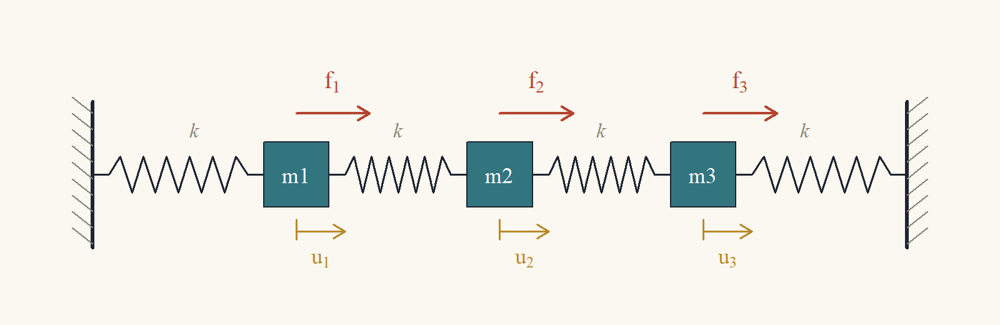
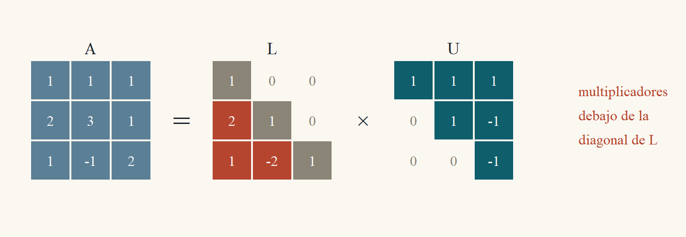
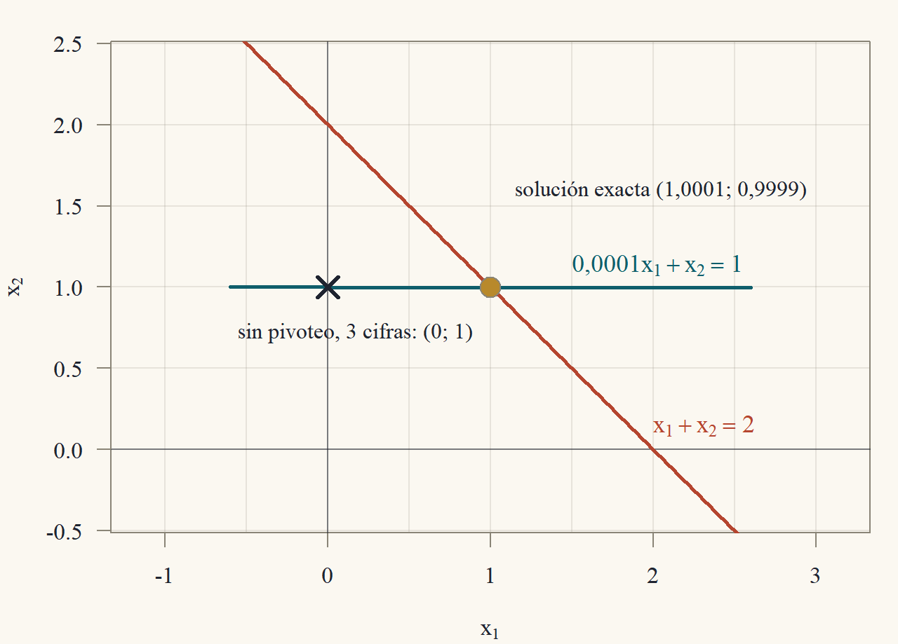

::: {.content-visible when-format="html"}
<a class="descarga-pdf" href="clase-02.pdf">Descargar esta clase en PDF</a>
:::

# La misma estructura, muchas cargas

Un ingeniero que diseña una estructura no la calcula para **una** carga: la calcula para el peso propio, para el viento desde cada lado, para un sismo, para la nieve. La estructura (la matriz $A$) es siempre la misma y lo que cambia es la carga (el vector $b$). Resolver $Ax = b$ desde cero para cada $b$ repite el trabajo más caro, la eliminación, una y otra vez. La idea de esta clase es **hacer la eliminación una sola vez y guardarla**. Lo que se guarda es una factorización $A = LU$.

Usaremos de ejemplo la cadena de la @fig-resortes: tres masas unidas por cuatro resortes iguales de constante $k$, entre dos paredes fijas. Se aplican fuerzas $f_1,f_2,f_3$ a las masas y queremos los desplazamientos de equilibrio $u_1,u_2,u_3$.

{#fig-resortes width=90%}

Un resorte estirado una longitud $s$ ejerce una fuerza $ks$ (ley de Hooke). El resorte entre la masa $i - 1$ y la masa $i$ queda estirado $u_i - u_{i-1}$ y tira de la masa $i$ hacia atrás con fuerza $k(u_i - u_{i-1})$; el resorte entre $i$ y $i + 1$ queda estirado $u_{i+1} - u_i$ y tira de la masa $i$ hacia adelante con fuerza $k(u_{i+1} - u_i)$. Las paredes no se mueven: $u_0 = u_4 = 0$. En equilibrio, la fuerza externa compensa la de los resortes:
$$
f_i = k(u_i - u_{i-1}) - k(u_{i+1} - u_i) = k\big(-u_{i-1} + 2u_i - u_{i+1}\big),\qquad i = 1,2,3.
$$
Con $k = 1$ (en unidades convenientes) esto es $Ku = f$ con la **matriz de rigidez**
$$
K = \begin{pmatrix}2&-1&0\\-1&2&-1\\0&-1&2\end{pmatrix}.
$$ {#eq-rigidez}
Para cada carga $f$ hay que resolver un sistema con la misma $K$. Antes de factorizar necesitamos multiplicar matrices.

# Producto de matrices

::: {#def-producto-matrices}
## Producto de matrices
Si $A$ es $m\times n$ y $B$ es $n\times p$, el producto $AB$ es la matriz $m\times p$ con entradas
$$
(AB)_{ij} = \sum_{\ell = 1}^na_{i\ell}b_{\ell j} = a_{i1}b_{1j} + a_{i2}b_{2j} + \dots + a_{in}b_{nj}.
$$
Solo está definido si el número de columnas de $A$ coincide con el número de filas de $B$.
:::

Como el producto matriz–vector de la Clase 1, el producto de matrices admite varias lecturas. Llamemos $b_j$ a la columna $j$ de $B$.

::: {#prp-lecturas-producto}
## Lecturas del producto
1. **Por columnas:** la columna $j$ de $AB$ es $Ab_j$. Es decir, $AB = \big(Ab_1\ \ Ab_2\ \cdots\ Ab_p\big)$.
2. **Por filas:** la fila $i$ de $AB$ es la combinación de las filas de $B$ con los coeficientes de la fila $i$ de $A$: $\sum_\ell a_{i\ell}\,(\text{fila }\ell\text{ de }B)$.
:::

::: {.proof}
*Parte 1.* La componente $i$ de $Ab_j$ es, por definición del producto matriz–vector, $\sum_\ell a_{i\ell}(b_j)_\ell = \sum_\ell a_{i\ell}b_{\ell j}$, que es $(AB)_{ij}$. Como coinciden para todo $i$, la columna $j$ de $AB$ es $Ab_j$.

*Parte 2.* La entrada $j$ de la combinación $\sum_\ell a_{i\ell}(\text{fila }\ell\text{ de }B)$ es $\sum_\ell a_{i\ell}b_{\ell j}$, porque la entrada $j$ de la fila $\ell$ de $B$ es $b_{\ell j}$. Es $(AB)_{ij}$ para todo $j$.
:::

::: {#exm-producto-2x2}
## El orden importa
Con $A = \begin{pmatrix}1&2\\0&1\end{pmatrix}$ y $B = \begin{pmatrix}0&1\\1&0\end{pmatrix}$:
$$
AB = \begin{pmatrix}1\cdot0 + 2\cdot1&1\cdot1 + 2\cdot0\\0\cdot0 + 1\cdot1&0\cdot1 + 1\cdot0\end{pmatrix} = \begin{pmatrix}2&1\\1&0\end{pmatrix},
$$
$$
BA = \begin{pmatrix}0\cdot1 + 1\cdot0&0\cdot2 + 1\cdot1\\1\cdot1 + 0\cdot0&1\cdot2 + 0\cdot1\end{pmatrix} = \begin{pmatrix}0&1\\1&2\end{pmatrix}.
$$
$AB\ne BA$: **el producto de matrices no es conmutativo**. Por filas se entiende por qué: $B$ intercambia filas, así que $BA$ es $A$ con las filas intercambiadas, y $AB$ es $A$ con las **columnas** intercambiadas (por la lectura por columnas, la columna 1 de $AB$ es $Ab_1 = A e_2$, la segunda columna de $A$).
:::

Aunque no conmuta, el producto cumple las propiedades que uno espera de una multiplicación.

::: {#prp-propiedades-producto}
## Propiedades del producto
Para matrices de tamaños compatibles:

1. **Asociatividad:** $(AB)C = A(BC)$.
2. **Distributividad:** $A(B + C) = AB + AC$ y $(A + B)C = AC + BC$.
3. **Identidad:** $IA = A = AI$, con $I$ la identidad del tamaño adecuado.
4. **Transpuesta de un producto:** $(AB)' = B'A'$ (el orden se invierte).
:::

::: {.callout-note title="Borrador"}
Todas se prueban comparando una entrada genérica $(i,j)$ de cada lado y manipulando sumas. La asociatividad es la única con dos sumas anidadas: al expandir, aparece $\sum_\ell\sum_q a_{i\ell}b_{\ell q}c_{qj}$ de los dos lados, solo que sumada en distinto orden.
:::

::: {.proof}
Sean $A$ de $m\times n$, $B$ de $n\times p$ y $C$ de $p\times r$ en la parte 1.

*Parte 1.* Por la definición aplicada dos veces,
$$
((AB)C)_{ij} = \sum_{q = 1}^p(AB)_{iq}c_{qj} = \sum_{q = 1}^p\Big(\sum_{\ell = 1}^na_{i\ell}b_{\ell q}\Big)c_{qj} = \sum_{q = 1}^p\sum_{\ell = 1}^na_{i\ell}b_{\ell q}c_{qj},
$$
donde se distribuyó $c_{qj}$ dentro de la suma interior. Del otro lado,
$$
(A(BC))_{ij} = \sum_{\ell = 1}^na_{i\ell}(BC)_{\ell j} = \sum_{\ell = 1}^na_{i\ell}\Big(\sum_{q = 1}^pb_{\ell q}c_{qj}\Big) = \sum_{\ell = 1}^n\sum_{q = 1}^pa_{i\ell}b_{\ell q}c_{qj}.
$$
Las dos dobles sumas tienen los mismos $np$ términos $a_{i\ell}b_{\ell q}c_{qj}$, uno por cada par $(\ell,q)$, sumados en distinto orden; una suma finita no depende del orden. Son iguales.

*Parte 2.* $(A(B + C))_{ij} = \sum_\ell a_{i\ell}(b_{\ell j} + c_{\ell j}) = \sum_\ell a_{i\ell}b_{\ell j} + \sum_\ell a_{i\ell}c_{\ell j} = (AB)_{ij} + (AC)_{ij}$. La otra igualdad es análoga: $((A + B)C)_{ij} = \sum_\ell(a_{i\ell} + b_{i\ell})c_{\ell j} = \sum_\ell a_{i\ell}c_{\ell j} + \sum_\ell b_{i\ell}c_{\ell j}$.

*Parte 3.* Las entradas de $I$ son $\delta_{i\ell} = 1$ si $i = \ell$ y $0$ si no. Entonces $(IA)_{ij} = \sum_\ell\delta_{i\ell}a_{\ell j}$; el único término no nulo es el de $\ell = i$, que vale $a_{ij}$. Igual para $AI$.

*Parte 4.* La entrada $(i,j)$ de una transpuesta es la $(j,i)$ de la original. Entonces $((AB)')_{ij} = (AB)_{ji} = \sum_\ell a_{j\ell}b_{\ell i}$. Por otro lado, $(B'A')_{ij} = \sum_\ell(B')_{i\ell}(A')_{\ell j} = \sum_\ell b_{\ell i}a_{j\ell}$. Los términos son los mismos ($a_{j\ell}b_{\ell i} = b_{\ell i}a_{j\ell}$).
:::

# La eliminación es una factorización

## El hecho central

En la Clase 1 (Ejercicio 1.7 ★) se observó, para una matriz $3\times3$, que los multiplicadores de la eliminación forman una matriz triangular inferior $L$ tal que $A = LU$. Eso vale siempre que la eliminación no necesite intercambios.

::: {#def-triangular}
## Matrices triangulares
Una matriz cuadrada es **triangular inferior** si todas sus entradas sobre la diagonal son cero ($t_{ij} = 0$ si $i<j$), y **triangular superior** si son cero todas las de debajo ($t_{ij} = 0$ si $i>j$). Es **unitriangular inferior** si además tiene unos en la diagonal.
:::

::: {#thm-lu}
## Factorización LU
Sea $A$ una matriz $n\times n$ cuya eliminación gaussiana no requiere intercambios de filas (todos los pivotes que van apareciendo son distintos de cero). Sean $U$ la forma escalonada resultante y $\ell_{ij}$ ($i>j$) el multiplicador usado para anular la entrada $(i,j)$ (de modo que la operación fue $F_i\leftarrow F_i - \ell_{ij}F_j$). Entonces
$$
A = LU,\qquad L = \begin{pmatrix}1&0&\cdots&0\\\ell_{21}&1&\cdots&0\\\vdots&&\ddots&\vdots\\\ell_{n1}&\ell_{n2}&\cdots&1\end{pmatrix},
$$
con $L$ unitriangular inferior y $U$ triangular superior con los pivotes en la diagonal.
:::

::: {.callout-note title="Borrador"}
Cada paso $F_i\leftarrow F_i - \ell_{ij}F_j$ es multiplicar por $E_{ij} = I - \ell_{ij}e_ie_j'$ (Clase 1, ★). Toda la eliminación es $E\,A = U$ con $E$ el producto de estas matrices en el orden en que se aplicaron. Despejando, $A = E^{-1}U$, y $E^{-1}$ es el producto de las inversas $I + \ell_{ij}e_ie_j'$ **en el orden contrario**. Lo sorprendente es que ese producto no mezcla nada: los multiplicadores aparecen tal cual, cada uno en su casilla. Para verlo, expando el producto y muestro que todos los productos cruzados $e_ie_j'e_ke_\ell'$ se anulan, porque contienen un $e_j'e_k = 0$.
:::

::: {.proof}
*Paso 1: la eliminación como producto.* Recordemos que $e_j'e_k$ (el producto de la fila $e_j'$ por la columna $e_k$) vale $1$ si $j = k$ y $0$ si $j\ne k$. Por la proposición de matrices elementales de la Clase 1, la operación $F_i\leftarrow F_i - \ell_{ij}F_j$ equivale a multiplicar a la izquierda por $E_{ij} = I - \ell_{ij}e_ie_j'$, cuya inversa es $E_{ij}^{-1} = I + \ell_{ij}e_ie_j'$. La eliminación procesa las columnas $j = 1,2,\dots,n - 1$ y, dentro de cada columna, las filas $i = j + 1,\dots,n$. Si ordenamos los pares $(i,j)$ en ese orden de aplicación, la eliminación es
$$
U = E_{n,n-1}\cdots E_{3,1}E_{2,1}\,A,
$$
con el primer paso aplicado ($E_{21}$) más cerca de $A$. Multiplicando a la izquierda por las inversas, en el orden contrario, se obtiene $A = E_{21}^{-1}E_{31}^{-1}\cdots E_{n,n-1}^{-1}\,U$. Llamemos $L$ a ese producto de inversas.

*Paso 2: expandir el producto.* $L$ es un producto de factores $(I + \ell_{ij}e_ie_j')$, ordenados por columna $j$ creciente y, dentro de cada columna, por fila $i$ creciente. Al expandirlo (distribuyendo, @prp-propiedades-producto) aparece: el término $I$; un término $\ell_{ij}e_ie_j'$ por cada factor; y términos con dos o más factores $\ell_{ij}e_ie_j'\,\ell_{k\ell}e_ke_\ell'\cdots$ con los factores en el orden del producto.

*Paso 3: los términos cruzados son cero.* Tomemos dos factores consecutivos en un término cruzado, $\ell_{ij}e_ie_j'$ y luego $\ell_{k\ell}e_ke_\ell'$, donde $(k,\ell)$ viene después que $(i,j)$ en el orden. Su producto contiene, en el medio, el número $e_j'e_k$. Veamos que $k\ne j$. Como $(k,\ell)$ viene después, su columna $\ell$ es mayor o igual que $j$. Y en cada factor la fila es mayor que la columna: $k>\ell$. Entonces $k>\ell\ge j$, así que $k\ne j$ y $e_j'e_k = 0$. Por lo tanto, todo término con dos o más factores es cero.

*Paso 4: conclusión.* Queda $L = I + \sum_{i>j}\ell_{ij}e_ie_j'$. La matriz $e_ie_j'$ tiene un $1$ en la posición $(i,j)$ y ceros en el resto. Entonces $L$ tiene unos en la diagonal, el multiplicador $\ell_{ij}$ en cada posición $(i,j)$ con $i>j$, y ceros sobre la diagonal: es la matriz del enunciado. Por construcción, $U$ es la forma escalonada, triangular superior con los pivotes en la diagonal.
:::

{#fig-patron-lu width=88%}

::: {#exm-lu2}
## LU de una matriz $2\times2$
Para $A = \begin{pmatrix}4&3\\8&10\end{pmatrix}$, el único multiplicador es $\ell_{21} = 8/4 = 2$, y $F_2 - 2F_1 = (8 - 8,\ 10 - 6) = (0,\ 4)$:
$$
A = \begin{pmatrix}4&3\\8&10\end{pmatrix} = \underbrace{\begin{pmatrix}1&0\\2&1\end{pmatrix}}_{L}\underbrace{\begin{pmatrix}4&3\\0&4\end{pmatrix}}_{U}.
$$
Comprobación por la definición: $(LU)_{21} = 2\cdot4 + 1\cdot0 = 8$ y $(LU)_{22} = 2\cdot3 + 1\cdot4 = 10$ ✓.
:::

::: {#exm-lu-rigidez}
## LU de la matriz de rigidez
Para $K$ en @eq-rigidez:

*Columna 1.* Pivote $2$. Multiplicadores $\ell_{21} = -1/2$ y $\ell_{31} = 0/2 = 0$. La fila 2 pasa a $F_2 - (-\tfrac12)F_1 = (-1 + 1,\ 2 - \tfrac12,\ -1 + 0) = (0,\ \tfrac32,\ -1)$; la fila 3 no cambia.

*Columna 2.* Pivote $\tfrac32$. Multiplicador $\ell_{32} = (-1)/\tfrac32 = -\tfrac23$. La fila 3 pasa a $F_3 + \tfrac23F_2 = (0,\ -1 + 1,\ 2 - \tfrac23) = (0,\ 0,\ \tfrac43)$.

Entonces
$$
K = \underbrace{\begin{pmatrix}1&0&0\\-\tfrac12&1&0\\0&-\tfrac23&1\end{pmatrix}}_{L}\underbrace{\begin{pmatrix}2&-1&0\\0&\tfrac32&-1\\0&0&\tfrac43\end{pmatrix}}_{U}.
$$
Comprobación de la fila 3 de $LU$ (combinación de las filas de $U$ con coeficientes $0,-\tfrac23,1$): $-\tfrac23(0,\tfrac32,-1) + (0,0,\tfrac43) = (0,\ -1,\ \tfrac23 + \tfrac43) = (0,-1,2)$ ✓. Notar que **la estructura tridiagonal se conserva**: $L$ solo tiene entradas en la subdiagonal y $U$ en la diagonal y la sobrediagonal.
:::

## Resolver con $LU$

Con $A = LU$, el sistema $Ax = b$ es $L(Ux) = b$. Llamando $c = Ux$, se resuelve en dos etapas triangulares:

::: {.callout-caution title="Algoritmo: resolver Ax = b con A = LU"}
1. **Factorizar** $A = LU$ (una sola vez): $\approx\tfrac23n^3$ flops.
2. Para cada lado derecho $b$:
    a. **Sustitución hacia adelante:** resolver $Lc = b$ desde la primera ecuación hacia abajo ($c_1 = b_1$, $c_2 = b_2 - \ell_{21}c_1$, …): $\approx n^2$ flops.
    b. **Sustitución hacia atrás:** resolver $Ux = c$ desde la última ecuación hacia arriba: $\approx n^2$ flops.

**Falla** si algún pivote es cero (hace falta pivoteo, más abajo). Con $p$ lados derechos, el costo total es $\approx\tfrac23n^3 + 2pn^2$ en vez de $p\cdot\tfrac23n^3$.
:::

Que la etapa 2a sea correcta es la misma idea de la sustitución hacia atrás, pero de arriba hacia abajo: la ecuación $i$ de $Lc = b$ es $\ell_{i1}c_1 + \dots + \ell_{i,i-1}c_{i-1} + c_i = b_i$ (el coeficiente de $c_i$ es $1$ y no hay términos a la derecha porque $L$ es triangular inferior), así que $c_i = b_i - \sum_{j<i}\ell_{ij}c_j$ queda determinado por los $c_j$ ya calculados.

::: {#exm-tres-cargas}
## Tres casos de carga para la cadena de resortes
Con la factorización del @exm-lu-rigidez resolvemos $Ku = f$ para tres cargas.

*Carga uniforme $f = (2,2,2)'$.* Adelante: $c_1 = 2$; $c_2 = 2 - (-\tfrac12)(2) = 3$; $c_3 = 2 - 0\cdot2 - (-\tfrac23)(3) = 4$. Atrás: $\tfrac43u_3 = 4\Rightarrow u_3 = 3$; $\tfrac32u_2 - u_3 = 3\Rightarrow\tfrac32u_2 = 6\Rightarrow u_2 = 4$; $2u_1 - u_2 = 2\Rightarrow 2u_1 = 6\Rightarrow u_1 = 3$. Desplazamientos $u = (3,4,3)'$: la masa del medio se mueve más, como era de esperar.

*Carga puntual en el centro, $f = (0,4,0)'$.* Adelante: $c_1 = 0$; $c_2 = 4 + \tfrac12\cdot0 = 4$; $c_3 = 0 + \tfrac23\cdot4 = \tfrac83$. Atrás: $u_3 = \tfrac83/\tfrac43 = 2$; $\tfrac32u_2 - 2 = 4\Rightarrow u_2 = 4$; $2u_1 - 4 = 0\Rightarrow u_1 = 2$. Resultado $u = (2,4,2)'$.

*Carga en la primera masa, $f = (4,0,0)'$.* Adelante: $c_1 = 4$; $c_2 = 0 + \tfrac12\cdot4 = 2$; $c_3 = 0 + \tfrac23\cdot2 = \tfrac43$. Atrás: $u_3 = 1$; $\tfrac32u_2 - 1 = 2\Rightarrow u_2 = 2$; $2u_1 - 2 = 4\Rightarrow u_1 = 3$. Resultado $u = (3,2,1)'$.

Verificación de la tercera: $Ku = (6 - 2,\ -3 + 4 - 1,\ -2 + 2)' = (4,0,0)'$ ✓. La factorización se hizo una vez; cada carga costó solo dos sustituciones.
:::

# Pivoteo

## Pivotes nulos y pivotes pequeños

La eliminación sin intercambios falla si aparece un pivote **cero** (como en el propano de la Clase 1). Hay un problema más sutil: un pivote **muy pequeño** no detiene el algoritmo, pero lo arruina cuando se trabaja con precisión finita, como hacen los computadores.

::: {#exm-pivote-chico}
## Un pivote pequeño en aritmética de tres cifras
Consideremos
$$
\begin{aligned}
0{,}0001\,x_1 + x_2 &= 1\\
x_1 + x_2 &= 2,
\end{aligned}
$$
cuya solución exacta es $x_1 = 1/0{,}9999\approx1{,}0001$ y $x_2 = 0{,}9998/0{,}9999\approx0{,}9999$. Supongamos que cada resultado intermedio se **redondea a tres cifras significativas**.

*Sin intercambio.* El pivote es $0{,}0001$ y el multiplicador es $\ell_{21} = 1/0{,}0001 = 10\,000$. La nueva fila 2 tiene coeficiente $1 - 10\,000\cdot1 = -9\,999$, que se redondea a $-10\,000$, y lado derecho $2 - 10\,000\cdot1 = -9\,998$, que también se redondea a $-10\,000$. Entonces $x_2 = (-10\,000)/(-10\,000) = 1{,}00$ y, de la fila 1, $0{,}0001\,x_1 = 1 - 1{,}00 = 0$, así que $x_1 = 0$. **El valor de $x_1$ está completamente equivocado.**

*Con intercambio* (pivote $1$, el mayor de la columna). Ahora la fila 1 es $x_1 + x_2 = 2$ y el multiplicador es $\ell_{21} = 0{,}0001$. La fila 2 pasa a tener coeficiente $1 - 0{,}0001 = 0{,}9999\to1{,}00$ y lado derecho $1 - 0{,}0002 = 0{,}9998\to1{,}00$, así que $x_2 = 1{,}00$ y $x_1 = 2 - 1{,}00 = 1{,}00$: correcto a tres cifras.
:::

{#fig-pivoteo width=65%}

¿Qué salió mal? El multiplicador enorme ($10\,000$) hizo que la fila 2 nueva quedara dominada por $-10\,000$ veces la fila 1, y el redondeo **borró la información propia de la fila 2** (el $1$ y el $2$ originales desaparecieron en $-9\,999$ y $-9\,998$). La regla para evitarlo es simple.

::: {.callout-caution title="Algoritmo: pivoteo parcial"}
En cada etapa $k$, antes de eliminar, buscar en la columna $k$, desde la fila $k$ hacia abajo, la entrada de **mayor valor absoluto**, e intercambiar su fila con la fila $k$. Así todos los multiplicadores cumplen $|\ell_{ij}|\le1$, y ninguna fila se suma con un factor que la haga dominar a otra.

Costo extra: solo comparaciones (del orden de $n^2$ en total), despreciables frente a los $\tfrac23n^3$ flops.
:::

## $PA = LU$

Con intercambios, la factorización se escribe con una **matriz de permutación** $P$: la identidad con sus filas reordenadas.

::: {#thm-pa-lu}
## Factorización con pivoteo
Si $A$ es $n\times n$ e invertible, la eliminación gaussiana con intercambios de filas nunca se detiene, y existe una matriz de permutación $P$ tal que
$$
PA = LU,
$$
con $L$ unitriangular inferior y $U$ triangular superior con diagonal sin ceros.
:::

La invertibilidad se define formalmente en la próxima sección; aquí basta usar una consecuencia: si $A$ es invertible y $Ax = 0$, entonces $x = 0$ (multiplicando por $A^{-1}$).

::: {.callout-note title="Borrador"}
Dos cosas que probar. (1) Nunca falta un pivote: si en la etapa $k$ la columna $k$ fuera cero desde la fila $k$ hacia abajo, construiría un $x\ne0$ con (matriz actual)$\,x = 0$, y como la matriz actual es $A$ multiplicada por matrices invertibles, eso daría $Ax = 0$ con $x\ne0$. (2) Los intercambios se pueden "hacer al principio": si supiera desde el comienzo qué filas voy a usar como pivote en cada etapa, podría ordenar $A$ así antes de empezar, y la eliminación de esa matriz reordenada no necesitaría intercambios.
:::

::: {.proof}
*Parte 1: siempre hay pivote.* Supongamos que la eliminación llegó a la etapa $k$ con una matriz $M = EA$, donde $E$ es el producto de las matrices elementales usadas (intercambios y reemplazos), que es invertible. Las primeras $k - 1$ columnas de $M$ ya están escalonadas, con pivotes $m_{11},\dots,m_{k-1,k-1}$ distintos de cero, y en esas columnas $M$ tiene ceros debajo de la diagonal. Supongamos, por contradicción, que las entradas $m_{kk},m_{k+1,k},\dots,m_{nk}$ son **todas cero**. Construimos $x\ne0$ con $Mx = 0$:

- Ponemos $x_k = 1$ y $x_{k+1} = \dots = x_n = 0$.
- Para $x_1,\dots,x_{k-1}$ resolvemos, de abajo hacia arriba, las ecuaciones $i = k - 1, k - 2, \dots, 1$: $m_{ii}x_i + \sum_{j = i+1}^{k-1}m_{ij}x_j + m_{ik}\cdot1 = 0$. Se puede porque $m_{ii}\ne0$ y los $x_j$ con $j>i$ ya están calculados (es una sustitución hacia atrás).

Con esto las filas $1,\dots,k - 1$ de $Mx$ son cero. Las filas $i\ge k$ también: en esas filas, las columnas $1,\dots,k$ de $M$ son cero (las primeras $k - 1$ por la forma escalonada y la $k$-ésima por la suposición), y $x_j = 0$ para $j>k$; así $(Mx)_i = \sum_jm_{ij}x_j = 0$. Entonces $Mx = 0$ con $x\ne0$ (porque $x_k = 1$). Pero $Mx = EAx = 0$ implica, multiplicando por $E^{-1}$, $Ax = 0$, y como $A$ es invertible, $x = 0$: contradicción. Luego alguna entrada de la columna $k$ desde la fila $k$ es distinta de cero, y hay pivote. Como esto vale en cada etapa, $U$ tiene los $n$ pivotes no nulos en su diagonal.

*Parte 2: $PA = LU$.* Una vez terminada la eliminación sabemos qué fila original de $A$ terminó en cada posición: sea $P$ la permutación que coloca en la posición $1$ la fila original que quedó primera, en la posición $2$ la que quedó segunda, etcétera. Apliquemos la eliminación **sin intercambios** a $PA$. En la etapa $1$, el pivote de $PA$ es la entrada de la fila que la eliminación original eligió como primer pivote: es distinta de cero, y se restan de cada fila los mismos múltiplos que antes, porque un reemplazo $F_i\leftarrow F_i - \ell F_1$ hace lo mismo con la fila sin importar en qué posición esté guardada. Lo mismo ocurre en cada etapa: las filas de $PA$ ya están en el orden en que la eliminación original las iba a necesitar, de modo que los intercambios sobran, y todos los pivotes son los de la eliminación original (distintos de cero). Por el @thm-lu, $PA = LU$.
:::

::: {#exm-pa-lu}
## $PA = LU$ con un pivote nulo
Para $A = \begin{pmatrix}0&2\\3&1\end{pmatrix}$, la entrada $(1,1)$ es cero. Intercambiamos las filas con $P = \begin{pmatrix}0&1\\1&0\end{pmatrix}$: $PA = \begin{pmatrix}3&1\\0&2\end{pmatrix}$, que ya es triangular superior. Entonces $L = I$, $U = PA$, y $PA = LU$ trivialmente. Para resolver $Ax = b$ con $b = (4,5)'$: $PAx = Pb = (5,4)'$, es decir $3x_1 + x_2 = 5$, $2x_2 = 4$; luego $x_2 = 2$ y $x_1 = 1$. Verificación en el original: $0 + 4 = 4$ ✓ y $3 + 2 = 5$ ✓.
:::

# La inversa

## Definición y propiedades

::: {#def-inversa}
## Matriz inversa
Una matriz cuadrada $A$ es **invertible** si existe una matriz $B$ del mismo tamaño con $AB = I$ y $BA = I$. Tal $B$ se llama **inversa** de $A$ y se escribe $A^{-1}$. Una matriz que no es invertible se llama **singular**.
:::

::: {#prp-inversa}
## Propiedades de la inversa
1. La inversa, si existe, es **única**.
2. Si $A$ es invertible, $Ax = b$ tiene la solución única $x = A^{-1}b$.
3. Si $A$ y $B$ son invertibles, $AB$ también lo es y $(AB)^{-1} = B^{-1}A^{-1}$ (el orden se invierte).
4. Si $A$ es invertible, $A'$ también, y $(A')^{-1} = (A^{-1})'$.
:::

::: {.proof}
*Parte 1.* Si $B$ y $C$ son inversas de $A$: $B = BI = B(AC) = (BA)C = IC = C$, usando $AC = I$, la asociatividad y $BA = I$.

*Parte 2.* *Existe:* $A(A^{-1}b) = (AA^{-1})b = Ib = b$. *Es única:* si $Ax = b$, multiplicando por $A^{-1}$ a la izquierda, $A^{-1}Ax = A^{-1}b$, es decir $x = A^{-1}b$.

*Parte 3.* $(AB)(B^{-1}A^{-1}) = A(BB^{-1})A^{-1} = AIA^{-1} = AA^{-1} = I$, y $(B^{-1}A^{-1})(AB) = B^{-1}(A^{-1}A)B = B^{-1}B = I$.

*Parte 4.* Transponiendo $AA^{-1} = I$ con la regla $(XY)' = Y'X'$: $(A^{-1})'A' = I' = I$. Transponiendo $A^{-1}A = I$: $A'(A^{-1})' = I$. Entonces $(A^{-1})'$ cumple la definición de inversa de $A'$.
:::

La definición pide dos productos, $AB = I$ y $BA = I$. Para matrices cuadradas basta uno.

::: {#prp-un-lado}
## Para matrices cuadradas basta un lado
Si $A$ y $B$ son $n\times n$ y $AB = I$, entonces $BA = I$, y por lo tanto $B = A^{-1}$.
:::

::: {.proof}
*Paso 1: $A$ tiene $n$ pivotes.* Para todo $b$, el vector $x = Bb$ resuelve $Ax = b$: $A(Bb) = (AB)b = b$. Así $Ax = b$ tiene solución para **todo** $b$. Por el corolario de los sistemas cuadrados de la Clase 1, si $A$ tuviera menos de $n$ pivotes, existiría algún $b$ sin solución. Luego tiene $n$ pivotes, y por ese mismo corolario $Ax = b$ tiene solución **única** para todo $b$; en particular, $Ax = 0$ solo tiene la solución $x = 0$.

*Paso 2: $BA = I$.* Calculemos $A(BA - I) = (AB)A - A = IA - A = 0$. Entonces cada columna $z$ de la matriz $BA - I$ cumple $Az = 0$ (por la lectura por columnas, la columna $j$ de $A(BA - I)$ es $A$ por la columna $j$ de $BA - I$). Por el paso 1, $z = 0$. Todas las columnas de $BA - I$ son cero: $BA = I$.
:::

## La inversa $2\times2$

::: {#prp-inversa-2x2}
## Inversa de una matriz $2\times2$
Sea $A = \begin{pmatrix}a&b\\c&d\end{pmatrix}$. Si $ad - bc\ne0$,
$$
A^{-1} = \frac1{ad - bc}\begin{pmatrix}d&-b\\-c&a\end{pmatrix}.
$$
Si $ad - bc = 0$, $A$ es singular.
:::

::: {.proof}
*Caso $ad - bc\ne0$.* Multiplicamos, entrada por entrada:
$$
\begin{aligned}
\begin{pmatrix}a&b\\c&d\end{pmatrix}\begin{pmatrix}d&-b\\-c&a\end{pmatrix} &= \begin{pmatrix}ad - bc&-ab + ba\\cd - dc&-cb + da\end{pmatrix}\\
&= \begin{pmatrix}ad - bc&0\\0&ad - bc\end{pmatrix} = (ad - bc)I.
\end{aligned}
$$
Dividiendo por el número $ad - bc\ne0$, la matriz del enunciado multiplicada por $A$ a la derecha da $I$; por la @prp-un-lado, es la inversa.

*Caso $ad - bc = 0$.* La cuenta anterior da $A\begin{pmatrix}d\\-c\end{pmatrix} = \begin{pmatrix}ad - bc\\cd - dc\end{pmatrix} = \begin{pmatrix}0\\0\end{pmatrix}$ y $A\begin{pmatrix}-b\\a\end{pmatrix} = \begin{pmatrix}-ab + ba\\-cb + da\end{pmatrix} = \begin{pmatrix}0\\0\end{pmatrix}$. Si alguno de los vectores $(d,-c)'$ o $(-b,a)'$ es distinto de cero, encontramos $x\ne0$ con $Ax = 0$, y $A$ no puede ser invertible (si lo fuera, $x = A^{-1}Ax = A^{-1}0 = 0$). Si ambos son cero, entonces $a = b = c = d = 0$, $A$ es la matriz nula y $Ax = 0$ para todo $x$: también es singular.
:::

El número $ad - bc$ es el **determinante** de $A$, tema de la Clase 4. Por ejemplo, $A = \begin{pmatrix}4&3\\8&10\end{pmatrix}$ tiene $ad - bc = 40 - 24 = 16$ y $A^{-1} = \tfrac1{16}\begin{pmatrix}10&-3\\-8&4\end{pmatrix}$. Comprobación de la entrada $(1,1)$ de $AA^{-1}$: $\tfrac1{16}(4\cdot10 + 3\cdot(-8)) = \tfrac{16}{16} = 1$ ✓.

## Gauss–Jordan

Para $n\ge3$ no hay una fórmula práctica. Pero la columna $j$ de $A^{-1}$ es, por la lectura por columnas, la solución de $Ax = e_j$: buscar $A^{-1}$ es resolver $n$ sistemas con la misma matriz y los lados derechos $e_1,\dots,e_n$. Se resuelven todos a la vez reduciendo la matriz aumentada $[A\mid I]$ hasta la forma escalonada reducida: si $A$ es invertible, se llega a $[I\mid A^{-1}]$.

::: {#exm-inversa-rigidez}
## Inversa de la matriz de rigidez
Primer paso, $F_2\leftarrow F_2 + \tfrac12F_1$:
$$
\left[\begin{array}{ccc|ccc}2&-1&0&1&0&0\\-1&2&-1&0&1&0\\0&-1&2&0&0&1\end{array}\right]
\longrightarrow
\left[\begin{array}{ccc|ccc}2&-1&0&1&0&0\\0&\tfrac32&-1&\tfrac12&1&0\\0&-1&2&0&0&1\end{array}\right].
$$
Segundo paso, $F_3\leftarrow F_3 + \tfrac23F_2$:
$$
\longrightarrow\left[\begin{array}{ccc|ccc}2&-1&0&1&0&0\\0&\tfrac32&-1&\tfrac12&1&0\\0&0&\tfrac43&\tfrac13&\tfrac23&1\end{array}\right].
$$
Cuentas del segundo paso, a la derecha: $(0 + \tfrac23\cdot\tfrac12,\ 0 + \tfrac23\cdot1,\ 1 + 0) = (\tfrac13,\tfrac23,1)$. Ahora escalamos las filas para que los pivotes valgan $1$: $F_1\leftarrow\tfrac12F_1$, $F_2\leftarrow\tfrac23F_2$, $F_3\leftarrow\tfrac34F_3$:
$$
\left[\begin{array}{ccc|ccc}1&-\tfrac12&0&\tfrac12&0&0\\0&1&-\tfrac23&\tfrac13&\tfrac23&0\\0&0&1&\tfrac14&\tfrac12&\tfrac34\end{array}\right].
$$
Eliminamos hacia arriba. $F_2\leftarrow F_2 + \tfrac23F_3$: a la derecha, $(\tfrac13 + \tfrac23\cdot\tfrac14,\ \tfrac23 + \tfrac23\cdot\tfrac12,\ 0 + \tfrac23\cdot\tfrac34) = (\tfrac12,\ 1,\ \tfrac12)$. Luego $F_1\leftarrow F_1 + \tfrac12F_2$: a la derecha, $(\tfrac12 + \tfrac14,\ 0 + \tfrac12,\ 0 + \tfrac14) = (\tfrac34,\ \tfrac12,\ \tfrac14)$:
$$
\left[\begin{array}{ccc|ccc}1&0&0&\tfrac34&\tfrac12&\tfrac14\\0&1&0&\tfrac12&1&\tfrac12\\0&0&1&\tfrac14&\tfrac12&\tfrac34\end{array}\right],\qquad K^{-1} = \frac14\begin{pmatrix}3&2&1\\2&4&2\\1&2&3\end{pmatrix}.
$$
Comprobación de la primera columna: $K\cdot\tfrac14(3,2,1)' = \tfrac14(6 - 2,\ -3 + 4 - 1,\ -2 + 2)' = (1,0,0)'$ ✓.

La inversa tiene una **interpretación física**: la columna $j$ de $K^{-1}$ son los desplazamientos producidos por una fuerza unitaria aplicada en la masa $j$. Por eso se llama **matriz de flexibilidad**. Todas sus entradas son positivas: empujar cualquier masa mueve a todas en la misma dirección.
:::

## Por qué casi nunca se calcula la inversa

Que $x = A^{-1}b$ sea una fórmula correcta no la hace un buen algoritmo. Calcular $A^{-1}$ por Gauss–Jordan cuesta del orden de $2n^3$ flops (tres veces más que factorizar), y después cada producto $A^{-1}b$ cuesta $2n^2$, igual que las dos sustituciones con $LU$. Además, en precisión finita, $A^{-1}b$ suele ser **menos exacto** que la solución por $LU$. La regla práctica es: **la inversa es una herramienta para razonar y para escribir fórmulas; para calcular, se factoriza**.

# Matrices por bloques

Muchas matrices tienen una estructura natural en trozos: variables de dos tipos, dos subsistemas acoplados. Se pueden partir en **bloques** y operar con los bloques como si fueran números, siempre que se respete el orden de los productos.

::: {#prp-bloques}
## Producto por bloques
Si $A = \begin{pmatrix}A_{11}&A_{12}\\A_{21}&A_{22}\end{pmatrix}$ y $B = \begin{pmatrix}B_{11}&B_{12}\\B_{21}&B_{22}\end{pmatrix}$, con las columnas de $A$ partidas igual que las filas de $B$, entonces
$$
AB = \begin{pmatrix}A_{11}B_{11} + A_{12}B_{21}&A_{11}B_{12} + A_{12}B_{22}\\A_{21}B_{11} + A_{22}B_{21}&A_{21}B_{12} + A_{22}B_{22}\end{pmatrix}.
$$
:::

::: {.proof}
Sea $q$ el número de columnas de $A_{11}$ (igual al número de filas de $B_{11}$). Tomemos una entrada $(i,j)$ con $i$ en las filas del primer bloque y $j$ en las columnas del primer bloque. Separamos la suma de la definición en los índices $\ell\le q$ y $\ell>q$:
$$
(AB)_{ij} = \sum_{\ell = 1}^qa_{i\ell}b_{\ell j} + \sum_{\ell = q+1}^na_{i\ell}b_{\ell j}.
$$
La primera suma recorre la fila $i$ de $A_{11}$ y la columna $j$ de $B_{11}$: es la entrada $(i,j)$ de $A_{11}B_{11}$. La segunda recorre la fila $i$ de $A_{12}$ y la columna $j$ de $B_{21}$: es la entrada correspondiente de $A_{12}B_{21}$. Las otras tres posiciones de bloque se prueban igual, cambiando qué bloques contienen la fila $i$ y la columna $j$.
:::

## Eliminación por bloques y complemento de Schur

Supongamos que $M = \begin{pmatrix}A&B\\C&D\end{pmatrix}$ con $A$ cuadrado e invertible. La eliminación "por bloques" resta a la segunda fila de bloques $CA^{-1}$ veces la primera, que es lo que anula el bloque $C$:
$$
\begin{aligned}
\begin{pmatrix}I&0\\-CA^{-1}&I\end{pmatrix}\begin{pmatrix}A&B\\C&D\end{pmatrix} &= \begin{pmatrix}A&B\\-CA^{-1}A + C&-CA^{-1}B + D\end{pmatrix}\\
&= \begin{pmatrix}A&B\\0&D - CA^{-1}B\end{pmatrix},
\end{aligned}
$$
donde se usó la @prp-bloques y $CA^{-1}A = C$. El bloque que aparece donde iba el último pivote,
$$
S = D - CA^{-1}B,
$$
es el **complemento de Schur** de $A$ en $M$. Desempeña el papel de un pivote "en bloque". Con él, el sistema
$$
\begin{pmatrix}A&B\\C&D\end{pmatrix}\begin{pmatrix}x\\y\end{pmatrix} = \begin{pmatrix}f\\g\end{pmatrix}
$$
se resuelve en dos etapas: primero $Sy = g - CA^{-1}f$, después $Ax = f - By$.

::: {#prp-inversa-bloques}
## Inversa por bloques
Si $A$ y $S = D - CA^{-1}B$ son invertibles, entonces $M$ es invertible y
$$
M^{-1} = \begin{pmatrix}A^{-1} + A^{-1}BS^{-1}CA^{-1}&-A^{-1}BS^{-1}\\-S^{-1}CA^{-1}&S^{-1}\end{pmatrix}.
$$
:::

::: {.proof}
Llamemos $N$ a la matriz del enunciado y calculemos $MN$ por bloques (@prp-bloques). Bloque $(1,1)$:
$$
\begin{aligned}
A\big(A^{-1} + A^{-1}BS^{-1}CA^{-1}\big) + B\big(-S^{-1}CA^{-1}\big) &= I + BS^{-1}CA^{-1} - BS^{-1}CA^{-1}\\
&= I.
\end{aligned}
$$
Bloque $(1,2)$: $A(-A^{-1}BS^{-1}) + BS^{-1} = -BS^{-1} + BS^{-1} = 0$. Bloque $(2,1)$:
$$
\begin{aligned}
C\big(A^{-1} + A^{-1}BS^{-1}CA^{-1}\big) - DS^{-1}CA^{-1} &= CA^{-1} + (CA^{-1}B - D)S^{-1}CA^{-1}\\
&= CA^{-1} - SS^{-1}CA^{-1} = 0,
\end{aligned}
$$
usando $CA^{-1}B - D = -S$. Bloque $(2,2)$: $C(-A^{-1}BS^{-1}) + DS^{-1} = (D - CA^{-1}B)S^{-1} = SS^{-1} = I$. Entonces $MN = I$ y, por la @prp-un-lado, $N = M^{-1}$.
:::

::: {#exm-schur}
## Un complemento de Schur escalar
Partimos $M = \begin{pmatrix}2&1&1\\1&2&1\\1&1&2\end{pmatrix}$ con $A = \begin{pmatrix}2&1\\1&2\end{pmatrix}$, $B = \begin{pmatrix}1\\1\end{pmatrix}$, $C = (1\ \ 1)$ y $D = 2$. Por la fórmula $2\times2$, $A^{-1} = \tfrac13\begin{pmatrix}2&-1\\-1&2\end{pmatrix}$ (pues $ad - bc = 4 - 1 = 3$). Entonces $A^{-1}B = \tfrac13(2 - 1,\ -1 + 2)' = \tfrac13(1,1)'$ y
$$
S = D - CA^{-1}B = 2 - (1\ \ 1)\tfrac13\begin{pmatrix}1\\1\end{pmatrix} = 2 - \tfrac23 = \tfrac43.
$$
Con la @prp-inversa-bloques: $S^{-1} = \tfrac34$; el bloque $(1,2)$ es $-A^{-1}BS^{-1} = -\tfrac13\cdot\tfrac34(1,1)' = -\tfrac14(1,1)'$; el bloque $(2,1)$ es su transpuesto, $-\tfrac14(1\ \ 1)$, porque $C = B'$ y $A$ es simétrica; y el bloque $(1,1)$ es
$$
\begin{aligned}
A^{-1} + (A^{-1}B)S^{-1}(CA^{-1}) &= \tfrac13\begin{pmatrix}2&-1\\-1&2\end{pmatrix} + \tfrac13\cdot\tfrac34\cdot\tfrac13\begin{pmatrix}1&1\\1&1\end{pmatrix}\\
&= \frac1{12}\begin{pmatrix}8 + 1&-4 + 1\\-4 + 1&8 + 1\end{pmatrix} = \frac14\begin{pmatrix}3&-1\\-1&3\end{pmatrix}.
\end{aligned}
$$
Juntando: $M^{-1} = \tfrac14\begin{pmatrix}3&-1&-1\\-1&3&-1\\-1&-1&3\end{pmatrix}$. Comprobación: $M\cdot\tfrac14(3,-1,-1)' = \tfrac14(6 - 1 - 1,\ 3 - 2 - 1,\ 3 - 1 - 2)' = (1,0,0)'$ ✓.
:::

## La fórmula de Sherman–Morrison

A menudo una matriz cambia **un poco**: se agrega un resorte, se modifica una resistencia, llega un dato nuevo. Si el cambio es de la forma $uv'$ (una matriz de rango uno), no hace falta volver a factorizar ni a invertir.

::: {#thm-sherman-morrison}
## Sherman–Morrison
Sea $A$ invertible y $u,v$ vectores con $1 + v'A^{-1}u\ne0$. Entonces $A + uv'$ es invertible y
$$
(A + uv')^{-1} = A^{-1} - \frac{A^{-1}uv'A^{-1}}{1 + v'A^{-1}u}.
$$
:::

::: {.callout-note title="Borrador"}
Tengo una fórmula candidata; basta multiplicar y ver que da $I$. La clave al multiplicar es que $v'A^{-1}u$ es un **número** (fila por matriz por columna), así que puedo sacarlo de en medio de un producto. Escribo $\alpha = v'A^{-1}u$ para no perderlo.
:::

::: {.proof}
Sea $\alpha = v'A^{-1}u$, un número, y $N = A^{-1} - \dfrac{A^{-1}uv'A^{-1}}{1 + \alpha}$. Calculamos $(A + uv')N$ distribuyendo:
$$
\begin{aligned}
(A + uv')N &= AA^{-1} + uv'A^{-1}\\
&\quad - \frac{AA^{-1}uv'A^{-1}}{1 + \alpha} - \frac{u\,(v'A^{-1}u)\,v'A^{-1}}{1 + \alpha}.
\end{aligned}
$$
En el primer término $AA^{-1} = I$. En el tercero $AA^{-1}uv'A^{-1} = uv'A^{-1}$. En el cuarto, por asociatividad, el número $v'A^{-1}u = \alpha$ sale del medio: $u\,\alpha\,v'A^{-1} = \alpha\,uv'A^{-1}$. Entonces
$$
\begin{aligned}
(A + uv')N &= I + uv'A^{-1} - \frac{uv'A^{-1}}{1 + \alpha} - \frac{\alpha\,uv'A^{-1}}{1 + \alpha}\\
&= I + uv'A^{-1}\Big(1 - \frac{1 + \alpha}{1 + \alpha}\Big) = I.
\end{aligned}
$$
Por la @prp-un-lado, $N = (A + uv')^{-1}$.
:::

::: {#exm-sherman}
## Agregar un resorte a la cadena
Unimos la masa del medio a tierra con un quinto resorte de constante $1$. Ese resorte solo agrega una fuerza $-u_2$ sobre la masa 2, así que la nueva rigidez es $K + e_2e_2'$ (un $1$ más en la posición $(2,2)$). Con $u = v = e_2$ y $K^{-1}$ del @exm-inversa-rigidez: $K^{-1}e_2$ es la segunda columna, $\tfrac14(2,4,2)' = (\tfrac12,1,\tfrac12)'$, y $\alpha = e_2'K^{-1}e_2 = 1$ (la entrada $(2,2)$). Entonces
$$
\begin{aligned}
(K + e_2e_2')^{-1} &= K^{-1} - \frac{(\tfrac12,1,\tfrac12)'(\tfrac12,1,\tfrac12)}{1 + 1}\\
&= \frac14\begin{pmatrix}3&2&1\\2&4&2\\1&2&3\end{pmatrix} - \frac12\begin{pmatrix}\tfrac14&\tfrac12&\tfrac14\\\tfrac12&1&\tfrac12\\\tfrac14&\tfrac12&\tfrac14\end{pmatrix}\\
&= \begin{pmatrix}\tfrac58&\tfrac14&\tfrac18\\\tfrac14&\tfrac12&\tfrac14\\\tfrac18&\tfrac14&\tfrac58\end{pmatrix}.
\end{aligned}
$$
Comprobación con la nueva rigidez $\begin{pmatrix}2&-1&0\\-1&3&-1\\0&-1&2\end{pmatrix}$ por la primera columna: $(\tfrac{10}8 - \tfrac28,\ -\tfrac58 + \tfrac68 - \tfrac18,\ -\tfrac28 + \tfrac28)' = (1,0,0)'$ ✓. El resorte extra redujo la flexibilidad del centro de $1$ a $\tfrac12$.
:::

# ★ Para ir más allá: cuándo existe LU y por qué es única

::: {.callout-important title="★ Para ir más allá"}
El @thm-lu supone que la eliminación no encuentra pivotes nulos. Aquí caracterizamos exactamente cuándo pasa eso, en términos de las **submatrices principales** $A_k$ (la esquina superior izquierda $k\times k$ de $A$), y probamos que la factorización es única.
:::

Usaremos dos hechos sobre matrices triangulares, que se prueban con las definiciones.

::: {#lem-triangulares}
## Productos e inversas de unitriangulares
(a) El producto de dos matrices unitriangulares inferiores es unitriangular inferior. (b) Una matriz unitriangular inferior es invertible y su inversa es unitriangular inferior. (c) Una triangular superior con diagonal sin ceros es invertible y su inversa es triangular superior. (d) Una matriz que es a la vez unitriangular inferior y triangular superior es la identidad.
:::

::: {.proof}
*(a)* Si $L_1,L_2$ son unitriangulares inferiores, $(L_1L_2)_{ij} = \sum_\ell(L_1)_{i\ell}(L_2)_{\ell j}$. Un término es distinto de cero solo si $(L_1)_{i\ell}\ne0$ (lo que exige $\ell\le i$) y $(L_2)_{\ell j}\ne0$ (lo que exige $\ell\ge j$). Si $i<j$, no hay $\ell$ con $j\le\ell\le i$, y la entrada es $0$: el producto es triangular inferior. Si $i = j$, el único término es $\ell = i$, que vale $1\cdot1 = 1$.

*(b)* La columna $j$ de la inversa resuelve $Lx = e_j$. Por sustitución hacia adelante (posible porque la diagonal es de unos), $x_1 = \dots = x_{j-1} = 0$ (las primeras $j - 1$ ecuaciones tienen lado derecho cero y solo involucran $x_1,\dots,x_{i}$), $x_j = 1$, y las demás quedan determinadas. Entonces la inversa tiene ceros sobre la diagonal y unos en la diagonal.

*(c)* La columna $j$ de la inversa resuelve $Ux = e_j$. Por sustitución hacia atrás (posible porque la diagonal no tiene ceros), las ecuaciones $i = n,\dots,j + 1$ tienen lado derecho cero y dan $x_n = \dots = x_{j+1} = 0$. La inversa tiene ceros debajo de la diagonal.

*(d)* Si es triangular superior, sus entradas debajo de la diagonal son cero; si es unitriangular inferior, las de encima son cero y la diagonal es de unos. Es $I$.
:::

::: {#thm-lu-existencia}
## Existencia y unicidad de LU
Sea $A$ de $n\times n$ invertible. Entonces $A$ tiene una factorización $A = LU$ (con $L$ unitriangular inferior y $U$ triangular superior) **si y solo si** todas las submatrices principales $A_1,A_2,\dots,A_n$ son invertibles. En ese caso, la factorización es **única**.
:::

::: {.proof}
*Unicidad.* Si $A = L_1U_1 = L_2U_2$, las $U_i$ son invertibles: $U_i = L_i^{-1}A$ es producto de invertibles (@prp-inversa, parte 3). Multiplicando por $L_2^{-1}$ a la izquierda y por $U_1^{-1}$ a la derecha: $L_2^{-1}L_1 = U_2U_1^{-1}$. El lado izquierdo es unitriangular inferior (lema, partes b y a); el derecho es triangular superior, porque el producto de triangulares superiores es triangular superior (mismo argumento de la parte a, con las desigualdades invertidas). Por el lema, parte (d), ambos lados son $I$: $L_1 = L_2$ y $U_1 = U_2$.

*Si $A = LU$, las $A_k$ son invertibles.* Partimos $L$, $U$ y $A$ en bloques con la esquina $k\times k$: $L = \begin{pmatrix}L_k&0\\\ast&\ast\end{pmatrix}$ y $U = \begin{pmatrix}U_k&\ast\\0&\ast\end{pmatrix}$ (el bloque superior derecho de $L$ y el inferior izquierdo de $U$ son cero por ser triangulares). Por la @prp-bloques, el bloque $(1,1)$ de $LU$ es $L_kU_k + 0\cdot\ast = L_kU_k$, así que $A_k = L_kU_k$. $L_k$ es unitriangular (invertible); $U$ es invertible y triangular superior, así que su diagonal no tiene ceros (si $u_{kk} = 0$, la construcción del @thm-pa-lu daría $x\ne0$ con $Ux = 0$), y $U_k$ hereda esa diagonal. Entonces $A_k$ es producto de invertibles.

*Si las $A_k$ son invertibles, la eliminación no encuentra pivotes nulos.* Supongamos que la eliminación sin intercambios llegó a la etapa $k$ sin problemas, es decir, con pivotes no nulos en las columnas $1,\dots,k - 1$. Las operaciones hechas hasta ahí solo restaron múltiplos de las filas $1,\dots,k - 1$ a filas de más abajo; restringidas a las primeras $k$ filas y columnas, son la eliminación de $A_k$, y producen una matriz $k\times k$ triangular superior $T_k$ con $T_k = E_kA_k$, $E_k$ invertible. La entrada $(k,k)$ de $T_k$ es el pivote candidato. Si fuera cero, $T_k$ sería triangular superior con un cero en la diagonal, y la construcción del @thm-pa-lu (con $x_k = 1$) daría $x\ne0$ con $T_kx = 0$, de donde $A_kx = E_k^{-1}T_kx = 0$: $A_k$ sería singular, contradicción. Por inducción en $k$, todos los pivotes son no nulos y el @thm-lu da $A = LU$.
:::

El Ejercicio 2.7 muestra una matriz invertible sin factorización $LU$ (porque $A_1$ o $A_2$ es singular), que sí la tiene después de permutar filas.

::: {.callout-caution title="En más dimensiones"}
Todo vale para $n$ arbitrario: las demostraciones de esta clase son generales. En la práctica con $n$ grande aparecen dos temas nuevos: el **costo de almacenamiento** (una matriz densa $n\times n$ ocupa $n^2$ números) y el **relleno** (*fill-in*): una matriz con muchos ceros puede tener factores $L$ y $U$ llenos, salvo que se reordenen filas y columnas con cuidado. La matriz de rigidez de esta clase es tridiagonal y sus factores también lo son, lo que permite resolverla en $O(n)$ operaciones; el estudio general de matrices dispersas está en el curso de Álgebra lineal.
:::

# Resumen

- El **producto de matrices** se lee por columnas ($AB = (Ab_1\cdots Ab_p)$) o por filas. Es asociativo y distributivo, pero no conmutativo; $(AB)' = B'A'$ (@prp-propiedades-producto).
- Sin intercambios, la eliminación es una **factorización** $A = LU$: $L$ guarda los multiplicadores en su lugar y $U$ es la forma escalonada (@thm-lu).
- Con $A = LU$, cada nuevo lado derecho cuesta dos sustituciones ($\approx2n^2$ flops) en vez de una eliminación ($\approx\tfrac23n^3$).
- Un pivote pequeño destruye la precisión; el **pivoteo parcial** elige el mayor en valor absoluto. Toda matriz invertible tiene $PA = LU$ (@thm-pa-lu).
- La **inversa** es única, $(AB)^{-1} = B^{-1}A^{-1}$, y para matrices cuadradas basta $AB = I$ (@prp-un-lado). Se calcula con Gauss–Jordan, pero para resolver sistemas se prefiere factorizar.
- Por **bloques**, la eliminación produce el **complemento de Schur** $S = D - CA^{-1}B$ (@prp-inversa-bloques), y un cambio de rango uno se maneja con **Sherman–Morrison** (@thm-sherman-morrison).

# Ejercicios

**Ejercicio 2.1.** Factoriza $A = \begin{pmatrix}2&1\\6&8\end{pmatrix}$ como $LU$ y úsala para resolver $Ax = b$ con $b = (3,14)'$ y con $b = (3,4)'$.

::: {.callout-tip collapse="true" title="Solución 2.1"}
Multiplicador $\ell_{21} = 6/2 = 3$; $F_2 - 3F_1 = (6 - 6,\ 8 - 3) = (0,\ 5)$. Entonces $L = \begin{pmatrix}1&0\\3&1\end{pmatrix}$ y $U = \begin{pmatrix}2&1\\0&5\end{pmatrix}$. Comprobación: $(LU)_{21} = 3\cdot2 = 6$, $(LU)_{22} = 3\cdot1 + 5 = 8$ ✓.

*Primer lado derecho.* $Lc = (3,14)'$: $c_1 = 3$, $c_2 = 14 - 3\cdot3 = 5$. $Ux = c$: $5x_2 = 5\Rightarrow x_2 = 1$; $2x_1 + 1 = 3\Rightarrow x_1 = 1$. Solución $(1,1)$.

*Segundo lado derecho.* $c_1 = 3$, $c_2 = 4 - 9 = -5$. $5x_2 = -5\Rightarrow x_2 = -1$; $2x_1 - 1 = 3\Rightarrow x_1 = 2$. Solución $(2,-1)$. Verificación: $2\cdot2 - 1 = 3$ ✓ y $12 - 8 = 4$ ✓.
:::

**Ejercicio 2.2.** Factoriza $A = \begin{pmatrix}1&2&0\\2&5&3\\0&3&10\end{pmatrix}$ y resuelve $Ax = (3,10,13)'$.

::: {.callout-tip collapse="true" title="Solución 2.2"}
*Columna 1.* Pivote $1$; $\ell_{21} = 2$, $\ell_{31} = 0$. $F_2 - 2F_1 = (0,\ 5 - 4,\ 3 - 0) = (0,1,3)$. *Columna 2.* Pivote $1$; $\ell_{32} = 3/1 = 3$. $F_3 - 3F_2 = (0,\ 3 - 3,\ 10 - 9) = (0,0,1)$. Entonces
$$
L = \begin{pmatrix}1&0&0\\2&1&0\\0&3&1\end{pmatrix},\qquad U = \begin{pmatrix}1&2&0\\0&1&3\\0&0&1\end{pmatrix}.
$$
Adelante: $c_1 = 3$; $c_2 = 10 - 2\cdot3 = 4$; $c_3 = 13 - 0\cdot3 - 3\cdot4 = 1$. Atrás: $x_3 = 1$; $x_2 + 3\cdot1 = 4\Rightarrow x_2 = 1$; $x_1 + 2\cdot1 = 3\Rightarrow x_1 = 1$. Solución $(1,1,1)$; en efecto $A(1,1,1)' = (3,10,13)'$ ✓.
:::

**Ejercicio 2.3.** Calcula por Gauss–Jordan la inversa de $A = \begin{pmatrix}1&1&0\\0&1&1\\1&0&1\end{pmatrix}$ y verifica el resultado.

::: {.callout-tip collapse="true" title="Solución 2.3"}
Con $F_3\leftarrow F_3 - F_1$:
$$
\left[\begin{array}{ccc|ccc}1&1&0&1&0&0\\0&1&1&0&1&0\\1&0&1&0&0&1\end{array}\right]\longrightarrow\left[\begin{array}{ccc|ccc}1&1&0&1&0&0\\0&1&1&0&1&0\\0&-1&1&-1&0&1\end{array}\right].
$$
Con $F_3\leftarrow F_3 + F_2$:
$$
\longrightarrow\left[\begin{array}{ccc|ccc}1&1&0&1&0&0\\0&1&1&0&1&0\\0&0&2&-1&1&1\end{array}\right].
$$
$F_3\leftarrow\tfrac12F_3$: $(0,0,1\mid-\tfrac12,\tfrac12,\tfrac12)$. $F_2\leftarrow F_2 - F_3$: $(0,1,0\mid\tfrac12,\tfrac12,-\tfrac12)$. $F_1\leftarrow F_1 - F_2$: $(1,0,0\mid\tfrac12,-\tfrac12,\tfrac12)$. Entonces
$$
A^{-1} = \frac12\begin{pmatrix}1&-1&1\\1&1&-1\\-1&1&1\end{pmatrix}.
$$
Verificación de $AA^{-1}$, columna por columna: $A\cdot\tfrac12(1,1,-1)' = \tfrac12(1 + 1,\ 1 - 1,\ 1 - 1)' = (1,0,0)'$; $A\cdot\tfrac12(-1,1,1)' = \tfrac12(-1 + 1,\ 1 + 1,\ -1 + 1)' = (0,1,0)'$; $A\cdot\tfrac12(1,-1,1)' = \tfrac12(1 - 1,\ -1 + 1,\ 1 + 1)' = (0,0,1)'$ ✓.
:::

**Ejercicio 2.4.** Resuelve $0{,}001\,x_1 + x_2 = 1$, $x_1 + x_2 = 2$ redondeando cada resultado intermedio a **dos** cifras significativas, sin intercambio y con pivoteo parcial. Compara con la solución exacta.

::: {.callout-tip collapse="true" title="Solución 2.4"}
*Exacta:* restando, $(1 - 0{,}001)x_1 = 1$, así que $x_1 = 1/0{,}999\approx1{,}001$ y $x_2 = 2 - x_1\approx0{,}999$.

*Sin intercambio.* $\ell_{21} = 1/0{,}001 = 1000$. Coeficiente nuevo: $1 - 1000 = -999\to-1000$ (dos cifras). Lado derecho: $2 - 1000 = -998\to-1000$. Entonces $x_2 = 1{,}0$ y $0{,}001x_1 = 1 - 1{,}0 = 0$, así que $x_1 = 0$: error del $100$ % en $x_1$.

*Con pivoteo.* El mayor valor absoluto en la columna 1 es $1$ (fila 2): se intercambian las filas. $\ell_{21} = 0{,}001$. Coeficiente nuevo: $1 - 0{,}001 = 0{,}999\to1{,}0$. Lado derecho: $1 - 0{,}002 = 0{,}998\to1{,}0$. Entonces $x_2 = 1{,}0$ y $x_1 = 2 - 1{,}0 = 1{,}0$: correcto a dos cifras. El multiplicador pasó de $1000$ a $0{,}001$.
:::

**Ejercicio 2.5.** Para $M = \begin{pmatrix}4&2&2\\2&2&0\\2&0&3\end{pmatrix}$, partida con $A$ la esquina $2\times2$, calcula el complemento de Schur $S$ y usa la eliminación por bloques para resolver $Mx = (8,4,5)'$.

::: {.callout-tip collapse="true" title="Solución 2.5"}
$A = \begin{pmatrix}4&2\\2&2\end{pmatrix}$, $B = (2,0)'$, $C = (2\ \ 0)$, $D = 3$. Por la fórmula $2\times2$ ($ad - bc = 8 - 4 = 4$): $A^{-1} = \tfrac14\begin{pmatrix}2&-2\\-2&4\end{pmatrix} = \begin{pmatrix}\tfrac12&-\tfrac12\\-\tfrac12&1\end{pmatrix}$. Entonces $A^{-1}B = (1,-1)'$ y $S = 3 - (2\ \ 0)(1,-1)' = 3 - 2 = 1$.

Con $f = (8,4)'$ y $g = 5$: $A^{-1}f = (4 - 2,\ -4 + 4)' = (2,0)'$, $CA^{-1}f = 2\cdot2 + 0 = 4$. Primera etapa: $Sx_3 = g - CA^{-1}f = 5 - 4 = 1$, así que $x_3 = 1$. Segunda etapa: $A(x_1,x_2)' = f - Bx_3 = (8 - 2,\ 4 - 0)' = (6,4)'$, así que $(x_1,x_2)' = A^{-1}(6,4)' = (3 - 2,\ -3 + 4)' = (1,1)'$. Solución $(1,1,1)$; en efecto $M(1,1,1)' = (8,4,5)'$ ✓.
:::

**Ejercicio 2.6.** A la cadena de resortes se le agrega un resorte de constante $1$ que une la primera masa con la pared izquierda (además del que ya había). (a) Escribe la nueva rigidez como $K + uv'$. (b) Usa Sherman–Morrison para obtener los desplazamientos con la carga uniforme $f = (2,2,2)'$ **sin volver a factorizar**, partiendo de $u = K^{-1}f = (3,4,3)'$.

::: {.callout-tip collapse="true" title="Solución 2.6"}
(a) El resorte nuevo agrega una fuerza $-u_1$ sobre la masa 1: $K_{\text{nueva}} = K + e_1e_1'$, con $u = v = e_1$.

(b) Multiplicando la fórmula de Sherman–Morrison por $f$:
$$
K_{\text{nueva}}^{-1}f = K^{-1}f - \frac{K^{-1}e_1\,(e_1'K^{-1}f)}{1 + e_1'K^{-1}e_1}.
$$
Datos: $K^{-1}f = (3,4,3)'$; $e_1'K^{-1}f = 3$ (su primera componente); $K^{-1}e_1 = \tfrac14(3,2,1)'$ (primera columna de $K^{-1}$); $e_1'K^{-1}e_1 = \tfrac34$. Entonces
$$
u_{\text{nueva}} = \begin{pmatrix}3\\4\\3\end{pmatrix} - \frac{\tfrac14(3,2,1)'\cdot3}{\tfrac74} = \begin{pmatrix}3\\4\\3\end{pmatrix} - \frac37\begin{pmatrix}3\\2\\1\end{pmatrix} = \begin{pmatrix}12/7\\22/7\\18/7\end{pmatrix}.
$$
Verificación con $K_{\text{nueva}} = \begin{pmatrix}3&-1&0\\-1&2&-1\\0&-1&2\end{pmatrix}$: $\tfrac17(36 - 22,\ -12 + 44 - 18,\ -22 + 36)' = \tfrac17(14,14,14)' = (2,2,2)'$ ✓. El resorte extra frena sobre todo a la primera masa ($3\to1{,}71$).
:::

**Ejercicio 2.7 ★.** (a) Muestra que $A = \begin{pmatrix}0&1\\1&1\end{pmatrix}$ es invertible pero no tiene factorización $LU$, y encuentra $PA = LU$. (b) Para $B = \begin{pmatrix}1&1&0\\1&1&1\\0&1&1\end{pmatrix}$, verifica que $B_2$ es singular, que la eliminación sin intercambios falla, y encuentra $PB = LU$.

::: {.callout-tip collapse="true" title="Solución 2.7 ★"}
(a) $ad - bc = 0 - 1 = -1\ne0$: invertible. Pero $A_1 = (0)$ es singular, así que por el @thm-lu-existencia no hay $LU$. Directamente: si $\begin{pmatrix}1&0\\\ell&1\end{pmatrix}\begin{pmatrix}u_{11}&u_{12}\\0&u_{22}\end{pmatrix} = \begin{pmatrix}0&1\\1&1\end{pmatrix}$, la entrada $(1,1)$ da $u_{11} = 0$ y la $(2,1)$ da $\ell u_{11} = 1$, es decir $0 = 1$: imposible. Con $P = \begin{pmatrix}0&1\\1&0\end{pmatrix}$: $PA = \begin{pmatrix}1&1\\0&1\end{pmatrix}$, ya triangular superior: $L = I$, $U = PA$.

(b) $B_2 = \begin{pmatrix}1&1\\1&1\end{pmatrix}$ tiene $ad - bc = 1 - 1 = 0$: singular. La eliminación: $\ell_{21} = 1$, $F_2 - F_1 = (0,0,1)$: la entrada $(2,2)$ quedó en cero y no se puede seguir sin intercambio. Intercambiando las filas 2 y 3 ($P$ intercambia las filas 2 y 3 de la identidad): $PB = \begin{pmatrix}1&1&0\\0&1&1\\1&1&1\end{pmatrix}$. Eliminación de $PB$: $\ell_{21} = 0$; $\ell_{31} = 1$ y $F_3 - F_1 = (0,0,1)$; $\ell_{32} = 0$. Entonces
$$
L = \begin{pmatrix}1&0&0\\0&1&0\\1&0&1\end{pmatrix},\qquad U = \begin{pmatrix}1&1&0\\0&1&1\\0&0&1\end{pmatrix}.
$$
Comprobación de la fila 3 de $LU$: $1\cdot(1,1,0) + 0 + 1\cdot(0,0,1) = (1,1,1)$ ✓. $B$ es invertible (tiene tres pivotes no nulos tras permutar), aunque no tenga $LU$ sin permutación.
:::
