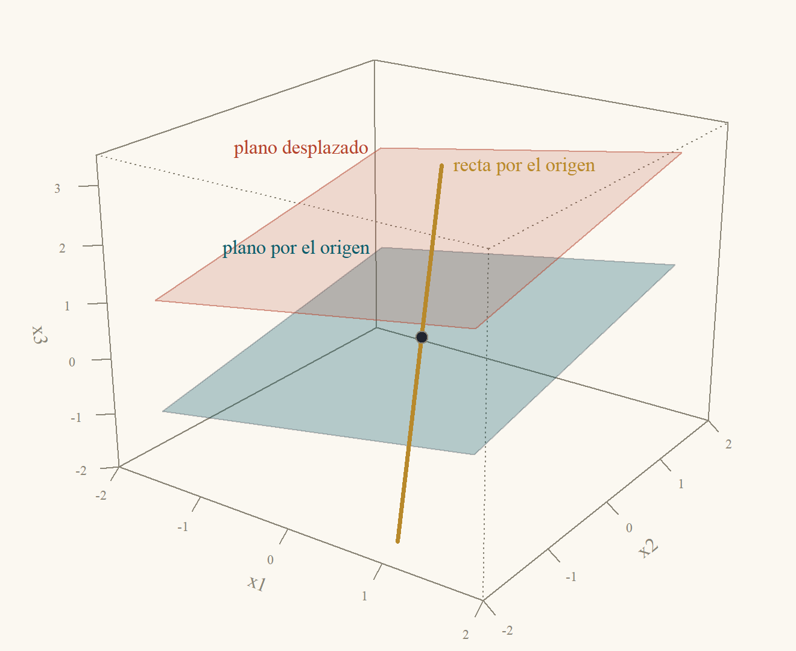
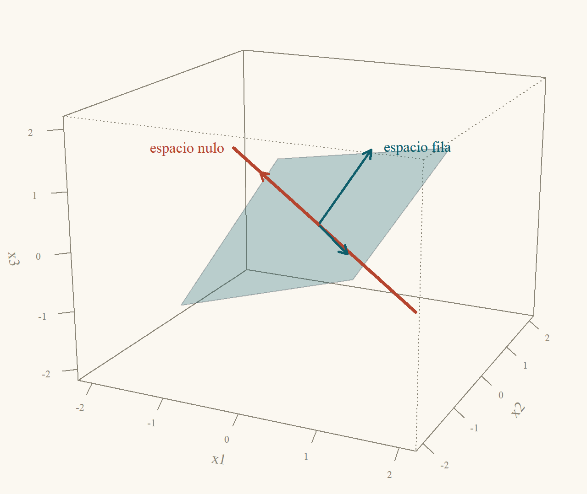
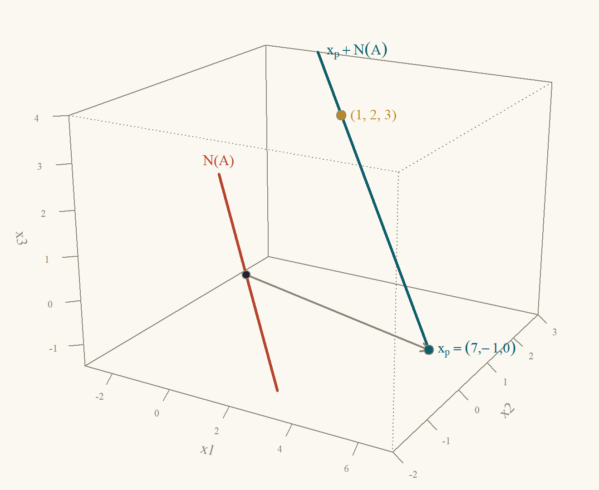
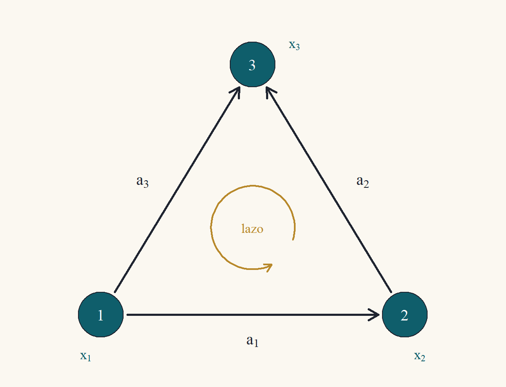

::: {.content-visible when-format="html"}
<a class="descarga-pdf" href="clase-03.pdf">Descargar esta clase en PDF</a>
:::

# Dos preguntas sobre una matriz

La Clase 1 resolvió sistemas uno a la vez. Esta clase mira la matriz $A$ completa y hace dos preguntas que no dependen de un $b$ particular:

1. **¿Qué salidas puede producir $A$?** Es decir, ¿para qué vectores $b$ tiene solución $Ax = b$?
2. **¿Qué entradas se pierden?** Es decir, ¿qué vectores $x$ produce la salida cero, $Ax = 0$? Si hay alguno distinto de cero, $A$ "no distingue" entre $x$ y $x$ más ese vector, y las soluciones de $Ax = b$ (cuando existen) no son únicas.

Las respuestas son dos **subespacios**: el espacio columna y el espacio nulo. Con la transpuesta $A'$ aparecen otros dos, y los cuatro juntos describen todo lo que una matriz hace. Antes de definirlos necesitamos un poco de vocabulario: subespacio, independencia, base y dimensión. Todo se ilustra en el plano y el espacio, donde los subespacios son rectas y planos que pasan por el origen.

# Subespacios

::: {#def-subespacio}
## Subespacio
Un conjunto $V$ de vectores de $\mathbb{R}^n$ es un **subespacio** si:

1. contiene al vector cero: $0\in V$;
2. es cerrado bajo la suma: si $u,v\in V$, entonces $u + v\in V$;
3. es cerrado bajo la multiplicación por números: si $v\in V$ y $c\in\mathbb{R}$, entonces $cv\in V$.
:::

Las condiciones 2 y 3 dicen que **no se puede salir de $V$ haciendo combinaciones lineales** de vectores de $V$. En el espacio, los subespacios son: el origen solo, las rectas que pasan por el origen, los planos que pasan por el origen y $\mathbb{R}^3$ entero (lo probaremos al final de la sección de dimensión). Un plano que **no** pasa por el origen no es un subespacio: no contiene al cero, y la suma de dos de sus puntos se sale de él (@fig-subespacios).

{#fig-subespacios width=68%}

::: {#exm-subespacios}
## Qué es y qué no es subespacio
1. $V = \{(x_1,x_2): x_2 = 2x_1\}$ (la recta $x_2 = 2x_1$ del plano) es un subespacio. Contiene a $(0,0)$ porque $0 = 2\cdot0$. Si $(x_1,2x_1)$ y $(y_1,2y_1)$ están en $V$, su suma $(x_1 + y_1,\ 2x_1 + 2y_1) = (x_1 + y_1,\ 2(x_1 + y_1))$ también, y $c(x_1,2x_1) = (cx_1,\ 2(cx_1))$ también.
2. $W = \{(x_1,x_2): x_2 = 2x_1 + 1\}$ **no** es subespacio: $(0,0)\notin W$, porque $0\ne2\cdot0 + 1$.
3. $P = \{(x_1,x_2,x_3): x_1 + x_2 + x_3 = 0\}$ es un subespacio de $\mathbb{R}^3$ (un plano por el origen). Si $x$ y $y$ cumplen la ecuación, $(x_1 + y_1) + (x_2 + y_2) + (x_3 + y_3) = (x_1 + x_2 + x_3) + (y_1 + y_2 + y_3) = 0 + 0 = 0$, y $cx_1 + cx_2 + cx_3 = c(x_1 + x_2 + x_3) = c\cdot0 = 0$.
4. $Q = \{(x_1,x_2): x_1\ge0\}$ (un semiplano) no es subespacio: $(1,0)\in Q$ pero $(-1)(1,0) = (-1,0)\notin Q$.
:::

## El espacio generado

La forma más común de fabricar un subespacio es tomar todas las combinaciones de unos vectores dados.

::: {#def-generado}
## Espacio generado
El **espacio generado** por los vectores $v_1,\dots,v_k$ de $\mathbb{R}^n$ es el conjunto de todas sus combinaciones lineales:
$$
\operatorname{gen}\{v_1,\dots,v_k\} = \{c_1v_1 + c_2v_2 + \dots + c_kv_k:\ c_1,\dots,c_k\in\mathbb{R}\}.
$$
:::

::: {#prp-generado}
## El espacio generado es un subespacio
Para todos $v_1,\dots,v_k\in\mathbb{R}^n$, $\operatorname{gen}\{v_1,\dots,v_k\}$ es un subespacio de $\mathbb{R}^n$.
:::

::: {.proof}
Verificamos las tres condiciones de la @def-subespacio.

*1. Contiene al cero.* Tomando $c_1 = \dots = c_k = 0$: $0v_1 + \dots + 0v_k = 0$.

*2. Suma.* Si $u = \sum_ic_iv_i$ y $w = \sum_id_iv_i$ son dos combinaciones, $u + w = \sum_i(c_i + d_i)v_i$, que es otra combinación (con coeficientes $c_i + d_i$).

*3. Múltiplos.* Si $u = \sum_ic_iv_i$ y $a$ es un número, $au = \sum_i(ac_i)v_i$, otra combinación.
:::

En $\mathbb{R}^3$: el espacio generado por un vector $v\ne0$ es la recta por el origen en la dirección de $v$; el generado por dos vectores no paralelos es el plano por el origen que los contiene; y el generado por tres vectores que no están en un mismo plano es todo $\mathbb{R}^3$. Cuando los vectores son "redundantes", el espacio generado es menor de lo que uno esperaría: eso es la dependencia lineal.

# Independencia lineal

::: {#def-independencia}
## Independencia lineal
Los vectores $v_1,\dots,v_k$ son **linealmente independientes** si la única combinación que da cero es la trivial:
$$
c_1v_1 + \dots + c_kv_k = 0\quad\Longrightarrow\quad c_1 = c_2 = \dots = c_k = 0.
$$
Si existe una combinación igual a cero con algún $c_i\ne0$, son **linealmente dependientes**.
:::

::: {#prp-dependencia}
## Dependencia significa que uno sobra
Los vectores $v_1,\dots,v_k$ ($k\ge2$) son linealmente dependientes si y solo si alguno de ellos es combinación lineal de los demás.
:::

::: {.proof}
*($\Rightarrow$)* Sea $c_1v_1 + \dots + c_kv_k = 0$ con algún coeficiente distinto de cero, digamos $c_j\ne0$. Despejamos $v_j$: pasamos los demás términos al otro lado y dividimos por $c_j$,
$$
v_j = -\frac{c_1}{c_j}v_1 - \dots - \frac{c_{j-1}}{c_j}v_{j-1} - \frac{c_{j+1}}{c_j}v_{j+1} - \dots - \frac{c_k}{c_j}v_k,
$$
que es una combinación de los demás.

*($\Leftarrow$)* Si $v_j = \sum_{i\ne j}d_iv_i$, entonces $\sum_{i\ne j}d_iv_i + (-1)v_j = 0$ es una combinación igual a cero con el coeficiente de $v_j$ igual a $-1\ne0$: son dependientes.
:::

En el plano, dos vectores son dependientes exactamente cuando están sobre una misma recta por el origen (uno es múltiplo del otro); en el espacio, tres vectores son dependientes cuando están en un mismo plano por el origen. La prueba práctica es la eliminación:

::: {#prp-indep-pivotes}
## Independencia y pivotes
Sea $A$ la matriz $n\times k$ cuyas columnas son $v_1,\dots,v_k$. Son equivalentes:

1. $v_1,\dots,v_k$ son linealmente independientes;
2. $Ax = 0$ solo tiene la solución $x = 0$;
3. una forma escalonada de $A$ tiene un pivote en **cada** columna (no hay variables libres).
:::

::: {.proof}
*(1 $\Leftrightarrow$ 2).* Por la lectura por columnas de la Clase 1, $Ax = x_1v_1 + \dots + x_kv_k$. Entonces "$Ax = 0$ solo para $x = 0$" dice exactamente que la única combinación de las $v_i$ igual a cero es la trivial: es la @def-independencia.

*(2 $\Leftrightarrow$ 3).* El sistema homogéneo $Ax = 0$ siempre tiene solución ($x = 0$). Por el teorema de existencia y unicidad de la Clase 1, la solución es única si y solo si no hay variables libres, es decir, si cada columna tiene un pivote.
:::

::: {#cor-demasiados}
## Demasiados vectores son dependientes
En $\mathbb{R}^n$, cualquier conjunto de más de $n$ vectores es linealmente dependiente.
:::

::: {.proof}
Con $k>n$ vectores, la matriz $A$ es $n\times k$. Una forma escalonada tiene a lo más un pivote por fila, es decir, a lo más $n$ pivotes, y hay $k>n$ columnas: alguna columna no tiene pivote. Por la @prp-indep-pivotes, los vectores son dependientes.
:::

::: {#exm-independencia}
## Tres vectores en el espacio
*Independientes:* $v_1 = (1,0,1)'$, $v_2 = (1,1,0)'$, $v_3 = (0,1,1)'$. Con ellos como columnas,
$$
\begin{pmatrix}1&1&0\\0&1&1\\1&0&1\end{pmatrix}\xrightarrow{F_3\leftarrow F_3 - F_1}\begin{pmatrix}1&1&0\\0&1&1\\0&-1&1\end{pmatrix}\xrightarrow{F_3\leftarrow F_3 + F_2}\begin{pmatrix}1&1&0\\0&1&1\\0&0&2\end{pmatrix}.
$$
Tres pivotes ($1$, $1$, $2$): son independientes, y por lo tanto no están en un mismo plano.

*Dependientes:* $v_1 = (1,0,1)'$, $v_2 = (1,1,0)'$, $w = (2,1,1)'$. Aquí $w = v_1 + v_2$ (en efecto, $(1 + 1,\ 0 + 1,\ 1 + 0) = (2,1,1)$), así que $v_1 + v_2 - w = 0$ es una combinación no trivial igual a cero. Los tres están en el plano generado por $v_1$ y $v_2$.
:::

# Base y dimensión

::: {#def-base}
## Base
Una **base** de un subespacio $V$ es un conjunto de vectores de $V$ que (i) son linealmente independientes y (ii) generan $V$.
:::

Una base es un sistema de coordenadas: todo vector de $V$ se escribe como combinación de la base (porque la base genera $V$) **de una única manera** (porque es independiente: si $v = \sum c_iv_i = \sum d_iv_i$, entonces $\sum(c_i - d_i)v_i = 0$ y, por independencia, $c_i = d_i$). La base canónica de $\mathbb{R}^3$ es $e_1 = (1,0,0)'$, $e_2 = (0,1,0)'$, $e_3 = (0,0,1)'$, pero hay infinitas otras: por el @exm-independencia, $(1,0,1)'$, $(1,1,0)'$, $(0,1,1)'$ también lo es (son independientes, y en la próxima proposición veremos que tres vectores independientes de $\mathbb{R}^3$ siempre generan $\mathbb{R}^3$).

Lo notable es que **todas las bases de un subespacio tienen el mismo número de vectores**. Eso permite definir la dimensión. La herramienta es el siguiente lema.

::: {#lem-intercambio}
## Más vectores que generadores implica dependencia
Si $w_1,\dots,w_\ell$ están en $\operatorname{gen}\{v_1,\dots,v_k\}$ y $\ell>k$, entonces $w_1,\dots,w_\ell$ son linealmente dependientes.
:::

::: {.callout-note title="Borrador"}
Cada $w_j$ es una combinación de las $v_i$; guardo esos coeficientes en una matriz $C$ de $k\times\ell$: $w_j = \sum_ic_{ij}v_i$. Con $V = (v_1\cdots v_k)$ y $W = (w_1\cdots w_\ell)$, eso es $W = VC$. Ahora, $C$ tiene más columnas ($\ell$) que filas ($k$): por la Clase 1, $Cx = 0$ tiene una solución $x\ne0$. Y entonces $Wx = VCx = V0 = 0$: una combinación no trivial de las $w_j$ da cero.
:::

::: {.proof}
*Paso 1.* Para cada $j = 1,\dots,\ell$, como $w_j\in\operatorname{gen}\{v_1,\dots,v_k\}$, existen números $c_{1j},\dots,c_{kj}$ con $w_j = c_{1j}v_1 + \dots + c_{kj}v_k$. Sea $C$ la matriz $k\times\ell$ con esas entradas, $V$ la matriz $n\times k$ con columnas $v_i$, y $W$ la matriz $n\times\ell$ con columnas $w_j$. Por la lectura por columnas, la columna $j$ de $VC$ es $V$ por la columna $j$ de $C$, es decir $\sum_ic_{ij}v_i = w_j$. Entonces $W = VC$.

*Paso 2.* El sistema homogéneo $Cx = 0$ tiene $k$ ecuaciones y $\ell>k$ incógnitas. Por el @cor-demasiados (aplicado a las $\ell$ columnas de $C$, que son vectores de $\mathbb{R}^k$), las columnas de $C$ son dependientes: existe $x\ne0$ con $Cx = 0$.

*Paso 3.* Con ese $x$, por asociatividad, $Wx = (VC)x = V(Cx) = V0 = 0$. Por la lectura por columnas, $Wx = x_1w_1 + \dots + x_\ell w_\ell = 0$ con $x\ne0$: los $w_j$ son dependientes.
:::

::: {#thm-dimension}
## Todas las bases tienen el mismo tamaño
Si $v_1,\dots,v_k$ y $w_1,\dots,w_\ell$ son dos bases del mismo subespacio $V$, entonces $k = \ell$.
:::

::: {.proof}
Como $v_1,\dots,v_k$ genera $V$, todos los $w_j$ están en $\operatorname{gen}\{v_1,\dots,v_k\}$. Si fuera $\ell>k$, por el @lem-intercambio los $w_j$ serían dependientes, lo que contradice que son base. Luego $\ell\le k$. Intercambiando los papeles de las dos bases (los $v_i$ están en el espacio generado por los $w_j$), $k\le\ell$. Entonces $k = \ell$.
:::

El número común de vectores de cualquier base de $V$ es la **dimensión** de $V$, $\dim V$. Por convención $\dim\{0\} = 0$. Así, $\dim\mathbb{R}^3 = 3$ (la base canónica tiene tres vectores), una recta por el origen tiene dimensión $1$ y un plano por el origen, dimensión $2$.

::: {#prp-dim-n}
## Bases en $\mathbb{R}^n$
1. $n$ vectores linealmente independientes de $\mathbb{R}^n$ forman una base de $\mathbb{R}^n$.
2. Los subespacios de $\mathbb{R}^3$ son exactamente: $\{0\}$, las rectas por el origen, los planos por el origen y $\mathbb{R}^3$.
:::

::: {.proof}
*Parte 1.* Sean $v_1,\dots,v_n$ independientes en $\mathbb{R}^n$ y $A$ la matriz $n\times n$ con esas columnas. Por la @prp-indep-pivotes, $A$ tiene un pivote en cada una de sus $n$ columnas, es decir, $n$ pivotes. Por el corolario de los sistemas cuadrados de la Clase 1, $Ax = b$ tiene solución para todo $b$: todo $b$ es combinación de las columnas. Los $v_i$ generan $\mathbb{R}^n$ y son independientes: forman una base.

*Parte 2.* Sea $V$ un subespacio de $\mathbb{R}^3$. *Tiene una base con a lo más 3 vectores:* si $V = \{0\}$, la base es vacía. Si no, tomamos $v_1\in V$ no nulo; si $V = \operatorname{gen}\{v_1\}$, paramos; si no, tomamos $v_2\in V$ fuera de $\operatorname{gen}\{v_1\}$, y así. Cada vector agregado está fuera del espacio generado por los anteriores, así que la lista sigue siendo independiente (si $c_1v_1 + \dots + c_jv_j = 0$ con $c_j\ne0$, $v_j$ estaría en el generado por los anteriores; luego $c_j = 0$, y por la independencia previa todos son cero). Por el @cor-demasiados, en $\mathbb{R}^3$ no hay cuatro vectores independientes, así que el proceso se detiene con a lo más tres vectores, que generan $V$. *Clasificación:* si $\dim V = 0$, $V = \{0\}$; si es $1$, $V = \operatorname{gen}\{v_1\}$, una recta por el origen; si es $2$, $V = \operatorname{gen}\{v_1,v_2\}$ con $v_1,v_2$ no paralelos, un plano por el origen; si es $3$, por la parte 1 la base genera $\mathbb{R}^3$, y $V = \mathbb{R}^3$.
:::

# Los cuatro subespacios de una matriz

Sea $A$ una matriz $m\times n$ de rango $r$ (el número de pivotes, Clase 1).

::: {#def-cuatro}
## Los cuatro subespacios fundamentales
1. **Espacio columna** $C(A)\subset\mathbb{R}^m$: el generado por las columnas de $A$, es decir, todos los $Ax$.
2. **Espacio nulo** $N(A)\subset\mathbb{R}^n$: todos los $x$ con $Ax = 0$.
3. **Espacio fila** $C(A')\subset\mathbb{R}^n$: el generado por las filas de $A$ (las columnas de $A'$).
4. **Espacio nulo izquierdo** $N(A')\subset\mathbb{R}^m$: todos los $y$ con $A'y = 0$, equivalentemente $y'A = 0$.
:::

$C(A)$ y $C(A')$ son subespacios por la @prp-generado. $N(A)$ también: $A0 = 0$; si $Ax = 0$ y $Ay = 0$, entonces $A(x + y) = Ax + Ay = 0$ y $A(cx) = cAx = 0$, por la linealidad del producto (Clase 1). Lo mismo para $N(A')$. Las dos preguntas del principio se responden así: **$Ax = b$ tiene solución si y solo si $b\in C(A)$**, y **$A$ pierde las entradas de $N(A)$**.

## Cómo encontrar bases

Todo se lee de la forma escalonada reducida $R$ de $A$, que se obtiene con operaciones elementales: $R = EA$ con $E$ invertible (producto de matrices elementales, Clase 1).

::: {#thm-bases}
## Bases de los cuatro subespacios
Sea $R = EA$ la forma escalonada reducida de $A$ ($m\times n$, rango $r$).

1. **$N(A)$**: las **soluciones especiales** (una por variable libre: esa variable vale $1$, las demás libres valen $0$, y las variables pivote se despejan de $R$) son una base. $\dim N(A) = n - r$.
2. **$C(A)$**: las columnas **de $A$** que corresponden a las columnas pivote de $R$ son una base. $\dim C(A) = r$.
3. **$C(A')$**: las $r$ filas no nulas de $R$ son una base. $\dim C(A') = r$.
4. **$N(A')$**: $\dim N(A') = m - r$.
:::

::: {.callout-note title="Borrador"}
(1) Toda solución de $Rx = 0$ se escribe despejando: es una combinación de las soluciones especiales con coeficientes iguales a los valores de las variables libres; y son independientes porque cada una tiene un $1$ en "su" variable libre y $0$ en las otras. (2) La clave es que $Ax = 0\iff Rx = 0$: las columnas de $A$ y las de $R$ cumplen **las mismas relaciones lineales**. En $R$, las columnas pivote son vectores canónicos distintos (independientes) y cada columna no pivote es combinación de ellas; lo mismo vale entonces para $A$. (3) Las operaciones de fila no cambian el espacio generado por las filas, y las filas no nulas de $R$ son independientes porque cada una tiene un $1$ donde las otras tienen $0$. (4) Aplico (1) a $A'$, que tiene $m$ columnas; necesito saber que el rango de $A'$ también es $r$, y eso es justo lo que dice (3) combinado con (2).
:::

::: {.proof}
*Hecho previo: $Ax = 0\iff Rx = 0$.* Si $Ax = 0$, $Rx = EAx = E0 = 0$. Si $Rx = 0$, $Ax = E^{-1}Rx = 0$.

*Parte 1.* Por el hecho previo, $N(A) = N(R)$. Sean $f_1,\dots,f_{n-r}$ los índices de las columnas sin pivote (las variables libres; hay $n - r$ porque hay $r$ pivotes y $n$ columnas). En $R$, la fila $i$-ésima no nula dice $x_{p_i} + \sum_{s}r_{i,f_s}x_{f_s} = 0$ (el pivote vale $1$ y, en la forma reducida, las otras columnas pivote tienen $0$ en esa fila), es decir, $x_{p_i} = -\sum_sr_{i,f_s}x_{f_s}$. La solución especial $z_s$ se obtiene con $x_{f_s} = 1$, las demás libres en $0$: tiene $1$ en la posición $f_s$, $0$ en las otras posiciones libres y $-r_{i,f_s}$ en la posición $p_i$.

- *Generan.* Si $x\in N(A)$, sus variables pivote cumplen $x_{p_i} = -\sum_sr_{i,f_s}x_{f_s}$. El vector $\sum_sx_{f_s}z_s$ tiene en cada posición libre $f_t$ el valor $x_{f_t}$ (solo $z_t$ aporta allí, con un $1$), y en cada posición pivote $p_i$ el valor $\sum_sx_{f_s}(-r_{i,f_s}) = x_{p_i}$. Coincide con $x$ en todas las posiciones: $x = \sum_sx_{f_s}z_s$.
- *Son independientes.* Si $\sum_sc_sz_s = 0$, la posición $f_t$ de esa suma es $c_t$ (las demás $z_s$ tienen $0$ allí). Luego $c_t = 0$ para todo $t$.

Entonces son una base, con $n - r$ vectores.

*Parte 2.* Por el hecho previo, una combinación $\sum_jx_ja_j$ de las columnas de $A$ vale cero si y solo si la misma combinación $\sum_jx_jr_j$ de las columnas de $R$ vale cero. En $R$, la columna pivote $p_i$ es el vector canónico $e_i$ (un $1$ en la fila $i$ y ceros en el resto, por la forma reducida).

- *Las columnas pivote de $A$ son independientes:* si $\sum_ic_ia_{p_i} = 0$, entonces $\sum_ic_ir_{p_i} = \sum_ic_ie_i = (c_1,\dots,c_r,0,\dots,0)' = 0$, así que todos los $c_i = 0$.
- *Generan $C(A)$:* cada columna no pivote $r_f$ de $R$ tiene ceros en las filas $r + 1,\dots,m$ (son filas nulas), así que $r_f = \sum_{i = 1}^rr_{if}e_i = \sum_ir_{if}r_{p_i}$. Es decir, $r_f - \sum_ir_{if}r_{p_i} = 0$, una relación entre columnas de $R$. Por el hecho previo, la misma relación vale en $A$: $a_f = \sum_ir_{if}a_{p_i}$. Toda columna de $A$ es combinación de las columnas pivote, y por lo tanto todo elemento de $C(A)$ (combinación de columnas) también.

*Parte 3.* *Las operaciones de fila no cambian el espacio fila:* cada fila de $EA$ es una combinación de las filas de $A$ (lectura por filas del producto, Clase 2), así que $C(R')\subset C(A')$; y como $A = E^{-1}R$, cada fila de $A$ es combinación de las de $R$, así que $C(A')\subset C(R')$. Entonces $C(A') = C(R')$, generado por las filas de $R$, y basta usar las $r$ no nulas (las nulas no aportan). *Son independientes:* la fila $i$ tiene un $1$ en la columna $p_i$, y las demás filas no nulas tienen $0$ en esa columna. Si $\sum_ic_i(\text{fila }i) = 0$, mirando la columna $p_i$ queda $c_i = 0$.

*Parte 4.* Por las partes 2 y 3, $\dim C(A') = r$, y $C(A')$ es el espacio columna de $A'$. Aplicando la parte 2 a la matriz $A'$ ($n\times m$), $\dim C(A') = \operatorname{rango}(A')$; luego el rango de $A'$ es $r$. Aplicando la parte 1 a $A'$, que tiene $m$ columnas, $\dim N(A') = m - r$.
:::

De paso queda demostrado algo notable: **el rango de $A$ es igual al rango de $A'$**. Es decir, el número de filas independientes de una matriz es igual al número de columnas independientes.

::: {#cor-rango-nulidad}
## Teorema de rango–nulidad
Para toda $A$ de $m\times n$: $\dim C(A) + \dim N(A) = n$, es decir, $\operatorname{rango}(A) + \dim N(A) = \text{número de columnas}$.
:::

::: {.proof}
Por las partes 1 y 2 del @thm-bases: $r + (n - r) = n$.
:::

La lectura física: de las $n$ "direcciones" de la entrada, $r$ producen salidas distintas y $n - r$ se pierden.

::: {#exm-cuatro-2x2}
## Los cuatro subespacios de una matriz $2\times2$
Sea $A = \begin{pmatrix}1&2\\2&4\end{pmatrix}$. Eliminación: $F_2\leftarrow F_2 - 2F_1$ da $R = \begin{pmatrix}1&2\\0&0\end{pmatrix}$. Rango $r = 1$, pivote en la columna 1, $x_2$ libre.

- $N(A)$: con $x_2 = 1$, la fila de $R$ dice $x_1 + 2 = 0$, $x_1 = -2$. Base $\{(-2,1)'\}$; dimensión $2 - 1 = 1$.
- $C(A)$: la columna 1 de $A$, $(1,2)'$. Dimensión $1$. (La columna 2 es $2\cdot(1,2)'$.)
- $C(A')$: la fila no nula de $R$, $(1,2)$. Dimensión $1$.
- $N(A')$: $y'A = 0$ significa $y_1(1,2) + y_2(2,4) = (0,0)$; con $y = (2,-1)'$: $2(1,2) - (2,4) = (0,0)$ ✓. Base $\{(2,-1)'\}$; dimensión $2 - 1 = 1$.

En la @fig-cuatro-2d se ve algo que no es casualidad: en el plano de entrada, el espacio nulo es **perpendicular** al espacio fila; en el de salida, el nulo izquierdo es perpendicular al espacio columna.
:::

{#fig-cuatro-2d width=95%}

::: {#exm-cuatro-3x3}
## Los cuatro subespacios de una matriz $3\times3$
Retomamos la matriz del sistema con infinitas soluciones de la Clase 1:
$$
A = \begin{pmatrix}1&1&1\\2&3&1\\3&4&2\end{pmatrix},\qquad R = \begin{pmatrix}1&0&2\\0&1&-1\\0&0&0\end{pmatrix},
$$
donde $R$ se calculó allí (eliminación y luego $F_1\leftarrow F_1 - F_2$). Rango $r = 2$, pivotes en las columnas 1 y 2, $x_3$ libre.

- $N(A)$: con $x_3 = 1$, $R$ dice $x_1 + 2 = 0$ y $x_2 - 1 = 0$: la solución especial es $(-2,1,1)'$. Base de una recta; dimensión $3 - 2 = 1$.
- $C(A)$: las columnas 1 y 2 **de $A$**, $(1,2,3)'$ y $(1,3,4)'$. Dimensión $2$ (un plano de $\mathbb{R}^3$). La columna 3 de $R$ dice cómo se combina: $r_3 = 2r_1 - r_2$, así que $a_3 = 2a_1 - a_2$; en efecto, $2(1,2,3) - (1,3,4) = (1,1,2)$ ✓.
- $C(A')$: las filas $(1,0,2)$ y $(0,1,-1)$ de $R$. Dimensión $2$.
- $N(A')$: dimensión $3 - 2 = 1$. Como la fila 3 de $A$ es la suma de las dos primeras, $y = (1,1,-1)'$ cumple $y'A = (1,1,1) + (2,3,1) - (3,4,2) = (0,0,0)$ ✓.

La @fig-fila-nulo muestra el espacio fila (un plano) y el espacio nulo (una recta), de nuevo perpendiculares: $(-2,1,1)\cdot(1,0,2) = -2 + 0 + 2 = 0$ y $(-2,1,1)\cdot(0,1,-1) = 0 + 1 - 1 = 0$.
:::

{#fig-fila-nulo width=66%}

# Ortogonalidad entre los subespacios

La perpendicularidad de los ejemplos es un teorema. Usamos el **producto punto** $x\cdot y = x'y = x_1y_1 + \dots + x_ny_n$ y decimos que $x$ y $y$ son **ortogonales** si $x\cdot y = 0$ (en el plano y el espacio, eso es ser perpendiculares; la Clase 5 desarrolla esta geometría).

::: {#thm-ortogonalidad}
## El espacio nulo es ortogonal al espacio fila
Para toda $A$ de $m\times n$:

1. Todo $x\in N(A)$ es ortogonal a todo vector de $C(A')$.
2. Todo $y\in N(A')$ es ortogonal a todo vector de $C(A)$.

Además, $N(A)\cap C(A') = \{0\}$ y $\dim N(A) + \dim C(A') = n$.
:::

::: {.proof}
*Parte 1.* Sean $f_1,\dots,f_m$ las filas de $A$ (escritas como vectores). La componente $i$ de $Ax$ es $f_i\cdot x$. Si $x\in N(A)$, todas son cero: $f_i\cdot x = 0$ para todo $i$. Un vector de $C(A')$ es una combinación $w = \sum_ic_if_i$, y
$$
w\cdot x = \Big(\sum_ic_if_i\Big)\cdot x = \sum_ic_i\,(f_i\cdot x) = \sum_ic_i\cdot0 = 0,
$$
usando que el producto punto se distribuye sobre sumas y saca factores (es una suma de productos de componentes).

*Parte 2.* Es la parte 1 aplicada a la matriz $A'$: sus filas son las columnas de $A$, su espacio nulo es $N(A')$ y su espacio fila es $C(A)$.

*Intersección.* Si $x\in N(A)\cap C(A')$, por la parte 1 (con $w = x$) se tiene $x\cdot x = 0$. Pero $x\cdot x = x_1^2 + \dots + x_n^2$ es una suma de cuadrados, que es cero solo si cada $x_i = 0$. Luego $x = 0$.

*Dimensiones.* Por el @thm-bases, $\dim N(A) + \dim C(A') = (n - r) + r = n$.
:::

Una intersección trivial con dimensiones que suman $n$ dice que $N(A)$ y $C(A')$ son **complementos ortogonales**: entre los dos "llenan" $\mathbb{R}^n$ formando un ángulo recto, como la recta y el plano de la @fig-fila-nulo. La Clase 6 usa esto para descomponer cualquier vector en una parte de cada uno (la proyección).

La parte 2 da una **prueba práctica de existencia**: si $b\in C(A)$, entonces $y\cdot b = 0$ para todo $y\in N(A')$. En el @exm-cuatro-3x3, $N(A')$ está generado por $y = (1,1,-1)'$, y la condición es $b_1 + b_2 - b_3 = 0$. Con $b = (6,11,17)'$: $6 + 11 - 17 = 0$, y el sistema de la Clase 1 tenía solución. Con $b = (6,11,20)'$: $6 + 11 - 20 = -3\ne0$, y no la tenía. (En el Ejercicio 3.7 ★ se ve que, en este caso, la condición también es suficiente.)

# Todas las soluciones de $Ax = b$

::: {#thm-estructura}
## Solución particular más espacio nulo
Si $x_p$ es una solución de $Ax = b$, entonces el conjunto de **todas** las soluciones es
$$
\{x_p + x_n:\ x_n\in N(A)\}.
$$
:::

::: {.proof}
*Todo vector de esa forma es solución:* $A(x_p + x_n) = Ax_p + Ax_n = b + 0 = b$.

*Toda solución tiene esa forma:* si $Ax = b$, sea $x_n = x - x_p$. Entonces $Ax_n = Ax - Ax_p = b - b = 0$, así que $x_n\in N(A)$, y $x = x_p + x_n$.
:::

Geométricamente, el conjunto solución es el espacio nulo **trasladado** por $x_p$: una recta (o un plano) paralela al espacio nulo que pasa por $x_p$. En el sistema con infinitas soluciones de la Clase 1, la solución general era $(7,-1,0)' + t(-2,1,1)'$: la solución particular $x_p = (7,-1,0)'$ más el espacio nulo $\operatorname{gen}\{(-2,1,1)'\}$ (@fig-soluciones). Si $N(A) = \{0\}$, la solución (si existe) es única: es el caso de la Clase 1 sin variables libres.

{#fig-soluciones width=68%}

# Una red eléctrica

Los cuatro subespacios tienen una interpretación física completa en las redes. Consideremos la red de la @fig-red: tres nodos y tres aristas (cables), cada una con una orientación.

{#fig-red width=55%}

La **matriz de incidencia** $A$ tiene una fila por arista y una columna por nodo: la fila de la arista que va del nodo $i$ al nodo $j$ tiene $-1$ en la columna $i$, $+1$ en la columna $j$ y $0$ en el resto. Con $a_1: 1\to2$, $a_2: 2\to3$ y $a_3: 1\to3$,
$$
A = \begin{pmatrix}-1&1&0\\0&-1&1\\-1&0&1\end{pmatrix}.
$$
Si $x = (x_1,x_2,x_3)'$ son los **potenciales** (voltajes) de los nodos, $Ax = (x_2 - x_1,\ x_3 - x_2,\ x_3 - x_1)'$ son las **diferencias de potencial** a lo largo de cada arista. Eliminación: $F_3\leftarrow F_3 - F_1$ da $(0,-1,1)$, igual a la fila 2, y $F_3\leftarrow F_3 - F_2$ la anula. El rango es $2$. Ahora los cuatro subespacios:

- **$N(A)$** (dimensión $3 - 2 = 1$): $Ax = 0$ dice $x_1 = x_2 = x_3$. Base $\{(1,1,1)'\}$. **Físicamente: sumar la misma constante a todos los potenciales no cambia ninguna diferencia.** Solo las diferencias tienen sentido, y por eso en un circuito se elige un nodo como "tierra".
- **$N(A')$** (dimensión $3 - 2 = 1$): $A'y = 0$, donde $y = (y_1,y_2,y_3)'$ son las **corrientes** en las aristas. La componente $j$ de $A'y$ suma las corrientes que **entran** al nodo $j$ menos las que **salen**. $A'y = 0$ es la **ley de corrientes de Kirchhoff**: en cada nodo, lo que entra es igual a lo que sale. La solución $y = (1,1,-1)'$ es una corriente que recorre el **lazo** $1\to2\to3\to1$ ($a_1$, $a_2$ y $a_3$ al revés): $A'y = 1\cdot(-1,1,0) + 1\cdot(0,-1,1) - 1\cdot(-1,0,1) = (0,0,0)$ ✓. **La dimensión de $N(A')$ es el número de lazos independientes de la red.**
- **$C(A)$** (dimensión $2$): las diferencias de potencial posibles. Por el @thm-ortogonalidad, $b\in C(A)$ exige $y\cdot b = 0$ con el lazo $y$: $b_1 + b_2 - b_3 = 0$. **Es la ley de voltajes de Kirchhoff**: alrededor del lazo, las diferencias de potencial suman cero.
- **$C(A')$** (dimensión $2$): las combinaciones de filas de $A$; sus vectores tienen componentes que suman cero (cada fila de $A$ suma $-1 + 1 = 0$), lo que es la ortogonalidad con $(1,1,1)$.

El teorema de rango–nulidad, aplicado a $A'$ ($m$ aristas como columnas), dice: número de lazos independientes $= m - r$; y como $r = n - 1$ para una red conexa (solo se pierde la constante), **lazos $=$ aristas $-$ nodos $+ 1$**. Es la fórmula de Euler para grafos, y aquí da $3 - 3 + 1 = 1$.

# ★ Para ir más allá: la forma escalonada reducida es única

::: {.callout-important title="★ Para ir más allá"}
En la Clase 1 se definió el rango como el número de pivotes de **una** forma escalonada, prometiendo probar que no depende de las operaciones elegidas. Aquí probamos algo más fuerte: la forma escalonada **reducida** es única. Como todas las formas escalonadas de $A$ llevan, completando Gauss–Jordan, a la misma reducida, y Gauss–Jordan no cambia la posición de los pivotes, el número de pivotes queda bien definido.
:::

::: {#thm-unicidad-rref}
## Unicidad de la forma escalonada reducida
Si $R_1$ y $R_2$ son formas escalonadas reducidas obtenidas de la misma matriz $A$ con operaciones elementales, entonces $R_1 = R_2$.
:::

::: {.callout-note title="Borrador"}
Lo único que comparten $R_1$ y $R_2$ con $A$ son las **relaciones entre columnas** (el espacio nulo). Muestro que una forma reducida queda determinada por esas relaciones: (a) qué columnas son pivote (las que **no** son combinación de las anteriores), y (b) los números en las columnas no pivote (los coeficientes de la combinación de columnas pivote que las produce). Como las columnas pivote de una forma reducida son $e_1,e_2,\dots$, eso fija todo.
:::

::: {.proof}
*Paso 1: mismas relaciones.* Por el hecho previo del @thm-bases (con $E_1,E_2$ invertibles), $R_1x = 0\iff Ax = 0\iff R_2x = 0$. Es decir, una combinación $\sum_jx_jc_j$ de columnas es cero para las columnas de $R_1$ si y solo si lo es para las columnas de $R_2$.

*Paso 2: las columnas pivote son las mismas.* En una forma reducida $R$, la columna $j$ es pivote si y solo si **no** es combinación de las columnas $1,\dots,j - 1$. En efecto: si es la columna del pivote de la fila $i$, tiene un $1$ en la fila $i$, y todas las columnas anteriores tienen $0$ en la fila $i$ (están a la izquierda del pivote de esa fila), así que ninguna combinación de ellas tiene un $1$ allí. Si no es pivote, sus entradas no nulas están en las filas cuyos pivotes están a su izquierda (en las filas de más abajo, las entradas a la izquierda del pivote son cero, y no hay pivote en la columna $j$), y entonces es combinación de las columnas pivote anteriores, que son vectores canónicos. Ahora, "la columna $j$ es combinación de las anteriores" equivale a que exista $x$ con $x_j = 1$, $x_k = 0$ para $k>j$, y $Rx = 0$ (escribiendo $c_j = -\sum_{k<j}x_kc_k$). Por el paso 1, esa condición es la misma para $R_1$ y para $R_2$. Luego tienen las mismas columnas pivote $p_1<\dots<p_r$.

*Paso 3: las columnas pivote son iguales.* En ambas, la columna $p_i$ es el vector canónico $e_i$ (forma reducida).

*Paso 4: las columnas no pivote son iguales.* Sea $j$ una columna no pivote de $R_1$, con entradas $\rho_1,\dots,\rho_r$ en las filas $1,\dots,r$ (y ceros abajo). Entonces la columna $j$ de $R_1$ es $\sum_i\rho_ie_i = \sum_i\rho_i(\text{columna }p_i)$, una relación $c_j - \sum_i\rho_ic_{p_i} = 0$. Por el paso 1, la misma relación vale en $R_2$: la columna $j$ de $R_2$ es $\sum_i\rho_i(\text{columna }p_i\text{ de }R_2) = \sum_i\rho_ie_i$, con las mismas entradas. Todas las columnas coinciden: $R_1 = R_2$.
:::

::: {.callout-caution title="En más dimensiones"}
Todo lo de esta clase es general: las demostraciones no usaron que $n\le3$. En $\mathbb{R}^n$ hay subespacios de todas las dimensiones $0,1,\dots,n$, y la clasificación de la @prp-dim-n se generaliza igual. El paso realmente nuevo, que trata el curso de Álgebra lineal, es definir **espacio vectorial** en abstracto (polinomios, funciones, sucesiones) y repetir esta teoría sin coordenadas, donde la dimensión puede ser infinita.
:::

# Resumen

- Un **subespacio** contiene al cero y es cerrado bajo combinaciones lineales. En $\mathbb{R}^3$: el origen, las rectas y los planos por el origen, y $\mathbb{R}^3$ (@prp-dim-n). El **espacio generado** por unos vectores es un subespacio (@prp-generado).
- **Independencia lineal**: ninguna combinación no trivial da cero, o ningún vector sobra (@prp-dependencia). Las columnas de $A$ son independientes si y solo si hay un pivote en cada columna (@prp-indep-pivotes). Más de $n$ vectores de $\mathbb{R}^n$ son dependientes.
- Una **base** es independiente y generadora. Todas las bases tienen el mismo tamaño, la **dimensión** (@thm-dimension).
- Los **cuatro subespacios** de $A$ ($m\times n$, rango $r$): $C(A)$ y $C(A')$ de dimensión $r$, $N(A)$ de dimensión $n - r$ y $N(A')$ de dimensión $m - r$ (@thm-bases). Rango fila = rango columna; **rango + nulidad = $n$**.
- $N(A)\perp C(A')$ y $N(A')\perp C(A)$, como complementos ortogonales (@thm-ortogonalidad). $Ax = b$ tiene solución si y solo si $b\in C(A)$, y entonces las soluciones son $x_p + N(A)$ (@thm-estructura).
- En una red, los cuatro subespacios son los potenciales a tierra, los lazos y las dos **leyes de Kirchhoff**.

# Ejercicios

**Ejercicio 3.1.** Decide si cada conjunto es un subespacio y justifica: (a) $\{(x_1,x_2,x_3): x_3 = x_1 - x_2\}$; (b) $\{(x_1,x_2): x_1x_2 = 0\}$; (c) $\{(x_1,x_2,x_3): x_1 = 1\}$; (d) $\operatorname{gen}\{(1,2,0)',(0,0,1)'\}$.

::: {.callout-tip collapse="true" title="Solución 3.1"}
(a) **Sí.** Contiene al cero ($0 = 0 - 0$). Si $x_3 = x_1 - x_2$ y $y_3 = y_1 - y_2$, entonces $x_3 + y_3 = (x_1 + y_1) - (x_2 + y_2)$, y $cx_3 = cx_1 - cx_2$. Es el plano por el origen $x_1 - x_2 - x_3 = 0$.

(b) **No.** Es la unión de los dos ejes. $(1,0)$ y $(0,1)$ están en el conjunto ($1\cdot0 = 0$ y $0\cdot1 = 0$), pero su suma $(1,1)$ no ($1\cdot1 = 1\ne0$).

(c) **No.** No contiene al cero ($0\ne1$): es un plano que no pasa por el origen.

(d) **Sí**, por la @prp-generado. Es el plano por el origen que contiene a $(1,2,0)$ y al eje $x_3$; un vector $c_1(1,2,0) + c_2(0,0,1) = (c_1,2c_1,c_2)$ cumple $x_2 = 2x_1$, así que es el plano $2x_1 - x_2 = 0$.
:::

**Ejercicio 3.2.** ¿Son linealmente independientes $(1,2,1)'$, $(2,1,0)'$ y $(1,-1,-1)'$? Si no, encuentra una relación entre ellos y describe geométricamente el espacio que generan.

::: {.callout-tip collapse="true" title="Solución 3.2"}
Con los vectores como columnas:
$$
\begin{pmatrix}1&2&1\\2&1&-1\\1&0&-1\end{pmatrix}\xrightarrow[F_3\leftarrow F_3 - F_1]{F_2\leftarrow F_2 - 2F_1}\begin{pmatrix}1&2&1\\0&-3&-3\\0&-2&-2\end{pmatrix}\xrightarrow{F_3\leftarrow F_3 - \frac23F_2}\begin{pmatrix}1&2&1\\0&-3&-3\\0&0&0\end{pmatrix}.
$$
Cuentas: $F_2 - 2F_1 = (0,\ 1 - 4,\ -1 - 2) = (0,-3,-3)$; $F_3 - F_1 = (0,\ -2,\ -2)$; $F_3 - \tfrac23F_2 = (0,\ -2 + 2,\ -2 + 2) = (0,0,0)$. Solo dos pivotes: **dependientes**. Relación (espacio nulo): $x_3 = 1$ libre; fila 2: $-3x_2 - 3 = 0\Rightarrow x_2 = -1$; fila 1: $x_1 - 2 + 1 = 0\Rightarrow x_1 = 1$. Entonces $1\cdot(1,2,1) - 1\cdot(2,1,0) + 1\cdot(1,-1,-1) = (1 - 2 + 1,\ 2 - 1 - 1,\ 1 - 0 - 1) = (0,0,0)$ ✓. El tercero es la diferencia de los dos primeros, y los tres generan **un plano** por el origen (el generado por los dos primeros, que no son paralelos).
:::

**Ejercicio 3.3.** Encuentra bases y dimensiones de los cuatro subespacios de $A = \begin{pmatrix}1&2&0\\2&4&1\end{pmatrix}$ y verifica la ortogonalidad entre $N(A)$ y $C(A')$.

::: {.callout-tip collapse="true" title="Solución 3.3"}
$F_2\leftarrow F_2 - 2F_1$: $(0,\ 0,\ 1)$. La matriz $R = \begin{pmatrix}1&2&0\\0&0&1\end{pmatrix}$ ya es reducida. Rango $2$; pivotes en las columnas 1 y 3; $x_2$ libre. Aquí $m = 2$, $n = 3$.

- $N(A)$ (dimensión $3 - 2 = 1$): con $x_2 = 1$, $x_1 + 2 = 0$ y $x_3 = 0$. Base $\{(-2,1,0)'\}$.
- $C(A)$ (dimensión $2$): columnas 1 y 3 de $A$, $(1,2)'$ y $(0,1)'$. Como son dos vectores independientes de $\mathbb{R}^2$, $C(A) = \mathbb{R}^2$: **todo** $b$ tiene solución.
- $C(A')$ (dimensión $2$): filas $(1,2,0)$ y $(0,0,1)$ de $R$.
- $N(A')$ (dimensión $2 - 2 = 0$): solo $\{0\}$. No hay restricciones sobre $b$, coherente con $C(A) = \mathbb{R}^2$.

Ortogonalidad: $(-2,1,0)\cdot(1,2,0) = -2 + 2 + 0 = 0$ y $(-2,1,0)\cdot(0,0,1) = 0$ ✓. Dimensiones: $1 + 2 = 3 = n$ ✓.
:::

**Ejercicio 3.4.** Con la matriz del Ejercicio 3.3, encuentra todas las soluciones de $Ax = (3,7)'$ en la forma $x_p + x_n$ y descríbelas geométricamente.

::: {.callout-tip collapse="true" title="Solución 3.4"}
Matriz aumentada y eliminación: $\left[\begin{array}{ccc|c}1&2&0&3\\2&4&1&7\end{array}\right]\to\left[\begin{array}{ccc|c}1&2&0&3\\0&0&1&1\end{array}\right]$ (la fila 2 nueva es $(0,0,1\mid7 - 6)$). Ya es reducida: $x_3 = 1$ y $x_1 = 3 - 2x_2$. Con la variable libre $x_2 = 0$, la solución particular es $x_p = (3,0,1)'$. Por el @thm-estructura, todas las soluciones son
$$
x = \begin{pmatrix}3\\0\\1\end{pmatrix} + t\begin{pmatrix}-2\\1\\0\end{pmatrix},\qquad t\in\mathbb{R}:
$$
una recta del espacio que pasa por $(3,0,1)$ y es paralela al espacio nulo. Verificación con $t = 1$: $x = (1,1,1)$ y $Ax = (1 + 2 + 0,\ 2 + 4 + 1) = (3,7)$ ✓.
:::

**Ejercicio 3.5.** Una red tiene tres nodos y solo dos aristas: $a_1: 1\to2$ y $a_2: 2\to3$. Escribe su matriz de incidencia, encuentra sus cuatro subespacios e interprétalos. ¿Cuántos lazos tiene?

::: {.callout-tip collapse="true" title="Solución 3.5"}
$A = \begin{pmatrix}-1&1&0\\0&-1&1\end{pmatrix}$ ($2\times3$). Las dos filas tienen pivotes en las columnas 1 y 2 (la forma escalonada es la misma matriz): rango $2$.

- $N(A)$ (dimensión $3 - 2 = 1$): $x_2 - x_1 = 0$ y $x_3 - x_2 = 0$, así que $x_1 = x_2 = x_3$: base $\{(1,1,1)'\}$. Como antes, solo importan las diferencias de potencial.
- $C(A)$ (dimensión $2$): es todo $\mathbb{R}^2$. **Cualquier** par de diferencias de potencial $(b_1,b_2)$ se puede lograr: no hay ley de voltajes que restringir porque no hay lazos.
- $N(A')$ (dimensión $2 - 2 = 0$): solo la corriente nula. Con la ley de Kirchhoff de corrientes ($A'y = 0$): en el nodo 1, $-y_1 = 0$; en el nodo 3, $y_2 = 0$. **No hay lazos**: la red es un árbol. Fórmula de Euler: $2 - 3 + 1 = 0$ ✓.
- $C(A')$ (dimensión $2$): generado por $(-1,1,0)$ y $(0,-1,1)$, el plano de los vectores cuyas componentes suman cero (ortogonal a $(1,1,1)$).
:::

**Ejercicio 3.6.** (a) Encuentra una base del plano $P$ dado por $x_1 - 2x_2 + x_3 = 0$ y su dimensión. (b) Completa esa base con un tercer vector para obtener una base de $\mathbb{R}^3$.

::: {.callout-tip collapse="true" title="Solución 3.6"}
(a) $P$ es el espacio nulo de la matriz $1\times3$ $(1\ \ -2\ \ 1)$, que ya es escalonada reducida, con pivote en la columna 1 y $x_2,x_3$ libres. Soluciones especiales: con $x_2 = 1$, $x_3 = 0$: $x_1 = 2$, el vector $(2,1,0)'$; con $x_2 = 0$, $x_3 = 1$: $x_1 = -1$, el vector $(-1,0,1)'$. Base $\{(2,1,0)',(-1,0,1)'\}$; dimensión $3 - 1 = 2$ ✓ (un plano).

(b) Hace falta un vector fuera de $P$. El vector normal $(1,-2,1)'$ sirve: $1 - 2(-2) + 1 = 6\ne0$, así que no está en $P$. Verificamos la independencia de los tres con eliminación (columnas $(2,1,0)$, $(-1,0,1)$, $(1,-2,1)$):
$$
\begin{pmatrix}2&-1&1\\1&0&-2\\0&1&1\end{pmatrix}\xrightarrow{F_2\leftarrow F_2 - \frac12F_1}\begin{pmatrix}2&-1&1\\0&\tfrac12&-\tfrac52\\0&1&1\end{pmatrix},
$$
$$
\begin{pmatrix}2&-1&1\\0&\tfrac12&-\tfrac52\\0&1&1\end{pmatrix}\xrightarrow{F_3\leftarrow F_3 - 2F_2}\begin{pmatrix}2&-1&1\\0&\tfrac12&-\tfrac52\\0&0&6\end{pmatrix}.
$$
Cuentas: $F_2 - \tfrac12F_1 = (0,\ \tfrac12,\ -2 - \tfrac12)$; $F_3 - 2F_2 = (0,\ 0,\ 1 + 5)$. Tres pivotes: por la @prp-dim-n, los tres vectores son una base de $\mathbb{R}^3$.
:::

**Ejercicio 3.7 ★.** (a) Para la matriz del @exm-cuatro-3x3, demuestra que $b\in C(A)$ si y solo si $b_1 + b_2 - b_3 = 0$ (la condición es también **suficiente**). (b) Una matriz $2\times3$ en forma escalonada reducida tiene rango $2$ y espacio nulo generado por $(-2,1,1)'$. Usa el @thm-unicidad-rref para encontrarla.

::: {.callout-tip collapse="true" title="Solución 3.7 ★"}
(a) *Necesaria:* por el @thm-ortogonalidad, si $b\in C(A)$ entonces $b\cdot y = 0$ con $y = (1,1,-1)'$, es decir $b_1 + b_2 - b_3 = 0$. *Suficiente:* el conjunto $H = \{b: b_1 + b_2 - b_3 = 0\}$ es el espacio nulo de la matriz $(1\ \ 1\ \ -1)$, de rango $1$, así que $\dim H = 3 - 1 = 2$. Además $C(A)\subset H$ (por la parte necesaria) y $\dim C(A) = 2$. Una base de $C(A)$ son $2$ vectores independientes en $H$; si no generaran $H$, habría un tercer vector de $H$ fuera de su generado, y tendríamos $3$ vectores independientes en $H$, lo que contradice $\dim H = 2$ (@lem-intercambio). Luego $C(A) = H$.

(b) Usamos el criterio del paso 2 de la demostración: la columna $j$ es pivote si y solo si **no** existe un vector del espacio nulo con $x_j = 1$ y $x_k = 0$ para $k>j$. Todos los vectores del espacio nulo son de la forma $t(-2,1,1)'$. *Columna 1:* haría falta $t(-2,1,1) = (1,0,0)$, imposible; es pivote. *Columna 2:* haría falta $t(-2,1,1) = (\ast,1,0)$, es decir $t = 1$ y $t = 0$ a la vez, imposible; es pivote. *Columna 3:* con $t = 1$ se tiene $x_3 = 1$; no es pivote. Entonces $R = \begin{pmatrix}1&0&\rho_1\\0&1&\rho_2\end{pmatrix}$. La relación $R(-2,1,1)' = 0$ da $-2 + \rho_1 = 0$ y $1 + \rho_2 = 0$: $\rho_1 = 2$, $\rho_2 = -1$. Entonces $R = \begin{pmatrix}1&0&2\\0&1&-1\end{pmatrix}$, que son justamente las filas no nulas de la $R$ del @exm-cuatro-3x3. La unicidad garantiza que no hay otra.
:::
