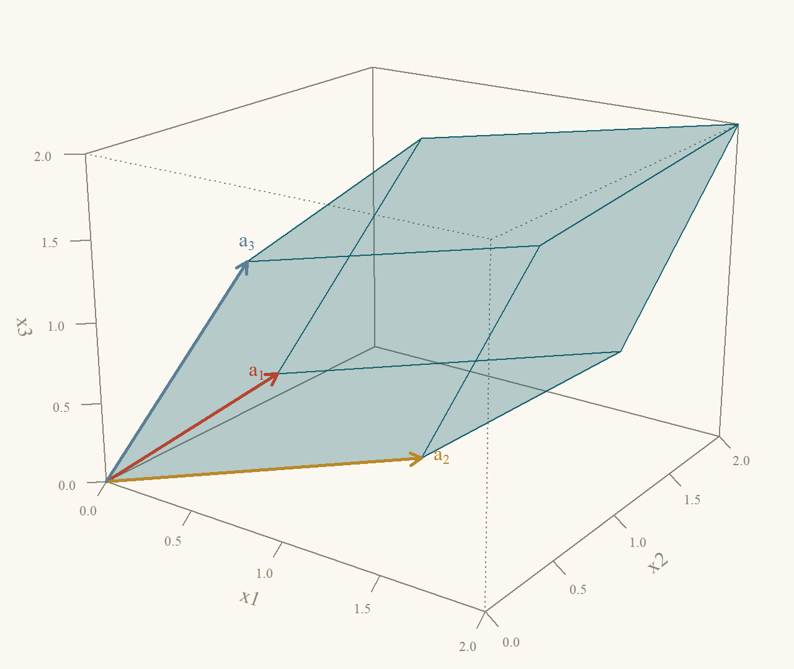
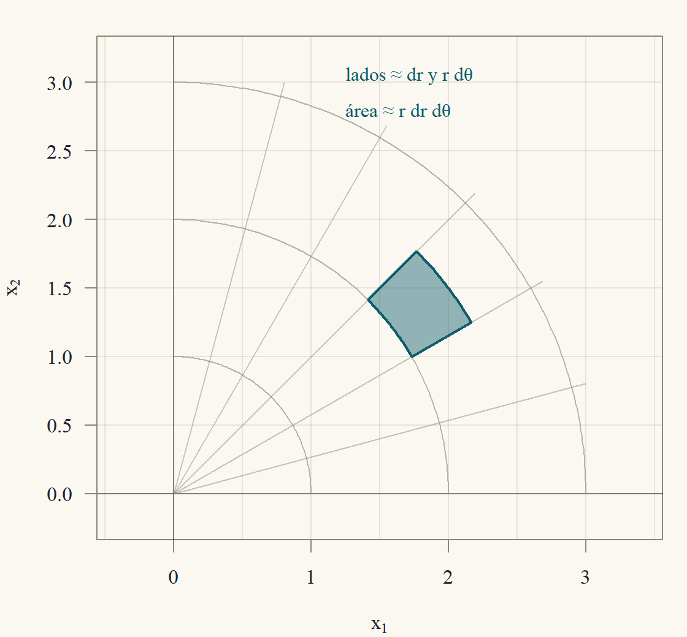

::: {.content-visible when-format="html"}
<a class="descarga-pdf" href="clase-04.pdf">Descargar esta clase en PDF</a>
:::

# Un número para cada matriz cuadrada

En la Clase 2 apareció el número $ad - bc$: si es distinto de cero, la matriz $\begin{pmatrix}a&b\\c&d\end{pmatrix}$ es invertible, y si es cero, no lo es. Ese número es el **determinante**, y tiene una segunda vida geométrica: su valor absoluto es el **área** del paralelogramo que forman las columnas de la matriz (@fig-area). Para la matriz $\begin{pmatrix}3&1\\1&2\end{pmatrix}$, el paralelogramo con lados $(3,1)$ y $(1,2)$ tiene área $3\cdot2 - 1\cdot1 = 5$.

{#fig-area width=62%}

La cuenta de la figura vale en general (con $a,b,c,d>0$ y la columna $(a,c)$ "debajo" de $(b,d)$):
$$
\begin{aligned}
\text{área} &= (a + b)(c + d) - 2\cdot\frac{ac}2 - 2\cdot\frac{bd}2 - 2bc\\
&= ac + ad + bc + bd - ac - bd - 2bc\\
&= ad - bc.
\end{aligned}
$$
En tres dimensiones, el determinante de una matriz $3\times3$ mide el **volumen** del paralelepípedo que forman sus columnas. Esta clase define el determinante para matrices $n\times n$ de cualquier tamaño, aprende a calcularlo de manera eficiente y lo usa en tres aplicaciones: el criterio de invertibilidad, las fórmulas de Cramer y la inversa, y el **jacobiano** de un cambio de variables, que es el que aparece en las integrales dobles y triples de física e ingeniería.[^leibniz]

[^leibniz]: Los determinantes son más antiguos que las matrices. Seki Takakazu en Japón (1683) y Leibniz en Europa (1693) los usaron para decidir si un sistema de ecuaciones tenía solución, casi dos siglos antes de que Cayley definiera las matrices como objetos con su propia aritmética (1858). La palabra "determinante" es de Cauchy (1812), que demostró la regla del producto $\det(AB) = \det A\det B$.

# Tres propiedades que lo definen

En lugar de empezar con una fórmula (que para $n$ grande es enorme), definimos el determinante por **tres propiedades**. Todo lo demás se deduce de ellas. Escribimos $\det A$ o $|A|$, y pensamos $\det$ como una función de las $n$ filas $f_1,\dots,f_n$ de $A$.

::: {#def-determinante}
## Determinante
El determinante es la función que a cada matriz $n\times n$ le asigna un número $\det A$ con las propiedades:

1. **Normalización:** $\det I = 1$.
2. **Alternancia:** intercambiar dos filas cambia el signo del determinante.
3. **Linealidad en cada fila** (con las demás filas fijas):
$$
\det\begin{pmatrix}\vdots\\ cf_i + c'g_i\\\vdots\end{pmatrix} = c\det\begin{pmatrix}\vdots\\f_i\\\vdots\end{pmatrix} + c'\det\begin{pmatrix}\vdots\\g_i\\\vdots\end{pmatrix}.
$$
:::

Que **existe** una función así (y una sola) se demuestra en esta clase: la unicidad en la sección siguiente, y la existencia en la sección ★. Mientras tanto, veamos qué se deduce de las tres propiedades. Ojo con la propiedad 3: es lineal en **una** fila a la vez. No dice que $\det(A + B) = \det A + \det B$ (falso en general: $\det(I + I) = \det(2I)$, que veremos que vale $2^n$, no $2$).

::: {#prp-consecuencias}
## Consecuencias de las tres propiedades
4. Si dos filas son iguales, $\det A = 0$.
5. Sumar a una fila un múltiplo de otra **no cambia** el determinante.
6. Si una fila es cero, $\det A = 0$.
7. Si $A$ es triangular (superior o inferior), $\det A$ es el producto de las entradas de la diagonal.
:::

::: {.proof}
*Propiedad 4.* Si las filas $i$ y $k$ son iguales, al intercambiarlas la matriz no cambia, pero por la propiedad 2 el determinante cambia de signo: $\det A = -\det A$. Entonces $2\det A = 0$ y $\det A = 0$.

*Propiedad 5.* Sea $\tilde A$ la matriz con la fila $i$ reemplazada por $f_i + cf_k$ ($k\ne i$). Por la linealidad (propiedad 3) en la fila $i$,
$$
\det\tilde A = \det A + c\det B,
$$
donde $B$ es $A$ con la fila $i$ reemplazada por $f_k$. Pero $B$ tiene dos filas iguales (la $i$ y la $k$), así que $\det B = 0$ por la propiedad 4. Luego $\det\tilde A = \det A$.

*Propiedad 6.* Si la fila $i$ es cero, es igual a $0\cdot f_i$. Por la linealidad con $c = 0$, $\det A = 0\cdot\det A = 0$.

*Propiedad 7.* Sea $U$ triangular superior con diagonal $u_{11},\dots,u_{nn}$.

- *Si todas las $u_{ii}\ne0$:* con reemplazos (propiedad 5, que no cambia el determinante) eliminamos las entradas **sobre** la diagonal, de abajo hacia arriba: la fila $n$ es $(0,\dots,0,u_{nn})$, y restando a cada fila de arriba el múltiplo adecuado de ella se anula la columna $n$ sobre la diagonal; después se usa la fila $n - 1$ (que ahora es $(0,\dots,u_{n-1,n-1},0)$) para anular la columna $n - 1$, y así. Llegamos a la matriz diagonal $D = \operatorname{diag}(u_{11},\dots,u_{nn})$ con $\det D = \det U$. Por linealidad, sacamos el factor $u_{ii}$ de cada fila $i$: $\det D = u_{11}u_{22}\cdots u_{nn}\det I = u_{11}\cdots u_{nn}$.
- *Si alguna $u_{ii} = 0$:* sea $i$ el mayor índice con $u_{ii} = 0$. Las filas $i + 1,\dots,n$ tienen diagonal no nula y, como antes, con ellas se anulan las entradas de las columnas $i + 1,\dots,n$ en la fila $i$. La fila $i$ era $(0,\dots,0,u_{ii},u_{i,i+1},\dots)$ con $u_{ii} = 0$, así que queda entera en cero. Por la propiedad 6 el determinante es $0$, que es el producto de la diagonal (tiene un factor nulo).

Para una triangular inferior el argumento es el mismo, eliminando debajo de la diagonal de arriba hacia abajo.
:::

# Cálculo por eliminación

La eliminación gaussiana usa justamente reemplazos (no cambian $\det$) e intercambios (cambian el signo). Eso da el método eficiente de cálculo y, de paso, la unicidad.

::: {#thm-det-eliminacion}
## El determinante por eliminación
Si la eliminación gaussiana lleva $A$ a la forma escalonada $U$ usando solo reemplazos y $s$ intercambios de filas, entonces
$$
\det A = (-1)^s\,u_{11}u_{22}\cdots u_{nn} = \pm(\text{producto de los pivotes}).
$$
Si $A$ tiene menos de $n$ pivotes, $\det A = 0$. En particular, **existe a lo más una** función con las tres propiedades.
:::

::: {.proof}
Cada reemplazo deja el determinante igual (propiedad 5) y cada intercambio lo multiplica por $-1$ (propiedad 2). Después de $s$ intercambios, $\det U = (-1)^s\det A$, es decir $\det A = (-1)^s\det U$ (porque $(-1)^s(-1)^s = 1$). $U$ es triangular superior, y por la propiedad 7 su determinante es el producto de su diagonal. Si hay $n$ pivotes, la diagonal son los pivotes. Si hay menos de $n$, $U$ es una matriz cuadrada escalonada con una fila de ceros al final (Clase 1), y su determinante es $0$.

*Unicidad.* El cálculo anterior usó solo las tres propiedades. Si dos funciones $D_1$ y $D_2$ las cumplen, ambas dan, para cada $A$, el mismo número $(-1)^s\cdot(\text{diagonal de }U)$. Entonces $D_1 = D_2$.
:::

::: {#cor-invertible}
## Determinante e invertibilidad
$A$ es invertible si y solo si $\det A\ne0$.
:::

::: {.proof}
Por el corolario de los sistemas cuadrados (Clase 1) y la Clase 2 (para matrices cuadradas basta una inversa de un lado), $A$ es invertible exactamente cuando tiene $n$ pivotes. [Con $n$ pivotes, $Ax = e_j$ tiene solución para cada $j$, y esas soluciones forman una $B$ con $AB = I$; con menos, algún $Ax = b$ no tiene solución, y no puede haber inversa.] Por el @thm-det-eliminacion, $n$ pivotes significa $\det A = \pm(\text{producto de pivotes no nulos})\ne0$, y menos de $n$ significa $\det A = 0$.
:::

::: {#exm-det-eliminacion}
## Tres determinantes por eliminación
*La matriz de la Clase 1.* $A = \begin{pmatrix}1&1&1\\2&3&1\\1&-1&2\end{pmatrix}$ se eliminó sin intercambios hasta $U$ con pivotes $1$, $1$ y $-1$. Entonces $\det A = 1\cdot1\cdot(-1) = -1$.

*La matriz de rigidez de la Clase 2.* $K$ tiene pivotes $2$, $\tfrac32$ y $\tfrac43$, sin intercambios: $\det K = 2\cdot\tfrac32\cdot\tfrac43 = 4$.

*La matriz del propano (Clase 1).* $P = \begin{pmatrix}0&1&0\\0&0&2\\2&-2&-1\end{pmatrix}$ necesitó **dos** intercambios para llegar a $U = \begin{pmatrix}2&-2&-1\\0&1&0\\0&0&2\end{pmatrix}$. Entonces $\det P = (-1)^2\cdot2\cdot1\cdot2 = 4$.
:::

# Producto, transpuesta e inversa

::: {#thm-producto}
## El determinante de un producto
Para matrices $n\times n$: $\det(AB) = \det A\,\det B$.
:::

::: {.callout-note title="Borrador"}
Fijo $B$ y miro $A\mapsto\det(AB)$ como función de las filas de $A$. La fila $i$ de $AB$ es $(\text{fila }i\text{ de }A)\,B$ (lectura por filas del producto). Entonces intercambiar filas de $A$ intercambia filas de $AB$, y la linealidad en una fila de $A$ pasa a linealidad en una fila de $AB$. Si divido por $\det B$, la función cumple las tres propiedades... y por la unicidad tiene que ser $\det A$.
:::

::: {.proof}
*Caso $\det B = 0$.* Entonces $B$ no es invertible (@cor-invertible), y por la Clase 3 existe $x\ne0$ con $Bx = 0$. Entonces $(AB)x = A(Bx) = 0$ con $x\ne0$, así que $AB$ no es invertible (si lo fuera, $x = (AB)^{-1}(AB)x = 0$) y $\det(AB) = 0 = \det A\cdot0$.

*Caso $\det B\ne0$.* Definimos $D(A) = \det(AB)/\det B$ y verificamos las tres propiedades como función de las filas de $A$. Recordemos que la fila $i$ de $AB$ es $f_iB$, con $f_i$ la fila $i$ de $A$ (Clase 2).

1. $D(I) = \det(IB)/\det B = \det B/\det B = 1$.
2. Intercambiar las filas $i$ y $k$ de $A$ intercambia las filas $f_iB$ y $f_kB$ de $AB$, lo que cambia el signo de $\det(AB)$ y por lo tanto de $D(A)$.
3. Si la fila $i$ de $A$ es $cf_i + c'g_i$, la fila $i$ de $AB$ es $(cf_i + c'g_i)B = c(f_iB) + c'(g_iB)$ (distributividad), y por la linealidad de $\det$ en la fila $i$, $\det(AB)$ se separa en $c$ veces más $c'$ veces; dividiendo por $\det B$, lo mismo vale para $D$.

Por la unicidad (@thm-det-eliminacion), $D(A) = \det A$, es decir $\det(AB) = \det A\,\det B$.
:::

::: {#cor-inversa-transpuesta}
## Inversa y transpuesta
1. Si $A$ es invertible, $\det(A^{-1}) = 1/\det A$.
2. $\det(A') = \det A$.
:::

::: {.proof}
*Parte 1.* Por el @thm-producto, $\det A\,\det(A^{-1}) = \det(AA^{-1}) = \det I = 1$.

*Parte 2.* Si $A$ no es invertible, $A'$ tampoco (si $A'$ tuviera inversa $C$, transponiendo $A'C = I$ se obtendría $C'A = I$, y $A$ sería invertible porque, por la Clase 2, en matrices cuadradas basta una inversa de un lado), así que ambos determinantes son $0$. Si $A$ es invertible, por la Clase 2 hay una permutación $P$ con $PA = LU$; como $P'P = I$ (una permutación se deshace con su transpuesta), $A = P'LU$. Transponiendo, $A' = U'L'P$. Por el @thm-producto, $\det A = \det P'\det L\det U$ y $\det A' = \det U'\det L'\det P$. Ahora: $L$ y $L'$ son triangulares con unos en la diagonal, así que $\det L = \det L' = 1$ (propiedad 7); $U$ y $U'$ son triangulares con la misma diagonal, así que $\det U = \det U'$; y $\det P\det P' = \det(PP') = \det I = 1$ con $\det P = \pm1$ (es $I$ con filas intercambiadas), lo que obliga a $\det P' = \det P$. Entonces $\det A = \det A'$.
:::

La parte 2 tiene una consecuencia práctica: **todo lo dicho sobre filas vale también para columnas**. Intercambiar columnas cambia el signo, el determinante es lineal en cada columna, sumar a una columna un múltiplo de otra no lo cambia, y dos columnas iguales dan cero.

# Cofactores

Para matrices pequeñas conviene una fórmula explícita. Sea $M_{ij}$ la matriz $(n - 1)\times(n - 1)$ que queda al **borrar la fila $i$ y la columna $j$** de $A$ (el **menor** $ij$), y $C_{ij} = (-1)^{i+j}\det M_{ij}$ el **cofactor** $ij$. Los signos $(-1)^{i+j}$ forman un tablero de ajedrez que empieza con $+$:
$$
\begin{pmatrix}+&-&+\\-&+&-\\+&-&+\end{pmatrix}.
$$

::: {#thm-cofactores}
## Expansión por cofactores
Para cualquier fila $i$: $\det A = a_{i1}C_{i1} + a_{i2}C_{i2} + \dots + a_{in}C_{in}$. Y para cualquier columna $j$: $\det A = a_{1j}C_{1j} + \dots + a_{nj}C_{nj}$.
:::

::: {.callout-note title="Borrador"}
La fila $i$ es $\sum_ja_{ij}e_j'$. Por linealidad en esa fila, $\det A = \sum_ja_{ij}\det(A_j)$, donde $A_j$ es $A$ con la fila $i$ cambiada por $e_j'$ (un $1$ en la columna $j$). Falta ver que $\det A_j = C_{ij}$. Muevo esa fila al tope y esa columna a la izquierda con intercambios de vecinos (cada uno cambia el signo); quedan $i - 1 + j - 1$ intercambios, de ahí el $(-1)^{i+j}$. Después, con el $1$ en la esquina y ceros en el resto de su fila, limpio su columna con reemplazos y queda una matriz "bloque" cuyo determinante es el del menor.
:::

::: {.proof}
*Paso 1 (linealidad).* La fila $i$ de $A$ es $a_{i1}e_1' + \dots + a_{in}e_n'$. Por la linealidad en la fila $i$, $\det A = \sum_ja_{ij}\det A_j$, con $A_j$ igual a $A$ salvo que su fila $i$ es $e_j'$.

*Paso 2 (llevar el $1$ a la esquina).* En $A_j$, intercambiamos la fila $i$ con la de arriba, luego con la siguiente, hasta llevarla a la posición $1$: son $i - 1$ intercambios de filas vecinas, que no alteran el orden relativo de las demás filas. Luego hacemos lo mismo con la columna $j$, llevándola a la posición $1$ con $j - 1$ intercambios de columnas vecinas (que también cambian el signo, por la consecuencia del @cor-inversa-transpuesta). La matriz resultante $B$ tiene primera fila $(1,0,\dots,0)$, y al borrar su primera fila y su primera columna queda exactamente $M_{ij}$ (las demás filas y columnas conservan su orden). Entonces $\det A_j = (-1)^{(i-1)+(j-1)}\det B = (-1)^{i+j}\det B$.

*Paso 3 (limpiar la primera columna).* $B = \begin{pmatrix}1&0\\v&M_{ij}\end{pmatrix}$ por bloques, con $v$ una columna. Restando a cada fila $k\ge2$ el múltiplo $v_k$ de la fila 1 (reemplazos, que no cambian el determinante), como la fila 1 es $(1,0,\dots,0)$ solo cambia la primera entrada, que queda en cero: $\det B = \det\begin{pmatrix}1&0\\0&M_{ij}\end{pmatrix}$.

*Paso 4.* La función $M\mapsto\det\begin{pmatrix}1&0\\0&M\end{pmatrix}$ cumple las tres propiedades como función de las filas de $M$: vale $1$ en $M = I$, cambia de signo si se intercambian filas de $M$ (son filas de la matriz grande), y es lineal en cada fila de $M$ (ídem). Por la unicidad, es $\det M$. Juntando, $\det A_j = (-1)^{i+j}\det M_{ij} = C_{ij}$, y el paso 1 da la fórmula por filas.

*Por columnas.* Se aplica la fórmula por filas a $A'$ y se usa $\det A' = \det A$ (los menores de $A'$ son los transpuestos de los de $A$, con el mismo determinante).
:::

::: {#exm-formulas}
## Las fórmulas $2\times2$ y $3\times3$
*$2\times2$:* expandiendo por la primera fila, $C_{11} = +d$ (borrar fila 1 y columna 1 deja $(d)$) y $C_{12} = -c$:
$$
\det\begin{pmatrix}a&b\\c&d\end{pmatrix} = a\cdot d + b\cdot(-c) = ad - bc.
$$
*$3\times3$:* por la primera fila,
$$
\begin{aligned}
\det\begin{pmatrix}a_{11}&a_{12}&a_{13}\\a_{21}&a_{22}&a_{23}\\a_{31}&a_{32}&a_{33}\end{pmatrix} &= a_{11}(a_{22}a_{33} - a_{23}a_{32}) - a_{12}(a_{21}a_{33} - a_{23}a_{31})\\
&\quad + a_{13}(a_{21}a_{32} - a_{22}a_{31}).
\end{aligned}
$$
Expandiendo los paréntesis aparecen seis productos, cada uno con un factor de cada fila y de cada columna: $+a_{11}a_{22}a_{33} + a_{12}a_{23}a_{31} + a_{13}a_{21}a_{32} - a_{11}a_{23}a_{32} - a_{12}a_{21}a_{33} - a_{13}a_{22}a_{31}$. Es la **regla de Sarrus**: los tres productos de las "diagonales" hacia la derecha con signo $+$ y los tres hacia la izquierda con signo $-$. (Solo vale para $3\times3$.)

*Verificación con la matriz de la Clase 1:*
$$
\begin{aligned}
\det\begin{pmatrix}1&1&1\\2&3&1\\1&-1&2\end{pmatrix} &= 1(3\cdot2 - 1\cdot(-1)) - 1(2\cdot2 - 1\cdot1)\\
&\quad + 1(2\cdot(-1) - 3\cdot1)\\
&= 7 - 3 - 5 = -1,
\end{aligned}
$$
igual que por eliminación.
:::

En la práctica conviene expandir por la fila o columna con **más ceros**. Para la matriz del propano, la primera columna es $(0,0,2)'$: $\det P = 2\cdot C_{31} = 2\cdot(+1)\det\begin{pmatrix}1&0\\0&2\end{pmatrix} = 2\cdot2 = 4$ ✓.

::: {.callout-caution title="Algoritmo: cuál método usar"}
- **Matrices $2\times2$ y $3\times3$:** fórmula directa o cofactores por la fila con más ceros.
- **Matrices más grandes:** eliminación, $\det A = \pm\prod(\text{pivotes})$, con costo $\approx\tfrac23n^3$ flops.
- **Nunca** la expansión por cofactores completa para $n$ grande: cada determinante $n\times n$ requiere $n$ determinantes $(n - 1)\times(n - 1)$, lo que suma del orden de $n!$ operaciones. Con $n = 20$, $20!\approx2{,}4\times10^{18}$.
:::

# La regla de Cramer y la fórmula de la inversa

Los cofactores dan fórmulas cerradas para $A^{-1}$ y para la solución de $Ax = b$. No son buenas para calcular (salvo en $2\times2$ y $3\times3$), pero sirven para entender cómo depende la solución de los datos.

::: {#thm-cramer}
## Regla de Cramer
Si $\det A\ne0$, la solución de $Ax = b$ es
$$
x_j = \frac{\det B_j}{\det A},\qquad j = 1,\dots,n,
$$
donde $B_j$ es $A$ con su columna $j$ reemplazada por $b$.
:::

::: {.proof}
Sea $x$ la solución, de modo que $b = Ax = x_1a_1 + \dots + x_na_n$ (lectura por columnas). La matriz $B_j$ tiene en la columna $j$ el vector $b = \sum_kx_ka_k$. Por la linealidad del determinante en la columna $j$,
$$
\det B_j = \sum_{k = 1}^nx_k\det\big(a_1\ \cdots\ \underbrace{a_k}_{\text{columna }j}\ \cdots\ a_n\big).
$$
Si $k\ne j$, la matriz del término $k$ tiene la columna $a_k$ repetida (en la posición $j$ y en la $k$): su determinante es $0$. Solo sobrevive $k = j$, que es la matriz $A$ original: $\det B_j = x_j\det A$. Dividiendo por $\det A\ne0$ se obtiene la fórmula.
:::

::: {#exm-cramer}
## Cramer en los dos mercados y en el sistema $3\times3$
*Los mercados de café y té de la Clase 1:* $\begin{pmatrix}3&-1\\-1&2\end{pmatrix}\begin{pmatrix}P_1\\P_2\end{pmatrix} = \begin{pmatrix}9\\2\end{pmatrix}$, con $\det A = 6 - 1 = 5$:
$$
P_1 = \frac{\det\begin{pmatrix}9&-1\\2&2\end{pmatrix}}5 = \frac{18 + 2}5 = 4,\qquad P_2 = \frac{\det\begin{pmatrix}3&9\\-1&2\end{pmatrix}}5 = \frac{6 + 9}5 = 3.
$$
La fórmula muestra de un vistazo cómo responden los precios a los datos: si la demanda de café sube en una unidad (el $9$ pasa a $10$), $P_1$ sube en $\det\begin{pmatrix}1&-1\\0&2\end{pmatrix}/5 = \tfrac25$ y $P_2$ en $\det\begin{pmatrix}3&1\\-1&0\end{pmatrix}/5 = \tfrac15$: el precio del té también sube, porque los bienes son sustitutos.
*El sistema de la Clase 1:* $A = \begin{pmatrix}1&1&1\\2&3&1\\1&-1&2\end{pmatrix}$, $b = (6,11,5)'$, $\det A = -1$. Expandiendo cada $B_j$ por la primera fila:
$$
\begin{aligned}
\det B_1 = \det\begin{pmatrix}6&1&1\\11&3&1\\5&-1&2\end{pmatrix} &= 6(6 + 1) - 1(22 - 5) + 1(-11 - 15)\\
&= 42 - 17 - 26 = -1,
\end{aligned}
$$
$$
\begin{aligned}
\det B_2 = \det\begin{pmatrix}1&6&1\\2&11&1\\1&5&2\end{pmatrix} &= 1(22 - 5) - 6(4 - 1) + 1(10 - 11)\\
&= 17 - 18 - 1 = -2,
\end{aligned}
$$
$$
\begin{aligned}
\det B_3 = \det\begin{pmatrix}1&1&6\\2&3&11\\1&-1&5\end{pmatrix} &= 1(15 + 11) - 1(10 - 11) + 6(-2 - 3)\\
&= 26 + 1 - 30 = -3.
\end{aligned}
$$
Entonces $x = (-1/-1,\ -2/-1,\ -3/-1) = (1,2,3)$, como antes.
:::

::: {#thm-adjunta}
## Fórmula de la inversa
Sea $\operatorname{adj}A$ la **adjunta** de $A$: la transpuesta de la matriz de cofactores, $(\operatorname{adj}A)_{ij} = C_{ji}$. Entonces
$$
A\,\operatorname{adj}A = (\det A)\,I,\qquad\text{y si }\det A\ne0,\qquad A^{-1} = \frac{\operatorname{adj}A}{\det A}.
$$
:::

::: {.proof}
La entrada $(i,k)$ de $A\,\operatorname{adj}A$ es $\sum_ja_{ij}(\operatorname{adj}A)_{jk} = \sum_ja_{ij}C_{kj}$.

- *Si $k = i$:* es $\sum_ja_{ij}C_{ij}$, la expansión de $\det A$ por la fila $i$ (@thm-cofactores).
- *Si $k\ne i$:* es la expansión por la fila $k$ de la matriz $\tilde A$ que se obtiene de $A$ copiando la fila $i$ en la fila $k$ (los cofactores $C_{kj}$ no dependen de la fila $k$, que se borra, así que son los mismos para $A$ y para $\tilde A$, y las entradas de la fila $k$ de $\tilde A$ son $a_{ij}$). Pero $\tilde A$ tiene dos filas iguales: su determinante es $0$.

Entonces $A\,\operatorname{adj}A$ tiene $\det A$ en la diagonal y $0$ fuera de ella. Si $\det A\ne0$, dividiendo, $A\cdot\frac{\operatorname{adj}A}{\det A} = I$, y por la Clase 2 (basta un lado) es la inversa.
:::

Con $n = 2$, los cofactores de $\begin{pmatrix}a&b\\c&d\end{pmatrix}$ son $C_{11} = d$, $C_{12} = -c$, $C_{21} = -b$, $C_{22} = a$; transponiendo, $\operatorname{adj}A = \begin{pmatrix}d&-b\\-c&a\end{pmatrix}$: es la fórmula de la Clase 2. Con la matriz de rigidez $K$ ($\det K = 4$), algunos cofactores son $C_{11} = \det\begin{pmatrix}2&-1\\-1&2\end{pmatrix} = 3$, $C_{12} = -\det\begin{pmatrix}-1&-1\\0&2\end{pmatrix} = -(-2) = 2$, $C_{13} = \det\begin{pmatrix}-1&2\\0&-1\end{pmatrix} = 1$ y $C_{22} = \det\begin{pmatrix}2&0\\0&2\end{pmatrix} = 4$, que divididos por $4$ reproducen la primera fila y el centro de $K^{-1} = \tfrac14\begin{pmatrix}3&2&1\\2&4&2\\1&2&3\end{pmatrix}$.

# Área, volumen y orientación

Ahora justificamos la geometría del comienzo. En el plano y en el espacio, el área y el volumen son conceptos geométricos conocidos, y el teorema dice que el determinante los calcula.

::: {#thm-volumen}
## El determinante como área y volumen
1. En $\mathbb{R}^2$, el paralelogramo con lados $a_1,a_2$ (las columnas de $A$) tiene área $|\det A|$.
2. En $\mathbb{R}^3$, el paralelepípedo con aristas $a_1,a_2,a_3$ (las columnas de $A$) tiene volumen $|\det A|$.
:::

::: {.callout-note title="Borrador"}
Llamo $V(a_1,\dots,a_n)$ al área o volumen ($n = 2$ o $3$). Quiero mostrar que $V$ y $|\det|$ cambian igual bajo las operaciones de columna de la eliminación, y que al final del proceso coinciden. Tres hechos geométricos: (i) el cuadrado o cubo unitario mide $1$; (ii) **cizallar** (sumar a una arista un múltiplo de otra) no cambia el área ni el volumen, porque deja igual la base y la altura (principio de Cavalieri); (iii) estirar una arista por $c$ multiplica la medida por $|c|$. El determinante cumple lo mismo: (i) es la normalización, (ii) es la propiedad 5 por columnas y (iii) es la linealidad por columnas.
:::

::: {.proof}
Hacemos el caso $n = 3$; el caso $n = 2$ es idéntico con una arista menos. Usamos tres hechos de la geometría elemental del volumen:

- (i) el cubo de aristas $e_1,e_2,e_3$ tiene volumen $1$;
- (ii) reemplazar una arista $a_j$ por $a_j + ca_k$ ($k\ne j$) no cambia el volumen: el paralelepípedo se "desliza" paralelamente a la cara generada por las otras dos aristas cuando se suma un múltiplo de $a_k$, que está en esa cara, de modo que la base (esa cara) y la altura (la distancia de la cara opuesta) no cambian;
- (iii) reemplazar $a_j$ por $ca_j$ multiplica el volumen por $|c|$ (la altura sobre la cara de las otras aristas se multiplica por $|c|$), y si las aristas están en un plano el volumen es $0$.

*Paso 1: columnas dependientes.* Si $a_1,a_2,a_3$ son dependientes, están en un plano (o en una recta) y el paralelepípedo es plano: volumen $0$. Y $\det A = 0$ porque $A$ no es invertible (Clase 3, @cor-invertible).

*Paso 2: columnas independientes.* Aplicamos la eliminación a $A'$ (operaciones de fila sobre $A'$ son operaciones de columna sobre $A$). Por (ii) y por la propiedad 5 por columnas, los reemplazos de columna no cambian ni el volumen ni $\det A$. Un intercambio de columnas no cambia el volumen (es el mismo sólido) y cambia el signo de $\det A$, así que no cambia $|\det A|$. Llegamos a una matriz triangular inferior $T$ (la transpuesta de la escalonada de $A'$) con diagonal no nula $t_{11},t_{22},t_{33}$. Con más reemplazos de columna (usando la columna 3, que es $(0,0,t_{33})'$, para anular la tercera entrada de las otras, y luego la 2) llegamos a la diagonal $\operatorname{diag}(t_{11},t_{22},t_{33})$, sin cambiar ni el volumen ni el determinante. Esa matriz tiene columnas $t_{11}e_1,t_{22}e_2,t_{33}e_3$: por (iii) y (i), su volumen es $|t_{11}t_{22}t_{33}|$, y su determinante es $t_{11}t_{22}t_{33}$ (propiedad 7). Como volumen y $|\det|$ se conservaron en todos los pasos, el volumen original es $|\det A|$.
:::

El **signo** del determinante tiene también un significado: indica la **orientación**. En el plano, $\det A>0$ significa que $a_1$ y $a_2$ están en el mismo orden de giro que $e_1$ y $e_2$ (girar de $a_1$ hacia $a_2$ por el lado corto es antihorario); $\det A<0$, que el orden está invertido, como en un espejo. En el espacio, $\det A>0$ significa que $a_1,a_2,a_3$ forman un sistema "de mano derecha".

La otra cara del mismo teorema: como transformación, $A$ lleva el cuadrado (o cubo) unitario a un paralelogramo (o paralelepípedo) de medida $|\det A|$. Y como cualquier figura se puede aproximar por cuadraditos, **$A$ multiplica todas las áreas (o volúmenes) por $|\det A|$** (@fig-transformacion). Así se entiende el @thm-producto: aplicar $B$ y después $A$ multiplica las áreas primero por $|\det B|$ y después por $|\det A|$.

{#fig-transformacion width=100%}

::: {#exm-volumen}
## Un volumen en el espacio
Las columnas de $A = \begin{pmatrix}1&1&0\\0&1&1\\1&0&1\end{pmatrix}$ son $a_1 = (1,0,1)'$, $a_2 = (1,1,0)'$ y $a_3 = (0,1,1)'$ (@fig-paralelepipedo). Por cofactores en la primera fila: $\det A = 1(1\cdot1 - 1\cdot0) - 1(0\cdot1 - 1\cdot1) + 0 = 1 + 1 = 2$. El paralelepípedo tiene volumen $2$, el doble del cubo unitario, y como el determinante es positivo, las tres aristas forman un sistema de mano derecha.
:::

{#fig-paralelepipedo width=66%}

# El jacobiano

En las integrales de física e ingeniería es frecuente cambiar de coordenadas: polares para un disco, esféricas para una esfera. Un cambio de variables $x = g(u)$, con $g:\mathbb{R}^n\to\mathbb{R}^n$ diferenciable, se comporta **localmente** como una transformación lineal: cerca de un punto $u$, un desplazamiento pequeño $du$ produce $dx\approx J(u)\,du$, donde la **matriz jacobiana** $J$ tiene las derivadas parciales $J_{ij} = \partial g_i/\partial u_j$. Por el @thm-volumen, un cuadradito (o cubito) de medida $du_1\cdots du_n$ se transforma en un paralelogramo de medida $\approx|\det J(u)|\,du_1\cdots du_n$. Por eso el cambio de variables en una integral es
$$
\int f(x)\,dx = \int f(g(u))\,|\det J(u)|\,du.
$$
(La demostración rigurosa, con el control del error de la aproximación lineal, es de cálculo en varias variables; aquí nos interesa calcular $\det J$.)

::: {#exm-polares}
## Coordenadas polares
$x_1 = r\cos\theta$, $x_2 = r\sin\theta$. Derivando:
$$
J = \begin{pmatrix}\partial x_1/\partial r&\partial x_1/\partial\theta\\\partial x_2/\partial r&\partial x_2/\partial\theta\end{pmatrix} = \begin{pmatrix}\cos\theta&-r\sin\theta\\\sin\theta&r\cos\theta\end{pmatrix},
$$
$$
\det J = \cos\theta\cdot r\cos\theta - (-r\sin\theta)\sin\theta = r\cos^2\theta + r\sin^2\theta = r.
$$
El elemento de área es $r\,dr\,d\theta$ (@fig-polares): un "rectángulo polar" de lados $dr$ y $r\,d\theta$ (un arco de radio $r$ y ángulo $d\theta$ mide $r\,d\theta$). Con esto, el área del disco de radio $R$ es $\int_0^{2\pi}\int_0^Rr\,dr\,d\theta = 2\pi\cdot\tfrac{R^2}2 = \pi R^2$.
:::

{#fig-polares width=55%}

::: {#exm-esfericas}
## Coordenadas esféricas
$x_1 = \rho\sin\varphi\cos\theta$, $x_2 = \rho\sin\varphi\sin\theta$, $x_3 = \rho\cos\varphi$, con $\rho\ge0$ la distancia al origen, $\varphi\in[0,\pi]$ el ángulo con el eje $x_3$ y $\theta$ el ángulo en el plano $x_1x_2$. La jacobiana, con columnas $\partial/\partial\rho$, $\partial/\partial\varphi$, $\partial/\partial\theta$, es
$$
J = \begin{pmatrix}\sin\varphi\cos\theta&\rho\cos\varphi\cos\theta&-\rho\sin\varphi\sin\theta\\\sin\varphi\sin\theta&\rho\cos\varphi\sin\theta&\rho\sin\varphi\cos\theta\\\cos\varphi&-\rho\sin\varphi&0\end{pmatrix}.
$$
Expandimos por la tercera fila, que tiene un cero. Los cofactores son
$$
\begin{aligned}
C_{31} &= +\det\begin{pmatrix}\rho\cos\varphi\cos\theta&-\rho\sin\varphi\sin\theta\\\rho\cos\varphi\sin\theta&\rho\sin\varphi\cos\theta\end{pmatrix}\\
&= \rho^2\cos\varphi\sin\varphi\cos^2\theta + \rho^2\cos\varphi\sin\varphi\sin^2\theta = \rho^2\cos\varphi\sin\varphi,
\end{aligned}
$$
$$
\begin{aligned}
C_{32} &= -\det\begin{pmatrix}\sin\varphi\cos\theta&-\rho\sin\varphi\sin\theta\\\sin\varphi\sin\theta&\rho\sin\varphi\cos\theta\end{pmatrix}\\
&= -\big(\rho\sin^2\varphi\cos^2\theta + \rho\sin^2\varphi\sin^2\theta\big) = -\rho\sin^2\varphi,
\end{aligned}
$$
usando $\cos^2\theta + \sin^2\theta = 1$. Entonces
$$
\begin{aligned}
\det J &= \cos\varphi\cdot\rho^2\cos\varphi\sin\varphi + (-\rho\sin\varphi)(-\rho\sin^2\varphi) + 0\\
&= \rho^2\sin\varphi\,(\cos^2\varphi + \sin^2\varphi) = \rho^2\sin\varphi.
\end{aligned}
$$
El volumen de la esfera de radio $R$ resulta $\int_0^{2\pi}\int_0^\pi\int_0^R\rho^2\sin\varphi\,d\rho\,d\varphi\,d\theta = 2\pi\cdot2\cdot\tfrac{R^3}3 = \tfrac43\pi R^3$, usando $\int_0^\pi\sin\varphi\,d\varphi = [-\cos\varphi]_0^\pi = 2$.
:::

# Determinantes por bloques

::: {#prp-det-bloques}
## Determinantes por bloques
Sean $A$ ($k\times k$) y $D$ ($\ell\times\ell$) cuadradas.

1. $\det\begin{pmatrix}A&B\\0&D\end{pmatrix} = \det A\,\det D$.
2. Si $A$ es invertible, $\det\begin{pmatrix}A&B\\C&D\end{pmatrix} = \det A\,\det(D - CA^{-1}B)$.
:::

::: {.proof}
*Parte 1.* Por inducción en $k$. Si $k = 1$, $A = (a_{11})$ y la primera columna de la matriz grande es $(a_{11},0,\dots,0)'$; expandiendo por esa columna (@thm-cofactores), el único término es $a_{11}\cdot(+1)\det D$, porque borrar la fila 1 y la columna 1 deja $D$. Si $k>1$, expandimos por la primera columna, que es $(a_{11},\dots,a_{k1},0,\dots,0)'$: los términos son $a_{i1}C_{i1}$ con $i\le k$. El menor que queda al borrar la fila $i$ y la columna 1 es $\begin{pmatrix}A_{(i)}&B_{(i)}\\0&D\end{pmatrix}$, donde $A_{(i)}$ es el menor $(i,1)$ de $A$, de tamaño $k - 1$. Por la hipótesis de inducción, su determinante es $\det A_{(i)}\det D$. Sumando, $\sum_{i\le k}a_{i1}(-1)^{i+1}\det A_{(i)}\det D = \det A\det D$ (la suma es la expansión de $\det A$ por su primera columna).

*Parte 2.* Por la eliminación por bloques de la Clase 2,
$$
\begin{pmatrix}I&0\\-CA^{-1}&I\end{pmatrix}\begin{pmatrix}A&B\\C&D\end{pmatrix} = \begin{pmatrix}A&B\\0&D - CA^{-1}B\end{pmatrix}.
$$
La primera matriz es triangular inferior con unos en la diagonal: determinante $1$. Por el @thm-producto y la parte 1, $\det\begin{pmatrix}A&B\\C&D\end{pmatrix} = \det A\det(D - CA^{-1}B)$.
:::

Por ejemplo, para la matriz $M = \begin{pmatrix}2&1&1\\1&2&1\\1&1&2\end{pmatrix}$ de la Clase 2, con $A = \begin{pmatrix}2&1\\1&2\end{pmatrix}$ y complemento de Schur $S = \tfrac43$: $\det M = \det A\cdot S = 3\cdot\tfrac43 = 4$. Por Sarrus: $8 + 1 + 1 - 2 - 2 - 2 = 4$ ✓.

# ★ Para ir más allá: la existencia y la fórmula de Leibniz

::: {.callout-important title="★ Para ir más allá"}
Falta demostrar que **existe** una función con las tres propiedades. La construimos por **inducción** con la expansión por la primera columna, y verificamos las tres propiedades. Como subproducto aparece la fórmula de Leibniz con $n!$ términos.
:::

::: {#thm-existencia-det}
## Existencia del determinante
Definamos $D_1(a) = a$ para matrices $1\times1$ y, para $n\ge2$,
$$
D_n(A) = \sum_{i = 1}^n(-1)^{i+1}a_{i1}\,D_{n-1}(M_{i1}),
$$
con $M_{i1}$ la matriz que queda al borrar la fila $i$ y la primera columna. Entonces $D_n$ cumple las tres propiedades de la @def-determinante.
:::

::: {.proof}
Por inducción en $n$. Para $n = 1$: $D_1(1) = 1$; no hay dos filas que intercambiar; y $D_1$ es lineal. Supongamos que $D_{n-1}$ cumple las tres propiedades y probémoslas para $D_n$.

*Normalización.* En $I$, la primera columna es $e_1$: solo sobrevive $i = 1$, con $a_{11} = 1$ y $M_{11} = I_{n-1}$. Entonces $D_n(I) = 1\cdot D_{n-1}(I_{n-1}) = 1$.

*Linealidad en la fila $k$.* Miremos cada término $(-1)^{i+1}a_{i1}D_{n-1}(M_{i1})$. Si $i = k$: el factor $a_{k1}$ es una entrada de la fila $k$ (depende linealmente de ella) y $M_{k1}$ no contiene la fila $k$ (la borramos), así que el término es lineal en la fila $k$. Si $i\ne k$: $a_{i1}$ no depende de la fila $k$, y $M_{i1}$ contiene la fila $k$ (sin su primera entrada) como una de sus filas; por la hipótesis de inducción, $D_{n-1}(M_{i1})$ es lineal en ella. Una suma de términos lineales es lineal.

*Alternancia.* Basta probarla para dos filas **vecinas** $k$ y $k + 1$: cualquier intercambio de las filas $i<j$ se logra con $2(j - i) - 1$ intercambios de vecinas (bajar la fila $i$ hasta la posición $j$ con $j - i$ pasos y subir la que era $j$ hasta la posición $i$ con $j - i - 1$), un número impar, y cada uno cambia el signo. Sea $\tilde A$ la matriz con las filas $k$ y $k + 1$ intercambiadas.

- Para $i\ne k,k + 1$: $\tilde a_{i1} = a_{i1}$, y $\tilde M_{i1}$ es $M_{i1}$ con dos filas vecinas intercambiadas. Por inducción, $D_{n-1}(\tilde M_{i1}) = -D_{n-1}(M_{i1})$: el término cambia de signo.
- Los términos $i = k$ e $i = k + 1$ se intercambian: en $\tilde A$, la entrada de la fila $k$ es $a_{k+1,1}$ y, al borrar la fila $k$ de $\tilde A$, queda lo mismo que al borrar la fila $k + 1$ de $A$: $\tilde M_{k1} = M_{k+1,1}$. Entonces el término $i = k$ de $\tilde A$ es $(-1)^{k+1}a_{k+1,1}D_{n-1}(M_{k+1,1})$, que es **menos** el término $i = k + 1$ de $A$, que tenía signo $(-1)^{k+2}$. Del mismo modo, el término $i = k + 1$ de $\tilde A$ es menos el término $i = k$ de $A$.

Todos los términos cambian de signo: $D_n(\tilde A) = -D_n(A)$.
:::

Con la existencia (este teorema) y la unicidad (@thm-det-eliminacion), el determinante está bien definido para toda matriz cuadrada, y todas las fórmulas de la clase son fórmulas para el mismo número.

**La fórmula de Leibniz.** Si en cada fila escribimos $f_i = \sum_ja_{ij}e_j'$ y usamos la linealidad en **todas** las filas a la vez, $\det A$ se convierte en una suma de $n^n$ términos $a_{1j_1}a_{2j_2}\cdots a_{nj_n}\det(e_{j_1};e_{j_2};\dots;e_{j_n})$, uno por cada elección de una columna $j_i$ en cada fila. Cuando dos de los $j_i$ se repiten, la matriz de vectores canónicos tiene dos filas iguales y su determinante es cero. Sobreviven solo las elecciones donde $j_1,\dots,j_n$ son **todas distintas**, es decir, las **permutaciones** de $\{1,\dots,n\}$, que son $n!$. Para cada permutación, la matriz de filas $e_{j_1}',\dots,e_{j_n}'$ es una matriz de permutación, cuyo determinante es $+1$ o $-1$ según el número de intercambios necesarios para llevarla a $I$ sea par o impar (su **signo**). Entonces
$$
\det A = \sum_{\text{permutaciones }(j_1,\dots,j_n)}\operatorname{signo}(j_1,\dots,j_n)\,a_{1j_1}a_{2j_2}\cdots a_{nj_n}.
$$
Para $n = 3$ hay $3! = 6$ permutaciones. Las pares (signo $+$) son $(1,2,3)$, $(2,3,1)$ y $(3,1,2)$; las impares (signo $-$) son $(1,3,2)$, $(2,1,3)$ y $(3,2,1)$. Sus seis términos son exactamente los de la regla de Sarrus del @exm-formulas. Para $n = 2$ hay $2$ términos, $a_{11}a_{22} - a_{12}a_{21}$. El número de términos, $n!$, explica por qué esta fórmula (como la expansión completa por cofactores) no sirve para calcular cuando $n$ es grande.

::: {.callout-caution title="En más dimensiones"}
Las tres propiedades, la eliminación, el producto, los cofactores y Cramer valen para todo $n$, con las demostraciones de esta clase. Lo que se generaliza de manera menos obvia es la geometría: en $\mathbb{R}^n$ el "volumen $n$-dimensional" de un paralelepípedo se **define** como $|\det A|$, y la fórmula de cambio de variables con el jacobiano vale igual. El estudio de las permutaciones y su signo (que la sección ★ usó sin demostrar que el signo está bien definido) y la definición del determinante sin coordenadas, como forma multilineal alternada, están en el curso de Álgebra lineal.
:::

# Resumen

- El determinante queda definido por tres propiedades: $\det I = 1$, cambia de signo al intercambiar filas y es lineal en cada fila (@def-determinante). De ellas: dos filas iguales dan cero, los reemplazos no lo cambian y el de una triangular es el producto de la diagonal (@prp-consecuencias).
- **Cálculo:** $\det A = \pm(\text{producto de los pivotes})$ (@thm-det-eliminacion). $A$ es invertible si y solo si $\det A\ne0$.
- $\det(AB) = \det A\det B$, $\det A^{-1} = 1/\det A$ y $\det A' = \det A$ (@thm-producto, @cor-inversa-transpuesta): lo que vale para filas vale para columnas.
- **Cofactores:** $\det A = \sum_ja_{ij}C_{ij}$ (@thm-cofactores); Sarrus en $3\times3$. **Cramer:** $x_j = \det B_j/\det A$. **Inversa:** $A^{-1} = \operatorname{adj}A/\det A$.
- **Geometría:** $|\det A|$ es el área o volumen generado por las columnas, y el signo es la orientación (@thm-volumen). Una matriz multiplica las áreas por $|\det A|$.
- **Jacobiano:** $|\det J|$ es el factor de área o volumen en un cambio de variables: $r$ en polares, $\rho^2\sin\varphi$ en esféricas.
- **Bloques:** $\det\begin{pmatrix}A&B\\C&D\end{pmatrix} = \det A\det(D - CA^{-1}B)$ (@prp-det-bloques).

# Ejercicios

**Ejercicio 4.1.** Calcula el área del paralelogramo generado por $(4,1)$ y $(2,3)$ con el determinante y con el método del rectángulo de la @fig-area.

::: {.callout-tip collapse="true" title="Solución 4.1"}
Con columnas $(a,c) = (4,1)$ y $(b,d) = (2,3)$: $\det = ad - bc = 4\cdot3 - 2\cdot1 = 10$. Rectángulo: lados $a + b = 6$ y $c + d = 4$, área $24$. Se restan dos triángulos de catetos $4$ y $1$ (área total $4$), dos de catetos $2$ y $3$ (área total $6$) y dos rectángulos de lados $b = 2$ y $c = 1$ (área total $4$): $24 - 4 - 6 - 4 = 10$ ✓.
:::

**Ejercicio 4.2.** Calcula $\det\begin{pmatrix}2&1&3\\1&0&1\\4&2&1\end{pmatrix}$ por eliminación y por Sarrus.

::: {.callout-tip collapse="true" title="Solución 4.2"}
*Eliminación.* Multiplicadores $\tfrac12$ y $2$: $F_2 - \tfrac12F_1 = (0,\ -\tfrac12,\ 1 - \tfrac32) = (0,-\tfrac12,-\tfrac12)$; $F_3 - 2F_1 = (0,\ 0,\ 1 - 6) = (0,0,-5)$. La matriz ya es triangular superior (la fila 3 tiene cero en la columna 2), sin intercambios. Pivotes $2$, $-\tfrac12$, $-5$: $\det = 2\cdot(-\tfrac12)\cdot(-5) = 5$.

*Sarrus.* Productos hacia la derecha: $2\cdot0\cdot1 + 1\cdot1\cdot4 + 3\cdot1\cdot2 = 0 + 4 + 6 = 10$. Hacia la izquierda: $3\cdot0\cdot4 + 2\cdot1\cdot2 + 1\cdot1\cdot1 = 0 + 4 + 1 = 5$. Diferencia: $10 - 5 = 5$ ✓.
:::

**Ejercicio 4.3.** ¿Para qué valores de $k$ es singular la matriz $\begin{pmatrix}1&1&1\\1&k&1\\1&1&k\end{pmatrix}$?

::: {.callout-tip collapse="true" title="Solución 4.3"}
Reemplazos $F_2\leftarrow F_2 - F_1$ y $F_3\leftarrow F_3 - F_1$ (no cambian el determinante): $\begin{pmatrix}1&1&1\\0&k - 1&0\\0&0&k - 1\end{pmatrix}$, triangular. Por la propiedad 7, $\det = 1\cdot(k - 1)\cdot(k - 1) = (k - 1)^2$. Es cero si y solo si $k = 1$: la matriz es singular exactamente para $k = 1$ (cuando sus tres filas son iguales).
:::

**Ejercicio 4.4.** Resuelve con la regla de Cramer: $2x_1 + x_2 = 3$, $x_1 + 2x_2 + x_3 = 4$, $x_2 + 2x_3 = 3$.

::: {.callout-tip collapse="true" title="Solución 4.4"}
$A = \begin{pmatrix}2&1&0\\1&2&1\\0&1&2\end{pmatrix}$, $\det A = 2(4 - 1) - 1(2 - 0) + 0 = 6 - 2 = 4$. Por la primera fila de cada $B_j$:

$\det B_1 = \det\begin{pmatrix}3&1&0\\4&2&1\\3&1&2\end{pmatrix} = 3(4 - 1) - 1(8 - 3) + 0 = 9 - 5 = 4$, así que $x_1 = 1$.

$\det B_2 = \det\begin{pmatrix}2&3&0\\1&4&1\\0&3&2\end{pmatrix} = 2(8 - 3) - 3(2 - 0) + 0 = 10 - 6 = 4$, así que $x_2 = 1$.

$\det B_3 = \det\begin{pmatrix}2&1&3\\1&2&4\\0&1&3\end{pmatrix} = 2(6 - 4) - 1(3 - 0) + 3(1 - 0) = 4 - 3 + 3 = 4$, así que $x_3 = 1$.

Solución $(1,1,1)$; en efecto $(2 + 1,\ 1 + 2 + 1,\ 1 + 2) = (3,4,3)$ ✓.
:::

**Ejercicio 4.5.** Calcula la inversa de $A = \begin{pmatrix}1&2&0\\0&1&0\\2&0&1\end{pmatrix}$ con la adjunta y verifica.

::: {.callout-tip collapse="true" title="Solución 4.5"}
$\det A$ por la segunda fila (que tiene dos ceros): $a_{22}C_{22} = 1\cdot(+1)\det\begin{pmatrix}1&0\\2&1\end{pmatrix} = 1$. Cofactores:

- $C_{11} = +(1\cdot1 - 0\cdot0) = 1$, $C_{12} = -(0\cdot1 - 0\cdot2) = 0$, $C_{13} = +(0\cdot0 - 1\cdot2) = -2$;
- $C_{21} = -(2\cdot1 - 0\cdot0) = -2$, $C_{22} = +(1\cdot1 - 0\cdot2) = 1$, $C_{23} = -(1\cdot0 - 2\cdot2) = 4$;
- $C_{31} = +(2\cdot0 - 0\cdot1) = 0$, $C_{32} = -(1\cdot0 - 0\cdot0) = 0$, $C_{33} = +(1\cdot1 - 2\cdot0) = 1$.

La adjunta es la transpuesta de la matriz de cofactores, y con $\det A = 1$:
$$
A^{-1} = \operatorname{adj}A = \begin{pmatrix}1&-2&0\\0&1&0\\-2&4&1\end{pmatrix}.
$$
Verificación de $AA^{-1}$ por filas de $A$: fila 1, $(1,2,0)$: por las columnas $(1,0,-2)$, $(-2,1,4)$, $(0,0,1)$ da $1$, $-2 + 2 = 0$, $0$. Fila 3, $(2,0,1)$: da $2 - 2 = 0$, $-4 + 4 = 0$, $1$. La fila 2 es $e_2'$ y reproduce la fila 2 de $A^{-1}$, $(0,1,0)$ ✓.
:::

**Ejercicio 4.6.** Calcula el volumen del paralelepípedo de aristas $(1,0,0)'$, $(1,2,0)'$ y $(1,1,3)'$. ¿Qué pasa con el determinante si se intercambian las dos primeras aristas? ¿Y con el volumen?

::: {.callout-tip collapse="true" title="Solución 4.6"}
Con esas columnas, $A = \begin{pmatrix}1&1&1\\0&2&1\\0&0&3\end{pmatrix}$, triangular superior: $\det A = 1\cdot2\cdot3 = 6$. Volumen $6$. Intercambiar las dos primeras columnas cambia el signo: $\det = -6$. El volumen sigue siendo $|-6| = 6$ (es el mismo sólido), pero la orientación se invierte: las aristas en el nuevo orden forman un sistema de mano izquierda.
:::

**Ejercicio 4.7 ★.** (a) Calcula $\det\begin{pmatrix}1&2&3\\0&1&4\\5&6&0\end{pmatrix}$ con la definición recursiva del @thm-existencia-det y comprueba que al intercambiar las dos primeras filas el resultado cambia de signo. (b) Escribe los seis términos de Leibniz para esa matriz y verifica que suman lo mismo.

::: {.callout-tip collapse="true" title="Solución 4.7 ★"}
(a) Primera columna $(1,0,5)'$. Términos: $i = 1$: $+1\cdot\det\begin{pmatrix}1&4\\6&0\end{pmatrix} = 0 - 24 = -24$; $i = 2$: $-0\cdot(\dots) = 0$; $i = 3$: $+5\cdot\det\begin{pmatrix}2&3\\1&4\end{pmatrix} = 5(8 - 3) = 25$. Total $D_3(A) = -24 + 0 + 25 = 1$. Con las filas 1 y 2 intercambiadas, $\tilde A = \begin{pmatrix}0&1&4\\1&2&3\\5&6&0\end{pmatrix}$, primera columna $(0,1,5)'$: $i = 2$: $-1\cdot\det\begin{pmatrix}1&4\\6&0\end{pmatrix} = -(0 - 24) = 24$; $i = 3$: $+5\cdot\det\begin{pmatrix}1&4\\2&3\end{pmatrix} = 5(3 - 8) = -25$. Total $24 - 25 = -1$ ✓, el opuesto.

(b) Permutaciones pares: $(1,2,3)$: $a_{11}a_{22}a_{33} = 1\cdot1\cdot0 = 0$; $(2,3,1)$: $a_{12}a_{23}a_{31} = 2\cdot4\cdot5 = 40$; $(3,1,2)$: $a_{13}a_{21}a_{32} = 3\cdot0\cdot6 = 0$. Impares: $(1,3,2)$: $a_{11}a_{23}a_{32} = 1\cdot4\cdot6 = 24$; $(2,1,3)$: $a_{12}a_{21}a_{33} = 2\cdot0\cdot0 = 0$; $(3,2,1)$: $a_{13}a_{22}a_{31} = 3\cdot1\cdot5 = 15$. Suma: $(0 + 40 + 0) - (24 + 0 + 15) = 40 - 39 = 1$ ✓.
:::
