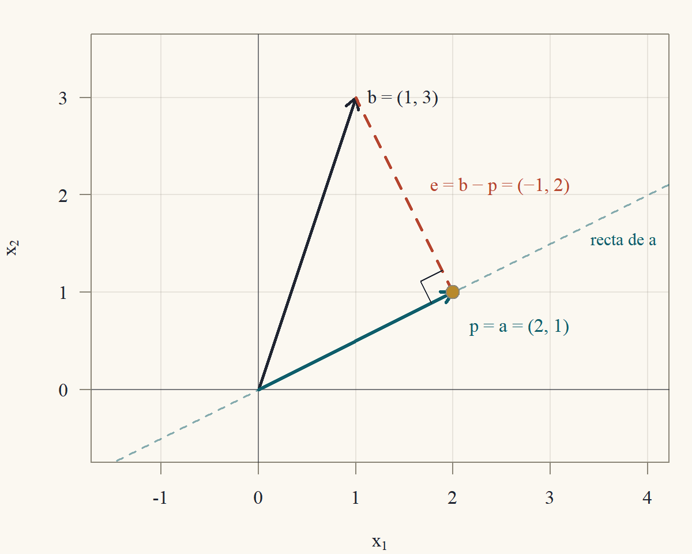
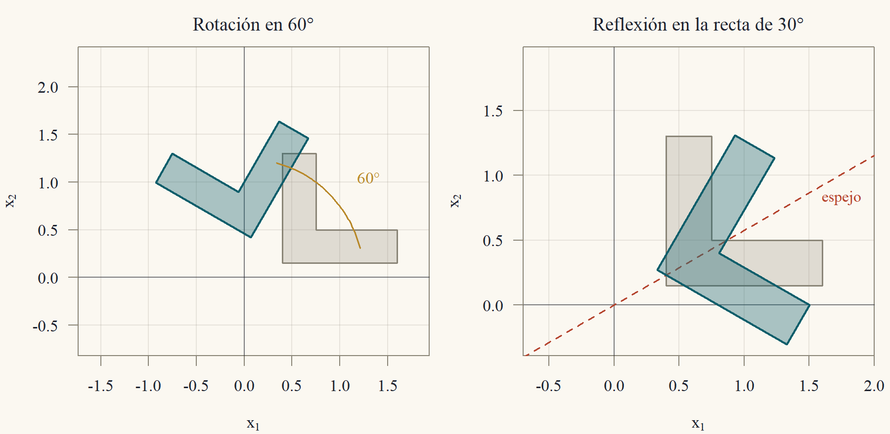
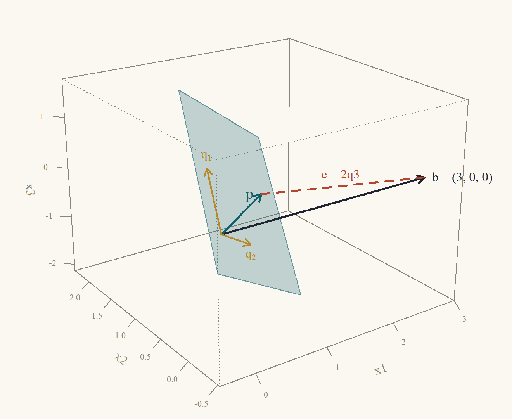
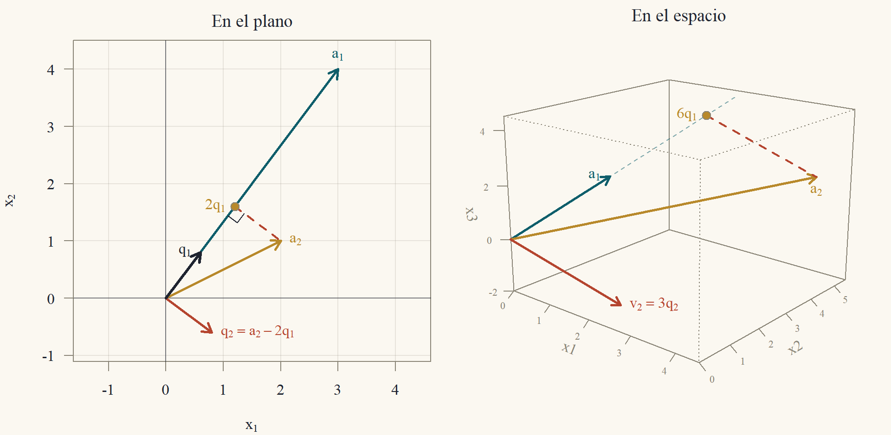
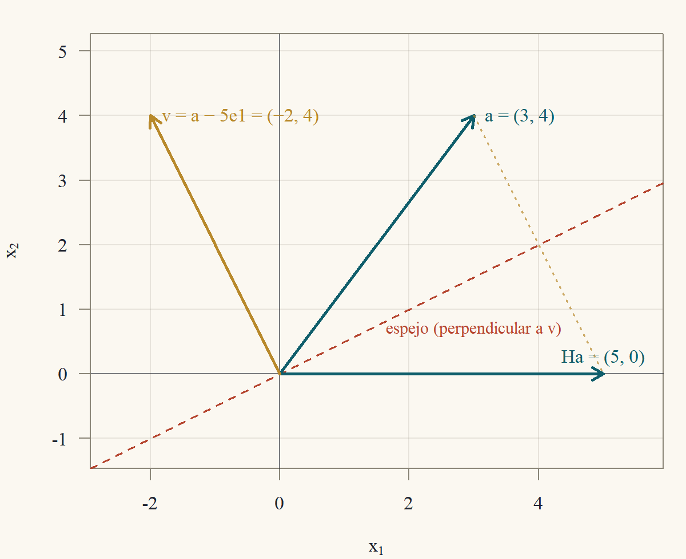

::: {.content-visible when-format="html"}
<a class="descarga-pdf" href="clase-05.pdf">Descargar esta clase en PDF</a>
:::

# Por qué importan los ángulos rectos

En las clases anteriores las matrices se trataron con eliminación: sumar múltiplos de filas, intercambiar filas. Esa aritmética no ve **longitudes** ni **ángulos**. Esta clase incorpora la geometría a través del producto punto, y muestra que las bases formadas por vectores **perpendiculares de largo uno** tienen tres ventajas:

1. **Las coordenadas se calculan sin resolver sistemas.** En una base cualquiera, encontrar las coordenadas de un vector exige resolver $Ax = b$; en una base ortonormal, cada coordenada es un producto punto.
2. **Las matrices ortogonales no deforman.** Conservan longitudes y ángulos: son las rotaciones y reflexiones de la mecánica y la computación gráfica.
3. **Los cálculos son estables.** Multiplicar por una matriz ortogonal no amplifica los errores de redondeo. Por eso la factorización $A = QR$ (una matriz ortogonal por una triangular) es la base de los métodos numéricos de mínimos cuadrados (Clase 6) y de valores propios.

# Producto interno, longitud y ángulo

::: {#def-producto-interno}
## Producto interno y norma
El **producto interno** (o producto punto) de $x,y\in\mathbb{R}^n$ es
$$
x\cdot y = x'y = x_1y_1 + x_2y_2 + \dots + x_ny_n.
$$
La **norma** (longitud) de $x$ es $\|x\| = \sqrt{x\cdot x} = \sqrt{x_1^2 + \dots + x_n^2}$. Un vector de norma $1$ es **unitario**. Dos vectores son **ortogonales** ($x\perp y$) si $x\cdot y = 0$.
:::

En $\mathbb{R}^2$ y $\mathbb{R}^3$, la norma es la longitud de la flecha por el teorema de Pitágoras: el vector $(3,4)$ mide $\sqrt{9 + 16} = 5$, y $(1,2,2)$ mide $\sqrt{1 + 4 + 4} = 3$ (en el espacio se aplica Pitágoras dos veces: primero en el plano $x_1x_2$, $\sqrt{1 + 4}$, y luego con la altura, $\sqrt{(1 + 4) + 4}$). Directamente de la definición, como suma de productos de componentes, el producto interno es:

- **simétrico:** $x\cdot y = y\cdot x$;
- **lineal** en cada argumento: $(cx + dz)\cdot y = c\,(x\cdot y) + d\,(z\cdot y)$;
- **positivo:** $x\cdot x = \sum x_i^2\ge0$, y vale $0$ solo si todas las $x_i$ son cero, es decir si $x = 0$.

De la linealidad sale la regla para desarrollar el cuadrado de una suma, que usaremos varias veces:
$$
\|x + y\|^2 = (x + y)\cdot(x + y) = x\cdot x + x\cdot y + y\cdot x + y\cdot y = \|x\|^2 + 2\,x\cdot y + \|y\|^2.
$$

::: {#thm-pitagoras}
## Pitágoras
$x\perp y$ si y solo si $\|x + y\|^2 = \|x\|^2 + \|y\|^2$.
:::

::: {.proof}
Por el desarrollo anterior, $\|x + y\|^2 - \|x\|^2 - \|y\|^2 = 2\,x\cdot y$, que es cero exactamente cuando $x\cdot y = 0$.
:::

::: {#thm-cauchy-schwarz}
## Desigualdad de Cauchy–Schwarz
Para todo $x,y\in\mathbb{R}^n$: $|x\cdot y|\le\|x\|\,\|y\|$. La igualdad vale si y solo si uno de los dos es múltiplo del otro.
:::

::: {.callout-note title="Borrador"}
Si $y = 0$, ambos lados son cero. Si no, miro la función $t\mapsto\|x - ty\|^2\ge0$, que es un polinomio de grado 2 en $t$. Es mínima en algún $t^*$, y el valor mínimo no negativo da la desigualdad. El mínimo vale cero solo si $x = t^*y$.
:::

::: {.proof}
*Caso $y = 0$.* Entonces $x\cdot y = 0$ y $\|y\| = 0$: la desigualdad es $0\le0$, con igualdad, y $y = 0\cdot x$ es múltiplo de $x$.

*Caso $y\ne0$.* Para cualquier número $t$, por la positividad y el desarrollo del cuadrado (con $-ty$ en lugar de $y$),
$$
0\le\|x - ty\|^2 = \|x\|^2 - 2t\,(x\cdot y) + t^2\|y\|^2.
$$
Elegimos $t = \dfrac{x\cdot y}{\|y\|^2}$ (el vértice de la parábola). Reemplazando,
$$
\begin{aligned}
0&\le\|x\|^2 - 2\frac{(x\cdot y)^2}{\|y\|^2} + \frac{(x\cdot y)^2}{\|y\|^4}\|y\|^2\\
&= \|x\|^2 - \frac{(x\cdot y)^2}{\|y\|^2}.
\end{aligned}
$$
Multiplicando por $\|y\|^2>0$: $(x\cdot y)^2\le\|x\|^2\|y\|^2$, y sacando raíz, $|x\cdot y|\le\|x\|\|y\|$.

*Igualdad.* Si $x = cy$, $|x\cdot y| = |c|\,\|y\|^2 = \|x\|\,\|y\|$. Recíprocamente, si hay igualdad con $y\ne0$, la última línea vale cero, así que $\|x - ty\|^2 = 0$ y, por la positividad, $x = ty$.
:::

::: {#cor-triangular}
## Desigualdad triangular
$\|x + y\|\le\|x\| + \|y\|$.
:::

::: {.proof}
$\|x + y\|^2 = \|x\|^2 + 2\,x\cdot y + \|y\|^2\le\|x\|^2 + 2\|x\|\|y\| + \|y\|^2 = (\|x\| + \|y\|)^2$, usando $x\cdot y\le|x\cdot y|\le\|x\|\|y\|$ (@thm-cauchy-schwarz). Como ambos lados son no negativos, se puede sacar raíz.
:::

Por Cauchy–Schwarz, si $x,y\ne0$, el cociente $\dfrac{x\cdot y}{\|x\|\|y\|}$ está entre $-1$ y $1$, y es el coseno de un único ángulo $\theta\in[0,\pi]$.

::: {#prp-angulo}
## El ángulo entre dos vectores
Si $x,y\ne0$ en $\mathbb{R}^2$ o $\mathbb{R}^3$ forman el ángulo geométrico $\theta$, entonces
$$
\cos\theta = \frac{x\cdot y}{\|x\|\,\|y\|}.
$$
En particular, $x\perp y$ (producto interno cero) significa $\theta = 90°$.
:::

::: {.proof}
Los vectores $x$, $y$ y $x - y$ forman un triángulo (de lados $\|x\|$, $\|y\|$ y $\|x - y\|$, con ángulo $\theta$ entre los dos primeros). El teorema del coseno de la geometría elemental dice
$$
\|x - y\|^2 = \|x\|^2 + \|y\|^2 - 2\|x\|\|y\|\cos\theta.
$$
Por otra parte, desarrollando el cuadrado con $-y$: $\|x - y\|^2 = \|x\|^2 - 2\,x\cdot y + \|y\|^2$. Igualando las dos expresiones, $-2\,x\cdot y = -2\|x\|\|y\|\cos\theta$, y despejando se obtiene la fórmula.
:::

En $\mathbb{R}^n$ con $n>3$ no hay ángulo "geométrico" previo, y la fórmula se usa como **definición** del ángulo; es la idea detrás de la correlación en estadística.

::: {#exm-angulos}
## Ángulos en el plano y en el espacio
*En el plano:* $x = (3,4)$, $y = (4,3)$. $x\cdot y = 12 + 12 = 24$ y $\|x\| = \|y\| = 5$: $\cos\theta = \tfrac{24}{25} = 0{,}96$ y $\theta\approx16{,}26°$. Cauchy–Schwarz: $24\le5\cdot5 = 25$, casi una igualdad porque los vectores son casi paralelos.

*En el espacio:* $x = (1,2,2)$, $y = (3,3,0)$. $x\cdot y = 3 + 6 + 0 = 9$, $\|x\| = 3$ y $\|y\| = \sqrt{18} = 3\sqrt2$: $\cos\theta = \tfrac{9}{9\sqrt2} = \tfrac1{\sqrt2}$ y $\theta = 45°$. En cambio $(1,2,2)\cdot(2,1,-2) = 2 + 2 - 4 = 0$: esos dos son perpendiculares, y por Pitágoras $\|(3,3,0)\|^2 = 18 = 9 + 9 = \|(1,2,2)\|^2 + \|(2,1,-2)\|^2$, porque $(3,3,0) = (1,2,2) + (2,1,-2)$.
:::

# Proyección sobre una recta

¿Cuál es el punto de la recta generada por $a\ne0$ más cercano a $b$? La respuesta es el pie de la perpendicular (@fig-proyeccion).

::: {#thm-proy-recta}
## Proyección sobre una recta
Sea $a\ne0$. El punto de la recta $\{ta: t\in\mathbb{R}\}$ más cercano a $b$ es
$$
p = \frac{a\cdot b}{a\cdot a}\,a,
$$
el error $e = b - p$ es ortogonal a $a$, y $p = Pb$ con la **matriz de proyección** $P = \dfrac{aa'}{a'a}$, que cumple $P' = P$ y $P^2 = P$.
:::

::: {.callout-note title="Borrador"}
Pido que el error sea perpendicular: $a\cdot(b - ta) = 0$ da $t = a\cdot b/a\cdot a$. Que ese punto es el más cercano sale de Pitágoras: cualquier otro punto de la recta está a la distancia de $p$ "más" un tramo perpendicular. La matriz sale de reordenar $\frac{a'b}{a'a}a = a\frac{a'b}{a'a} = \frac{aa'}{a'a}b$.
:::

::: {.proof}
*Ortogonalidad.* Con $\hat t = \dfrac{a\cdot b}{a\cdot a}$ y $p = \hat ta$:
$$
a\cdot e = a\cdot(b - \hat ta) = a\cdot b - \hat t\,(a\cdot a) = a\cdot b - a\cdot b = 0.
$$
*Mínima distancia.* Sea $ta$ un punto cualquiera de la recta. Entonces $b - ta = (b - p) + (p - ta) = e + (\hat t - t)a$. Como $e\perp a$, también $e\perp(\hat t - t)a$, y por Pitágoras (@thm-pitagoras)
$$
\|b - ta\|^2 = \|e\|^2 + (\hat t - t)^2\|a\|^2\ge\|e\|^2,
$$
con igualdad solo si $t = \hat t$. El punto más cercano es $p$, y es único.

*Matriz.* $a\cdot b = a'b$ es un número, así que puede ir a la derecha de $a$: $p = a\,\dfrac{a'b}{a'a} = \dfrac{aa'}{a'a}\,b = Pb$. Simetría: $(aa')' = (a')'a' = aa'$. Idempotencia:
$$
P^2 = \frac{aa'}{a'a}\cdot\frac{aa'}{a'a} = \frac{a\,(a'a)\,a'}{(a'a)^2} = \frac{aa'}{a'a} = P,
$$
porque $a'a$ es un número que se cancela. (Geométricamente: proyectar algo que ya está en la recta no lo mueve.)
:::

{#fig-proyeccion width=62%}

::: {#exm-proy-recta}
## Proyecciones en el plano y en el espacio
*En el plano* (@fig-proyeccion): $a = (2,1)$, $b = (1,3)$. $a\cdot b = 2 + 3 = 5$ y $a\cdot a = 4 + 1 = 5$: $p = 1\cdot a = (2,1)$ y $e = (1 - 2,\ 3 - 1) = (-1,2)$. Comprobación: $a\cdot e = -2 + 2 = 0$ ✓. La matriz de proyección es
$$
P = \frac15\begin{pmatrix}2\\1\end{pmatrix}\begin{pmatrix}2&1\end{pmatrix} = \frac15\begin{pmatrix}4&2\\2&1\end{pmatrix},\qquad Pb = \frac15\begin{pmatrix}4 + 6\\2 + 3\end{pmatrix} = \begin{pmatrix}2\\1\end{pmatrix}.
$$
*En el espacio:* $a = (1,1,1)$, $b = (1,2,6)$. $a\cdot b = 9$ y $a\cdot a = 3$: $p = 3a = (3,3,3)$ y $e = (-2,-1,3)$, con $a\cdot e = -2 - 1 + 3 = 0$ ✓. Proyectar sobre la diagonal $(1,1,1)$ reemplaza cada componente por el **promedio** de las tres: $(1 + 2 + 6)/3 = 3$. Es lo que hace el ajuste de una constante por mínimos cuadrados (Clase 6).
:::

# Bases ortonormales y matrices ortogonales

::: {#def-ortonormal}
## Vectores ortonormales y matriz ortogonal
Los vectores $q_1,\dots,q_k$ son **ortonormales** si $q_i\cdot q_j = 0$ para $i\ne j$ y $q_i\cdot q_i = 1$. Si son las columnas de $Q$, esto se escribe $Q'Q = I$ (la entrada $(i,j)$ de $Q'Q$ es $q_i'q_j$). Una matriz **cuadrada** con $Q'Q = I$ se llama **matriz ortogonal**.
:::

(El nombre es histórico: una "matriz ortogonal" tiene columnas orto**normales**.)

::: {#thm-ortonormales}
## Propiedades de los vectores ortonormales
1. Vectores ortonormales son linealmente independientes.
2. Si $q_1,\dots,q_n$ es una base ortonormal de $\mathbb{R}^n$, todo $x$ se escribe $x = (q_1\cdot x)\,q_1 + \dots + (q_n\cdot x)\,q_n$.
3. Si $Q$ es ortogonal ($n\times n$): $Q^{-1} = Q'$, también $QQ' = I$ (las **filas** son ortonormales), y $\det Q = \pm1$.
4. Si $Q$ tiene columnas ortonormales, conserva productos internos y normas: $(Qx)\cdot(Qy) = x\cdot y$ y $\|Qx\| = \|x\|$. Por lo tanto conserva ángulos.
5. El producto de dos matrices ortogonales es ortogonal.
:::

::: {.proof}
*Parte 1.* Supongamos $c_1q_1 + \dots + c_kq_k = 0$. Multiplicamos por $q_j$ (producto interno) y usamos la linealidad: $c_1(q_j\cdot q_1) + \dots + c_k(q_j\cdot q_k) = 0$. Todos los términos son cero salvo el $j$-ésimo, que es $c_j\cdot1$. Entonces $c_j = 0$, y esto vale para cada $j$.

*Parte 2.* Como es base, $x = c_1q_1 + \dots + c_nq_n$ para ciertos $c_i$. Multiplicando por $q_j$, igual que en la parte 1, $q_j\cdot x = c_j$.

*Parte 3.* $Q'Q = I$ dice que $Q'$ es inversa de $Q$ por la izquierda; para matrices cuadradas basta un lado (Clase 2), así que $Q^{-1} = Q'$ y entonces también $QQ' = I$. Por la Clase 4, $\det(Q')\det Q = \det(Q'Q) = 1$ y $\det Q' = \det Q$, así que $(\det Q)^2 = 1$.

*Parte 4.* $(Qx)\cdot(Qy) = (Qx)'(Qy) = x'Q'Qy = x'Iy = x\cdot y$. Con $y = x$: $\|Qx\|^2 = \|x\|^2$. Los ángulos se calculan con productos internos y normas (@prp-angulo), así que también se conservan.

*Parte 5.* Si $Q_1'Q_1 = I$ y $Q_2'Q_2 = I$, entonces $(Q_1Q_2)'(Q_1Q_2) = Q_2'Q_1'Q_1Q_2 = Q_2'IQ_2 = I$.
:::

La parte 2 es la ventaja principal: en una base cualquiera, las coordenadas de $x$ se obtienen resolviendo un sistema $Ac = x$; en una base ortonormal basta con $c = Q'x$, $n$ productos internos.

::: {#exm-base-ortonormal}
## Una base ortonormal de $\mathbb{R}^3$
Sean
$$
q_1 = \tfrac13(1,2,2),\qquad q_2 = \tfrac13(2,1,-2),\qquad q_3 = \tfrac13(2,-2,1).
$$
Cada uno tiene norma $\tfrac13\sqrt{1 + 4 + 4} = 1$, y los productos internos son
$$
\begin{aligned}
q_1\cdot q_2 &= \tfrac19(2 + 2 - 4) = 0,\qquad q_1\cdot q_3 = \tfrac19(2 - 4 + 2) = 0,\\
q_2\cdot q_3 &= \tfrac19(4 - 2 - 2) = 0.
\end{aligned}
$$
Las coordenadas de $x = (3,3,0)$ son $q_1\cdot x = \tfrac13(3 + 6) = 3$, $q_2\cdot x = \tfrac13(6 + 3) = 3$ y $q_3\cdot x = \tfrac13(6 - 6) = 0$. Comprobación: $3q_1 + 3q_2 + 0q_3 = (1,2,2) + (2,1,-2) = (3,3,0)$ ✓. La matriz $Q = \tfrac13\begin{pmatrix}1&2&2\\2&1&-2\\2&-2&1\end{pmatrix}$ con esas columnas es ortogonal; por la regla de Sarrus, $\det\begin{pmatrix}1&2&2\\2&1&-2\\2&-2&1\end{pmatrix} = (1 - 8 - 8) - (4 + 4 + 4) = -27$, y $\det Q = -27/27 = -1$.
:::

## Rotaciones y reflexiones del plano

Las matrices ortogonales $2\times2$ son exactamente las rotaciones y las reflexiones (Ejercicio 5.5). La **rotación** en el ángulo $\theta$ (antihorario) y la **reflexión** en la recta por el origen que forma el ángulo $\varphi$ con el eje $x_1$ son
$$
R(\theta) = \begin{pmatrix}\cos\theta&-\sin\theta\\\sin\theta&\cos\theta\end{pmatrix},\qquad H(\varphi) = \begin{pmatrix}\cos2\varphi&\sin2\varphi\\\sin2\varphi&-\cos2\varphi\end{pmatrix}.
$$
Las columnas de $R(\theta)$ son las imágenes de $e_1$ y $e_2$: $e_1 = (1,0)$ gira hasta $(\cos\theta,\sin\theta)$, y $e_2 = (0,1)$ gira hasta $(-\sin\theta,\cos\theta)$. Son unitarias ($\cos^2 + \sin^2 = 1$) y ortogonales ($-\cos\theta\sin\theta + \sin\theta\cos\theta = 0$), y $\det R(\theta) = \cos^2\theta + \sin^2\theta = 1$.

Para $H(\varphi)$, sea $u = (\cos\varphi,\sin\varphi)$ la dirección del espejo y $n = (-\sin\varphi,\cos\varphi)$ la perpendicular. Usando $\cos(2\varphi - \varphi) = \cos2\varphi\cos\varphi + \sin2\varphi\sin\varphi$ y $\sin(2\varphi - \varphi) = \sin2\varphi\cos\varphi - \cos2\varphi\sin\varphi$:
$$
H(\varphi)u = \begin{pmatrix}\cos2\varphi\cos\varphi + \sin2\varphi\sin\varphi\\\sin2\varphi\cos\varphi - \cos2\varphi\sin\varphi\end{pmatrix} = \begin{pmatrix}\cos\varphi\\\sin\varphi\end{pmatrix} = u,
$$
$$
H(\varphi)n = \begin{pmatrix}-\cos2\varphi\sin\varphi + \sin2\varphi\cos\varphi\\-\sin2\varphi\sin\varphi - \cos2\varphi\cos\varphi\end{pmatrix} = \begin{pmatrix}\sin\varphi\\-\cos\varphi\end{pmatrix} = -n.
$$
El espejo deja fija su recta y da vuelta la dirección perpendicular. Su determinante es $-\cos^22\varphi - \sin^22\varphi = -1$: una reflexión **invierte la orientación** (@fig-rot-refl), como se vio en la Clase 4.

{#fig-rot-refl width=100%}

Componer dos rotaciones suma los ángulos. Multiplicando y usando las fórmulas del coseno y el seno de una suma,
$$
\begin{aligned}
R(\alpha)R(\beta) &= \begin{pmatrix}\cos\alpha\cos\beta - \sin\alpha\sin\beta&-\cos\alpha\sin\beta - \sin\alpha\cos\beta\\\sin\alpha\cos\beta + \cos\alpha\sin\beta&-\sin\alpha\sin\beta + \cos\alpha\cos\beta\end{pmatrix}\\
&= \begin{pmatrix}\cos(\alpha + \beta)&-\sin(\alpha + \beta)\\\sin(\alpha + \beta)&\cos(\alpha + \beta)\end{pmatrix} = R(\alpha + \beta).
\end{aligned}
$$
En particular $R(\theta)^{-1} = R(-\theta) = R(\theta)'$, como predice la parte 3 del @thm-ortonormales.

## Rotaciones en el espacio

En $\mathbb{R}^3$, las rotaciones en el ángulo $\theta$ alrededor de los ejes $x_3$ y $x_1$ son
$$
R_3(\theta) = \begin{pmatrix}\cos\theta&-\sin\theta&0\\\sin\theta&\cos\theta&0\\0&0&1\end{pmatrix},\qquad R_1(\theta) = \begin{pmatrix}1&0&0\\0&\cos\theta&-\sin\theta\\0&\sin\theta&\cos\theta\end{pmatrix}.
$$
Cada una es una rotación del plano en dos coordenadas y deja fija la tercera (el eje). Son ortogonales con determinante $1$ (expandiendo por la fila o columna del eje, queda $\det R(\theta) = 1$).

::: {#exm-rotaciones-3d}
## Las rotaciones del espacio no conmutan
Con $\theta = 90°$ ($\cos = 0$, $\sin = 1$):
$$
R_3 = \begin{pmatrix}0&-1&0\\1&0&0\\0&0&1\end{pmatrix},\qquad R_1 = \begin{pmatrix}1&0&0\\0&0&-1\\0&1&0\end{pmatrix}.
$$
Primero girar alrededor de $x_3$ y después alrededor de $x_1$ es la matriz $R_1R_3$. Fila por columna:
$$
R_1R_3 = \begin{pmatrix}0&-1&0\\0&0&-1\\1&0&0\end{pmatrix},\qquad R_3R_1 = \begin{pmatrix}0&0&1\\1&0&0\\0&1&0\end{pmatrix}.
$$
Por ejemplo, la fila 2 de $R_1R_3$ es $(0,0,-1)$ por las columnas de $R_3$: $(0,0,-1)\cdot(0,1,0) = 0$, $(0,0,-1)\cdot(-1,0,0) = 0$ y $(0,0,-1)\cdot(0,0,1) = -1$. Los resultados son distintos: $R_1R_3$ lleva $e_1$ a $e_3$ (primero $e_1\to e_2$ por $R_3$, después $e_2\to e_3$ por $R_1$), mientras $R_3R_1$ lleva $e_1$ a $e_2$ (primero $R_1$ deja fijo $e_1$, después $R_3$ lo lleva a $e_2$). Las rotaciones del plano conmutan ($R(\alpha)R(\beta) = R(\alpha + \beta) = R(\beta)R(\alpha)$), las del espacio no.
:::

Toda matriz ortogonal $3\times3$ con determinante $1$ es una rotación alrededor de algún eje (teorema de Euler); la demostración usa valores propios y está en la Clase 7.

## Proyección sobre un plano

La proyección sobre un plano (o, en general, sobre un subespacio) es fácil cuando se conoce una base **ortonormal** del plano: se proyecta sobre cada vector de la base y se suma. La Clase 6 trata el caso de una base cualquiera.

::: {#thm-proy-ortonormal}
## Proyección con una base ortonormal
Sea $V$ el subespacio generado por los vectores ortonormales $q_1,\dots,q_k$ (las columnas de $Q$, $n\times k$). El punto de $V$ más cercano a $b$ es
$$
p = (q_1\cdot b)\,q_1 + \dots + (q_k\cdot b)\,q_k = QQ'b,
$$
y el error $e = b - p$ es ortogonal a todo vector de $V$.
:::

::: {.proof}
*Ortogonalidad.* Para cada $j$, usando $q_j\cdot q_i = 0$ si $i\ne j$ y $q_j\cdot q_j = 1$:
$$
q_j\cdot e = q_j\cdot b - \sum_{i = 1}^k(q_i\cdot b)(q_j\cdot q_i) = q_j\cdot b - q_j\cdot b = 0.
$$
Todo $v\in V$ es $v = \sum c_iq_i$, y por linealidad $v\cdot e = \sum c_i\,(q_i\cdot e) = 0$.

*Mínima distancia.* Si $v\in V$, entonces $b - v = e + (p - v)$ con $p - v\in V$, que es ortogonal a $e$. Por Pitágoras, $\|b - v\|^2 = \|e\|^2 + \|p - v\|^2\ge\|e\|^2$, con igualdad solo si $v = p$.

*Forma matricial.* $Q'b$ es el vector de los $q_i\cdot b$, y $Q(Q'b)$ es la combinación de las columnas de $Q$ con esos coeficientes.
:::

::: {#exm-proy-plano}
## Proyección sobre un plano del espacio
Proyectemos $b = (3,0,0)$ sobre el plano generado por $q_1 = \tfrac13(1,2,2)$ y $q_2 = \tfrac13(2,1,-2)$ del @exm-base-ortonormal (@fig-proy-plano). Los coeficientes son $q_1\cdot b = \tfrac13\cdot3 = 1$ y $q_2\cdot b = \tfrac13\cdot6 = 2$:
$$
p = 1\cdot\tfrac13(1,2,2) + 2\cdot\tfrac13(2,1,-2) = \tfrac13(5,4,-2),
$$
$$
e = b - p = (3,0,0) - \tfrac13(5,4,-2) = \tfrac13(4,-4,2) = 2q_3.
$$
El error es un múltiplo de $q_3$, el vector perpendicular al plano, como debía. La distancia de $b$ al plano es $\|e\| = 2$, y Pitágoras se cumple: $\|b\|^2 = 9 = \|p\|^2 + \|e\|^2 = (1 + 4) + 4$ (las normas de $p$ y $e$ se calculan en la base ortonormal: $\|p\|^2 = 1^2 + 2^2$).
:::

{#fig-proy-plano width=66%}

# Gram–Schmidt

Dadas columnas independientes $a_1,\dots,a_n$, el procedimiento de Gram–Schmidt construye vectores ortonormales que generan lo mismo. La idea es una sola: a cada $a_j$ se le **resta su proyección** sobre los $q$ anteriores (@thm-proy-ortonormal), y lo que queda, que es perpendicular a todos ellos, se divide por su norma.

::: {.callout-caution title="Algoritmo: Gram–Schmidt clásico"}
Entrada: $a_1,\dots,a_n\in\mathbb{R}^m$ independientes. Para $j = 1,\dots,n$:

1. Para $i = 1,\dots,j - 1$: $r_{ij} = q_i\cdot a_j$.
2. $v_j = a_j - r_{1j}q_1 - \dots - r_{j-1,j}q_{j-1}$.
3. $r_{jj} = \|v_j\|$ y $q_j = v_j/r_{jj}$.

**Costo:** la columna $j$ necesita $j - 1$ productos internos y $j - 1$ restas de vectores de largo $m$, unas $4m(j - 1)$ operaciones; en total $\approx2mn^2$.
**Falla** (división por cero) si las columnas son dependientes: $v_j = 0$. Y numéricamente se degrada si son **casi** dependientes (sección ★).
:::

::: {#thm-gram-schmidt}
## Gram–Schmidt funciona
Si $a_1,\dots,a_n$ son independientes, el algoritmo nunca divide por cero, los $q_1,\dots,q_n$ son ortonormales y, para cada $j$, $\operatorname{span}\{q_1,\dots,q_j\} = \operatorname{span}\{a_1,\dots,a_j\}$.
:::

::: {.proof}
Por inducción en $j$.

*Paso $j = 1$.* $a_1\ne0$ (un conjunto independiente no contiene el cero), así que $r_{11} = \|a_1\|>0$ y $q_1 = a_1/\|a_1\|$ es unitario y genera la misma recta que $a_1$.

*Paso $j$, suponiendo que vale hasta $j - 1$.*

- *$v_j\ne0$.* Si fuera $v_j = 0$, entonces $a_j = r_{1j}q_1 + \dots + r_{j-1,j}q_{j-1}$ estaría en $\operatorname{span}\{q_1,\dots,q_{j-1}\} = \operatorname{span}\{a_1,\dots,a_{j-1}\}$ (hipótesis de inducción), y $a_j$ sería combinación de los anteriores, contra la independencia. Entonces $r_{jj} = \|v_j\|>0$ y $q_j$ está bien definido y es unitario.
- *Ortogonalidad.* Para $k<j$, por linealidad y porque $q_1,\dots,q_{j-1}$ son ortonormales,
$$
q_k\cdot v_j = q_k\cdot a_j - \sum_{i = 1}^{j-1}r_{ij}\,(q_k\cdot q_i) = q_k\cdot a_j - r_{kj} = 0,
$$
ya que $r_{kj} = q_k\cdot a_j$. Dividiendo por $r_{jj}$, $q_k\cdot q_j = 0$.
- *Mismo espacio.* Despejando, $a_j = r_{1j}q_1 + \dots + r_{j-1,j}q_{j-1} + r_{jj}q_j$, así que $a_j\in\operatorname{span}\{q_1,\dots,q_j\}$; con la hipótesis, $\operatorname{span}\{a_1,\dots,a_j\}\subseteq\operatorname{span}\{q_1,\dots,q_j\}$. Al revés, $q_j = (a_j - \sum_{i<j}r_{ij}q_i)/r_{jj}$ es combinación de $a_j$ y de $q_1,\dots,q_{j-1}$, que están en $\operatorname{span}\{a_1,\dots,a_{j-1}\}$. Los dos espacios coinciden.
:::

::: {#exm-gs}
## Gram–Schmidt en el plano y en el espacio
*En el plano* (@fig-gram-schmidt, izquierda): $a_1 = (3,4)$, $a_2 = (2,1)$.

1. $r_{11} = \|a_1\| = 5$, $q_1 = \tfrac15(3,4)$.
2. $r_{12} = q_1\cdot a_2 = \tfrac15(6 + 4) = 2$. $v_2 = a_2 - 2q_1 = (2,1) - (\tfrac65,\tfrac85) = (\tfrac45,-\tfrac35)$, $r_{22} = \sqrt{\tfrac{16}{25} + \tfrac9{25}} = 1$ y $q_2 = \tfrac15(4,-3)$.

Comprobación: $q_1\cdot q_2 = \tfrac1{25}(12 - 12) = 0$ ✓.

*En el espacio* (@fig-gram-schmidt, derecha): $a_1 = (1,2,2)$, $a_2 = (4,5,2)$, $a_3 = (6,3,3)$.

1. $r_{11} = \sqrt{1 + 4 + 4} = 3$, $q_1 = \tfrac13(1,2,2)$.
2. $r_{12} = q_1\cdot a_2 = \tfrac13(4 + 10 + 4) = 6$. $v_2 = a_2 - 6q_1 = (4,5,2) - (2,4,4) = (2,1,-2)$, $r_{22} = 3$, $q_2 = \tfrac13(2,1,-2)$.
3. $r_{13} = q_1\cdot a_3 = \tfrac13(6 + 6 + 6) = 6$ y $r_{23} = q_2\cdot a_3 = \tfrac13(12 + 3 - 6) = 3$. Entonces
$$
v_3 = a_3 - 6q_1 - 3q_2 = (6,3,3) - (2,4,4) - (2,1,-2) = (2,-2,1),
$$
$r_{33} = 3$ y $q_3 = \tfrac13(2,-2,1)$.

Se obtuvo la base ortonormal del @exm-base-ortonormal.
:::

{#fig-gram-schmidt width=100%}

# La factorización QR

Gram–Schmidt, escrito como matrices, es una factorización. El paso 2 del algoritmo despejado dice
$$
a_j = r_{1j}q_1 + r_{2j}q_2 + \dots + r_{jj}q_j,
$$
es decir, la columna $j$ de $A$ es $Q$ por la columna $(r_{1j},\dots,r_{jj},0,\dots,0)'$. Esa es la columna $j$ de una matriz **triangular superior** $R$.

::: {#thm-qr}
## Factorización QR
Si $A$ ($m\times n$) tiene columnas independientes, entonces $A = QR$, con $Q$ ($m\times n$) de columnas ortonormales y $R$ ($n\times n$) triangular superior con diagonal positiva. Esa factorización es única. Además $R = Q'A$.
:::

::: {.proof}
*Existencia.* Gram–Schmidt (@thm-gram-schmidt) da $q_1,\dots,q_n$ ortonormales y números $r_{ij}$ ($i\le j$) con $r_{jj}>0$ y $a_j = \sum_{i\le j}r_{ij}q_i$. Poniendo $r_{ij} = 0$ para $i>j$, esto es $A = QR$ columna por columna. Multiplicando por $Q'$ a la izquierda, $Q'A = Q'QR = R$.

*Unicidad.* Supongamos $Q_1R_1 = Q_2R_2$ con ambas factorizaciones del tipo descrito.

1. $R_1$ es invertible (triangular con diagonal positiva; su determinante, el producto de la diagonal, es positivo). Entonces $Q_1 = Q_2T$ con $T = R_2R_1^{-1}$.
2. $T$ es triangular superior con diagonal positiva. El producto de triangulares superiores es triangular superior, y su diagonal es el producto de las diagonales (la entrada $(i,i)$ de $UV$ es $\sum_ku_{ik}v_{ki}$, y solo $k = i$ evita un cero, porque $u_{ik} = 0$ si $k<i$ y $v_{ki} = 0$ si $k>i$). La inversa de $R_1$ es triangular superior (Clase 2, sección ★), y de $R_1R_1^{-1} = I$ se sigue que su diagonal es $1/r_{ii}>0$. Entonces la diagonal de $T$ tiene entradas $r^{(2)}_{ii}/r^{(1)}_{ii}>0$.
3. $I = Q_1'Q_1 = T'Q_2'Q_2T = T'T$. Entonces $T' = T^{-1}$.
4. $T'$ es triangular **inferior** y $T^{-1}$ es triangular **superior**; como son iguales, $T$ es diagonal. Con $T'T = I$, cada $t_{ii}^2 = 1$, y como $t_{ii}>0$, $t_{ii} = 1$. Luego $T = I$, $Q_1 = Q_2$ y $R_2 = R_1$.
:::

::: {#exm-qr}
## QR de una matriz $2\times2$ y de una $3\times3$
Del @exm-gs:
$$
\begin{pmatrix}3&2\\4&1\end{pmatrix} = \underbrace{\frac15\begin{pmatrix}3&4\\4&-3\end{pmatrix}}_{Q}\underbrace{\begin{pmatrix}5&2\\0&1\end{pmatrix}}_{R},
$$
$$
\underbrace{\begin{pmatrix}1&4&6\\2&5&3\\2&2&3\end{pmatrix}}_{A} = \underbrace{\frac13\begin{pmatrix}1&2&2\\2&1&-2\\2&-2&1\end{pmatrix}}_{Q}\underbrace{\begin{pmatrix}3&6&6\\0&3&3\\0&0&3\end{pmatrix}}_{R}.
$$
Comprobación de la segunda columna de $A$: $Q$ por $(6,3,0)'$ es $6q_1 + 3q_2 = (2,4,4) + (2,1,-2) = (4,5,2)$ ✓. De paso, $\det A = \det Q\,\det R = (-1)\cdot27 = -27$ (Clase 4).
:::

**Resolver $Ax = b$ con QR.** Si $A$ es cuadrada e invertible, $QRx = b$ equivale (multiplicando por $Q' = Q^{-1}$) a
$$
Rx = Q'b,
$$
un sistema triangular que se resuelve hacia atrás. Con la matriz $3\times3$ anterior y $b = (11,10,7)$: $Q'b = \big(\tfrac13(11 + 20 + 14),\ \tfrac13(22 + 10 - 14),\ \tfrac13(22 - 20 + 7)\big) = (15,6,3)$. Hacia atrás: $3x_3 = 3$ da $x_3 = 1$; $3x_2 + 3\cdot1 = 6$ da $x_2 = 1$; $3x_1 + 6\cdot1 + 6\cdot1 = 15$ da $x_1 = 1$. La solución es $(1,1,1)$, y en efecto $A(1,1,1)' = (11,10,7)$ ✓. Esto cuesta más que LU, pero la Clase 6 muestra que, cuando $A$ es rectangular, QR es la manera estable de resolver mínimos cuadrados.

## Gram–Schmidt modificado

Hay una variante que da exactamente los mismos resultados en aritmética exacta y mejores en el computador: en vez de calcular todos los $r_{ij}$ con el $a_j$ **original**, se va restando una proyección a la vez y cada coeficiente se calcula con el vector **ya corregido**.

::: {.callout-caution title="Algoritmo: Gram–Schmidt modificado"}
Para $j = 1,\dots,n$:

1. $v\leftarrow a_j$.
2. Para $i = 1,\dots,j - 1$: $r_{ij} = q_i\cdot v$ y luego $v\leftarrow v - r_{ij}q_i$.
3. $r_{jj} = \|v\|$ y $q_j = v/r_{jj}$.

**Costo:** el mismo, $\approx2mn^2$. **Diferencia con el clásico:** en el paso 2 se usa $v$ (con las proyecciones anteriores ya restadas) en lugar de $a_j$.
:::

En aritmética exacta los coeficientes coinciden: después de restar $r_{1j}q_1,\dots,r_{i-1,j}q_{i-1}$,
$$
q_i\cdot\Big(a_j - \sum_{k<i}r_{kj}q_k\Big) = q_i\cdot a_j - \sum_{k<i}r_{kj}\,(q_i\cdot q_k) = q_i\cdot a_j,
$$
porque $q_i\cdot q_k = 0$ para $k<i$. Pero en el computador los $q$ calculados no son exactamente ortogonales, ese término no es exactamente cero, y la diferencia puede ser enorme (sección ★).

# Reflexiones de Householder

Gram–Schmidt **ortogonaliza** $A$ con operaciones triangulares ($A = QR$ se lee $AR^{-1} = Q$). Householder hace lo contrario: **triangulariza** $A$ con operaciones ortogonales, multiplicándola a la izquierda por reflexiones que van creando ceros debajo de la diagonal, como la eliminación gaussiana, pero sin alterar longitudes.

::: {#def-householder}
## Reflexión de Householder
Para $v\ne0$, la **reflexión de Householder** es
$$
H = I - \frac{2\,vv'}{v'v}.
$$
:::

::: {#prp-householder}
## Propiedades de la reflexión
1. $H$ es simétrica, ortogonal, y $H^2 = I$.
2. $Hv = -v$, y $Hw = w$ para todo $w\perp v$: es la reflexión en el plano (o recta) perpendicular a $v$.
3. Si $\|a\| = \|c\|$ y $a\ne c$, con $v = a - c$ se tiene $Ha = c$.
:::

::: {.proof}
Abreviamos $P = vv'/(v'v)$, la proyección sobre la recta de $v$ (@thm-proy-recta), con $P' = P$ y $P^2 = P$. Entonces $H = I - 2P$.

*Parte 1.* $H' = I - 2P' = I - 2P = H$. Y $H'H = H^2 = (I - 2P)(I - 2P) = I - 2P - 2P + 4P^2 = I - 4P + 4P = I$.

*Parte 2.* $Pv = v\,(v'v)/(v'v) = v$, así que $Hv = v - 2v = -v$. Si $w\perp v$, $Pw = v\,(v'w)/(v'v) = 0$, así que $Hw = w$.

*Parte 3.* Calculamos los dos números que aparecen en $Ha = a - 2v\,\dfrac{v'a}{v'v}$. Usando $c'c = a'a$:
$$
v'v = (a - c)'(a - c) = a'a - 2c'a + c'c = 2\,(a'a - c'a),
$$
$$
v'a = (a - c)'a = a'a - c'a.
$$
Entonces $2\,\dfrac{v'a}{v'v} = 1$ y $Ha = a - v = a - (a - c) = c$.
:::

Para crear ceros en la primera columna $a$ de una matriz, se toma $c = \|a\|e_1$, que tiene la misma norma que $a$ y ceros debajo de la primera componente: $v = a - \|a\|e_1$ (@fig-householder).

{#fig-householder width=62%}

::: {#exm-householder}
## Una reflexión en el plano y una en el espacio
*En el plano:* $a = (3,4)$, $\|a\| = 5$, $v = (3 - 5,\ 4) = (-2,4)$ y $v'v = 20$:
$$
H = I - \frac{2}{20}\begin{pmatrix}4&-8\\-8&16\end{pmatrix} = \begin{pmatrix}1 - 0{,}4&0{,}8\\0{,}8&1 - 1{,}6\end{pmatrix} = \frac15\begin{pmatrix}3&4\\4&-3\end{pmatrix},
$$
y $Ha = \tfrac15(9 + 16,\ 12 - 12) = (5,0)$ ✓.

*En el espacio:* $a = (1,2,2)$, $\|a\| = 3$, $v = (1 - 3,\ 2,\ 2) = (-2,2,2)$ y $v'v = 12$. Como $vv' = \begin{pmatrix}4&-4&-4\\-4&4&4\\-4&4&4\end{pmatrix}$,
$$
H = I - \frac{2}{12}vv' = \begin{pmatrix}1 - \frac23&\frac23&\frac23\\\frac23&1 - \frac23&-\frac23\\\frac23&-\frac23&1 - \frac23\end{pmatrix} = \frac13\begin{pmatrix}1&2&2\\2&1&-2\\2&-2&1\end{pmatrix}.
$$
Es la matriz $Q$ del @exm-qr. Como es simétrica y ortogonal, $H = H' = H^{-1}$, y $HA = Q^{-1}QR = R$: para esa matriz $A$, **una sola** reflexión la deja triangular. Lo usual es necesitar una reflexión por columna, como en el ejemplo siguiente.
:::

::: {.callout-caution title="Algoritmo: QR por Householder"}
Para $k = 1,\dots,n$ (con $A$ de tamaño $m\times n$):

1. $a$ = la parte de la columna $k$ desde la fila $k$ hacia abajo (un vector de largo $m - k + 1$).
2. $v = a - \|a\|e_1$ y $\tilde H_k = I - 2vv'/v'v$ (de tamaño $m - k + 1$).
3. Aplicar $\tilde H_k$ a las filas $k,\dots,m$ de la matriz (no se tocan las filas de arriba ni los ceros ya creados). Equivale a multiplicar por $H_k = \begin{pmatrix}I_{k-1}&0\\0&\tilde H_k\end{pmatrix}$.

Al final, $H_n\cdots H_1A = R$ y $A = QR$ con $Q = H_1H_2\cdots H_n$ (cada $H_k$ es su propia inversa). Si alguna $a$ ya tiene ceros debajo de su primera componente, se omite ese paso.
**Costo:** $\approx2mn^2 - \tfrac23n^3$; para $m = n$, $\tfrac43n^3$. **Detalle práctico:** se usa $v = a + \operatorname{signo}(a_1)\|a\|e_1$ para no restar dos números casi iguales cuando $a$ ya apunta casi en la dirección de $e_1$; el $r_{kk}$ resultante puede ser negativo, lo que se corrige cambiando el signo de la fila de $R$ y de la columna de $Q$.
:::

::: {#exm-householder-qr}
## QR de una matriz $3\times3$ con dos reflexiones
$$
A = \begin{pmatrix}2&5&0\\1&0&5\\2&-2&-1\end{pmatrix}.
$$
*Paso 1.* $a = (2,1,2)$, $\|a\| = 3$, $v = (-1,1,2)$, $v'v = 6$. Con $vv' = \begin{pmatrix}1&-1&-2\\-1&1&2\\-2&2&4\end{pmatrix}$, $H_1 = I - \tfrac13vv' = \tfrac13\begin{pmatrix}2&1&2\\1&2&-2\\2&-2&-1\end{pmatrix}$. Aplicado a las columnas de $A$:

- $H_1(2,1,2)' = \tfrac13(4 + 1 + 4,\ 2 + 2 - 4,\ 4 - 2 - 2) = (3,0,0)$;
- $H_1(5,0,-2)' = \tfrac13(10 - 4,\ 5 + 4,\ 10 + 2) = (2,3,4)$;
- $H_1(0,5,-1)' = \tfrac13(5 - 2,\ 10 + 2,\ -10 + 1) = (1,4,-3)$.

$$
H_1A = \begin{pmatrix}3&2&1\\0&3&4\\0&4&-3\end{pmatrix}.
$$
*Paso 2.* La parte de la columna 2 desde la fila 2 es $a = (3,4)$: es el ejemplo del plano, $\tilde H_2 = \tfrac15\begin{pmatrix}3&4\\4&-3\end{pmatrix}$, que lleva $(3,4)$ a $(5,0)$ y $(4,-3)$ a $\tfrac15(12 - 12,\ 16 + 9) = (0,5)$. La fila 1 no cambia:
$$
R = H_2H_1A = \begin{pmatrix}3&2&1\\0&5&0\\0&0&5\end{pmatrix}.
$$
*Paso 3.* La columna 3 desde la fila 3 es el número $5$: no hay nada que anular.

Entonces $A = QR$ con $Q = H_1H_2$. Y $\det A = \det H_1\det H_2\det R = (-1)(-1)\cdot75 = 75$, porque cada reflexión tiene determinante $-1$.
:::

# ★ Para ir más allá: cuando Gram–Schmidt pierde la ortogonalidad

::: {.callout-important title="★ Para ir más allá"}
En el computador cada operación se redondea a unas 16 cifras significativas: el **épsilon de la máquina** es $u\approx1{,}1\times10^{-16}$, y $1 + \delta$ se redondea a $1$ si $|\delta|<u$. Con vectores casi paralelos, Gram–Schmidt clásico puede entregar "$q$" que distan mucho de ser ortogonales. Un ejemplo en $\mathbb{R}^3$ lo muestra con cuentas a mano.
:::

Sea $\varepsilon = 10^{-8}$, de modo que $\varepsilon^2 = 10^{-16}<u$ y el computador redondea $1 + \varepsilon^2$ a $1$. Tomamos
$$
a_1 = \begin{pmatrix}1\\\varepsilon\\0\end{pmatrix},\qquad a_2 = \begin{pmatrix}1\\0\\\varepsilon\end{pmatrix},\qquad a_3 = \begin{pmatrix}1\\0\\0\end{pmatrix},
$$
que son independientes (el determinante de la matriz con esas columnas, expandiendo por la primera columna, es $1\cdot(0\cdot0 - \varepsilon\cdot0) - \varepsilon\cdot(1\cdot0 - 1\cdot\varepsilon) + 0 = \varepsilon^2\ne0$), pero casi paralelos: los tres están a distancia del orden de $\varepsilon$ de $e_1$.

*Lo que calcula el computador, paso a paso.*

1. $\|a_1\| = \sqrt{1 + \varepsilon^2}$ se redondea a $1$: $q_1 = (1,\varepsilon,0)$.
2. $r_{12} = q_1\cdot a_2 = 1$ y $v_2 = a_2 - q_1 = (0,-\varepsilon,\varepsilon)$, con norma $\varepsilon\sqrt2$: $q_2 = \tfrac1{\sqrt2}(0,-1,1)$.
3. **Clásico:** $r_{13} = q_1\cdot a_3 = 1$ y $r_{23} = q_2\cdot a_3 = 0$, así que $v_3 = a_3 - q_1 - 0\cdot q_2 = (0,-\varepsilon,0)$ y $q_3 = (0,-1,0)$.
4. **Modificado:** $v = a_3 - q_1 = (0,-\varepsilon,0)$; ahora $r_{23} = q_2\cdot v = \tfrac{\varepsilon}{\sqrt2}$ (no $0$) y
$$
v\leftarrow(0,-\varepsilon,0) - \tfrac{\varepsilon}{\sqrt2}\cdot\tfrac1{\sqrt2}(0,-1,1) = \big(0,-\tfrac\varepsilon2,-\tfrac\varepsilon2\big),
$$
con norma $\tfrac{\varepsilon}{\sqrt2}$, así que $q_3 = \tfrac1{\sqrt2}(0,-1,-1)$.

Con el clásico, $q_2\cdot q_3 = \tfrac1{\sqrt2}(0 + 1 + 0)\approx0{,}707$: el ángulo entre $q_2$ y $q_3$ es $45°$, no $90°$. Con el modificado, $q_2\cdot q_3 = \tfrac12(0 + 1 - 1) = 0$.

**Qué falló.** Los $q_1$ y $q_2$ calculados no son exactamente ortogonales: $q_1\cdot q_2 = \tfrac1{\sqrt2}(0 - \varepsilon + 0)\approx-7\times10^{-9}$. El error de redondeo en $\|a_1\|$ fue minúsculo (de tamaño $\varepsilon^2$), pero $v_2$ es un vector chico (de tamaño $\varepsilon$), así que el error **relativo** creció a $\varepsilon^2/\varepsilon = \varepsilon$. Después, en el paso 3, el clásico calcula $r_{23}$ con $a_3$ original, que es de tamaño $1$, y resta proyecciones para dejar un $v_3$ de tamaño $\varepsilon$: la falta de ortogonalidad $q_1\cdot q_2\approx\varepsilon$ se divide por $\|v_3\| = \varepsilon$ y aparece multiplicada por $1/\varepsilon$ en el resultado. El modificado mide $r_{23}$ sobre el vector ya corregido y elimina lo que **realmente** queda en la dirección de $q_2$.

Al correr los tres métodos en el computador (aritmética de 16 cifras) se obtienen estos productos internos entre los $q$ calculados:

| | $q_1\cdot q_2$ | $q_1\cdot q_3$ | $q_2\cdot q_3$ |
|---|---|---|---|
| Gram–Schmidt clásico | $-7\times10^{-9}$ | $-1\times10^{-8}$ | $0{,}707$ |
| Gram–Schmidt modificado | $-7\times10^{-9}$ | $-7\times10^{-9}$ | $2\times10^{-16}$ |
| Householder | $\lesssim10^{-16}$ | $\lesssim10^{-16}$ | $\lesssim10^{-16}$ |

El modificado también pierde algo (los $10^{-9}$ que vienen del primer paso), en proporción a qué tan casi dependientes son las columnas. Householder produce una $Q$ ortogonal hasta el redondeo **siempre**, porque $Q$ es un producto de reflexiones que son ortogonales por construcción. Por eso las bibliotecas numéricas (LAPACK, y la función `qr()` de R) usan Householder. Otra salida, si se quiere Gram–Schmidt, es **reortogonalizar**: aplicar el proceso dos veces (Ejercicio 5.7).

::: {.callout-caution title="En más dimensiones"}
Todo lo de esta clase vale en $\mathbb{R}^n$ con las mismas demostraciones: Cauchy–Schwarz, proyecciones, Gram–Schmidt, QR y Householder. Lo que el curso de Álgebra lineal agrega es la abstracción: un **producto interno** es cualquier operación simétrica, lineal y positiva, y con ella se mide ortogonalidad en espacios de funciones. Así, Gram–Schmidt aplicado a $1,t,t^2,\dots$ con $\int_{-1}^1f(t)g(t)\,dt$ produce los polinomios de Legendre, y las series de Fourier son coordenadas en una base ortonormal de dimensión infinita.
:::

# Resumen

- $x\cdot y = x'y$, $\|x\| = \sqrt{x\cdot x}$. **Pitágoras:** $x\perp y\iff\|x + y\|^2 = \|x\|^2 + \|y\|^2$. **Cauchy–Schwarz:** $|x\cdot y|\le\|x\|\|y\|$. **Ángulo:** $\cos\theta = x\cdot y/(\|x\|\|y\|)$.
- **Proyección sobre una recta:** $p = \frac{a\cdot b}{a\cdot a}a = Pb$, $P = aa'/a'a$, con $e\perp a$ (@thm-proy-recta). **Sobre un subespacio con base ortonormal:** $p = QQ'b$ (@thm-proy-ortonormal).
- **Matrices ortogonales** ($Q'Q = I$): $Q^{-1} = Q'$, conservan normas y ángulos, $\det Q = \pm1$. Rotaciones ($\det = 1$) y reflexiones ($\det = -1$); en el espacio, las rotaciones no conmutan.
- **Gram–Schmidt** resta proyecciones y normaliza (@thm-gram-schmidt), y escrito como matrices es $A = QR$ con $R$ triangular de diagonal positiva, única (@thm-qr). Para resolver: $Rx = Q'b$.
- **Householder:** $H = I - 2vv'/v'v$ es simétrica, ortogonal y $H^2 = I$; con $v = a - \|a\|e_1$, $Ha = \|a\|e_1$. Aplicando una por columna, $H_n\cdots H_1A = R$.
- **★** Con columnas casi dependientes, Gram–Schmidt clásico pierde la ortogonalidad; el modificado es mejor y Householder es el estándar.

# Ejercicios

**Ejercicio 5.1.** Calcula el ángulo entre (a) $(1,2)$ y $(3,1)$; (b) $(1,1,0)$ y $(1,0,1)$. Verifica Cauchy–Schwarz en ambos casos.

::: {.callout-tip collapse="true" title="Solución 5.1"}
(a) $x\cdot y = 3 + 2 = 5$, $\|x\| = \sqrt5$, $\|y\| = \sqrt{10}$. $\cos\theta = \dfrac5{\sqrt{50}} = \dfrac5{5\sqrt2} = \dfrac1{\sqrt2}$: $\theta = 45°$. Cauchy–Schwarz: $5\le\sqrt{50}\approx7{,}07$ ✓.

(b) $x\cdot y = 1 + 0 + 0 = 1$, $\|x\| = \|y\| = \sqrt2$. $\cos\theta = \tfrac12$: $\theta = 60°$. Cauchy–Schwarz: $1\le2$ ✓. (Son dos diagonales de caras adyacentes del cubo unitario; con la diagonal de la tercera cara, $(0,1,1)$, forman un triángulo equilátero de lado $\sqrt2$, por eso el ángulo es $60°$.)
:::

**Ejercicio 5.2.** (a) Proyecta $b = (3,1)$ sobre la recta de $a = (1,2)$. (b) Proyecta $b = (1,1,3)$ sobre la recta de $a = (1,2,2)$, escribe la matriz de proyección y verifica que $P^2 = P$ calculando una entrada.

::: {.callout-tip collapse="true" title="Solución 5.2"}
(a) $a\cdot b = 3 + 2 = 5$, $a\cdot a = 5$: $p = (1,2)$, $e = (2,-1)$, y $a\cdot e = 2 - 2 = 0$ ✓.

(b) $a\cdot b = 1 + 2 + 6 = 9$, $a\cdot a = 9$: $p = (1,2,2)$, $e = (0,-1,1)$, y $a\cdot e = 0 - 2 + 2 = 0$ ✓. La matriz es
$$
P = \frac19\begin{pmatrix}1&2&2\\2&4&4\\2&4&4\end{pmatrix}.
$$
Entrada $(1,1)$ de $P^2$: fila 1 por columna 1, $\tfrac1{81}(1\cdot1 + 2\cdot2 + 2\cdot2) = \tfrac9{81} = \tfrac19 = P_{11}$ ✓. (En general, $P^2 = P$ por el @thm-proy-recta.)
:::

**Ejercicio 5.3.** Aplica Gram–Schmidt a las columnas de $A = \begin{pmatrix}4&1\\3&2\end{pmatrix}$ y escribe $A = QR$.

::: {.callout-tip collapse="true" title="Solución 5.3"}
$a_1 = (4,3)$: $r_{11} = 5$, $q_1 = \tfrac15(4,3)$. $a_2 = (1,2)$: $r_{12} = q_1\cdot a_2 = \tfrac15(4 + 6) = 2$; $v_2 = (1,2) - 2\cdot\tfrac15(4,3) = (1 - \tfrac85,\ 2 - \tfrac65) = (-\tfrac35,\tfrac45)$, con norma $1$: $r_{22} = 1$, $q_2 = \tfrac15(-3,4)$.
$$
A = \frac15\begin{pmatrix}4&-3\\3&4\end{pmatrix}\begin{pmatrix}5&2\\0&1\end{pmatrix}.
$$
Comprobación: segunda columna, $2q_1 + q_2 = \tfrac15(8 - 3,\ 6 + 4) = (1,2)$ ✓. $Q$ es la rotación en el ángulo $\theta$ con $\cos\theta = \tfrac45$, $\sin\theta = \tfrac35$.
:::

**Ejercicio 5.4.** Aplica Gram–Schmidt a las columnas de $A = \begin{pmatrix}2&4&3\\2&1&-3\\1&-1&0\end{pmatrix}$, escribe $A = QR$ y usa la factorización para resolver $Ax = (9,0,0)'$.

::: {.callout-tip collapse="true" title="Solución 5.4"}
$a_1 = (2,2,1)$: $r_{11} = \sqrt{4 + 4 + 1} = 3$, $q_1 = \tfrac13(2,2,1)$.

$a_2 = (4,1,-1)$: $r_{12} = \tfrac13(8 + 2 - 1) = 3$; $v_2 = (4,1,-1) - (2,2,1) = (2,-1,-2)$, $r_{22} = 3$, $q_2 = \tfrac13(2,-1,-2)$.

$a_3 = (3,-3,0)$: $r_{13} = \tfrac13(6 - 6 + 0) = 0$, $r_{23} = \tfrac13(6 + 3 + 0) = 3$; $v_3 = (3,-3,0) - 0\cdot q_1 - (2,-1,-2) = (1,-2,2)$, $r_{33} = 3$, $q_3 = \tfrac13(1,-2,2)$.
$$
Q = \frac13\begin{pmatrix}2&2&1\\2&-1&-2\\1&-2&2\end{pmatrix},\qquad R = \begin{pmatrix}3&3&0\\0&3&3\\0&0&3\end{pmatrix}.
$$
Sistema: $Q'b$ con $b = (9,0,0)$ es $\tfrac13(18,\ 18,\ 9) = (6,6,3)$ (las primeras componentes de cada $q_i$ por $9$). $Rx = (6,6,3)$: $x_3 = 1$; $3x_2 + 3 = 6$, $x_2 = 1$; $3x_1 + 3 = 6$, $x_1 = 1$. Comprobación: $A(1,1,1)' = (2 + 4 + 3,\ 2 + 1 - 3,\ 1 - 1 + 0) = (9,0,0)$ ✓.
:::

**Ejercicio 5.5.** Demuestra que toda matriz ortogonal $2\times2$ es una rotación $R(\theta)$ (si su determinante es $1$) o una reflexión $H(\varphi)$ (si es $-1$).

::: {.callout-tip collapse="true" title="Solución 5.5"}
La primera columna $(q_{11},q_{21})$ es unitaria: $q_{11}^2 + q_{21}^2 = 1$, así que es un punto del círculo unitario y existe $\theta$ con $(q_{11},q_{21}) = (\cos\theta,\sin\theta)$. La segunda columna es unitaria y perpendicular a la primera. Los vectores perpendiculares a $(\cos\theta,\sin\theta)$ son los múltiplos de $(-\sin\theta,\cos\theta)$ (en el plano, el complemento ortogonal de una recta es una recta), y los unitarios entre ellos son $\pm(-\sin\theta,\cos\theta)$. Entonces:

- con el signo $+$: $Q = \begin{pmatrix}\cos\theta&-\sin\theta\\\sin\theta&\cos\theta\end{pmatrix} = R(\theta)$, con $\det = 1$;
- con el signo $-$: $Q = \begin{pmatrix}\cos\theta&\sin\theta\\\sin\theta&-\cos\theta\end{pmatrix} = H(\theta/2)$, con $\det = -\cos^2\theta - \sin^2\theta = -1$.

Como el determinante distingue los dos casos, $\det Q = 1$ da una rotación y $\det Q = -1$ una reflexión.
:::

**Ejercicio 5.6.** Construye la reflexión de Householder que lleva $a = (2,1,2)$ a $(3,0,0)$, verifica que lo hace y que $H$ es ortogonal (al menos dos productos de columnas), y describe el espejo.

::: {.callout-tip collapse="true" title="Solución 5.6"}
$\|a\| = 3$, $v = a - 3e_1 = (-1,1,2)$, $v'v = 6$. $vv' = \begin{pmatrix}1&-1&-2\\-1&1&2\\-2&2&4\end{pmatrix}$ y
$$
H = I - \frac26vv' = \begin{pmatrix}1 - \frac13&\frac13&\frac23\\\frac13&1 - \frac13&-\frac23\\\frac23&-\frac23&1 - \frac43\end{pmatrix} = \frac13\begin{pmatrix}2&1&2\\1&2&-2\\2&-2&-1\end{pmatrix}.
$$
$Ha = \tfrac13(4 + 1 + 4,\ 2 + 2 - 4,\ 4 - 2 - 2) = (3,0,0)$ ✓. Columnas: la primera tiene norma $\tfrac13\sqrt{4 + 1 + 4} = 1$, y el producto de las dos primeras es $\tfrac19(2 + 2 - 4) = 0$; el de la primera y la tercera, $\tfrac19(4 - 2 - 2) = 0$ ✓. El espejo es el plano perpendicular a $v$, $-x_1 + x_2 + 2x_3 = 0$: sus puntos quedan fijos. Comprobación con un punto del plano, $w = (1,1,0)$: $Hw = \tfrac13(2 + 1,\ 1 + 2,\ 2 - 2) = (1,1,0)$ ✓.
:::

**Ejercicio 5.7 ★.** (a) Aplica Gram–Schmidt **modificado** a la matriz del Ejercicio 5.4 y verifica que da los mismos $r_{ij}$. (b) En el ejemplo de la sección ★, toma el $v_3 = (0,-\varepsilon,0)$ del método clásico y **reortogonalízalo**: réstale otra vez sus proyecciones sobre $q_1$ y $q_2$ (con la regla de redondeo $1 + \varepsilon^2\to1$). ¿Queda $q_3$ ortogonal a $q_2$?

::: {.callout-tip collapse="true" title="Solución 5.7 ★"}
(a) Las columnas 1 y 2 se tratan igual que antes (con $j = 2$ hay una sola proyección que restar). Columna 3: $v = (3,-3,0)$; $r_{13} = q_1\cdot v = 0$ y $v\leftarrow v - 0\cdot q_1 = (3,-3,0)$; $r_{23} = q_2\cdot v = \tfrac13(6 + 3) = 3$ y $v\leftarrow(3,-3,0) - (2,-1,-2) = (1,-2,2)$; $r_{33} = 3$. Mismos números que el clásico, como garantiza la cuenta del texto (en aritmética exacta coinciden). Aquí incluso es obvio, porque $r_{13} = 0$ y restar $0\cdot q_1$ no cambia $v$.

(b) Con $v = (0,-\varepsilon,0)$, $q_1 = (1,\varepsilon,0)$ y $q_2 = \tfrac1{\sqrt2}(0,-1,1)$:

- $q_1\cdot v = -\varepsilon^2$, y $v\leftarrow v + \varepsilon^2q_1 = (\varepsilon^2,\ -\varepsilon + \varepsilon^3,\ 0)$, que se redondea a $(\varepsilon^2,-\varepsilon,0)$ (porque $\varepsilon - \varepsilon^3 = \varepsilon(1 - \varepsilon^2)$ y $1 - \varepsilon^2$ se redondea a $1$);
- $q_2\cdot v = \tfrac{\varepsilon}{\sqrt2}$, y $v\leftarrow(\varepsilon^2,-\varepsilon,0) - \tfrac\varepsilon2(0,-1,1) = (\varepsilon^2,\ -\tfrac\varepsilon2,\ -\tfrac\varepsilon2)$.

Normalizando, $q_3\approx\tfrac1{\sqrt2}(2\varepsilon,-1,-1)$ (la norma es $\tfrac\varepsilon{\sqrt2}\sqrt{1 + 2\varepsilon^2}$, que se redondea a $\tfrac\varepsilon{\sqrt2}$). Entonces $q_2\cdot q_3 = \tfrac12(0 + 1 - 1) = 0$ ✓ y $q_1\cdot q_3 = \tfrac1{\sqrt2}(2\varepsilon - \varepsilon) = \tfrac{\varepsilon}{\sqrt2}\approx7\times10^{-9}$, del mismo orden que el error ya presente entre $q_1$ y $q_2$. Una segunda pasada recupera la ortogonalidad que el clásico había perdido: "dos veces es suficiente" es la regla práctica.
:::
