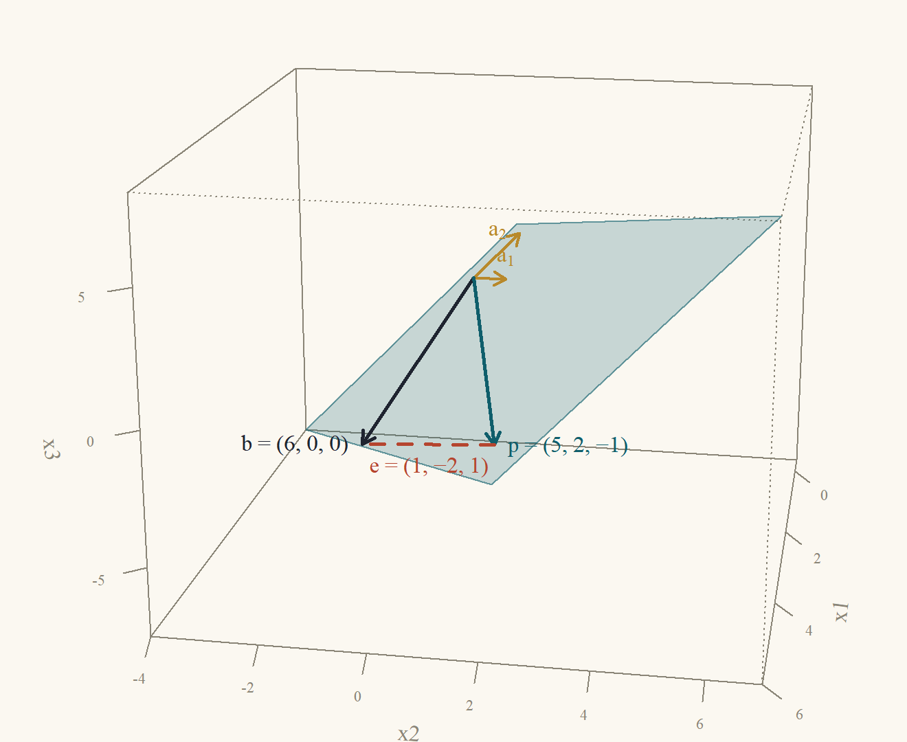
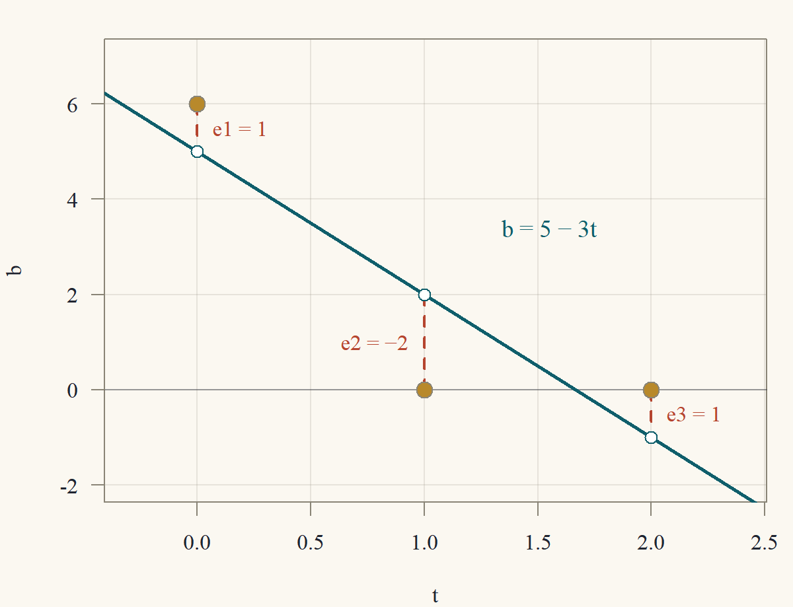
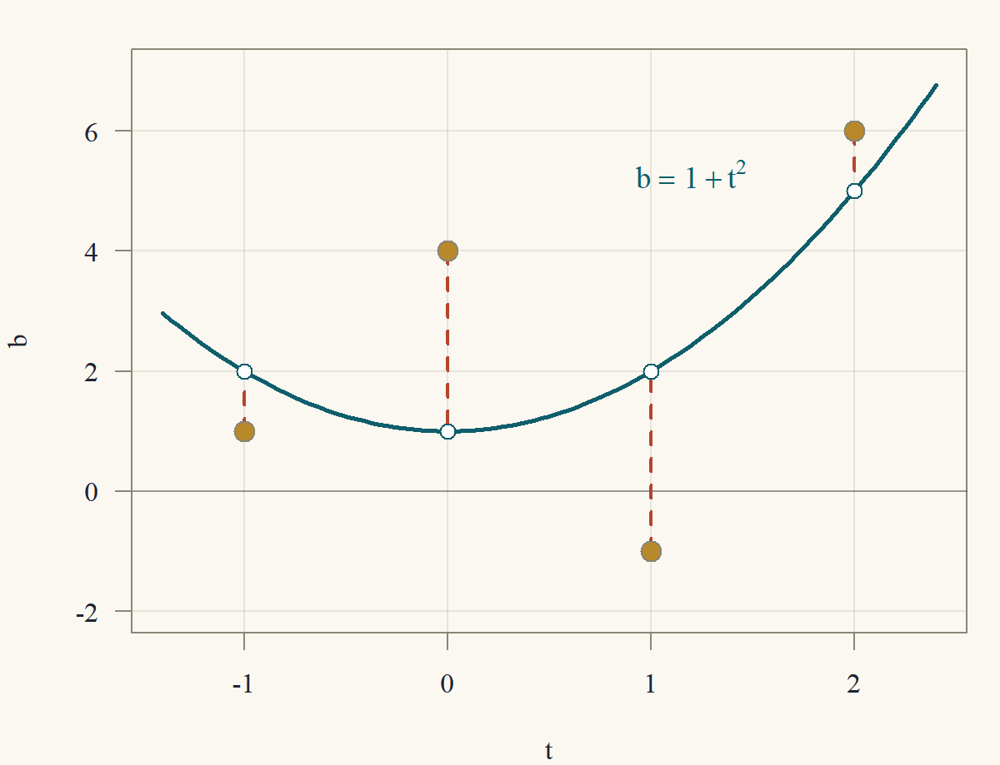
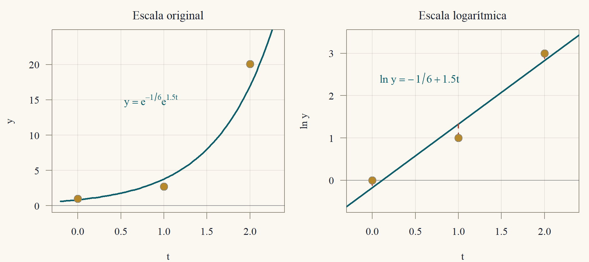
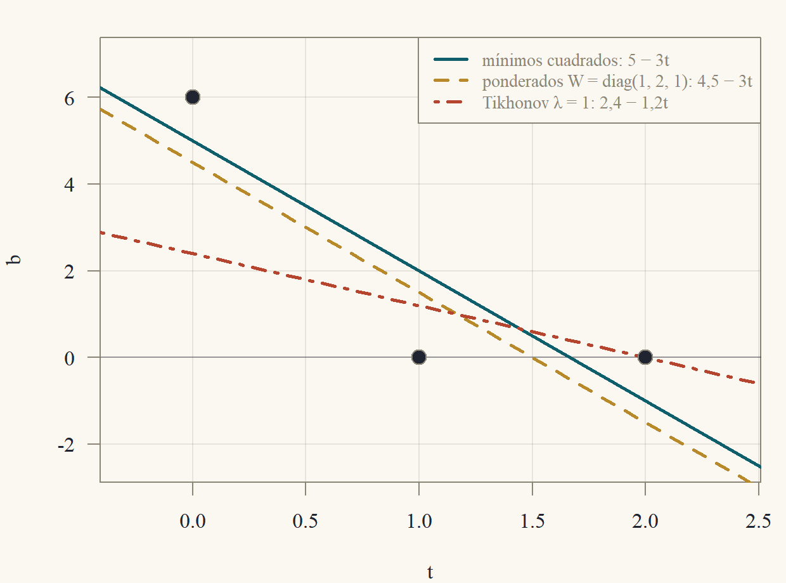

::: {.content-visible when-format="html"}
<a class="descarga-pdf" href="clase-06.pdf">Descargar esta clase en PDF</a>
:::

# Datos que no caben en una recta

Tres mediciones de una cantidad $b$ en los instantes $t = 0, 1, 2$ dieron $b = 6, 0, 0$. Se sospecha que $b$ depende linealmente del tiempo, $b = c + mt$, y se quiere encontrar $c$ y $m$. Cada medición es una ecuación:
$$
\begin{aligned}
c + m\cdot0 &= 6,\\
c + m\cdot1 &= 0,\\
c + m\cdot2 &= 0,
\end{aligned}
\qquad\text{es decir}\qquad
\underbrace{\begin{pmatrix}1&0\\1&1\\1&2\end{pmatrix}}_{A}\underbrace{\begin{pmatrix}c\\m\end{pmatrix}}_{x} = \underbrace{\begin{pmatrix}6\\0\\0\end{pmatrix}}_{b}.
$$
La eliminación de la Clase 1 responde que **no hay solución**: las dos primeras ecuaciones dan $c = 6$ y $m = -6$, y entonces la tercera diría $6 - 12 = 0$. Los tres puntos no están alineados. En términos de la Clase 3, $b\notin C(A)$: el vector de mediciones no es combinación de las columnas $(1,1,1)$ y $(0,1,2)$.

Este es el caso típico en las aplicaciones: **más ecuaciones que incógnitas**, con datos que traen error de medición. No se puede exigir $Ax = b$, pero sí se puede pedir que $Ax$ **quede lo más cerca posible** de $b$. El vector de errores (residuos) es $e = b - Ax$, y se elige el $x$ que haga mínima la suma de sus cuadrados, $\|e\|^2 = e_1^2 + \dots + e_m^2$.

::: {#def-mc}
## Problema de mínimos cuadrados
Dados $A$ ($m\times n$) y $b\in\mathbb{R}^m$, un **vector de mínimos cuadrados** es un $\hat x\in\mathbb{R}^n$ tal que
$$
\|b - A\hat x\|\le\|b - Ax\|\qquad\text{para todo }x\in\mathbb{R}^n.
$$
El **residuo** es $e = b - A\hat x$, y $p = A\hat x$ es el **ajuste** (el punto de $C(A)$ más cercano a $b$).
:::

¿Por qué cuadrados y no valores absolutos? Porque la suma de cuadrados es una norma al cuadrado, y con ella valen Pitágoras y toda la geometría de la Clase 5: el problema se resuelve con una proyección, sin iterar. (Minimizar $\sum|e_i|$ o $\max|e_i|$ es posible, pero es programación lineal, Clase 13.) Además, en estadística, mínimos cuadrados es el estimador de máxima verosimilitud cuando los errores son normales: es la regresión de Econometría 1, y esta clase es su álgebra.

# Las ecuaciones normales

Un lema previo, que dice cuándo $A'A$ es invertible.

::: {#lem-nucleo-ata}
## $A'A$ y $A$ tienen el mismo espacio nulo
Para toda matriz $A$ ($m\times n$): $N(A'A) = N(A)$. En particular, $A'A$ ($n\times n$) es invertible si y solo si las columnas de $A$ son independientes.
:::

::: {.proof}
Si $Ax = 0$, entonces $A'Ax = A'0 = 0$. Al revés, si $A'Ax = 0$, multiplicamos por $x'$:
$$
0 = x'A'Ax = (Ax)'(Ax) = \|Ax\|^2,
$$
y una norma es cero solo para el vector cero (Clase 5), así que $Ax = 0$.

Las columnas de $A$ son independientes si y solo si $N(A) = \{0\}$ (Clase 3), es decir, si y solo si $N(A'A) = \{0\}$. Una matriz cuadrada con espacio nulo trivial tiene $n$ pivotes y es invertible (Clase 1).
:::

::: {#thm-normales}
## Ecuaciones normales
Sea $A$ de tamaño $m\times n$ y $b\in\mathbb{R}^m$. Para $x\in\mathbb{R}^n$ son equivalentes:

1. $x$ es un vector de mínimos cuadrados.
2. $A'Ax = A'b$ (las **ecuaciones normales**).
3. El residuo $b - Ax$ es ortogonal a todas las columnas de $A$, es decir, a todo $C(A)$.

Además: siempre existe una solución; todas dan el mismo ajuste $p = Ax$ y el mismo residuo $e$; y $b = p + e$ es la única descomposición con $p\in C(A)$ y $e\in N(A')$. Si las columnas de $A$ son independientes, la solución es única:
$$
\hat x = (A'A)^{-1}A'b.
$$
:::

::: {.callout-note title="Borrador"}
Geométricamente, $Ax$ recorre el subespacio $C(A)$ y se busca el punto más cercano a $b$: el pie de la perpendicular, como en la proyección sobre una recta de la Clase 5. Perpendicular a $C(A)$ significa perpendicular a cada columna, $a_j'(b - Ax) = 0$, y esas $n$ ecuaciones juntas son $A'(b - Ax) = 0$. Para demostrar que "perpendicular implica mínimo" uso Pitágoras. Para el recíproco, si el residuo no fuera perpendicular, me muevo un poco en la dirección que lo acerca. La existencia sale de que $A'b$ siempre está en el rango de $A'A$.
:::

::: {.proof}
*(2) $\iff$ (3).* La entrada $j$ de $A'(b - Ax)$ es $a_j\cdot(b - Ax)$, con $a_j$ la columna $j$. Así que $A'(b - Ax) = 0$ si y solo si el residuo es ortogonal a cada columna. Y ser ortogonal a cada columna equivale a ser ortogonal a toda combinación de ellas, o sea a todo $C(A)$ (linealidad del producto interno). Es lo mismo que decir $b - Ax\in N(A')$.

*(3) $\Rightarrow$ (1).* Sea $x$ con el residuo $r = b - Ax$ ortogonal a $C(A)$, y sea $y$ cualquier otro vector. Escribimos $b - Ay = r + A(x - y)$. El vector $A(x - y)$ está en $C(A)$, así que es ortogonal a $r$, y por Pitágoras (Clase 5)
$$
\|b - Ay\|^2 = \|r\|^2 + \|A(x - y)\|^2\ge\|r\|^2 = \|b - Ax\|^2.
$$

*(1) $\Rightarrow$ (3).* Sea $x$ un minimizador, $r = b - Ax$ y $w = A'r$. Para un número $t$,
$$
\|b - A(x + tw)\|^2 = \|r - tAw\|^2 = \|r\|^2 - 2t\,(Aw)\cdot r + t^2\|Aw\|^2.
$$
Pero $(Aw)\cdot r = w'A'r = w\cdot w = \|w\|^2$. Supongamos $w\ne0$. Entonces $Aw\ne0$ (si fuera $Aw = 0$, tendríamos $\|w\|^2 = (Aw)\cdot r = 0$). Con $t = \|w\|^2/\|Aw\|^2>0$ queda
$$
\|b - A(x + tw)\|^2 = \|r\|^2 - \frac{\|w\|^4}{\|Aw\|^2}<\|r\|^2,
$$
lo que contradice que $x$ sea mínimo. Luego $w = A'r = 0$.

*Existencia.* Por el @lem-nucleo-ata, $N(A'A) = N(A)$, y por la fórmula rango más nulidad (Clase 3) los espacios columna de $A'A$ y de $A'$ tienen la misma dimensión, $n - \dim N(A)$. Además $C(A'A)\subset C(A')$, porque $A'(Ax)$ es una combinación de las columnas de $A'$. Un subespacio contenido en otro de la misma dimensión es igual a él, así que $C(A'A) = C(A')$. Como $A'b\in C(A')$, existe $x$ con $A'Ax = A'b$.

*Mismo ajuste y mismo residuo.* Si $x$ y $x'$ resuelven las ecuaciones normales, $A'A(x - x') = 0$, luego $x - x'\in N(A'A) = N(A)$ y $Ax = Ax'$. El ajuste $p$ y el residuo $e = b - p$ no dependen de la solución elegida.

*Descomposición única.* Existe, porque $p\in C(A)$ y $e\in N(A')$ por (3). Si $p + e = p' + e'$ con $p,p'\in C(A)$ y $e,e'\in N(A')$, entonces $p - p' = e' - e$ está en $C(A)\cap N(A') = \{0\}$ (ortogonalidad de los subespacios, Clase 3).

*Unicidad con columnas independientes.* Por el @lem-nucleo-ata, $A'A$ es invertible y $\hat x = (A'A)^{-1}A'b$ es la única solución.
:::

Cuando las columnas son dependientes hay infinitas soluciones, $\hat x + N(A)$ (la estructura de las soluciones de la Clase 3), con el mismo ajuste. Entre ellas hay una sola de norma mínima; se obtiene con la pseudoinversa de la Clase 9.

::: {#thm-proyector}
## La matriz de proyección
Si las columnas de $A$ son independientes, el ajuste es $p = Pb$ con
$$
P = A(A'A)^{-1}A',
$$
y valen: $P' = P$, $P^2 = P$, $PA = A$, y $I - P$ tiene las mismas propiedades y da el residuo, $e = (I - P)b$. Además $\|b\|^2 = \|p\|^2 + \|e\|^2$, y $Pb = b$ si y solo si $b\in C(A)$.
:::

::: {.proof}
Por el @thm-normales, $p = A\hat x = A(A'A)^{-1}A'b = Pb$. La matriz $A'A$ es simétrica, y la inversa de una simétrica es simétrica ($(M^{-1})' = (M')^{-1} = M^{-1}$), así que
$$
P' = A\big((A'A)^{-1}\big)'A' = A(A'A)^{-1}A' = P.
$$
Para la idempotencia, $P^2 = A(A'A)^{-1}(A'A)(A'A)^{-1}A' = A(A'A)^{-1}A' = P$, y $PA = A(A'A)^{-1}A'A = A$. Para $I - P$: es simétrica, y $(I - P)^2 = I - 2P + P^2 = I - P$. El residuo es $e = b - Pb = (I - P)b$.

Como $p\in C(A)$ y $e\perp C(A)$, Pitágoras da $\|b\|^2 = \|p\|^2 + \|e\|^2$. Finalmente, si $b = Ax$ para algún $x$, entonces $Pb = PAx = Ax = b$; y si $Pb = b$, entonces $b = A\big((A'A)^{-1}A'b\big)\in C(A)$.
:::

Si $A$ tiene una sola columna $a$, esto es exactamente la proyección sobre una recta de la Clase 5: $A'A = a\cdot a$ es un número y $P = aa'/(a'a)$.

::: {#exm-mc-plano}
## Una incógnita en el plano
Se mide $b = (2,3)'$ en dos instantes y se sospecha que es proporcional al tiempo $(1,2)'$: $b\approx c\,a$ con $a = (1,2)'$. Aquí $A = a$ y $A'A = 1 + 4 = 5$, $A'b = 2 + 6 = 8$. La ecuación normal $5c = 8$ da $\hat c = \tfrac85$. El ajuste es $p = \tfrac85(1,2) = (1{,}6;\ 3{,}2)$ y el residuo $e = b - p = (0{,}4;\ -0{,}2)$, con $a\cdot e = 0{,}4 - 0{,}4 = 0$ ✓. Los residuos **no** suman cero (suman $0{,}2$): eso solo ocurre cuando el modelo incluye una constante (Ejercicio 6.6).
:::

::: {#exm-mc-3d}
## Las tres mediciones: proyección sobre un plano del espacio
Con los datos de la sección anterior, $A = \begin{pmatrix}1&0\\1&1\\1&2\end{pmatrix}$ y $b = (6,0,0)'$:
$$
A'A = \begin{pmatrix}3&3\\3&5\end{pmatrix},\qquad A'b = \begin{pmatrix}6\\0\end{pmatrix}.
$$
Las ecuaciones normales son $3c + 3m = 6$ y $3c + 5m = 0$. Restando, $2m = -6$, de modo que $\hat m = -3$ y, de la primera, $\hat c = 2 - \hat m = 5$. (Con la inversa de la Clase 2: $\det A'A = 15 - 9 = 6$ y $(A'A)^{-1} = \tfrac16\begin{pmatrix}5&-3\\-3&3\end{pmatrix}$, que da el mismo $\hat x = \tfrac16(30,-18)' = (5,-3)'$.) El ajuste y el residuo son
$$
p = A\hat x = \begin{pmatrix}5\\2\\-1\end{pmatrix},\qquad e = b - p = \begin{pmatrix}1\\-2\\1\end{pmatrix}.
$$
Se verifica que $e$ es ortogonal a las dos columnas: $(1,1,1)\cdot e = 1 - 2 + 1 = 0$ y $(0,1,2)\cdot e = 0 - 2 + 2 = 0$ ✓. Pitágoras: $\|b\|^2 = 36 = \|p\|^2 + \|e\|^2 = (25 + 4 + 1) + (1 + 4 + 1) = 30 + 6$ ✓. La @fig-proy-plano-mc muestra la situación en $\mathbb{R}^3$: $C(A)$ es un plano, $b$ queda fuera y $p$ es su pie.
:::

{#fig-proy-plano-mc width=70%}

# Ajuste de curvas

El ejemplo anterior es un **ajuste de recta**. La misma idea ajusta cualquier modelo que sea **lineal en los parámetros**: si se quiere explicar $b_i$ con $x_1f_1(t_i) + \dots + x_nf_n(t_i)$, la matriz $A$ tiene como columna $j$ los valores de $f_j$ en los datos, y el problema es $\min\|Ax - b\|^2$.

## La recta de mínimos cuadrados

::: {#thm-recta}
## Fórmulas de la recta
Sean $(t_1,y_1),\dots,(t_N,y_N)$ datos con no todos los $t_i$ iguales, y sean $\bar t = \frac1N\sum t_i$ y $\bar y = \frac1N\sum y_i$. La recta $y = c + mt$ de mínimos cuadrados tiene
$$
\hat m = \frac{\sum_i(t_i - \bar t)(y_i - \bar y)}{\sum_i(t_i - \bar t)^2},\qquad\hat c = \bar y - \hat m\,\bar t.
$$
En particular, **pasa por el punto de promedios** $(\bar t,\bar y)$.
:::

::: {.callout-note title="Borrador"}
Escribo las dos ecuaciones normales, $A'Ax = A'y$ con $A = (1\ \ t)$, sumas incluidas. La primera, al dividir por el número de datos $N$, ya es "$\bar y = c + m\bar t$". Despejo $c$ y lo reemplazo en la segunda: queda una sola ecuación para $m$. Las sumas se reordenan usando $\sum(t_i - \bar t) = 0$.
:::

::: {.proof}
La columna de unos y la columna $t$ son independientes si y solo si $t$ no es múltiplo de $(1,\dots,1)'$, es decir, si no todos los $t_i$ son iguales. Entonces el @thm-normales da una solución única, que resuelve
$$
\begin{aligned}
Nc + \Big(\sum t_i\Big)m &= \sum y_i,\\
\Big(\sum t_i\Big)c + \Big(\sum t_i^2\Big)m &= \sum t_iy_i.
\end{aligned}
$$
Dividiendo la primera por $N$, $\bar y = c + m\bar t$, es decir, $c = \bar y - m\bar t$. Reemplazando en la segunda, con $\sum t_i = N\bar t$:
$$
\begin{aligned}
N\bar t\,(\bar y - m\bar t) + \Big(\sum t_i^2\Big)m &= \sum t_iy_i\\
\Longrightarrow\quad m\Big(\sum t_i^2 - N\bar t^2\Big) &= \sum t_iy_i - N\bar t\bar y.
\end{aligned}
$$
Ahora, $\sum(t_i - \bar t)^2 = \sum t_i^2 - 2\bar t\sum t_i + N\bar t^2 = \sum t_i^2 - N\bar t^2$ y, de la misma manera, $\sum(t_i - \bar t)(y_i - \bar y) = \sum t_iy_i - N\bar t\bar y$. Como el primero es positivo (algún $t_i\ne\bar t$), se puede despejar la pendiente y se obtiene la fórmula.
:::

::: {#exm-recta}
## La recta de las tres mediciones
Datos $(0,6),(1,0),(2,0)$: $\bar t = 1$, $\bar y = 2$. Entonces $\sum(t_i - \bar t)(y_i - \bar y) = (-1)(4) + 0\cdot(-2) + (1)(-2) = -6$ y $\sum(t_i - \bar t)^2 = 1 + 0 + 1 = 2$. La pendiente es $\hat m = -3$ y $\hat c = 2 - (-3)(1) = 5$: la recta $b = 5 - 3t$ del @exm-mc-3d. Pasa por $(1,2)$, el punto de promedios. Sus valores en los instantes $0, 1, 2$ son $5, 2, -1$, los componentes de $p$, y los residuos $1, -2, 1$ se ven en la @fig-recta-mc como los segmentos verticales entre cada punto y la recta.
:::

{#fig-recta-mc width=62%}

## Parábolas

::: {#exm-parabola}
## Una parábola por cuatro puntos
Se ajusta $b = x_1 + x_2t + x_3t^2$ a los datos $(t,b) = (-1,1),(0,4),(1,-1),(2,6)$. Las columnas de $A$ son $1$, $t$ y $t^2$ evaluados en los cuatro instantes:
$$
A = \begin{pmatrix}1&-1&1\\1&0&0\\1&1&1\\1&2&4\end{pmatrix},\qquad
A'A = \begin{pmatrix}4&2&6\\2&6&8\\6&8&18\end{pmatrix},
$$
$$
A'b = \begin{pmatrix}1 + 4 - 1 + 6\\-1 + 0 - 1 + 12\\1 + 0 - 1 + 24\end{pmatrix} = \begin{pmatrix}10\\10\\24\end{pmatrix}.
$$
(Las entradas de $A'A$ son las sumas $\sum t^k$: $4$, $\sum t = 2$, $\sum t^2 = 6$, $\sum t^3 = 8$, $\sum t^4 = 18$.) Las ecuaciones normales tienen la solución $\hat x = (1,0,1)'$, que se verifica reemplazando:
$$
4 + 0 + 6 = 10,\qquad2 + 0 + 8 = 10,\qquad6 + 0 + 18 = 24
$$
y las tres igualdades se cumplen ✓.
El ajuste es la parábola $b = 1 + t^2$ (@fig-parabola-mc), con valores $2, 1, 2, 5$ y residuos $e = (1 - 2,\ 4 - 1,\ -1 - 2,\ 6 - 5) = (-1,3,-3,1)$. Se comprueba la ortogonalidad: $\sum e_i = 0$, $\sum t_ie_i = 1 + 0 - 3 + 2 = 0$ y $\sum t_i^2e_i = -1 + 0 - 3 + 4 = 0$ ✓. La suma de cuadrados es $\|e\|^2 = 1 + 9 + 9 + 1 = 20$.
:::

{#fig-parabola-mc width=62%}

## Exponenciales: linealizar antes de ajustar

El modelo $y = ae^{kt}$ no es lineal en $k$, pero al tomar logaritmos, $\ln y = \ln a + kt$, sí lo es: se ajusta una recta a los puntos $(t_i,\ln y_i)$.

::: {#exm-exponencial}
## Crecimiento exponencial
Datos $t = 0, 1, 2$ con $y = 1,\ e,\ e^3$, de modo que $\ln y = (0,1,3)$. Es el ajuste de una recta con $\bar t = 1$, $\overline{\ln y} = \tfrac43$:
$$
\hat k = \frac{(-1)(0 - \frac43) + 0 + (1)(3 - \frac43)}{2} = \frac{\frac43 + \frac53}{2} = \frac32,
$$
$$
\widehat{\ln a} = \frac43 - \frac32 = -\frac16.
$$
El ajuste es $y = e^{-1/6}e^{1{,}5t}\approx0{,}846\,e^{1{,}5t}$. Los residuos en la escala logarítmica son $\ln y_i - (-\tfrac16 + \tfrac32t_i) = \tfrac16,\ -\tfrac13,\ \tfrac16$. Los valores ajustados en la escala original son $0{,}85;\ 3{,}79;\ 17{,}00$, frente a los datos $1;\ 2{,}72;\ 20{,}09$ (@fig-exponencial-mc).
:::

{#fig-exponencial-mc width=100%}

**Advertencia.** Este ajuste minimiza los errores en $\ln y$, no en $y$: los errores relativos pesan igual, y el punto grande $y = 20{,}09$ cuenta lo mismo que el chico $y = 1$. Si se minimizara $\sum(y_i - ae^{kt_i})^2$ directamente (un problema no lineal, que se resuelve por iteración), se obtendría otra curva: en este ejemplo, $a\approx0{,}415$ y $k\approx1{,}94$. Cuál usar depende de cómo es el error de los datos; en la sección de pesos se ve que el ajuste logarítmico equivale, aproximadamente, a ponderar los datos.

# Cómo se resuelve en la práctica

Para calcular $\hat x$ hay dos caminos.

::: {.callout-caution title="Algoritmo: mínimos cuadrados por ecuaciones normales"}
Entrada: $A$ ($m\times n$) con columnas independientes y $b$.

1. Calcular $G = A'A$ ($n\times n$, simétrica) y $c = A'b$.
2. Resolver $Gx = c$ (por Cholesky, Clase 8, o por LU).

**Costo:** $\approx mn^2 + \tfrac13n^3$ operaciones (el producto $A'A$ aprovecha la simetría). **Punto débil:** el número de condición de $A'A$ es el **cuadrado** del de $A$ (sección ★): se pierde precisión.
:::

::: {.callout-caution title="Algoritmo: mínimos cuadrados por QR"}
Entrada: $A$ ($m\times n$) con columnas independientes y $b$.

1. Factorizar $A = QR$ (Householder, Clase 5).
2. Calcular $d = Q'b$ (aplicando las reflexiones a $b$, sin formar $Q$).
3. Resolver $R\hat x = d$ hacia atrás.

**Costo:** $\approx2mn^2 - \tfrac23n^3$, el doble que las ecuaciones normales cuando $m\gg n$. **Ventaja:** nunca se forma $A'A$; es el método de las bibliotecas numéricas.
:::

::: {#thm-mc-qr}
## Mínimos cuadrados con QR
Si $A = QR$ con $Q$ ($m\times n$) de columnas ortonormales y $R$ ($n\times n$) triangular superior invertible, el vector de mínimos cuadrados resuelve
$$
R\hat x = Q'b.
$$
Además $P = QQ'$ y $\|e\|^2 = \|b\|^2 - \|Q'b\|^2$.
:::

::: {.proof}
$A'A = R'Q'QR = R'R$ y $A'b = R'Q'b$. Las ecuaciones normales son $R'R\hat x = R'Q'b$. Como $R$ es invertible, $R'$ también (su determinante es el mismo, $\det R' = \det R$, Clase 4), y multiplicando por $(R')^{-1}$ queda $R\hat x = Q'b$. Para la matriz de proyección,
$$
P = A(A'A)^{-1}A' = QR\,(R'R)^{-1}R'Q' = QR\,R^{-1}(R')^{-1}R'Q' = QQ'.
$$
Finalmente $p = QQ'b$ y, como $Q$ conserva normas (Clase 5, matriz de columnas ortonormales), $\|p\|^2 = \|Q(Q'b)\|^2 = \|Q'b\|^2$. Por Pitágoras (@thm-proyector), $\|e\|^2 = \|b\|^2 - \|p\|^2$.
:::

::: {#exm-mc-qr}
## Las tres mediciones, ahora con QR
Gram–Schmidt (Clase 5) sobre las columnas $a_1 = (1,1,1)$ y $a_2 = (0,1,2)$ de $A$:

- $r_{11} = \sqrt3$ y $q_1 = \tfrac1{\sqrt3}(1,1,1)$.
- $r_{12} = q_1\cdot a_2 = \tfrac3{\sqrt3} = \sqrt3$. Luego $v_2 = a_2 - \sqrt3\,q_1 = (0,1,2) - (1,1,1) = (-1,0,1)$, $r_{22} = \sqrt2$ y $q_2 = \tfrac1{\sqrt2}(-1,0,1)$.

Así $R = \begin{pmatrix}\sqrt3&\sqrt3\\0&\sqrt2\end{pmatrix}$. Los términos de $Q'b$ son $q_1\cdot b = \tfrac6{\sqrt3} = 2\sqrt3$ y $q_2\cdot b = \tfrac{-6}{\sqrt2} = -3\sqrt2$. El sistema triangular $R\hat x = Q'b$ se resuelve hacia atrás:
$$
\sqrt2\,\hat m = -3\sqrt2\ \Rightarrow\ \hat m = -3,\qquad\sqrt3\,\hat c + \sqrt3(-3) = 2\sqrt3\ \Rightarrow\ \hat c = 5.
$$
Es la misma recta $5 - 3t$. Y $\|e\|^2 = \|b\|^2 - \|Q'b\|^2 = 36 - (12 + 18) = 6$, el valor ya conocido.
:::

# Pesos y regularización

## Mínimos cuadrados ponderados

Si algunas mediciones son más confiables que otras, conviene que sus errores pesen más. Con pesos $w_i>0$ se minimiza $\sum w_ie_i^2 = e'We$, con $W = \operatorname{diag}(w_1,\dots,w_m)$.

::: {#thm-ponderados}
## Ecuaciones normales ponderadas
El vector que minimiza $\sum_iw_i\,(b_i - a_i'x)^2$ (con $a_i'$ la fila $i$ de $A$) resuelve
$$
A'WA\,x = A'Wb,
$$
y es único si las columnas de $A$ son independientes.
:::

::: {.proof}
Sea $D = \operatorname{diag}(\sqrt{w_1},\dots,\sqrt{w_m})$, de modo que $D'D = D^2 = W$. Entonces $\sum w_ie_i^2 = \|De\|^2 = \|DAx - Db\|^2$, un problema de mínimos cuadrados ordinario con matriz $DA$ y lado derecho $Db$. Sus ecuaciones normales (@thm-normales) son $(DA)'(DA)x = (DA)'Db$, es decir, $A'D^2Ax = A'D^2b$. Como $D$ es invertible, $DAx = 0$ implica $Ax = 0$, así que $DA$ tiene columnas independientes si $A$ las tiene, y la solución es única.
:::

## Regularización de Tikhonov

Si las columnas de $A$ son casi dependientes, o hay más incógnitas que datos, la solución de mínimos cuadrados es inestable o no es única. La **regularización de Tikhonov** agrega un castigo por el tamaño de la solución:
$$
\min_x\ \|Ax - b\|^2 + \lambda\|x\|^2,\qquad\lambda>0.
$$

::: {#thm-tikhonov}
## Tikhonov
Para toda $A$ ($m\times n$) y $\lambda>0$, la matriz $A'A + \lambda I$ es invertible y el problema tiene solución única,
$$
x_\lambda = (A'A + \lambda I)^{-1}A'b.
$$
:::

::: {.callout-note title="Borrador"}
El castigo $\lambda\|x\|^2 = \|\sqrt\lambda\,x\|^2$ es otra suma de cuadrados, así que apilo debajo de $A$ la matriz $\sqrt\lambda I$ y debajo de $b$ un vector de ceros: el problema se vuelve de mínimos cuadrados ordinario. La matriz apilada siempre tiene columnas independientes, por el $\sqrt\lambda I$.
:::

::: {.proof}
Sea $\tilde A = \begin{pmatrix}A\\\sqrt\lambda\,I\end{pmatrix}$ ($(m + n)\times n$) y $\tilde b = \begin{pmatrix}b\\0\end{pmatrix}$. Entonces
$$
\|\tilde Ax - \tilde b\|^2 = \|Ax - b\|^2 + \|\sqrt\lambda\,x\|^2 = \|Ax - b\|^2 + \lambda\|x\|^2.
$$
Si $\tilde Ax = 0$, la segunda parte dice $\sqrt\lambda\,x = 0$, así que $x = 0$: las columnas de $\tilde A$ son independientes. Por el @thm-normales hay una única solución, y resuelve $\tilde A'\tilde Ax = \tilde A'\tilde b$. Pero $\tilde A'\tilde A = A'A + \lambda I$ y $\tilde A'\tilde b = A'b$. Por el @lem-nucleo-ata, $\tilde A'\tilde A$ es invertible.
:::

Cuando $\lambda$ crece, la solución se achica hacia $0$ (el término $\lambda\|x\|^2$ domina); cuando $\lambda\to0$ se acerca a la de mínimos cuadrados (si las columnas son independientes). Es la **regresión ridge** de la econometría, y cuando $A'A$ es casi singular, sumar $\lambda I$ es lo que hace calculable la solución. La Clase 14 la estudia con la SVD.

::: {#exm-comparacion}
## Tres rectas para los mismos datos
Los datos $(0,6),(1,0),(2,0)$ con $A = \begin{pmatrix}1&0\\1&1\\1&2\end{pmatrix}$, $b = (6,0,0)'$ y $A'b = (6,0)'$ (@fig-comparacion-mc):

- **Mínimos cuadrados:** $5 - 3t$ (@exm-mc-3d).
- **Ponderados con $W = \operatorname{diag}(1,2,1)$** (se confía el doble en la medición del instante $1$). $A'WA = \begin{pmatrix}\sum w&\sum wt\\\sum wt&\sum wt^2\end{pmatrix} = \begin{pmatrix}4&4\\4&6\end{pmatrix}$ y $A'Wb = (6,0)'$. Con $\det = 24 - 16 = 8$, $x = \tfrac18\begin{pmatrix}6&-4\\-4&4\end{pmatrix}\begin{pmatrix}6\\0\end{pmatrix} = (4{,}5;\ -3)'$. La recta es $4{,}5 - 3t$: pasa más cerca del punto ponderado, $(1,0)$, con residuos $1{,}5;\ -1{,}5;\ 1{,}5$, y su suma ponderada de cuadrados, $1{,}5^2 + 2\cdot1{,}5^2 + 1{,}5^2 = 9$, es menor que la de la recta ordinaria, $1 + 2\cdot4 + 1 = 10$ ✓.
- **Tikhonov con $\lambda = 1$.** $A'A + I = \begin{pmatrix}4&3\\3&6\end{pmatrix}$ y $\det = 24 - 9 = 15$: $x_1 = \tfrac1{15}\begin{pmatrix}6&-3\\-3&4\end{pmatrix}\begin{pmatrix}6\\0\end{pmatrix} = (2{,}4;\ -1{,}2)'$. La recta $2{,}4 - 1{,}2t$ tiene una pendiente mucho menor: el castigo reduce $\|x\|^2$ de $34$ a $7{,}2$ a costa de subir el error de $6$ a $14{,}4$. El objetivo $\|e\|^2 + \lambda\|x\|^2$ vale $21{,}6$ con Tikhonov, contra $6 + 34 = 40$ para la recta ordinaria.
:::

{#fig-comparacion-mc width=62%}

**El ajuste logarítmico, visto como pesos.** Si el ajuste $\hat y_i$ está cerca de $y_i$, entonces $\ln y_i - \ln\hat y_i = \ln\big(1 + \tfrac{y_i - \hat y_i}{\hat y_i}\big)\approx\tfrac{y_i - \hat y_i}{y_i}$. Por lo tanto, minimizar $\sum(\ln y_i - \ln\hat y_i)^2$ equivale, aproximadamente, a minimizar $\sum w_i\,(y_i - \hat y_i)^2$ con pesos $w_i = 1/y_i^2$: en la escala original, los datos chicos pesan más y los grandes menos. Por eso el ajuste del @exm-exponencial queda más lejos del dato grande ($17{,}00$ contra $20{,}09$) que el ajuste no lineal directo.

# ★ Para ir más allá: el condicionamiento se eleva al cuadrado

::: {.callout-important title="★ Para ir más allá"}
Las ecuaciones normales son atractivas porque son un sistema cuadrado, pero formar $A'A$ tiene un costo oculto: **el número de condición se eleva al cuadrado.** Si $A$ tiene columnas casi dependientes, $A'A$ puede volverse numéricamente singular aunque $A$ no lo sea. La QR de Householder no tiene ese problema.
:::

Para una matriz $A$ con columnas independientes, el **número de condición** es $\kappa(A) = \sigma_{\max}/\sigma_{\min}$, donde $\sigma_i^2$ son los valores propios de $A'A$ (los valores singulares; la teoría completa está en las Clases 9 y 10). Mide cuánto se puede amplificar un error relativo en los datos. Como los valores propios de $A'A$ son los $\sigma_i^2$,
$$
\kappa(A'A) = \frac{\sigma_{\max}^2}{\sigma_{\min}^2} = \kappa(A)^2.
$$
La regla práctica (demostrada en Trefethen y Bau, y que la Clase 10 desarrolla) es que el error relativo de la solución es del orden de $\kappa\cdot u$ con $u\approx10^{-16}$ el épsilon de la máquina. Con QR el factor es $\kappa(A)$ (cuando el residuo es chico); con ecuaciones normales, $\kappa(A)^2$.

**El ejemplo de Läuchli.** Sea $\delta = 10^{-8}$ y
$$
A = \begin{pmatrix}1&1\\\delta&0\\0&\delta\end{pmatrix},\qquad b = A\begin{pmatrix}1\\1\end{pmatrix} = \begin{pmatrix}2\\\delta\\\delta\end{pmatrix},
$$
de modo que la solución exacta es $\hat x = (1,1)'$ y el residuo es cero. Las columnas son independientes, y los valores propios de $A'A$ son $2 + \delta^2$ y $\delta^2$: $\sigma_{\max} = \sqrt{2 + \delta^2}\approx1{,}41$, $\sigma_{\min} = \delta$, de modo que
$$
\kappa(A) = \frac{\sqrt{2 + \delta^2}}{\delta}\approx1{,}4\times10^8,\qquad\kappa(A'A) = \frac{2 + \delta^2}{\delta^2}\approx2\times10^{16}.
$$

*Ecuaciones normales.* La matriz exacta es
$$
A'A = \begin{pmatrix}1 + \delta^2&1\\1&1 + \delta^2\end{pmatrix},
$$
$$
\det A'A = (1 + \delta^2)^2 - 1 = 2\delta^2 + \delta^4\approx2\times10^{-16}.
$$
Pero $\delta^2 = 10^{-16}<u$, así que el computador redondea $1 + \delta^2$ a $1$ (el mismo mecanismo de la Clase 5) y almacena $\begin{pmatrix}1&1\\1&1\end{pmatrix}$, que es **exactamente singular**: la información sobre la diferencia entre las dos columnas, que vivía en $\delta^2$, se perdió al sumar. Resolver las ecuaciones normales falla (en R, `solve(crossprod(A), crossprod(A, b))` responde "system is exactly singular").

*QR con Householder.* Se aplica la reflexión de Householder a la primera columna $(1,\delta,0)$, cuya norma $\sqrt{1 + \delta^2}$ se redondea a $1$. Con $v = (1,\delta,0) + 1\cdot e_1 = (2,\delta,0)$ y $v'v\approx4$ (de nuevo $\delta^2$ desaparece al sumar, pero aquí **no importa**: afecta a una cantidad que no se amplifica después), la reflexión actúa como
$$
Hz = z - 2v\,\frac{v'z}{v'v}\approx z - \tfrac12\,v\,(v'z),
$$
y da
$$
H\begin{pmatrix}1\\\delta\\0\end{pmatrix} = \begin{pmatrix}-1\\0\\0\end{pmatrix},\qquad
H\begin{pmatrix}1\\0\\\delta\end{pmatrix} = \begin{pmatrix}-1\\-\delta\\\delta\end{pmatrix},\qquad
Hb = \begin{pmatrix}-2\\-\delta\\\delta\end{pmatrix}.
$$
La información de la segunda columna **sigue ahí**, en las entradas $\pm\delta$. La segunda reflexión actúa sobre $(-\delta,\delta)$ (en las dos últimas filas, tanto de la segunda columna como del lado derecho) y lo lleva a $(\sqrt2\,\delta,0)$. El sistema triangular es
$$
R = \begin{pmatrix}-1&-1\\0&\sqrt2\,\delta\end{pmatrix},\qquad d = \begin{pmatrix}-2\\\sqrt2\,\delta\end{pmatrix}\ \Rightarrow\ \hat x_2 = 1,\quad\hat x_1 = 1.
$$

Los resultados de correr los dos métodos en el computador (16 cifras) son:

| Método | $\hat x_1$ | $\hat x_2$ |
|---|---|---|
| Ecuaciones normales | falla: $A'A$ singular | falla |
| QR (Householder) | $1$ (error $\sim10^{-16}$) | $1$ (error $\sim10^{-16}$) |

Aquí $\kappa(A)^2 = 2\times10^{16}>1/u$: las ecuaciones normales no pueden dejar **ninguna** cifra correcta, mientras que la regla práctica para QR, $\kappa(A)\,u\approx10^{-8}$, promete unas ocho. (La cota es pesimista: el resultado real tiene error $\sim10^{-16}$ porque aquí el residuo es cero; con residuos grandes, también QR arrastra un término del orden de $\kappa(A)^2u$.) (La función `qr()` de R usa por defecto una tolerancia de rango de $10^{-7}$ y declararía de rango $1$ esta matriz; hay que bajarla, `qr.solve(A, b, tol = 1e-14)`, o usar `qr(A, LAPACK = TRUE)`.)

::: {.callout-caution title="En más dimensiones"}
Todo vale para $A$ de $m\times n$ con $m$ y $n$ grandes: las ecuaciones normales, la matriz de proyección y la solución por QR no cambian. Dos extensiones están en las clases siguientes: si las columnas son dependientes, la solución de **norma mínima** es $\hat x = A^+b$ con la pseudoinversa (Clase 9); y los problemas **no lineales**, como el ajuste exponencial directo, se resuelven con Gauss–Newton, que repite un mínimos cuadrados lineal en cada paso. En la econometría, $\hat x = (X'X)^{-1}X'y$ es el estimador MCO, $P$ es la matriz "sombrero" que lleva $y$ a los valores ajustados, y $e\perp C(X)$ es la ortogonalidad de los residuos con los regresores.
:::

# Resumen

- **Problema:** $\min_x\|Ax - b\|^2$ cuando $Ax = b$ no tiene solución. El ajuste $p = A\hat x$ es el punto de $C(A)$ más cercano a $b$; el residuo $e = b - p$ está en $N(A')$.
- **Ecuaciones normales:** $A'A\hat x = A'b$ (@thm-normales), equivalentes a $e\perp C(A)$. Siempre tienen solución; es única si y solo si las columnas son independientes, y entonces $\hat x = (A'A)^{-1}A'b$.
- **Matriz de proyección:** $P = A(A'A)^{-1}A'$, simétrica e idempotente, con $p = Pb$, $e = (I - P)b$ y $\|b\|^2 = \|p\|^2 + \|e\|^2$ (@thm-proyector).
- **Rectas:** $\hat m = \sum(t_i - \bar t)(y_i - \bar y)/\sum(t_i - \bar t)^2$ y $\hat c = \bar y - \hat m\bar t$ (@thm-recta); los residuos suman cero. Parábolas y exponenciales (por logaritmos) son lo mismo con otras columnas.
- **QR:** $R\hat x = Q'b$ (@thm-mc-qr), $P = QQ'$. **Ponderados:** $A'WA\,x = A'Wb$ (@thm-ponderados). **Tikhonov:** $(A'A + \lambda I)x = A'b$, siempre invertible (@thm-tikhonov).
- **★** $\kappa(A'A) = \kappa(A)^2$: las ecuaciones normales pierden el doble de cifras; QR es el método estándar.

# Ejercicios

**Ejercicio 6.1.** Ajusta la recta de mínimos cuadrados a los datos $(t,y) = (0,1),(1,2),(2,2),(3,5)$. (a) Por las ecuaciones normales. (b) Con las fórmulas del @thm-recta. (c) Con QR (Gram–Schmidt sobre las columnas de $A$). Da los residuos y verifica que son ortogonales a las columnas.

::: {.callout-tip collapse="true" title="Solución 6.1"}
(a) $A = \begin{pmatrix}1&0\\1&1\\1&2\\1&3\end{pmatrix}$, $A'A = \begin{pmatrix}4&6\\6&14\end{pmatrix}$ y $A'y = (1 + 2 + 2 + 5,\ 0 + 2 + 4 + 15)' = (10,21)'$. El determinante es $56 - 36 = 20$ y
$$
\hat x = \frac1{20}\begin{pmatrix}14&-6\\-6&4\end{pmatrix}\begin{pmatrix}10\\21\end{pmatrix} = \frac1{20}\begin{pmatrix}140 - 126\\-60 + 84\end{pmatrix} = \begin{pmatrix}0{,}7\\1{,}2\end{pmatrix}.
$$
La recta es $y = 0{,}7 + 1{,}2t$.

(b) $\bar t = 1{,}5$, $\bar y = 2{,}5$. $\sum(t_i - \bar t)(y_i - \bar y) = (-1{,}5)(-1{,}5) + (-0{,}5)(-0{,}5) + (0{,}5)(-0{,}5) + (1{,}5)(2{,}5) = 2{,}25 + 0{,}25 - 0{,}25 + 3{,}75 = 6$ y $\sum(t_i - \bar t)^2 = 2{,}25 + 0{,}25 + 0{,}25 + 2{,}25 = 5$. Entonces $\hat m = 6/5 = 1{,}2$ y $\hat c = 2{,}5 - 1{,}2\cdot1{,}5 = 0{,}7$ ✓.

(c) $a_1 = (1,1,1,1)$: $r_{11} = 2$, $q_1 = \tfrac12(1,1,1,1)$. $a_2 = (0,1,2,3)$: $r_{12} = q_1\cdot a_2 = \tfrac62 = 3$; $v_2 = a_2 - 3q_1 = (-1{,}5;\ -0{,}5;\ 0{,}5;\ 1{,}5)$, $\|v_2\|^2 = 5$, $r_{22} = \sqrt5$, $q_2 = v_2/\sqrt5$. Luego $q_1\cdot y = \tfrac{10}2 = 5$ y $q_2\cdot y = \tfrac1{\sqrt5}(-1{,}5 - 1 + 1 + 7{,}5) = \tfrac6{\sqrt5}$. El sistema $R\hat x = Q'y$ es $\sqrt5\,\hat m = \tfrac6{\sqrt5}$, o sea $\hat m = \tfrac65 = 1{,}2$, y $2\hat c + 3\cdot1{,}2 = 5$, o sea $\hat c = 0{,}7$ ✓.

Residuos: valores ajustados $0{,}7;\ 1{,}9;\ 3{,}1;\ 4{,}3$ y $e = (0{,}3;\ 0{,}1;\ -1{,}1;\ 0{,}7)$. Con $(1,1,1,1)$: $0{,}3 + 0{,}1 - 1{,}1 + 0{,}7 = 0$ ✓. Con $(0,1,2,3)$: $0 + 0{,}1 - 2{,}2 + 2{,}1 = 0$ ✓. Suma de cuadrados: $0{,}09 + 0{,}01 + 1{,}21 + 0{,}49 = 1{,}8$; por el @thm-mc-qr, $\|y\|^2 - \|Q'y\|^2 = 34 - (25 + \tfrac{36}5) = 34 - 32{,}2 = 1{,}8$ ✓.
:::

**Ejercicio 6.2.** Sea $A = \begin{pmatrix}1&0\\0&1\\1&1\end{pmatrix}$ y $b = (1,2,6)'$. (a) Calcula $\hat x$, $p$ y $e$. (b) Calcula $P$ y verifica $Pb = p$ y una entrada de $P^2 = P$. (c) ¿A qué distancia está $b$ del plano $C(A)$?

::: {.callout-tip collapse="true" title="Solución 6.2"}
(a) $A'A = \begin{pmatrix}2&1\\1&2\end{pmatrix}$, $A'b = (7,8)'$, $\det = 3$ y $(A'A)^{-1} = \tfrac13\begin{pmatrix}2&-1\\-1&2\end{pmatrix}$. Entonces $\hat x = \tfrac13(14 - 8,\ -7 + 16)' = (2,3)'$. $p = A\hat x = (2,3,5)'$ y $e = b - p = (-1,-1,1)'$. Ortogonalidad: $(1,0,1)\cdot e = -1 + 1 = 0$ y $(0,1,1)\cdot e = -1 + 1 = 0$ ✓.

(b) $P = A(A'A)^{-1}A'$. Primero $A(A'A)^{-1} = \tfrac13\begin{pmatrix}1&0\\0&1\\1&1\end{pmatrix}\begin{pmatrix}2&-1\\-1&2\end{pmatrix} = \tfrac13\begin{pmatrix}2&-1\\-1&2\\1&1\end{pmatrix}$ y, multiplicando por $A' = \begin{pmatrix}1&0&1\\0&1&1\end{pmatrix}$,
$$
P = \frac13\begin{pmatrix}2&-1&1\\-1&2&1\\1&1&2\end{pmatrix}.
$$
$Pb = \tfrac13(2 - 2 + 6,\ -1 + 4 + 6,\ 1 + 2 + 12) = \tfrac13(6,9,15) = (2,3,5) = p$ ✓. Entrada $(1,1)$ de $P^2$: fila 1 por columna 1, $\tfrac19(2\cdot2 + (-1)(-1) + 1\cdot1) = \tfrac69 = \tfrac23 = P_{11}$ ✓.

(c) $\|e\| = \sqrt{1 + 1 + 1} = \sqrt3\approx1{,}73$. Pitágoras: $\|b\|^2 = 41 = \|p\|^2 + \|e\|^2 = (4 + 9 + 25) + 3 = 38 + 3$ ✓.
:::

**Ejercicio 6.3.** Ajusta un plano $z = c_0 + c_1x + c_2y$ a los puntos $(x,y,z) = (0,0,2),(1,0,3),(0,1,2),(1,1,7)$. Da los residuos y verifica que son ortogonales a las tres columnas.

::: {.callout-tip collapse="true" title="Solución 6.3"}
Las columnas de $A$ son $1$, $x$ e $y$ evaluados en los cuatro puntos: $A = \begin{pmatrix}1&0&0\\1&1&0\\1&0&1\\1&1&1\end{pmatrix}$, $z = (2,3,2,7)'$.
$$
A'A = \begin{pmatrix}4&2&2\\2&2&1\\2&1&2\end{pmatrix},\qquad A'z = \begin{pmatrix}2 + 3 + 2 + 7\\3 + 7\\2 + 7\end{pmatrix} = \begin{pmatrix}14\\10\\9\end{pmatrix}.
$$
Probamos $\hat c = (1,3,2)$: $4 + 6 + 4 = 14$, $2 + 6 + 2 = 10$ y $2 + 3 + 4 = 9$ ✓. Por unicidad (las columnas son independientes: $A'A$ es invertible, con $\det = 4(4 - 1) - 2(4 - 2) + 2(2 - 4) = 12 - 4 - 4 = 4\ne0$), es la solución. El plano es $z = 1 + 3x + 2y$, con valores ajustados $1, 4, 3, 6$ y residuos $e = (1,-1,-1,1)$. Ortogonalidad: $\sum e = 0$; $\sum xe = 0 + (-1) + 0 + 1 = 0$; $\sum ye = 0 + 0 + (-1) + 1 = 0$ ✓. $\|e\|^2 = 4$.
:::

**Ejercicio 6.4.** Ajusta $y = ae^{kt}$ a $(t,y) = (0,1),(1,2),(2,8)$ linealizando. Da $a$ y $k$ y los valores ajustados en la escala original.

::: {.callout-tip collapse="true" title="Solución 6.4"}
$\ln y = (0,\ \ln2,\ 3\ln2)$, $\bar t = 1$, $\overline{\ln y} = \tfrac43\ln2$. $\sum(t_i - \bar t)(\ln y_i - \overline{\ln y}) = (-1)(-\tfrac43\ln2) + 0 + (1)(3\ln2 - \tfrac43\ln2) = \tfrac43\ln2 + \tfrac53\ln2 = 3\ln2$ y $\sum(t_i - \bar t)^2 = 2$. Entonces
$$
\hat k = \tfrac32\ln2\approx1{,}040,
$$
$$
\widehat{\ln a} = \tfrac43\ln2 - \tfrac32\ln2 = -\tfrac16\ln2,\qquad\hat a = 2^{-1/6}\approx0{,}891.
$$
La curva es $y = 2^{-1/6}\,2^{1{,}5t} = 2^{1{,}5t - 1/6}$: el valor se multiplica por $2^{1{,}5}\approx2{,}83$ en cada unidad de tiempo. Valores ajustados: $2^{-1/6} = 0{,}891$; $2^{4/3} = 2{,}520$; $2^{17/6} = 7{,}127$, frente a los datos $1, 2, 8$.
:::

**Ejercicio 6.5.** Con los datos $(0,6),(1,0),(2,0)$ del @exm-comparacion, calcula (a) la recta **ponderada** con $W = \operatorname{diag}(2,1,1)$ y (b) la solución de **Tikhonov** con $\lambda = 3$. En ambos casos, ¿cuál es el valor de la recta en $t = 0$ y qué tan cerca queda de la medición $6$?

::: {.callout-tip collapse="true" title="Solución 6.5"}
(a) $A'WA = \begin{pmatrix}\sum w&\sum wt\\\sum wt&\sum wt^2\end{pmatrix} = \begin{pmatrix}4&3\\3&5\end{pmatrix}$ (con $w = (2,1,1)$ y $t = (0,1,2)$: $\sum wt = 0 + 1 + 2 = 3$, $\sum wt^2 = 0 + 1 + 4 = 5$) y $A'Wb = (12,0)'$. $\det = 20 - 9 = 11$ y $x = \tfrac1{11}\begin{pmatrix}5&-3\\-3&4\end{pmatrix}\begin{pmatrix}12\\0\end{pmatrix} = \tfrac1{11}(60,-36)'$. La recta es $\tfrac{60}{11} - \tfrac{36}{11}t\approx5{,}45 - 3{,}27t$. En $t = 0$ vale $5{,}45$: el error con $6$ es $0{,}55$, menor que el $1$ de la recta ordinaria, porque ese punto pesa el doble.

(b) $A'A + 3I = \begin{pmatrix}6&3\\3&8\end{pmatrix}$, $\det = 48 - 9 = 39$ y $x_3 = \tfrac1{39}\begin{pmatrix}8&-3\\-3&6\end{pmatrix}\begin{pmatrix}6\\0\end{pmatrix} = \tfrac1{39}(48,-18)' = (\tfrac{16}{13},-\tfrac6{13})'\approx(1{,}23;\ -0{,}46)'$. En $t = 0$ vale $1{,}23$, lejos de $6$: con $\lambda = 3$ el castigo domina. Comparando con $\lambda = 1$ del texto, $(2{,}4;\ -1{,}2)$: al crecer $\lambda$ la solución se achica hacia $0$.
:::

**Ejercicio 6.6.** Demuestra que si el vector $(1,\dots,1)'$ es una columna de $A$ (el modelo tiene constante), entonces los residuos de mínimos cuadrados suman cero, y que la recta ajustada pasa por $(\bar t,\bar y)$ sin usar las fórmulas del @thm-recta. Compruébalo con los residuos $(0{,}3;\ 0{,}1;\ -1{,}1;\ 0{,}7)$ del Ejercicio 6.1.

::: {.callout-tip collapse="true" title="Solución 6.6"}
Por el @thm-normales, $e\perp C(A)$, y el vector de unos $\mathbf 1$ es una columna de $A$, así que $\mathbf 1\cdot e = 0$, es decir, $\sum e_i = 0$.

Para la recta, $y_i = \hat c + \hat mt_i + e_i$ para cada dato. Sumando las $m$ ecuaciones y dividiendo por $m$: $\bar y = \hat c + \hat m\bar t + \bar e = \hat c + \hat m\bar t$, porque $\bar e = \tfrac1m\sum e_i = 0$. Esa igualdad dice que el punto $(\bar t,\bar y)$ está en la recta.

Comprobación: $0{,}3 + 0{,}1 - 1{,}1 + 0{,}7 = 0$ ✓, y $\hat c + \hat m\bar t = 0{,}7 + 1{,}2\cdot1{,}5 = 2{,}5 = \bar y$ ✓. (En el @exm-mc-plano no había constante, y los residuos sumaban $0{,}2$.)
:::

**Ejercicio 6.7 ★.** Sea $\varepsilon = 10^{-3}$, $A = \begin{pmatrix}1&1\\\varepsilon&0\\0&\varepsilon\end{pmatrix}$ y $b = (2,\varepsilon,\varepsilon)'$. (a) Escribe $A'A$ y $A'b$ exactos, y resuelve las ecuaciones normales; verifica que $\hat x = (1,1)'$. (b) Un computador que guarda 6 cifras significativas redondea $1 + \varepsilon^2 = 1{,}000001$ a $1{,}00000$. ¿Qué pasa con las ecuaciones normales? (c) Calcula $\kappa(A)$ y $\kappa(A'A)$ y estima cuántas cifras puede garantizar QR en ese computador (con $u\approx5\times10^{-7}$).

::: {.callout-tip collapse="true" title="Solución 6.7 ★"}
(a) $A'A = \begin{pmatrix}1 + \varepsilon^2&1\\1&1 + \varepsilon^2\end{pmatrix}$ y $A'b = (2 + \varepsilon^2,\ 2 + \varepsilon^2)'$. Por simetría se prueba $x = (1,1)'$: $A'Ax = (2 + \varepsilon^2)(1,1)' = A'b$ ✓. Como $\det A'A = 2\varepsilon^2 + \varepsilon^4 = 2{,}000001\times10^{-6}\ne0$, es la única solución.

(b) $A'A$ se almacena como $\begin{pmatrix}1&1\\1&1\end{pmatrix}$, con determinante $0$: las dos ecuaciones normales son la misma, $x_1 + x_2 = 2{,}00000$ (el lado derecho $2{,}000001$ también se redondea a $2{,}00000$), y el sistema tiene infinitas soluciones $(1 + s,\ 1 - s)$ en lugar de una. El computador no puede distinguir la solución correcta: se perdió la información que estaba en $\varepsilon^2$.

(c) Los valores propios de $A'A$ son $2 + \varepsilon^2$ (con vector propio $(1,1)'$) y $\varepsilon^2$ (con $(1,-1)'$); verificación: $A'A(1,-1)' = (\varepsilon^2,-\varepsilon^2)'$ ✓. Entonces $\kappa(A) = \sqrt{2 + \varepsilon^2}/\varepsilon\approx1414$ y $\kappa(A'A) = (2 + \varepsilon^2)/\varepsilon^2\approx2{,}0\times10^6$. Como $\kappa(A'A)\,u\approx1$, las ecuaciones normales no garantizan ninguna cifra, que es lo que se vio en (b). Con QR, $\kappa(A)\,u\approx7\times10^{-4}$: unas tres cifras correctas de seis.
:::
