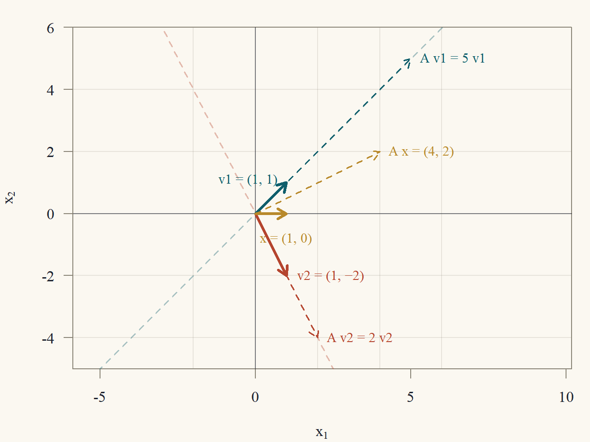
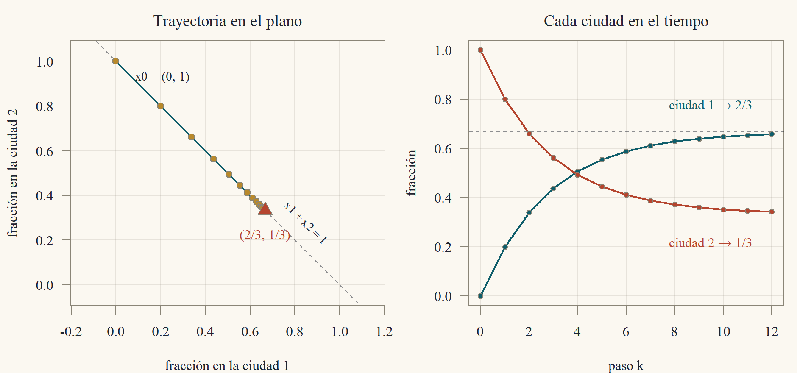
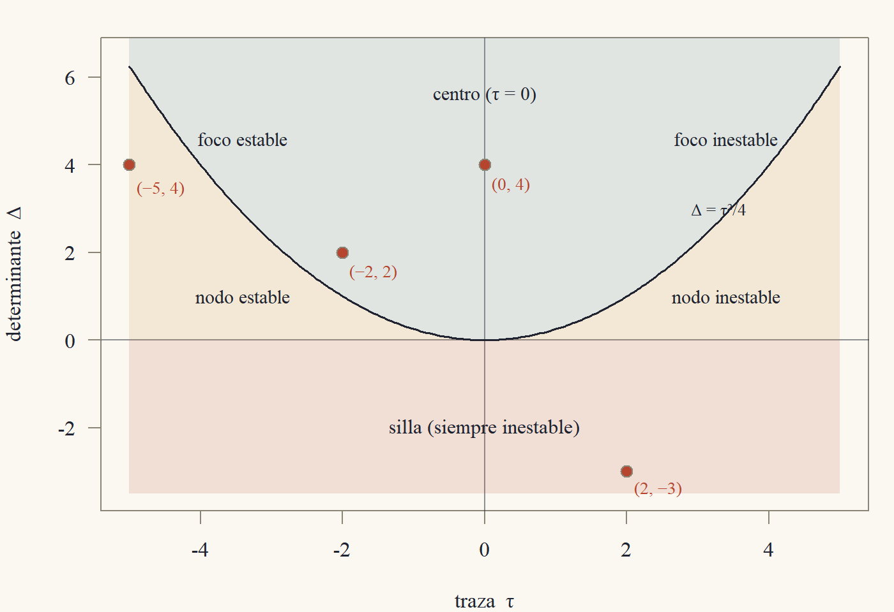
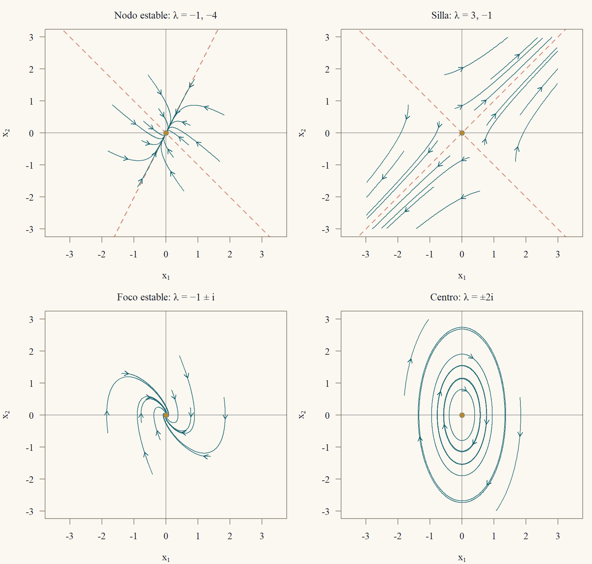
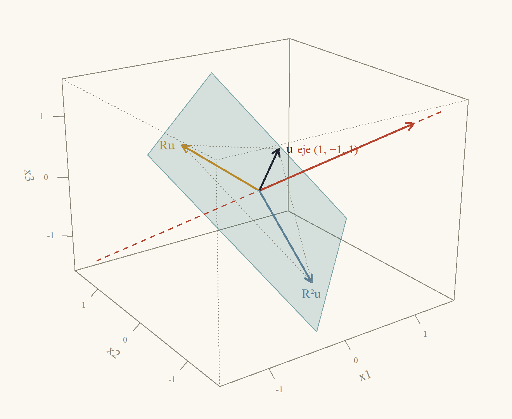
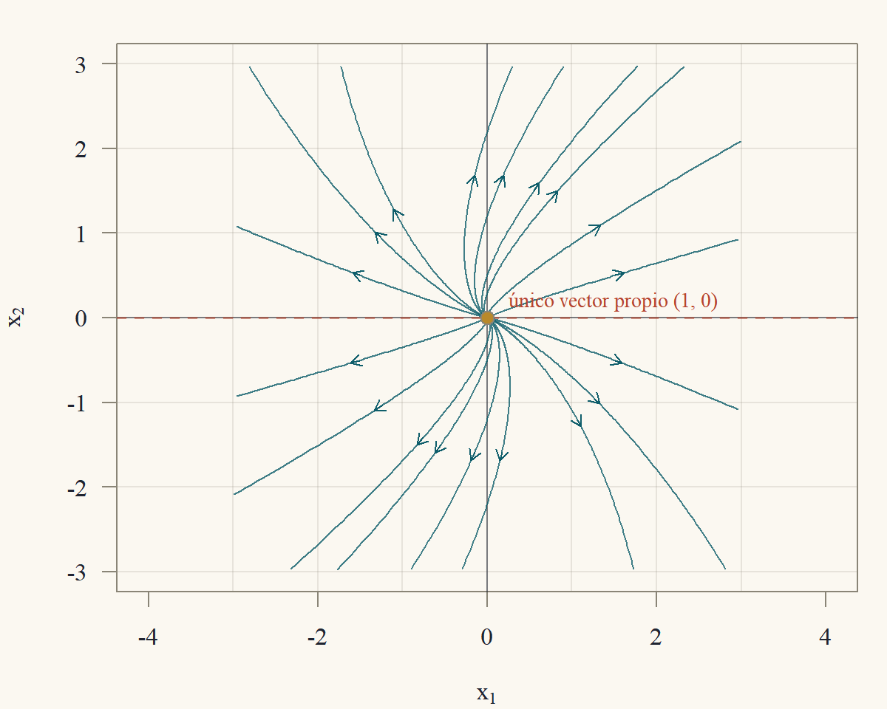

::: {.content-visible when-format="html"}
<a class="descarga-pdf" href="clase-07.pdf">Descargar esta clase en PDF</a>
:::

# Un sistema que se repite

Dos ciudades se reparten una población fija. Cada año, el 10 % de los habitantes de la ciudad 1 se muda a la ciudad 2, y el 20 % de los de la ciudad 2 se muda a la 1. Si $x_k = (a_k,b_k)'$ son las fracciones de la población en cada ciudad en el año $k$, entonces
$$
\begin{pmatrix}a_{k+1}\\b_{k+1}\end{pmatrix} = \underbrace{\begin{pmatrix}0{,}9&0{,}2\\0{,}1&0{,}8\end{pmatrix}}_{A}\begin{pmatrix}a_k\\b_k\end{pmatrix},\qquad\text{es decir}\qquad x_{k+1} = Ax_k.
$$
Después de $k$ años, $x_k = A^kx_0$. ¿Hacia dónde va la población? Calcular $A^{10}$ multiplicando diez veces es posible, pero no dice nada sobre el largo plazo. Hay un camino mejor. Fíjate en lo que hace $A$ con dos vectores especiales:
$$
A\begin{pmatrix}2\\1\end{pmatrix} = \begin{pmatrix}1{,}8 + 0{,}2\\0{,}2 + 0{,}8\end{pmatrix} = 1\cdot\begin{pmatrix}2\\1\end{pmatrix},\qquad
A\begin{pmatrix}1\\-1\end{pmatrix} = \begin{pmatrix}0{,}9 - 0{,}2\\0{,}1 - 0{,}8\end{pmatrix} = 0{,}7\cdot\begin{pmatrix}1\\-1\end{pmatrix}.
$$
Sobre esos dos vectores la matriz **no cambia la dirección**: solo estira. Y cada aplicación posterior de $A$ vuelve a multiplicar por el mismo número, de modo que $A^k(2,1)' = 1^k(2,1)'$ y $A^k(1,-1)' = 0{,}7^k(1,-1)'$. Si el vector inicial se escribe como combinación de ellos, $x_0 = c_1(2,1)' + c_2(1,-1)'$, entonces
$$
x_k = c_1\cdot1^k\begin{pmatrix}2\\1\end{pmatrix} + c_2\cdot0{,}7^k\begin{pmatrix}1\\-1\end{pmatrix},
$$
y el segundo término se apaga: el sistema converge a un reparto fijo, que es un múltiplo de $(2,1)'$. Eso es lo que hacen los **valores y vectores propios**: encuentran las direcciones en que una matriz se comporta como un número. Esta clase los construye, los usa para calcular potencias, y los aplica a cuatro problemas: sucesiones (Fibonacci), cadenas de Markov, ecuaciones diferenciales y rotaciones en el espacio.

# Un repaso de números complejos

Una matriz real puede tener valores propios complejos (una rotación del plano no deja ninguna dirección fija: ¿cómo podría tener valores propios reales?). Por eso trabajamos con números complejos. Lo que se necesita:

- Un número complejo es $z = a + bi$ con $a,b$ reales e $i^2 = -1$. Su **conjugado** es $\bar z = a - bi$, y su **módulo** $|z| = \sqrt{a^2 + b^2}$ cumple $|z|^2 = z\bar z$ y $|zw| = |z||w|$.
- La **fórmula de Euler**: $e^{i\theta} = \cos\theta + i\sin\theta$. Todo complejo no nulo se escribe $z = re^{i\theta}$ con $r = |z|$ y $\theta$ el ángulo. Entonces $z^k = r^ke^{ik\theta}$: elevar a $k$ multiplica el módulo $k$ veces y suma el ángulo $k$ veces. Además $|e^{(\alpha + i\beta)t}| = e^{\alpha t}$ para $t$ real.
- **Teorema fundamental del álgebra** (se usa sin demostración): todo polinomio de grado $n$ con coeficientes complejos tiene $n$ raíces complejas, contadas con multiplicidad, y se factoriza como $c\prod(\lambda - \lambda_i)$. Si los coeficientes son reales, las raíces no reales vienen en pares conjugados.

Todo lo que se demuestra en esta clase para valores propios vale en $\mathbb{C}$: los vectores pueden tener entradas complejas y las combinaciones lineales usan escalares complejos.

# Valores propios y vectores propios

::: {#def-propio}
## Valor propio y vector propio
Sea $A$ una matriz $n\times n$. Un número $\lambda$ (real o complejo) es un **valor propio** de $A$ si existe un vector $v\ne0$ con
$$
Av = \lambda v.
$$
Ese $v$ es un **vector propio** asociado a $\lambda$. El conjunto $E_\lambda = N(A - \lambda I)$ (los vectores propios más el cero) es el **espacio propio** de $\lambda$.
:::

Un vector propio no puede ser cero (así cualquier $\lambda$ serviría), pero $\lambda = 0$ sí puede ser valor propio. Si $v$ es vector propio, también lo es $cv$ para todo $c\ne0$: lo que importa es la **dirección**.

::: {#thm-caracteristico}
## El polinomio característico
$\lambda$ es un valor propio de $A$ si y solo si $\det(\lambda I - A) = 0$. La función $p(\lambda) = \det(\lambda I - A)$ es un polinomio **mónico de grado $n$** en $\lambda$, el **polinomio característico** de $A$, así que $A$ tiene $n$ valores propios en $\mathbb{C}$ (contados con multiplicidad).
:::

::: {.proof}
$Av = \lambda v$ con $v\ne0$ equivale a $(\lambda I - A)v = 0$ con $v\ne0$, es decir, a que $N(\lambda I - A)\ne\{0\}$. Para una matriz cuadrada, tener un espacio nulo no trivial equivale a ser singular (Clase 3) y esto a tener determinante cero (Clase 4).

Por la fórmula de Leibniz (Clase 4, sección ★), $\det(\lambda I - A)$ es una suma de productos de $n$ entradas de $\lambda I - A$, una por fila y columna. Cada entrada es un polinomio de grado a lo sumo $1$ en $\lambda$ (es $\lambda - a_{ii}$ en la diagonal y $-a_{ij}$ fuera), así que $p$ es un polinomio de grado a lo sumo $n$. El único término de grado $n$ viene del producto de la diagonal, $\prod(\lambda - a_{ii})$, que tiene coeficiente principal $1$. Por el teorema fundamental del álgebra, $p(\lambda) = \prod_{i=1}^n(\lambda - \lambda_i)$.
:::

Para $2\times2$, con $\tau = \operatorname{tr}A = a_{11} + a_{22}$ la **traza** y $\Delta = \det A$:
$$
p(\lambda) = (\lambda - a_{11})(\lambda - a_{22}) - a_{12}a_{21} = \lambda^2 - \tau\lambda + \Delta.
$$
Para $3\times3$ aparece una fórmula análoga.

::: {#prp-polinomio-3x3}
## Polinomio característico de una matriz $3\times3$
$$
p(\lambda) = \lambda^3 - (\operatorname{tr}A)\,\lambda^2 + (M_{11} + M_{22} + M_{33})\,\lambda - \det A,
$$
donde $M_{ii}$ es el determinante de la matriz $2\times2$ que queda al borrar la fila $i$ y la columna $i$ de $A$.
:::

::: {.proof}
Sea $B = \lambda I - A$, con $b_{ii} = \lambda - a_{ii}$ y $b_{ij} = -a_{ij}$ si $i\ne j$. La regla de Sarrus (Clase 4) da
$$
\begin{aligned}
\det B &= b_{11}b_{22}b_{33} + b_{12}b_{23}b_{31} + b_{13}b_{21}b_{32}\\
&\quad - b_{13}b_{22}b_{31} - b_{12}b_{21}b_{33} - b_{11}b_{23}b_{32}.
\end{aligned}
$$
Sustituyendo, y observando que en los términos con tres entradas no diagonales salen tres signos menos, que se multiplican:
$$
\begin{aligned}
\det B &= \prod_i(\lambda - a_{ii}) - a_{12}a_{23}a_{31} - a_{13}a_{21}a_{32}\\
&\quad - a_{13}a_{31}(\lambda - a_{22}) - a_{12}a_{21}(\lambda - a_{33}) - a_{23}a_{32}(\lambda - a_{11}).
\end{aligned}
$$
El producto $\prod(\lambda - a_{ii})$ es $\lambda^3 - (a_{11} + a_{22} + a_{33})\lambda^2 + (a_{11}a_{22} + a_{11}a_{33} + a_{22}a_{33})\lambda - a_{11}a_{22}a_{33}$. Reuniendo el coeficiente de $\lambda$:
$$
\begin{aligned}
&a_{11}a_{22} + a_{11}a_{33} + a_{22}a_{33} - a_{13}a_{31} - a_{12}a_{21} - a_{23}a_{32}\\
&\qquad= (a_{11}a_{22} - a_{12}a_{21}) + (a_{11}a_{33} - a_{13}a_{31}) + (a_{22}a_{33} - a_{23}a_{32}),
\end{aligned}
$$
la suma de los tres menores $M_{33}$, $M_{22}$ y $M_{11}$. El término constante es
$$
\begin{aligned}
&-a_{11}a_{22}a_{33} - a_{12}a_{23}a_{31} - a_{13}a_{21}a_{32}\\
&\qquad + a_{13}a_{31}a_{22} + a_{12}a_{21}a_{33} + a_{23}a_{32}a_{11} = -\det A,
\end{aligned}
$$
por la regla de Sarrus aplicada a $A$.
:::

::: {#thm-traza-det}
## Suma y producto de los valores propios
Si $\lambda_1,\dots,\lambda_n$ son los valores propios de $A$ (con multiplicidad), entonces
$$
\lambda_1 + \dots + \lambda_n = \operatorname{tr}A,\qquad\lambda_1\cdots\lambda_n = \det A.
$$
:::

::: {.callout-note title="Borrador"}
Escribo $p(\lambda)$ de dos maneras: como $\prod(\lambda - \lambda_i)$, y como el determinante $\det(\lambda I - A)$ expandido. Comparo el coeficiente de $\lambda^{n-1}$ y el término constante. En el determinante, solo la permutación identidad tiene suficientes factores $\lambda$ para aportar a $\lambda^{n-1}$.
:::

::: {.proof}
De la factorización, $p(\lambda) = \lambda^n - (\sum_i\lambda_i)\lambda^{n-1} + \dots + (-1)^n\prod_i\lambda_i$.

Por Leibniz, $p(\lambda) = \sum_\sigma\operatorname{sgn}(\sigma)\prod_i(\lambda I - A)_{i,\sigma(i)}$ (suma sobre las permutaciones $\sigma$ de $\{1,\dots,n\}$). Una permutación distinta de la identidad mueve al menos dos índices, así que tiene a lo sumo $n - 2$ factores diagonales $(\lambda - a_{ii})$; los demás factores son constantes $-a_{ij}$. Entonces su término tiene grado $\le n - 2$ en $\lambda$. Los términos de grado $n$ y $n - 1$ vienen solo de la identidad:
$$
\prod_i(\lambda - a_{ii}) = \lambda^n - (\textstyle\sum_ia_{ii})\lambda^{n-1} + \dots
$$
Comparando los coeficientes de $\lambda^{n-1}$: $\sum\lambda_i = \sum a_{ii} = \operatorname{tr}A$.

Para el término constante, $p(0) = \det(-A) = (-1)^n\det A$ (cada una de las $n$ filas se multiplica por $-1$, Clase 4), y de la factorización $p(0) = \prod(-\lambda_i) = (-1)^n\prod\lambda_i$. Por lo tanto, $\det A = \prod\lambda_i$.
:::

Para una matriz $2\times2$, esto dice que los valores propios son las raíces de $\lambda^2 - \tau\lambda + \Delta$: suman $\tau$ y multiplican $\Delta$. En particular, **$A$ es invertible si y solo si $0$ no es un valor propio** (porque $\det A = \prod\lambda_i$).

::: {#prp-propiedades-propios}
## Propiedades elementales
Sea $Av = \lambda v$ con $v\ne0$.

1. $A^kv = \lambda^kv$ para todo $k\ge0$, y $(A + cI)v = (\lambda + c)v$.
2. Si $A$ es invertible, $\lambda\ne0$ y $A^{-1}v = \lambda^{-1}v$.
3. $A$ y $A'$ tienen el mismo polinomio característico, luego los mismos valores propios.
4. Si $A$ es triangular, sus valores propios son las entradas de la diagonal.
:::

::: {.proof}
(1) Por inducción: $A^{k+1}v = A(\lambda^kv) = \lambda^kAv = \lambda^{k+1}v$. Y $(A + cI)v = \lambda v + cv$. (2) Si $A$ es invertible y $Av = \lambda v$, entonces $\lambda\ne0$ (si fuera $0$, $Av = 0$ con $v\ne0$ contradice la invertibilidad), y multiplicando por $A^{-1}$ queda $v = \lambda A^{-1}v$, es decir, $A^{-1}v = \lambda^{-1}v$. (3) $\det(\lambda I - A') = \det\big((\lambda I - A)'\big) = \det(\lambda I - A)$ (Clase 4). (4) Si $A$ es triangular, $\lambda I - A$ también, y su determinante es el producto de la diagonal (Clase 4): $p(\lambda) = \prod(\lambda - a_{ii})$.
:::

Los valores propios de $A^k$ son $\lambda^k$: esa es la razón por la que sirven para calcular potencias.

::: {#thm-independientes}
## Vectores propios de valores propios distintos son independientes
Si $v_1,\dots,v_k$ son vectores propios de $A$ asociados a valores propios **distintos** $\lambda_1,\dots,\lambda_k$, entonces $v_1,\dots,v_k$ son linealmente independientes. En particular, si $A$ tiene $n$ valores propios distintos, tiene $n$ vectores propios independientes.
:::

::: {.callout-note title="Borrador"}
Si fueran dependientes, tomo una dependencia con el menor número de vectores. Multiplico la relación por $A$ y, por otro lado, por $\lambda_r$; restando elimino un vector y obtengo una dependencia más corta, que contradice la minimalidad.
:::

::: {.proof}
Supongamos que son dependientes. Entre todas las relaciones de dependencia de subconjuntos, elegimos una con el menor número $r$ de vectores; renumerando, $c_1v_1 + \dots + c_rv_r = 0$ con todos los $c_i\ne0$ (si algún coeficiente fuera cero, habría una dependencia más corta). Como $v_1\ne0$, necesariamente $r\ge2$. Multiplicando por $A$:
$$
c_1\lambda_1v_1 + \dots + c_r\lambda_rv_r = 0.
$$
Multiplicando la relación original por $\lambda_r$ y restando:
$$
c_1(\lambda_1 - \lambda_r)v_1 + \dots + c_{r-1}(\lambda_{r-1} - \lambda_r)v_{r-1} = 0.
$$
Los coeficientes son no nulos (los $c_i\ne0$ y los $\lambda_i$ son distintos), así que es una dependencia con $r - 1$ vectores. Contradice la minimalidad de $r$.
:::

::: {#exm-propios-2x2}
## Valores propios de una matriz $2\times2$
$A = \begin{pmatrix}4&1\\2&3\end{pmatrix}$ tiene $\tau = 7$ y $\Delta = 12 - 2 = 10$, así que $p(\lambda) = \lambda^2 - 7\lambda + 10 = (\lambda - 5)(\lambda - 2)$ y los valores propios son $5$ y $2$ (suman $7$ y multiplican $10$ ✓). Los vectores propios son el espacio nulo de $A - \lambda I$:

- $\lambda = 5$: $A - 5I = \begin{pmatrix}-1&1\\2&-2\end{pmatrix}$, la ecuación $-x_1 + x_2 = 0$ da $v_1 = (1,1)'$. Verificación: $A(1,1)' = (5,5)' = 5v_1$ ✓.
- $\lambda = 2$: $A - 2I = \begin{pmatrix}2&1\\2&1\end{pmatrix}$, la ecuación $2x_1 + x_2 = 0$ da $v_2 = (1,-2)'$. Verificación: $A(1,-2)' = (2,-4)' = 2v_2$ ✓.

La @fig-propios-2d muestra la diferencia con un vector cualquiera: $x = (1,0)'$ se transforma en $Ax = (4,2)'$, que **cambió de dirección**, mientras que $v_1$ y $v_2$ solo cambian de largo.
:::

{#fig-propios-2d width=66%}

::: {#exm-propios-3x3}
## Valores propios de una matriz $3\times3$
$$
A = \begin{pmatrix}1&-2&2\\1&3&-1\\1&0&2\end{pmatrix}.
$$
La traza es $1 + 3 + 2 = 6$. Los menores $2\times2$ de la diagonal son $M_{11} = 3\cdot2 - (-1)\cdot0 = 6$, $M_{22} = 1\cdot2 - 2\cdot1 = 0$ y $M_{33} = 1\cdot3 - (-2)\cdot1 = 5$, que suman $11$. El determinante, por Sarrus, es $(6 + 2 + 0) - (6 + 0 - 4) = 8 - 2 = 6$. Entonces (@prp-polinomio-3x3)
$$
p(\lambda) = \lambda^3 - 6\lambda^2 + 11\lambda - 6 = (\lambda - 1)(\lambda - 2)(\lambda - 3),
$$
como se comprueba probando $\lambda = 1$ ($1 - 6 + 11 - 6 = 0$) y dividiendo: $\lambda^3 - 6\lambda^2 + 11\lambda - 6 = (\lambda - 1)(\lambda^2 - 5\lambda + 6)$. Los valores propios son $1, 2, 3$ (suman $6 = \operatorname{tr}A$ y multiplican $6 = \det A$ ✓). Vectores propios:

- $\lambda = 1$: $A - I = \begin{pmatrix}0&-2&2\\1&2&-1\\1&0&1\end{pmatrix}$. La primera fila da $x_2 = x_3$ y la tercera, $x_1 = -x_3$: $v_1 = (1,-1,-1)'$. Verificación: $A v_1 = (1 + 2 - 2,\ 1 - 3 + 1,\ 1 - 2) = (1,-1,-1)$ ✓.
- $\lambda = 2$: $A - 2I = \begin{pmatrix}-1&-2&2\\1&1&-1\\1&0&0\end{pmatrix}$. La tercera fila da $x_1 = 0$, y la segunda $x_2 = x_3$: $v_2 = (0,1,1)'$. Verificación: $Av_2 = (-2 + 2,\ 3 - 1,\ 2) = (0,2,2) = 2v_2$ ✓.
- $\lambda = 3$: $A - 3I = \begin{pmatrix}-2&-2&2\\1&0&-1\\1&0&-1\end{pmatrix}$. La segunda fila da $x_1 = x_3$ y la primera, $-2x_1 - 2x_2 + 2x_1 = 0$, o sea $x_2 = 0$: $v_3 = (1,0,1)'$. Verificación: $Av_3 = (1 + 2,\ 1 - 1,\ 1 + 2) = (3,0,3) = 3v_3$ ✓.
:::

::: {#exm-rotacion-complejos}
## Una rotación no tiene direcciones fijas
La rotación del plano $R(\theta)$ (Clase 5) tiene $\tau = 2\cos\theta$ y $\Delta = \cos^2\theta + \sin^2\theta = 1$, así que $p(\lambda) = \lambda^2 - 2\cos\theta\,\lambda + 1$, con raíces
$$
\lambda = \cos\theta\pm\sqrt{\cos^2\theta - 1} = \cos\theta\pm i\sin\theta = e^{\pm i\theta}.
$$
Son reales solo si $\sin\theta = 0$ ($\theta = 0$ o $\pi$): para cualquier otro ángulo, la rotación no deja ninguna recta fija, y sus valores propios son complejos de módulo $1$. Por ejemplo, con $\theta = 90°$, $R = \begin{pmatrix}0&-1\\1&0\end{pmatrix}$ y $p(\lambda) = \lambda^2 + 1$, con raíces $\pm i$; un vector propio de $\lambda = i$ es $v = (1,-i)'$: $Rv = (i,\ 1) = i\,(1,-i)$ ✓.
:::

# Diagonalización

::: {#thm-diagonalizacion}
## Diagonalización
Una matriz $A$ ($n\times n$) es **diagonalizable** si existen $P$ invertible y $D$ diagonal con
$$
A = PDP^{-1}.
$$
Esto ocurre si y solo si $A$ tiene $n$ vectores propios linealmente independientes. En ese caso, las columnas de $P$ son esos vectores propios $v_1,\dots,v_n$ y $D = \operatorname{diag}(\lambda_1,\dots,\lambda_n)$ tiene los valores propios correspondientes.
:::

::: {.proof}
$A = PDP^{-1}$ equivale a $AP = PD$ (con $P$ invertible). Por columnas, la columna $j$ de $AP$ es $Ap_j$ y la de $PD$ es $d_jp_j$ (el producto de $P$ por una matriz diagonal escala sus columnas, Clase 2). Entonces $AP = PD$ dice exactamente $Ap_j = d_jp_j$ para cada $j$: las columnas de $P$ son vectores propios con valores propios $d_j$. Y $P$ es invertible si y solo si sus columnas son independientes (Clase 3).

Si existen $n$ vectores propios independientes $v_1,\dots,v_n$, formamos $P = (v_1\ \cdots\ v_n)$ (invertible) y $D$ con los $\lambda_j$; entonces $AP = PD$ y $A = PDP^{-1}$. Recíprocamente, si $A = PDP^{-1}$, las columnas de $P$ son $n$ vectores propios independientes.
:::

Por el @thm-independientes, **si los $n$ valores propios son distintos, $A$ es diagonalizable**. (Lo contrario es falso: la identidad es diagonal y tiene un solo valor propio.)

::: {#thm-potencias}
## Potencias de una matriz diagonalizable
Si $A = PDP^{-1}$, entonces $A^k = PD^kP^{-1}$ para todo $k\ge0$, con $D^k = \operatorname{diag}(\lambda_1^k,\dots,\lambda_n^k)$.
:::

::: {.proof}
Por inducción. Para $k = 0$ es $PP^{-1} = I$. Si $A^k = PD^kP^{-1}$, entonces $A^{k+1} = A^kA = PD^kP^{-1}\,PDP^{-1} = PD^kIDP^{-1} = PD^{k+1}P^{-1}$. Y la potencia de una matriz diagonal eleva cada entrada de la diagonal.
:::

El costo de calcular $A^k$ deja de crecer con $k$: una vez que se tiene $P$ y $D$, cada potencia son dos productos de matrices.

::: {#exm-potencias}
## Potencias de matrices $2\times2$ y $3\times3$
*En el plano.* Para $A = \begin{pmatrix}4&1\\2&3\end{pmatrix}$ (@exm-propios-2x2), $P = \begin{pmatrix}1&1\\1&-2\end{pmatrix}$ y $D = \operatorname{diag}(5,2)$. Como $\det P = -2 - 1 = -3$, $P^{-1} = \tfrac1{-3}\begin{pmatrix}-2&-1\\-1&1\end{pmatrix} = \tfrac13\begin{pmatrix}2&1\\1&-1\end{pmatrix}$, y
$$
A^k = \frac13\begin{pmatrix}1&1\\1&-2\end{pmatrix}\begin{pmatrix}5^k&0\\0&2^k\end{pmatrix}\begin{pmatrix}2&1\\1&-1\end{pmatrix} = \frac13\begin{pmatrix}2\cdot5^k + 2^k&5^k - 2^k\\2\cdot5^k - 2\cdot2^k&5^k + 2\cdot2^k\end{pmatrix}.
$$
Para $k = 1$ da $\tfrac13\begin{pmatrix}12&3\\6&9\end{pmatrix} = A$ ✓; para $k = 3$, $\tfrac13\begin{pmatrix}258&117\\234&141\end{pmatrix} = \begin{pmatrix}86&39\\78&47\end{pmatrix}$, que coincide con $A\cdot A\cdot A$. Con $k = 10$: $A^{10}_{11} = (2\cdot5^{10} + 2^{10})/3 = 6\,510\,758$.

*En el espacio.* Para la matriz del @exm-propios-3x3, $P = (v_1\ v_2\ v_3) = \begin{pmatrix}1&0&1\\-1&1&0\\-1&1&1\end{pmatrix}$ tiene $\det P = 1\cdot(1 - 0) - 0 + 1\cdot(-1 + 1) = 1$ y $P^{-1} = \begin{pmatrix}1&1&-1\\1&2&-1\\0&-1&1\end{pmatrix}$ (se verifica multiplicando). Entonces $A^k = P\operatorname{diag}(1,2^k,3^k)P^{-1}$. Para $k = 2$:
$$
A^2 = P\operatorname{diag}(1,4,9)P^{-1} = \begin{pmatrix}1&-8&8\\3&7&-3\\3&-2&6\end{pmatrix},
$$
que es el producto $A\cdot A$ (por ejemplo, la entrada $(1,2)$ de $A^2$ es la fila $(1,-2,2)$ por la columna $(-2,3,0)'$: $-2 - 6 + 0 = -8$ ✓).
:::

# Sistemas dinámicos discretos

::: {#thm-discreto}
## Solución de $x_{k+1} = Ax_k$
Si $A = PDP^{-1}$ con vectores propios $v_1,\dots,v_n$ y valores propios $\lambda_1,\dots,\lambda_n$, la solución de $x_{k+1} = Ax_k$ con $x_0$ dado es
$$
x_k = c_1\lambda_1^kv_1 + \dots + c_n\lambda_n^kv_n,\qquad c = P^{-1}x_0.
$$
Además:

1. Si $|\lambda_i|<1$ para todo $i$, entonces $x_k\to0$ para todo $x_0$.
2. Si algún $|\lambda_j|>1$, existe un $x_0$ real para el cual $\|x_k\|$ no está acotada.
3. Si $|\lambda_1|>|\lambda_i|$ para $i\ge2$ y $c_1\ne0$, entonces $x_k/\lambda_1^k\to c_1v_1$: a largo plazo, el sistema se alinea con $v_1$ y crece (o decrece) como $\lambda_1^k$.
:::

::: {.proof}
$x_k = A^kx_0 = PD^kP^{-1}x_0 = PD^kc = \sum c_i\lambda_i^kv_i$, porque $Pw$ es la combinación de las columnas de $P$ con los coeficientes de $w$ (Clase 2).

(1) $|\lambda_i^k| = |\lambda_i|^k\to0$ para cada $i$, luego cada término tiende a $0$.

(3) $x_k/\lambda_1^k = c_1v_1 + \sum_{i\ge2}c_i(\lambda_i/\lambda_1)^kv_i$ y $|\lambda_i/\lambda_1|<1$, así que los términos de la suma tienden a $0$.

(2) Si $\lambda_j$ es real, $v_j$ puede elegirse real (es una solución no nula del sistema real $(A - \lambda_jI)v = 0$) y con $x_0 = v_j$ queda $\|x_k\| = |\lambda_j|^k\|v_j\|\to\infty$. Si $\lambda_j$ no es real, escribimos $v_j = u + iw$ con $u,w$ reales y consideramos las soluciones reales con $x_0 = u$ y $x_0 = w$: sus normas cumplen $\|A^ku\| + \|A^kw\|\ge\|A^ku + iA^kw\| = \|A^kv_j\| = |\lambda_j|^k\|v_j\|\to\infty$, así que al menos una de las dos no está acotada.
:::

El número que decide todo es $\rho(A) = \max|\lambda_i|$, el **radio espectral**: si es menor que $1$, el sistema se apaga; si es mayor que $1$, estalla. La Clase 10 demuestra esto para toda matriz, diagonalizable o no.

::: {#exm-fibonacci}
## Fibonacci
La sucesión $F_0 = 0$, $F_1 = 1$, $F_{k+2} = F_{k+1} + F_k$ se vuelve un sistema de primer orden con $x_k = (F_{k+1},F_k)'$:
$$
\begin{pmatrix}F_{k+2}\\F_{k+1}\end{pmatrix} = \begin{pmatrix}1&1\\1&0\end{pmatrix}\begin{pmatrix}F_{k+1}\\F_k\end{pmatrix},\qquad x_0 = \begin{pmatrix}1\\0\end{pmatrix}.
$$
Aquí $\tau = 1$ y $\Delta = -1$, así que $p(\lambda) = \lambda^2 - \lambda - 1$ y los valores propios son
$$
\varphi = \frac{1 + \sqrt5}2\approx1{,}618,\qquad\psi = \frac{1 - \sqrt5}2\approx-0{,}618,
$$
con $\varphi + \psi = 1$ y $\varphi\psi = -1$. Un vector propio de $\lambda$ es $(\lambda,1)'$: $A(\lambda,1)' = (\lambda + 1,\ \lambda)' = (\lambda^2,\ \lambda)' = \lambda\,(\lambda,1)'$, porque $\lambda^2 = \lambda + 1$. El vector inicial se descompone como $x_0 = (1,0)' = \tfrac1{\sqrt5}\big[(\varphi,1)' - (\psi,1)'\big]$ (la primera componente es $(\varphi - \psi)/\sqrt5 = 1$ y la segunda, $0$). Por el @thm-discreto,
$$
x_k = \frac1{\sqrt5}\Big[\varphi^k\begin{pmatrix}\varphi\\1\end{pmatrix} - \psi^k\begin{pmatrix}\psi\\1\end{pmatrix}\Big],
$$
y la segunda componente es la **fórmula de Binet**:
$$
F_k = \frac{\varphi^k - \psi^k}{\sqrt5}.
$$
Como $|\psi|<1$, el segundo término se apaga: $F_k$ es el entero más cercano a $\varphi^k/\sqrt5$. Por ejemplo, $\varphi^{30}/\sqrt5 = 832\,040{,}0000002$ y $|\psi|^{30}/\sqrt5\approx2{,}4\times10^{-7}<\tfrac12$, de modo que $F_{30} = 832\,040$. Y $F_{k+1}/F_k\to\varphi$, el valor propio dominante (parte 3 del teorema): $F_{10}/F_9 = 55/34 = 1{,}6176$, $F_{20}/F_{19} = 6765/4181 = 1{,}61803$.
:::

::: {#exm-espiral}
## Valores propios complejos: una espiral
$A = \begin{pmatrix}1&-1\\1&1\end{pmatrix}$ tiene $\tau = 2$, $\Delta = 2$ y $p(\lambda) = \lambda^2 - 2\lambda + 2$, con raíces $\lambda = 1\pm i = \sqrt2\,e^{\pm i\pi/4}$. Por el repaso de complejos, $\lambda^k = (\sqrt2)^ke^{ik\pi/4}$: cada paso **gira $45°$ y multiplica la longitud por $\sqrt2$** (la matriz es $\sqrt2$ por la rotación $R(45°)$). Como $|\lambda|>1$, el sistema se aleja del origen en espiral. En efecto, $A^2 = \begin{pmatrix}0&-2\\2&0\end{pmatrix}$ (giro de $90°$ y longitud $\times2$), $A^4 = -4I$ (giro de $180°$ y longitud $\times4$) y $A^8 = 16I$ (vuelta completa, longitud $\times16 = (\sqrt2)^8$). ✓
:::

# Cadenas de Markov

Un sistema como el de las dos ciudades, donde cada columna de $A$ reparte el 100 % de un estado entre los estados siguientes, se llama cadena de Markov.

::: {#def-estocastica}
## Matriz estocástica
Una matriz $A$ ($n\times n$) es **estocástica** (por columnas) si $a_{ij}\ge0$ y cada columna suma $1$: $\sum_ia_{ij} = 1$. Un **vector de probabilidades** $x$ tiene $x_i\ge0$ y $\sum x_i = 1$.
:::

Si $x_k$ es un vector de probabilidades (la fracción de la población en cada estado), $x_{k+1} = Ax_k$ también lo es. En efecto, las entradas son no negativas, y con $\mathbf 1 = (1,\dots,1)'$, $\mathbf 1'A = \mathbf 1'$ (la fila de unos por $A$ suma las columnas), luego
$$
\mathbf 1'x_{k+1} = \mathbf 1'Ax_k = \mathbf 1'x_k = 1.
$$
La población total se **conserva**.

::: {#thm-markov}
## Valores propios de una matriz estocástica
Sea $A$ estocástica. Entonces $1$ es un valor propio de $A$, y todo valor propio $\lambda$ (real o complejo) cumple $|\lambda|\le1$.
:::

::: {.callout-note title="Borrador"}
Que $1$ es valor propio se lee de $\mathbf 1'A = \mathbf 1'$: es un vector propio de $A'$, y $A'$ tiene los mismos valores propios que $A$. Para la cota, sumo los valores absolutos de $Av = \lambda v$ y uso que las columnas suman $1$.
:::

::: {.proof}
De $\mathbf 1'A = \mathbf 1'$, trasponiendo, $A'\mathbf 1 = \mathbf 1$. Entonces $1$ es valor propio de $A'$ y, por la @prp-propiedades-propios, de $A$.

Sea $Av = \lambda v$ con $v\ne0$ (posiblemente complejo). Tomando valor absoluto en la componente $i$ y usando $a_{ij}\ge0$:
$$
|\lambda||v_i| = \Big|\sum_ja_{ij}v_j\Big|\le\sum_ja_{ij}|v_j|.
$$
Sumando sobre $i$ e intercambiando las sumas,
$$
|\lambda|\sum_i|v_i|\le\sum_j|v_j|\Big(\sum_ia_{ij}\Big) = \sum_j|v_j|.
$$
Como $\sum|v_i|>0$, dividimos y queda $|\lambda|\le1$.
:::

::: {#thm-markov-limite}
## Convergencia a la distribución de equilibrio
Sea $A$ estocástica y diagonalizable, con $1$ como valor propio **simple** y todos los demás con $|\lambda_i|<1$. Entonces el vector propio de $\lambda_1 = 1$ puede normalizarse con $\mathbf 1'v_1 = 1$ (la **distribución de equilibrio**), y para todo $x_0$ vector de probabilidades,
$$
x_k\longrightarrow v_1.
$$
:::

::: {.proof}
Sea $w$ un vector propio de $\lambda_1 = 1$ y $x_0$ un vector de probabilidades. Por el @thm-discreto, $x_k = c_1w + \sum_{i\ge2}c_i\lambda_i^kv_i\to c_1w$. Aplicando $\mathbf 1'$ y usando que la suma se conserva, $1 = \mathbf 1'x_k\to c_1\,\mathbf 1'w$. Entonces $c_1\,\mathbf 1'w = 1$, y en particular $\mathbf 1'w\ne0$: se puede normalizar $v_1 = w/(\mathbf 1'w)$, con $\mathbf 1'v_1 = 1$. Y el límite es $c_1w = c_1(\mathbf 1'w)\,v_1 = v_1$.
:::

(Las hipótesis del teorema se cumplen automáticamente si $A$ tiene todas sus entradas positivas, el teorema de Perron–Frobenius de la Clase 12.)

::: {#exm-markov-2}
## Las dos ciudades
$A = \begin{pmatrix}0{,}9&0{,}2\\0{,}1&0{,}8\end{pmatrix}$ es estocástica: $\tau = 1{,}7$ y $\Delta = 0{,}72 - 0{,}02 = 0{,}7$, así que $p(\lambda) = \lambda^2 - 1{,}7\lambda + 0{,}7 = (\lambda - 1)(\lambda - 0{,}7)$, con valores propios $1$ y $0{,}7$ y vectores propios $(2,1)'$ y $(1,-1)'$ (los de la introducción). El equilibrio es $v_1 = \tfrac13(2,1)'$ (para que sume $1$): **dos tercios de la población en la ciudad 1 y un tercio en la 2, sin importar el reparto inicial**. Si toda la población parte en la ciudad 2, $x_0 = (0,1)' = c_1(2,1)' + c_2(1,-1)'$ da $2c_1 + c_2 = 0$ y $c_1 - c_2 = 1$, así que $c_1 = \tfrac13$ y $c_2 = -\tfrac23$:
$$
x_k = \frac13\begin{pmatrix}2\\1\end{pmatrix} - \frac23\,0{,}7^k\begin{pmatrix}1\\-1\end{pmatrix}.
$$
Para $k = 1$: $\tfrac13(2,1) - \tfrac23\cdot0{,}7(1,-1) = (0{,}2;\ 0{,}8)$, que es $Ax_0$ ✓. El error respecto del equilibrio se reduce un 30 % por año (@fig-markov): después de $k$ años, la diferencia es $\tfrac23\,0{,}7^k$.
:::

{#fig-markov width=100%}

::: {#exm-markov-3}
## Una partícula en tres posiciones
Una partícula salta cada segundo entre tres posiciones en fila: desde la $1$ se queda con probabilidad $\tfrac12$ o pasa a la $2$ con $\tfrac12$; desde la $2$ pasa a la $1$ con $\tfrac14$, se queda con $\tfrac12$ o pasa a la $3$ con $\tfrac14$; desde la $3$ se queda con $\tfrac12$ o pasa a la $2$ con $\tfrac12$. La matriz (cada columna es lo que ocurre desde una posición) es
$$
A = \begin{pmatrix}\tfrac12&\tfrac14&0\\\tfrac12&\tfrac12&\tfrac12\\0&\tfrac14&\tfrac12\end{pmatrix}.
$$
Se comprueba, multiplicando, que
$$
A\begin{pmatrix}1\\2\\1\end{pmatrix} = \begin{pmatrix}\tfrac12 + \tfrac12\\\tfrac12 + 1 + \tfrac12\\\tfrac12 + \tfrac12\end{pmatrix} = 1\cdot\begin{pmatrix}1\\2\\1\end{pmatrix},
$$
$$
A\begin{pmatrix}1\\0\\-1\end{pmatrix} = \begin{pmatrix}\tfrac12\\0\\-\tfrac12\end{pmatrix} = \tfrac12\begin{pmatrix}1\\0\\-1\end{pmatrix},\qquad
A\begin{pmatrix}1\\-2\\1\end{pmatrix} = \begin{pmatrix}0\\0\\0\end{pmatrix}.
$$
Los valores propios son $1$, $\tfrac12$ y $0$ (distintos, así que $A$ es diagonalizable; suman $\tfrac32 = \operatorname{tr}A$ ✓). El equilibrio es $v_1 = \tfrac14(1,2,1)'$. Si la partícula parte en la posición $1$, $x_0 = (1,0,0)'$, se descompone como $x_0 = c_1(1,2,1)' + c_2(1,0,-1)' + c_3(1,-2,1)'$: la suma de componentes da $4c_1 = 1$, así que $c_1 = \tfrac14$, y de la segunda componente, $2c_1 - 2c_3 = 0$, así que $c_3 = \tfrac14$, y de la primera, $c_2 = 1 - \tfrac12 = \tfrac12$. Entonces
$$
x_k = \frac14\begin{pmatrix}1\\2\\1\end{pmatrix} + \frac12\Big(\frac12\Big)^k\begin{pmatrix}1\\0\\-1\end{pmatrix}\qquad(k\ge1),
$$
porque el tercer término lleva $0^k = 0$ y desaparece después del primer paso. Verificación: $x_1 = \tfrac14(1,2,1) + \tfrac14(1,0,-1) = (\tfrac12,\tfrac12,0)$, que es la primera columna de $A$ ✓, y $x_2 = \tfrac14(1,2,1) + \tfrac18(1,0,-1) = (\tfrac38,\tfrac12,\tfrac18) = Ax_1$ ✓. A largo plazo la partícula pasa la mitad del tiempo en la posición central y un cuarto en cada extremo.
:::

# Ecuaciones diferenciales: $x' = Ax$

Cuando el tiempo es continuo, en lugar de $x_{k+1} = Ax_k$ aparece $x'(t) = Ax(t)$: la tasa de cambio del vector es una función lineal de sí mismo (concentraciones en tanques conectados, circuitos, poblaciones que compiten). En una dimensión, $x' = \lambda x$ tiene solución $x(t) = x(0)e^{\lambda t}$. La idea es la misma: en las direcciones propias, la ecuación se desacopla.

::: {#thm-edo}
## Solución de $x' = Ax$
Si $A = PDP^{-1}$ con vectores propios $v_1,\dots,v_n$ y valores propios $\lambda_1,\dots,\lambda_n$, entonces el problema $x'(t) = Ax(t)$, $x(0) = x_0$, tiene una **única** solución:
$$
x(t) = c_1e^{\lambda_1t}v_1 + \dots + c_ne^{\lambda_nt}v_n,\qquad c = P^{-1}x_0.
$$
:::

::: {.callout-note title="Borrador"}
Cambio de variables $y = P^{-1}x$: la ecuación queda $y' = Dy$, que son $n$ ecuaciones escalares independientes. Cada una se resuelve y se vuelve a $x = Py$. La unicidad sale de que el cambio de variables es invertible.
:::

::: {.proof}
Sea $y(t) = P^{-1}x(t)$. Como $P^{-1}$ es constante, $y' = P^{-1}x'$, y $x' = Ax$ equivale a
$$
y' = P^{-1}APy = Dy,\qquad\text{es decir}\qquad y_i' = \lambda_iy_i\quad(i = 1,\dots,n).
$$
Para cada $i$, $\frac{d}{dt}\big(e^{-\lambda_it}y_i\big) = e^{-\lambda_it}(y_i' - \lambda_iy_i) = 0$, así que $e^{-\lambda_it}y_i$ es constante, igual a su valor en $t = 0$, y $y_i(t) = y_i(0)e^{\lambda_it}$ con $y(0) = P^{-1}x_0 = c$. Esto prueba existencia y unicidad de $y$, y entonces de $x = Py = \sum_ic_ie^{\lambda_it}v_i$ (otra vez, $Py$ es la combinación de las columnas de $P$ con coeficientes $y_i$).
:::

La **exponencial de una matriz** reúne esto en una sola fórmula. Se define, como en el caso escalar, por la serie
$$
e^{At} = I + At + \frac{(At)^2}{2!} + \frac{(At)^3}{3!} + \dots
$$
Si $A = PDP^{-1}$, entonces $A^k = PD^kP^{-1}$ (@thm-potencias) y la serie se vuelve
$$
e^{At} = P\Big(\sum_k\frac{(Dt)^k}{k!}\Big)P^{-1} = P\operatorname{diag}\big(e^{\lambda_1t},\dots,e^{\lambda_nt}\big)P^{-1},
$$
porque cada entrada de la serie diagonal es la serie escalar de $e^{\lambda_it}$. La solución del teorema es $x(t) = e^{At}x_0$. (Para matrices no diagonalizables, la serie sigue valiendo; se calcula en la Clase 12.)

**Estabilidad.** Como $|e^{\lambda t}| = e^{\operatorname{Re}(\lambda)\,t}$, cada término $c_ie^{\lambda_it}v_i$ se apaga si $\operatorname{Re}\lambda_i<0$ y crece si $\operatorname{Re}\lambda_i>0$. Si todos los valores propios tienen parte real negativa, $x(t)\to0$ para todo $x_0$: el sistema es **estable**. (En el caso discreto la condición es $|\lambda|<1$; la frontera es el eje imaginario en lugar del círculo unitario.)

## Valores propios complejos

Si $A$ es real y $\lambda = \alpha + i\beta$ ($\beta\ne0$) es valor propio con vector propio $v = u + iw$ ($u,w$ reales), las soluciones complejas $e^{\lambda t}v$ se separan en dos soluciones **reales**.

::: {#prp-complejos-edo}
## Soluciones reales con valores propios complejos
Con $A$ real de $2\times2$, $\lambda = \alpha + i\beta$ con $\beta\ne0$ y $v = u + iw$ un vector propio, los vectores $u,w$ son independientes y las funciones
$$
x_1(t) = e^{\alpha t}\big(u\cos\beta t - w\sin\beta t\big),\qquad x_2(t) = e^{\alpha t}\big(u\sin\beta t + w\cos\beta t\big)
$$
son soluciones reales de $x' = Ax$ con $x_1(0) = u$ y $x_2(0) = w$. Por lo tanto, la solución con $x(0) = au + bw$ es $ax_1(t) + bx_2(t)$.
:::

::: {.proof}
La función compleja $e^{\lambda t}v$ cumple $\frac{d}{dt}(e^{\lambda t}v) = \lambda e^{\lambda t}v = A\,(e^{\lambda t}v)$. Por Euler, $e^{\lambda t}v = e^{\alpha t}(\cos\beta t + i\sin\beta t)(u + iw)$, y separando parte real e imaginaria queda $x_1 + ix_2$ con $x_1,x_2$ las funciones del enunciado. Como $A$ es real, derivar y multiplicar por $A$ conservan las partes real e imaginaria, de modo que $x_1' = Ax_1$ y $x_2' = Ax_2$.

Independencia: $\bar v = u - iw$ es vector propio de $\bar\lambda\ne\lambda$ (conjugamos $Av = \lambda v$ con $A$ real), así que $v$ y $\bar v$ son independientes (@thm-independientes), y $u = \tfrac12(v + \bar v)$, $w = \tfrac1{2i}(v - \bar v)$. Si $au + bw = 0$ con $a,b$ reales, la combinación $\tfrac{a}2(v + \bar v) + \tfrac{b}{2i}(v - \bar v) = 0$ obliga a que los coeficientes de $v$ y $\bar v$ sean cero, y entonces $a = b = 0$. Como $u,w$ son una base de $\mathbb{R}^2$, toda condición inicial real es $au + bw$, y la unicidad (aplicando el @thm-edo a $v,\bar v$) da la última afirmación.
:::

El factor $e^{\alpha t}$ es una **envolvente** que crece o decrece, y $\cos\beta t$, $\sin\beta t$ giran con frecuencia $\beta$. Si $\alpha<0$ es una espiral que cae hacia el origen (**foco estable**); si $\alpha>0$, una espiral que se aleja; si $\alpha = 0$, una curva cerrada (**centro**).

## Retratos de fase en el plano

El **retrato de fase** de $x' = Ax$ en $\mathbb{R}^2$ dibuja las trayectorias $x(t)$ para varias condiciones iniciales. Su forma depende solo de los valores propios, que están determinados por la traza $\tau$ y el determinante $\Delta$:
$$
\lambda = \frac{\tau\pm\sqrt{\tau^2 - 4\Delta}}2.
$$

::: {#thm-clasificacion}
## Clasificación en el plano
Sea $A$ real de $2\times2$ con $\Delta\ne0$ y $\tau^2\ne4\Delta$.

- Si $\Delta<0$: los valores propios son reales de signos opuestos: **silla** (inestable).
- Si $\Delta>0$ y $\tau^2>4\Delta$: valores propios reales del mismo signo, el de $\tau$: **nodo** estable si $\tau<0$, inestable si $\tau>0$.
- Si $\tau^2<4\Delta$: valores propios complejos $\tfrac\tau2\pm i\beta$: **foco** estable si $\tau<0$, inestable si $\tau>0$, y **centro** si $\tau = 0$.

En particular, $x' = Ax$ es estable (todo $\operatorname{Re}\lambda<0$) si y solo si $\tau<0$ y $\Delta>0$.
:::

::: {.proof}
Los valores propios son las raíces de $\lambda^2 - \tau\lambda + \Delta$, con $\lambda_1 + \lambda_2 = \tau$ y $\lambda_1\lambda_2 = \Delta$.

Si $\tau^2>4\Delta$ las raíces son reales y distintas. Si $\Delta<0$, su producto es negativo: tienen signos opuestos. Si $\Delta>0$, su producto es positivo: tienen el mismo signo, y ese signo es el de su suma $\tau$. Si $\tau^2<4\Delta$, las raíces son complejas conjugadas, y su parte real común es $\tau/2$ (la suma es $\tau$). Eso da las tres filas de la clasificación según el @thm-edo y la @prp-complejos-edo.

Estabilidad: si $\tau<0$ y $\Delta>0$, en el caso real ambos valores propios son negativos, y en el complejo la parte real es $\tau/2<0$. Recíprocamente, si ambos valores propios tienen parte real negativa, su suma $\tau$ es negativa y su producto, que es positivo ($\lambda_1\lambda_2>0$ si son reales del mismo signo, $|\lambda_1|^2>0$ si son complejos conjugados), es $\Delta>0$.
:::

La @fig-traza-det muestra el plano $(\tau,\Delta)$ dividido por la parábola $\Delta = \tau^2/4$ (donde los valores propios coinciden), y la @fig-retratos los cuatro retratos principales.

{#fig-traza-det width=70%}

{#fig-retratos width=96%}

::: {#exm-nodo}
## Un nodo estable
$A = \begin{pmatrix}-3&1\\2&-2\end{pmatrix}$ tiene $\tau = -5$, $\Delta = 6 - 2 = 4$ y $\tau^2 - 4\Delta = 25 - 16 = 9>0$: nodo estable. Los valores propios son $\tfrac{-5\pm3}2 = -1$ y $-4$. Para $\lambda = -1$: $A + I = \begin{pmatrix}-2&1\\2&-1\end{pmatrix}$, $x_2 = 2x_1$, $v_1 = (1,2)'$. Para $\lambda = -4$: $A + 4I = \begin{pmatrix}1&1\\2&2\end{pmatrix}$, $x_2 = -x_1$, $v_2 = (1,-1)'$. Con $x(0) = (3,0)'$: $c_1(1,2) + c_2(1,-1) = (3,0)$ da $c_1 + c_2 = 3$ y $2c_1 - c_2 = 0$, así que $c_1 = 1$, $c_2 = 2$ y
$$
x(t) = e^{-t}\begin{pmatrix}1\\2\end{pmatrix} + 2e^{-4t}\begin{pmatrix}1\\-1\end{pmatrix}.
$$
Verificación: $x(0) = (3,0)'$ y $x'(0) = -(1,2)' - 8(1,-1)' = (-9,6)'$, que debe ser $Ax(0) = (-9,6)'$ ✓. La componente en $v_2$ se apaga cuatro veces más rápido: después de un rato, la trayectoria es $\approx e^{-t}(1,2)'$ y **entra al origen tangente a la recta de $v_1$**, el valor propio más lento (@fig-retratos, arriba a la izquierda).
:::

::: {#exm-centro}
## Un centro: el oscilador
$A = \begin{pmatrix}0&1\\-4&0\end{pmatrix}$ corresponde a $x_1' = x_2$, $x_2' = -4x_1$, es decir, a $x_1'' = -4x_1$ (un resorte). Tiene $\tau = 0$ y $\Delta = 4$: centro. Los valores propios son $\pm2i$. Para $\lambda = 2i$: $A - 2iI = \begin{pmatrix}-2i&1\\-4&-2i\end{pmatrix}$, la primera fila da $x_2 = 2ix_1$ y $v = (1,2i)' = u + iw$ con $u = (1,0)'$ y $w = (0,2)'$. Con $\alpha = 0$ y $\beta = 2$ (@prp-complejos-edo), la solución con $x(0) = (1,0)' = u$ es
$$
x(t) = u\cos2t - w\sin2t = \begin{pmatrix}\cos2t\\-2\sin2t\end{pmatrix}.
$$
Verificación: $x'(t) = (-2\sin2t,\ -4\cos2t)' = Ax(t) = (-2\sin2t,\ -4\cos2t)'$ ✓. La trayectoria es la elipse $4x_1^2 + x_2^2 = 4$ (porque $4\cos^22t + 4\sin^22t = 4$), recorrida con período $2\pi/2 = \pi$: **no se acerca ni se aleja**. Esa cantidad se conserva, pues $\frac{d}{dt}(4x_1^2 + x_2^2) = 8x_1x_2 + 2x_2(-4x_1) = 0$: es la energía del resorte.
:::

# Una aplicación: el eje de una rotación

En la Clase 5 se mostró que las rotaciones del espacio no conmutan, y se enunció que **toda matriz ortogonal $3\times3$ de determinante $1$ es una rotación alrededor de algún eje**. Ahora tenemos las herramientas para demostrarlo: el eje es un vector propio de valor propio $1$.

::: {#thm-euler}
## Teorema de Euler
Sea $Q$ una matriz ortogonal $3\times3$ con $\det Q = 1$. Entonces $1$ es un valor propio de $Q$: existe un vector unitario $u$ con $Qu = u$ (el **eje**), y $Q$ es la rotación en un ángulo $\theta$ alrededor de $u$, con $\operatorname{tr}Q = 1 + 2\cos\theta$.
:::

::: {.callout-note title="Borrador"}
Tres cosas por hacer. Primero, ver que $\det(Q - I) = 0$ usando $Q' = Q^{-1}$ y la dimensión impar ($3$). Segundo, tomar el vector propio $u$ y completar una base ortonormal. Tercero, ver que $Q$ lleva el plano perpendicular a $u$ en sí mismo y que allí actúa como una matriz ortogonal $2\times2$ con determinante $1$, es decir, una rotación (Clase 5).
:::

::: {.proof}
*El valor propio $1$.* Como $Q'Q = I$, $Q - I = Q - QQ' = Q(I - Q')$. Entonces
$$
\begin{aligned}
\det(Q - I) &= \det Q\,\det(I - Q') = \det\big((I - Q)'\big)\\
&= \det(I - Q) = (-1)^3\det(Q - I) = -\det(Q - I),
\end{aligned}
$$
usando $\det Q = 1$, que una matriz y su transpuesta tienen el mismo determinante, y que $I - Q = -(Q - I)$ con $n = 3$ filas ($\det(-M) = (-1)^3\det M$, Clase 4). Luego $2\det(Q - I) = 0$ y $Q - I$ es singular: existe $u\ne0$ con $Qu = u$, que se puede tomar real y unitario (es una solución de un sistema real, que se puede normalizar).

*Una base ortonormal.* Por Gram–Schmidt (Clase 5) existe una base ortonormal $u,w_1,w_2$ de $\mathbb{R}^3$. Sea $S = (u\ w_1\ w_2)$, ortogonal. Para $w$ perpendicular a $u$, $Qw\cdot u = Qw\cdot Qu = w\cdot u = 0$ (las matrices ortogonales conservan productos internos): $Q$ lleva el plano $u^\perp$ en sí mismo. Por lo tanto, la primera columna de $S'QS$ es $S'Qu = S'u = (1,0,0)'$, y la fila $1$ es $(1,0,0)$ (porque $u'Qw_j = (Q'u)\cdot w_j = u\cdot w_j = 0$, con $Q'u = Q^{-1}u = u$). Así,
$$
S'QS = \begin{pmatrix}1&0\\0&B\end{pmatrix}\qquad\text{con }B\text{ de }2\times2.
$$
*El plano perpendicular.* $S'QS$ es ortogonal (producto de ortogonales), luego $B$ lo es, y $1 = \det Q = \det(S'QS) = 1\cdot\det B$ (por la Clase 4, el determinante de $S'$, $Q$, $S$ se multiplica y $\det S'\det S = \det(S'S) = 1$). Por el Ejercicio 5.5, una matriz ortogonal $2\times2$ con determinante $1$ es una rotación $B = R(\theta)$. Es decir, $Q$ es la rotación en $\theta$ del plano $u^\perp$ y deja fijo el eje $u$.

*La traza.* $\operatorname{tr}(XY) = \sum_{i,j}x_{ij}y_{ji} = \operatorname{tr}(YX)$, así que $\operatorname{tr}Q = \operatorname{tr}(QSS') = \operatorname{tr}(S'QS) = 1 + 2\cos\theta$.
:::

::: {#exm-euler}
## El eje y el ángulo de $R_1R_3$
En la Clase 5 se calculó $R = R_1R_3 = \begin{pmatrix}0&-1&0\\0&0&-1\\1&0&0\end{pmatrix}$ (giro de $90°$ alrededor de $x_3$ y luego de $90°$ alrededor de $x_1$). Es ortogonal con $\det = 1$, así que es una rotación alrededor de algún eje. El eje es el vector propio de $\lambda = 1$: $Rv = (-v_2,\ -v_3,\ v_1) = (v_1,v_2,v_3)$ da $v_1 = -v_2$, $v_2 = -v_3$ y $v_3 = v_1$, así que $v = (1,-1,1)'$ (y se verifica, $Rv = (1,-1,1)'$ ✓). El ángulo sale de la traza: $\operatorname{tr}R = 0 = 1 + 2\cos\theta$, de modo que $\cos\theta = -\tfrac12$ y $\theta = 120°$. Se puede verificar con un vector perpendicular al eje, $u = (1,1,0)'$ ($u\cdot v = 1 - 1 + 0 = 0$): $Ru = (-1,0,1)'$ y $R^2u = R(-1,0,1)' = (0,-1,-1)'$. Los tres vectores tienen longitud $\sqrt2$, son perpendiculares al eje y forman entre sí ángulos de $120°$ (por ejemplo, $u\cdot Ru = -1$ y $\cos\theta = -1/2$ ✓, @fig-euler). Y $R^3u = R(0,-1,-1)' = (1,1,0)' = u$: tres giros de $120°$ dan la vuelta completa. Los otros dos valores propios son $e^{\pm i\theta} = -\tfrac12\pm\tfrac{\sqrt3}2i$: la suma $1 + 2\cos\theta = \operatorname{tr}R$ y el producto $1$ son los del @thm-traza-det.
:::

{#fig-euler width=66%}

# ★ Para ir más allá: cuando no hay suficientes vectores propios

::: {.callout-important title="★ Para ir más allá"}
No toda matriz es diagonalizable. Cuando un valor propio se repite, puede ocurrir que el espacio propio sea más chico que la multiplicidad, y entonces faltan vectores propios. La matriz más simple donde pasa es $\begin{pmatrix}\lambda&1\\0&\lambda\end{pmatrix}$, y las consecuencias aparecen en las potencias y en las ecuaciones diferenciales.
:::

::: {#prp-doble}
## Un valor propio doble en $2\times2$
Sea $A$ de $2\times2$ con un único valor propio $\lambda$, de multiplicidad $2$ ($p(x) = (x - \lambda)^2$). Entonces $A$ es diagonalizable si y solo si $A = \lambda I$.
:::

::: {.proof}
Si $A = \lambda I$, ya es diagonal. Recíprocamente, si $A = PDP^{-1}$, los valores propios de $D$ son los de $A$: $\det(\lambda I - A) = \det\big(P(\lambda I - D)P^{-1}\big) = \det(\lambda I - D)$ por la regla del determinante de un producto (Clase 4). Como $D$ es diagonal, sus valores propios son sus entradas diagonales (@prp-propiedades-propios), y ambas valen $\lambda$: $D = \lambda I$ y $A = P(\lambda I)P^{-1} = \lambda PP^{-1} = \lambda I$.
:::

::: {#exm-defectuosa}
## Una matriz que no se puede diagonalizar
$A = \begin{pmatrix}3&1\\0&3\end{pmatrix}$ es triangular, con valor propio $3$ doble ($p(\lambda) = (\lambda - 3)^2$). Como $A\ne3I$, la @prp-doble dice que **no es diagonalizable**. Directamente: $A - 3I = \begin{pmatrix}0&1\\0&0\end{pmatrix}$ tiene espacio nulo generado por $(1,0)'$: un solo vector propio independiente, y no dos.

*Potencias.* Escribimos $A = 3I + N$ con $N = \begin{pmatrix}0&1\\0&0\end{pmatrix}$, $N^2 = 0$. Por inducción, $A^k = \begin{pmatrix}3^k&k\,3^{k-1}\\0&3^k\end{pmatrix}$: para $k = 1$ es $A$, y si vale para $k$,
$$
\begin{aligned}
A^{k+1} = A^kA &= \begin{pmatrix}3^k&k\,3^{k-1}\\0&3^k\end{pmatrix}\begin{pmatrix}3&1\\0&3\end{pmatrix}\\
&= \begin{pmatrix}3^{k+1}&3^k + k\,3^k\\0&3^{k+1}\end{pmatrix} = \begin{pmatrix}3^{k+1}&(k + 1)\,3^k\\0&3^{k+1}\end{pmatrix}.
\end{aligned}
$$
(Por ejemplo, $A^4 = \begin{pmatrix}81&108\\0&81\end{pmatrix}$, con $4\cdot27 = 108$.) El sistema $x_{k+1} = Ax_k$ crece como $k\,3^k$, un factor **polinomial** $k$ más rápido que $3^k$: eso no puede salir de una fórmula $\sum c_i\lambda_i^kv_i$.

*Ecuación diferencial.* $x' = Ax$ son $x_1' = 3x_1 + x_2$ y $x_2' = 3x_2$. La segunda da $x_2 = c_2e^{3t}$; la primera queda $(e^{-3t}x_1)' = e^{-3t}x_2 = c_2$, así que $e^{-3t}x_1 = c_1 + c_2t$ y
$$
x(t) = e^{3t}\begin{pmatrix}c_1 + c_2t\\c_2\end{pmatrix},\qquad c = x(0).
$$
Aparece el factor $t\,e^{3t}$ que no está en el teorema de la clase: es la firma de un valor propio con "faltante" de vectores propios (la @fig-defectivo muestra el **nodo degenerado**: todas las trayectorias salen del origen tangentes a la única recta propia). Verificación con $x(0) = (0,1)'$: $x(t) = e^{3t}(t,1)'$ y $x' = 3e^{3t}(t,1)' + e^{3t}(1,0)' = e^{3t}(3t + 1,\ 3)' = Ax$ ✓.
:::

{#fig-defectivo width=60%}

En general, un valor propio tiene una **multiplicidad algebraica** (cuántas veces es raíz de $p$) y una **multiplicidad geométrica** (la dimensión de su espacio propio $E_\lambda$); siempre la segunda es $\le$ la primera, y $A$ es diagonalizable si y solo si coinciden para todos los valores propios. Cuando no coinciden, la forma canónica de Jordan reemplaza a la diagonal (Clase 12), y la exponencial $e^{At}$ incluye términos $t^je^{\lambda t}$ (amortiguamiento crítico en un resorte con roce).

::: {.callout-caution title="En más dimensiones"}
Todo lo de esta clase vale para $n\times n$ con las mismas demostraciones: el polinomio característico, $\sum\lambda_i = \operatorname{tr}A$ y $\prod\lambda_i = \det A$, la diagonalización, las potencias, el teorema discreto y el de las ecuaciones diferenciales. Lo que cambia con $n$ grande es el cálculo: no se hallan los valores propios factorizando $p(\lambda)$ (no hay fórmula para grados $\ge5$), sino con métodos iterativos como la iteración de potencias y el algoritmo QR (Clase 10). La clasificación en nodos, sillas y focos se vuelve más rica en $\mathbb{R}^3$, donde hay trayectorias en espiral que suben o bajan a lo largo de un eje; el criterio de estabilidad, en cambio, no cambia: todas las partes reales negativas (continuo) o todos los módulos menores que $1$ (discreto).
:::

# Resumen

- **Valor propio:** $Av = \lambda v$ con $v\ne0$. Son las raíces de $p(\lambda) = \det(\lambda I - A)$, polinomio de grado $n$ (@thm-caracteristico). $\sum\lambda_i = \operatorname{tr}A$ y $\prod\lambda_i = \det A$ (@thm-traza-det). Para $2\times2$: $\lambda^2 - \tau\lambda + \Delta = 0$.
- **Vectores propios de valores propios distintos son independientes** (@thm-independientes); con $n$ valores distintos, $A$ es diagonalizable.
- **Diagonalización:** $A = PDP^{-1}$ si y solo si hay $n$ vectores propios independientes (@thm-diagonalizacion), y $A^k = PD^kP^{-1}$ (@thm-potencias).
- **Sistemas discretos** $x_{k+1} = Ax_k$: $x_k = \sum c_i\lambda_i^kv_i$; se apagan si todos $|\lambda_i|<1$ y estallan si alguno es $>1$ (@thm-discreto). Fibonacci: $F_k = (\varphi^k - \psi^k)/\sqrt5$.
- **Markov:** $1$ siempre es valor propio y $|\lambda|\le1$ (@thm-markov); la distribución converge al vector propio de $1$ (@thm-markov-limite).
- **Sistemas continuos** $x' = Ax$: $x(t) = \sum c_ie^{\lambda_it}v_i = e^{At}x_0$ (@thm-edo); estable si todo $\operatorname{Re}\lambda<0$. Valores propios complejos $\alpha\pm i\beta$: espirales ($\alpha\ne0$) o elipses ($\alpha = 0$).
- **Plano $2\times2$:** silla ($\Delta<0$), nodo, foco o centro según $\tau$ y $\tau^2 - 4\Delta$ (@thm-clasificacion).
- **Euler:** una matriz ortogonal $3\times3$ con $\det = 1$ es una rotación alrededor de un eje, que es el vector propio de $\lambda = 1$; $\operatorname{tr} = 1 + 2\cos\theta$ (@thm-euler).
- **★** Si faltan vectores propios (valor propio doble con $A\ne\lambda I$), aparecen términos $k\lambda^{k-1}$ y $t\,e^{\lambda t}$.

# Ejercicios

**Ejercicio 7.1.** Para $A = \begin{pmatrix}1&2\\3&0\end{pmatrix}$, (a) calcula los valores propios y verifica la suma y el producto; (b) calcula los vectores propios; (c) escribe $A = PDP^{-1}$ y una fórmula para $A^k$; (d) comprueba la fórmula con $k = 4$.

::: {.callout-tip collapse="true" title="Solución 7.1"}
(a) $\tau = 1$, $\Delta = -6$, $p(\lambda) = \lambda^2 - \lambda - 6 = (\lambda - 3)(\lambda + 2)$. Valores propios $3$ y $-2$: suman $1 = \tau$ y multiplican $-6 = \Delta$ ✓.

(b) $\lambda = 3$: $A - 3I = \begin{pmatrix}-2&2\\3&-3\end{pmatrix}$, $x_1 = x_2$, $v_1 = (1,1)'$. $\lambda = -2$: $A + 2I = \begin{pmatrix}3&2\\3&2\end{pmatrix}$, $3x_1 + 2x_2 = 0$, $v_2 = (2,-3)'$. Verificación: $A(2,-3)' = (2 - 6,\ 6)' = (-4,6)' = -2(2,-3)'$ ✓.

(c) $P = \begin{pmatrix}1&2\\1&-3\end{pmatrix}$, $\det P = -5$, $P^{-1} = \tfrac15\begin{pmatrix}3&2\\1&-1\end{pmatrix}$, $D = \operatorname{diag}(3,-2)$. Entonces
$$
A^k = \frac15\begin{pmatrix}3\cdot3^k + 2(-2)^k&2\cdot3^k - 2(-2)^k\\3\cdot3^k - 3(-2)^k&2\cdot3^k + 3(-2)^k\end{pmatrix}.
$$

(d) Para $k = 4$: $3^4 = 81$ y $(-2)^4 = 16$: $A^4 = \tfrac15\begin{pmatrix}243 + 32&162 - 32\\243 - 48&162 + 48\end{pmatrix} = \begin{pmatrix}55&26\\39&42\end{pmatrix}$. Directamente, $A^2 = \begin{pmatrix}7&2\\3&6\end{pmatrix}$ y $A^4 = (A^2)^2 = \begin{pmatrix}49 + 6&14 + 12\\21 + 18&6 + 36\end{pmatrix} = \begin{pmatrix}55&26\\39&42\end{pmatrix}$ ✓.
:::

**Ejercicio 7.2.** Sea $A = \begin{pmatrix}0&-3&3\\1&2&-1\\1&-1&2\end{pmatrix}$. (a) Calcula su polinomio característico con la @prp-polinomio-3x3. (b) Encuentra los vectores propios. (c) ¿Es $A$ invertible? (d) Escribe $(1,1,1)'$ como combinación de vectores propios y calcula $A^5(1,1,1)'$.

::: {.callout-tip collapse="true" title="Solución 7.2"}
(a) $\operatorname{tr}A = 4$. $M_{11} = 2\cdot2 - (-1)(-1) = 3$, $M_{22} = 0\cdot2 - 3\cdot1 = -3$, $M_{33} = 0\cdot2 - (-3)\cdot1 = 3$: suman $3$. $\det A = 0\cdot(4 - 1) - (-3)(2 + 1) + 3(-1 - 2) = 9 - 9 = 0$. Entonces $p(\lambda) = \lambda^3 - 4\lambda^2 + 3\lambda = \lambda(\lambda - 1)(\lambda - 3)$: valores propios $0$, $1$, $3$ (suman $4$ ✓).

(b) $\lambda = 0$: $Ax = 0$: la primera fila da $x_2 = x_3$ y la segunda, $x_1 + 2x_2 - x_3 = 0$, o sea $x_1 = -x_2$: $v_0 = (1,-1,-1)'$. $\lambda = 1$: $A - I = \begin{pmatrix}-1&-3&3\\1&1&-1\\1&-1&1\end{pmatrix}$; las filas 2 y 3 dan $x_1 + x_2 - x_3 = 0$ y $x_1 - x_2 + x_3 = 0$, que sumadas dan $x_1 = 0$ y entonces $x_2 = x_3$: $v_1 = (0,1,1)'$ (y la fila 1 se cumple: $-3 + 3 = 0$ ✓). $\lambda = 3$: $A - 3I = \begin{pmatrix}-3&-3&3\\1&-1&-1\\1&-1&-1\end{pmatrix}$; $x_1 - x_2 - x_3 = 0$ y $-x_1 - x_2 + x_3 = 0$ (primera fila dividida por $3$) sumadas dan $x_2 = 0$ y entonces $x_1 = x_3$: $v_3 = (1,0,1)'$.

(c) No: $0$ es valor propio ($\det A = 0$), y $v_0$ está en $N(A)$.

(d) $(1,1,1)' = av_0 + bv_1 + cv_3$: primera componente $a + c = 1$, segunda $-a + b = 1$, tercera $-a + b + c = 1$. De las dos últimas, $c = 0$; entonces $a = 1$ y $b = 2$. Así $(1,1,1)' = v_0 + 2v_1$ y
$$
A^5\begin{pmatrix}1\\1\\1\end{pmatrix} = 0^5v_0 + 2\cdot1^5v_1 = \begin{pmatrix}0\\2\\2\end{pmatrix}.
$$
Comprobación: $A(1,1,1)' = (-3 + 3,\ 1 + 2 - 1,\ 1 - 1 + 2)' = (0,2,2)'$, y $(0,2,2)' = 2v_1$ queda fijo por $A$ porque su valor propio es $1$ ✓.
:::

**Ejercicio 7.3.** La sucesión $a_0 = 0$, $a_1 = 3$, $a_{k+2} = a_{k+1} + 2a_k$ se escribe $x_{k+1} = Ax_k$ con $x_k = (a_{k+1},a_k)'$. Encuentra una fórmula cerrada para $a_k$ y calcula $a_9$.

::: {.callout-tip collapse="true" title="Solución 7.3"}
$A = \begin{pmatrix}1&2\\1&0\end{pmatrix}$, $\tau = 1$, $\Delta = -2$: $p(\lambda) = \lambda^2 - \lambda - 2 = (\lambda - 2)(\lambda + 1)$. Vectores propios $(\lambda,1)'$ (como en Fibonacci: $A(\lambda,1)' = (\lambda + 2,\ \lambda)' = \lambda(\lambda,1)'$ porque $\lambda^2 = \lambda + 2$): $v_1 = (2,1)'$ para $\lambda = 2$ y $v_2 = (-1,1)'$ para $\lambda = -1$. Condición inicial $x_0 = (3,0)' = c_1(2,1)' + c_2(-1,1)'$: $c_1 + c_2 = 0$ y $2c_1 - c_2 = 3$, así que $c_1 = 1$, $c_2 = -1$. Entonces $x_k = 2^k(2,1)' - (-1)^k(-1,1)'$ y la segunda componente es
$$
a_k = 2^k - (-1)^k.
$$
Verificación: $a_0 = 1 - 1 = 0$, $a_1 = 2 + 1 = 3$, $a_2 = 4 - 1 = 3 = a_1 + 2a_0$ ✓, $a_3 = 8 + 1 = 9 = 3 + 6$ ✓. $a_9 = 512 + 1 = 513$.
:::

**Ejercicio 7.4.** Dos marcas se reparten un mercado. Cada mes, el 20 % de los clientes de la marca 1 pasa a la marca 2, y el 30 % de los de la 2 pasa a la 1. (a) Escribe la matriz estocástica. (b) Calcula valores propios y la cuota de mercado de equilibrio. (c) Si al comienzo toda la clientela es de la marca 1, da la cuota después de $k$ meses y verifica con $k = 2$.

::: {.callout-tip collapse="true" title="Solución 7.4"}
(a) $A = \begin{pmatrix}0{,}8&0{,}3\\0{,}2&0{,}7\end{pmatrix}$ (columnas suman $1$).

(b) $\tau = 1{,}5$, $\Delta = 0{,}56 - 0{,}06 = 0{,}5$: $p = \lambda^2 - 1{,}5\lambda + 0{,}5 = (\lambda - 1)(\lambda - 0{,}5)$. Para $\lambda = 1$: $A - I = \begin{pmatrix}-0{,}2&0{,}3\\0{,}2&-0{,}3\end{pmatrix}$, $-2x_1 + 3x_2 = 0$, $v = (3,2)'$, y normalizado a suma $1$: $(0{,}6;\ 0{,}4)$. Para $\lambda = 0{,}5$: $A - 0{,}5I = \begin{pmatrix}0{,}3&0{,}3\\0{,}2&0{,}2\end{pmatrix}$, $v = (1,-1)'$. El equilibrio es 60 % y 40 % (por el @thm-markov-limite).

(c) $x_0 = (1,0)' = (0{,}6;\ 0{,}4)' + c\,(1,-1)'$ da $c = 0{,}4$. Entonces $x_k = (0{,}6;\ 0{,}4)' + 0{,}4\cdot0{,}5^k(1,-1)'$. Para $k = 2$: $(0{,}6 + 0{,}1;\ 0{,}4 - 0{,}1) = (0{,}7;\ 0{,}3)$. Directamente: $Ax_0 = (0{,}8;\ 0{,}2)$ y $A(0{,}8;0{,}2) = (0{,}64 + 0{,}06;\ 0{,}16 + 0{,}14) = (0{,}7;\ 0{,}3)$ ✓.
:::

**Ejercicio 7.5.** Resuelve $x' = Ax$ con $A = \begin{pmatrix}1&2\\2&1\end{pmatrix}$ y $x(0) = (2,0)'$. Clasifica el origen. ¿Hay alguna condición inicial no nula para la que $x(t)\to0$?

::: {.callout-tip collapse="true" title="Solución 7.5"}
$\tau = 2$, $\Delta = 1 - 4 = -3<0$: **silla**. $p = \lambda^2 - 2\lambda - 3 = (\lambda - 3)(\lambda + 1)$. Para $\lambda = 3$: $A - 3I = \begin{pmatrix}-2&2\\2&-2\end{pmatrix}$, $v_1 = (1,1)'$. Para $\lambda = -1$: $A + I = \begin{pmatrix}2&2\\2&2\end{pmatrix}$, $v_2 = (1,-1)'$. $x(0) = (2,0)' = c_1(1,1)' + c_2(1,-1)'$ da $c_1 + c_2 = 2$ y $c_1 - c_2 = 0$, o sea $c_1 = c_2 = 1$:
$$
x(t) = e^{3t}\begin{pmatrix}1\\1\end{pmatrix} + e^{-t}\begin{pmatrix}1\\-1\end{pmatrix}.
$$
Verificación: $x'(0) = 3(1,1)' - (1,-1)' = (2,4)'$ y $Ax(0) = (2,4)'$ ✓. Para tiempos grandes, $x(t)\approx e^{3t}(1,1)'$: se va al infinito siguiendo la diagonal. Hay condiciones iniciales que **sí** tienden a $0$: las de la forma $x_0 = c_2(1,-1)'$ (con $c_1 = 0$), que se quedan en la recta de $v_2$ y se apagan como $e^{-t}$. Esa recta es la dirección estable de la silla; cualquier otra condición inicial tiene $c_1\ne0$ y termina dominada por $e^{3t}$.
:::

**Ejercicio 7.6.** Para $A = \begin{pmatrix}0&1\\-2&-2\end{pmatrix}$: (a) clasifica el origen con $\tau$ y $\Delta$; (b) calcula los valores propios y un vector propio complejo; (c) resuelve $x' = Ax$ con $x(0) = (1,0)'$ con soluciones reales y verifica que $x'(0) = Ax(0)$.

::: {.callout-tip collapse="true" title="Solución 7.6"}
(a) $\tau = -2$, $\Delta = 2$, $\tau^2 - 4\Delta = 4 - 8 = -4<0$ y $\tau<0$: **foco estable**.

(b) $p = \lambda^2 + 2\lambda + 2$, $\lambda = \tfrac{-2\pm\sqrt{-4}}2 = -1\pm i$. Para $\lambda = -1 + i$: $A - \lambda I = \begin{pmatrix}1 - i&1\\-2&-1 - i\end{pmatrix}$; la primera fila da $(1 - i)v_1 + v_2 = 0$, y con $v_1 = 1$, $v_2 = -1 + i$. Entonces $v = (1,\ -1 + i)' = u + iw$ con $u = (1,-1)'$ y $w = (0,1)'$. Verificación con la segunda fila: $-2\cdot1 + (-1 - i)(-1 + i) = -2 + (1 + 1) = 0$ ✓.

(c) Con $\alpha = -1$ y $\beta = 1$ (@prp-complejos-edo): $x_1(t) = e^{-t}(u\cos t - w\sin t) = e^{-t}(\cos t,\ -\cos t - \sin t)'$ y $x_2(t) = e^{-t}(u\sin t + w\cos t) = e^{-t}(\sin t,\ -\sin t + \cos t)'$. Como $(1,0)' = u + w$, la solución es $x = x_1 + x_2$:
$$
x(t) = e^{-t}\begin{pmatrix}\cos t + \sin t\\-2\sin t\end{pmatrix}.
$$
Verificación: $x(0) = (1,0)'$. Derivando la primera componente, $e^{-t}\big[-(\cos t + \sin t) + (-\sin t + \cos t)\big] = -2e^{-t}\sin t$, que en $t = 0$ vale $0$; la segunda, $-2e^{-t}(\cos t - \sin t)$, vale $-2$ en $t = 0$. Entonces $x'(0) = (0,-2)'$ y $Ax(0) = (0,\ -2)'$ ✓. La trayectoria es una espiral que gira y se apaga con la envolvente $e^{-t}$.
:::

**Ejercicio 7.7 ★.** (a) Demuestra que $A = \begin{pmatrix}2&1\\0&2\end{pmatrix}$ no es diagonalizable. (b) Encuentra $A^k$ y calcula $A^5$. (c) Resuelve $x' = Ax$ con $x(0) = (1,1)'$ y verifica la ecuación en $t = 0$.

::: {.callout-tip collapse="true" title="Solución 7.7 ★"}
(a) $p(\lambda) = (\lambda - 2)^2$: un valor propio doble. Como $A\ne2I$, la @prp-doble dice que no es diagonalizable. Directamente: $A - 2I = \begin{pmatrix}0&1\\0&0\end{pmatrix}$, espacio nulo generado por $(1,0)'$, un solo vector propio independiente.

(b) $A = 2I + N$ con $N^2 = 0$. Por inducción (como en el @exm-defectuosa), $A^k = \begin{pmatrix}2^k&k\,2^{k-1}\\0&2^k\end{pmatrix}$: si vale para $k$, $A^{k+1} = \begin{pmatrix}2^k&k\,2^{k-1}\\0&2^k\end{pmatrix}\begin{pmatrix}2&1\\0&2\end{pmatrix} = \begin{pmatrix}2^{k+1}&2^k + k\,2^k\\0&2^{k+1}\end{pmatrix}$ ✓. Para $k = 5$: $A^5 = \begin{pmatrix}32&80\\0&32\end{pmatrix}$ (porque $5\cdot2^4 = 80$).

(c) $x_2' = 2x_2$ da $x_2 = c_2e^{2t}$; $x_1' = 2x_1 + x_2$ da $(e^{-2t}x_1)' = c_2$, $x_1 = (c_1 + c_2t)e^{2t}$. Con $x(0) = (1,1)'$: $c_1 = c_2 = 1$ y
$$
x(t) = e^{2t}\begin{pmatrix}1 + t\\1\end{pmatrix}.
$$
En $t = 0$: $x'(0) = 2(1,1)' + (1,0)' = (3,2)'$ (derivando, $x' = 2e^{2t}(1 + t,1)' + e^{2t}(1,0)'$) y $Ax(0) = (2 + 1,\ 2)' = (3,2)'$ ✓.
:::
