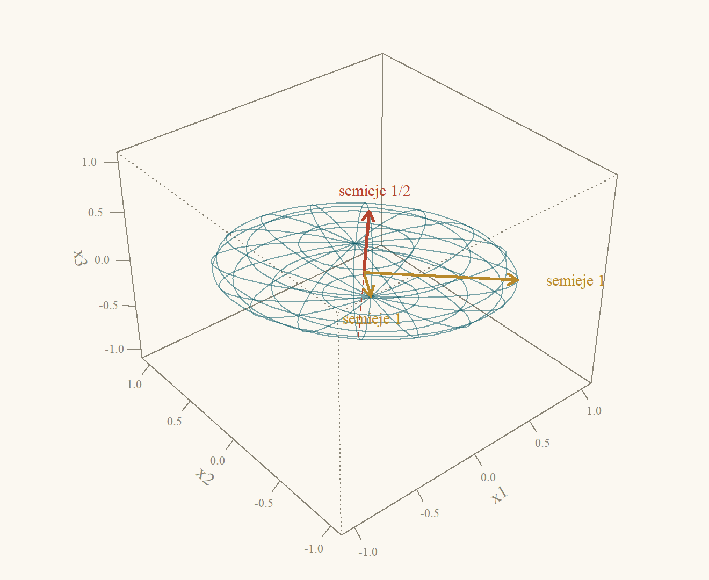
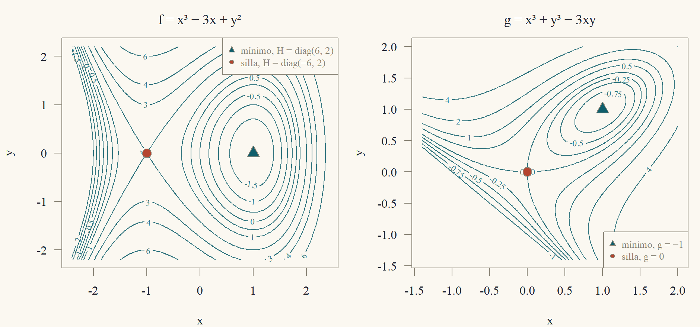
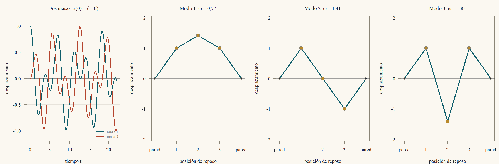

::: {.content-visible when-format="html"}
<a class="descarga-pdf" href="clase-08.pdf">Descargar esta clase en PDF</a>
:::

# Una elipse inclinada

La curva $2x^2 + 2xy + 2y^2 = 1$ es una elipse, pero está **inclinada**: el término $2xy$ la tuerce. ¿Hay un par de ejes en los que la ecuación se escriba sin ese término? Probemos con los ejes diagonales,
$$
u = \frac{x + y}{\sqrt2},\qquad v = \frac{x - y}{\sqrt2},\qquad\text{es decir}\qquad x = \frac{u + v}{\sqrt2},\quad y = \frac{u - v}{\sqrt2}.
$$
Entonces
$$
\begin{aligned}
2x^2 + 2y^2 &= (u + v)^2 + (u - v)^2 = 2u^2 + 2v^2,\\
2xy &= (u + v)(u - v) = u^2 - v^2,
\end{aligned}
$$
y al sumar, $2x^2 + 2xy + 2y^2 = 3u^2 + v^2$. En los ejes $(u,v)$ la curva es $3u^2 + v^2 = 1$, una elipse **derecha**, con semiejes $1/\sqrt3$ (a lo largo de $u$) y $1$ (a lo largo de $v$). Los números $3$ y $1$ que aparecieron son los valores propios de la matriz simétrica
$$
A = \begin{pmatrix}2&1\\1&2\end{pmatrix},\qquad 2x^2 + 2xy + 2y^2 = \begin{pmatrix}x&y\end{pmatrix}A\begin{pmatrix}x\\y\end{pmatrix},
$$
y las direcciones $(1,1)$ y $(1,-1)$ de los ejes nuevos son sus vectores propios (@exm-espectral2). Esta clase muestra que **toda** matriz simétrica real tiene ejes así, perpendiculares entre sí, y cosecha las consecuencias: la geometría de las elipses y elipsoides, el criterio para saber si una matriz es "positiva" (lo que garantiza que una energía sea positiva o que un punto crítico sea un mínimo), una factorización que resuelve sistemas con la mitad del trabajo, y cómo vibran de verdad un sistema de masas y resortes y un cuerpo rígido que gira.

# El teorema espectral

Sea $A$ una matriz **simétrica real** $n\times n$ ($A' = A$). La Clase 7 mostró que una matriz puede tener valores propios complejos y vectores propios que no son perpendiculares. Para las simétricas, ninguna de las dos cosas ocurre.

::: {#lem-reales}
## Los valores propios de una simétrica real son reales
Si $A$ es real y simétrica y $Av = \lambda v$ con $v\in\mathbb{C}^n$, $v\ne0$, entonces $\lambda\in\mathbb{R}$.
:::

::: {.callout-note title="Borrador"}
Si $\lambda$ fuera complejo, $\lambda = \bar\lambda$ fallaría. Calculo el escalar $v^*Av$ de dos maneras: con $Av = \lambda v$ sale $\lambda\|v\|^2$, y, por la simetría, ese mismo escalar es igual a su propio conjugado, o sea real.
:::

::: {.proof}
Sea $v^* = \bar v'$ el vector fila conjugado, de modo que $v^*v = \sum_i|v_i|^2 = \|v\|^2>0$. De $Av = \lambda v$ sale $v^*Av = \lambda v^*v = \lambda\|v\|^2$. Por otro lado, el escalar $s = v^*Av$ cumple
$$
\bar s = \overline{v^*Av} = (v^*Av)^* = v^*A^*(v^*)^* = v^*A'v = v^*Av = s,
$$
porque $A$ es real ($A^* = A'$) y simétrica ($A' = A$). Un número igual a su conjugado es real. Luego $\lambda = s/\|v\|^2$ es real.
:::

::: {#lem-ortogonales}
## Vectores propios de valores propios distintos son perpendiculares
Si $A' = A$, $Av = \lambda v$, $Aw = \mu w$ y $\lambda\ne\mu$, entonces $v\cdot w = 0$.
:::

::: {.callout-note title="Borrador"}
Calculo $(Av)\cdot w$ de dos maneras: usando $Av = \lambda v$ y pasando $A$ al otro vector con la simetría. Las dos expresiones difieren por el factor $\lambda - \mu\ne0$.
:::

::: {.proof}
Por una parte, $(Av)\cdot w = \lambda\,v\cdot w$. Por otra, $(Av)\cdot w = v'A'w = v'Aw = v\cdot(Aw) = \mu\,v\cdot w$. Restando, $(\lambda - \mu)\,v\cdot w = 0$, y como $\lambda\ne\mu$, $v\cdot w = 0$.
:::

El @lem-ortogonales no basta: un valor propio repetido puede tener un espacio propio de dimensión mayor que uno, y ahí hay que *elegir* vectores perpendiculares. El teorema siguiente dice que siempre se puede, y lo demuestra de una vez para todos los casos.

::: {#thm-espectral}
## Teorema espectral
Sea $A$ una matriz real simétrica $n\times n$. Existen una matriz **ortogonal** $Q$ ($Q'Q = I$) y una matriz diagonal **real** $\Lambda = \operatorname{diag}(\lambda_1,\dots,\lambda_n)$ tales que
$$
A = Q\Lambda Q'.
$$
Las columnas $q_1,\dots,q_n$ de $Q$ son una base ortonormal de $\mathbb{R}^n$ formada por vectores propios, $Aq_i = \lambda_iq_i$.
:::

::: {.callout-note title="Borrador"}
Inducción sobre $n$. Tomo un valor propio $\lambda_1$ (real, por el @lem-reales) con un vector propio unitario $q_1$, y lo completo a una base ortonormal con Gram–Schmidt (Clase 5). En esa base, $A$ queda con la forma $\begin{pmatrix}\lambda_1&0\\0&B\end{pmatrix}$: la primera columna sale de $Aq_1 = \lambda_1q_1$ y la primera fila, de la simetría. El bloque $B$ es simétrico y más chico, así que se le aplica la hipótesis de inducción.
:::

::: {.proof}
Para $n = 1$, $A = (a)$ y se toma $Q = (1)$, $\Lambda = (a)$.

Supongamos el teorema cierto para matrices simétricas de tamaño $n - 1$ y sea $A$ de tamaño $n$.

*Un valor propio y su vector.* El polinomio característico tiene una raíz $\lambda_1\in\mathbb{C}$ (Clase 7: es un polinomio de grado $n$), real por el @lem-reales. Entonces $A - \lambda_1I$ es una matriz **real** singular, y tiene un vector $q_1\in\mathbb{R}^n$ no nulo en su espacio nulo (la eliminación gaussiana sobre $\mathbb{R}$ produce una variable libre real, Clase 1). Normalizamos para que $\|q_1\| = 1$.

*Una base ortonormal.* Por Gram–Schmidt (Clase 5) existe una base ortonormal de $\mathbb{R}^n$ cuyo primer vector es $q_1$. Sean $W$ la matriz $n\times(n-1)$ con los otros vectores como columnas y $Q_1 = (q_1\ \ W)$, ortogonal.

*La forma de $Q_1'AQ_1$.* El producto $Q_1'AQ_1$ es simétrico, porque $(Q_1'AQ_1)' = Q_1'A'Q_1 = Q_1'AQ_1$. Su primera columna es $Q_1'Aq_1 = \lambda_1Q_1'q_1 = \lambda_1e_1$, porque las columnas de $Q_1$ son ortonormales ($Q_1'q_1 = e_1$). Por simetría, su primera fila también es $(\lambda_1\ \ 0\ \cdots\ 0)$. Así,
$$
Q_1'AQ_1 = \begin{pmatrix}\lambda_1&0\\0&B\end{pmatrix},\qquad B = W'AW,
$$
y $B$ es simétrica de tamaño $n - 1$ (porque $B' = W'A'W = B$).

*Inducción.* Por hipótesis de inducción, $B = Q_2\Lambda_2Q_2'$ con $Q_2$ ortogonal y $\Lambda_2$ diagonal real. Sea
$$
Q = Q_1\begin{pmatrix}1&0\\0&Q_2\end{pmatrix}.
$$
Es ortogonal, por ser producto de ortogonales ($Q'Q = \begin{pmatrix}1&0\\0&Q_2'\end{pmatrix}Q_1'Q_1\begin{pmatrix}1&0\\0&Q_2\end{pmatrix} = I$). Además,
$$
Q'AQ = \begin{pmatrix}1&0\\0&Q_2'\end{pmatrix}\begin{pmatrix}\lambda_1&0\\0&B\end{pmatrix}\begin{pmatrix}1&0\\0&Q_2\end{pmatrix} = \begin{pmatrix}\lambda_1&0\\0&Q_2'BQ_2\end{pmatrix} = \begin{pmatrix}\lambda_1&0\\0&\Lambda_2\end{pmatrix} = \Lambda,
$$
y multiplicando por $Q$ a la izquierda y por $Q'$ a la derecha, $A = Q\Lambda Q'$.
:::

Un valor propio repetido no es problema: el teorema entrega igual una base ortonormal completa. Lo recíproco también vale, y es inmediato: toda matriz de la forma $Q\Lambda Q'$ es simétrica, porque $(Q\Lambda Q')' = Q\Lambda'Q' = Q\Lambda Q'$. Es decir, **una matriz real es simétrica si y solo si se diagonaliza con una base ortonormal**.

::: {#cor-espectral}
## Descomposición espectral
Si $A = Q\Lambda Q'$ como en el @thm-espectral, entonces:

1. $A = \lambda_1q_1q_1' + \dots + \lambda_nq_nq_n'$, y cada $P_i = q_iq_i'$ es la matriz de proyección sobre la recta de $q_i$ (Clase 6), con $P_iP_j = 0$ si $i\ne j$ y $P_1 + \dots + P_n = I$.
2. $A^k = Q\Lambda^kQ' = \sum_i\lambda_i^kP_i$ para todo $k\ge0$; si $A$ es invertible, $A^{-1} = \sum_i\lambda_i^{-1}P_i$.
3. $\operatorname{tr}A = \sum_i\lambda_i$, $\det A = \prod_i\lambda_i$, y $\operatorname{rango}A$ es el número de valores propios no nulos.
:::

::: {.callout-note title="Borrador"}
Todo sale de $A = Q\Lambda Q'$ y de $Q'Q = I$: (1) es el producto columna por fila, (2) se obtiene al cancelar $Q'Q$ en el medio, y (3) usa que $Q$ es invertible.
:::

::: {.proof}
(1) $Q\Lambda$ tiene columnas $\lambda_iq_i$, y el producto de una matriz por $Q'$ es la suma de (columna $i$)(fila $i$ de $Q'$): $Q\Lambda Q' = \sum_i(\lambda_iq_i)q_i'$. Cada $q_iq_i'$ es la proyección sobre la recta de $q_i$ porque $\|q_i\| = 1$ (Clase 6, con $a = q_i$). Además $P_iP_j = q_i(q_i'q_j)q_j' = 0$ si $i\ne j$, y $\sum P_i = QQ' = I$.

(2) $A^2 = Q\Lambda Q'Q\Lambda Q' = Q\Lambda^2Q'$ porque $Q'Q = I$; se sigue por inducción. Si $A$ es invertible, ningún $\lambda_i$ es cero (Clase 7: $\det A = \prod\lambda_i\ne0$) y $Q\Lambda^{-1}Q'$ cumple $(Q\Lambda^{-1}Q')A = Q\Lambda^{-1}\Lambda Q' = I$.

(3) Traza y determinante son los de la Clase 7. El rango de $A = Q\Lambda Q'$ es el de $\Lambda$ (multiplicar por matrices invertibles no cambia el rango, Clase 3), que es el número de entradas diagonales no nulas.
:::

::: {#exm-espectral2}
## Una matriz $2\times2$
Para $A = \begin{pmatrix}2&1\\1&2\end{pmatrix}$: $\tau = 4$, $\Delta = 3$, $p(\lambda) = \lambda^2 - 4\lambda + 3 = (\lambda - 3)(\lambda - 1)$. Para $\lambda = 3$: $A - 3I = \begin{pmatrix}-1&1\\1&-1\end{pmatrix}$ da $x_1 = x_2$, $q_1 = \tfrac1{\sqrt2}(1,1)'$. Para $\lambda = 1$: $A - I = \begin{pmatrix}1&1\\1&1\end{pmatrix}$ da $x_1 = -x_2$, $q_2 = \tfrac1{\sqrt2}(1,-1)'$. Son perpendiculares: $1\cdot1 + 1\cdot(-1) = 0$ (@lem-ortogonales). Con $Q = \tfrac1{\sqrt2}\begin{pmatrix}1&1\\1&-1\end{pmatrix}$ y $\Lambda = \operatorname{diag}(3,1)$,
$$
A = 3\cdot\frac12\begin{pmatrix}1&1\\1&1\end{pmatrix} + 1\cdot\frac12\begin{pmatrix}1&-1\\-1&1\end{pmatrix} = \begin{pmatrix}\tfrac32 + \tfrac12&\tfrac32 - \tfrac12\\\tfrac32 - \tfrac12&\tfrac32 + \tfrac12\end{pmatrix} = \begin{pmatrix}2&1\\1&2\end{pmatrix}\ \checkmark
$$
:::

::: {#exm-espectral3}
## Una matriz $3\times3$ con un valor propio repetido
Sea $A = \begin{pmatrix}2&1&1\\1&2&1\\1&1&2\end{pmatrix} = I + J$, donde $J$ es la matriz de unos. Como $A(1,1,1)' = (4,4,4)'$, $\lambda = 4$ es un valor propio con $q_1 = \tfrac1{\sqrt3}(1,1,1)'$. Para $\lambda = 1$: $A - I = J$, y $Jx = 0$ significa $x_1 + x_2 + x_3 = 0$, un **plano** (espacio propio de dimensión $2$). Una base ortogonal del plano es $(1,-1,0)'$ y $(1,1,-2)'$ (producto interno $1 - 1 + 0 = 0$; ambos suman cero). Normalizando,
$$
q_2 = \tfrac1{\sqrt2}\begin{pmatrix}1\\-1\\0\end{pmatrix},\qquad q_3 = \tfrac1{\sqrt6}\begin{pmatrix}1\\1\\-2\end{pmatrix}.
$$
La traza $6 = 4 + 1 + 1$ y el determinante $4 = 4\cdot1\cdot1$ coinciden con los de $A$ ($\det A = 2(4 - 1) - 1(2 - 1) + 1(1 - 2) = 6 - 1 - 1 = 4$). Las proyecciones son
$$
P_4 = q_1q_1' = \tfrac13\begin{pmatrix}1&1&1\\1&1&1\\1&1&1\end{pmatrix},
$$
$$
\begin{aligned}
P_1 = q_2q_2' + q_3q_3' &= \tfrac12\begin{pmatrix}1&-1&0\\-1&1&0\\0&0&0\end{pmatrix} + \tfrac16\begin{pmatrix}1&1&-2\\1&1&-2\\-2&-2&4\end{pmatrix}\\
&= \tfrac13\begin{pmatrix}2&-1&-1\\-1&2&-1\\-1&-1&2\end{pmatrix},
\end{aligned}
$$
que cumplen $P_1 = I - P_4$, y
$$
A = 4P_4 + 1\cdot P_1 = \tfrac43J + \left(I - \tfrac13J\right) = I + J\ \checkmark
$$
Dentro del plano propio, $q_2$ y $q_3$ **no son únicos** (cualquier par ortonormal del plano sirve), pero la proyección $P_1$ sí lo es: depende solo del espacio propio.
:::

# Formas cuadráticas y ejes principales

Una **forma cuadrática** en $x\in\mathbb{R}^n$ es una función $q(x) = x'Ax$. Siempre se puede suponer $A$ simétrica.

::: {#prp-simetrizar}
## La matriz de una forma cuadrática se toma simétrica
Para toda matriz cuadrada $B$, $x'Bx = x'Sx$ con $S = \tfrac12(B + B')$ simétrica, y la matriz simétrica de una forma cuadrática es única.
:::

::: {.callout-note title="Borrador"}
Un escalar es igual a su transpuesta, así que $x'Bx$ es el promedio de $x'Bx$ y $x'B'x$. Para la unicidad, evalúo una diferencia simétrica en $e_i$ y en $e_i + e_j$ para ver que todas sus entradas son cero.
:::

::: {.proof}
$x'Bx$ es un escalar, igual a su transpuesta $x'B'x$; entonces $x'Bx = \tfrac12(x'Bx + x'B'x) = x'Sx$. Unicidad: si $S$ y $T$ son simétricas con $x'Sx = x'Tx$ para todo $x$, $D = S - T$ es simétrica con $x'Dx = 0$ siempre. Con $x = e_i$: $d_{ii} = 0$. Con $x = e_i + e_j$: $0 = d_{ii} + d_{jj} + 2d_{ij} = 2d_{ij}$. Luego $D = 0$.
:::

Por ejemplo, $q(x,y) = 2x^2 + 2xy + 2y^2$ tiene matriz $\begin{pmatrix}2&1\\1&2\end{pmatrix}$: el término cruzado $2xy$ se reparte a mitades entre las posiciones $(1,2)$ y $(2,1)$.

::: {#thm-ejes}
## Teorema de los ejes principales
Sea $A = Q\Lambda Q'$ simétrica. Con el cambio de variables $y = Q'x$ (las **coordenadas en los vectores propios**),
$$
x'Ax = \lambda_1y_1^2 + \dots + \lambda_ny_n^2,\qquad\text{con}\qquad \|y\| = \|x\|.
$$
:::

::: {.callout-note title="Borrador"}
Sustituyo $x = Qy$ en $x'Ax$: aparece $Q'AQ = \Lambda$. La longitud se conserva porque $Q$ es ortogonal.
:::

::: {.proof}
$x = Qy$ (porque $QQ' = I$), así que $x'Ax = y'Q'AQy = y'\Lambda y = \sum\lambda_iy_i^2$. Y $\|y\|^2 = x'QQ'x = x'x = \|x\|^2$.
:::

Como $y\mapsto Qy$ conserva distancias (es una rotación, quizá con reflexión), el **conjunto de nivel** $\{x: x'Ax = 1\}$ es la figura $\sum\lambda_iy_i^2 = 1$ puesta, sin deformarla, en los ejes $q_1,\dots,q_n$. Hay tres casos (@fig-cuadricas):

- **Todos los $\lambda_i>0$:** una **elipse** (en $\mathbb{R}^2$) o un **elipsoide** (en $\mathbb{R}^3$) con semiejes $1/\sqrt{\lambda_i}$ a lo largo de $q_i$. Cuanto *mayor* es el valor propio, *más corto* es el semieje.
- **Valores propios de ambos signos:** una **hipérbola** o un **hiperboloide**.
- **Algún $\lambda_i = 0$ (y los demás $\lambda_j>0$):** la figura se estira sin límite en la dirección de $q_i$: **rectas paralelas** en $\mathbb{R}^2$ (o un cilindro en $\mathbb{R}^3$).

{#fig-cuadricas width=98%}

::: {#exm-elipse}
## La elipse de la apertura
Para $A = \begin{pmatrix}2&1\\1&2\end{pmatrix}$ (@exm-espectral2), los valores propios son $3$ y $1$ y las coordenadas en los vectores propios son $y_1 = \tfrac{x_1 + x_2}{\sqrt2}$ y $y_2 = \tfrac{x_1 - x_2}{\sqrt2}$; es el cambio $(u,v)$ del principio. La elipse $x'Ax = 1$ es $3y_1^2 + y_2^2 = 1$, con semiejes $1/\sqrt3\approx0{,}577$ en la dirección $(1,1)$ y $1$ en la dirección $(1,-1)$. Verificación con el extremo del semieje largo, $(x_1,x_2) = \tfrac1{\sqrt2}(1,-1)$: $x_1^2 = x_2^2 = \tfrac12$ y $x_1x_2 = -\tfrac12$, así que $2\cdot\tfrac12 + 2\cdot(-\tfrac12) + 2\cdot\tfrac12 = 1$ ✓.
:::

::: {#exm-elipsoide}
## Un elipsoide de revolución en el espacio
Para $A = I + J$ (@exm-espectral3) los valores propios son $4,1,1$. En las coordenadas de los vectores propios, $x'Ax = 4y_1^2 + y_2^2 + y_3^2 = 1$: semieje $\tfrac12$ a lo largo de $(1,1,1)$ y semiejes $1$ y $1$ en el plano $x_1 + x_2 + x_3 = 0$. Es un elipsoide **achatado de revolución** (un disco grueso): al haber dos valores propios iguales, todas las direcciones del plano perpendicular a $(1,1,1)$ son ejes principales (@fig-elipsoide). Por ejemplo, el punto $(1,-1,0)/\sqrt2$ cumple $x'Ax = \tfrac12(2 + 2 - 2) = 1$ ✓ (está en la superficie, en el plano propio) y $(1,1,1)/(2\sqrt3)$ también: $\tfrac1{12}(2\cdot3 + 2\cdot3) = 1$ ✓.
:::

{#fig-elipsoide width=66%}

# Matrices definidas positivas

Una energía debe ser positiva; la curvatura de un mínimo, también. La propiedad matricial que captura esto es la siguiente.

::: {#def-definida}
## Definida positiva
Una matriz simétrica $A$ es **definida positiva** si $x'Ax>0$ para todo $x\ne0$; **semidefinida positiva** si $x'Ax\ge0$ para todo $x$; **definida negativa** si $-A$ es definida positiva; e **indefinida** si $x'Ax$ toma valores positivos y negativos.
:::

Decidir cuál es el caso parece exigir probar infinitos vectores. El teorema siguiente lo reduce a un cálculo finito, de cuatro maneras equivalentes.

::: {#thm-criterios}
## Criterios de definición positiva
Para una matriz simétrica $A$ de $n\times n$ son equivalentes:

(a) $x'Ax>0$ para todo $x\ne0$ ($A$ es definida positiva).

(b) Todos los valores propios de $A$ son positivos.

(c) $A = R'R$ para alguna matriz **cuadrada invertible** $R$.

(d) La eliminación gaussiana sin intercambio de filas tiene $n$ pivotes y **todos son positivos**.

(e) Todos los **menores principales** $\det A_1,\dots,\det A_n$ son positivos, donde $A_k$ es la esquina superior izquierda $k\times k$ de $A$.
:::

::: {.callout-note title="Borrador"}
Demuestro un ciclo de implicaciones. (a)$\Leftrightarrow$(b) sale del teorema de los ejes principales. (b)$\Rightarrow$(c) con una raíz cuadrada de $\Lambda$. (c)$\Rightarrow$(a) con la norma de $Rx$. Para los pivotes y menores recorro (a)$\Rightarrow$(e)$\Rightarrow$(d)$\Rightarrow$(a), usando que $A = LDL'$ cuando $A$ es simétrica.
:::

::: {.proof}
*(a)$\Leftrightarrow$(b).* Con $A = Q\Lambda Q'$ y $y = Q'x$, el @thm-ejes da $x'Ax = \sum\lambda_iy_i^2$, y $y\ne0$ si y solo si $x\ne0$. Si todos los $\lambda_i>0$, la suma es positiva para $y\ne0$. Recíprocamente, si (a) vale, $q_i'Aq_i = \lambda_iq_i'q_i = \lambda_i$ debe ser positivo para cada vector propio unitario $q_i$.

*(b)$\Rightarrow$(c).* Sea $\Lambda^{1/2} = \operatorname{diag}(\sqrt{\lambda_1},\dots,\sqrt{\lambda_n})$ y $R = \Lambda^{1/2}Q'$. Entonces $R'R = Q\Lambda^{1/2}\Lambda^{1/2}Q' = Q\Lambda Q' = A$, y $R$ es invertible porque es producto de matrices invertibles.

*(c)$\Rightarrow$(a).* $x'Ax = x'R'Rx = \|Rx\|^2\ge0$, y vale $0$ solo si $Rx = 0$, es decir, solo si $x = 0$ (porque $R$ es invertible).

*(a)$\Rightarrow$(e).* Sea $z\in\mathbb{R}^k$ no nulo y $x = (z,0)'\in\mathbb{R}^n$, no nulo. Entonces $z'A_kz = x'Ax>0$: $A_k$ es simétrica y definida positiva. Por (a)$\Leftrightarrow$(b) aplicado a $A_k$, todos sus valores propios son positivos, y su determinante (el producto, Clase 7) es positivo.

*(e)$\Rightarrow$(d).* Si $\det A_k>0$ para todo $k$, todas las submatrices principales son invertibles y, por el teorema de la sección ★ de la Clase 2, $A = LU$ existe sin intercambio de filas, con $L$ unitriangular inferior. Al multiplicar por bloques, la esquina $k\times k$ de $LU$ es $L_kU_k$ (el producto de las esquinas, porque los bloques fuera de la esquina no aportan a ella: $L$ es triangular inferior y $U$, triangular superior). Entonces $\det A_k = \det L_k\det U_k = u_{11}\cdots u_{kk}$, y el $k$-ésimo pivote es $u_{kk} = \det A_k/\det A_{k-1}$ (con $\det A_0 = 1$), positivo.

*(d)$\Rightarrow$(a).* Con pivotes $d_1,\dots,d_n>0$ escribimos $A = LU = LD\tilde U$, con $D = \operatorname{diag}(d_i)$ y $\tilde U$ unitriangular superior. Como $A$ es simétrica, $A = A' = \tilde U'DL' = \tilde U'(DL')$. Así $A = L\,(D\tilde U)$ y $A = \tilde U'\,(DL')$ son dos factorizaciones de la misma matriz, ambas de la forma (unitriangular inferior)(triangular superior), y $A$ es invertible (sus pivotes son no nulos). Por la unicidad de la LU (Clase 2), $\tilde U' = L$ y, de $D\tilde U = DL'$, $\tilde U = L'$. Así $A = LDL'$. Para $x\ne0$, sea $z = L'x\ne0$ ($L'$ es invertible); entonces
$$
x'Ax = x'LDL'x = z'Dz = d_1z_1^2 + \dots + d_nz_n^2>0.
$$
:::

Para una matriz **definida negativa** los menores principales alternan de signo: $(-1)^k\det A_k>0$ (aplicar (e) a $-A$, y $\det(-A_k) = (-1)^k\det A_k$).

::: {#exm-criterios}
## Los cuatro criterios en dos matrices
**$2\times2$.** $A = \begin{pmatrix}2&1\\1&2\end{pmatrix}$: menores $2$ y $\det A = 3$, ambos positivos; pivotes $2$ y $2 - \tfrac12 = \tfrac32$; valores propios $1$ y $3$. Es definida positiva.

**$3\times3$.** Sea $K = \begin{pmatrix}2&-1&0\\-1&2&-1\\0&-1&2\end{pmatrix}$. Eliminación: sumando $\tfrac12$ de la fila 1 a la fila 2, queda $\begin{pmatrix}2&-1&0\\0&\tfrac32&-1\\0&-1&2\end{pmatrix}$; sumando $\tfrac23$ de la fila 2 a la fila 3, el tercer pivote es $2 - \tfrac23 = \tfrac43$. Los pivotes son $2,\tfrac32,\tfrac43$ y los multiplicadores $l_{21} = -\tfrac12$, $l_{32} = -\tfrac23$:
$$
K = LDL' = \begin{pmatrix}1&0&0\\-\tfrac12&1&0\\0&-\tfrac23&1\end{pmatrix}\begin{pmatrix}2&&\\&\tfrac32&\\&&\tfrac43\end{pmatrix}\begin{pmatrix}1&-\tfrac12&0\\0&1&-\tfrac23\\0&0&1\end{pmatrix}.
$$
Los menores son $2$, $2\cdot2 - 1 = 3$ y $\det K = 2(4 - 1) + 1(-2 - 0) = 6 - 2 = 4$: el producto de pivotes ($2\cdot\tfrac32\cdot\tfrac43 = 4$) y cada cociente de menores consecutivos ($\tfrac32$, $\tfrac43$) es un pivote. Los valores propios son $2 - \sqrt2\approx0{,}586$, $2$ y $2 + \sqrt2\approx3{,}414$ (suman $6 = \operatorname{tr}K$ y multiplican $2(4 - 2) = 4 = \det K$). Todo coincide: $K$ es definida positiva.
:::

::: {#exm-indefinida}
## Una matriz indefinida
$A = \begin{pmatrix}1&2\\2&1\end{pmatrix}$ tiene menores $1$ y $\det A = 1 - 4 = -3<0$: no es definida positiva. Sus valores propios son $3$ y $-1$ (suman $2 = \tau$, producto $-3 = \Delta$), de signos opuestos. Un vector que lo muestra: $x = (1,-1)'$ da $x'Ax = 1 - 4 + 1 = -2<0$, mientras que $x = (1,1)'$ da $1 + 4 + 1 = 6>0$.
:::

::: {#prp-semidef}
## Semidefinidas
Una matriz simétrica $A$ es semidefinida positiva si y solo si todos sus valores propios son $\ge0$, si y solo si $A = R'R$ para alguna matriz $R$ (no necesariamente invertible).
:::

La demostración es la misma que la de (a)$\Leftrightarrow$(b)$\Leftrightarrow$(c), cambiando $>$ por $\ge$ ($R = \Lambda^{1/2}Q'$ sirve, y $x'R'Rx = \|Rx\|^2\ge0$ siempre). Ojo: para semidefinidas **no** basta que los menores *líderes* $\det A_k$ sean $\ge0$. La matriz $\begin{pmatrix}0&0\\0&-1\end{pmatrix}$ tiene menores líderes $0$ y $0$, pero $x'Ax = -x_2^2$ es negativa en $(0,1)$. (El criterio correcto para semidefinidas exige **todos** los menores principales, no solo los de la esquina.)

En $3\times3$, $S = \begin{pmatrix}2&1&3\\1&2&3\\3&3&6\end{pmatrix}$ ($= B'B$ de arriba) cumple $S(1,-1,0)' = (1,-1,0)'$, $S(1,1,2)' = (9,9,18)' = 9(1,1,2)'$ y $S(1,1,-1)' = 0$: valores propios $1$, $9$ y $0$ (suman $10 = \operatorname{tr}S$), todos $\ge0$ y uno nulo. Es semidefinida positiva y, con el valor propio $0$, no definida. Sus menores líderes son $2$, $3$ y $\det S = 0$, consistentes.

::: {#prp-ata}
## Matrices de la forma $A'A$
Para cualquier matriz $A$ de $m\times n$, $A'A$ es simétrica y semidefinida positiva. Es definida positiva si y solo si las columnas de $A$ son independientes.
:::

::: {.callout-note title="Borrador"}
La forma cuadrática de $A'A$ es $\|Ax\|^2$, que es $\ge0$. Se anula exactamente cuando $Ax = 0$, y eso depende de si el espacio nulo de $A$ tiene solo el vector cero.
:::

::: {.proof}
$(A'A)' = A'A$ y $x'A'Ax = \|Ax\|^2\ge0$. Es $0$ solo si $Ax = 0$; con columnas independientes, $N(A) = \{0\}$ (Clase 3) y eso obliga a $x = 0$. Si las columnas son dependientes hay $x\ne0$ con $Ax = 0$ y $x'A'Ax = 0$.
:::

Esto explica por qué las ecuaciones normales de mínimos cuadrados (Clase 6) tienen solución única exactamente cuando las columnas son independientes: la matriz $G = A'A$ de ese sistema es definida positiva. Por ejemplo, $A = \begin{pmatrix}1&0\\1&1\\0&1\end{pmatrix}$ (columnas independientes) da $A'A = \begin{pmatrix}2&1\\1&2\end{pmatrix}$, la matriz definida positiva de arriba.

En $3\times3$: la matriz $A = \begin{pmatrix}1&0&0\\1&1&0\\1&1&1\\1&1&1\end{pmatrix}$ ($4\times3$, columnas independientes) da
$$
A'A = \begin{pmatrix}4&3&2\\3&3&2\\2&2&2\end{pmatrix},
$$
con menores $4$, $4\cdot3 - 3\cdot3 = 3$ y $\det = 4(6 - 4) - 3(6 - 4) + 2(6 - 6) = 2$, todos positivos (pivotes $4$, $\tfrac34$, $\tfrac23$): definida positiva. En cambio, $B = \begin{pmatrix}1&0&1\\0&1&1\\1&1&2\end{pmatrix}$ tiene la tercera columna igual a la suma de las dos primeras, así que $B(1,1,-1)' = 0$, y
$$
B'B = \begin{pmatrix}2&1&3\\1&2&3\\3&3&6\end{pmatrix}
$$
cumple $x'B'Bx = \|Bx\|^2 = 0$ en $x = (1,1,-1)'$: es semidefinida y **no** definida (sus valores propios son $9$, $1$ y $0$).

# La factorización de Cholesky

Si $A$ es simétrica y definida positiva, la factorización $A = LDL'$ de la demostración anterior se puede dividir en partes iguales.

::: {#thm-cholesky}
## Factorización de Cholesky
Si $A$ es simétrica y definida positiva, existe una **única** matriz triangular inferior $L$ con diagonal positiva tal que
$$
A = LL'.
$$
:::

::: {.callout-note title="Borrador"}
Existencia: ya tengo $A = L_1DL_1'$ con $D>0$; absorbo $\sqrt D$ en cada lado. Unicidad: si $LL' = MM'$, paso $M$ al otro lado y obtengo una matriz que es a la vez triangular inferior y superior, o sea diagonal; la positividad de la diagonal fuerza que sea la identidad.
:::

::: {.proof}
*Existencia.* Por el @thm-criterios (d), $A = L_1DL_1'$ con $L_1$ unitriangular inferior y $D = \operatorname{diag}(d_i)$, $d_i>0$. Sea $L = L_1D^{1/2}$ con $D^{1/2} = \operatorname{diag}(\sqrt{d_i})$. Es triangular inferior con diagonal $\sqrt{d_i}>0$ y $LL' = L_1D^{1/2}D^{1/2}L_1' = L_1DL_1' = A$.

*Unicidad.* Sean $A = LL' = MM'$ con $L,M$ triangulares inferiores de diagonal positiva (invertibles). Entonces $M^{-1}L = M'(L')^{-1}$. El lado izquierdo es triangular inferior (producto e inversa de triangulares inferiores) y el derecho, triangular superior; por lo tanto es una matriz diagonal $E$, con $M^{-1}L = E$, y la igualdad $M'(L')^{-1} = E$ da $M' = EL'$, es decir $M = LE$ (transponiendo, $E' = E$). Pero también $L = ME$. Sustituyendo, $L = LE\cdot E = LE^2$, así que $E^2 = I$, y $E$ tiene diagonal $\pm1$. Como las diagonales de $L$ y $M = LE$ son positivas, $E = I$ y $M = L$.
:::

El cálculo de $L$ sale de comparar entradas en $A = LL'$. Como $a_{ij} = \sum_{k\le\min(i,j)}l_{ik}l_{jk}$:

- para $i = j$: $a_{jj} = \sum_{k<j}l_{jk}^2 + l_{jj}^2$, de donde $l_{jj} = \sqrt{a_{jj} - \sum_{k<j}l_{jk}^2}$;
- para $i>j$: $a_{ij} = \sum_{k<j}l_{ik}l_{jk} + l_{ij}l_{jj}$, de donde $l_{ij} = \dfrac{a_{ij} - \sum_{k<j}l_{ik}l_{jk}}{l_{jj}}$.

::: {.callout-caution title="Algoritmo: Cholesky"}
**Entrada:** $A$ simétrica $n\times n$. **Salida:** $L$ triangular inferior con $A = LL'$.

1. Para $j = 1,\dots,n$ (columna por columna):
2. $\quad l_{jj} = \sqrt{a_{jj} - \sum_{k<j}l_{jk}^2}$.
3. $\quad$ Para $i = j + 1,\dots,n$: $l_{ij} = \bigl(a_{ij} - \sum_{k<j}l_{ik}l_{jk}\bigr)/l_{jj}$.
4. Para resolver $Ax = b$: resolver $Ly = b$ hacia adelante y $L'x = y$ hacia atrás (Clase 2).

**Costo:** unos $n^3/3$ flops, **la mitad** de los $2n^3/3$ de la LU (Clase 2), porque se aprovecha la simetría. No requiere pivoteo y es estable. **Cuándo falla:** si en el paso 2 el radicando es $\le0$, $A$ **no** es definida positiva (por el teorema, si lo fuera la raíz existiría). Por eso Cholesky es la forma práctica de comprobar la definición positiva.
:::

::: {#exm-cholesky2}
## $2\times2$
$A = \begin{pmatrix}4&2\\2&5\end{pmatrix}$: $l_{11} = \sqrt4 = 2$, $l_{21} = 2/2 = 1$, $l_{22} = \sqrt{5 - 1^2} = 2$. Entonces $L = \begin{pmatrix}2&0\\1&2\end{pmatrix}$ y $LL' = \begin{pmatrix}4&2\\2&1 + 4\end{pmatrix} = A$ ✓.
:::

::: {#exm-cholesky3}
## $3\times3$ y un sistema
Sea $A = \begin{pmatrix}4&2&2\\2&5&3\\2&3&6\end{pmatrix}$. Columna 1: $l_{11} = 2$, $l_{21} = 2/2 = 1$, $l_{31} = 2/2 = 1$. Columna 2: $l_{22} = \sqrt{5 - 1} = 2$, $l_{32} = (3 - 1\cdot1)/2 = 1$. Columna 3: $l_{33} = \sqrt{6 - 1 - 1} = 2$. Así
$$
L = \begin{pmatrix}2&0&0\\1&2&0\\1&1&2\end{pmatrix},\qquad LL' = \begin{pmatrix}4&2&2\\2&1 + 4&1 + 2\\2&1 + 2&1 + 1 + 4\end{pmatrix} = A\ \checkmark
$$
y $\det A = (2\cdot2\cdot2)^2 = 64$. Resolvamos $Ax = b$ con $b = (8,10,11)'$. Primero $Ly = b$: $y_1 = 8/2 = 4$; $y_2 = (10 - 4)/2 = 3$; $y_3 = (11 - 4 - 3)/2 = 2$. Luego $L'x = y$, con $L' = \begin{pmatrix}2&1&1\\0&2&1\\0&0&2\end{pmatrix}$: $x_3 = 2/2 = 1$; $x_2 = (3 - 1)/2 = 1$; $x_1 = (4 - 1 - 1)/2 = 1$. La solución es $x = (1,1,1)'$, y se comprueba: $A(1,1,1)' = (8,10,11)'$ ✓.
:::

Una aplicación en estadística: si $z$ tiene componentes independientes con media $0$ y varianza $1$, y $\Sigma = LL'$ es una matriz de covarianzas, el vector $x = Lz$ tiene covarianza $L\,I\,L' = \Sigma$. Así se simulan variables correlacionadas.^[André-Louis Cholesky (1875–1918), oficial del ejército francés, ideó el método para cálculos geodésicos; se publicó póstumamente, en 1924.]

# El cociente de Rayleigh

¿Cuánto puede valer $x'Ax$ entre vectores de la misma longitud? El **cociente de Rayleigh** mide la "energía por unidad de longitud al cuadrado":
$$
R(x) = \frac{x'Ax}{x'x},\qquad x\ne0.
$$

::: {#thm-rayleigh}
## Los valores propios extremos son los extremos de $R$
Sea $A$ simétrica con valores propios $\lambda_1\le\lambda_2\le\dots\le\lambda_n$ y vectores propios ortonormales $q_1,\dots,q_n$. Entonces para todo $x\ne0$
$$
\lambda_1\le R(x)\le\lambda_n,
$$
con $R(q_1) = \lambda_1$ y $R(q_n) = \lambda_n$. En consecuencia, $\lambda_n = \max_{\|x\| = 1}x'Ax$ y $\lambda_1 = \min_{\|x\| = 1}x'Ax$.
:::

::: {.callout-note title="Borrador"}
En las coordenadas $y = Q'x$, el cociente es un promedio ponderado de los valores propios con pesos $\ge0$ que suman $1$. Un promedio no sale del intervalo entre el menor y el mayor de sus datos.
:::

::: {.proof}
Con $y = Q'x$ y el @thm-ejes, $R(x) = \dfrac{\sum\lambda_iy_i^2}{\sum y_i^2} = \sum_iw_i\lambda_i$ con $w_i = y_i^2/\|y\|^2\ge0$ y $\sum w_i = 1$. Es un **promedio ponderado** de los valores propios, y un promedio ponderado está entre el menor y el mayor: $\lambda_1 = \sum w_i\lambda_1\le\sum w_i\lambda_i\le\sum w_i\lambda_n = \lambda_n$. Para $x = q_1$, $y = e_1$ y $R = \lambda_1$; para $x = q_n$, $R = \lambda_n$.
:::

La derivada confirma que los puntos críticos de $R$ son los vectores propios: para $A$ simétrica, $\partial(x'Ax)/\partial x_k = 2(Ax)_k$ (cada $x_k$ aparece en $\sum_{i,j}a_{ij}x_ix_j$ con coeficiente $2\sum_ja_{kj}x_j$), de modo que
$$
\nabla R(x) = \frac{2Ax\cdot x'x - x'Ax\cdot2x}{(x'x)^2} = \frac{2}{x'x}\bigl(Ax - R(x)\,x\bigr),
$$
que se anula si y solo si $Ax = R(x)x$.

::: {#exm-rayleigh}
## $2\times2$ y $3\times3$
**$2\times2$.** Para $A = \begin{pmatrix}2&1\\1&2\end{pmatrix}$ y el vector unitario $x = (\cos\theta,\sin\theta)'$: $R = 2\cos^2\theta + 2\cos\theta\sin\theta + 2\sin^2\theta = 2 + \sin2\theta$. Varía entre $1$ (en $\theta = 135°$, la dirección $(1,-1)$) y $3$ (en $\theta = 45°$, la dirección $(1,1)$): son los valores propios (@fig-rayleigh, izquierda). A la derecha, la imagen del círculo unidad por $A$ es una elipse de semiejes $3$ y $1$: el vector propio de $\lambda = 3$ se estira al máximo y el de $\lambda = 1$ no cambia de largo.

**$3\times3$.** Para $A = I + J$ (valores propios $1,1,4$): $R(e_1) = 2$; para $x = (1,1,0)'$, $Ax = (3,3,2)'$ y $x'Ax = 6$, $x'x = 2$, así que $R = 3$; para $x = (1,1,1)'$, $Ax = (4,4,4)'$, $x'Ax = 12$ y $x'x = 3$, así que $R = 4$ (el máximo); y para $x = (1,-1,0)'$, $Ax = (1,-1,0)'$, $x'Ax = 2$ y $x'x = 2$, así que $R = 1$ (el mínimo). Todos los valores caen entre $1$ y $4$ ✓.
:::

{#fig-rayleigh width=96%}

# El Hessiano y los puntos críticos

La matriz de segundas derivadas (el **Hessiano**) de una función es simétrica y decide si un punto crítico es mínimo, máximo o silla. Primero el caso exacto, la función cuadrática.

::: {#thm-cuadratica}
## Mínimo de una función cuadrática
Sea $f(x) = \tfrac12x'Ax - b'x + c$ con $A$ simétrica. Si $A$ es definida positiva, $f$ tiene un **único** mínimo, en $x^* = A^{-1}b$, y
$$
f(x) = f(x^*) + \tfrac12(x - x^*)'A(x - x^*)\ \ge\ f(x^*).
$$
Si $A$ tiene un valor propio negativo, $f$ no está acotada inferiormente.
:::

::: {.callout-note title="Borrador"}
Escribo $x = x^* + h$ y expando: el término lineal en $h$ es $h'(Ax^* - b)$ y se anula en $x^*$, así que queda $f(x^*) + \tfrac12h'Ah$. Si $A$ es definida positiva, eso es $>f(x^*)$ para $h\ne0$. Si tiene un valor propio negativo, avanzo por ese vector propio.
:::

::: {.proof}
Sea $x = x^* + h$ con $Ax^* = b$. Expandiendo,
$$
\begin{aligned}
f(x^* + h) &= \tfrac12x^{*\prime}Ax^* + \tfrac12\bigl(x^{*\prime}Ah + h'Ax^*\bigr) + \tfrac12h'Ah - b'x^* - b'h + c\\
&= f(x^*) + h'(Ax^* - b) + \tfrac12h'Ah,
\end{aligned}
$$
donde se usó $x^{*\prime}Ah = h'Ax^*$ (simetría). Como $Ax^* = b$, el término lineal desaparece y $f(x^* + h) = f(x^*) + \tfrac12h'Ah>f(x^*)$ para $h\ne0$. Para la segunda afirmación no se necesita $x^*$ (con $A$ singular puede no existir): si $Aq = \lambda q$ con $\lambda<0$ y $\|q\| = 1$, entonces $f(tq) = \tfrac12\lambda t^2 - (b'q)\,t + c\to-\infty$ cuando $t\to\infty$, porque el término cuadrático, negativo, domina al lineal.
:::

Para una función general $f$ de clase $C^2$, en un punto crítico $x^*$ ($\nabla f(x^*) = 0$) el desarrollo de Taylor de segundo orden dice $f(x^* + h) = f(x^*) + \tfrac12h'Hh + o(\|h\|^2)$, donde $H$ es el Hessiano en $x^*$ (esto se usa sin demostración, es cálculo). Con él se obtiene el criterio.

::: {#prp-hessiano}
## Clasificación de puntos críticos
Sea $x^*$ un punto crítico y $H$ el Hessiano ahí, con valores propios $\lambda_1\le\dots\le\lambda_n$.

1. Si $H$ es definida positiva ($\lambda_1>0$), $x^*$ es un **mínimo local estricto**.
2. Si $H$ es definida negativa ($\lambda_n<0$), $x^*$ es un **máximo local estricto**.
3. Si $H$ es indefinida ($\lambda_1<0<\lambda_n$), $x^*$ es un **punto silla**.
:::

::: {.callout-note title="Borrador"}
Con $\nabla f(x^*) = 0$, la función cerca de $x^*$ se parece a $f(x^*) + \tfrac12h'Hh$. El cociente de Rayleigh acota $h'Hh$ por abajo con $\lambda_1\|h\|^2$ (caso 1); en el caso 3 miro la función a lo largo de dos vectores propios de signos opuestos.
:::

::: {.proof}
(1) Por el @thm-rayleigh, $h'Hh\ge\lambda_1\|h\|^2$, así que $f(x^* + h) - f(x^*)\ge\tfrac12\lambda_1\|h\|^2 + o(\|h\|^2)>0$ para $h\ne0$ chico. (2) Es (1) aplicado a $-f$. (3) Con $Hq = \lambda q$ y $\|q\| = 1$, $f(x^* + tq) - f(x^*) = \tfrac12\lambda t^2 + o(t^2)$, que es negativo para $t$ chico si $\lambda<0$ y positivo si $\lambda>0$: baja en una dirección y sube en otra.
:::

Si $H$ es solo semidefinida, el criterio no decide (hay que mirar términos de orden superior). En econometría, la función de mínimos cuadrados $S(\beta) = \|y - X\beta\|^2$ tiene Hessiano $2X'X$, definido positivo si y solo si las columnas de $X$ son independientes (@prp-ata): ese es el motivo por el que el mínimo es único (Clase 6).

::: {#exm-hessiano}
## Un mínimo cuadrático, y un mínimo con una silla
**Cuadrática.** $f(x,y) = x^2 + xy + y^2 - 3x - 3y = \tfrac12x'Ax - b'x$ con $A = \begin{pmatrix}2&1\\1&2\end{pmatrix}$ y $b = (3,3)'$. $A$ es definida positiva, y $x^* = A^{-1}b$ resuelve $2x + y = 3$, $x + 2y = 3$: $x^* = (1,1)'$, con $f(1,1) = 3 - 6 = -3$. Por el @thm-cuadratica, $f(x) = -3 + \tfrac12(x - x^*)'A(x - x^*)\ge-3$ ✓.

**Cuadrática $3\times3$.** Sea $f(x) = \tfrac12x'Kx - x_1$, con $K$ la matriz de la @exm-criterios (definida positiva) y $b = (1,0,0)'$. La inversa es $K^{-1} = \tfrac14\begin{pmatrix}3&2&1\\2&4&2\\1&2&3\end{pmatrix}$ (se comprueba: la primera columna de $K\cdot K^{-1}$ es $\tfrac14(6 - 2,\ -3 + 4 - 1,\ -2 + 2)' = (1,0,0)'$, y análogamente las otras), de modo que $x^* = K^{-1}b = (\tfrac34,\tfrac12,\tfrac14)'$ y $f(x^*) = \tfrac12b'x^* - b'x^* = -\tfrac12b'x^* = -\tfrac38$. Para $h = (0{,}1,\,-0{,}2,\,0{,}3)'$: $\tfrac12h'Kh = \tfrac12(2\cdot0{,}01 + 2\cdot0{,}04 + 2\cdot0{,}09 + 2\cdot0{,}02 + 2\cdot0{,}06) = 0{,}22$ y $f(x^* + h) = -0{,}375 + 0{,}22 = -0{,}155$. Si en cambio $A = \operatorname{diag}(1,1,-1)$ y $b = 0$, entonces $f(te_3) = -\tfrac12t^2\to-\infty$: sin mínimo.

**No cuadrática.** $f(x,y) = x^3 - 3x + y^2$ tiene $\nabla f = (3x^2 - 3,\ 2y)$, que se anula en $(1,0)$ y $(-1,0)$. El Hessiano es $H = \begin{pmatrix}6x&0\\0&2\end{pmatrix}$. En $(1,0)$: $H = \operatorname{diag}(6,2)$, definido positivo, **mínimo local** con $f = -2$. En $(-1,0)$: $H = \operatorname{diag}(-6,2)$, indefinido, **silla** ($f = 2$): a lo largo de $x$ la derivada segunda es $-6<0$ (la función baja al alejarse del punto) y a lo largo de $y$ es $2>0$ (sube) (@fig-hessiano, izquierda).

**No cuadrática $3\times3$.** $f(x,y,z) = x^3 - 3x + y^2 + z^2 + yz$ tiene $\nabla f = (3x^2 - 3,\ 2y + z,\ y + 2z)$, que se anula solo en $(\pm1,0,0)$ (el sistema $2y + z = 0$, $y + 2z = 0$ tiene determinante $3\ne0$, luego $y = z = 0$). El Hessiano es $H = \begin{pmatrix}6x&0&0\\0&2&1\\0&1&2\end{pmatrix}$, con valores propios $6x$, $1$ y $3$ (los dos últimos, los del bloque $\begin{pmatrix}2&1\\1&2\end{pmatrix}$). En $(1,0,0)$: $6,1,3>0$, **mínimo local** con $f = -2$. En $(-1,0,0)$: $-6,1,3$, **silla** con $f = 2$.
:::

{#fig-hessiano width=96%}

# Modos normales de vibración

Tres masas iguales (de masa $1$) se mueven sobre una recta, unidas entre sí y a dos paredes por resortes iguales de constante $1$. Sea $x_i$ el desplazamiento de la masa $i$ desde su posición de reposo, con $x_0 = x_{n+1} = 0$ (las paredes, que no se mueven). La ley de Hooke dice que cada resorte tira con fuerza igual a su estiramiento; sobre la masa $i$ actúan el resorte de la izquierda, que está estirado en $x_i - x_{i-1}$, y el de la derecha, estirado en $x_{i+1} - x_i$, así que la ley de Newton da
$$
x_i'' = -(x_i - x_{i-1}) + (x_{i+1} - x_i) = x_{i-1} - 2x_i + x_{i+1},
$$
es decir, $x'' = -Kx$, con $K = \begin{pmatrix}2&-1&0\\-1&2&-1\\0&-1&2\end{pmatrix}$ para $n = 3$ y $K = \begin{pmatrix}2&-1\\-1&2\end{pmatrix}$ para $n = 2$. Es simétrica. La **energía potencial** almacenada en los resortes es $V = \tfrac12\bigl[x_1^2 + (x_2 - x_1)^2 + (x_3 - x_2)^2 + x_3^2\bigr]$, una suma de cuadrados; al expandir,
$$
x'Kx = 2x_1^2 + 2x_2^2 + 2x_3^2 - 2x_1x_2 - 2x_2x_3 = x_1^2 + (x_2 - x_1)^2 + (x_3 - x_2)^2 + x_3^2,
$$
así que $V = \tfrac12x'Kx$. Esta suma es $\ge0$, y es $0$ solo si $x_1 = 0$, $x_2 = x_1$, $x_3 = x_2$, es decir, $x = 0$. Luego **$K$ es definida positiva, sin calcular un solo valor propio**: la positividad es la afirmación física "estirar un resorte cuesta energía".

::: {#thm-modos}
## Modos normales
Sea $K = Q\Lambda Q'$ simétrica y definida positiva, $\omega_i = \sqrt{\lambda_i}$. La solución de $x'' = -Kx$ con $x(0) = \xi$ y $x'(0) = \eta$ es
$$
x(t) = \sum_{i=1}^nq_i\left(a_i\cos\omega_it + b_i\sin\omega_it\right),\qquad a_i = q_i'\xi,\quad b_i = \frac{q_i'\eta}{\omega_i}.
$$
Cada $q_i$ es un **modo normal**: si el sistema parte de $\xi = q_i$ (con $\eta = 0$), todas las masas oscilan en fase con la misma frecuencia $\omega_i$.
:::

::: {.callout-note title="Borrador"}
En las coordenadas $y = Q'x$ el sistema se desacopla: la matriz $K$ se vuelve diagonal y cada coordenada obedece su propia ecuación del oscilador. Resuelvo esas ecuaciones y deshago el cambio. La positividad de los $\lambda_i$ hace que $\omega_i$ sea real, o sea, que la solución oscile y no crezca.
:::

::: {.proof}
Sea $y = Q'x$, con $Q$ constante. Entonces $y'' = Q'x'' = -Q'Kx = -Q'KQy = -\Lambda y$, es decir, $y_i'' = -\omega_i^2y_i$ para cada $i$, con $y_i(0) = q_i'\xi = a_i$ y $y_i'(0) = q_i'\eta$. La función $y_i = a_i\cos\omega_it + (q_i'\eta/\omega_i)\sin\omega_it$ cumple la ecuación (derivando dos veces cada término se obtiene $-\omega_i^2$ por el término) y las condiciones iniciales. Es la única: si $z$ es la diferencia de dos soluciones, $z'' = -\omega^2z$ con $z(0) = z'(0) = 0$, y $\frac{d}{dt}(z'^2 + \omega^2z^2) = 2z'(z'' + \omega^2z) = 0$, así que $z'^2 + \omega^2z^2$ es constante e igual a $0$ en $t = 0$; luego $z\equiv0$. Finalmente $x = Qy = \sum_iy_iq_i$.
:::

Si $K$ tuviera un valor propio negativo, $\omega$ sería imaginario y aparecerían exponenciales crecientes (Clase 7): un sistema inestable. La definición positiva de $K$ es lo que garantiza la oscilación.

::: {#exm-2masas}
## Dos masas
$K = \begin{pmatrix}2&-1\\-1&2\end{pmatrix}$ tiene valores propios $1$ y $3$ (traza $4$, determinante $3$) y vectores propios $q_1 = \tfrac1{\sqrt2}(1,1)'$ (las masas se mueven **juntas**, con $\omega_1 = 1$) y $q_2 = \tfrac1{\sqrt2}(1,-1)'$ (se mueven en **sentidos opuestos**, con $\omega_2 = \sqrt3$; el resorte del medio se estira más, por eso la frecuencia es mayor). Si se tira de la masa 1 hasta $\xi = (1,0)'$ y se suelta ($\eta = 0$): $a_1 = q_1'\xi = 1/\sqrt2$ y $a_2 = 1/\sqrt2$, así que
$$
x(t) = \tfrac1{\sqrt2}\,q_1\cos t + \tfrac1{\sqrt2}\,q_2\cos\sqrt3t = \tfrac12\begin{pmatrix}1\\1\end{pmatrix}\cos t + \tfrac12\begin{pmatrix}1\\-1\end{pmatrix}\cos\sqrt3t,
$$
o sea $x_1 = \tfrac12(\cos t + \cos\sqrt3t)$ y $x_2 = \tfrac12(\cos t - \cos\sqrt3t)$. Verificación: $x(0) = (1,0)'$ ✓ y $x''(0) = -\tfrac12(1,1)' - \tfrac32(1,-1)' = (-2,1)' = -Kx(0)$ ✓. La energía pasa de una masa a la otra (@fig-modos, izquierda).
:::

::: {#exm-3masas}
## Tres masas
Los valores propios de $K$ (@exm-criterios) son $2 - \sqrt2$, $2$ y $2 + \sqrt2$, y los vectores propios son
$$
v_1 = \begin{pmatrix}1\\\sqrt2\\1\end{pmatrix},\quad v_2 = \begin{pmatrix}1\\0\\-1\end{pmatrix},\quad v_3 = \begin{pmatrix}1\\-\sqrt2\\1\end{pmatrix}.
$$
Verificación de $v_2$: $Kv_2 = (2\cdot1 - 0,\ -1 + 0 + 1,\ 0 - 2)' = (2,0,-2)' = 2v_2$ ✓. De $v_1$: $Kv_1 = (2 - \sqrt2,\ -1 + 2\sqrt2 - 1,\ -\sqrt2 + 2)' = (2 - \sqrt2,\ 2\sqrt2 - 2,\ 2 - \sqrt2)' = (2 - \sqrt2)(1,\sqrt2,1)'$ ✓ (porque $(2 - \sqrt2)\sqrt2 = 2\sqrt2 - 2$). Las frecuencias son $\omega_1 = \sqrt{2 - \sqrt2}\approx0{,}765$, $\omega_2 = \sqrt2\approx1{,}414$ y $\omega_3 = \sqrt{2 + \sqrt2}\approx1{,}848$. En el modo 1 las tres masas van juntas, con la del medio más lejos; en el modo 2 la del medio queda quieta y las de los extremos van en sentidos opuestos; en el modo 3 la del medio va contra las otras dos (@fig-modos).

Si solo se desplaza la masa 1 ($\xi = (1,0,0)'$, $\eta = 0$), los coeficientes son $a_i = q_i'\xi$ con $q_1 = v_1/2$, $q_2 = v_2/\sqrt2$, $q_3 = v_3/2$: $a_1 = \tfrac12$, $a_2 = \tfrac1{\sqrt2}$, $a_3 = \tfrac12$, y
$$
x(t) = \tfrac14v_1\cos\omega_1t + \tfrac12v_2\cos\omega_2t + \tfrac14v_3\cos\omega_3t.
$$
En $t = 0$: $\tfrac14(1,\sqrt2,1) + \tfrac12(1,0,-1) + \tfrac14(1,-\sqrt2,1) = (1,0,0)$ ✓.
:::

{#fig-modos width=100%}

# El tensor de inercia

Un cuerpo rígido formado por masas puntuales $m_i$ en las posiciones $r_i\in\mathbb{R}^3$ gira alrededor del origen con velocidad angular $\omega\in\mathbb{R}^3$ (el vector $\omega$ apunta a lo largo del eje de giro y su largo es la velocidad de giro). Cada masa tiene velocidad $v_i = \omega\times r_i$ (producto cruz).

::: {#prp-inercia}
## Energía y momento angular
Con masas $m_i>0$, sea $I = \sum_im_i\bigl(\|r_i\|^2\,\mathrm{Id} - r_ir_i'\bigr)$ (el **tensor de inercia**, simétrico $3\times3$, donde $\mathrm{Id}$ es la identidad). Entonces la energía cinética es $T = \tfrac12\omega'I\omega$ y el momento angular, $L = \sum m_i\,r_i\times v_i = I\omega$. Además $I$ es semidefinida positiva, y definida positiva si y solo si las masas no están todas sobre una misma recta por el origen.
:::

::: {.callout-note title="Borrador"}
La identidad de Lagrange convierte $\|\omega\times r\|^2$ en la forma cuadrática $\omega'(\|r\|^2\mathrm{Id} - rr')\omega$, que da $T$ y la semidefinición. El momento angular sale del triple producto vectorial.
:::

::: {.proof}
Por la identidad de Lagrange, $\|\omega\times r\|^2 = \|\omega\|^2\|r\|^2 - (\omega\cdot r)^2 = \omega'(\|r\|^2\mathrm{Id} - rr')\omega$. Entonces $T = \tfrac12\sum m_i\|v_i\|^2 = \tfrac12\omega'I\omega$. Para el momento angular, $r\times(\omega\times r) = \omega\|r\|^2 - r(r\cdot\omega)$ (identidad del triple producto vectorial), y sumando, $L = \sum m_i(\|r_i\|^2\omega - r_i(r_i\cdot\omega)) = I\omega$. Como $x'Ix = \sum m_i\|x\times r_i\|^2\ge0$ (misma identidad), $I$ es semidefinida positiva; vale $0$ para $x\ne0$ si y solo si $x\times r_i = 0$ para todo $i$, es decir, si todos los $r_i$ son paralelos a $x$.
:::

Los **momentos de inercia** son los valores propios de $I$ y los **ejes principales** son sus vectores propios. Si el cuerpo gira alrededor de un eje principal ($\omega = \omega_0q$, $Iq = \lambda q$), entonces $L = \lambda\omega$ es paralelo a $\omega$ y el giro es estacionario (el eje no se bambolea; es además estable si el eje es el de mayor o el de menor inercia, pero no el de inercia intermedia, como muestra una raqueta de tenis lanzada al aire); alrededor de cualquier otro eje, $L$ **no** es paralelo a $\omega$, y el eje de giro se bambolea. Por el @thm-rayleigh, la inercia alrededor de un eje unitario $u$ es $u'Iu = R(u)$, con extremos $\lambda_1$ y $\lambda_3$.

::: {#exm-inercia}
## Una mancuerna
Dos masas de $1$ en $r = (1,1,0)'$ y $-r$, con $\|r\|^2 = 2$ y $rr' = \begin{pmatrix}1&1&0\\1&1&0\\0&0&0\end{pmatrix}$ (igual para $-r$). Entonces
$$
I = 2\left(2\,\mathrm{Id} - rr'\right) = 2\begin{pmatrix}1&-1&0\\-1&1&0\\0&0&2\end{pmatrix} = \begin{pmatrix}2&-2&0\\-2&2&0\\0&0&4\end{pmatrix}.
$$
Su polinomio característico es $\det(I - \lambda\,\mathrm{Id}) = \bigl[(2 - \lambda)^2 - 4\bigr](4 - \lambda) = \lambda(\lambda - 4)(4 - \lambda) = -\lambda(\lambda - 4)^2$, con raíces $0$, $4$ y $4$. El valor propio $0$ tiene vector propio $(1,1,0)'$: **la inercia alrededor del eje de la mancuerna es cero** (masas puntuales sobre el eje no se resisten a girar), y por eso $I$ es semidefinida y **no** definida positiva (@prp-inercia: las masas están sobre una recta por el origen). Los otros dos momentos valen $4$ (ejes $(1,-1,0)'$ y $(0,0,1)'$, perpendiculares a la mancuerna). Si $\omega = (1,0,0)'$: $L = I\omega = (2,-2,0)'$, que no es paralelo a $\omega$ (el eje $e_1$ no es principal), y $T = \tfrac12\omega'I\omega = \tfrac12\cdot2 = 1$, entre los extremos $0$ y $4$ de $R$ ✓.
:::

# ★ Para ir más allá: el teorema de Courant–Fischer

::: {.callout-important title="★ Para ir más allá"}
El @thm-rayleigh caracteriza el **mayor** y el **menor** valor propio como extremos de $R(x)$. ¿Y los intermedios? Se obtienen con un problema de "mínimo de máximos" sobre subespacios. Con eso se demuestra, entre otras cosas, que los valores propios cambian de forma monótona cuando se suma una matriz semidefinida positiva.
:::

::: {#thm-courant}
## Courant–Fischer
Sea $A$ simétrica $n\times n$ con valores propios $\lambda_1\le\dots\le\lambda_n$. Para $k = 1,\dots,n$,
$$
\lambda_k = \min_{\dim S = k}\ \max_{x\in S,\,x\ne0}R(x) = \max_{\dim S = n - k + 1}\ \min_{x\in S,\,x\ne0}R(x),
$$
donde $S$ recorre los subespacios de $\mathbb{R}^n$ de la dimensión indicada.
:::

::: {.callout-note title="Borrador"}
Para "$\le$": el subespacio generado por los primeros $k$ vectores propios tiene máximo de $R$ igual a $\lambda_k$. Para "$\ge$": cualquier subespacio de dimensión $k$ corta al generado por los vectores propios $q_k,\dots,q_n$ (hay más incógnitas que ecuaciones), y ahí $R\ge\lambda_k$.
:::

::: {.proof}
*Primera igualdad, "$\le$".* Sea $S_0 = \operatorname{gen}(q_1,\dots,q_k)$. Para $x = \sum_{i\le k}y_iq_i\in S_0$, $R(x) = \sum_{i\le k}\lambda_iy_i^2/\sum_{i\le k}y_i^2\le\lambda_k$ (promedio ponderado de $\lambda_1,\dots,\lambda_k$), con igualdad en $x = q_k$. Entonces $\max_{S_0}R = \lambda_k$, y el mínimo sobre todos los $S$ es $\le\lambda_k$.

*Primera igualdad, "$\ge$".* Sea $S$ cualquier subespacio de dimensión $k$, con base $s_1,\dots,s_k$. Buscamos $x = \sum c_is_i\ne0$ que cumpla $q_j'x = 0$ para $j = 1,\dots,k-1$. Son $k - 1$ ecuaciones homogéneas en las $k$ incógnitas $c_1,\dots,c_k$, que tienen una solución no nula (hay más incógnitas que ecuaciones, Clase 1), y $x\ne0$ porque los $s_i$ son independientes. Como $x\in S$ es perpendicular a $q_1,\dots,q_{k-1}$, $x = \sum_{i\ge k}y_iq_i$ y $R(x) = \sum_{i\ge k}\lambda_iy_i^2/\sum_{i\ge k}y_i^2\ge\lambda_k$. Por lo tanto $\max_SR\ge R(x)\ge\lambda_k$, para todo $S$; el mínimo sobre $S$ es $\ge\lambda_k$.

*Segunda igualdad.* Los valores propios de $-A$ son $-\lambda_n\le\dots\le-\lambda_1$, es decir, $\lambda_j(-A) = -\lambda_{n-j+1}(A)$, y $R_{-A} = -R_A$. Aplicando la primera igualdad a $-A$ con $j = n - k + 1$: $-\lambda_k(A) = \lambda_{n-k+1}(-A) = \min_{\dim S = n-k+1}\max_S(-R_A) = -\max_{\dim S = n-k+1}\min_SR_A$, y se cambia el signo.
:::

::: {#cor-monotonia}
## Monotonía de los valores propios
Si $A$ es simétrica y $B$ es simétrica semidefinida positiva, entonces $\lambda_k(A + B)\ge\lambda_k(A)$ para todo $k$.
:::

::: {.callout-note title="Borrador"}
Sumar $B$ semidefinida no puede bajar el cociente de Rayleigh en ningún vector. Esa desigualdad pasa al máximo sobre cada subespacio y luego al mínimo sobre los subespacios, que es $\lambda_k$ por Courant–Fischer.
:::

::: {.proof}
Para todo $x\ne0$, $R_{A+B}(x) = R_A(x) + x'Bx/x'x\ge R_A(x)$. Por lo tanto $\max_SR_{A+B}\ge\max_SR_A$ para cada subespacio $S$, y al tomar el mínimo sobre los $S$ de dimensión $k$ se conserva la desigualdad; por el @thm-courant, $\lambda_k(A + B)\ge\lambda_k(A)$.
:::

El Ejercicio 8.7 usa el teorema para probar que los valores propios de una submatriz principal quedan **entrelazados** con los de la matriz completa.

::: {.callout-caution title="En más dimensiones"}
Todo lo de esta clase vale para $n\times n$ con las mismas demostraciones: el teorema espectral, los cuatro criterios de definición positiva, Cholesky, el cociente de Rayleigh, el Hessiano y Courant–Fischer. Lo que cambia con $n$ grande es el cálculo: para comprobar que una matriz es definida positiva, se intenta Cholesky ($\sim n^3/3$ operaciones) y no se calculan los valores propios; estos se obtienen con métodos iterativos (Clase 10) y, cuando la matriz es enorme y dispersa, con métodos de Krylov (curso de Álgebra lineal). Si las masas del sistema vibratorio son distintas, $x'' = -M^{-1}Kx$ con $M$ diagonal definida positiva: el problema $Kx = \lambda Mx$ se reduce al caso simétrico escribiendo $M = LL'$ (Cholesky) y trabajando con $L^{-1}KL^{-\prime}$; el caso con $M$ singular se trata en la Clase 15. En dimensión infinita, el teorema espectral para operadores autoadjuntos da las series de Fourier y los modos de una cuerda vibrante: el curso de Álgebra lineal lo desarrolla.
:::

# Resumen

- **Teorema espectral:** una matriz real simétrica tiene valores propios **reales** y una base **ortonormal** de vectores propios: $A = Q\Lambda Q' = \sum\lambda_iq_iq_i'$ (@thm-espectral, @cor-espectral). Es simétrica si y solo si se diagonaliza con una base ortonormal.
- **Ejes principales:** con $y = Q'x$, $x'Ax = \sum\lambda_iy_i^2$ (@thm-ejes). El conjunto $x'Ax = 1$ es una elipse o un elipsoide de semiejes $1/\sqrt{\lambda_i}$ si todos los $\lambda_i>0$; hipérbola si hay signos mixtos; rectas o cilindro si hay un $\lambda_i = 0$ y los demás son positivos.
- **Definida positiva** (@thm-criterios): equivale a todos los $\lambda_i>0$, a $A = R'R$ con $R$ invertible, a todos los pivotes $>0$ y a todos los menores principales $>0$. $A'A$ es definida positiva si y solo si las columnas de $A$ son independientes (@prp-ata).
- **Cholesky:** $A = LL'$, única con diagonal positiva (@thm-cholesky); cuesta $n^3/3$, sin pivoteo, y falla exactamente cuando $A$ no es definida positiva.
- **Rayleigh:** $\lambda_1\le R(x)\le\lambda_n$ y los extremos se alcanzan en los vectores propios (@thm-rayleigh).
- **Hessiano:** en un punto crítico, $H$ definido positivo $\Rightarrow$ mínimo, definido negativo $\Rightarrow$ máximo, indefinido $\Rightarrow$ silla (@prp-hessiano); para la cuadrática $\tfrac12x'Ax - b'x$ con $A$ definida positiva el mínimo es $A^{-1}b$ (@thm-cuadratica).
- **Modos normales:** $x'' = -Kx$ con $K = Q\Lambda Q'$ definida positiva se desacopla en osciladores de frecuencias $\omega_i = \sqrt{\lambda_i}$ (@thm-modos). Tensor de inercia: simétrico y semidefinido positivo; los ejes principales son sus vectores propios (@prp-inercia).
- **★** Courant–Fischer: $\lambda_k = \min_{\dim S = k}\max_SR$ (@thm-courant); implica la monotonía de los valores propios (@cor-monotonia).

# Ejercicios

**Ejercicio 8.1.** Sea $A = \begin{pmatrix}5&2\\2&2\end{pmatrix}$. (a) Calcula los valores propios y un par de vectores propios unitarios perpendiculares. (b) Escribe $A = 6P_1 + 1\cdot P_2$ con las dos proyecciones. (c) Usa (b) para calcular $A^5$. (d) Describe la curva $5x^2 + 4xy + 2y^2 = 1$ y calcula $R(1,0)$.

::: {.callout-tip collapse="true" title="Solución 8.1"}
(a) $\tau = 7$, $\Delta = 10 - 4 = 6$, $p(\lambda) = \lambda^2 - 7\lambda + 6 = (\lambda - 6)(\lambda - 1)$. Para $\lambda = 6$: $A - 6I = \begin{pmatrix}-1&2\\2&-4\end{pmatrix}$, $x_1 = 2x_2$, $v_1 = (2,1)'$. Para $\lambda = 1$: $A - I = \begin{pmatrix}4&2\\2&1\end{pmatrix}$, $2x_1 + x_2 = 0$, $v_2 = (1,-2)'$. Son perpendiculares ($2 - 2 = 0$). Unitarios: $q_1 = \tfrac1{\sqrt5}(2,1)'$, $q_2 = \tfrac1{\sqrt5}(1,-2)'$.

(b) $P_1 = q_1q_1' = \tfrac15\begin{pmatrix}4&2\\2&1\end{pmatrix}$, $P_2 = q_2q_2' = \tfrac15\begin{pmatrix}1&-2\\-2&4\end{pmatrix}$. Entonces $6P_1 + P_2 = \tfrac15\begin{pmatrix}24 + 1&12 - 2\\12 - 2&6 + 4\end{pmatrix} = \tfrac15\begin{pmatrix}25&10\\10&10\end{pmatrix} = \begin{pmatrix}5&2\\2&2\end{pmatrix}$ ✓.

(c) $A^5 = 6^5P_1 + 1^5P_2$ con $6^5 = 7776$: $A^5 = \tfrac15\begin{pmatrix}4\cdot7776 + 1&2\cdot7776 - 2\\2\cdot7776 - 2&7776 + 4\end{pmatrix} = \tfrac15\begin{pmatrix}31105&15550\\15550&7780\end{pmatrix} = \begin{pmatrix}6221&3110\\3110&1556\end{pmatrix}$.

(d) En los ejes de $q_1,q_2$ la curva es $6y_1^2 + y_2^2 = 1$: una **elipse** con semieje $1/\sqrt6\approx0{,}408$ a lo largo de $(2,1)$ y semieje $1$ a lo largo de $(1,-2)$. $R(1,0) = \tfrac{x'Ax}{x'x} = \tfrac51 = 5$, entre $1$ y $6$ ✓.
:::

**Ejercicio 8.2.** Sea $A = \begin{pmatrix}2&0&0\\0&3&1\\0&1&3\end{pmatrix}$. (a) Encuentra una base ortonormal de vectores propios y escribe $A = 2P_2 + 4P_4$ con $P_2$ la proyección sobre el espacio propio de $\lambda = 2$ y $P_4$ sobre el de $\lambda = 4$. (b) Calcula la raíz cuadrada $\sqrt A = \sqrt2\,P_2 + 2P_4$ y verifica que $(\sqrt A)^2 = A$. (c) Calcula $R(x)$ para $x = (1,1,0)'$ y compara con los valores propios.

::: {.callout-tip collapse="true" title="Solución 8.2"}
(a) $A$ es diagonal por bloques: $\lambda = 2$ del primer bloque, y $\begin{pmatrix}3&1\\1&3\end{pmatrix}$ tiene $\lambda^2 - 6\lambda + 8 = (\lambda - 2)(\lambda - 4)$. Valores propios $2,2,4$. Para $\lambda = 2$: $A - 2I = \begin{pmatrix}0&0&0\\0&1&1\\0&1&1\end{pmatrix}$ da $x_2 + x_3 = 0$, un plano con base ortonormal $q_1 = (1,0,0)'$ y $q_2 = \tfrac1{\sqrt2}(0,1,-1)'$. Para $\lambda = 4$: $A - 4I = \begin{pmatrix}-2&0&0\\0&-1&1\\0&1&-1\end{pmatrix}$ da $x_1 = 0$, $x_2 = x_3$: $q_3 = \tfrac1{\sqrt2}(0,1,1)'$. Las proyecciones son
$$
P_2 = q_1q_1' + q_2q_2' = \begin{pmatrix}1&0&0\\0&\tfrac12&-\tfrac12\\0&-\tfrac12&\tfrac12\end{pmatrix},
$$
$$
P_4 = q_3q_3' = \begin{pmatrix}0&0&0\\0&\tfrac12&\tfrac12\\0&\tfrac12&\tfrac12\end{pmatrix},
$$
y $2P_2 + 4P_4 = \begin{pmatrix}2&0&0\\0&1 + 2&-1 + 2\\0&-1 + 2&1 + 2\end{pmatrix} = A$ ✓.

(b) $\sqrt A = \sqrt2P_2 + 2P_4 = \begin{pmatrix}\sqrt2&0&0\\0&\tfrac{\sqrt2}2 + 1&1 - \tfrac{\sqrt2}2\\0&1 - \tfrac{\sqrt2}2&\tfrac{\sqrt2}2 + 1\end{pmatrix}$. Con $a = 1 + \tfrac{\sqrt2}2$ y $b = 1 - \tfrac{\sqrt2}2$, el cuadrado del bloque es $\begin{pmatrix}a^2 + b^2&2ab\\2ab&a^2 + b^2\end{pmatrix}$, con $a^2 + b^2 = 2\bigl(1 + \tfrac12\bigr) = 3$ y $2ab = 2\bigl(1 - \tfrac12\bigr) = 1$, y $(\sqrt2)^2 = 2$: se recupera $A$ ✓.

(c) $Ax = (2,3,1)'$, $x'Ax = 2 + 3 = 5$, $x'x = 2$, $R = \tfrac52 = 2{,}5$, entre $2$ y $4$ ✓.
:::

**Ejercicio 8.3.** Decide si cada matriz es definida positiva, semidefinida (no definida), o indefinida, y justifica con el criterio que prefieras: (a) $\begin{pmatrix}2&4\\4&5\end{pmatrix}$; (b) $\begin{pmatrix}1&1&1\\1&2&2\\1&2&3\end{pmatrix}$; (c) $\begin{pmatrix}1&2\\2&4\end{pmatrix}$; (d) $\begin{pmatrix}1&a\\a&4\end{pmatrix}$, según $a$.

::: {.callout-tip collapse="true" title="Solución 8.3"}
(a) Menores: $2$ y $\det = 10 - 16 = -6<0$. No es definida positiva y, como $\det<0$, los dos valores propios tienen signos opuestos: **indefinida**. Vectores que lo muestran: $x = (1,0)'$ da $x'Ax = 2>0$ y $x = (2,-1)'$ da $2\cdot4 + 8\cdot(2)(-1) + 5 = 8 - 16 + 5 = -3<0$.

(b) Eliminación: restar la fila 1 de las filas 2 y 3 da $\begin{pmatrix}1&1&1\\0&1&1\\0&1&2\end{pmatrix}$; restar la fila 2 de la 3 da el tercer pivote $2 - 1 = 1$. Pivotes $1,1,1>0$ (menores $1$, $2 - 1 = 1$ y $\det = 1$): **definida positiva**. De hecho $A = LL'$ con $L = \begin{pmatrix}1&0&0\\1&1&0\\1&1&1\end{pmatrix}$: $LL'$ tiene entrada $(i,j)$ igual a $\min(i,j)$, que es $A$ ✓.

(c) Menores $1$ y $\det = 4 - 4 = 0$; valores propios $0$ y $5$ ($\tau = 5$, $\Delta = 0$). **Semidefinida positiva, no definida:** $x'Ax = x_1^2 + 4x_1x_2 + 4x_2^2 = (x_1 + 2x_2)^2\ge0$, que se anula en $x = (2,-1)'\ne0$.

(d) Menores $1$ y $4 - a^2$. Es definida positiva si y solo si $4 - a^2>0$, es decir $-2<a<2$. Para $a = \pm2$ el determinante es $0$ (valores propios $0$ y $5$): semidefinida. Para $|a|>2$, $\det<0$: indefinida.
:::

**Ejercicio 8.4.** Calcula la factorización de Cholesky de $A = \begin{pmatrix}9&3&6\\3&5&4\\6&4&6\end{pmatrix}$, el determinante de $A$, y resuelve $Ax = b$ con $b = (18,6,14)'$.

::: {.callout-tip collapse="true" title="Solución 8.4"}
Columna 1: $l_{11} = \sqrt9 = 3$, $l_{21} = 3/3 = 1$, $l_{31} = 6/3 = 2$. Columna 2: $l_{22} = \sqrt{5 - 1^2} = 2$, $l_{32} = (4 - 2\cdot1)/2 = 1$. Columna 3: $l_{33} = \sqrt{6 - 2^2 - 1^2} = 1$. Así
$$
L = \begin{pmatrix}3&0&0\\1&2&0\\2&1&1\end{pmatrix},\qquad LL' = \begin{pmatrix}9&3&6\\3&1 + 4&2 + 2\\6&2 + 2&4 + 1 + 1\end{pmatrix} = A\ \checkmark
$$
$\det A = (3\cdot2\cdot1)^2 = 36$. Resolvemos $Ly = b$: $y_1 = 18/3 = 6$; $y_2 = (6 - 1\cdot6)/2 = 0$; $y_3 = (14 - 2\cdot6 - 1\cdot0)/1 = 2$. Luego $L'x = y$ con $L' = \begin{pmatrix}3&1&2\\0&2&1\\0&0&1\end{pmatrix}$: $x_3 = 2$; $x_2 = (0 - 1\cdot2)/2 = -1$; $x_1 = (6 - 1\cdot(-1) - 2\cdot2)/3 = 3/3 = 1$. La solución es $x = (1,-1,2)'$. Comprobación: $A(1,-1,2)' = (9 - 3 + 12,\ 3 - 5 + 8,\ 6 - 4 + 12)' = (18,6,14)'$ ✓.
:::

**Ejercicio 8.5.** Sea $g(x,y) = x^3 + y^3 - 3xy$. Encuentra sus puntos críticos y clasifícalos con el Hessiano. ¿Es el mínimo local un mínimo global?

::: {.callout-tip collapse="true" title="Solución 8.5"}
$\nabla g = (3x^2 - 3y,\ 3y^2 - 3x)$. De $y = x^2$ y $x = y^2$ sale $x = x^4$, es decir $x(x^3 - 1) = 0$: $x = 0$ o $x = 1$. Los puntos críticos son $(0,0)$ y $(1,1)$. El Hessiano es $H = \begin{pmatrix}6x&-3\\-3&6y\end{pmatrix}$.

En $(0,0)$: $H = \begin{pmatrix}0&-3\\-3&0\end{pmatrix}$, con $\det = -9<0$ (valores propios $\pm3$): **indefinido, silla**. Se comprueba: $g(t,t) = 2t^3 - 3t^2<0$ para $0<t<\tfrac32$, y $g(t,-t) = 3t^2>0$.

En $(1,1)$: $H = \begin{pmatrix}6&-3\\-3&6\end{pmatrix}$, con menores $6$ y $36 - 9 = 27$, ambos positivos (valores propios $3$ y $9$): **definido positivo, mínimo local estricto**, con $g(1,1) = 1 + 1 - 3 = -1$.

No es mínimo global: $g(-t,-t) = -2t^3 - 3t^2\to-\infty$ cuando $t\to\infty$.
:::

**Ejercicio 8.6.** En el sistema de tres masas, tira de la masa 1 hasta $\xi = (1,0,0)'$ y suéltala. (a) Calcula los coeficientes $a_i = q_i'\xi$. (b) Escribe $x(t)$. (c) Verifica la ecuación de movimiento en $t = 0$: $x''(0) = -Kx(0)$.

::: {.callout-tip collapse="true" title="Solución 8.6"}
(a) Los vectores propios unitarios son $q_1 = \tfrac12(1,\sqrt2,1)'$, $q_2 = \tfrac1{\sqrt2}(1,0,-1)'$, $q_3 = \tfrac12(1,-\sqrt2,1)'$. Con $\xi = e_1$: $a_1 = \tfrac12$, $a_2 = \tfrac1{\sqrt2}$, $a_3 = \tfrac12$. Como $\eta = 0$, todos los $b_i = 0$.

(b) $x(t) = \tfrac14(1,\sqrt2,1)'\cos\omega_1t + \tfrac12(1,0,-1)'\cos\sqrt2\,t + \tfrac14(1,-\sqrt2,1)'\cos\omega_3t$, con $\omega_1 = \sqrt{2 - \sqrt2}$ y $\omega_3 = \sqrt{2 + \sqrt2}$ (se obtiene de $a_iq_i$ con los vectores sin normalizar).

(c) Derivando dos veces, $x''(0) = -\tfrac14\lambda_1(1,\sqrt2,1)' - \tfrac12\cdot2\,(1,0,-1)' - \tfrac14\lambda_3(1,-\sqrt2,1)'$ con $\lambda_1 = 2 - \sqrt2$ y $\lambda_3 = 2 + \sqrt2$. Primera componente: $-\tfrac14(\lambda_1 + \lambda_3) - 1 = -\tfrac14\cdot4 - 1 = -2$. Segunda: $\tfrac{\sqrt2}4(\lambda_3 - \lambda_1) = \tfrac{\sqrt2}4\cdot2\sqrt2 = 1$. Tercera: $-\tfrac14(\lambda_1 + \lambda_3) + 1 = 0$. Entonces $x''(0) = (-2,1,0)'$, y $-Kx(0) = -(2,-1,0)' = (-2,1,0)'$ ✓.
:::

**Ejercicio 8.7 ★.** (a) Sea $A$ simétrica $n\times n$, con valores propios $\lambda_1\le\dots\le\lambda_n$, y sea $B$ la matriz $(n-1)\times(n-1)$ que resulta de borrar la última fila y la última columna de $A$, con valores propios $\mu_1\le\dots\le\mu_{n-1}$. Demuestra el **entrelazado** $\lambda_k\le\mu_k\le\lambda_{k+1}$ para $k = 1,\dots,n-1$. (b) Compruébalo con $A = K = \begin{pmatrix}2&-1&0\\-1&2&-1\\0&-1&2\end{pmatrix}$. (c) Con $A = \begin{pmatrix}2&1\\1&2\end{pmatrix}$ y $P = \begin{pmatrix}1&0\\0&0\end{pmatrix}$ (semidefinida positiva), verifica el @cor-monotonia.

::: {.callout-tip collapse="true" title="Solución 8.7 ★"}
(a) Para un vector $z\in\mathbb{R}^{n-1}$ sea $\tilde z = (z,0)'\in\mathbb{R}^n$. Entonces $\tilde z'A\tilde z = z'Bz$ y $\tilde z'\tilde z = z'z$: $R_A(\tilde z) = R_B(z)$.

*Cota inferior, $\lambda_k\le\mu_k$.* Sea $S'$ un subespacio de $\mathbb{R}^{n-1}$ de dimensión $k$ donde $\max_{S'}R_B = \mu_k$ (el generado por los primeros $k$ vectores propios de $B$, como en el teorema). Su inmersión $\tilde S = \{\tilde z\}$ es un subespacio de $\mathbb{R}^n$ de dimensión $k$ con $\max_{\tilde S}R_A = \max_{S'}R_B = \mu_k$. Por el @thm-courant (primera forma), $\lambda_k\le\max_{\tilde S}R_A = \mu_k$.

*Cota superior, $\mu_k\le\lambda_{k+1}$.* Por el @thm-courant (segunda forma) para $A$ con índice $k + 1$: $\lambda_{k+1} = \max_{\dim S = n - k}\min_SR_A$. Sea $T'$ el subespacio de $\mathbb{R}^{n-1}$ generado por los vectores propios de $B$ asociados a $\mu_k,\dots,\mu_{n-1}$ (dimensión $n - k$), donde $\min_{T'}R_B = \mu_k$. Su inmersión $\tilde T$ tiene dimensión $n - k$ y $\min_{\tilde T}R_A = \mu_k$. Luego $\lambda_{k+1}\ge\mu_k$.

(b) $K$ tiene valores propios $2 - \sqrt2\approx0{,}586$, $2$, $2 + \sqrt2\approx3{,}414$. $B = \begin{pmatrix}2&-1\\-1&2\end{pmatrix}$ tiene valores propios $1$ y $3$. Se cumple $0{,}586\le1\le2\le3\le3{,}414$ ✓.

(c) $A + P = \begin{pmatrix}3&1\\1&2\end{pmatrix}$ tiene $\tau = 5$ y $\Delta = 5$: valores propios $\tfrac{5\pm\sqrt5}2\approx1{,}382$ y $3{,}618$. Los de $A$ son $1$ y $3$: $1{,}382\ge1$ y $3{,}618\ge3$ ✓.
:::
