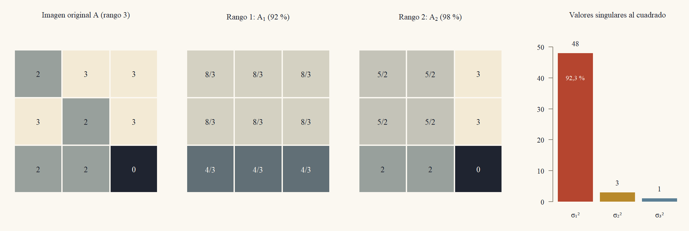

::: {.content-visible when-format="html"}
<a class="descarga-pdf" href="clase-09.pdf">Descargar esta clase en PDF</a>
:::

# Un círculo que se vuelve elipse

Sea $A = \begin{pmatrix}3&0\\4&5\end{pmatrix}$. Esta matriz no es simétrica y sus vectores propios no son perpendiculares, así que el teorema espectral de la Clase 8 no se le aplica. Pero siempre podemos mirar qué hace con el círculo unidad. Un vector unitario $x = (\cos t,\sin t)'$ va a $Ax = (3\cos t,\ 4\cos t + 5\sin t)'$, y al recorrer todo el círculo la imagen es la elipse inclinada de la @fig-circulo.

¿Hay un par de direcciones **perpendiculares** del círculo que $A$ lleve a las direcciones de los ejes de la elipse? Probemos con las diagonales $v_1 = \tfrac1{\sqrt2}(1,1)'$ y $v_2 = \tfrac1{\sqrt2}(1,-1)'$:
$$
Av_1 = \frac1{\sqrt2}\begin{pmatrix}3\\9\end{pmatrix},\qquad Av_2 = \frac1{\sqrt2}\begin{pmatrix}3\\-1\end{pmatrix}.
$$
Los dos vectores resultantes son perpendiculares: $3\cdot3 + 9\cdot(-1) = 0$. Sus largos son $\|Av_1\| = \sqrt{90/2} = \sqrt{45} = 3\sqrt5$ y $\|Av_2\| = \sqrt{10/2} = \sqrt5$. Entonces $A$ manda el par perpendicular $v_1,v_2$ al par perpendicular $3\sqrt5\,u_1,\ \sqrt5\,u_2$, con $u_1 = \tfrac1{\sqrt{10}}(1,3)'$ y $u_2 = \tfrac1{\sqrt{10}}(3,-1)'$ unitarios: son los ejes de la elipse, de semiejes $3\sqrt5\approx6{,}71$ y $\sqrt5\approx2{,}24$.

{#fig-circulo width=98%}

Esta es la idea de la clase: **toda** matriz real $m\times n$ lleva una base ortonormal $v_1,\dots,v_n$ de $\mathbb{R}^n$ a un conjunto de vectores perpendiculares $\sigma_1u_1,\dots,\sigma_nu_n$ de $\mathbb{R}^m$. Con ello $A$ queda descrita por dos rotaciones (o reflexiones) y un estiramiento: $A = U\Sigma V'$. Esa factorización contiene el rango, los cuatro subespacios, la pseudoinversa, la mejor aproximación de rango bajo y las componentes principales de una nube de datos.

# La descomposición en valores singulares

Para una matriz $A$ de $m\times n$ el producto $A'A$ es simétrico, semidefinido positivo (Clase 8: la forma cuadrática de $A'A$ es $\|Ax\|^2\ge0$) y de tamaño $n\times n$. Su teorema espectral es el motor de toda la clase. Primero, un hecho sobre su rango.

::: {#lem-nucleo}
## $A'A$ y $A$ tienen el mismo espacio nulo
Para toda matriz $A$ de $m\times n$, $N(A'A) = N(A)$, y por lo tanto $\operatorname{rango}(A'A) = \operatorname{rango}A$.
:::

::: {.callout-note title="Borrador"}
Si $Ax = 0$ entonces $A'Ax = 0$. Al revés, si $A'Ax = 0$, multiplico por $x'$ para obtener $\|Ax\|^2 = 0$. Con igual espacio nulo, la fórmula rango más nulidad da igual rango.
:::

::: {.proof}
Si $Ax = 0$, entonces $A'Ax = A'0 = 0$. Recíprocamente, si $A'Ax = 0$, entonces $0 = x'A'Ax = (Ax)'(Ax) = \|Ax\|^2$, de donde $Ax = 0$. Las dos matrices tienen $n$ columnas y el mismo espacio nulo, y por la fórmula rango + nulidad $= n$ (Clase 3) tienen el mismo rango.
:::

::: {#thm-svd}
## Descomposición en valores singulares (SVD)
Sea $A$ una matriz real de $m\times n$ y de rango $r$. Existen una matriz ortogonal $U$ de $m\times m$, una matriz ortogonal $V$ de $n\times n$ y números $\sigma_1\ge\sigma_2\ge\dots\ge\sigma_r>0$ tales que
$$
A = U\Sigma V',\qquad \Sigma = \begin{pmatrix}\operatorname{diag}(\sigma_1,\dots,\sigma_r)&0\\0&0\end{pmatrix}\ \ (m\times n).
$$
Los $\sigma_i$ se llaman **valores singulares** de $A$ (se escribe $\sigma_i = 0$ para $r<i\le\min(m,n)$), las columnas $u_i$ de $U$ son los **vectores singulares izquierdos** y las columnas $v_i$ de $V$, los **vectores singulares derechos**. Además $Av_i = \sigma_iu_i$ para $i\le r$, $Av_i = 0$ para $i>r$, y
$$
A = \sigma_1u_1v_1' + \sigma_2u_2v_2' + \dots + \sigma_ru_rv_r'.
$$
:::

::: {.callout-note title="Borrador"}
Diagonalizo $A'A = V\Lambda V'$ con el teorema espectral. Los $\sigma_i$ son las raíces de los valores propios, y los $v_i$, sus vectores propios. Defino $u_i = Av_i/\sigma_i$: son unitarios y perpendiculares porque $v_i'A'Av_j = \lambda_jv_i'v_j$. Los completo a una base ortonormal de $\mathbb{R}^m$. Con eso $AV = U\Sigma$ columna por columna.
:::

::: {.proof}
*Los $v_i$ y los $\sigma_i$.* Por el teorema espectral (Clase 8), $A'A = V\Lambda V'$ con $V$ ortogonal y $\Lambda = \operatorname{diag}(\lambda_1,\dots,\lambda_n)$, y ordenamos las columnas de $V$ para que $\lambda_1\ge\dots\ge\lambda_n$. Como $A'A$ es semidefinida positiva, todos los $\lambda_i\ge0$; en concreto, $\lambda_i = v_i'A'Av_i = \|Av_i\|^2$. El número de $\lambda_i$ no nulos es el rango de $A'A$ (Clase 8, corolario del teorema espectral), que por el @lem-nucleo es $r$. Luego $\lambda_1\ge\dots\ge\lambda_r>0 = \lambda_{r+1} = \dots = \lambda_n$. Definimos $\sigma_i = \sqrt{\lambda_i}$ para $i\le r$.

*Los $v_i$ con $i>r$.* Para $i>r$, $\|Av_i\|^2 = \lambda_i = 0$, así que $Av_i = 0$.

*Los $u_i$ con $i\le r$.* Para $i\le r$ sea $u_i = Av_i/\sigma_i\in\mathbb{R}^m$. Su largo es $\|u_i\| = \|Av_i\|/\sigma_i = \sqrt{\lambda_i}/\sigma_i = 1$. Para $i\ne j$ (ambos $\le r$), usando $A'Av_j = \lambda_jv_j$ y $v_i'v_j = 0$,
$$
u_i\cdot u_j = \frac{(Av_i)'(Av_j)}{\sigma_i\sigma_j} = \frac{v_i'(A'Av_j)}{\sigma_i\sigma_j} = \frac{\lambda_j\,v_i'v_j}{\sigma_i\sigma_j} = 0.
$$
Así $u_1,\dots,u_r$ son ortonormales. Por Gram–Schmidt (Clase 5) se completan con $u_{r+1},\dots,u_m$ a una base ortonormal de $\mathbb{R}^m$, y $U = (u_1\ \cdots\ u_m)$ es ortogonal.

*La igualdad.* La columna $i$ de $U\Sigma$ es $\sigma_iu_i = Av_i$ si $i\le r$ y es $0 = Av_i$ si $i>r$. Es decir, $U\Sigma = AV$. Multiplicando por $V'$ a la derecha y usando $VV' = I$, queda $A = U\Sigma V'$. La suma de matrices de rango uno sale de la multiplicación columna por fila: $U\Sigma V' = \sum_{i\le r}\sigma_iu_iv_i'$, porque las columnas de $U\Sigma$ con $i>r$ son nulas.
:::

El teorema da más información de la que aparenta.

::: {#cor-svd}
## Consecuencias inmediatas
1. Los $\sigma_i^2$ son los valores propios de $A'A$ (con vectores propios $v_i$) y los $r$ valores propios no nulos de $AA'$ (con vectores propios $u_i$). Además $A'u_i = \sigma_iv_i$ para $i\le r$.
2. Los valores singulares están determinados por $A$: cualquier factorización $A = U\Sigma V'$ con $U,V$ ortogonales y $\Sigma$ como en el teorema tiene los mismos $\sigma_i$.
3. Si $A$ es simétrica semidefinida positiva, la SVD es el teorema espectral: $\sigma_i = \lambda_i$ y $u_i = v_i$.
:::

::: {.callout-note title="Borrador"}
Todo sale de $A'A = V\Sigma'\Sigma V'$ y de la fórmula $Av_i = \sigma_iu_i$. Para $AA'$ se escribe el mismo producto en el otro orden.
:::

::: {.proof}
(1) Ya vimos que $A'Av_i = \lambda_iv_i = \sigma_i^2v_i$. Para $i\le r$, $A'u_i = A'Av_i/\sigma_i = \sigma_i^2v_i/\sigma_i = \sigma_iv_i$, y entonces $AA'u_i = \sigma_iAv_i = \sigma_i^2u_i$. Esos son $r$ valores propios no nulos de $AA'$; no hay más, porque $\operatorname{rango}(AA') = \operatorname{rango}(A') = r$ (@lem-nucleo aplicado a $A'$) y el rango de una simétrica es el número de valores propios no nulos.

(2) Si $A = U\Sigma V'$, entonces $A'A = V\Sigma'U'U\Sigma V' = V(\Sigma'\Sigma)V'$, con $\Sigma'\Sigma$ diagonal de entradas $\sigma_i^2$. Es una diagonalización de $A'A$, así que los $\sigma_i^2$ son sus valores propios y quedan determinados.

(3) Si $A = Q\Lambda Q'$ con $\lambda_i\ge0$ ordenados de mayor a menor, esa ya es una SVD con $U = V = Q$.
:::

Los $\sigma_i$ están determinados, pero los vectores no siempre: si dos valores singulares coinciden, hay libertad para elegir los vectores correspondientes (el Ejercicio 9.2 lo muestra), y en cualquier caso se puede cambiar el signo de $u_i$ y $v_i$ a la vez.

::: {.callout-caution title="Algoritmo: SVD a mano a partir de $A'A$"}
**Entrada:** $A$ de $m\times n$. **Salida:** $U,\Sigma,V$ con $A = U\Sigma V'$.

1. Calcular $G = A'A$ (matriz $n\times n$ simétrica).
2. Hallar los valores propios $\lambda_1\ge\dots\ge\lambda_n\ge0$ de $G$ y vectores propios unitarios y perpendiculares $v_i$ (Clase 8). Los $\sigma_i = \sqrt{\lambda_i}$; $r$ es el número de $\sigma_i>0$.
3. Para $i = 1,\dots,r$: $u_i = Av_i/\sigma_i$.
4. Completar $u_1,\dots,u_r$ a una base ortonormal de $\mathbb{R}^m$ con una base ortonormal del espacio nulo de $A'$ (Gram–Schmidt).
5. Comprobar $Av_i = \sigma_iu_i$ para todo $i\le r$.

**Costo:** a mano, solo para matrices chicas. En la práctica no se forma $A'A$: se reduce $A$ a forma bidiagonal con reflexiones de Householder (Clase 5) y se itera sobre esa matriz; el costo es del orden de $mn^2$ para $m\ge n$, con una constante mayor que la de QR. **Cuándo falla:** formar $A'A$ eleva al cuadrado el número de condición (Clase 6) y los valores singulares pequeños pierden precisión: el error absoluto de un $\sigma_i$ calculado así es del orden de $\varepsilon\,\sigma_1^2/\sigma_i$, con $\varepsilon$ la precisión de máquina. Por eso los programas no usan este camino.
:::

::: {#exm-svd2}
## SVD de una matriz $2\times2$
Para $A = \begin{pmatrix}3&0\\4&5\end{pmatrix}$: $A'A = \begin{pmatrix}3&4\\0&5\end{pmatrix}\begin{pmatrix}3&0\\4&5\end{pmatrix} = \begin{pmatrix}25&20\\20&25\end{pmatrix}$, con $\tau = 50$ y $\Delta = 625 - 400 = 225$, es decir $\lambda^2 - 50\lambda + 225 = (\lambda - 45)(\lambda - 5)$. Los valores singulares son $\sigma_1 = \sqrt{45} = 3\sqrt5$ y $\sigma_2 = \sqrt5$. Los vectores propios de $A'A$: para $\lambda = 45$, $A'A - 45I = \begin{pmatrix}-20&20\\20&-20\end{pmatrix}$ da $x_1 = x_2$, $v_1 = \tfrac1{\sqrt2}(1,1)'$; para $\lambda = 5$, $x_1 = -x_2$, $v_2 = \tfrac1{\sqrt2}(1,-1)'$. Los vectores izquierdos, como en la apertura:
$$
\begin{aligned}
u_1 &= \frac{Av_1}{\sigma_1} = \frac{(3,9)'}{\sqrt2\cdot3\sqrt5} = \frac1{\sqrt{10}}\begin{pmatrix}1\\3\end{pmatrix},\\
u_2 &= \frac{Av_2}{\sigma_2} = \frac{(3,-1)'}{\sqrt2\cdot\sqrt5} = \frac1{\sqrt{10}}\begin{pmatrix}3\\-1\end{pmatrix}.
\end{aligned}
$$
Entonces $A = U\Sigma V'$ con $U = \tfrac1{\sqrt{10}}\begin{pmatrix}1&3\\3&-1\end{pmatrix}$, $\Sigma = \operatorname{diag}(3\sqrt5,\sqrt5)$ y $V = \tfrac1{\sqrt2}\begin{pmatrix}1&1\\1&-1\end{pmatrix}$. Comprobación con la suma de matrices de rango uno: $\sigma_1u_1v_1' = \tfrac{3\sqrt5}{\sqrt{20}}\begin{pmatrix}1\\3\end{pmatrix}\begin{pmatrix}1&1\end{pmatrix} = \tfrac32\begin{pmatrix}1&1\\3&3\end{pmatrix}$ y $\sigma_2u_2v_2' = \tfrac{\sqrt5}{\sqrt{20}}\begin{pmatrix}3\\-1\end{pmatrix}\begin{pmatrix}1&-1\end{pmatrix} = \tfrac12\begin{pmatrix}3&-3\\-1&1\end{pmatrix}$, y
$$
\tfrac32\begin{pmatrix}1&1\\3&3\end{pmatrix} + \tfrac12\begin{pmatrix}3&-3\\-1&1\end{pmatrix} = \begin{pmatrix}\tfrac32 + \tfrac32&\tfrac32 - \tfrac32\\\tfrac92 - \tfrac12&\tfrac92 + \tfrac12\end{pmatrix} = \begin{pmatrix}3&0\\4&5\end{pmatrix}\ \text{✓}
$$
:::

::: {#exm-svd3}
## SVD de una matriz $3\times3$
Sea $A = \begin{pmatrix}2&3&3\\3&2&3\\2&2&0\end{pmatrix}$ (la usaremos otra vez como imagen). Sus columnas son $(2,3,2)'$, $(3,2,2)'$ y $(3,3,0)'$, y
$$
A'A = \begin{pmatrix}4 + 9 + 4&6 + 6 + 4&6 + 9 + 0\\16&9 + 4 + 4&9 + 6 + 0\\15&15&9 + 9 + 0\end{pmatrix} = \begin{pmatrix}17&16&15\\16&17&15\\15&15&18\end{pmatrix}.
$$
Probemos los vectores $w_1 = (1,1,1)'$, $w_2 = (1,1,-2)'$ y $w_3 = (1,-1,0)'$ (perpendiculares entre sí: $1 + 1 - 2 = 0$, $1 - 1 = 0$, $1 - 1 + 0 = 0$):
$$
\begin{aligned}
A'Aw_1 &= \begin{pmatrix}48\\48\\48\end{pmatrix} = 48\,w_1,\\
A'Aw_2 &= \begin{pmatrix}17 + 16 - 30\\16 + 17 - 30\\15 + 15 - 36\end{pmatrix} = \begin{pmatrix}3\\3\\-6\end{pmatrix} = 3\,w_2,\\
A'Aw_3 &= \begin{pmatrix}1\\-1\\0\end{pmatrix} = 1\,w_3.
\end{aligned}
$$
Los valores propios son $48,3,1$ (suman $52 = 17 + 17 + 18 = \operatorname{tr}(A'A)$), de modo que $\sigma_1 = \sqrt{48} = 4\sqrt3$, $\sigma_2 = \sqrt3$, $\sigma_3 = 1$, y los vectores unitarios son $v_1 = \tfrac1{\sqrt3}(1,1,1)'$, $v_2 = \tfrac1{\sqrt6}(1,1,-2)'$, $v_3 = \tfrac1{\sqrt2}(1,-1,0)'$. Aplicamos $A$:
$$
\begin{aligned}
Av_1 &= \frac1{\sqrt3}\begin{pmatrix}8\\8\\4\end{pmatrix},\\
Av_2 &= \frac1{\sqrt6}\begin{pmatrix}2 + 3 - 6\\3 + 2 - 6\\2 + 2 - 0\end{pmatrix} = \frac1{\sqrt6}\begin{pmatrix}-1\\-1\\4\end{pmatrix},\\
Av_3 &= \frac1{\sqrt2}\begin{pmatrix}2 - 3\\3 - 2\\2 - 2\end{pmatrix} = \frac1{\sqrt2}\begin{pmatrix}-1\\1\\0\end{pmatrix}.
\end{aligned}
$$
Sus largos son $\tfrac{\sqrt{144}}{\sqrt3} = 4\sqrt3$, $\tfrac{\sqrt{18}}{\sqrt6} = \sqrt3$ y $1$, como debe ser. Dividiendo por $\sigma_i$:
$$
\begin{aligned}
u_1 &= \frac13\begin{pmatrix}2\\2\\1\end{pmatrix},\qquad u_2 = \frac1{3\sqrt2}\begin{pmatrix}-1\\-1\\4\end{pmatrix},\\
u_3 &= \frac1{\sqrt2}\begin{pmatrix}-1\\1\\0\end{pmatrix}.
\end{aligned}
$$
Son perpendiculares: $u_1\cdot u_2\propto-2 - 2 + 4 = 0$, $u_1\cdot u_3\propto-2 + 2 = 0$, $u_2\cdot u_3\propto1 - 1 = 0$. La suma de matrices de rango uno:
$$
\begin{aligned}
\sigma_1u_1v_1' &= \tfrac43\begin{pmatrix}2&2&2\\2&2&2\\1&1&1\end{pmatrix},\\
\sigma_2u_2v_2' &= \tfrac16\begin{pmatrix}-1&-1&2\\-1&-1&2\\4&4&-8\end{pmatrix},\qquad
\sigma_3u_3v_3' = \tfrac12\begin{pmatrix}-1&1&0\\1&-1&0\\0&0&0\end{pmatrix}.
\end{aligned}
$$
(Por ejemplo, $\sigma_2u_2v_2' = \tfrac{\sqrt3}{3\sqrt2\sqrt6}(-1,-1,4)'(1,1,-2) = \tfrac16(-1,-1,4)'(1,1,-2)$.) La entrada $(1,1)$ de la suma es $\tfrac83 - \tfrac16 - \tfrac12 = \tfrac{16 - 1 - 3}6 = 2$; la $(1,2)$, $\tfrac83 - \tfrac16 + \tfrac12 = 3$; la $(1,3)$, $\tfrac83 + \tfrac13 = 3$; la $(3,1)$, $\tfrac43 + \tfrac46 = 2$; la $(3,3)$, $\tfrac43 - \tfrac86 = 0$. Las demás se calculan igual y se recupera $A$ completa ✓. Como control, $\det A = 2(0 - 6) - 3(0 - 6) + 3(6 - 4) = 12 = 4\sqrt3\cdot\sqrt3\cdot1 = \sigma_1\sigma_2\sigma_3$.
:::

# La geometría: la esfera se vuelve un elipsoide

La apertura mostró un círculo que se vuelve elipse. En general, la SVD dice que $A$ hace tres cosas seguidas: $V'$ gira (o refleja) a las coordenadas de los $v_i$; $\Sigma$ estira cada coordenada $i$ por $\sigma_i$ (y aplasta a cero las coordenadas $i>r$), y $U$ gira (o refleja) el resultado al espacio de llegada.

::: {#thm-elipsoide}
## La imagen de la bola unidad
Sea $A = U\Sigma V'$ de rango $r$. La imagen de la bola unidad $\{x:\|x\|\le1\}$ es
$$
\Bigl\{z_1u_1 + \dots + z_ru_r\ :\ \tfrac{z_1^2}{\sigma_1^2} + \dots + \tfrac{z_r^2}{\sigma_r^2}\le1\Bigr\},
$$
un elipsoide sólido de dimensión $r$ dentro del espacio columna, con semiejes $\sigma_iu_i$. Si $r = n$, la imagen de la esfera $\|x\| = 1$ es su superficie, $\sum z_i^2/\sigma_i^2 = 1$.
:::

::: {.callout-note title="Borrador"}
Cambio de variable $y = V'x$ (no cambia el largo). En esas coordenadas, $Ax = \sum_{i\le r}\sigma_iy_iu_i$. Pongo $z_i = \sigma_iy_i$ y la condición $\|y\|\le1$ pasa a ser la del elipsoide. Para la inclusión inversa construyo el $x$ que corresponde a cada $z$.
:::

::: {.proof}
Sea $\|x\|\le1$ e $y = V'x$, de modo que $x = Vy$ y $\|y\| = \|x\|\le1$ (Clase 8, $V$ ortogonal). Entonces $Ax = U\Sigma y = \sum_{i\le r}\sigma_iy_iu_i$, porque $\Sigma y = (\sigma_1y_1,\dots,\sigma_ry_r,0,\dots,0)'$. Con $z_i = \sigma_iy_i$, $\sum_{i\le r}z_i^2/\sigma_i^2 = \sum_{i\le r}y_i^2\le\|y\|^2\le1$. Recíprocamente, dado $z$ con $\sum z_i^2/\sigma_i^2\le1$, sea $y_i = z_i/\sigma_i$ para $i\le r$ y $y_i = 0$ para $i>r$; entonces $\|y\|\le1$, $x = Vy$ cumple $\|x\|\le1$ y $Ax = \sum z_iu_i$. Para $r = n$ no hay coordenadas $i>r$, $\|y\| = \|x\|$ y la igualdad $\|x\| = 1$ equivale a $\sum z_i^2/\sigma_i^2 = 1$.
:::

{#fig-elipsoide3 width=98%}

::: {#cor-cotas}
## Amplificación máxima y mínima, determinante y condicionamiento
Para todo $x\in\mathbb{R}^n$,
$$
\|Ax\|\le\sigma_1\|x\|,
$$
con igualdad en $x = v_1$. Si $r = n$ (columnas independientes), también $\|Ax\|\ge\sigma_n\|x\|$, con igualdad en $x = v_n$. Si $A$ es cuadrada, $|\det A| = \sigma_1\sigma_2\cdots\sigma_n$, y si además es invertible, el cociente $\kappa(A) = \sigma_1/\sigma_n$ (el número de condición de la Clase 6) es la razón entre el semieje mayor y el menor del elipsoide imagen.
:::

::: {.callout-note title="Borrador"}
En las coordenadas $y = V'x$ el cuadrado $\|Ax\|^2$ es $\sum\sigma_i^2y_i^2$, un promedio ponderado de los $\sigma_i^2$ (por $\|x\|^2$), que no sale del intervalo entre el menor y el mayor. El determinante sale de que las matrices ortogonales tienen determinante $\pm1$.
:::

::: {.proof}
Con $y = V'x$, $\|Ax\|^2 = \|U\Sigma y\|^2 = \|\Sigma y\|^2 = \sum_{i\le r}\sigma_i^2y_i^2$, porque $U$ conserva largos. Como $\sum_{i\le n}y_i^2 = \|x\|^2$, esto es $\|x\|^2$ por un promedio ponderado de los $\sigma_i^2$ (pesos $y_i^2/\|x\|^2\ge0$ que suman $1$, con $\sigma_i = 0$ para $i>r$), así que está entre $\sigma_n^2\|x\|^2$ y $\sigma_1^2\|x\|^2$ (la misma idea que el cociente de Rayleigh, Clase 8). Para $x = v_1$, $y = e_1$ y el promedio vale $\sigma_1^2$; para $x = v_n$, vale $\sigma_n^2$. Si $A$ es cuadrada, $|\det A| = |\det U|\,|\det\Sigma|\,|\det V'| = \sigma_1\cdots\sigma_n$, porque el determinante de una matriz ortogonal es $\pm1$ (Clase 4).
:::

El número $\sigma_1 = \max_{\|x\| = 1}\|Ax\|$ se llama **norma espectral** de $A$ y se escribe $\|A\|_2$; la Clase 10 la estudia junto con las demás normas matriciales. En el @exm-svd2, $|\det A| = 15 = 3\sqrt5\cdot\sqrt5$ y $\kappa(A) = 3$; en el @exm-svd3, $|\det A| = 12$ y $\kappa(A) = 4\sqrt3\approx6{,}93$.

# Rango y los cuatro subespacios

La SVD lee de un vistazo los cuatro subespacios de la Clase 3, y los entrega con bases **ortonormales**.

::: {#prp-subespacios}
## Bases ortonormales de los cuatro subespacios
Sea $A = U\Sigma V'$ de rango $r$. Entonces:

1. $u_1,\dots,u_r$ es una base ortonormal del espacio columna $C(A)$.
2. $u_{r+1},\dots,u_m$ es una base ortonormal del espacio nulo izquierdo $N(A')$.
3. $v_1,\dots,v_r$ es una base ortonormal del espacio fila $C(A')$.
4. $v_{r+1},\dots,v_n$ es una base ortonormal del espacio nulo $N(A)$.
:::

::: {.callout-note title="Borrador"}
Escribo $Ax = \sum\sigma_i(v_i\cdot x)u_i$: eso dice que el espacio columna está generado por $u_1,\dots,u_r$, y que $Ax = 0$ exactamente cuando $x$ es perpendicular a $v_1,\dots,v_r$. Los otros dos subespacios salen de aplicar lo mismo a $A' = V\Sigma'U'$.
:::

::: {.proof}
*Espacio columna.* Para todo $x$, $Ax = \sum_{i\le r}\sigma_i(v_i'x)\,u_i\in\operatorname{gen}(u_1,\dots,u_r)$. Recíprocamente, $u_i = A(v_i/\sigma_i)\in C(A)$ para $i\le r$. Los $u_i$ son ortonormales, por lo tanto independientes: forman una base de $C(A)$, de dimensión $r$.

*Espacio nulo.* Como $\{v_1,\dots,v_n\}$ es una base ortonormal, $x = \sum_i(v_i'x)v_i$, y $Ax = \sum_{i\le r}\sigma_i(v_i'x)u_i$. Los $u_i$ son independientes y $\sigma_i>0$, así que $Ax = 0$ si y solo si $v_i'x = 0$ para $i = 1,\dots,r$, es decir, si y solo si $x = \sum_{i>r}(v_i'x)v_i\in\operatorname{gen}(v_{r+1},\dots,v_n)$. Esos $n - r$ vectores son ortonormales y forman una base de $N(A)$.

*Los otros dos.* $A' = V\Sigma'U'$ es una SVD de $A'$ con los papeles de $U$ y $V$ intercambiados y el mismo rango $r$. Aplicando lo ya demostrado a $A'$: $C(A') = \operatorname{gen}(v_1,\dots,v_r)$ y $N(A') = \operatorname{gen}(u_{r+1},\dots,u_m)$.
:::

Las dos bases $\{u_1,\dots,u_r\}$ y $\{u_{r+1},\dots,u_m\}$ son perpendiculares por ser parte de una misma base ortonormal: $C(A)\perp N(A')$ y $C(A')\perp N(A)$, que es la ortogonalidad de la Clase 3 con su demostración incluida.

::: {#exm-subespacios2}
## Una matriz $2\times2$ de rango 1
Sea $M = \begin{pmatrix}1&1\\2&2\end{pmatrix} = \begin{pmatrix}1\\2\end{pmatrix}\begin{pmatrix}1&1\end{pmatrix}$. Entonces $M'M = \begin{pmatrix}5&5\\5&5\end{pmatrix}$ tiene valores propios $10$ y $0$, con vectores propios $v_1 = \tfrac1{\sqrt2}(1,1)'$ y $v_2 = \tfrac1{\sqrt2}(1,-1)'$. Luego $\sigma_1 = \sqrt{10}$ y $u_1 = Mv_1/\sigma_1 = \tfrac{(2,4)'}{\sqrt2\sqrt{10}} = \tfrac1{\sqrt5}(1,2)'$. El vector $u_2$ se completa perpendicular a $u_1$: $u_2 = \tfrac1{\sqrt5}(2,-1)'$. Entonces $M = \sqrt{10}\,u_1v_1'$ (comprobación: $\tfrac{\sqrt{10}}{\sqrt{10}}(1,2)'(1,1) = M$), y: $C(M) = \operatorname{gen}(1,2)$, $N(M') = \operatorname{gen}(2,-1)$, $C(M') = \operatorname{gen}(1,1)$ y $N(M) = \operatorname{gen}(1,-1)$.
:::

::: {#exm-subespacios3}
## Una matriz $3\times3$ de rango 2
Sea $B = \begin{pmatrix}1&0&-1\\1&0&-1\\-1&-1&-1\end{pmatrix}$ (las dos primeras filas son iguales, $\operatorname{rango}B = 2$). Entonces $B'B = \begin{pmatrix}3&1&-1\\1&1&1\\-1&1&3\end{pmatrix}$ (las columnas de $B$ son $(1,1,-1)'$, $(0,0,-1)'$ y $(-1,-1,-1)'$). Se verifica que
$$
\begin{aligned}
B'B\begin{pmatrix}1\\0\\-1\end{pmatrix} &= \begin{pmatrix}4\\0\\-4\end{pmatrix},\qquad B'B\begin{pmatrix}1\\1\\1\end{pmatrix} = \begin{pmatrix}3\\3\\3\end{pmatrix},\\
B\begin{pmatrix}1\\-2\\1\end{pmatrix} &= \begin{pmatrix}1 - 1\\1 - 1\\-1 + 2 - 1\end{pmatrix} = \begin{pmatrix}0\\0\\0\end{pmatrix},
\end{aligned}
$$
así que los valores propios de $B'B$ son $4$, $3$ y $0$, y $\sigma_1 = 2$, $\sigma_2 = \sqrt3$ y $\sigma_3 = 0$, con
$$
v_1 = \tfrac1{\sqrt2}\begin{pmatrix}1\\0\\-1\end{pmatrix},\quad v_2 = \tfrac1{\sqrt3}\begin{pmatrix}1\\1\\1\end{pmatrix},\quad v_3 = \tfrac1{\sqrt6}\begin{pmatrix}1\\-2\\1\end{pmatrix}.
$$
Los vectores izquierdos: $Bv_1 = \tfrac1{\sqrt2}(2,2,0)'$, luego $u_1 = Bv_1/2 = \tfrac1{\sqrt2}(1,1,0)'$. Y $Bv_2 = \tfrac1{\sqrt3}(0,0,-3)'$, luego $u_2 = Bv_2/\sqrt3 = (0,0,-1)'$. El tercero se completa perpendicular a los dos: $u_3 = \tfrac1{\sqrt2}(1,-1,0)'$. Entonces $B = 2u_1v_1' + \sqrt3\,u_2v_2'$:
$$
\begin{aligned}
&2\cdot\frac12\begin{pmatrix}1\\1\\0\end{pmatrix}\begin{pmatrix}1&0&-1\end{pmatrix} + \sqrt3\cdot\frac1{\sqrt3}\begin{pmatrix}0\\0\\-1\end{pmatrix}\begin{pmatrix}1&1&1\end{pmatrix}\\
&\qquad= \begin{pmatrix}1&0&-1\\1&0&-1\\0&0&0\end{pmatrix} + \begin{pmatrix}0&0&0\\0&0&0\\-1&-1&-1\end{pmatrix} = B\ \text{✓}
\end{aligned}
$$
Los subespacios: $C(B) = \operatorname{gen}\{(1,1,0)',(0,0,1)'\}$; $N(B') = \operatorname{gen}\{(1,-1,0)'\}$ (en efecto, $B'(1,-1,0)' = (0,0,0)'$); $C(B') = \operatorname{gen}\{(1,0,-1)',(1,1,1)'\}$ (las filas de $B$ son $(1,0,-1)$ y $(-1,-1,-1)$, que generan lo mismo) y $N(B) = \operatorname{gen}\{(1,-2,1)'\}$.
:::

# La pseudoinversa y la solución de norma mínima

Una matriz que no es cuadrada, o que es singular, no tiene inversa. Pero la SVD permite invertir lo que se puede invertir: lleva $u_i$ de vuelta a $v_i$ dividiendo por $\sigma_i$, y manda a cero lo demás.

::: {#def-pseudo}
## Pseudoinversa
Si $A = U\Sigma V'$ tiene rango $r$, su **pseudoinversa** (de Moore–Penrose) es la matriz $A^+$ de $n\times m$,
$$
A^+ = V\Sigma^+U' = \sum_{i=1}^r\frac1{\sigma_i}v_iu_i',\qquad \Sigma^+ = \begin{pmatrix}\operatorname{diag}(1/\sigma_1,\dots,1/\sigma_r)&0\\0&0\end{pmatrix}\ \ (n\times m).
$$
:::

Si $A$ es cuadrada e invertible, $A^+ = V\Sigma^{-1}U' = A^{-1}$ (porque $A\cdot V\Sigma^{-1}U' = U\Sigma V'V\Sigma^{-1}U' = I$). Si $A$ no es invertible, $A^+$ hace lo mejor posible, en un sentido preciso.^[La pseudoinversa fue definida por E. H. Moore en 1920 y redescubierta por Roger Penrose en 1955, quien la caracterizó con cuatro ecuaciones.]

::: {#thm-pseudo}
## La pseudoinversa resuelve mínimos cuadrados con norma mínima
Para $A$ de $m\times n$ y $b\in\mathbb{R}^m$, el vector $x^+ = A^+b$ es el de **menor norma** entre todos los vectores que minimizan $\|Ax - b\|$. Es el único minimizador que está en el espacio fila $C(A')$.
:::

::: {.callout-note title="Borrador"}
Paso a las coordenadas $y = V'x$ y $c = U'b$. El residuo $\|Ax - b\|^2$ se separa en una suma de cuadrados $(\sigma_iy_i - c_i)^2$ para $i\le r$ más un término $\sum_{i>r}c_i^2$ que no depende de $x$. Se minimiza anulando los primeros, y la norma $\|x\|^2 = \|y\|^2$ se minimiza haciendo $y_i = 0$ para $i>r$.
:::

::: {.proof}
Sea $y = V'x$ y $c = U'b$. Como $U$ conserva largos, $\|Ax - b\| = \|U(\Sigma y - c)\| = \|\Sigma y - c\|$ (pues $Ax = U\Sigma y$ y $b = Uc$), y
$$
\|Ax - b\|^2 = \sum_{i=1}^r(\sigma_iy_i - c_i)^2 + \sum_{i=r+1}^mc_i^2.
$$
El segundo término no depende de $x$. El primero es $\ge0$ y vale $0$ exactamente cuando $y_i = c_i/\sigma_i$ para $i = 1,\dots,r$, sin restricción sobre $y_{r+1},\dots,y_n$. Esos son los minimizadores. Entre ellos, $\|x\|^2 = \|y\|^2 = \sum_{i\le r}c_i^2/\sigma_i^2 + \sum_{i>r}y_i^2$ es mínima si y solo si $y_i = 0$ para $i>r$. Ese minimizador es $y = \Sigma^+c$, es decir, $x = Vy = V\Sigma^+U'b = A^+b$. Por último, $x = Vy\in\operatorname{gen}(v_1,\dots,v_r) = C(A')$ si y solo si $y_i = 0$ para $i>r$ (@prp-subespacios), lo que caracteriza a $x^+$.
:::

Un caso importante: si $r = n$ (columnas independientes), no hay coordenadas libres y $x^+$ es el único minimizador; la pseudoinversa es entonces la de los mínimos cuadrados de la Clase 6.

::: {#prp-pseudo-prop}
## Propiedades de $A^+$
1. $AA^+ = \sum_{i\le r}u_iu_i'$ es la matriz de proyección sobre $C(A)$ y $A^+A = \sum_{i\le r}v_iv_i'$ es la matriz de proyección sobre $C(A')$.
2. Si $r = n$, entonces $A^+ = (A'A)^{-1}A'$.
:::

::: {.callout-note title="Borrador"}
Al multiplicar $A$ por $A^+$ se cancela $V'V = I$ y queda $U(\Sigma\Sigma^+)U'$ con $\Sigma\Sigma^+$ casi la identidad. Para la fórmula con $(A'A)^{-1}$ escribo $A'A$ con la SVD y simplifico.
:::

::: {.proof}
(1) $AA^+ = U\Sigma V'V\Sigma^+U' = U(\Sigma\Sigma^+)U'$, y $\Sigma\Sigma^+$ es la matriz diagonal $m\times m$ con $1$ en las primeras $r$ posiciones y $0$ en el resto. Entonces $AA^+ = \sum_{i\le r}u_iu_i'$, que por la Clase 6 es la proyección sobre la recta o el plano generado por los $u_i$ ortonormales, es decir, sobre $C(A)$ (@prp-subespacios). Igual para $A^+A = V(\Sigma^+\Sigma)V'$.

(2) Si $r = n$, $A'A = V\Sigma'\Sigma V'$ con $\Sigma'\Sigma = \operatorname{diag}(\sigma_1^2,\dots,\sigma_n^2)$ invertible, y $(A'A)^{-1}A' = V(\Sigma'\Sigma)^{-1}V'V\Sigma'U' = V\bigl[(\Sigma'\Sigma)^{-1}\Sigma'\bigr]U'$. La matriz entre corchetes es $\operatorname{diag}(1/\sigma_1,\dots,1/\sigma_n)$ completada con ceros, es decir, $\Sigma^+$.
:::

::: {#exm-pseudo2}
## Pseudoinversa $2\times2$ de rango 1
Para $M = \begin{pmatrix}1&1\\2&2\end{pmatrix}$ ($\sigma_1 = \sqrt{10}$, $u_1 = \tfrac1{\sqrt5}(1,2)'$, $v_1 = \tfrac1{\sqrt2}(1,1)'$):
$$
M^+ = \frac1{\sigma_1}v_1u_1' = \frac1{\sqrt{10}\sqrt2\sqrt5}\begin{pmatrix}1\\1\end{pmatrix}\begin{pmatrix}1&2\end{pmatrix} = \frac1{10}\begin{pmatrix}1&2\\1&2\end{pmatrix}.
$$
Resolvamos $Mx = b$ para dos lados derechos (@fig-pseudo). Con $b = (1,2)'\in C(M)$: el sistema $x_1 + x_2 = 1$ tiene infinitas soluciones $(1 - s,\ s)'$, y la de norma mínima es $x^+ = M^+b = \tfrac1{10}(1 + 4,\ 1 + 4)' = (\tfrac12,\tfrac12)'$, con $\|x^+\|^2 = \tfrac12$ (cualquier otra, $\|(1 - s,s)\|^2 = 1 - 2s + 2s^2\ge\tfrac12$, con igualdad en $s = \tfrac12$). Con $b = (1,0)'\notin C(M)$ no hay solución exacta; el residuo es $(x_1 + x_2 - 1)^2 + 4(x_1 + x_2)^2 = 5t^2 - 2t + 1$ con $t = x_1 + x_2$, mínimo en $t = \tfrac15$, y entre las infinitas soluciones de $x_1 + x_2 = \tfrac15$ la de norma mínima es $x^+ = M^+b = \tfrac1{10}(1,1)' = (\tfrac1{10},\tfrac1{10})'$, con residuo $\tfrac45$.
:::

![Pseudoinversa de $M = \begin{pmatrix}1&1\\2&2\end{pmatrix}$. **Izquierda:** $Mx = (1,2)'$ tiene como soluciones la recta $x_1 + x_2 = 1$; la de menor norma es el pie $x^+ = (\tfrac12,\tfrac12)'$ de la perpendicular desde el origen, que está sobre el espacio fila (la recta $x_2 = x_1$). **Derecha:** $Mx = (1,0)'$ no tiene solución; las rectas $x_1 + x_2 = t$ son curvas de nivel del residuo, y el mínimo ($\tfrac45$) se alcanza en toda la recta $x_1 + x_2 = \tfrac15$. De ellas, $x^+ = (\tfrac1{10},\tfrac1{10})'$ es la de norma mínima.](../assets/fig/am/c09_pseudoinversa.png){#fig-pseudo width=98%}

::: {#exm-pseudo32}
## Matrices $3\times2$ y $2\times3$ (columnas o filas independientes)
Sea $T = \begin{pmatrix}1&0\\1&1\\0&1\end{pmatrix}$. Entonces $T'T = \begin{pmatrix}2&1\\1&2\end{pmatrix}$ tiene valores propios $3$ y $1$ (Clase 8) con vectores propios $v_1 = \tfrac1{\sqrt2}(1,1)'$ y $v_2 = \tfrac1{\sqrt2}(1,-1)'$. Los valores singulares son $\sigma_1 = \sqrt3$ y $\sigma_2 = 1$, y
$$
\begin{aligned}
u_1 &= \frac{Tv_1}{\sqrt3} = \frac{(1,2,1)'}{\sqrt2\sqrt3} = \frac1{\sqrt6}\begin{pmatrix}1\\2\\1\end{pmatrix},\qquad u_2 = Tv_2 = \frac1{\sqrt2}\begin{pmatrix}1\\0\\-1\end{pmatrix},\\
u_3 &= \frac1{\sqrt3}\begin{pmatrix}1\\-1\\1\end{pmatrix},
\end{aligned}
$$
donde $u_3$ completa la base ($u_3\cdot u_1\propto1 - 2 + 1 = 0$, $u_3\cdot u_2\propto1 - 1 = 0$) y es una base de $N(T')$. Como $r = 2 = n$, por la @prp-pseudo-prop,
$$
T^+ = (T'T)^{-1}T' = \frac13\begin{pmatrix}2&-1\\-1&2\end{pmatrix}\begin{pmatrix}1&1&0\\0&1&1\end{pmatrix} = \frac13\begin{pmatrix}2&1&-1\\-1&1&2\end{pmatrix}.
$$
Con $b = (1,2,0)'$: $x^+ = T^+b = \tfrac13(2 + 2,\ -1 + 2)' = (\tfrac43,\tfrac13)'$, que cumple las ecuaciones normales: $T'Tx^+ = (\tfrac83 + \tfrac13,\ \tfrac43 + \tfrac23)' = (3,2)' = T'b$ ✓.

La transpuesta $T' = \begin{pmatrix}1&1&0\\0&1&1\end{pmatrix}$ ($2\times3$) tiene $(T')^+ = (T^+)' = \tfrac13\begin{pmatrix}2&-1\\1&1\\-1&2\end{pmatrix}$ (la SVD de $T'$ es la de $T$ con $U$ y $V$ intercambiados). Para $T'x = (1,1)'$, esto es, $x_1 + x_2 = 1$ y $x_2 + x_3 = 1$, hay infinitas soluciones $(1 - s,\ s,\ 1 - s)'$ y la de norma mínima es $(T')^+(1,1)' = \tfrac13(2 - 1,\ 1 + 1,\ -1 + 2)' = \tfrac13(1,2,1)'$, con $\|x^+\|^2 = \tfrac23$. Directamente: $\|(1 - s,s,1 - s)\|^2 = 2(1 - s)^2 + s^2$ es mínimo cuando $-4(1 - s) + 2s = 0$, es decir $s = \tfrac23$, y da el mismo vector.
:::

::: {#exm-pseudo3}
## Pseudoinversa $3\times3$ de rango 2
Para la matriz $B$ del @exm-subespacios3 ($\sigma_1 = 2$, $\sigma_2 = \sqrt3$):
$$
\begin{aligned}
B^+ &= \frac12v_1u_1' + \frac1{\sqrt3}v_2u_2'\\
&= \frac14\begin{pmatrix}1\\0\\-1\end{pmatrix}\begin{pmatrix}1&1&0\end{pmatrix} + \frac13\begin{pmatrix}1\\1\\1\end{pmatrix}\begin{pmatrix}0&0&-1\end{pmatrix}\\
&= \begin{pmatrix}\tfrac14&\tfrac14&-\tfrac13\\0&0&-\tfrac13\\-\tfrac14&-\tfrac14&-\tfrac13\end{pmatrix}.
\end{aligned}
$$
Comprobación de que $BB^+$ es la proyección sobre $C(B) = \operatorname{gen}\{(1,1,0)',(0,0,1)'\}$: la fila $(1,0,-1)$ de $B$ por las columnas de $B^+$ da $\tfrac14 + \tfrac14 = \tfrac12$, $\tfrac12$ y $-\tfrac13 + \tfrac13 = 0$; la fila $(-1,-1,-1)$ da $0$, $0$ y $\tfrac13 + \tfrac13 + \tfrac13 = 1$. Entonces
$$
BB^+ = \begin{pmatrix}\tfrac12&\tfrac12&0\\\tfrac12&\tfrac12&0\\0&0&1\end{pmatrix}\ \text{✓}
$$
El sistema $Bx = b$ con $b = (1,1,-3)' = (1,1,0)' - 3(0,0,1)'\in C(B)$ tiene la solución de norma mínima $x^+ = B^+b = \bigl(\tfrac14 + \tfrac14 + 1,\ 1,\ -\tfrac14 - \tfrac14 + 1\bigr)' = (\tfrac32,1,\tfrac12)'$. Comprobación: $Bx^+ = (\tfrac32 - \tfrac12,\ \tfrac32 - \tfrac12,\ -\tfrac32 - 1 - \tfrac12)' = (1,1,-3)'$, y $x^+\perp N(B) = \operatorname{gen}(1,-2,1)'$ porque $\tfrac32 - 2 + \tfrac12 = 0$. Las otras soluciones son $x^+ + t(1,-2,1)'$, todas de mayor norma. Por último, el vector $b = (1,-1,0)'$ está en $N(B')$ y es perpendicular a $C(B)$: el mejor ajuste es $0$, y en efecto las tres filas de $B^+$ por $b$ dan $\tfrac14 - \tfrac14 = 0$, $0$ y $-\tfrac14 + \tfrac14 = 0$: $B^+b = 0$.
:::

Con esto se entiende por qué la solución de un sistema se calcula bien con la SVD aunque $A$ sea singular o casi singular: se descartan los $\sigma_i$ despreciables. La Clase 14 desarrolla esa idea (SVD truncada y Tikhonov).

# Aproximación de rango bajo

La suma $A = \sigma_1u_1v_1' + \dots + \sigma_ru_rv_r'$ ordena la información de $A$ por importancia: primero la pieza de rango uno que más amplifica, después la siguiente. Truncarla da la matriz de rango $k$ más cercana a $A$.

::: {#def-truncada}
## Truncamiento y normas
Para $0\le k\le r$ sea $A_k = \sum_{i=1}^k\sigma_iu_iv_i'$ (con $A_0 = 0$), una matriz de rango $k$. Para una matriz $M$ de $m\times n$, la **norma de Frobenius** es $\|M\|_F^2 = \sum_{i,j}m_{ij}^2 = \operatorname{tr}(M'M)$ y la **norma espectral** es $\|M\|_2 = \max_{\|x\| = 1}\|Mx\|$.
:::

::: {#prp-error}
## El error del truncamiento
$\|A - A_k\|_2 = \sigma_{k+1}$ y $\|A - A_k\|_F^2 = \sigma_{k+1}^2 + \dots + \sigma_r^2$ (con $\sigma_{r+1} = 0$). En particular, $\|A\|_F^2 = \sigma_1^2 + \dots + \sigma_r^2$.
:::

::: {.callout-note title="Borrador"}
$A - A_k = \sum_{i>k}\sigma_iu_iv_i'$ ya está escrita en forma de SVD (vectores ortonormales y números positivos). Sus valores singulares son $\sigma_{k+1},\dots,\sigma_r$, y su norma espectral es el mayor; la de Frobenius sale de la traza de $M'M$.
:::

::: {.proof}
Sea $M = A - A_k = \sum_{i=k+1}^r\sigma_iu_iv_i'$. Como $u_i'u_j = \delta_{ij}$, $M'M = \sum_{i,j>k}\sigma_i\sigma_jv_i(u_i'u_j)v_j' = \sum_{i>k}\sigma_i^2v_iv_i'$, y entonces $M'Mv_j = \sigma_j^2v_j$ si $k<j\le r$ y $M'Mv_j = 0$ en los demás casos. Los valores propios de $M'M$ son $\sigma_{k+1}^2,\dots,\sigma_r^2$ y ceros, y su suma es la traza: $\|M\|_F^2 = \operatorname{tr}(M'M) = \sigma_{k+1}^2 + \dots + \sigma_r^2$ (la traza es la suma de los valores propios, Clase 7). Para la norma espectral, si $k = r$ entonces $M = 0$ y no hay nada que probar; si $k<r$, para todo $x$ tenemos $Mx = \sum_{i>k}\sigma_i(v_i'x)u_i$ y, por ser $u_i$ ortonormales y $\sigma_i\le\sigma_{k+1}$ para $i>k$,
$$
\|Mx\|^2 = \sum_{i>k}\sigma_i^2(v_i'x)^2\le\sigma_{k+1}^2\sum_{i=1}^n(v_i'x)^2 = \sigma_{k+1}^2\|x\|^2,
$$
donde la última igualdad dice que $V$ es ortogonal ($\sum_i(v_i'x)^2 = \|V'x\|^2 = \|x\|^2$). Hay igualdad en $x = v_{k+1}$: $\|Mv_{k+1}\| = \sigma_{k+1}$. Luego $\|M\|_2 = \sigma_{k+1}$. La última afirmación es el caso $k = 0$.
:::

El teorema de Eckart–Young (sección ★) dice que $A_k$ es, además, **la mejor** aproximación de rango $\le k$ en las dos normas. Su tamaño relativo se mide con la fracción de "energía" $\|A_k\|_F^2/\|A\|_F^2 = (\sigma_1^2 + \dots + \sigma_k^2)/(\sigma_1^2 + \dots + \sigma_r^2)$.

::: {#exm-imagen}
## Una imagen de juguete de $3\times3$
Una imagen en tonos de gris es una matriz cuyas entradas son brillos. Tomemos la matriz $A$ del @exm-svd3 como una imagen de $3\times3$ píxeles con brillos entre $0$ y $3$ (@fig-imagen). Sus valores singulares son $4\sqrt3,\sqrt3,1$, con $\sigma_1^2 + \sigma_2^2 + \sigma_3^2 = 48 + 3 + 1 = 52 = \|A\|_F^2$ (la suma de los cuadrados de las entradas: $4 + 9 + 9 + 9 + 4 + 9 + 4 + 4 + 0 = 52$ ✓). Con las piezas de rango uno del @exm-svd3:
$$
\begin{aligned}
A_1 &= \tfrac43\begin{pmatrix}2&2&2\\2&2&2\\1&1&1\end{pmatrix} = \begin{pmatrix}\tfrac83&\tfrac83&\tfrac83\\\tfrac83&\tfrac83&\tfrac83\\\tfrac43&\tfrac43&\tfrac43\end{pmatrix},\\
A_2 &= A - \sigma_3u_3v_3' = A - \tfrac12\begin{pmatrix}-1&1&0\\1&-1&0\\0&0&0\end{pmatrix} = \begin{pmatrix}\tfrac52&\tfrac52&3\\\tfrac52&\tfrac52&3\\2&2&0\end{pmatrix}.
\end{aligned}
$$
El primer truncamiento conserva $\tfrac{48}{52}\approx92{,}3$ % de la energía y tiene error
$$
\begin{aligned}
A - A_1 &= \tfrac13\begin{pmatrix}-2&1&1\\1&-2&1\\2&2&-4\end{pmatrix},\\
\|A - A_1\|_F^2 &= \tfrac{4 + 1 + 1 + 1 + 4 + 1 + 4 + 4 + 16}9 = 4 = \sigma_2^2 + \sigma_3^2\ \text{✓}
\end{aligned}
$$
(y $\|A - A_1\|_2 = \sigma_2 = \sqrt3$). El segundo conserva $\tfrac{51}{52}\approx98{,}1$ % y $\|A - A_2\|_F^2 = \sigma_3^2 = 1$, $\|A - A_2\|_2 = 1$. La imagen casi completa cabe en una sola pieza $\sigma_1u_1v_1'$: un patrón "claro arriba, más oscuro abajo".
:::

{#fig-imagen width=98%}

El ahorro aparece en tamaños grandes. Una matriz de $m\times n$ guarda $mn$ números; $A_k$ solo necesita los $k$ vectores $u_i$, los $k$ vectores $v_i$ y los $k$ valores $\sigma_i$: $k(m + n + 1)$ números. Para una imagen de $1000\times1000$ píxeles y $k = 50$ son $100\,050$ números en lugar de $10^6$, y si los $\sigma_i$ decaen rápido, la imagen apenas se distingue de la original. En un ejemplo de $3\times3$ no hay ahorro ($k = 1$ guarda $7$ números en lugar de $9$): la gracia es ver el mecanismo.

# Componentes principales

Una nube de $n$ puntos $x_1,\dots,x_n$ en $\mathbb{R}^p$ ($p = 2$ o $3$) se resume en la matriz de datos $X$ de $n\times p$ cuyas filas son los $x_i'$. Supongamos los datos **centrados**: $x_1 + \dots + x_n = 0$ (a cada punto se le resta el promedio). La matriz de covarianzas muestral es $S = X'X/(n - 1)$. La pregunta del análisis de componentes principales es: ¿en qué dirección está más dispersa la nube? ¿Cuál es la recta (o el plano) que mejor la resume?^[Karl Pearson planteó en 1901 el problema de la recta y el plano que mejor se ajustan a un conjunto de puntos minimizando distancias perpendiculares; Harold Hotelling desarrolló en 1933 el análisis de componentes principales.]

::: {#prp-pca}
## Componentes principales y SVD
Sea $X = U\Sigma V'$ la SVD de la matriz de datos centrados $X$ de $n\times p$.

1. Para una dirección unitaria $v$, la suma de los cuadrados de las distancias de los puntos a la recta $\mathbb{R}v$ es $\|X\|_F^2 - \|Xv\|^2$. Es mínima en $v = v_1$, con valor $\sigma_2^2 + \dots + \sigma_p^2$.
2. Si $p = 3$, para un plano por el origen de normal unitaria $n_0$, esa suma es $\|Xn_0\|^2$, y es mínima cuando $n_0 = v_3$, con valor $\sigma_3^2$. Ese plano es $\operatorname{gen}(v_1,v_2)$.
3. Las **puntuaciones** (coordenadas de los puntos en los ejes $v_i$) son las columnas de $XV = U\Sigma$, o sea $z_i = Xv_i = \sigma_iu_i$. Son perpendiculares entre sí ($z_i\cdot z_j = 0$ si $i\ne j$), y la varianza de las puntuaciones en el eje $v_i$ es $\|z_i\|^2/(n - 1) = \sigma_i^2/(n - 1)$, un valor propio de $S$. La varianza total, $\operatorname{tr}S$, es $(\sigma_1^2 + \dots + \sigma_p^2)/(n - 1)$.
:::

::: {.callout-note title="Borrador"}
La distancia de un punto a una recta sale del teorema de Pitágoras: largo al cuadrado menos el cuadrado de la proyección. Sumando sobre los puntos, minimizar la distancia es maximizar $\|Xv\|^2 = v'X'Xv$, que es un cociente de Rayleigh de $X'X$. Para el plano uso la normal. Las puntuaciones salen de $X'X = V\Sigma'\Sigma V'$.
:::

::: {.proof}
(1) La proyección de $x_i$ sobre la recta $\mathbb{R}v$ es $(x_i\cdot v)v$, y por Pitágoras la distancia $d_i$ cumple $\|x_i\|^2 = (x_i\cdot v)^2 + d_i^2$. Sumando sobre $i$, $\sum d_i^2 = \sum\|x_i\|^2 - \sum(x_i\cdot v)^2 = \|X\|_F^2 - \|Xv\|^2$, porque $Xv$ es el vector de entradas $x_i\cdot v$. Minimizar esto es maximizar $\|Xv\|^2 = v'X'Xv$, y como $v$ es unitario, esto es el cociente de Rayleigh de $X'X$ en $v$, cuyo máximo es el mayor valor propio $\sigma_1^2$, alcanzado en $v_1$ (Clase 8). El valor mínimo de la suma es $\|X\|_F^2 - \sigma_1^2 = \sigma_2^2 + \dots + \sigma_p^2$ por la @prp-error.

(2) La distancia de $x_i$ al plano de normal unitaria $n_0$ es $|x_i\cdot n_0|$, luego la suma de cuadrados es $\|Xn_0\|^2 = n_0'X'Xn_0$, el cociente de Rayleigh de $X'X$ en $n_0$, cuyo mínimo es el menor valor propio $\sigma_3^2$, alcanzado en $v_3$ (Clase 8). El plano de normal $v_3$ es el perpendicular a $v_3$, es decir, $\operatorname{gen}(v_1,v_2)$.

(3) $XV = U\Sigma V'V = U\Sigma$, cuya columna $i$ es $\sigma_iu_i$. Entonces $z_i\cdot z_j = v_i'X'Xv_j = \sigma_j^2v_i'v_j = 0$ si $i\ne j$, y $\|z_i\|^2 = \sigma_i^2$. La covarianza de las puntuaciones es $V'SV = \Sigma'\Sigma/(n - 1)$, diagonal; y $\operatorname{tr}S = \operatorname{tr}(X'X)/(n - 1) = \|X\|_F^2/(n - 1)$.
:::

Esto distingue a las componentes principales de la **regresión** de la Clase 6: los mínimos cuadrados ordinarios minimizan distancias *verticales* (en la dirección de $y$), mientras que la primera componente minimiza distancias *perpendiculares* a la recta. Son rectas distintas, como muestra el ejemplo.

::: {#exm-pca2}
## Una nube de siete puntos en el plano
Sea $X$ la matriz de $7\times2$ cuyas filas son los puntos $\pm(2,1)$, $\pm(1,2)$, $\pm(1,-1)$ y $(0,0)$ (su suma es cero: está centrada). Entonces
$$
\begin{aligned}
X'X &= \begin{pmatrix}2(4 + 1 + 1)&2(2 + 2 - 1)\\2(2 + 2 - 1)&2(1 + 4 + 1)\end{pmatrix} = \begin{pmatrix}12&6\\6&12\end{pmatrix},\\
S &= \frac{X'X}6 = \begin{pmatrix}2&1\\1&2\end{pmatrix}.
\end{aligned}
$$
Como en la Clase 8, $S$ tiene valores propios $3$ y $1$ con vectores propios $v_1 = \tfrac1{\sqrt2}(1,1)'$ y $v_2 = \tfrac1{\sqrt2}(1,-1)'$. Luego $X'X$ tiene valores propios $18$ y $6$: $\sigma_1 = 3\sqrt2$, $\sigma_2 = \sqrt6$. Las puntuaciones $z_1 = Xv_1$ y $z_2 = Xv_2$ de los tres primeros puntos y sus opuestos son

| Punto | $(2,1)$ | $(1,2)$ | $(1,-1)$ |
|:--|:-:|:-:|:-:|
| $z_1 = x\cdot v_1$ | $\tfrac3{\sqrt2}$ | $\tfrac3{\sqrt2}$ | $0$ |
| $z_2 = x\cdot v_2$ | $\tfrac1{\sqrt2}$ | $-\tfrac1{\sqrt2}$ | $\tfrac2{\sqrt2}$ |

(con signo contrario para $-x$, y $0$ para el origen). Comprobación: $\|z_1\|^2 = 2\bigl(\tfrac92 + \tfrac92 + 0\bigr) = 18 = \sigma_1^2$ y $\|z_2\|^2 = 2\bigl(\tfrac12 + \tfrac12 + 2\bigr) = 6 = \sigma_2^2$. La primera componente explica $\tfrac{18}{24} = 75$ % de la varianza total ($\operatorname{tr}S = 4 = 3 + 1$). La suma de distancias perpendiculares a la recta $x_2 = x_1$ es $\sigma_2^2 = 6$; directamente, la distancia de $(x_1,x_2)$ a esa recta es $|x_1 - x_2|/\sqrt2$, y $2\bigl(\tfrac12 + \tfrac12 + 2\bigr) = 6$ ✓.

La recta de MCO de $x_2$ sobre $x_1$ tiene pendiente $\sum x_1x_2/\sum x_1^2 = \tfrac{6}{12} = \tfrac12$, distinta de la pendiente $1$ de la primera componente. Su suma de cuadrados vertical es $\sum x_2^2 - \tfrac12\sum x_1x_2 = 12 - 3 = 9$, menor que la de la recta $x_2 = x_1$ ($\sum(x_2 - x_1)^2 = 12$); pero su suma de distancias perpendiculares es $\tfrac{9}{1 + 1/4} = 7{,}2>6$. Cada recta gana en la distancia que minimiza.
:::

::: {#exm-pca3}
## Una nube de siete puntos en el espacio
Sea $X$ la matriz de $7\times3$ con filas $\pm(1,-2,-2)$, $\pm(2,0,-2)$, $\pm(2,0,0)$ y $(0,0,0)$. Entonces
$$
\begin{aligned}
X'X &= 2\left[\begin{pmatrix}1&-2&-2\\-2&4&4\\-2&4&4\end{pmatrix} + \begin{pmatrix}4&0&-4\\0&0&0\\-4&0&4\end{pmatrix} + \begin{pmatrix}4&0&0\\0&0&0\\0&0&0\end{pmatrix}\right]\\
&= \begin{pmatrix}18&-4&-12\\-4&8&8\\-12&8&16\end{pmatrix}.
\end{aligned}
$$
Probemos los vectores $p_1 = \tfrac13(2,-1,-2)'$, $p_2 = \tfrac13(2,2,1)'$ y $p_3 = \tfrac13(1,-2,2)'$, unitarios y perpendiculares entre sí (por ejemplo, $4 - 2 - 2 = 0$, $2 + 2 - 4 = 0$, $2 - 4 + 2 = 0$). Aplicando $X'X$ a $(2,-1,-2)'$:
$$
\begin{pmatrix}36 + 4 + 24\\-8 - 8 - 16\\-24 - 8 - 32\end{pmatrix} = \begin{pmatrix}64\\-32\\-64\end{pmatrix} = 32\begin{pmatrix}2\\-1\\-2\end{pmatrix}.
$$
Del mismo modo $X'X(2,2,1)' = (36 - 8 - 12,\ -8 + 16 + 8,\ -24 + 16 + 16)' = (16,16,8)' = 8(2,2,1)'$ y $X'X(1,-2,2)' = (18 + 8 - 24,\ -4 - 16 + 16,\ -12 - 16 + 32)' = (2,-4,4)' = 2(1,-2,2)'$. Así $\sigma_1^2 = 32$, $\sigma_2^2 = 8$, $\sigma_3^2 = 2$ (suman $42 = 18 + 8 + 16 = \operatorname{tr}X'X$) y las componentes principales son $v_i = p_i$. Las puntuaciones de $(1,-2,-2)$, $(2,0,-2)$ y $(2,0,0)$ son
$$
\begin{aligned}
(1,-2,-2)&:\quad\tfrac13(2 + 2 + 4,\ 2 - 4 - 2,\ 1 + 4 - 4) = \tfrac13(8,-4,1),\\
(2,0,-2)&:\quad\tfrac13(4 + 4,\ 4 - 2,\ 2 - 4) = \tfrac13(8,2,-2),\\
(2,0,0)&:\quad\tfrac13(4,4,2).
\end{aligned}
$$
La suma de cuadrados de la primera puntuación es $2\cdot\tfrac{64 + 64 + 16}9 = 32$, la de la segunda, $2\cdot\tfrac{16 + 4 + 16}9 = 8$ y la de la tercera, $2\cdot\tfrac{1 + 4 + 4}9 = 2$ ✓. Las varianzas ($n - 1 = 6$) son $\tfrac{16}3,\tfrac43,\tfrac13$, con total $7 = \operatorname{tr}S$, y explican $\tfrac{16}{21}\approx76{,}2$ %, $\tfrac4{21}\approx19{,}0$ % y $\tfrac1{21}\approx4{,}8$ %. El plano que mejor se ajusta es el perpendicular a $v_3$, con suma de distancias al cuadrado $\sigma_3^2 = 2$: los tres puntos dan $(x\cdot v_3)^2 = \tfrac19,\tfrac49,\tfrac49$ y $2\cdot\tfrac99 = 2$ ✓.
:::

{#fig-pca width=98%}

En la práctica los datos de $p$ variables se resumen proyectando sobre las primeras $k$ componentes: la matriz $XV_kV_k'$ (con $V_k = (v_1\ \cdots\ v_k)$) es exactamente $X_k = \sum_{i\le k}\sigma_iu_iv_i'$, la aproximación de rango $k$ de $X$. Es por eso que la reducción de dimensión y la compresión de imágenes son el mismo cálculo.

# ★ Para ir más allá: el teorema de Eckart–Young

::: {.callout-important title="★ Para ir más allá"}
La @prp-error calcula el error del truncamiento $A_k$. ¿Podría otra matriz de rango $\le k$ aproximar mejor a $A$? No: $A_k$ es **la mejor** en la norma espectral y en la de Frobenius. La demostración usa una sola idea (la misma de Courant–Fischer: un subespacio grande corta al núcleo de una matriz de rango chico) y, de pasada, da la distancia de una matriz invertible a las singulares.
:::

Para enunciar el resultado hace falta caracterizar los valores singulares con el cociente de Rayleigh. Escribimos $\sigma_1(M)\ge\dots\ge\sigma_n(M)\ge0$ para los valores singulares de una matriz $M$ de $m\times n$, es decir, las raíces de los $n$ valores propios de $M'M$ ordenados de mayor a menor (los últimos son nulos si $\operatorname{rango}M<n$). Ojo: en la Clase 8 los valores propios se ordenaron de menor a mayor, así que el $j$-ésimo mayor valor propio de $M'M$ es $\lambda_{n-j+1}$ en esa notación.

::: {#lem-maxmin}
## Cota inferior de un valor singular
Sea $M$ de $m\times n$. Si existe un subespacio $T\subseteq\mathbb{R}^n$ de dimensión $j$ y un número $c\ge0$ tales que $\|Mx\|\ge c\|x\|$ para todo $x\in T$, entonces $\sigma_j(M)\ge c$.
:::

::: {.callout-note title="Borrador"}
Es la segunda forma de Courant–Fischer (Clase 8) para $M'M$, usando el subespacio $T$ como candidato en el máximo.
:::

::: {.proof}
Sean $\mu_1\le\dots\le\mu_n$ los valores propios de la simétrica $M'M$ (Clase 8), de modo que $\sigma_j(M)^2 = \mu_{n-j+1}$. Por la segunda igualdad del teorema de Courant–Fischer (Clase 8) con $k = n - j + 1$, y como $n - k + 1 = j$,
$$
\mu_{n-j+1} = \max_{\dim S = j}\ \min_{x\in S,\,x\ne0}\frac{x'M'Mx}{x'x} = \max_{\dim S = j}\ \min_{x\in S,\,x\ne0}\frac{\|Mx\|^2}{\|x\|^2}.
$$
Para $S = T$, el mínimo interior es $\ge c^2$, de modo que el máximo es $\ge c^2$ y $\sigma_j(M)^2\ge c^2$.
:::

::: {#lem-rangobajo}
## Una matriz de rango $\le k$ no acerca a $A$ más que $\sigma_{k+j}(A)$
Sean $A$ y $B$ matrices de $m\times n$ con $\operatorname{rango}B\le k<n$. Entonces $\sigma_j(A - B)\ge\sigma_{k+j}(A)$ para $j = 1,\dots,n - k$.
:::

::: {.callout-note title="Borrador"}
En el subespacio generado por los primeros $k + j$ vectores singulares de $A$, la matriz $A$ amplifica al menos por $\sigma_{k+j}$. Ese subespacio corta al núcleo de $B$ en un subespacio de dimensión $\ge j$, donde $A - B$ es igual a $A$. El @lem-maxmin concluye.
:::

::: {.proof}
Sea $A = U\Sigma V'$ y $W = (v_1\ \cdots\ v_{k+j})$, de $n\times(k + j)$. Para $x = Wc$ con $c\in\mathbb{R}^{k+j}$, $\|x\| = \|c\|$ (columnas ortonormales) y $Ax = \sum_{i\le k+j}\sigma_ic_iu_i$, de modo que, como $\sigma_i\ge\sigma_{k+j}$ para $i\le k + j$,
$$
\|Ax\|^2 = \sum_{i\le k+j}\sigma_i^2c_i^2\ge\sigma_{k+j}^2\|c\|^2 = \sigma_{k+j}^2\|x\|^2.
$$
La matriz $BW$ de $m\times(k + j)$ tiene rango $\le\operatorname{rango}B\le k$ (Clase 3: el rango de un producto no supera el de sus factores), así que su espacio nulo tiene dimensión $\ge(k + j) - k = j$ (rango más nulidad). Sea $T = \{Wc : BWc = 0\}$. Como $W$ tiene columnas independientes, $\dim T = \dim N(BW)\ge j$. Para $x\in T$, $Bx = 0$ y entonces $\|(A - B)x\| = \|Ax\|\ge\sigma_{k+j}\|x\|$. Elegimos un subespacio de $T$ de dimensión exactamente $j$ y aplicamos el @lem-maxmin con $M = A - B$ y $c = \sigma_{k+j}(A)$.
:::

::: {#thm-eckart}
## Eckart–Young–Mirsky
Sea $A$ de $m\times n$ y $0\le k<n$. Para toda matriz $B$ de $m\times n$ con $\operatorname{rango}B\le k$,
$$
\begin{aligned}
\|A - B\|_2 &\ge\sigma_{k+1}(A) = \|A - A_k\|_2,\\
\|A - B\|_F^2 &\ge\sum_{i=k+1}^n\sigma_i(A)^2 = \|A - A_k\|_F^2.
\end{aligned}
$$
:::

::: {.callout-note title="Borrador"}
La norma espectral de una matriz es su mayor valor singular, y su norma de Frobenius al cuadrado es la suma de los cuadrados de todos. El @lem-rangobajo con $j = 1$ da la primera desigualdad y, sumando sobre $j$, la segunda. Los lados derechos son los de la @prp-error.
:::

::: {.proof}
Si $k\ge r = \operatorname{rango}A$, entonces $A_k = A$ y $\sigma_{k+1}(A) = 0$, y las desigualdades son triviales (las normas son $\ge0$). Sea entonces $k<r$.

*Norma espectral.* Para toda matriz $M$, $\|M\|_2 = \max_{\|x\| = 1}\|Mx\|$ y $\|Mx\|^2 = x'M'Mx$ es el cociente de Rayleigh de $M'M$ cuando $\|x\| = 1$, cuyo máximo es el mayor valor propio (Clase 8): $\|M\|_2 = \sigma_1(M)$. El @lem-rangobajo con $j = 1$ da $\|A - B\|_2 = \sigma_1(A - B)\ge\sigma_{k+1}(A)$. La igualdad $\|A - A_k\|_2 = \sigma_{k+1}$ es la @prp-error.

*Norma de Frobenius.* $\|A - B\|_F^2 = \operatorname{tr}\bigl((A - B)'(A - B)\bigr)$ es la suma de los valores propios de $(A - B)'(A - B)$, es decir, $\sum_{j=1}^n\sigma_j(A - B)^2$. Todos los términos son $\ge0$; descartamos los últimos $k$ y usamos el @lem-rangobajo en los demás:
$$
\|A - B\|_F^2\ge\sum_{j=1}^{n-k}\sigma_j(A - B)^2\ge\sum_{j=1}^{n-k}\sigma_{k+j}(A)^2 = \sum_{i=k+1}^n\sigma_i(A)^2.
$$
La igualdad con $\|A - A_k\|_F^2$ es la @prp-error.
:::

Para $A = \begin{pmatrix}3&0\\4&5\end{pmatrix}$ ($\sigma_1 = 3\sqrt5\approx6{,}71$, $\sigma_2 = \sqrt5\approx2{,}24$) y $k = 1$, la mejor matriz de rango uno es $A_1 = \tfrac32\begin{pmatrix}1&1\\3&3\end{pmatrix}$ (@exm-svd2) y el error es $\sigma_2 = \sqrt5$ en la norma espectral y en la de Frobenius. Cualquier otra aproximación de rango uno es peor: si se conserva solo la primera columna, $B = \begin{pmatrix}3&0\\4&0\end{pmatrix}$, entonces $A - B = \begin{pmatrix}0&0\\0&5\end{pmatrix}$ y $\|A - B\|_2 = 5>\sqrt5$; si se conserva solo la segunda fila, $B = \begin{pmatrix}0&0\\4&5\end{pmatrix}$, $A - B = \begin{pmatrix}3&0\\0&0\end{pmatrix}$ y el error es $3>\sqrt5$.

::: {#cor-singular}
## Distancia a las matrices singulares
Si $A$ es cuadrada $n\times n$ e invertible, la menor distancia espectral de $A$ a una matriz singular es $\sigma_n = 1/\|A^{-1}\|_2$, alcanzada en $B = A - \sigma_nu_nv_n'$.
:::

El corolario se demuestra en el Ejercicio 9.7: por eso un $\sigma_n$ muy chico significa una matriz "casi singular" y un $\kappa(A) = \sigma_1/\sigma_n$ grande significa un sistema difícil de resolver (Clase 10).

::: {.callout-caution title="En más dimensiones"}
Todo lo de esta clase vale para $m\times n$ con las mismas demostraciones: la existencia de la SVD, la imagen de la bola como elipsoide, las bases de los cuatro subespacios, la pseudoinversa, el truncamiento óptimo y las componentes principales. Con $m$ y $n$ grandes lo que cambia es el cálculo: se obtienen solo los primeros $k$ valores singulares con métodos iterativos (Clase 10) o aleatorizados, sin formar $A'A$. Con matrices complejas la SVD es $A = U\Sigma V^*$ con $U,V$ unitarias (Clase 11). Para regularizar problemas mal condicionados, la SVD truncada y la regresión ridge (Tikhonov) son filtros sobre los $\sigma_i$ (Clase 14). En dimensión infinita, la SVD se extiende a los operadores compactos entre espacios de Hilbert (Schmidt, Eckart–Young, Hilbert–Schmidt), y la descomposición de Karhunen–Loève de un proceso aleatorio es la versión continua de las componentes principales: el curso de Álgebra lineal pura lo desarrolla.
:::

# Resumen

- **SVD:** toda matriz real de $m\times n$ y rango $r$ se escribe $A = U\Sigma V' = \sum_{i\le r}\sigma_iu_iv_i'$, con $U,V$ ortogonales y $\sigma_1\ge\dots\ge\sigma_r>0$ (@thm-svd). Los $\sigma_i^2$ son los valores propios de $A'A$ y de $AA'$ (@cor-svd). A mano: diagonalizar $A'A$ y definir $u_i = Av_i/\sigma_i$.
- **Geometría:** $A$ gira, estira por los $\sigma_i$ y gira. La esfera (bola) unidad va a un elipsoide de semiejes $\sigma_iu_i$ (@thm-elipsoide); $\sigma_n\|x\|\le\|Ax\|\le\sigma_1\|x\|$, $|\det A| = \prod\sigma_i$ y $\kappa = \sigma_1/\sigma_n$ (@cor-cotas).
- **Subespacios:** $u_{1..r}$ (columnas), $u_{r+1..m}$ (nulo izquierdo), $v_{1..r}$ (filas) y $v_{r+1..n}$ (nulo) son bases ortonormales (@prp-subespacios).
- **Pseudoinversa:** $A^+ = V\Sigma^+U'$; $x^+ = A^+b$ es la solución de mínimos cuadrados de menor norma (@thm-pseudo); $AA^+$ y $A^+A$ proyectan sobre $C(A)$ y $C(A')$, y $A^+ = (A'A)^{-1}A'$ si las columnas son independientes (@prp-pseudo-prop).
- **Rango bajo:** $A_k = \sum_{i\le k}\sigma_iu_iv_i'$ tiene error $\|A - A_k\|_2 = \sigma_{k+1}$ y $\|A - A_k\|_F^2 = \sum_{i>k}\sigma_i^2$ (@prp-error).
- **Componentes principales:** para datos centrados, $v_1$ es la recta de menor distancia perpendicular y $\operatorname{gen}(v_1,v_2)$ el plano; la varianza en el eje $v_i$ es $\sigma_i^2/(n - 1)$ (@prp-pca). No coincide con la recta de MCO.
- **★** Eckart–Young–Mirsky: $A_k$ es la mejor aproximación de rango $\le k$ en las normas espectral y de Frobenius (@thm-eckart); la distancia a las singulares es $\sigma_n$ (@cor-singular).

# Ejercicios

**Ejercicio 9.1.** Sea $A = \begin{pmatrix}2&2\\-1&1\end{pmatrix}$. (a) Calcula su SVD. (b) Describe la elipse imagen de la circunferencia unidad. (c) Calcula $\det A$, $\|A\|_2$ y $\kappa(A)$. (d) Calcula $A^{-1}$ con la SVD y verifica con la fórmula $2\times2$ de la Clase 2.

::: {.callout-tip collapse="true" title="Solución 9.1"}
(a) $A'A = \begin{pmatrix}2&-1\\2&1\end{pmatrix}\begin{pmatrix}2&2\\-1&1\end{pmatrix} = \begin{pmatrix}5&3\\3&5\end{pmatrix}$, con $\tau = 10$, $\Delta = 16$ y $\lambda^2 - 10\lambda + 16 = (\lambda - 8)(\lambda - 2)$. Valores singulares $\sigma_1 = 2\sqrt2$ y $\sigma_2 = \sqrt2$. Para $\lambda = 8$: $\begin{pmatrix}-3&3\\3&-3\end{pmatrix}$ da $v_1 = \tfrac1{\sqrt2}(1,1)'$; para $\lambda = 2$: $v_2 = \tfrac1{\sqrt2}(1,-1)'$. Entonces $Av_1 = \tfrac1{\sqrt2}(4,0)' = 2\sqrt2\,(1,0)'$, luego $u_1 = (1,0)'$; $Av_2 = \tfrac1{\sqrt2}(0,-2)' = \sqrt2\,(0,-1)'$, luego $u_2 = (0,-1)'$. Así $U = \begin{pmatrix}1&0\\0&-1\end{pmatrix}$, $\Sigma = \operatorname{diag}(2\sqrt2,\sqrt2)$, $V = \tfrac1{\sqrt2}\begin{pmatrix}1&1\\1&-1\end{pmatrix}$. Comprobación: $2\sqrt2\,u_1v_1' = 2\begin{pmatrix}1&1\\0&0\end{pmatrix}$ y $\sqrt2\,u_2v_2' = \begin{pmatrix}0&0\\-1&1\end{pmatrix}$, cuya suma es $\begin{pmatrix}2&2\\-1&1\end{pmatrix}$ ✓.

(b) Elipse de semiejes $2\sqrt2\approx2{,}83$ en la dirección $(1,0)$ y $\sqrt2\approx1{,}41$ en la dirección $(0,-1)$, es decir, los ejes coordenados: $\tfrac{x^2}8 + \tfrac{y^2}2 = 1$.

(c) $\det A = 2\cdot1 - 2\cdot(-1) = 4 = 2\sqrt2\cdot\sqrt2$ ✓; $\|A\|_2 = \sigma_1 = 2\sqrt2$; $\kappa(A) = \tfrac{2\sqrt2}{\sqrt2} = 2$.

(d) $A^{-1} = V\Sigma^{-1}U' = \tfrac1{2\sqrt2}v_1u_1' + \tfrac1{\sqrt2}v_2u_2' = \tfrac1{2\sqrt2\sqrt2}\begin{pmatrix}1&0\\1&0\end{pmatrix} + \tfrac1{\sqrt2\sqrt2}\begin{pmatrix}0&-1\\0&1\end{pmatrix} = \tfrac14\begin{pmatrix}1&0\\1&0\end{pmatrix} + \tfrac12\begin{pmatrix}0&-1\\0&1\end{pmatrix} = \tfrac14\begin{pmatrix}1&-2\\1&2\end{pmatrix}$. La fórmula de la Clase 2 da $\tfrac1{4}\begin{pmatrix}1&-2\\1&2\end{pmatrix}$ (intercambiar la diagonal, cambiar el signo de la otra y dividir por $\det = 4$) ✓. Además $\|A^{-1}\|_2 = 1/\sigma_2 = \tfrac1{\sqrt2}$.
:::

**Ejercicio 9.2.** Sea $A = \begin{pmatrix}1&1&0\\0&1&1\\1&0&1\end{pmatrix}$. (a) Calcula $A'A$ y sus valores propios, y de ahí los valores singulares. (b) Encuentra una SVD completa. (c) Los valores singulares se repiten: ¿qué libertad hay para elegir los vectores? Muestra otro par $(v_2,u_2)$ válido. (d) Describe la imagen de la esfera unidad y comprueba $|\det A| = \sigma_1\sigma_2\sigma_3$.

::: {.callout-tip collapse="true" title="Solución 9.2"}
(a) Las columnas de $A$ son $(1,0,1)'$, $(1,1,0)'$ y $(0,1,1)'$, cada una de largo al cuadrado $2$, y dos columnas distintas tienen producto interno $1$. Luego $A'A = \begin{pmatrix}2&1&1\\1&2&1\\1&1&2\end{pmatrix} = I + J$, que (Clase 8) tiene valores propios $4,1,1$. Los valores singulares son $\sigma_1 = 2$, $\sigma_2 = \sigma_3 = 1$.

(b) Para $\lambda = 4$: $v_1 = \tfrac1{\sqrt3}(1,1,1)'$ y $Av_1 = \tfrac1{\sqrt3}(2,2,2)' = 2v_1$, así que $u_1 = v_1$. Para $\lambda = 1$ el espacio propio es el plano $x_1 + x_2 + x_3 = 0$; elegimos la base ortonormal $v_2 = \tfrac1{\sqrt2}(1,-1,0)'$ y $v_3 = \tfrac1{\sqrt6}(1,1,-2)'$. Entonces $Av_2 = \tfrac1{\sqrt2}(1 - 1,\ 0 - 1,\ 1 - 0)' = \tfrac1{\sqrt2}(0,-1,1)'$, luego $u_2 = \tfrac1{\sqrt2}(0,-1,1)'$; y $Av_3 = \tfrac1{\sqrt6}(1 + 1,\ 1 - 2,\ 1 - 2)' = \tfrac1{\sqrt6}(2,-1,-1)'$, luego $u_3 = \tfrac1{\sqrt6}(2,-1,-1)'$. Son perpendiculares: $u_1\cdot u_2\propto0 - 1 + 1 = 0$, $u_1\cdot u_3\propto2 - 1 - 1 = 0$, $u_2\cdot u_3\propto0 + 1 - 1 = 0$.

(c) Cualquier par ortonormal del plano $x_1 + x_2 + x_3 = 0$ sirve como $(v_2,v_3)$, y $u_i = Av_i$ (con $\sigma = 1$) sale solo. Por ejemplo, $v_2' = \tfrac1{\sqrt2}(1,0,-1)'$ da $Av_2' = \tfrac1{\sqrt2}(1,-1,0)'$, es decir, $u_2' = \tfrac1{\sqrt2}(1,-1,0)'$ (de largo $1$). Los valores singulares están determinados; los vectores del valor repetido, no.

(d) La imagen de la esfera unidad es un elipsoide con semieje $2$ en la dirección $(1,1,1)$ y semiejes $1$ y $1$ en el plano perpendicular: un elipsoide **de revolución** alargado (un balón de rugby). $\det A = 1(1 - 0) - 1(0 - 1) + 0 = 2 = 2\cdot1\cdot1$ ✓ (con la definición por cofactores de la primera fila de la Clase 4).
:::

**Ejercicio 9.3.** Sea $N = \begin{pmatrix}2&4\\1&2\end{pmatrix}$. (a) Escribe $N$ como producto de una columna por una fila, y de ahí su SVD y $N^+$. (b) Resuelve $Nx = b$ con norma mínima para $b = (2,1)'$ y describe todas las soluciones. (c) Para $b = (1,3)'$, calcula la mejor aproximación $Nx$ de $b$, el $x^+$ y el residuo. (d) Calcula $N^+b$ para $b = (1,-2)'$ e interpreta.

::: {.callout-tip collapse="true" title="Solución 9.3"}
(a) $N = \begin{pmatrix}2\\1\end{pmatrix}\begin{pmatrix}1&2\end{pmatrix}$, y $\|(2,1)\| = \|(1,2)\| = \sqrt5$. Entonces $\sigma_1 = \sqrt5\cdot\sqrt5 = 5$, $u_1 = \tfrac1{\sqrt5}(2,1)'$, $v_1 = \tfrac1{\sqrt5}(1,2)'$ (y $\sigma_2 = 0$, con $u_2 = \tfrac1{\sqrt5}(1,-2)'$, $v_2 = \tfrac1{\sqrt5}(2,-1)'$). La pseudoinversa es $N^+ = \tfrac15v_1u_1' = \tfrac1{25}\begin{pmatrix}1\\2\end{pmatrix}\begin{pmatrix}2&1\end{pmatrix} = \tfrac1{25}\begin{pmatrix}2&1\\4&2\end{pmatrix}$.

(b) $N^+b = \tfrac1{25}(4 + 1,\ 8 + 2)' = (\tfrac15,\tfrac25)'$. Comprobación: $N(\tfrac15,\tfrac25)' = (\tfrac25 + \tfrac85,\ \tfrac15 + \tfrac45)' = (2,1)'$ ✓. Como $N(N) = \operatorname{gen}(2,-1)'$, las soluciones son $(\tfrac15,\tfrac25)' + t(2,-1)'$, y la de norma mínima es $t = 0$: $x^+$ es perpendicular a $(2,-1)'$ ($\tfrac25 - \tfrac25 = 0$), de modo que $\|x^+ + t(2,-1)'\|^2 = \|x^+\|^2 + 5t^2$, con $\|x^+\|^2 = \tfrac1{25} + \tfrac4{25} = \tfrac15$.

(c) $C(N) = \operatorname{gen}(2,1)'$. La proyección de $b = (1,3)'$ es $\tfrac{b\cdot(2,1)}{5}(2,1)' = \tfrac55(2,1)' = (2,1)'$. Es el mismo punto que en (b), así que $x^+ = N^+(1,3)' = \tfrac1{25}(2 + 3,\ 4 + 6)' = (\tfrac15,\tfrac25)'$. El residuo es $b - (2,1)' = (-1,2)'$, de $\|\cdot\|^2 = 5$.

(d) $N^+(1,-2)' = \tfrac1{25}(2 - 2,\ 4 - 4)' = (0,0)'$. El vector $b = (1,-2)'$ es perpendicular a $C(N) = \operatorname{gen}(2,1)'$ ($2 - 2 = 0$), está en $N(N')$: la mejor aproximación de $b$ por vectores de $C(N)$ es $0$, y la solución de norma mínima de $Nx = 0$ es $x = 0$.
:::

**Ejercicio 9.4.** Cuatro puntos del plano: $(3,1)$, $(1,3)$, $(-3,-1)$, $(-1,-3)$. (a) Calcula $X'X$, su SVD y las dos componentes principales. (b) Calcula las puntuaciones, las varianzas ($n - 1 = 3$) y la fracción explicada por la primera. (c) Calcula la suma de las distancias al cuadrado a la primera componente y compárala con $\sigma_2^2$. (d) Compara con la recta de MCO de $x_2$ sobre $x_1$ y con la aproximación de rango uno $X_1$.

::: {.callout-tip collapse="true" title="Solución 9.4"}
(a) $\sum x_1^2 = 9 + 1 + 9 + 1 = 20$ y $\sum x_1x_2 = 3 + 3 + 3 + 3 = 12$, así que $X'X = \begin{pmatrix}20&12\\12&20\end{pmatrix}$, con $\tau = 40$ y $\Delta = 400 - 144 = 256$, es decir $\lambda^2 - 40\lambda + 256 = (\lambda - 32)(\lambda - 8)$. Valores singulares $4\sqrt2$ y $2\sqrt2$; componentes principales $v_1 = \tfrac1{\sqrt2}(1,1)'$ y $v_2 = \tfrac1{\sqrt2}(1,-1)'$.

(b) Puntuaciones: $z_1 = Xv_1 = \tfrac1{\sqrt2}(4,4,-4,-4)'$ y $z_2 = Xv_2 = \tfrac1{\sqrt2}(2,-2,-2,2)'$. Comprobación: $\|z_1\|^2 = 4\cdot8 = 32$ y $\|z_2\|^2 = 4\cdot2 = 8$. Las varianzas son $\tfrac{32}3$ y $\tfrac83$; la primera componente explica $\tfrac{32}{40} = 80$ %.

(c) La distancia de $(x_1,x_2)$ a la recta $x_2 = x_1$ es $|x_1 - x_2|/\sqrt2$: $\tfrac2{\sqrt2} = \sqrt2$ para los cuatro puntos, así que la suma de cuadrados es $4\cdot2 = 8 = \sigma_2^2$ ✓.

(d) La pendiente de MCO es $\tfrac{12}{20} = \tfrac35$, distinta de la pendiente $1$ de la primera componente. Su suma de cuadrados vertical es $\sum x_2^2 - \tfrac35\sum x_1x_2 = 20 - 7{,}2 = 12{,}8$. La aproximación de rango uno es $X_1 = Xv_1v_1' = z_1v_1'$: cada punto se proyecta sobre la recta $x_2 = x_1$, $(3,1)\mapsto(2,2)$, $(1,3)\mapsto(2,2)$, $(-3,-1)\mapsto(-2,-2)$, $(-1,-3)\mapsto(-2,-2)$, con $\|X - X_1\|_F^2 = 8 = \sigma_2^2$ (@prp-error).
:::

**Ejercicio 9.5.** Considera la imagen de $3\times3$ píxeles $A = \begin{pmatrix}0&3&1\\0&1&3\\3&0&0\end{pmatrix}$, cuyos valores singulares son $4,3,2$. (a) Verifica que $v_1 = \tfrac1{\sqrt2}(0,1,1)'$, $v_2 = (1,0,0)'$ y $v_3 = \tfrac1{\sqrt2}(0,1,-1)'$ son vectores singulares derechos y calcula los $u_i$. (b) Escribe $A_1$ y $A_2$. (c) Calcula $\|A - A_k\|_2$, $\|A - A_k\|_F$ y la fracción de energía de $A_1$ y $A_2$. (d) Comprueba el teorema de Eckart–Young con $B = \begin{pmatrix}0&0&0\\0&0&0\\3&0&0\end{pmatrix}$ (rango uno).

::: {.callout-tip collapse="true" title="Solución 9.5"}
(a) $A'A = \begin{pmatrix}9&0&0\\0&10&6\\0&6&10\end{pmatrix}$ (las columnas son $(0,0,3)'$, $(3,1,0)'$ y $(1,3,0)'$). Entonces $A'Av_2 = 9v_2$; $A'A(0,1,1)' = (0,16,16)' = 16(0,1,1)'$; $A'A(0,1,-1)' = (0,4,-4)' = 4(0,1,-1)'$. Los valores propios $16,9,4$ dan $\sigma = 4,3,2$ (con $v_1$ para $16$, $v_2$ para $9$, $v_3$ para $4$). Los vectores izquierdos: $Av_1 = \tfrac1{\sqrt2}(3 + 1,\ 1 + 3,\ 0)' = \tfrac4{\sqrt2}(1,1,0)'$, luego $u_1 = \tfrac1{\sqrt2}(1,1,0)'$; $Av_2 = (0,0,3)'$, luego $u_2 = (0,0,1)'$; $Av_3 = \tfrac1{\sqrt2}(3 - 1,\ 1 - 3,\ 0)' = \tfrac2{\sqrt2}(1,-1,0)'$, luego $u_3 = \tfrac1{\sqrt2}(1,-1,0)'$.

(b) $A_1 = 4u_1v_1' = 4\cdot\tfrac12\begin{pmatrix}1\\1\\0\end{pmatrix}\begin{pmatrix}0&1&1\end{pmatrix} = \begin{pmatrix}0&2&2\\0&2&2\\0&0&0\end{pmatrix}$ y $A_2 = A_1 + 3u_2v_2' = \begin{pmatrix}0&2&2\\0&2&2\\3&0&0\end{pmatrix}$.

(c) $A - A_1 = \begin{pmatrix}0&1&-1\\0&-1&1\\3&0&0\end{pmatrix}$: $\|A - A_1\|_F^2 = 1 + 1 + 1 + 1 + 9 = 13 = 9 + 4$ y $\|A - A_1\|_2 = \sigma_2 = 3$. $A - A_2 = \begin{pmatrix}0&1&-1\\0&-1&1\\0&0&0\end{pmatrix}$: $\|A - A_2\|_F^2 = 4 = \sigma_3^2$ y $\|A - A_2\|_2 = \sigma_3 = 2$. La energía total es $\|A\|_F^2 = 0 + 9 + 1 + 0 + 1 + 9 + 9 = 29 = 16 + 9 + 4$. Fracciones: $A_1$, $\tfrac{16}{29}\approx55{,}2$ %; $A_2$, $\tfrac{25}{29}\approx86{,}2$ %.

(d) $A - B = \begin{pmatrix}0&3&1\\0&1&3\\0&0&0\end{pmatrix}$ tiene $(A - B)'(A - B) = \begin{pmatrix}0&0&0\\0&10&6\\0&6&10\end{pmatrix}$, de valores propios $16,4,0$. Entonces $\|A - B\|_2 = 4\ge\sigma_2 = 3$ y $\|A - B\|_F^2 = 20\ge13$, como dice el teorema (la mejor, $A_1$, da $3$ y $13$).
:::

**Ejercicio 9.6.** Sea $C = \begin{pmatrix}1&-1&0\\0&1&-1\\-1&0&1\end{pmatrix}$, la matriz de diferencias alrededor de un triángulo: $Cx = (x_1 - x_2,\ x_2 - x_3,\ x_3 - x_1)'$. (a) Calcula $C'C$ y la SVD. (b) Da bases ortonormales de los cuatro subespacios. (c) Encuentra $C^+$ y úsala para resolver $Cx = b$ con norma mínima para $b = (1,1,-2)'$. (d) Interpreta.

::: {.callout-tip collapse="true" title="Solución 9.6"}
(a) Las columnas son $(1,0,-1)'$, $(-1,1,0)'$ y $(0,-1,1)'$; cada una tiene largo al cuadrado $2$ y cada par tiene producto interno $-1$. Luego $C'C = \begin{pmatrix}2&-1&-1\\-1&2&-1\\-1&-1&2\end{pmatrix} = 3I - J$, que cumple $C'C(1,1,1)' = 0$ y $C'Cx = 3x$ si $x_1 + x_2 + x_3 = 0$. Valores propios $3,3,0$, valores singulares $\sqrt3,\sqrt3,0$ (rango $2$). Con la base ortonormal del plano $x_1 + x_2 + x_3 = 0$ dada por $v_1 = \tfrac1{\sqrt2}(1,-1,0)'$ y $v_2 = \tfrac1{\sqrt6}(1,1,-2)'$, y $v_3 = \tfrac1{\sqrt3}(1,1,1)'$: $Cv_1 = \tfrac1{\sqrt2}(2,-1,-1)'$, $u_1 = \tfrac{Cv_1}{\sqrt3} = \tfrac1{\sqrt6}(2,-1,-1)'$; $Cv_2 = \tfrac1{\sqrt6}(0,3,-3)'$, $u_2 = \tfrac{Cv_2}{\sqrt3} = \tfrac1{\sqrt2}(0,1,-1)'$; y $u_3 = \tfrac1{\sqrt3}(1,1,1)'$ (perpendicular a los otros dos y en $N(C')$, porque $C'(1,1,1)' = 0$).

(b) $C(C) = \operatorname{gen}(u_1,u_2)$ = el plano $x_1 + x_2 + x_3 = 0$ (las diferencias suman cero); $N(C') = \operatorname{gen}(u_3) = \operatorname{gen}(1,1,1)'$; $C(C') = \operatorname{gen}(v_1,v_2)$ = el mismo plano $x_1 + x_2 + x_3 = 0$; $N(C) = \operatorname{gen}(v_3) = \operatorname{gen}(1,1,1)'$ (las constantes).

(c) Como los dos valores singulares no nulos son iguales, $\Sigma^+ = \tfrac1{\sqrt3}\operatorname{diag}(1,1,0)$ y $C^+ = V\Sigma^+U' = \tfrac1{\sqrt3}\sum_{i\le2}v_iu_i'$. Como además $C' = V\Sigma'U' = \sqrt3\sum_{i\le2}v_iu_i'$, resulta $C^+ = \tfrac13C' = \tfrac13\begin{pmatrix}1&0&-1\\-1&1&0\\0&-1&1\end{pmatrix}$. Para $b = (1,1,-2)'$ ($\in C(C)$, suma cero): $C'b = (1 + 2,\ -1 + 1,\ -1 - 2)' = (3,0,-3)'$ y $x^+ = (1,0,-1)'$. Comprobación: $Cx^+ = (1 - 0,\ 0 + 1,\ -1 - 1)' = (1,1,-2)'$ ✓, y $x^+\perp(1,1,1)'$ ($1 + 0 - 1 = 0$). Las demás soluciones son $x^+ + t(1,1,1)'$.

(d) $x$ son los potenciales en los tres nodos y $Cx$ son las diferencias de potencial en las tres aristas del triángulo; la matriz no ve las constantes. Dadas las diferencias (que deben sumar cero, ley de voltajes de Kirchhoff), el potencial se recupera salvo una constante, y $x^+$ es el de suma cero (promedio $0$), el de menor norma.
:::

**Ejercicio 9.7 ★.** (a) Demuestra el @cor-singular: si $A$ es $n\times n$ invertible, la menor distancia espectral de $A$ a las matrices singulares es $\sigma_n(A)$, y vale $1/\|A^{-1}\|_2$. (b) Comprueba con $A = \begin{pmatrix}3&0\\4&5\end{pmatrix}$ y con la matriz $\begin{pmatrix}2&2\\-1&1\end{pmatrix}$ del Ejercicio 9.1: halla la matriz singular más cercana en cada caso y su distancia.

::: {.callout-tip collapse="true" title="Solución 9.7 ★"}
(a) Una matriz $B$ de $n\times n$ es singular si y solo si $\operatorname{rango}B\le n - 1$. Por el @thm-eckart con $k = n - 1$, $\|A - B\|_2\ge\sigma_n(A)$ para toda $B$ singular. La matriz $B^* = A_{n-1} = A - \sigma_nu_nv_n'$ tiene rango $n - 1$, es singular y $\|A - B^*\|_2 = \|\sigma_nu_nv_n'\|_2 = \sigma_n$ (@prp-error). Entonces la menor distancia es exactamente $\sigma_n$. Falta $\sigma_n = 1/\|A^{-1}\|_2$: de $A = U\Sigma V'$, $A^{-1} = V\Sigma^{-1}U'$, y $(A^{-1})'A^{-1} = U\Sigma^{-2}U'$ tiene valores propios $1/\sigma_i^2$; el mayor es $1/\sigma_n^2$ y $\|A^{-1}\|_2 = 1/\sigma_n$ (la norma espectral es la raíz del mayor valor propio de $M'M$, por Rayleigh).

(b) Para $A = \begin{pmatrix}3&0\\4&5\end{pmatrix}$, $\sigma_2 = \sqrt5$, $u_2 = \tfrac1{\sqrt{10}}(3,-1)'$, $v_2 = \tfrac1{\sqrt2}(1,-1)'$ (@exm-svd2): $\sigma_2u_2v_2' = \tfrac12\begin{pmatrix}3&-3\\-1&1\end{pmatrix}$ y $B^* = A - \tfrac12\begin{pmatrix}3&-3\\-1&1\end{pmatrix} = \begin{pmatrix}\tfrac32&\tfrac32\\\tfrac92&\tfrac92\end{pmatrix}$, que tiene $\det B^* = \tfrac{27}4 - \tfrac{27}4 = 0$. La distancia es $\sigma_2 = \sqrt5\approx2{,}24$ (y $A^{-1} = \tfrac1{15}\begin{pmatrix}5&0\\-4&3\end{pmatrix}$ tiene $\|A^{-1}\|_2 = \tfrac1{\sqrt5}$).

Para $\begin{pmatrix}2&2\\-1&1\end{pmatrix}$, $\sigma_2 = \sqrt2$, $u_2 = (0,-1)'$ y $v_2 = \tfrac1{\sqrt2}(1,-1)'$ (Ejercicio 9.1): $\sigma_2u_2v_2' = \begin{pmatrix}0&0\\-1&1\end{pmatrix}$ y $B^* = \begin{pmatrix}2&2\\0&0\end{pmatrix}$, singular, a distancia $\sqrt2\approx1{,}41$. Comparación: anular la fila $(-1,1)$ completa daría la misma matriz singular, pero anular la fila $(2,2)$ da $\begin{pmatrix}0&0\\-1&1\end{pmatrix}$ a distancia $\|(2,2)\| = 2\sqrt2>\sqrt2$, peor.
:::
