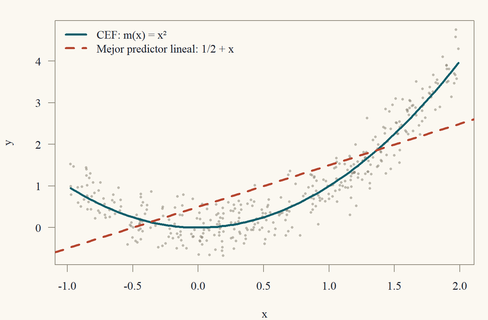

::: {.content-visible when-format="html"}
<a class="descarga-pdf" href="clase-02.pdf">Descargar esta clase en PDF</a>
:::

# Una pregunta ingenua

Antes de escribir un solo estimador conviene preguntarse: **¿qué queremos estimar?** La respuesta del pregrado suele ser "los $\beta$ del modelo $y = X\beta + u$". Pero esa respuesta esquiva la pregunta: ¿de dónde sale ese modelo?, ¿qué *es* $\beta$ si el mundo no es lineal?

Esta clase contesta eso. La idea central es que detrás de toda regresión hay un objeto poblacional bien definido, que existe aunque nadie haya escrito ningún modelo: la **función de esperanza condicional** (CEF, por su sigla en inglés[^cef]),
$$
m(x) = \mathbb{E}[y \mid x].
$$
Veremos que la CEF es el mejor predictor posible de $y$ dado $x$, que su mejor aproximación lineal tiene una fórmula cerrada, y que MCO (la Clase 3) no es más que la versión muestral de esa aproximación. Cuando terminemos, el "modelo" $y = x'\beta + u$ dejará de ser un supuesto misterioso y pasará a ser, en gran medida, una *definición*.

[^cef]: *Conditional Expectation Function*. Mantengo la sigla en inglés porque es la que vas a encontrar en todos los papers. Angrist y Pischke la popularizaron en *Mostly Harmless Econometrics*, un libro cuyo título es, en sí mismo, un chiste de econometristas.

# Esperanza condicional: definición y reglas

Para el pregrado basta con la definición "de libro de probabilidades". Si $(y,x)$ tiene densidad conjunta $f(y,x)$ y $f_x(x) > 0$, la **densidad condicional** es $f(y\mid x) = f(y,x)/f_x(x)$ y
$$
\mathbb{E}[y \mid x] = \int y\, f(y \mid x)\, dy.
$$
En el caso discreto se reemplaza la integral por una suma y la densidad por una probabilidad. Dos matices importantes:

1. $\mathbb{E}[y\mid x = x_0]$ es un **número**: el promedio de $y$ entre quienes tienen $x = x_0$.
2. $\mathbb{E}[y\mid x]$, sin fijar el valor, es la función $m$ evaluada en la variable aleatoria $x$, es decir, $m(x)$. Es una **variable aleatoria**.

Esta segunda lectura confunde a mucha gente la primera vez.[^confusion] Un ejemplo: si $y$ es el salario y $x$ son los años de educación, entonces $m(12)$ es el salario promedio de quienes tienen 12 años de educación (un número), mientras que $m(x)$ es "el salario promedio de alguien con tu educación", que cambia según a quién le preguntes (una variable aleatoria).

[^confusion]: A mí me confundió durante todo un semestre. Si te sirve de consuelo, Kolmogorov necesitó teoría de la medida para definirla bien, así que es razonable que tome un tiempo.

Todas las propiedades que usaremos se deducen de las siguientes reglas. Suponemos siempre que las esperanzas que aparecen existen.

::: {#thm-reglas-cef}
## Reglas de la esperanza condicional
Sean $y, w$ variables aleatorias, $x$ un vector aleatorio, $a,b$ constantes y $g$ una función.

1. **Linealidad:** $\mathbb{E}[ay + bw\mid x] = a\,\mathbb{E}[y\mid x] + b\,\mathbb{E}[w\mid x]$.
2. **Lo conocido sale:** $\mathbb{E}[g(x)\,y\mid x] = g(x)\,\mathbb{E}[y\mid x]$. En particular $\mathbb{E}[g(x)\mid x] = g(x)$.
3. **Independencia:** si $y$ es independiente de $x$, entonces $\mathbb{E}[y\mid x] = \mathbb{E}[y]$.
4. **Ley de esperanzas iteradas (LEI):** $\mathbb{E}\big[\mathbb{E}[y\mid x]\big] = \mathbb{E}[y]$.
:::

Las reglas 1–3 son intuitivas: condicional en $x$, cualquier función de $x$ "es una constante". Demostremos la cuarta, que es la más poderosa y la menos obvia.

::: {.callout-note title="Borrador"}
La LEI dice: si promedio los promedios condicionales, ponderando por lo común que es cada $x$, obtengo el promedio total. Es el principio de "el promedio nacional es el promedio ponderado de los promedios regionales". Para demostrarlo con densidades: escribo $\mathbb{E}[m(x)] = \int m(x) f_x(x)\,dx$, reemplazo $m(x)$ por su definición como integral, y la $f_x$ se cancela con la $f_x$ del denominador de la densidad condicional. Queda una integral doble de $y\,f(y,x)$, que es $\mathbb{E}[y]$. Hay que justificar el intercambio de integrales (Fubini), que vale si $\mathbb{E}|y| < \infty$.
:::

::: {.proof}
(Caso con densidad.) Sea $m(x) = \mathbb{E}[y\mid x] = \int y f(y\mid x)\,dy$. Entonces
$$
\begin{aligned}
\mathbb{E}[m(x)] &= \int m(x)\, f_x(x)\,dx &&\text{(definición de esperanza de una función de } x)\\
&= \int \Big(\int y\,\frac{f(y,x)}{f_x(x)}\,dy\Big) f_x(x)\,dx &&\text{(definición de } m)\\
&= \int\!\!\int y\, f(y,x)\,dy\,dx &&\text{(se cancela } f_x(x))\\
&= \int y \Big(\int f(y,x)\,dx\Big)\,dy &&\text{(Fubini, pues } \mathbb{E}|y|<\infty)\\
&= \int y\, f_y(y)\,dy = \mathbb{E}[y]. &&\text{(marginal de } y)
\end{aligned}
$$
:::

Una versión más general, que usaremos a menudo, es la **LEI anidada**: si $x_1$ es una parte del vector $x = (x_1, x_2)$, entonces
$$
\mathbb{E}\big[\,\mathbb{E}[y \mid x_1, x_2]\,\big|\, x_1\big] = \mathbb{E}[y\mid x_1].
$$
En palabras: "el conjunto de información más pequeño gana". Si primero promedio condicionando en mucha información y luego promedio sobre la parte que quiero olvidar, obtengo el promedio condicionando en poca información.[^tower] La demostración es la misma que arriba, pero condicionando todo en $x_1$.

[^tower]: En inglés se llama *tower property*. Me gusta pensarlo como una torre: puedes bajar pisos (olvidar información), pero no puedes saltarte la regla de que siempre termina en el piso más bajo.

# La descomposición de la CEF

Aquí está la primera sorpresa: **cualquier** variable $y$ puede escribirse como "CEF más error", y ese error tiene propiedades muy buenas *gratis*, sin supuesto alguno.

::: {#thm-descomposicion-cef}
## Descomposición de la CEF
Sea $\mathbb{E}|y|<\infty$ y definamos $e = y - m(x)$, con $m(x) = \mathbb{E}[y\mid x]$. Entonces
$$
y = m(x) + e,
$$
y el error $e$ satisface:

1. $\mathbb{E}[e\mid x] = 0$ (**independencia en media**).
2. $\mathbb{E}[e] = 0$.
3. Para toda función $h$ tal que $\mathbb{E}|h(x)e| < \infty$, $\mathbb{E}[h(x)\,e] = 0$. En particular, $e$ no está correlacionado con $x$ ni con ninguna función de $x$.
:::

::: {.callout-note title="Borrador"}
La primera propiedad es solo aplicar las reglas: $\mathbb{E}[e\mid x] = \mathbb{E}[y\mid x] - \mathbb{E}[m(x)\mid x] = m(x) - m(x)$. La segunda es la LEI aplicada a la primera. La tercera es el mismo patrón que se repite toda la clase: **cuando veas $\mathbb{E}[\text{algo}]$ con una función de $x$ adentro, condiciona en $x$ (LEI), saca lo conocido, y usa lo que sepas de la esperanza condicional.**
:::

::: {.proof}
(1) Por linealidad y porque $m(x)$ es función de $x$ (regla 2),
$$
\mathbb{E}[e\mid x] = \mathbb{E}[y\mid x] - \mathbb{E}[m(x)\mid x] = m(x) - m(x) = 0.
$$

(2) Por la LEI y (1), $\mathbb{E}[e] = \mathbb{E}\big[\mathbb{E}[e\mid x]\big] = \mathbb{E}[0] = 0$.

(3) Por la LEI, luego la regla 2 ("lo conocido sale") y luego (1),
$$
\mathbb{E}[h(x)e] = \mathbb{E}\big[\mathbb{E}[h(x)e\mid x]\big] = \mathbb{E}\big[h(x)\,\mathbb{E}[e\mid x]\big] = \mathbb{E}[h(x)\cdot 0] = 0.
$$
Tomando $h(x) = x_j$ obtenemos $\mathbb{E}[x_je] = 0$ y, como $\mathbb{E}[e]=0$, $\operatorname{Cov}(x_j,e) = \mathbb{E}[x_je] - \mathbb{E}[x_j]\mathbb{E}[e] = 0$.
:::

Detente un momento en lo que acabamos de probar. Nadie supuso que el error "no está correlacionado con los regresores". Lo *construimos* así. La "exogeneidad" $\mathbb{E}[e\mid x] = 0$ es automática **si el objeto de interés es la CEF**. Cuando en la Clase 10 hablemos de endogeneidad, el problema será que el objeto de interés *no* es la CEF (por ejemplo, un efecto causal), y entonces el error relevante ya no tiene esta propiedad.

::: {.callout-warning title="Jerarquía de supuestos sobre el error"}
Tres condiciones que a menudo se confunden, de la más fuerte a la más débil:
$$
\underbrace{e \perp\!\!\!\perp x}_{\text{independencia}} \;\Longrightarrow\; \underbrace{\mathbb{E}[e\mid x] = 0}_{\text{independencia en media}} \;\Longrightarrow\; \underbrace{\mathbb{E}[xe] = 0}_{\text{no correlación}}
$$
(la segunda implicación, suponiendo $\mathbb{E}[e]=0$ implícito en la media condicional cero). Ninguna flecha se puede invertir. Los contraejemplos están en el Ejercicio 2.4.
:::

# La CEF es el mejor predictor

Supongamos que alguien te da $x$ y te pide adivinar $y$. Puedes usar cualquier función $g(x)$. Si te castigan con el error cuadrático $(y - g(x))^2$, ¿qué función deberías usar?

::: {#thm-cef-mejor-predictor}
## La CEF minimiza el error cuadrático medio
Sea $\mathbb{E}[y^2] < \infty$. Para toda función $g$ con $\mathbb{E}[g(x)^2] < \infty$,
$$
\mathbb{E}\big[(y - g(x))^2\big] = \mathbb{E}\big[(y - m(x))^2\big] + \mathbb{E}\big[(m(x) - g(x))^2\big] \;\ge\; \mathbb{E}\big[(y - m(x))^2\big].
$$
Luego $m(x) = \mathbb{E}[y\mid x]$ es el mejor predictor de $y$ en error cuadrático medio, y es el único salvo en un conjunto de probabilidad cero.
:::

::: {.callout-note title="Borrador"}
El truco clásico: **sumar y restar** lo que quiero que aparezca. Escribo $y - g = (y - m) + (m - g)$, elevo al cuadrado, y aparecen dos cuadrados y un término cruzado $2(y - m)(m - g)$. Si el término cruzado tiene esperanza cero, gano. Y $y - m$ es justamente el $e$ de la descomposición, mientras que $m - g$ es una función de $x$. ¡Es el punto (3) del teorema anterior con $h = m - g$!
:::

::: {.proof}
Escribamos $e = y - m(x)$ y $h(x) = m(x) - g(x)$. Entonces $y - g(x) = e + h(x)$ y
$$
\mathbb{E}\big[(y - g(x))^2\big] = \mathbb{E}[e^2] + 2\,\mathbb{E}[h(x)e] + \mathbb{E}[h(x)^2].
$$
Todas las esperanzas son finitas (por la desigualdad $(a+b)^2\le 2a^2 + 2b^2$ y las hipótesis de segundo momento; $\mathbb{E}[m(x)^2] \le \mathbb{E}[y^2]$ por la desigualdad de Jensen condicional). Por @thm-descomposicion-cef (3), $\mathbb{E}[h(x)e] = 0$. Queda
$$
\mathbb{E}\big[(y - g(x))^2\big] = \mathbb{E}[e^2] + \mathbb{E}\big[(m(x) - g(x))^2\big].
$$
El segundo término es $\ge 0$ y vale cero solo si $g(x) = m(x)$ con probabilidad uno.
:::

Este teorema es la razón por la que nos interesa la CEF incluso si no nos interesa la causalidad: **si quieres predecir, la CEF es imbatible.** El término $\mathbb{E}[(y - m(x))^2] = \mathbb{E}[e^2]$ es el error irreducible: ni con infinitos datos puedes predecir mejor.

# La ley de la varianza total

La descomposición $y = m(x) + e$ también descompone la varianza.

::: {#thm-varianza-total}
## Ley de la varianza total
Si $\mathbb{E}[y^2] < \infty$,
$$
\operatorname{Var}(y) = \operatorname{Var}\big(\mathbb{E}[y\mid x]\big) + \mathbb{E}\big[\operatorname{Var}(y\mid x)\big],
$$
donde $\operatorname{Var}(y\mid x) = \mathbb{E}\big[(y - m(x))^2\mid x\big]$.
:::

::: {.proof}
Como $y = m(x) + e$,
$$
\operatorname{Var}(y) = \operatorname{Var}(m(x)) + \operatorname{Var}(e) + 2\operatorname{Cov}(m(x), e).
$$
Por @thm-descomposicion-cef, $\operatorname{Cov}(m(x),e) = \mathbb{E}[m(x)e] - \mathbb{E}[m(x)]\mathbb{E}[e] = 0 - 0 = 0$. Además, como $\mathbb{E}[e] = 0$,
$$
\operatorname{Var}(e) = \mathbb{E}[e^2] = \mathbb{E}\big[\mathbb{E}[e^2\mid x]\big] = \mathbb{E}\big[\mathbb{E}[(y - m(x))^2\mid x]\big] = \mathbb{E}[\operatorname{Var}(y\mid x)].
$$
Juntando las tres igualdades se obtiene el resultado.
:::

La varianza total = varianza **explicada** por $x$ + varianza **no explicada**. El cociente
$$
\frac{\operatorname{Var}(m(x))}{\operatorname{Var}(y)} \in [0,1]
$$
es el "$R^2$ poblacional" de la CEF: la fracción de la variabilidad de $y$ que es predecible con $x$. En la Clase 3 veremos su análogo muestral.

# El mejor predictor lineal

La CEF es maravillosa, pero tiene un problema práctico: puede ser cualquier función. Con $x$ continuo y multidimensional, estimarla sin estructura es difícil.[^curse] Así que nos preguntamos algo más modesto: **entre todas las funciones lineales $x'b$, ¿cuál predice mejor a $y$?**

[^curse]: Es la "maldición de la dimensionalidad". Con $k$ regresores continuos, el número de observaciones que necesitas para estimar $m(x)$ con una precisión dada crece exponencialmente en $k$. La econometría no paramétrica (Econometría 3) vive peleando con esa maldición.

::: {#def-blp}
## Mejor predictor lineal
Sea $x$ un vector $k\times 1$ (que típicamente incluye una constante). El **mejor predictor lineal** (o **proyección lineal**) de $y$ dado $x$ es $x'\beta$, donde
$$
\beta = \operatorname*{arg\,min}_{b\in\mathbb{R}^k} S(b), \qquad S(b) = \mathbb{E}\big[(y - x'b)^2\big].
$$
:::

::: {#thm-blp}
## Fórmula del mejor predictor lineal
Supongamos que $\mathbb{E}[y^2] < \infty$, $\mathbb{E}\|x\|^2<\infty$ y que $Q_{xx} = \mathbb{E}[xx']$ es definida positiva. Entonces el mejor predictor lineal existe, es único y
$$
\beta = \big(\mathbb{E}[xx']\big)^{-1}\mathbb{E}[xy].
$$
Además, el **error de proyección** $u = y - x'\beta$ satisface $\mathbb{E}[xu] = 0$.
:::

::: {.callout-note title="Borrador"}
Dos caminos. El de cálculo: expando $S(b) = \mathbb{E}[y^2] - 2b'\mathbb{E}[xy] + b'\mathbb{E}[xx']b$, derivo con las derivadas matriciales de la Clase 1 y obtengo $-2\mathbb{E}[xy] + 2\mathbb{E}[xx']b = 0$. Pero eso solo me da un punto crítico; tendría que argumentar que es un mínimo global.

El camino elegante (el mismo del Ejercicio 1.4): **completar el cuadrado**. Si llamo $\beta$ al candidato, escribo $y - x'b = (y - x'\beta) + x'(\beta - b)$, elevo al cuadrado, y el término cruzado muere justamente porque $\mathbb{E}[x(y - x'\beta)] = 0$, que es lo que define a $\beta$. Esto demuestra de un golpe existencia, unicidad y globalidad.
:::

::: {.proof}
Definamos $\beta = Q_{xx}^{-1}\mathbb{E}[xy]$, que existe porque $Q_{xx}\succ 0$ es invertible (Clase 1, propiedades de las matrices definidas positivas). Sea $u = y - x'\beta$. Primero,
$$
\mathbb{E}[xu] = \mathbb{E}[xy] - \mathbb{E}[xx']\beta = \mathbb{E}[xy] - Q_{xx}Q_{xx}^{-1}\mathbb{E}[xy] = 0.
$$
Ahora, para cualquier $b \in \mathbb{R}^k$, sumando y restando $x'\beta$,
$$
y - x'b = u + x'(\beta - b).
$$
Elevando al cuadrado y tomando esperanza,
$$
\begin{aligned}
S(b) &= \mathbb{E}[u^2] + 2(\beta - b)'\mathbb{E}[xu] + (\beta - b)'\mathbb{E}[xx'](\beta - b)\\
&= \mathbb{E}[u^2] + (\beta - b)'Q_{xx}(\beta - b) &&(\mathbb{E}[xu] = 0)\\
&= S(\beta) + (\beta - b)'Q_{xx}(\beta - b).
\end{aligned}
$$
Como $Q_{xx}\succ0$, el último término es $\ge0$ y es cero si y solo si $b = \beta$. Luego $\beta$ es el único minimizador global.
:::

Fíjate en que **$\mathbb{E}[xu] = 0$ no es un supuesto, es una propiedad de la definición de $\beta$.** Por construcción, el error de proyección no está correlacionado con los regresores. Si $x$ incluye una constante, además $\mathbb{E}[u] = 0$ (es la coordenada de la constante en $\mathbb{E}[xu] = 0$).

## El caso de un regresor

Con $x = (1, z)'$ la fórmula matricial se convierte en algo familiar. Escribiendo $\beta = (\alpha, \gamma)'$, las dos ecuaciones de $\mathbb{E}[xu] = 0$ son
$$
\mathbb{E}[y - \alpha - \gamma z] = 0, \qquad \mathbb{E}[z(y - \alpha - \gamma z)] = 0.
$$
De la primera, $\alpha = \mathbb{E}[y] - \gamma\mathbb{E}[z]$. Reemplazando en la segunda,
$$
\mathbb{E}[zy] - \mathbb{E}[z]\mathbb{E}[y] - \gamma\big(\mathbb{E}[z^2] - (\mathbb{E}z)^2\big) = 0
\quad\Longrightarrow\quad
\gamma = \frac{\operatorname{Cov}(z,y)}{\operatorname{Var}(z)}.
$$
La pendiente de la mejor recta es covarianza sobre varianza. Esta fórmula vale **siempre** (si $\operatorname{Var}(z) > 0$), sea cual sea la forma de la CEF.

# CEF versus proyección lineal

¿Qué relación hay entre $m(x)$ y $x'\beta$? Dos resultados lo dicen todo.

::: {#thm-cef-lineal}
## Si la CEF es lineal, coincide con la proyección
Si $m(x) = x'\beta^*$ para algún $\beta^*$ y $Q_{xx} \succ 0$, entonces $\beta^* = \beta$.
:::

::: {.proof}
Con $e = y - m(x) = y - x'\beta^*$, @thm-descomposicion-cef (3) con $h(x) = x$ da $\mathbb{E}[xe] = 0$, es decir, $\mathbb{E}[xy] = Q_{xx}\beta^*$. Luego $\beta^* = Q_{xx}^{-1}\mathbb{E}[xy] = \beta$.
:::

::: {#thm-blp-aprox-cef}
## La proyección lineal es la mejor aproximación lineal a la CEF
Bajo los supuestos de @thm-blp,
$$
\beta = \operatorname*{arg\,min}_{b}\;\mathbb{E}\big[(m(x) - x'b)^2\big].
$$
:::

::: {.proof}
Por @thm-cef-mejor-predictor aplicado con $g(x) = x'b$,
$$
\mathbb{E}[(y - x'b)^2] = \mathbb{E}[(y - m(x))^2] + \mathbb{E}[(m(x) - x'b)^2].
$$
El primer término no depende de $b$. Luego minimizar el lado izquierdo en $b$ (lo que define $\beta$) es lo mismo que minimizar el segundo término del lado derecho.
:::

Juntando todo: **la regresión lineal poblacional es la mejor aproximación lineal (en error cuadrático medio) a la CEF**, sea esta lineal o no. Si la CEF es lineal, son lo mismo. Si no lo es, $\beta$ sigue siendo un objeto bien definido e interpretable: el de la mejor recta.

::: {#exm-cuadratica}
## Una CEF no lineal
Sea $z\sim U(-1, 2)$, $y = z^2 + \varepsilon$ con $\varepsilon$ independiente de $z$ y $\mathbb{E}[\varepsilon] = 0$. La CEF es $m(z) = z^2$. Para la proyección lineal sobre $(1, z)$ necesitamos: $\mathbb{E}[z] = \tfrac12$, $\operatorname{Var}(z) = \tfrac{3^2}{12} = \tfrac34$, $\mathbb{E}[z^2] = \tfrac34 + \tfrac14 = 1$ y $\mathbb{E}[z^3] = \tfrac{2^4 - (-1)^4}{4\cdot 3} = \tfrac{5}{4}$. Entonces
$$
\gamma = \frac{\operatorname{Cov}(z, z^2)}{\operatorname{Var}(z)} = \frac{\mathbb{E}[z^3] - \mathbb{E}[z]\mathbb{E}[z^2]}{3/4} = \frac{5/4 - 1/2}{3/4} = 1, \qquad
\alpha = \mathbb{E}[y] - \gamma\mathbb{E}[z] = 1 - \tfrac12 = \tfrac12.
$$
La mejor recta es $\tfrac12 + z$, que se muestra en la figura junto con la CEF. La recta subestima la CEF en los extremos y la sobreestima en el centro, pero ningún otro par $(\alpha,\gamma)$ lo hace mejor en promedio cuadrático.
:::

{#fig-cef width=85%}

Un detalle que conviene notar: si en el ejemplo usáramos $z \sim U(-1,1)$ (simétrica), obtendríamos $\gamma = \operatorname{Cov}(z,z^2)/\operatorname{Var}(z) = \mathbb{E}[z^3]/\operatorname{Var}(z) = 0$. ¡Pendiente cero, aunque $y$ depende perfectamente de $z$! Correlación cero **no** significa "no hay relación"; significa "no hay relación *lineal*".[^cuadratica]

[^cuadratica]: Es el contraejemplo favorito de los profesores de estadística. Si alguna vez te preguntan en una prueba "¿correlación cero implica independencia?", dibuja una parábola y sal de la sala con aire triunfal.

# ★ Postgrado: la esperanza condicional como proyección

::: {.callout-important title="★ Postgrado"}
Aquí reinterpretamos todo lo anterior como geometría en un espacio de Hilbert. Esto unifica la CEF y la proyección lineal: ambas son proyecciones ortogonales, solo que sobre subespacios distintos.
:::

Sea $L^2$ el espacio de variables aleatorias con segundo momento finito, con producto interno $\langle a, b\rangle = \mathbb{E}[ab]$ y norma $\|a\|_{L^2} = \sqrt{\mathbb{E}[a^2]}$ (identificando variables iguales casi seguramente). Es un espacio de Hilbert: un espacio vectorial con producto interno y completo.[^hilbert]

[^hilbert]: La completitud de $L^2$ es el teorema de Riesz–Fischer. Sin ella el teorema de proyección de abajo fallaría: podrías tener una sucesión de "casi mejores" predictores que no converge a nada.

::: {#thm-proyeccion-hilbert}
## Teorema de proyección
Sea $\mathcal{S}$ un subespacio cerrado de un espacio de Hilbert $\mathcal{H}$ y $y\in\mathcal{H}$. Existe un único $\hat y \in \mathcal{S}$ tal que $\|y - \hat y\| = \min_{s\in\mathcal{S}}\|y - s\|$, y está caracterizado por la condición de ortogonalidad
$$
\langle y - \hat y, s\rangle = 0 \quad \text{para todo } s \in \mathcal{S}.
$$
:::

Ahora mira las dos piezas de esta clase con estos lentes:

| Objeto | Subespacio $\mathcal{S}$ | Condición de ortogonalidad |
|---|---|---|
| CEF $m(x)$ | $\{h(x) : \mathbb{E}[h(x)^2]<\infty\}$ (todas las funciones de $x$) | $\mathbb{E}[(y - m(x))h(x)] = 0\;\forall h$ |
| Proyección lineal $x'\beta$ | $\{x'b : b\in\mathbb{R}^k\}$ (funciones lineales de $x$) | $\mathbb{E}[(y - x'\beta)x] = 0$ |

La descomposición de la CEF (@thm-descomposicion-cef, punto 3) **es** la condición de ortogonalidad de la primera fila, y la condición $\mathbb{E}[xu]=0$ de @thm-blp **es** la de la segunda. @thm-cef-mejor-predictor y @thm-blp son el teorema de proyección en dos subespacios. Y @thm-blp-aprox-cef es un hecho geométrico general: como el subespacio lineal está contenido en el de todas las funciones, proyectar $y$ sobre el pequeño es lo mismo que proyectar primero sobre el grande y después sobre el pequeño (la "ley de proyecciones iteradas").

Esta mirada también da la **definición general** de esperanza condicional, que no necesita densidades: si $\mathcal{G}$ es una sub-$\sigma$-álgebra (la "información"), $\mathbb{E}[y\mid\mathcal{G}]$ es la proyección ortogonal de $y \in L^2$ sobre el subespacio cerrado de variables $\mathcal{G}$-medibles de $L^2$. (Para $y\in L^1$ se extiende por densidad, o se define vía el teorema de Radon–Nikodym.) La LEI anidada se vuelve la afirmación geométrica "si $\mathcal{S}_1\subseteq\mathcal{S}_2$, proyectar sobre $\mathcal{S}_2$ y luego sobre $\mathcal{S}_1$ es proyectar sobre $\mathcal{S}_1$".

La siguiente clase es, literalmente, esta misma tabla con una fila más: MCO es la proyección de $y\in\mathbb{R}^n$ sobre $\operatorname{col}(X)$, con el producto interno $\langle a, b\rangle = \frac1n\sum_i a_ib_i$, que es el análogo muestral de $\mathbb{E}[ab]$.

# Resumen

- La CEF $m(x) = \mathbb{E}[y\mid x]$ existe sin supuestos de modelo. Su error $e = y - m(x)$ cumple $\mathbb{E}[e\mid x]=0$ **por construcción** (@thm-descomposicion-cef).
- La herramienta universal: condicionar en $x$ con la LEI y sacar lo conocido.
- La CEF es el mejor predictor en error cuadrático medio (@thm-cef-mejor-predictor).
- $\operatorname{Var}(y) = \operatorname{Var}(\mathbb{E}[y\mid x]) + \mathbb{E}[\operatorname{Var}(y\mid x)]$ (@thm-varianza-total).
- El mejor predictor lineal es $\beta = \mathbb{E}[xx']^{-1}\mathbb{E}[xy]$ y su error cumple $\mathbb{E}[xu]=0$ por construcción (@thm-blp). Es la mejor aproximación lineal a la CEF (@thm-blp-aprox-cef).

# Ejercicios

**Ejercicio 2.1.** Sean $x \in\{0,1\}$ con $P(x = 1) = 0{,}4$, y $\mathbb{E}[y\mid x = 0] = 2$, $\mathbb{E}[y\mid x=1] = 5$. Calcula $\mathbb{E}[y]$ usando la LEI. Muestra que la CEF es lineal en $x$ y encuentra $\beta$ de la proyección de $y$ sobre $(1, x)$.

::: {.callout-tip collapse="true" title="Solución 2.1"}
$\mathbb{E}[y] = 0{,}6\cdot 2 + 0{,}4\cdot 5 = 3{,}2$. Con $x$ binaria, *toda* función de $x$ es lineal: $m(x) = 2 + 3x$ (vale en $x=0$ y $x = 1$). Por @thm-cef-lineal, $\beta = (2, 3)'$. Moraleja: con regresores binarios (o dummies que saturan todas las categorías), la regresión lineal **es** la CEF.
:::

**Ejercicio 2.2.** Demuestra que $\mathbb{E}[y\mid x] = \mathbb{E}[y]$ implica $\operatorname{Cov}(g(x), y) = 0$ para toda $g$ con segundo momento finito. ¿Implica independencia?

::: {.callout-tip collapse="true" title="Solución 2.2"}
$\mathbb{E}[g(x)y] = \mathbb{E}[g(x)\mathbb{E}[y\mid x]] = \mathbb{E}[g(x)]\,\mathbb{E}[y]$ (LEI y "lo conocido sale"), así que la covarianza es cero. No implica independencia: si $x \sim N(0,1)$ e $y = x\,\varepsilon$ con $\varepsilon$ independiente de $x$, $\mathbb{E}[\varepsilon]=0$, $\operatorname{Var}(\varepsilon) = 1$, entonces $\mathbb{E}[y\mid x] = x\,\mathbb{E}[\varepsilon] = 0$, pero $\operatorname{Var}(y\mid x) = x^2$ depende de $x$.
:::

**Ejercicio 2.3.** Demuestra que $\mathbb{E}[e^2] \le \mathbb{E}[u^2]$, donde $e$ es el error de la CEF y $u$ el de la proyección lineal. ¿Cuándo hay igualdad?

::: {.callout-tip collapse="true" title="Solución 2.3"}
Por @thm-cef-mejor-predictor con $g(x) = x'\beta$: $\mathbb{E}[u^2] = \mathbb{E}[e^2] + \mathbb{E}[(m(x) - x'\beta)^2] \ge \mathbb{E}[e^2]$. Hay igualdad si y solo si $m(x) = x'\beta$ casi seguramente, es decir, si la CEF es lineal.
:::

**Ejercicio 2.4.** Construye contraejemplos para las flechas inversas de la jerarquía: (a) $\mathbb{E}[e\mid x] = 0$ pero $e$ no independiente de $x$; (b) $\mathbb{E}[xe] = 0$ y $\mathbb{E}[e] = 0$, pero $\mathbb{E}[e\mid x]\neq 0$.

::: {.callout-tip collapse="true" title="Solución 2.4"}
(a) El del Ejercicio 2.2: $e = x\varepsilon$ (heterocedasticidad pura).

(b) $x \sim U(-1,1)$ y $e = x^2 - \tfrac13$. Entonces $\mathbb{E}[e] = \tfrac13 - \tfrac13 = 0$ y $\mathbb{E}[xe] = \mathbb{E}[x^3] - \tfrac13\mathbb{E}[x] = 0$ por simetría, pero $\mathbb{E}[e\mid x] = x^2 - \tfrac13 \ne 0$. Este es exactamente el error de proyección lineal cuando la CEF es cuadrática: no está correlacionado con $x$, pero su media condicional no es cero.
:::

**Ejercicio 2.5.** (Coeficiente de proyección con una constante.) Sea $x = (1, z')'$ con $z\in\mathbb{R}^{k-1}$. Demuestra que el coeficiente de $z$ en la proyección de $y$ sobre $x$ es $\gamma = \operatorname{Var}(z)^{-1}\operatorname{Cov}(z,y)$, y que el intercepto es $\alpha = \mathbb{E}[y] - \mathbb{E}[z]'\gamma$.

::: {.callout-tip collapse="true" title="Solución 2.5"}
Las ecuaciones $\mathbb{E}[xu] = 0$ con $u = y - \alpha - z'\gamma$ son $\mathbb{E}[u] = 0$ y $\mathbb{E}[zu] = 0$. La primera da $\alpha = \mathbb{E}y - \mathbb{E}[z]'\gamma$. Sustituyendo, $u = (y - \mathbb{E}y) - (z - \mathbb{E}z)'\gamma$, y como $\mathbb{E}[u] = 0$, la segunda ecuación equivale a $\mathbb{E}[(z - \mathbb{E}z)u] = 0$:
$$
\mathbb{E}[(z-\mathbb{E}z)(y - \mathbb{E}y)] - \mathbb{E}[(z - \mathbb{E}z)(z - \mathbb{E}z)']\gamma = 0 \;\Longrightarrow\; \operatorname{Cov}(z,y) = \operatorname{Var}(z)\gamma.
$$
$\operatorname{Var}(z)$ es invertible porque $Q_{xx}\succ0$ (si $c'\operatorname{Var}(z)c = 0$ con $c \ne 0$, entonces $c'z$ es constante casi seguramente y $x$ tendría una combinación lineal degenerada).
:::

**Ejercicio 2.6 ★.** (Ley de proyecciones iteradas.) Sea $x = (x_1', x_2')'$. Sea $\beta_1^{\text{corto}}$ el coeficiente de proyectar $y$ solo sobre $x_1$. Demuestra que es igual al coeficiente de proyectar $m(x) = \mathbb{E}[y\mid x]$ sobre $x_1$, y también al de proyectar la proyección lineal larga $x'\beta$ sobre $x_1$.

::: {.callout-tip collapse="true" title="Solución 2.6 ★"}
$\beta_1^{\text{corto}} = \mathbb{E}[x_1x_1']^{-1}\mathbb{E}[x_1y]$. Por la LEI, $\mathbb{E}[x_1y] = \mathbb{E}[x_1m(x)]$, así que el coeficiente de proyectar $m(x)$ sobre $x_1$ es el mismo. Además $y = x'\beta + u$ con $\mathbb{E}[xu] = 0$, en particular $\mathbb{E}[x_1u] = 0$, así que $\mathbb{E}[x_1y] = \mathbb{E}[x_1x'\beta]$, que es el numerador de proyectar $x'\beta$ sobre $x_1$. Geométricamente: $\operatorname{span}(x_1) \subseteq \operatorname{span}(x) \subseteq L^2(x)$, y proyectar en cadena sobre subespacios encajados equivale a proyectar directo sobre el más chico.
:::

**Ejercicio 2.7 ★.** Demuestra la desigualdad de Jensen condicional para $\varphi(t) = t^2$: $(\mathbb{E}[y\mid x])^2 \le \mathbb{E}[y^2\mid x]$. Deduce que $\mathbb{E}[m(x)^2] \le \mathbb{E}[y^2]$, que se usó en @thm-cef-mejor-predictor.

::: {.callout-tip collapse="true" title="Solución 2.7 ★"}
$0 \le \mathbb{E}[(y - m(x))^2\mid x] = \mathbb{E}[y^2\mid x] - 2m(x)\mathbb{E}[y\mid x] + m(x)^2 = \mathbb{E}[y^2\mid x] - m(x)^2$. Tomando esperanza (LEI): $\mathbb{E}[m(x)^2] \le \mathbb{E}[y^2]$.
:::
