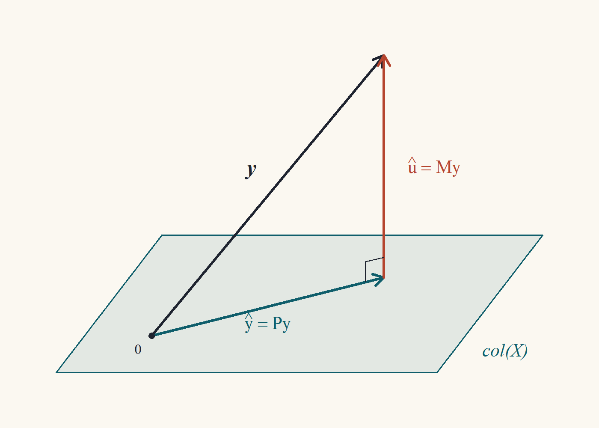

::: {.content-visible when-format="html"}
<a class="descarga-pdf" href="clase-03.pdf">Descargar esta clase en PDF</a>
:::

# De la población a la muestra

En la Clase 2 encontramos el mejor predictor lineal *poblacional*:
$$
\beta = \operatorname*{arg\,min}_{b}\;\mathbb{E}\big[(y - x'b)^2\big] = \big(\mathbb{E}[xx']\big)^{-1}\mathbb{E}[xy].
$$
El problema es que no conocemos la distribución de $(y,x)$, así que no podemos calcular esas esperanzas. Lo que sí tenemos es una muestra $\{(y_i, x_i)\}_{i=1}^n$. La idea más natural del mundo, llamada **principio de analogía**, es reemplazar cada esperanza poblacional por un promedio muestral:[^analogia]
$$
\mathbb{E}\big[(y - x'b)^2\big] \;\rightsquigarrow\; \frac1n\sum_{i=1}^n (y_i - x_i'b)^2.
$$
Minimizar esto último es lo que llamamos **mínimos cuadrados ordinarios** (MCO). Esta clase trata de lo que pasa en la muestra, con álgebra pura: todavía no hay probabilidades. Todo lo que probemos hoy es cierto para *cualquier* conjunto de números $y$ y $X$, sean datos reales, simulados o inventados en una servilleta.

[^analogia]: Goldberger lo llamaba *analogy principle*. Si no sabes qué hacer, haz en la muestra lo que harías en la población. Es sorprendente cuántas veces este consejo ingenuo produce estimadores óptimos.

# Derivación del estimador

Definimos la **suma de residuos al cuadrado** como función de un candidato $b \in\mathbb{R}^k$:
$$
S(b) = \sum_{i=1}^n (y_i - x_i'b)^2 = (y - Xb)'(y - Xb).
$$

::: {#def-mco}
## Estimador de MCO
El estimador de mínimos cuadrados ordinarios es $\hat\beta = \operatorname*{arg\,min}_{b\in\mathbb{R}^k} S(b)$. Definimos los **valores ajustados** $\hat y = X\hat\beta$ y los **residuos** $\hat u = y - X\hat\beta$.
:::

::: {#thm-mco}
## Fórmula de MCO
Si $\operatorname{rango}(X) = k$, entonces el minimizador de $S(b)$ existe, es único y
$$
\hat\beta = (X'X)^{-1}X'y.
$$ {#eq-mco}
Además, los residuos satisfacen las **ecuaciones normales**
$$
X'\hat u = 0.
$$ {#eq-normales}
:::

Voy a demostrar esto de dos maneras. La primera es la que todos aprenden (cálculo). La segunda es la que yo prefiero (álgebra), porque demuestra de golpe que el mínimo es global y único.

::: {.callout-note title="Borrador (vía cálculo)"}
Expando: $S(b) = y'y - b'X'y - y'Xb + b'X'Xb$. Como $y'Xb$ es un escalar, es igual a su transpuesta $b'X'y$. Así que $S(b) = y'y - 2b'X'y + b'X'Xb$. Con las derivadas matriciales de la Clase 1 ($\partial(a'b)/\partial b = a$ y $\partial(b'Ab)/\partial b = 2Ab$ para $A$ simétrica):
$$
\frac{\partial S}{\partial b} = -2X'y + 2X'Xb.
$$
Igualo a cero: $X'Xb = X'y$. Como $X'X$ es invertible (rango completo), $b = (X'X)^{-1}X'y$. La hessiana es $2X'X \succ 0$, así que $S$ es estrictamente convexa y el punto crítico es el mínimo global.

Esto está bien, pero apoyarse en "estrictamente convexa $\Rightarrow$ el punto crítico es mínimo global" es usar un teorema de análisis que no demostramos. Hay una ruta que no necesita nada: completar el cuadrado, como en la Clase 2.
:::

::: {.proof}
Sea $\hat\beta = (X'X)^{-1}X'y$, que existe porque $X'X$ es invertible (Clase 1: $\operatorname{rango}(X'X) = \operatorname{rango}(X) = k$). Sea $\hat u = y - X\hat\beta$. Primero verificamos las ecuaciones normales:
$$
X'\hat u = X'y - X'X(X'X)^{-1}X'y = X'y - X'y = 0.
$$
Ahora tomemos cualquier $b\in\mathbb{R}^k$. Sumando y restando $X\hat\beta$,
$$
y - Xb = \hat u + X(\hat\beta - b).
$$
Entonces
$$
\begin{aligned}
S(b) &= \big(\hat u + X(\hat\beta - b)\big)'\big(\hat u + X(\hat\beta - b)\big)\\
&= \hat u'\hat u + 2(\hat\beta - b)'X'\hat u + (\hat\beta - b)'X'X(\hat\beta - b)\\
&= S(\hat\beta) + (\hat\beta - b)'X'X(\hat\beta - b). &&(X'\hat u = 0)
\end{aligned}
$$ {#eq-completar-cuadrado}
Como $X'X \succ 0$ (Clase 1), el último término es $\ge 0$, con igualdad si y solo si $b = \hat\beta$. Luego $S(b) \ge S(\hat\beta)$ para todo $b$, con igualdad solo en $b = \hat\beta$.
:::

La identidad @eq-completar-cuadrado es la versión muestral exacta de la que usamos para el mejor predictor lineal en la Clase 2. **Misma demostración, distinto producto interno.** Esa repetición no es casualidad, y la sección ★ de la Clase 2 explica por qué.

::: {.callout-caution title="Qué dicen las ecuaciones normales"}
$X'\hat u = 0$ son $k$ ecuaciones: $\sum_i x_{ij}\hat u_i = 0$ para cada regresor $j$. Es decir, **los residuos no están correlacionados en la muestra con ningún regresor.** Es la versión muestral de $\mathbb{E}[xu] = 0$. Y, otra vez, no es un supuesto: es lo que *define* a $\hat\beta$.
:::

## El caso de regresión simple

Con $x_i = (1, z_i)'$, las dos ecuaciones normales son
$$
\sum_{i=1}^n (y_i - \hat\alpha - \hat\gamma z_i) = 0, \qquad \sum_{i=1}^n z_i(y_i - \hat\alpha - \hat\gamma z_i) = 0.
$$
Dividiendo la primera por $n$: $\hat\alpha = \bar y - \hat\gamma\bar z$. Sustituyendo en la segunda y usando que $\sum_i z_i(y_i - \bar y) = \sum_i (z_i - \bar z)(y_i - \bar y)$ (porque $\sum_i \bar z(y_i - \bar y) = 0$), y lo mismo para $z$,
$$
\hat\gamma = \frac{\sum_{i=1}^n (z_i - \bar z)(y_i - \bar y)}{\sum_{i=1}^n (z_i - \bar z)^2} = \frac{\widehat{\operatorname{Cov}}(z,y)}{\widehat{\operatorname{Var}}(z)}.
$$
Es la fórmula poblacional "covarianza sobre varianza" de la Clase 2, con momentos muestrales. El principio de analogía funciona.

# Geometría: proyección sobre el espacio columna

Sustituyendo @eq-mco en las definiciones,
$$
\hat y = X\hat\beta = X(X'X)^{-1}X'y = Py, \qquad \hat u = y - Py = My,
$$
donde $P$ y $M$ son las matrices de proyección y aniquiladora de la Clase 1. Todo lo que sabemos de ellas se traduce en hechos sobre MCO:

::: {#thm-geometria-mco}
## Geometría de MCO
Si $\operatorname{rango}(X) = k$:

1. $\hat y = Py \in \operatorname{col}(X)$ y $\hat u = My \perp \operatorname{col}(X)$.
2. $\hat y'\hat u = 0$: valores ajustados y residuos son ortogonales.
3. $y'y = \hat y'\hat y + \hat u'\hat u$.
4. $\hat u = Mu$ si $y = X\beta + u$ para algún $\beta$: los residuos son una transformación lineal de los errores.
:::

::: {.proof}
(1) $\hat y = X\hat\beta$ es una combinación lineal de las columnas de $X$. Para cualquier $Xc \in \operatorname{col}(X)$, $(Xc)'\hat u = c'X'\hat u = 0$ por las ecuaciones normales.

(2) Es (1) con $c = \hat\beta$.

(3) Es la identidad de Pitágoras de la Clase 1 con $z = y$: $y = Py + My$ y los sumandos son ortogonales.

(4) $\hat u = My = M(X\beta + u) = MX\beta + Mu = Mu$, porque $MX = 0$.
:::

{#fig-proyeccion width=70%}

La figura dice todo: $\hat y$ es el punto del plano $\operatorname{col}(X)$ más cercano a $y$, y la línea más corta de un punto a un plano es la perpendicular. **MCO es "bajar la perpendicular".** Nota que el dibujo vive en $\mathbb{R}^n$, el espacio de *observaciones* (cada eje es una persona), no en el diagrama de dispersión habitual donde cada eje es una variable. Acostumbrarse a pensar en este espacio es uno de los saltos conceptuales del curso.[^dimensiones]

[^dimensiones]: Si $n = 3.000$, el dibujo vive en $\mathbb{R}^{3000}$. Yo tampoco puedo imaginarme $\mathbb{R}^{3000}$. El truco, que usa todo el mundo, es imaginar $\mathbb{R}^3$ y decir "$n$" en voz alta con mucha seguridad.

El punto (4) merece una pausa: los residuos $\hat u$ no son los errores $u$. Son $Mu$, una versión "aplastada" de los errores donde se eliminó toda componente en $\operatorname{col}(X)$. Por eso $\hat u$ vive en un subespacio de dimensión $n - k$ y por eso, en la Clase 4, para estimar $\sigma^2$ dividiremos por $n-k$ y no por $n$.

# Bondad de ajuste: el $R^2$

Supongamos ahora que $X$ contiene una columna de unos. Entonces la primera ecuación normal dice $\iota'\hat u = \sum_i \hat u_i = 0$, y de ahí salen varias propiedades:

::: {#lem-con-constante}
## Consecuencias de incluir una constante
Si $\iota\in\operatorname{col}(X)$, entonces:

1. $\sum_i\hat u_i = 0$.
2. $\bar{\hat y} = \bar y$: el promedio de los ajustados es el promedio de $y$.
3. La recta (hiperplano) de regresión pasa por las medias: $\bar y = \bar x'\hat\beta$.
:::

::: {.proof}
(1) Como $\iota\in\operatorname{col}(X)$, por @thm-geometria-mco (1), $\iota'\hat u = 0$.
(2) $y = \hat y + \hat u$; promediando y usando (1), $\bar y = \bar{\hat y}$.
(3) $\bar{\hat y} = \frac1n\sum_i x_i'\hat\beta = \bar x'\hat\beta$ y se aplica (2).
:::

Definimos las tres sumas de cuadrados:
$$
\text{SCT} = \sum_i (y_i - \bar y)^2, \qquad \text{SCE} = \sum_i(\hat y_i - \bar y)^2, \qquad \text{SCR} = \sum_i\hat u_i^2,
$$
total, explicada y de residuos.[^siglas]

[^siglas]: Las siglas cambian de libro en libro y de idioma en idioma (SST/SSE/SSR, TSS/ESS/RSS...) y algunos libros intercambian qué significa la E y la R. Es una fuente inagotable de confusión en pruebas. Mira siempre la definición, nunca la sigla.

::: {#thm-descomposicion-sct}
## Descomposición de la suma de cuadrados
Si $\iota\in\operatorname{col}(X)$, entonces $\text{SCT} = \text{SCE} + \text{SCR}$.
:::

::: {.callout-note title="Borrador"}
En notación matricial, con $M^0$ la matriz que resta la media, $\text{SCT} = y'M^0y = \|M^0y\|^2$. Quiero descomponer $M^0 y$ en dos piezas ortogonales. Como $y = \hat y + \hat u$, tengo $M^0 y = M^0\hat y + M^0\hat u$. Pero $\hat u$ ya tiene media cero, así que $M^0\hat u = \hat u$. Entonces $M^0y = M^0\hat y + \hat u$, y solo tengo que ver que $M^0\hat y\perp\hat u$. $M^0\hat y = \hat y - \bar y\iota$, y tanto $\hat y$ como $\iota$ son ortogonales a $\hat u$. ¡Listo!
:::

::: {.proof}
Sea $M^0 = I - \frac1n\iota\iota'$. Por @lem-con-constante, $\iota'\hat u = 0$ y entonces $M^0\hat u = \hat u - \frac1n\iota(\iota'\hat u) = \hat u$. Luego
$$
M^0y = M^0\hat y + M^0\hat u = M^0\hat y + \hat u.
$$
Los dos sumandos son ortogonales: $(M^0\hat y)'\hat u = \hat y'\hat u - \bar{\hat y}\,\iota'\hat u = 0 - 0 = 0$, usando @thm-geometria-mco (2) y @lem-con-constante (1). Por Pitágoras,
$$
\text{SCT} = \|M^0y\|^2 = \|M^0\hat y\|^2 + \|\hat u\|^2 = \sum_i(\hat y_i - \bar{\hat y})^2 + \text{SCR} = \text{SCE} + \text{SCR},
$$
donde en el último paso usamos $\bar{\hat y} = \bar y$.
:::

::: {#def-r2}
## Coeficiente de determinación
Si $\iota\in\operatorname{col}(X)$ y $\text{SCT} > 0$,
$$
R^2 = \frac{\text{SCE}}{\text{SCT}} = 1 - \frac{\text{SCR}}{\text{SCT}}.
$$
:::

Por @thm-descomposicion-sct, $0 \le R^2 \le 1$. Es el análogo muestral del cociente $\operatorname{Var}(m(x))/\operatorname{Var}(y)$ de la Clase 2 (pero para la proyección *lineal*). Hay una interpretación más:

::: {#prp-r2-correlacion}
## $R^2$ es una correlación al cuadrado
Si $\iota\in\operatorname{col}(X)$, $R^2 = \widehat{\operatorname{Corr}}(y,\hat y)^2$.
:::

::: {.proof}
Usando $\bar{\hat y} = \bar y$, la covarianza muestral (sin dividir por $n$) entre $y$ y $\hat y$ es
$$
\sum_i (y_i - \bar y)(\hat y_i - \bar y) = \sum_i(\hat y_i - \bar y + \hat u_i)(\hat y_i - \bar y) = \text{SCE} + \sum_i\hat u_i(\hat y_i - \bar y) = \text{SCE},
$$
porque $\sum_i \hat u_i\hat y_i = 0$ y $\sum_i\hat u_i = 0$. Entonces
$$
\widehat{\operatorname{Corr}}(y,\hat y)^2 = \frac{\text{SCE}^2}{\text{SCT}\cdot\text{SCE}} = \frac{\text{SCE}}{\text{SCT}} = R^2.
$$
:::

## El $R^2$ nunca baja

::: {#thm-r2-monotono}
## Agregar regresores no reduce el $R^2$
Sean $X_1$ ($n\times k_1$) y $X = [X_1\;X_2]$ ($n\times k$), ambas con la constante. Sean $\text{SCR}_1$ y $\text{SCR}$ las sumas de residuos de regresar $y$ sobre $X_1$ y sobre $X$. Entonces $\text{SCR}\le\text{SCR}_1$, y por lo tanto $R^2\ge R_1^2$.
:::

::: {.proof}
$\text{SCR} = \min_{b\in\mathbb{R}^k}\|y - Xb\|^2$. El candidato particular $b = (\hat\beta_1', 0')'$, donde $\hat\beta_1$ es el MCO de la regresión corta, da $Xb = X_1\hat\beta_1$. Luego
$$
\text{SCR} = \min_b\|y - Xb\|^2 \le \|y - X_1\hat\beta_1\|^2 = \text{SCR}_1.
$$
Como $\text{SCT}$ no depende de los regresores, $R^2 = 1 - \text{SCR}/\text{SCT}\ge 1 - \text{SCR}_1/\text{SCT} = R_1^2$.
:::

La demostración es de una línea y la moraleja es importante: **el $R^2$ premia agregar basura.** Agrega a tu regresión de salarios el número de letras del apellido de cada persona y el $R^2$ subirá (o, con suerte, quedará igual).[^apellido] Por eso existe el $R^2$ ajustado,
$$
\bar R^2 = 1 - \frac{\text{SCR}/(n-k)}{\text{SCT}/(n-1)},
$$
que penaliza con los grados de libertad y puede bajar al agregar regresores. La razón de dividir por $n - k$ y $n-1$ se verá en la Clase 4 (son los divisores que hacen insesgadas a las varianzas estimadas).

[^apellido]: Esto no es un chiste: con $k = n$ regresores linealmente independientes, $\operatorname{col}(X) = \mathbb{R}^n$, $\hat y = y$ y $R^2 = 1$. Ajuste perfecto, poder predictivo nulo.

# El teorema de Frisch–Waugh–Lovell

Este es, para mí, el teorema más bonito del curso. Particionemos $X = [X_1\;X_2]$ con $X_1$ de $n\times k_1$ y $X_2$ de $n\times k_2$, y el vector de MCO correspondiente $\hat\beta = (\hat\beta_1', \hat\beta_2')'$. La pregunta: **¿qué es $\hat\beta_1$ por sí solo?** La respuesta de todo curso de pregrado es "el efecto de $X_1$ manteniendo $X_2$ constante". Pero ¿qué significa eso en una muestra donde nadie mantuvo nada constante? FWL da la respuesta precisa.

Sea $M_2 = I - X_2(X_2'X_2)^{-1}X_2'$ la aniquiladora de $X_2$. Recuerda que $M_2 z$ son los residuos de regresar $z$ sobre $X_2$: lo que queda de $z$ después de sacarle todo lo que $X_2$ puede explicar linealmente.

::: {#thm-fwl}
## Frisch–Waugh–Lovell
Si $X = [X_1\;X_2]$ tiene rango completo, entonces
$$
\hat\beta_1 = (X_1'M_2X_1)^{-1}X_1'M_2y = \big(\tilde X_1'\tilde X_1\big)^{-1}\tilde X_1'\tilde y,
$$
donde $\tilde X_1 = M_2X_1$ y $\tilde y = M_2y$. Es decir, $\hat\beta_1$ se obtiene en tres pasos:

1. Regresar $y$ sobre $X_2$ y guardar los residuos $\tilde y$.
2. Regresar cada columna de $X_1$ sobre $X_2$ y guardar los residuos $\tilde X_1$.
3. Regresar $\tilde y$ sobre $\tilde X_1$.

Además, los residuos de la regresión del paso 3 son idénticos a los residuos $\hat u$ de la regresión completa.
:::

En palabras: **el coeficiente de $X_1$ en la regresión larga es el coeficiente de una regresión simple entre las "versiones limpias" de $y$ y de $X_1$, ya purgadas de $X_2$.** Eso es lo que significa "controlar por $X_2$".

::: {.callout-note title="Borrador"}
La regresión larga dice $y = X_1\hat\beta_1 + X_2\hat\beta_2 + \hat u$. Quiero aislar $\hat\beta_1$; la molestia es $X_2\hat\beta_2$. ¿Cómo me deshago de algo que está en el espacio columna de $X_2$? ¡Con $M_2$, que lo aniquila! Multiplico todo por $M_2$:
$$
M_2y = M_2X_1\hat\beta_1 + \underbrace{M_2X_2}_{=0}\hat\beta_2 + M_2\hat u.
$$
¿Y qué es $M_2\hat u$? $\hat u$ es ortogonal a todo $\operatorname{col}(X)$, en particular a $\operatorname{col}(X_2)$, así que proyectarlo sobre $X_2$ da cero: $P_2\hat u = 0$ y $M_2\hat u = \hat u$. Queda $\tilde y = \tilde X_1\hat\beta_1 + \hat u$. Ahora multiplico por $\tilde X_1'$ y necesito que $\tilde X_1'\hat u = 0$. Pero $\tilde X_1'\hat u = X_1'M_2\hat u = X_1'\hat u = 0$ (ecuaciones normales). Se despeja $\hat\beta_1$. Solo me falta verificar que $\tilde X_1'\tilde X_1$ es invertible.
:::

::: {.proof}
Por definición de MCO y de los residuos,
$$
y = X_1\hat\beta_1 + X_2\hat\beta_2 + \hat u, \qquad X_1'\hat u = 0, \qquad X_2'\hat u = 0.
$$ {#eq-fwl-larga}

*Paso 1: $M_2\hat u = \hat u$.* Como $X_2'\hat u = 0$, $P_2\hat u = X_2(X_2'X_2)^{-1}X_2'\hat u = 0$, así que $M_2\hat u = \hat u - P_2\hat u = \hat u$.

*Paso 2: premultiplicar por $M_2$.* Como $M_2X_2 = 0$ (Clase 1), @eq-fwl-larga da
$$
M_2 y = M_2X_1\hat\beta_1 + \hat u.
$$ {#eq-fwl-paso2}

*Paso 3: premultiplicar por $X_1'$.* Usando $X_1'\hat u = 0$,
$$
X_1'M_2y = X_1'M_2X_1\hat\beta_1.
$$

*Paso 4: invertibilidad.* $X_1'M_2X_1 = (M_2X_1)'(M_2X_1)$ porque $M_2$ es simétrica e idempotente. Si $(M_2X_1)c = 0$ para algún $c$, entonces $X_1c = P_2X_1c = X_2d$ con $d = (X_2'X_2)^{-1}X_2'X_1c$, es decir, $X_1c - X_2d = 0$. Como $[X_1\;X_2]$ tiene rango completo, $c = 0$ (y $d = 0$). Luego $M_2X_1$ tiene rango columna completo y $X_1'M_2X_1$ es invertible (Clase 1). Despejando,
$$
\hat\beta_1 = (X_1'M_2X_1)^{-1}X_1'M_2y.
$$
Como $X_1'M_2X_1 = \tilde X_1'\tilde X_1$ y $X_1'M_2y = X_1'M_2M_2y = \tilde X_1'\tilde y$, esta es la fórmula de MCO de $\tilde y$ sobre $\tilde X_1$.

*Paso 5: residuos.* Por @eq-fwl-paso2, los residuos de la regresión del paso 3 son $\tilde y - \tilde X_1\hat\beta_1 = \hat u$.
:::

Compara con la Clase 1: allí, con la inversa particionada, vimos que el bloque $(1,1)$ de $(X'X)^{-1}$ es $(X_1'M_2X_1)^{-1}$. FWL lo "explica": es la matriz $(\tilde X_1'\tilde X_1)^{-1}$ de la regresión de los residuos. Esto será crucial en la Clase 4.

## Tres corolarios que usarás siempre

::: {#cor-fwl-demean}
## Incluir una constante es restar medias
En la regresión de $y$ sobre $[\,\iota\;\; Z\,]$, el coeficiente de $Z$ es el MCO de $(y - \bar y)$ sobre las columnas de $Z$ en desvíos respecto de sus medias.
:::

::: {.proof}
Aplica FWL con $X_2 = \iota$ y $X_1 = Z$. Como vimos en la Clase 1, $M_2 = M^0$, que resta la media.
:::

::: {#cor-fwl-simple}
## Coeficiente individual como regresión simple
En la regresión de $y$ sobre $[x_j\;\;X_{-j}]$ (donde $X_{-j}$ son los demás regresores, incluida la constante),
$$
\hat\beta_j = \frac{\sum_i \tilde x_{ij}\,y_i}{\sum_i\tilde x_{ij}^2},
$$
donde $\tilde x_{ij}$ son los residuos de regresar $x_j$ sobre $X_{-j}$.
:::

::: {.proof}
Por FWL con $X_1 = x_j$ (una columna), $\hat\beta_j = (\tilde x_j'\tilde x_j)^{-1}\tilde x_j'\tilde y$. Y $\tilde x_j'\tilde y = x_j'M_{-j}M_{-j}y = \tilde x_j'y$, porque $M_{-j}$ es simétrica e idempotente.
:::

Nota que **no hace falta purgar a $y$**: basta con purgar al regresor. Esto se usa en la Clase 4 para calcular la varianza de $\hat\beta_j$ y en la Clase 8 para entender la multicolinealidad.

::: {#cor-fwl-ortogonal}
## Regresores ortogonales
Si $X_1'X_2 = 0$, entonces $\hat\beta_1 = (X_1'X_1)^{-1}X_1'y$: el coeficiente de $X_1$ es el mismo en la regresión larga y en la corta (sin $X_2$).
:::

::: {.proof}
Si $X_2'X_1 = 0$, entonces $P_2X_1 = X_2(X_2'X_2)^{-1}X_2'X_1 = 0$ y $M_2X_1 = X_1$. FWL da $\hat\beta_1 = (X_1'X_1)^{-1}X_1'y$.
:::

Este último corolario es el germen del **sesgo por variable omitida** (Clase 8): omitir $X_2$ no cambia el coeficiente de $X_1$ *solo si* son ortogonales en la muestra. Si no lo son, omitir $X_2$ contamina $\hat\beta_1$.

# ★ Postgrado: leverage e influencia

::: {.callout-important title="★ Postgrado"}
¿Cuánto depende $\hat\beta$ de una sola observación? Para responderlo, estudiamos la diagonal de $P$ y una fórmula exacta para el cambio de $\hat\beta$ al borrar una observación.
:::

Los elementos diagonales de $P$ se llaman **leverages**:
$$
h_{ii} = P_{ii} = x_i'(X'X)^{-1}x_i.
$$
Por el Ejercicio 1.7, $0 \le h_{ii}\le 1$, y como $\operatorname{tr}(P) = k$, se tiene $\sum_i h_{ii} = k$: el leverage promedio es $k/n$. Además, $\hat y_i = \sum_j P_{ij}y_j$, así que $h_{ii}$ mide cuánto pesa $y_i$ en su propio valor ajustado. Una observación con $h_{ii}$ cerca de 1 "tira" de la regresión hacia sí misma.

::: {#lem-sherman-morrison}
## Sherman–Morrison
Si $A$ es invertible y $1 - v'A^{-1}v \neq 0$, entonces
$$
(A - vv')^{-1} = A^{-1} + \frac{A^{-1}vv'A^{-1}}{1 - v'A^{-1}v}.
$$
:::

::: {.proof}
Multiplicamos $(A - vv')$ por el lado derecho propuesto. Sea $c = v'A^{-1}v$ (un escalar):
$$
\begin{aligned}
(A - vv')\Big(A^{-1} + \frac{A^{-1}vv'A^{-1}}{1 - c}\Big)
&= I - vv'A^{-1} + \frac{vv'A^{-1} - v(v'A^{-1}v)v'A^{-1}}{1-c}\\
&= I - vv'A^{-1} + \frac{(1 - c)\,vv'A^{-1}}{1 - c} = I.
\end{aligned}
$$
:::

::: {#thm-influencia}
## Efecto de borrar una observación
Sea $\hat\beta_{(i)}$ el MCO calculado sin la observación $i$. Si $h_{ii} < 1$,
$$
\hat\beta - \hat\beta_{(i)} = \frac{(X'X)^{-1}x_i\,\hat u_i}{1 - h_{ii}}.
$$
:::

::: {.callout-note title="Borrador"}
Sin la observación $i$, las sumas $X'X = \sum_j x_jx_j'$ y $X'y = \sum_j x_jy_j$ pierden un término: $X_{(i)}'X_{(i)} = X'X - x_ix_i'$ y $X_{(i)}'y_{(i)} = X'y - x_iy_i$. ¡Es exactamente la forma de Sherman–Morrison con $v = x_i$! Y $v'A^{-1}v = x_i'(X'X)^{-1}x_i = h_{ii}$. Luego aplico SM, multiplico, y hay que ser ordenado con el álgebra: aparecerán $x_i'\hat\beta = \hat y_i$ y $y_i - \hat y_i = \hat u_i$.
:::

::: {.proof}
Sea $A = X'X$. Por la identidad "productos como sumas de observaciones" de la Clase 1, $X_{(i)}'X_{(i)} = A - x_ix_i'$ y $X_{(i)}'y_{(i)} = X'y - x_iy_i$. Por Sherman–Morrison con $v = x_i$ (y $v'A^{-1}v = h_{ii} \ne 1$),
$$
\hat\beta_{(i)} = \Big(A^{-1} + \frac{A^{-1}x_ix_i'A^{-1}}{1 - h_{ii}}\Big)(X'y - x_iy_i).
$$
Expandimos, usando $A^{-1}X'y = \hat\beta$, $x_i'\hat\beta = \hat y_i$ y $x_i'A^{-1}x_i = h_{ii}$:
$$
\begin{aligned}
\hat\beta_{(i)} &= \hat\beta - A^{-1}x_iy_i + \frac{A^{-1}x_i\hat y_i}{1 - h_{ii}} - \frac{A^{-1}x_i\,h_{ii}\,y_i}{1 - h_{ii}}\\
&= \hat\beta - \frac{A^{-1}x_i}{1-h_{ii}}\Big[(1 - h_{ii})y_i - \hat y_i + h_{ii}y_i\Big]\\
&= \hat\beta - \frac{A^{-1}x_i\,(y_i - \hat y_i)}{1 - h_{ii}} = \hat\beta - \frac{(X'X)^{-1}x_i\,\hat u_i}{1 - h_{ii}}.
\end{aligned}
$$
:::

La influencia de una observación es el producto de dos cosas: su residuo $\hat u_i$ (qué tan mal la ajusta la recta) y su leverage vía $1/(1 - h_{ii})$ (qué tan atípicos son sus regresores). Una observación con residuo chico y leverage alto puede ser igual de influyente que una con residuo grande. De aquí salen la distancia de Cook, los DFBETAS y, en la Clase 7, los estimadores de varianza robustos HC2 y HC3, que dividen $\hat u_i^2$ por $(1 - h_{ii})$ o $(1 - h_{ii})^2$.

Un corolario útil: el **error de predicción fuera de muestra** de la observación $i$ (usando $\hat\beta_{(i)}$) es
$$
y_i - x_i'\hat\beta_{(i)} = \hat u_i + \frac{x_i'(X'X)^{-1}x_i\,\hat u_i}{1 - h_{ii}} = \frac{\hat u_i}{1 - h_{ii}},
$$
lo que permite calcular la validación cruzada *leave-one-out* de una regresión lineal sin reestimar $n$ veces.

# Resumen

- $\hat\beta = (X'X)^{-1}X'y$ minimiza la suma de residuos al cuadrado; el mínimo es global y único por completación de cuadrados (@thm-mco).
- Las ecuaciones normales $X'\hat u = 0$ dicen que los residuos son ortogonales a los regresores.
- $\hat y = Py$, $\hat u = My = Mu$: MCO es una proyección ortogonal (@thm-geometria-mco).
- Con constante: $\text{SCT} = \text{SCE} + \text{SCR}$, $R^2\in[0,1]$, y $R^2$ no baja al agregar regresores.
- FWL: $\hat\beta_1$ es la regresión de $M_2y$ sobre $M_2X_1$ (@thm-fwl). "Controlar por $X_2$" = "purgar de $X_2$".

# Ejercicios

**Ejercicio 3.1.** Con los datos $z = (1,2,3,4)'$ e $y = (2,3,5,6)'$, calcula $\hat\alpha$ y $\hat\gamma$ de la regresión de $y$ sobre $(1, z)$, los residuos y el $R^2$. Verifica las ecuaciones normales.

::: {.callout-tip collapse="true" title="Solución 3.1"}
$\bar z = 2{,}5$, $\bar y = 4$. Desvíos: $z - \bar z = (-1{,}5; -0{,}5; 0{,}5; 1{,}5)$, $y - \bar y = (-2;-1;1;2)$. $\sum(z-\bar z)(y - \bar y) = 3 + 0{,}5 + 0{,}5 + 3 = 7$ y $\sum(z-\bar z)^2 = 5$. Así $\hat\gamma = 1{,}4$ y $\hat\alpha = 4 - 1{,}4\cdot2{,}5 = 0{,}5$. Ajustados: $(1{,}9;\,3{,}3;\,4{,}7;\,6{,}1)$. Residuos: $(0{,}1;\,-0{,}3;\,0{,}3;\,-0{,}1)$. Verificación: $\sum\hat u_i = 0$ y $\sum z_i\hat u_i = 0{,}1 - 0{,}6 + 0{,}9 - 0{,}4 = 0$. $\text{SCR} = 0{,}01 + 0{,}09 + 0{,}09 + 0{,}01 = 0{,}2$, $\text{SCT} = 10$, $R^2 = 0{,}98$.
:::

**Ejercicio 3.2.** Demuestra que si se multiplica un regresor $x_j$ por una constante $c \ne 0$, su coeficiente de MCO se divide por $c$ y los demás coeficientes, los ajustados y el $R^2$ no cambian. (Pista: $\tilde X = XD$ con $D$ diagonal invertible.)

::: {.callout-tip collapse="true" title="Solución 3.2"}
$\tilde\beta = (D'X'XD)^{-1}D'X'y = D^{-1}(X'X)^{-1}D'^{-1}D'X'y = D^{-1}\hat\beta$. Con $D = \operatorname{diag}(1,\dots,c,\dots,1)$, solo la coordenada $j$ se divide por $c$. $\tilde X\tilde\beta = XDD^{-1}\hat\beta = X\hat\beta$, así que ajustados, residuos y $R^2$ son iguales. Más en general: $\operatorname{col}(XD) = \operatorname{col}(X)$, y MCO solo depende del espacio columna.
:::

**Ejercicio 3.3.** Da un ejemplo en que, sin constante en la regresión, el "$R^2$" definido como $1 - \text{SCR}/\text{SCT}$ sea negativo.

::: {.callout-tip collapse="true" title="Solución 3.3"}
Tomemos $y = (3, 4, 5)'$ y un único regresor $x = (1, -1, 0)'$ sin constante. $\hat\beta = x'y/x'x = (3 - 4)/2 = -0{,}5$, $\hat y = (-0{,}5;\,0{,}5;\,0)$, $\hat u = (3{,}5;\,3{,}5;\,5)$, $\text{SCR} = 12{,}25 + 12{,}25 + 25 = 49{,}5$. $\text{SCT} = 1 + 0 + 1 = 2$. Así "$R^2$" $= 1 - 24{,}75 < 0$. La descomposición $\text{SCT} = \text{SCE}+\text{SCR}$ requiere la constante.
:::

**Ejercicio 3.4.** Usa FWL para demostrar que el coeficiente de una tendencia lineal $t = (1, 2,\dots,n)'$ en la regresión de $y$ sobre $(1, t, z)$ es el mismo que se obtiene al "destendenciar" $y$ y $z$ primero y luego regresar $y$ destendenciada sobre $z$ destendenciada... ¡Cuidado! ¿Qué coeficiente se obtiene así: el de $t$ o el de $z$?

::: {.callout-tip collapse="true" title="Solución 3.4"}
El enunciado tenía una trampa deliberada. Destendenciar significa aplicar $M_2$ con $X_2 = [\iota\;\; t]$, y FWL dice que regresar $M_2y$ sobre $M_2z$ da el coeficiente **de $z$** en la regresión larga (no el de $t$). Este es el resultado original de Frisch y Waugh (1933): da lo mismo destendenciar las series antes de regresar que incluir la tendencia como regresor.
:::

**Ejercicio 3.5.** Demuestra que la regresión de $\hat u$ (residuos de la regresión de $y$ sobre $X$) sobre $X$ tiene coeficientes cero y $R^2$ cero (si hay constante).

::: {.callout-tip collapse="true" title="Solución 3.5"}
Coeficientes: $(X'X)^{-1}X'\hat u = 0$ por las ecuaciones normales. Ajustados: $0$. Residuos: $\hat u$ mismo. $\text{SCR} = \hat u'\hat u = \text{SCT}$ (pues $\bar{\hat u} = 0$), así que $R^2 = 0$.
:::

**Ejercicio 3.6 ★.** Sea $X$ con constante. Demuestra que $h_{ii}\ge 1/n$ para todo $i$. (Pista: $P - \frac1n\iota\iota'$ es simétrica e idempotente, por el Ejercicio 1.6.)

::: {.callout-tip collapse="true" title="Solución 3.6 ★"}
Con $X_1 = \iota$, $P_1 = \frac1n\iota\iota'$, y por el Ejercicio 1.6, $P - P_1$ es simétrica e idempotente, luego semidefinida positiva (Ejercicio 1.7). Su diagonal es no negativa: $h_{ii} - \frac1n\ge0$.
:::

**Ejercicio 3.7 ★.** Demuestra que la suma de los errores de predicción *leave-one-out* al cuadrado es $\text{CV} = \sum_i\big(\hat u_i/(1 - h_{ii})\big)^2$. ¿Por qué CV es siempre mayor o igual que $\text{SCR}$?

::: {.callout-tip collapse="true" title="Solución 3.7 ★"}
La fórmula sale directo del corolario al final de la sección de influencia. Como $0\le h_{ii}<1$, $1/(1-h_{ii})^2\ge1$, así que cada término es $\ge\hat u_i^2$. Interpretación: los residuos dentro de muestra son "demasiado optimistas" porque cada observación ayudó a elegir la recta que la ajusta.
:::
