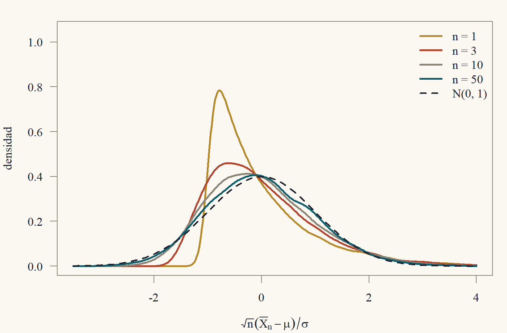

::: {.content-visible when-format="html"}
<a class="descarga-pdf" href="clase-06.pdf">Descargar esta clase en PDF</a>
:::

# ¿Por qué pensar en $n\to\infty$?

La Clase 5 obtuvo distribuciones exactas, pero a un precio alto: supusimos que los errores son normales. En la práctica, casi nunca lo son. Los salarios tienen colas largas, las ventas son asimétricas, las variables binarias ni siquiera son continuas. ¿Qué hacemos?

La respuesta de la econometría moderna es: **aproximar**. En lugar de preguntar "¿cuál es la distribución exacta de $\hat\beta$ con $n = 500$?", que no podemos responder sin conocer la distribución de los errores, preguntamos "¿a qué se parece la distribución de $\hat\beta$ cuando $n$ es grande?". La sorpresa, y es de las grandes sorpresas de la matemática,[^sorpresa] es que la respuesta **casi no depende** de la distribución de los errores. Siempre se parece a una normal.

[^sorpresa]: De verdad. Tómate un segundo para apreciar lo raro que es. Suma variables que siguen *cualquier* distribución (asimétrica, discreta, con forma de camello) y el resultado siempre tiende a la misma campana. Francis Galton decía que el TCL "habría sido personificado por los griegos y deificado, si lo hubieran conocido".

Esta clase construye las herramientas. La Clase 7 las aplica a MCO. Aviso: esta es la clase más "de análisis real" del curso, y es donde más se nota el estilo de demostraciones con $\varepsilon$.

# Convergencia en probabilidad

::: {#def-conv-prob}
## Convergencia en probabilidad
Una sucesión de variables aleatorias $\{Z_n\}$ **converge en probabilidad** a una constante $c$, y escribimos $Z_n\xrightarrow{p}c$ o $\operatorname{plim}Z_n = c$, si para todo $\varepsilon > 0$,
$$
\lim_{n\to\infty}P\big(|Z_n - c| > \varepsilon\big) = 0.
$$
Para vectores o matrices, se exige lo mismo para cada coordenada (equivalentemente, con la norma euclidiana). Un estimador $\hat\theta_n$ es **consistente** para $\theta$ si $\hat\theta_n\xrightarrow{p}\theta$.
:::

En palabras: para cualquier margen de error $\varepsilon$ que elijas, por pequeño que sea, la probabilidad de que $Z_n$ se aleje de $c$ más que $\varepsilon$ se hace despreciable cuando $n$ crece. Consistencia es el requisito mínimo de un estimador: con infinitos datos, debería acertar.

## Dos desigualdades

Para probar convergencia en probabilidad hay que acotar probabilidades de colas. La herramienta básica es sorprendentemente simple.

::: {#lem-markov}
## Desigualdad de Markov
Si $W\ge0$ y $a>0$, entonces $P(W\ge a)\le\dfrac{\mathbb{E}[W]}{a}$.
:::

::: {.callout-note title="Borrador"}
Si $W$ es no negativa y tiene media $\mathbb{E}W$, no puede ser "muy grande con mucha probabilidad", porque eso subiría la media. ¿Cómo lo formalizo? Comparo $W$ con una variable más chica cuya esperanza sea fácil: la función que vale $a$ cuando $W\ge a$ y $0$ si no. Es decir, $a\cdot\mathbb{1}\{W\ge a\}$. Siempre es $\le W$ (dibújalo), y su esperanza es $a\,P(W\ge a)$.
:::

::: {.proof}
Para todo resultado posible, $a\,\mathbb{1}\{W\ge a\}\le W$: si $W\ge a$, el lado izquierdo es $a\le W$; si $W<a$, el lado izquierdo es $0\le W$. Tomando esperanza (que preserva desigualdades),
$$
a\,P(W\ge a) = \mathbb{E}\big[a\,\mathbb{1}\{W\ge a\}\big]\le\mathbb{E}[W].
$$
Dividiendo por $a>0$ se obtiene el resultado.
:::

::: {#lem-chebyshev}
## Desigualdad de Chebyshev
Si $\mathbb{E}[Z^2]<\infty$ y $\varepsilon > 0$, entonces $P(|Z - c|>\varepsilon)\le\dfrac{\mathbb{E}[(Z - c)^2]}{\varepsilon^2}$ para toda constante $c$. En particular, $P(|Z - \mathbb{E}Z| > \varepsilon)\le\operatorname{Var}(Z)/\varepsilon^2$.
:::

::: {.proof}
$|Z - c|>\varepsilon$ implica $(Z - c)^2 \ge \varepsilon^2$. Por Markov con $W = (Z - c)^2$ y $a = \varepsilon^2$,
$$
P(|Z - c|>\varepsilon)\le P\big((Z-c)^2\ge\varepsilon^2\big)\le\frac{\mathbb{E}[(Z - c)^2]}{\varepsilon^2}.
$$
:::

## La ley de los grandes números

::: {#thm-lgn}
## Ley débil de los grandes números
Sean $Z_1, Z_2,\dots$ i.i.d. con $\mathbb{E}[Z_i] = \mu$ y $\operatorname{Var}(Z_i) = \sigma^2<\infty$. Entonces
$$
\bar Z_n = \frac1n\sum_{i=1}^nZ_i\xrightarrow{p}\mu.
$$
:::

::: {.proof}
Por linealidad, $\mathbb{E}[\bar Z_n] = \mu$. Por independencia (las covarianzas cruzadas son cero),
$$
\operatorname{Var}(\bar Z_n) = \frac{1}{n^2}\sum_{i=1}^n\operatorname{Var}(Z_i) = \frac{n\sigma^2}{n^2} = \frac{\sigma^2}{n}.
$$
Sea $\varepsilon>0$. Por Chebyshev,
$$
P(|\bar Z_n - \mu|>\varepsilon)\le\frac{\sigma^2}{n\varepsilon^2}\xrightarrow[n\to\infty]{}0.
$$
:::

La demostración es tan corta que parece trampa. La clave es que la varianza del promedio es $\sigma^2/n$: **promediar reduce la varianza al ritmo $1/n$**. El supuesto de varianza finita se puede debilitar: la LGN de Khinchine solo pide $\mathbb{E}|Z_i|<\infty$, pero su demostración requiere un argumento de truncamiento que omitimos.[^khinchine] También se pueden relajar "idénticamente distribuidas" e incluso "independientes": en la demostración solo usamos que la varianza del promedio tiende a cero.

[^khinchine]: Esa versión es la que realmente usa la econometría, porque en la Clase 7 querremos aplicar la LGN a $x_ix_i'u_i^2$, y pedirle segundo momento a eso sería pedir cuartos momentos de los datos. El truncamiento es una idea preciosa: se corta la variable en un nivel que crece con $n$ y se controla por separado el pedazo cortado.

La demostración anterior en realidad prueba algo más fuerte, que merece nombre propio.

::: {#thm-media-cuadratica}
## Convergencia en media cuadrática implica convergencia en probabilidad
Si $\mathbb{E}[(Z_n - c)^2]\to0$, entonces $Z_n\xrightarrow{p}c$. En particular, si $\mathbb{E}[Z_n]\to c$ y $\operatorname{Var}(Z_n)\to0$, entonces $Z_n\xrightarrow{p}c$.
:::

::: {.proof}
La primera afirmación es Chebyshev: $P(|Z_n - c|>\varepsilon)\le\mathbb{E}[(Z_n - c)^2]/\varepsilon^2\to0$. Para la segunda, $\mathbb{E}[(Z_n - c)^2] = \operatorname{Var}(Z_n) + (\mathbb{E}Z_n - c)^2\to0 + 0$.
:::

Esta es la herramienta más práctica para probar consistencia: **si un estimador es asintóticamente insesgado y su varianza tiende a cero, es consistente.**

## El teorema de la función continua

La LGN nos da la convergencia de promedios. Pero los estimadores no son promedios: $\hat\beta$ es una *inversa* de un promedio por otro promedio. Necesitamos saber que la convergencia se preserva al aplicar funciones.

::: {#thm-cmt-prob}
## Teorema de la función continua (en probabilidad)
Si $Z_n\xrightarrow{p}c$ (vectores en $\mathbb{R}^m$) y $g:\mathbb{R}^m\to\mathbb{R}^p$ es continua en $c$, entonces $g(Z_n)\xrightarrow{p}g(c)$.
:::

::: {.callout-note title="Borrador"}
Continuidad en $c$ dice: para cada $\varepsilon$ existe $\delta$ tal que "$\|z - c\|\le\delta\Rightarrow\|g(z) - g(c)\|\le\varepsilon$". Tomando contrapositiva: "$\|g(z) - g(c)\|>\varepsilon\Rightarrow\|z - c\|>\delta$". Es decir, **el evento malo para $g(Z_n)$ está contenido en un evento malo para $Z_n$**. Y la probabilidad del evento malo para $Z_n$ tiende a cero. ¡Es literalmente la definición de continuidad escrita en eventos!
:::

::: {.proof}
Sea $\varepsilon>0$. Por continuidad de $g$ en $c$, existe $\delta>0$ tal que $\|z - c\|\le\delta$ implica $\|g(z) - g(c)\|\le\varepsilon$. Por contrapositiva, $\|g(Z_n) - g(c)\|>\varepsilon$ implica $\|Z_n - c\|>\delta$, es decir,
$$
\big\{\|g(Z_n) - g(c)\|>\varepsilon\big\}\subseteq\big\{\|Z_n - c\|>\delta\big\}.
$$
Por monotonía de la probabilidad y porque $Z_n\xrightarrow{p}c$,
$$
P\big(\|g(Z_n) - g(c)\|>\varepsilon\big)\le P\big(\|Z_n - c\|>\delta\big)\xrightarrow[n\to\infty]{}0.
$$
:::

Consecuencias inmediatas: si $A_n\xrightarrow{p}A$ y $b_n\xrightarrow{p}b$, entonces $A_n + b_n\xrightarrow{p}A + b$, $A_nb_n\xrightarrow{p}Ab$ y, **si $A$ es invertible**, $A_n^{-1}\xrightarrow{p}A^{-1}$ (la inversión de matrices es continua en las matrices invertibles, porque las entradas de la inversa son cocientes de polinomios con denominador $\det A\ne0$). Esto es lo que hará funcionar la consistencia de MCO en la Clase 7.

# Convergencia en distribución

Consistencia dice que $\hat\theta_n$ se acerca a $\theta$. Pero para hacer inferencia necesitamos saber **cómo** se acerca: la forma de la distribución de $\hat\theta_n - \theta$, reescalada para que no colapse a cero.

::: {#def-conv-dist}
## Convergencia en distribución
$Z_n$ **converge en distribución** a $Z$, $Z_n\xrightarrow{d}Z$, si $\lim_{n\to\infty}P(Z_n\le z) = P(Z\le z)$ para todo $z$ en que la función de distribución $F_Z(z) = P(Z\le z)$ es continua. (Para vectores, con la desigualdad coordenada a coordenada.)
:::

La cláusula "donde $F_Z$ es continua" es un tecnicismo necesario: sin ella, $Z_n = 1/n$ no convergería en distribución a $Z = 0$, porque $P(Z_n\le0) = 0\not\to1 = P(Z\le0)$. En los casos que nos interesan, el límite es normal y su $F$ es continua en todas partes, así que la cláusula no molesta.

## El teorema central del límite

::: {#thm-tcl}
## Teorema central del límite (Lindeberg–Lévy)
Sean $Z_1, Z_2, \dots$ i.i.d. con $\mathbb{E}[Z_i] = \mu$ y $0 < \operatorname{Var}(Z_i) = \sigma^2<\infty$. Entonces
$$
\sqrt n\,(\bar Z_n - \mu)\xrightarrow{d}N(0,\sigma^2).
$$
**Versión multivariada:** si los $Z_i\in\mathbb{R}^m$ son i.i.d. con media $\mu$ y varianza $\Sigma$ finita, entonces $\sqrt n(\bar Z_n - \mu)\xrightarrow{d}N(0,\Sigma)$.
:::

{#fig-tcl width=85%}

La normalización $\sqrt n$ es la correcta: $\operatorname{Var}(\bar Z_n - \mu) = \sigma^2/n$, así que $\operatorname{Var}(\sqrt n(\bar Z_n - \mu)) = \sigma^2$, que ni explota ni colapsa. La LGN dice que $\bar Z_n - \mu$ tiende a cero; el TCL dice **a qué velocidad** ($1/\sqrt n$) y **con qué forma** (normal). La demostración está en la sección ★. La versión multivariada se deduce de la escalar con el siguiente truco.

::: {#thm-cramer-wold}
## Cramér–Wold
$Z_n\xrightarrow{d}Z$ en $\mathbb{R}^m$ si y solo si $a'Z_n\xrightarrow{d}a'Z$ para todo $a\in\mathbb{R}^m$.
:::

(Lo aceptamos sin demostración: requiere funciones características.) Con él, el TCL multivariado es inmediato: para $a$ fijo, los $a'Z_i$ son i.i.d. escalares con media $a'\mu$ y varianza $a'\Sigma a$, así que $a'\sqrt n(\bar Z_n - \mu)\xrightarrow{d}N(0, a'\Sigma a)$, que es la distribución de $a'W$ con $W\sim N(0,\Sigma)$.

## Slutsky y la función continua (en distribución)

::: {#thm-cmt-dist}
## Teorema de la función continua (en distribución)
Si $Z_n\xrightarrow{d}Z$ y $g$ es continua, entonces $g(Z_n)\xrightarrow{d}g(Z)$.
:::

::: {#thm-slutsky}
## Slutsky
Si $Z_n\xrightarrow{d}Z$ y $W_n\xrightarrow{p}c$ (constante), entonces:

1. $Z_n + W_n\xrightarrow{d}Z + c$;
2. $W_nZ_n\xrightarrow{d}cZ$;
3. $Z_n/W_n\xrightarrow{d}Z/c$ si $c\ne0$.

Lo mismo vale con vectores y matrices de dimensiones compatibles (por ejemplo, $W_n^{-1}Z_n\xrightarrow{d}C^{-1}Z$ si $W_n\xrightarrow{p}C$ invertible).
:::

Slutsky es el caballo de batalla de la econometría asintótica. Dice que **las piezas que convergen en probabilidad a constantes se pueden reemplazar por sus límites**. Demostramos la parte (1) en la sección ★ para ver cómo funcionan estos argumentos.

::: {#exm-t-asintotico}
## El estadístico $t$ sin normalidad
Sean $x_1,\dots,x_n$ i.i.d. con media $\mu$ y varianza $0<\sigma^2<\infty$, **sin suponer normalidad**. Sea $S^2 = \frac{1}{n-1}\sum_i(x_i - \bar x)^2$. Entonces
$$
T_n = \frac{\sqrt n(\bar x - \mu)}{S}\xrightarrow{d}N(0,1).
$$
*Demostración.* Por el TCL, $\sqrt n(\bar x - \mu)\xrightarrow{d}N(0,\sigma^2)$. Para el denominador, escribimos
$$
S^2 = \frac{n}{n-1}\Big(\frac1n\sum_ix_i^2 - \bar x^2\Big).
$$
Por la LGN (aplicada a $x_i^2$, que tiene media $\sigma^2 + \mu^2$; si solo suponemos segundos momentos finitos, se usa la LGN de Khinchine) y a $x_i$, $\frac1n\sum x_i^2\xrightarrow{p}\sigma^2 + \mu^2$ y $\bar x\xrightarrow{p}\mu$. Por el teorema de la función continua, $S^2\xrightarrow{p}1\cdot(\sigma^2 + \mu^2 - \mu^2) = \sigma^2$, y de nuevo por continuidad (la raíz), $S\xrightarrow{p}\sigma>0$. Por Slutsky (3), $T_n\xrightarrow{d}N(0,\sigma^2)/\sigma = N(0,1)$. $\square$

Moraleja: el test $t$ de la Clase 5 es **asintóticamente válido sin normalidad**. Con $n$ grande, usar cuantiles de la $t$ o de la $N(0,1)$ da prácticamente lo mismo, y ambos son correctos en el límite.
:::

# El método delta

A veces no nos interesa $\theta$ sino una función suya, $g(\theta)$: una elasticidad, un cociente de coeficientes, el punto máximo de una parábola. Si $\hat\theta_n$ es asintóticamente normal, ¿lo es $g(\hat\theta_n)$?

::: {#thm-delta}
## Método delta
Si $\sqrt n(\hat\theta_n - \theta)\xrightarrow{d}N(0,V)$ en $\mathbb{R}^m$ y $g:\mathbb{R}^m\to\mathbb{R}^p$ es continuamente diferenciable en un entorno de $\theta$, con jacobiano $G = \frac{\partial g}{\partial\theta'}(\theta)$ ($p\times m$), entonces
$$
\sqrt n\big(g(\hat\theta_n) - g(\theta)\big)\xrightarrow{d}N(0,\;GVG').
$$
:::

::: {.callout-note title="Borrador"}
Idea: linealizar. Cerca de $\theta$, $g(\hat\theta)\approx g(\theta) + G(\hat\theta - \theta)$. Multiplicando por $\sqrt n$: $\sqrt n(g(\hat\theta) - g(\theta))\approx G\sqrt n(\hat\theta - \theta)\to G\cdot N(0,V) = N(0, GVG')$.

Para hacerlo riguroso uso el teorema del valor medio (coordenada a coordenada, en el caso vectorial): $g(\hat\theta) - g(\theta) = G(\bar\theta)(\hat\theta - \theta)$ para algún $\bar\theta$ entre $\hat\theta$ y $\theta$. Necesito que $G(\bar\theta)\xrightarrow{p}G(\theta)$. Como $\bar\theta$ está "entre" $\hat\theta$ y $\theta$, y $\hat\theta\xrightarrow{p}\theta$, también $\bar\theta\xrightarrow{p}\theta$, y por continuidad del jacobiano, listo. Pero ¡ojo! ¿Sé que $\hat\theta\xrightarrow{p}\theta$? Solo me dieron la convergencia en distribución de $\sqrt n(\hat\theta - \theta)$. Necesito un lema: si $\sqrt n(\hat\theta - \theta)$ converge en distribución, entonces $\hat\theta - \theta = \frac{1}{\sqrt n}\cdot\sqrt n(\hat\theta - \theta)\xrightarrow{p}0$. Eso es Slutsky con $W_n = 1/\sqrt n\to0$.
:::

::: {.proof}
(Caso escalar, $m = p = 1$; el vectorial es análogo aplicando el valor medio a cada coordenada de $g$.) Sea $Z_n = \sqrt n(\hat\theta_n - \theta)\xrightarrow{d}Z\sim N(0,V)$.

*Paso 1: consistencia.* $\hat\theta_n - \theta = n^{-1/2}Z_n$. Como $n^{-1/2}\to0$ (una sucesión determinista que converge es, en particular, una sucesión que converge en probabilidad), Slutsky (2) da $\hat\theta_n - \theta\xrightarrow{d}0\cdot Z = 0$. La convergencia en distribución a una constante implica convergencia en probabilidad a ella (Ejercicio 6.5), así que $\hat\theta_n\xrightarrow{p}\theta$.

*Paso 2: valor medio.* Por el teorema del valor medio, existe $\bar\theta_n$ entre $\hat\theta_n$ y $\theta$ tal que $g(\hat\theta_n) - g(\theta) = g'(\bar\theta_n)(\hat\theta_n - \theta)$. Multiplicando por $\sqrt n$,
$$
\sqrt n\big(g(\hat\theta_n) - g(\theta)\big) = g'(\bar\theta_n)\,Z_n.
$$

*Paso 3: el jacobiano converge.* Como $|\bar\theta_n - \theta|\le|\hat\theta_n - \theta|$, el Paso 1 da $\bar\theta_n\xrightarrow{p}\theta$. Como $g'$ es continua en $\theta$, el teorema de la función continua da $g'(\bar\theta_n)\xrightarrow{p}g'(\theta) = G$.

*Paso 4: Slutsky.* Por Slutsky (2), $g'(\bar\theta_n)Z_n\xrightarrow{d}GZ\sim N(0, G^2V)$.
:::

::: {#exm-delta}
## Elasticidad en el punto medio
Si $\sqrt n(\hat\theta - \theta)\xrightarrow{d}N(0, V)$ con $\theta = (\beta_1,\beta_2)'$ y nos interesa $g(\theta) = \beta_1/\beta_2$ (con $\beta_2\ne0$), entonces $G = (1/\beta_2,\; -\beta_1/\beta_2^2)$ y la varianza asintótica de $\sqrt n(\hat\beta_1/\hat\beta_2 - \beta_1/\beta_2)$ es $GVG'$. En la práctica se reemplaza $\theta$ por $\hat\theta$ en $G$ y $V$ por un estimador consistente (Slutsky garantiza que eso no cambia el límite).
:::

# ★ Postgrado: notación $O_p$, Slutsky y el TCL demostrados

::: {.callout-important title="★ Postgrado"}
Introducimos la notación de órdenes estocásticos, demostramos una parte de Slutsky y damos una demostración completa del TCL vía funciones características (tomando el teorema de continuidad de Lévy como dado).
:::

## Órdenes estocásticos

::: {#def-op}
## $O_p$ y $o_p$
Sea $\{a_n\}$ una sucesión positiva. Escribimos

- $Z_n = o_p(a_n)$ si $Z_n/a_n\xrightarrow{p}0$;
- $Z_n = O_p(a_n)$ si $Z_n/a_n$ está **acotada en probabilidad**: para todo $\varepsilon>0$ existen $B<\infty$ y $N$ tales que $P(|Z_n/a_n|>B)<\varepsilon$ para todo $n\ge N$.
:::

Así, la LGN dice $\bar Z_n - \mu = o_p(1)$ y el TCL (vía el lema siguiente) dice $\bar Z_n - \mu = O_p(n^{-1/2})$: el error de estimación es "del orden de $1/\sqrt n$".

::: {#lem-dist-op}
## Convergencia en distribución implica $O_p(1)$
Si $Z_n\xrightarrow{d}Z$, entonces $Z_n = O_p(1)$.
:::

::: {.proof}
Sea $\varepsilon>0$. Como $F_Z(z)\to1$ cuando $z\to\infty$ y $F_Z(z)\to0$ cuando $z\to-\infty$, y $F_Z$ tiene a lo más una cantidad numerable de discontinuidades, podemos elegir $B>0$ tal que $\pm B$ son puntos de continuidad de $F_Z$ y $F_Z(-B) + 1 - F_Z(B)<\varepsilon/2$. Por convergencia en distribución, $P(Z_n\le -B) + 1 - P(Z_n\le B)\to F_Z(-B) + 1 - F_Z(B)$, así que para $n$ grande esa suma es $<\varepsilon$. Y $P(|Z_n|>B)\le P(Z_n\le-B) + P(Z_n>B)$, que es esa suma.
:::

Las reglas de cálculo son las que esperarías: $o_p(1) + o_p(1) = o_p(1)$, $O_p(1)\cdot o_p(1) = o_p(1)$, $O_p(1) + O_p(1) = O_p(1)$. Demostremos la segunda, que es la más usada: si $X_n = O_p(1)$ e $Y_n = o_p(1)$, dado $\varepsilon,\eta>0$ elige $B$ con $P(|X_n|>B)<\varepsilon/2$ para $n$ grande; entonces
$$
P(|X_nY_n|>\eta)\le P(|X_n|>B) + P(|Y_n|>\eta/B)<\varepsilon/2 + \varepsilon/2
$$
para $n$ grande, porque $\{|X_nY_n|>\eta\}\subseteq\{|X_n|>B\}\cup\{|Y_n|>\eta/B\}$.

## Una parte de Slutsky

::: {.proof}
**(de @thm-slutsky, parte 1, caso $c = 0$).** Sea $Z_n\xrightarrow{d}Z$ y $W_n\xrightarrow{p}0$. Sea $z$ un punto de continuidad de $F_Z$ y $\varepsilon>0$ tal que $z\pm\varepsilon$ también son puntos de continuidad (posible porque las discontinuidades son numerables). Como $\{Z_n + W_n\le z\}\subseteq\{Z_n\le z + \varepsilon\}\cup\{|W_n|>\varepsilon\}$,
$$
P(Z_n + W_n\le z)\le P(Z_n\le z + \varepsilon) + P(|W_n|>\varepsilon)\to F_Z(z + \varepsilon).
$$
Y como $\{Z_n\le z - \varepsilon\}\subseteq\{Z_n + W_n\le z\}\cup\{|W_n|>\varepsilon\}$,
$$
P(Z_n + W_n\le z)\ge P(Z_n\le z - \varepsilon) - P(|W_n|>\varepsilon)\to F_Z(z - \varepsilon).
$$
Luego $F_Z(z - \varepsilon)\le\liminf P(Z_n + W_n\le z)\le\limsup P(Z_n + W_n\le z)\le F_Z(z + \varepsilon)$. Haciendo $\varepsilon\downarrow0$ (por puntos de continuidad), la continuidad de $F_Z$ en $z$ da $\lim P(Z_n + W_n\le z) = F_Z(z)$. El caso $c\ne0$ se reduce a este escribiendo $Z_n + W_n = (Z_n + c) + (W_n - c)$ y notando que $Z_n + c\xrightarrow{d}Z + c$ trivialmente.
:::

## Demostración del TCL

Usaremos la **función característica** $\varphi_Z(t) = \mathbb{E}[e^{itZ}]$ y dos hechos que aceptamos:

- **(Lévy)** $Z_n\xrightarrow{d}Z$ si y solo si $\varphi_{Z_n}(t)\to\varphi_Z(t)$ para todo $t\in\mathbb{R}$.
- La función característica de la $N(0,1)$ es $e^{-t^2/2}$.

::: {#lem-producto}
## Diferencia de productos
Si $a_1,\dots,a_n,b_1,\dots,b_n$ son complejos con $|a_j|,|b_j|\le1$, entonces $\big|\prod_ja_j - \prod_jb_j\big|\le\sum_j|a_j - b_j|$.
:::

::: {.proof}
Por inducción en $n$. El caso $n = 1$ es trivial. Para el paso inductivo,
$$
\Big|\prod_{j=1}^na_j - \prod_{j=1}^nb_j\Big| \le |a_n|\,\Big|\prod_{j<n}a_j - \prod_{j<n}b_j\Big| + \Big|\prod_{j<n}b_j\Big|\,|a_n - b_n| \le \sum_{j<n}|a_j - b_j| + |a_n - b_n|,
$$
sumando y restando $a_n\prod_{j<n}b_j$ y usando $|a_n|\le1$, $|\prod_{j<n} b_j|\le1$ y la hipótesis inductiva.
:::

::: {.proof}
**(del TCL, caso escalar).** Sin pérdida de generalidad $\mu = 0$ y $\sigma^2 = 1$ (si no, se aplica a $(Z_i - \mu)/\sigma$). Sea $\varphi$ la función característica de $Z_1$ y $S_n = \sqrt n\bar Z_n = n^{-1/2}\sum_iZ_i$. Por independencia,
$$
\varphi_{S_n}(t) = \mathbb{E}\Big[\prod_{i=1}^ne^{itZ_i/\sqrt n}\Big] = \prod_{i=1}^n\mathbb{E}\big[e^{itZ_i/\sqrt n}\big] = \varphi(t/\sqrt n)^n.
$$
*Expansión de $\varphi$.* Para todo real $x$ se cumple $\big|e^{ix} - 1 - ix + \tfrac{x^2}{2}\big|\le\min\big(|x|^3/6,\; x^2\big)$ (resto de Taylor de orden 2 y de orden 3; ver Ejercicio 6.7). Tomando $x = sZ_1$ y esperanza, con $\mathbb{E}Z_1 = 0$ y $\mathbb{E}Z_1^2 = 1$,
$$
\Big|\varphi(s) - 1 + \frac{s^2}{2}\Big|\le\mathbb{E}\big[\min(|s|^3|Z_1|^3/6,\; s^2Z_1^2)\big] = s^2\,\mathbb{E}\big[\min(|s||Z_1|^3/6,\;Z_1^2)\big].
$$
El integrando está dominado por $Z_1^2$ (integrable) y tiende a cero cuando $s\to0$, así que, por convergencia dominada, $\varphi(s) = 1 - \frac{s^2}{2} + s^2\rho(s)$ con $\rho(s)\to0$ cuando $s\to0$.

*Comparación con el límite.* Fijemos $t$. Para $n$ grande, $1 - t^2/(2n)\in[0,1]$. Aplicamos @lem-producto con $a_j = \varphi(t/\sqrt n)$ y $b_j = 1 - \frac{t^2}{2n}$ (ambos de módulo $\le1$):
$$
\Big|\varphi(t/\sqrt n)^n - \Big(1 - \frac{t^2}{2n}\Big)^n\Big|\le n\,\Big|\varphi(t/\sqrt n) - 1 + \frac{t^2}{2n}\Big| = n\cdot\frac{t^2}{n}\,|\rho(t/\sqrt n)| = t^2|\rho(t/\sqrt n)|\to0.
$$
Finalmente, $\big(1 - \frac{t^2}{2n}\big)^n\to e^{-t^2/2}$ (el límite clásico $(1 + x/n)^n\to e^x$). Luego $\varphi_{S_n}(t)\to e^{-t^2/2}$ para todo $t$ y, por Lévy, $S_n\xrightarrow{d}N(0,1)$.
:::

Nota dónde se usó cada supuesto: la independencia para factorizar $\varphi_{S_n}$, la distribución idéntica para que todos los factores sean iguales, y el **segundo momento finito** para la expansión de Taylor. Sin segundo momento el TCL falla: la media de $n$ variables Cauchy i.i.d. vuelve a ser Cauchy, para todo $n$.[^cauchy]

[^cauchy]: La Cauchy es el villano favorito de los cursos de probabilidad: no tiene media, así que promediar no ayuda en absoluto. Promediar un millón de observaciones Cauchy da exactamente la misma precisión que una sola. Por suerte, en econometría casi nunca aparece... excepto como cociente de dos normales, que es justamente lo que aparece en el Ejercicio 10.6 con instrumentos irrelevantes.

# Resumen

- $Z_n\xrightarrow{p}c$: la probabilidad de alejarse de $c$ tiende a cero. Se prueba con Chebyshev (@lem-chebyshev) o con "sesgo y varianza tienden a cero" (@thm-media-cuadratica).
- LGN: $\bar Z_n\xrightarrow{p}\mu$ (@thm-lgn). TCL: $\sqrt n(\bar Z_n - \mu)\xrightarrow{d}N(0,\sigma^2)$ (@thm-tcl).
- Función continua: la convergencia se preserva por funciones continuas (@thm-cmt-prob, @thm-cmt-dist).
- Slutsky: se pueden reemplazar las piezas que convergen en probabilidad por sus límites (@thm-slutsky).
- Método delta: $\sqrt n(g(\hat\theta) - g(\theta))\xrightarrow{d}N(0, GVG')$ (@thm-delta).

# Ejercicios

**Ejercicio 6.1.** Sea $Z_n$ igual a $n$ con probabilidad $1/n$ y a $0$ con probabilidad $1 - 1/n$. Demuestra que $Z_n\xrightarrow{p}0$ pero $\mathbb{E}[Z_n]\not\to0$. ¿Qué dice esto sobre consistencia versus insesgamiento asintótico?

::: {.callout-tip collapse="true" title="Solución 6.1"}
Para $\varepsilon\in(0,1)$ y $n > \varepsilon$: $P(|Z_n|>\varepsilon) = P(Z_n = n) = 1/n\to0$. Pero $\mathbb{E}[Z_n] = n\cdot\frac1n = 1$ para todo $n$. Un estimador puede ser consistente y no ser asintóticamente insesgado: la convergencia en probabilidad ignora eventos raros, aunque sean enormes; la esperanza no.
:::

**Ejercicio 6.2.** Sean $x_i$ i.i.d. con $\mathbb{E}[x_i] = \mu\ne0$ y varianza finita. Encuentra la distribución asintótica de $\sqrt n(\bar x^2 - \mu^2)$ y de $\sqrt n(1/\bar x - 1/\mu)$.

::: {.callout-tip collapse="true" title="Solución 6.2"}
Método delta con $\sqrt n(\bar x - \mu)\xrightarrow{d}N(0,\sigma^2)$. Con $g(t) = t^2$, $g'(\mu) = 2\mu$: $N(0, 4\mu^2\sigma^2)$. Con $g(t) = 1/t$, $g'(\mu) = -1/\mu^2$: $N(0,\sigma^2/\mu^4)$.
:::

**Ejercicio 6.3.** ¿Qué pasa con el método delta para $g(t) = t^2$ si $\mu = 0$? Demuestra que en ese caso $n\bar x^2/\sigma^2\xrightarrow{d}\chi^2_1$.

::: {.callout-tip collapse="true" title="Solución 6.3"}
$G = 2\mu = 0$ y el método delta da la distribución degenerada $N(0,0)$: $\sqrt n\bar x^2\xrightarrow{p}0$. La escala $\sqrt n$ es incorrecta. Con la escala $n$: $n\bar x^2/\sigma^2 = (\sqrt n\bar x/\sigma)^2$, y como $\sqrt n\bar x/\sigma\xrightarrow{d}N(0,1)$, por el teorema de la función continua (con $g(t) = t^2$) converge a $\chi^2_1$. Moraleja: cuando el jacobiano es cero, hace falta un "método delta de segundo orden".
:::

**Ejercicio 6.4.** Sean $x_i$ i.i.d. Bernoulli($p$) con $0<p<1$. Construye un intervalo de confianza asintótico al 95 % para $p$ y justifica cada paso con los teoremas de esta clase.

::: {.callout-tip collapse="true" title="Solución 6.4"}
$\hat p = \bar x$. TCL: $\sqrt n(\hat p - p)\xrightarrow{d}N(0, p(1-p))$. LGN + función continua: $\hat p(1 - \hat p)\xrightarrow{p}p(1-p)>0$. Slutsky: $\sqrt n(\hat p - p)/\sqrt{\hat p(1-\hat p)}\xrightarrow{d}N(0,1)$. Luego $P\big(|\hat p - p|\le1{,}96\sqrt{\hat p(1-\hat p)/n}\big)\to0{,}95$, y el intervalo es $\hat p\pm1{,}96\sqrt{\hat p(1-\hat p)/n}$.
:::

**Ejercicio 6.5.** Demuestra que si $Z_n\xrightarrow{d}c$ (una constante), entonces $Z_n\xrightarrow{p}c$.

::: {.callout-tip collapse="true" title="Solución 6.5"}
La distribución de la constante $c$ es $F(z) = \mathbb{1}\{z\ge c\}$, continua en todo $z\ne c$. Para $\varepsilon>0$, $c - \varepsilon$ y $c + \varepsilon/2$ son puntos de continuidad, así que
$P(|Z_n - c|>\varepsilon)\le P(Z_n\le c - \varepsilon) + 1 - P(Z_n\le c + \varepsilon/2)\to F(c - \varepsilon) + 1 - F(c + \varepsilon/2) = 0 + 1 - 1 = 0$.
:::

**Ejercicio 6.6 ★.** Demuestra que $O_p(1) + o_p(1) = O_p(1)$ y que si $Z_n = O_p(n^{-1/2})$ entonces $Z_n = o_p(1)$.

::: {.callout-tip collapse="true" title="Solución 6.6 ★"}
Si $X_n = O_p(1)$, $Y_n = o_p(1)$: dado $\varepsilon$, elige $B$ con $P(|X_n|>B)<\varepsilon/2$ para $n$ grande; como $P(|Y_n|>1)<\varepsilon/2$ para $n$ grande, $P(|X_n + Y_n|>B + 1)<\varepsilon$. Para la segunda: $Z_n = n^{-1/2}\cdot(\sqrt nZ_n)$ con $\sqrt nZ_n = O_p(1)$ y $n^{-1/2} = o(1)$; por la regla $O_p(1)o_p(1) = o_p(1)$, $Z_n = o_p(1)$.
:::

**Ejercicio 6.7 ★.** Demuestra que $|e^{ix} - 1 - ix + x^2/2|\le\min(|x|^3/6, x^2)$ para todo $x$ real.

::: {.callout-tip collapse="true" title="Solución 6.7 ★"}
Integrando por partes se obtiene la identidad $e^{ix} = \sum_{m=0}^{k}\frac{(ix)^m}{m!} + \frac{i^{k+1}}{k!}\int_0^x(x - s)^ke^{is}ds$. Con $k = 2$, el resto está acotado por $\frac{1}{2}\big|\int_0^x(x-s)^2ds\big| = |x|^3/6$. Con $k = 1$, el resto de orden 1 es $R_1 = i^2\int_0^x(x - s)e^{is}ds$ y, como $\int_0^x(x-s)\,ds = x^2/2$, se puede escribir $e^{ix} - 1 - ix + x^2/2 = -\int_0^x(x - s)(e^{is} - 1)\,ds$, cuyo módulo es $\le\big|\int_0^x|x - s|\cdot2\,ds\big| = x^2$.
:::
