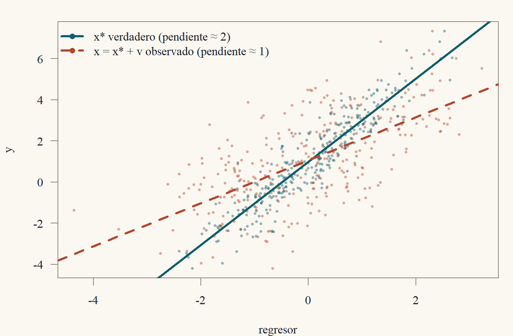

::: {.content-visible when-format="html"}
<a class="descarga-pdf" href="clase-08.pdf">Descargar esta clase en PDF</a>
:::

# El modelo que estimas no es el que querías

Hasta ahora supusimos que sabíamos qué regresores poner. En la vida real, la lista de regresores es una decisión, y se puede equivocar de cuatro formas:

1. **Omitir** una variable que importa.
2. **Incluir** una variable que no importa.
3. Incluir variables que están **muy correlacionadas** entre sí.
4. Medir mal una variable.

Esta clase estudia qué le pasa a MCO en cada caso. Spoiler: (1) y (4) producen **sesgo**, que no desaparece con más datos; (2) y (3) producen **varianza**, que sí desaparece con más datos. Casi todo el arte de la econometría aplicada consiste en preocuparse más de lo primero que de lo segundo.[^arte]

[^arte]: Una vez un colega me dijo: "la varianza es un problema de muestra; el sesgo es un problema de ideas". Con más datos resuelves el primero. Con más datos, el segundo solo te da más confianza en la respuesta equivocada.

Usaremos la partición $X = [X_1\;\;X_2]$ con $X_1$ de $n\times k_1$ (las variables que nos interesan) y $X_2$ de $n\times k_2$, y la notación $M_2 = I - X_2(X_2'X_2)^{-1}X_2'$ de la Clase 3.

# Omitir variables relevantes

Supongamos que el modelo verdadero es
$$
y = X_1\beta_1 + X_2\beta_2 + u, \qquad \mathbb{E}[u\mid X] = 0,
$$
(es decir, RL1–RL3 con los dos bloques) pero el investigador regresa $y$ solo sobre $X_1$ y obtiene el estimador "corto"
$$
\tilde\beta_1 = (X_1'X_1)^{-1}X_1'y.
$$

::: {#thm-ovb}
## Sesgo por variable omitida
Bajo RL1–RL3 para el modelo largo y $\operatorname{rango}(X_1) = k_1$,
$$
\mathbb{E}[\tilde\beta_1\mid X] = \beta_1 + \underbrace{(X_1'X_1)^{-1}X_1'X_2}_{=\,\hat\Pi}\;\beta_2,
$$
donde $\hat\Pi$ ($k_1\times k_2$) es la matriz de coeficientes de MCO de regresar cada columna de $X_2$ sobre $X_1$.
:::

::: {.proof}
Sustituyendo el modelo verdadero,
$$
\tilde\beta_1 = (X_1'X_1)^{-1}X_1'(X_1\beta_1 + X_2\beta_2 + u) = \beta_1 + (X_1'X_1)^{-1}X_1'X_2\beta_2 + (X_1'X_1)^{-1}X_1'u.
$$
Tomando esperanza condicional en $X$ (que incluye a $X_1$ y $X_2$), el último término tiene esperanza cero por RL3, y los dos primeros son funciones de $X$.
:::

El sesgo es $\hat\Pi\beta_2$: el **producto** de dos cosas:

- $\beta_2$: cuánto afecta la variable omitida a $y$.
- $\hat\Pi$: cuánto se relaciona la variable omitida con las incluidas.

El sesgo desaparece solo si una de las dos es cero: o la variable omitida no importa ($\beta_2 = 0$), o no está correlacionada en la muestra con las incluidas ($X_1'X_2 = 0$, el caso del corolario de regresores ortogonales de la Clase 3).

## El caso de un regresor

Con un regresor de interés $x$, una constante y una variable omitida $w$, el modelo verdadero es $y = \alpha + \beta x + \gamma w + u$ y el sesgo del coeficiente de la regresión corta es
$$
\mathbb{E}[\tilde\beta\mid X] - \beta = \gamma\,\hat\delta, \qquad \hat\delta = \frac{\sum_i(x_i - \bar x)(w_i - \bar w)}{\sum_i(x_i - \bar x)^2},
$$
donde $\hat\delta$ es la pendiente de regresar $w$ sobre $x$. Su signo sigue una tabla que vale la pena memorizar:

| | $\operatorname{Corr}(x,w)>0$ | $\operatorname{Corr}(x,w)<0$ |
|---|---|---|
| $\gamma > 0$ | sesgo **positivo** | sesgo **negativo** |
| $\gamma < 0$ | sesgo **negativo** | sesgo **positivo** |

::: {#exm-habilidad}
## El retorno a la educación y la habilidad
En $\log(\text{salario}) = \alpha + \beta\,\text{educ} + \gamma\,\text{habilidad} + u$, la habilidad no se observa. Es razonable pensar que $\gamma>0$ (la habilidad sube el salario) y que habilidad y educación están positivamente correlacionadas (a quien le va bien estudiando, estudia más). La tabla dice: **el MCO corto sobreestima el retorno a la educación**. Parte de lo que atribuimos a la educación es en realidad habilidad. Esta es probablemente la discusión más famosa de la economía laboral, y la motivación de la Clase 10.[^card]
:::

[^card]: Lo curioso es que cuando se usan variables instrumentales (Clase 10), las estimaciones del retorno a la educación suelen salir *mayores* que las de MCO, no menores. Card (1999) discute por qué. Resulta que el sesgo por habilidad no es el único en juego: también hay error de medida en la educación, que sesga hacia abajo (lo vemos más adelante en esta clase).

## Versión asintótica

Con muestreo i.i.d. (Clase 7), el sesgo no desaparece con $n$. Si $y_i = x_{1i}'\beta_1 + x_{2i}'\beta_2 + u_i$ con $\mathbb{E}[x_iu_i] = 0$, entonces
$$
\tilde\beta_1\xrightarrow{p}\beta_1 + \mathbb{E}[x_{1i}x_{1i}']^{-1}\mathbb{E}[x_{1i}x_{2i}']\,\beta_2 = \beta_1 + \Pi\beta_2,
$$
por la LGN y la función continua aplicadas a $\tilde\beta_1 = \beta_1 + \hat Q_{11}^{-1}\hat Q_{12}\beta_2 + \hat Q_{11}^{-1}\frac1n\sum_i x_{1i}u_i$. El estimador corto es **inconsistente** para $\beta_1$: converge, con toda seguridad, al número equivocado. (Lo que sí estima consistentemente es el coeficiente de la proyección *corta*, que es un objeto distinto; ver el Ejercicio 2.6.)

# Incluir variables irrelevantes

Ahora el caso opuesto: el modelo verdadero es $y = X_1\beta_1 + u$ (es decir, $\beta_2 = 0$), pero el investigador incluye $X_2$ de todos modos. El estimador largo $\hat\beta_1$ (el bloque de $X_1$ en la regresión sobre $[X_1\;X_2]$) sigue siendo insesgado: el modelo largo es correcto, solo que con $\beta_2 = 0$. ¿Cuál es el costo? La varianza.

::: {#thm-irrelevantes}
## El precio de las variables irrelevantes
Supongamos RL1–RL4 para el modelo largo con $\beta_2 = 0$, y $X = [X_1\;X_2]$ de rango completo. Sean $\tilde\beta_1$ (corto) y $\hat\beta_1$ (largo). Ambos son insesgados y
$$
\operatorname{Var}(\hat\beta_1\mid X) = \sigma^2(X_1'M_2X_1)^{-1}\;\succeq\;\sigma^2(X_1'X_1)^{-1} = \operatorname{Var}(\tilde\beta_1\mid X).
$$
:::

::: {.callout-note title="Borrador"}
El insesgamiento del corto sale de @thm-ovb con $\beta_2 = 0$. La varianza del largo sale de FWL (Clase 3): $\hat\beta_1$ es MCO de $M_2y$ sobre $M_2X_1$, con matriz $(X_1'M_2X_1)^{-1}$. (También es el bloque $(1,1)$ de $(X'X)^{-1}$ por la inversa particionada de la Clase 1.) Para comparar varianzas necesito comparar las **inversas** de $X_1'M_2X_1$ y $X_1'X_1$. Primero comparo las matrices sin invertir: $X_1'X_1 - X_1'M_2X_1 = X_1'P_2X_1\succeq0$. Y luego uso el resultado ★ de la Clase 1: "si $A\succeq B\succ0$ entonces $B^{-1}\succeq A^{-1}$".
:::

::: {.proof}
*Insesgamiento.* El corto es insesgado por @thm-ovb con $\beta_2 = 0$; el largo, por la Clase 4.

*Varianza del corto.* Con $\beta_2 = 0$, $\tilde\beta_1 = \beta_1 + (X_1'X_1)^{-1}X_1'u$, y por RL4, $\operatorname{Var}(\tilde\beta_1\mid X) = \sigma^2(X_1'X_1)^{-1}$.

*Varianza del largo.* Por FWL, $\hat\beta_1 = (X_1'M_2X_1)^{-1}X_1'M_2y$. Como $M_2X_2 = 0$ y $\beta_2 = 0$, $M_2y = M_2X_1\beta_1 + M_2u$, así que $\hat\beta_1 = \beta_1 + (X_1'M_2X_1)^{-1}X_1'M_2u$ y
$$
\operatorname{Var}(\hat\beta_1\mid X) = (X_1'M_2X_1)^{-1}X_1'M_2(\sigma^2I)M_2X_1(X_1'M_2X_1)^{-1} = \sigma^2(X_1'M_2X_1)^{-1},
$$
usando $M_2M_2 = M_2$.

*Comparación.* Sean $A = X_1'X_1$ y $B = X_1'M_2X_1$. Como $I = P_2 + M_2$,
$$
A - B = X_1'P_2X_1 = (P_2X_1)'(P_2X_1)\succeq0.
$$
Además $B\succ0$ (en la demostración de FWL vimos que $M_2X_1$ tiene rango columna completo). Luego $A\succeq B\succ0$ y, por el orden de las inversas (Clase 1, sección ★), $B^{-1}\succeq A^{-1}$. Multiplicando por $\sigma^2>0$ se obtiene el resultado.
:::

La diferencia es cero si y solo si $P_2X_1 = 0$, es decir, si $X_1$ y $X_2$ son ortogonales. **Incluir una variable irrelevante cuesta varianza en la medida en que esté correlacionada con las relevantes.** Si no lo está, es gratis (salvo un grado de libertad en $s^2$).

## El dilema sesgo–varianza

Juntando @thm-ovb y @thm-irrelevantes: si dudas de si incluir $X_2$,

- Si la incluyes y era irrelevante: pagas varianza.
- Si la omites y era relevante: pagas sesgo.

Con una sola variable de interés, el error cuadrático medio del estimador corto es $\text{ECM}(\tilde\beta_1) = \operatorname{Var}(\tilde\beta_1) + (\text{sesgo})^2$, y puede ser menor que el del largo si $\beta_2$ es chico. Pero como el sesgo no desaparece con $n$ y la varianza sí, **en muestras grandes siempre gana incluir**. Esto justifica la regla práctica de ser generoso con los controles, con una excepción importante: los **malos controles**, variables que son ellas mismas resultado del regresor de interés (Ejercicio 8.5).

# Multicolinealidad

La multicolinealidad es el caso en que los regresores están muy correlacionados entre sí. Hay que distinguir dos versiones.

**Perfecta:** una columna de $X$ es combinación lineal exacta de otras. Entonces $\operatorname{rango}(X)<k$, $X'X$ no es invertible (Clase 1) y MCO no está definido. Los coeficientes no están **identificados**: hay infinitos $b$ que dan el mismo $Xb$. La solución es eliminar la redundancia.

**Imperfecta:** las columnas son "casi" dependientes. MCO está definido y sigue siendo insesgado y MELI. El problema es solo de precisión. La fórmula de la Clase 4 lo dice todo:
$$
\operatorname{Var}(\hat\beta_j\mid X) = \frac{\sigma^2}{\text{SCT}_j(1 - R_j^2)} = \frac{\sigma^2}{\text{SCT}_j}\cdot\underbrace{\frac{1}{1 - R_j^2}}_{\text{VIF}_j}.
$$
El **factor de inflación de varianza** $\text{VIF}_j$ mide cuánto se multiplica la varianza de $\hat\beta_j$ respecto del caso en que $x_j$ no estuviera correlacionado con los demás regresores. Con $R_j^2 = 0{,}9$, $\text{VIF} = 10$; con $R_j^2 = 0{,}99$, $\text{VIF} = 100$ y los errores estándar se multiplican por $10$.

::: {.callout-warning title="La multicolinealidad no es una violación de supuestos"}
Es tentador tratar la multicolinealidad como una "enfermedad" que hay que curar. No lo es. Todos los teoremas de las Clases 4, 5 y 7 siguen valiendo; los errores estándar grandes son **correctos**: reflejan que los datos no traen suficiente información para separar los efectos de $x_j$ y de los regresores con que se mueve. Goldberger se burlaba de esta confusión llamándola "micronumerosidad": el problema es tener pocos datos (o datos con poca variación independiente), y a nadie se le ocurre hacer tests para detectar la micronumerosidad.[^goldberger] Las "soluciones" como eliminar un regresor correlacionado cambian la pregunta y, por @thm-ovb, introducen sesgo.
:::

[^goldberger]: El capítulo 23 de *A Course in Econometrics* de Goldberger (1991) es una parodia perfecta: toma cada frase de los libros sobre multicolinealidad y la reescribe cambiando "multicolinealidad" por "micronumerosidad". "Los síntomas de la micronumerosidad incluyen errores estándar grandes..." Si tienes acceso al libro, léelo. Son dos páginas.

Un detalle interesante: la multicolinealidad afecta a los coeficientes individuales, pero **no** necesariamente a combinaciones de ellos. Si $x_2$ y $x_3$ son casi idénticos, $\hat\beta_2$ y $\hat\beta_3$ son muy imprecisos, pero $\hat\beta_2 + \hat\beta_3$ puede estimarse con gran precisión (la covarianza entre $\hat\beta_2$ y $\hat\beta_3$ es muy negativa). Los datos saben el efecto conjunto; lo que no saben es cómo repartirlo.

# Error de medida

## En la variable dependiente

Si observamos $y = y^* + v$ en lugar de $y^*$, con $v$ un error de medida con media cero no correlacionado con $x$, entonces $y = x'\beta + (u + v)$. El error compuesto $u + v$ sigue cumpliendo $\mathbb{E}[x(u + v)] = 0$, así que MCO sigue siendo consistente. El único costo es más varianza ($\operatorname{Var}(u + v)>\operatorname{Var}(u)$ si $u$ y $v$ no están correlacionados). **El error de medida en $y$ es inocuo (salvo por precisión).**

## En un regresor: el sesgo de atenuación

El caso interesante es cuando el regresor está mal medido. Consideremos el modelo con un regresor:
$$
y_i = \alpha + \beta x_i^* + u_i,
$$
pero no observamos $x_i^*$ sino $x_i = x_i^* + v_i$, donde $v_i$ es el error de medida.

::: {.callout-caution title="Supuestos del error de medida clásico"}
$(x_i^*, u_i, v_i)$ i.i.d., con $\mathbb{E}[u_i] = \mathbb{E}[v_i] = 0$, $\operatorname{Var}(x_i^*) = \sigma_*^2>0$, $\operatorname{Var}(v_i) = \sigma_v^2$, y $u_i$, $v_i$, $x_i^*$ mutuamente no correlacionados.
:::

::: {#thm-atenuacion}
## Sesgo de atenuación
Bajo los supuestos anteriores, la pendiente de MCO de $y$ sobre $(1, x)$ satisface
$$
\hat\beta\xrightarrow{p}\lambda\beta, \qquad \lambda = \frac{\sigma_*^2}{\sigma_*^2 + \sigma_v^2}\in(0, 1].
$$
:::

::: {.callout-note title="Borrador"}
Sustituyo $x^* = x - v$ en el modelo: $y = \alpha + \beta x + (u - \beta v)$. El nuevo "error" es $u - \beta v$, y ahí está el problema: $v$ está dentro de $x$ **y** dentro del error. Así que el regresor está correlacionado con el error: $\operatorname{Cov}(x, u - \beta v) = \operatorname{Cov}(x^* + v, u - \beta v) = -\beta\sigma_v^2$.

Para el límite, uso que la pendiente converge a $\operatorname{Cov}(x,y)/\operatorname{Var}(x)$ (la pendiente de la proyección lineal, Clases 2 y 7). $\operatorname{Cov}(x,y) = \operatorname{Cov}(x^* + v, \alpha + \beta x^* + u) = \beta\sigma_*^2$ y $\operatorname{Var}(x) = \sigma_*^2 + \sigma_v^2$.
:::

::: {.proof}
La pendiente de MCO es $\hat\beta = \widehat{\operatorname{Cov}}(x,y)/\widehat{\operatorname{Var}}(x)$ (Clase 3). Por la LGN y la función continua (como en la Clase 7), $\hat\beta\xrightarrow{p}\operatorname{Cov}(x_i,y_i)/\operatorname{Var}(x_i)$, siempre que $\operatorname{Var}(x_i)>0$. Calculamos, usando bilinealidad de la covarianza y los supuestos de no correlación:
$$
\operatorname{Cov}(x_i,y_i) = \operatorname{Cov}(x_i^* + v_i,\;\alpha + \beta x_i^* + u_i) = \beta\operatorname{Var}(x_i^*) + \operatorname{Cov}(x_i^*,u_i) + \beta\operatorname{Cov}(v_i,x_i^*) + \operatorname{Cov}(v_i,u_i) = \beta\sigma_*^2,
$$
$$
\operatorname{Var}(x_i) = \operatorname{Var}(x_i^*) + \operatorname{Var}(v_i) + 2\operatorname{Cov}(x_i^*,v_i) = \sigma_*^2 + \sigma_v^2.
$$
Luego $\hat\beta\xrightarrow{p}\beta\sigma_*^2/(\sigma_*^2 + \sigma_v^2) = \lambda\beta$.
:::

{#fig-atenuacion width=85%}

El factor $\lambda$ es la **razón señal-ruido** (o *fiabilidad*) de $x$: la fracción de la varianza de $x$ que es señal. Como $0<\lambda\le1$, el estimador está sesgado **hacia cero**: tiene el signo correcto, pero es más chico en valor absoluto. Por eso se llama sesgo de *atenuación*. La intuición visual de la figura: el ruido esparce los puntos horizontalmente, y una nube más ancha con la misma variación vertical tiene una pendiente más plana.

Un comentario sobre el contraste con el error en $y$: el error de medida es inocuo en $y$ y dañino en $x$ porque MCO trata asimétricamente a $y$ y a $x$. Minimiza distancias **verticales**; el ruido vertical se promedia, el horizontal no.

# ★ Postgrado: atenuación con varios regresores y el test RESET

::: {.callout-important title="★ Postgrado"}
Con varios regresores, el error de medida en uno contamina a todos. Además, presentamos el test RESET de forma funcional como un test de Wald.
:::

## Error de medida en regresión múltiple

Supongamos $y_i = \beta x_i^* + w_i'\gamma + u_i$, con $w_i$ (que incluye la constante) bien medido y $x_i = x_i^* + v_i$ con error de medida clásico ($v_i$ no correlacionado con $x_i^*$, $w_i$, $u_i$). Por FWL, el coeficiente de $x$ en la regresión de $y$ sobre $(x, w)$ converge a $\operatorname{Cov}(\tilde x_i, y_i)/\operatorname{Var}(\tilde x_i)$, donde $\tilde x_i$ es el residuo de la proyección lineal de $x_i$ sobre $w_i$. Sea $\tilde x_i^*$ el residuo de proyectar $x_i^*$ sobre $w_i$. Como $v_i$ no está correlacionado con $w_i$, la proyección de $x_i = x_i^* + v_i$ sobre $w_i$ es la de $x_i^*$, y $\tilde x_i = \tilde x_i^* + v_i$. Entonces
$$
\hat\beta\xrightarrow{p}\beta\,\frac{\operatorname{Var}(\tilde x_i^*)}{\operatorname{Var}(\tilde x_i^*) + \sigma_v^2} = \beta\,\lambda_w,
\qquad \lambda_w = \frac{\sigma_*^2(1 - \rho^2)}{\sigma_*^2(1 - \rho^2) + \sigma_v^2}\le\lambda,
$$
donde $\rho^2$ es el $R^2$ poblacional de proyectar $x^*$ sobre $w$. (Para el numerador: $\operatorname{Cov}(\tilde x_i, y_i) = \operatorname{Cov}(\tilde x_i^* + v_i,\;\beta x_i^* + w_i'\gamma + u_i) = \beta\operatorname{Var}(\tilde x_i^*)$, porque $\tilde x_i^*$ es ortogonal a $w_i$ y $\operatorname{Cov}(\tilde x_i^*, x_i^*) = \operatorname{Var}(\tilde x_i^*)$.) Dos lecciones:

1. **Agregar controles empeora la atenuación.** Los controles se llevan parte de la señal de $x^*$ (la parte predecible por $w$), pero nada del ruido. La razón señal-ruido del residuo es menor. Esto es especialmente grave en regresiones con efectos fijos (Econometría 2): al restar medias por individuo se elimina mucha señal y poco ruido.
2. **El sesgo se contagia.** Los coeficientes de $w$ también quedan sesgados: parte del efecto de $x^*$ que $x$ no logra capturar es absorbida por las variables de $w$ correlacionadas con $x^*$ (Ejercicio 8.7).

## El test RESET

Si la CEF no es lineal, la regresión lineal es solo una aproximación (Clase 2). Ramsey (1969) propuso un test simple de mala especificación de forma funcional: agregar potencias de los valores ajustados y testear si importan. Se estima
$$
y_i = x_i'\beta + \delta_1\hat y_i^2 + \delta_2\hat y_i^3 + \text{error}
$$
y se testea $H_0:\delta_1 = \delta_2 = 0$ con un test $F$ (o de Wald robusto, Clase 7). La lógica: si la CEF fuera $x'\beta$, ninguna función no lineal de $x$ debería ayudar a predecir $y$ (por la descomposición de la CEF de la Clase 2, el error de la CEF no está correlacionado con *ninguna* función de $x$). El test tiene poder contra muchas alternativas, pero no dice cuál es la forma correcta: detecta el problema, no lo arregla.

# Resumen

- Omitir $X_2$ sesga $\tilde\beta_1$ en $\hat\Pi\beta_2$ (@thm-ovb): el efecto de la omitida por su relación con las incluidas. El sesgo no desaparece con $n$.
- Incluir $X_2$ irrelevante no sesga, pero aumenta la varianza (@thm-irrelevantes), salvo si $X_2\perp X_1$.
- Multicolinealidad imperfecta: varianza inflada por $\text{VIF}_j = 1/(1 - R_j^2)$. No viola supuestos.
- Error de medida clásico en $x$: $\hat\beta\xrightarrow{p}\lambda\beta$ con $\lambda = \sigma_*^2/(\sigma_*^2 + \sigma_v^2)$ (@thm-atenuacion). En $y$ es inocuo.

# Ejercicios

**Ejercicio 8.1.** Modelo verdadero: $y = \beta_0 + \beta_1x + \beta_2w + u$ con $\beta_1 = 2$, $\beta_2 = -3$. En la población, $\operatorname{Var}(x) = 4$, $\operatorname{Cov}(x,w) = 1$. ¿A qué converge la pendiente de la regresión de $y$ sobre $(1,x)$?

::: {.callout-tip collapse="true" title="Solución 8.1"}
$\delta = \operatorname{Cov}(x,w)/\operatorname{Var}(x) = 1/4$. Límite: $\beta_1 + \beta_2\delta = 2 - 3/4 = 1{,}25$. Sesgo negativo, como predice la tabla ($\beta_2<0$, correlación positiva).
:::

**Ejercicio 8.2.** Demuestra que si $x$ y $w$ tienen correlación muestral cero, entonces el coeficiente de $x$ es el mismo en la regresión de $y$ sobre $(1,x)$ y sobre $(1,x,w)$, pero su error estándar puede cambiar. ¿En qué dirección, típicamente?

::: {.callout-tip collapse="true" title="Solución 8.2"}
Por FWL con la constante, basta ver las variables en desvíos, que son ortogonales; por el corolario de regresores ortogonales (Clase 3), el coeficiente no cambia. El error estándar es $s\sqrt{1/\text{SCT}_x}$ en ambos casos (pues $R_x^2 = 0$), pero $s$ cambia: si $w$ explica parte de $y$, el $s$ de la regresión larga es menor. Típicamente el error estándar **baja**: agregar un control no correlacionado con $x$ pero que predice $y$ mejora la precisión. (Es la lógica de agregar controles en experimentos aleatorios.)
:::

**Ejercicio 8.3.** Con $R_j^2 = 0{,}95$, ¿por cuánto se multiplican los errores estándar de $\hat\beta_j$ respecto del caso sin correlación? ¿Cuántas veces más observaciones harían falta para compensarlo (suponiendo que $\text{SCT}_j$ crece proporcionalmente a $n$)?

::: {.callout-tip collapse="true" title="Solución 8.3"}
$\text{VIF} = 20$, los errores estándar se multiplican por $\sqrt{20}\approx4{,}47$. Como la varianza es proporcional a $1/n$, harían falta $20$ veces más observaciones. Esa es la "micronumerosidad" de Goldberger en números.
:::

**Ejercicio 8.4.** En el modelo de error de medida clásico, suponga que un estudio previo informa que la fiabilidad de la variable $x$ es $\lambda = 0{,}8$. Si la pendiente de MCO es $0{,}4$, ¿cuál es una estimación consistente de $\beta$? ¿Qué pasa con el intercepto?

::: {.callout-tip collapse="true" title="Solución 8.4"}
$\hat\beta/\lambda = 0{,}5$. El intercepto converge a $\mathbb{E}[y] - \lambda\beta\mathbb{E}[x] = \alpha + \beta\mu_* - \lambda\beta\mu_* = \alpha + (1 - \lambda)\beta\mu_*$: también está sesgado (salvo si $\mu_* = 0$), en dirección opuesta a la pendiente, porque la recta sigue pasando por las medias.
:::

**Ejercicio 8.5.** (Malos controles.) Un programa de capacitación $D$ (asignado al azar) sube el salario $y$ en parte porque permite acceder a mejores ocupaciones $O$. Explica por qué la regresión de $y$ sobre $D$ *y* $O$ no estima el efecto total del programa, aunque $O$ sea un predictor de $y$.

::: {.callout-tip collapse="true" title="Solución 8.5"}
$O$ es un resultado de $D$ (un "mediador"). Al controlar por $O$, se compara a tratados y no tratados *dentro* de la misma ocupación, lo que elimina el canal ocupacional del efecto: el coeficiente de $D$ estima, a lo más, un efecto "directo". Peor aún, si la ocupación depende también de habilidades no observadas, condicionar en $O$ rompe la aleatorización (quienes llegan a una buena ocupación *sin* el programa son distintos de quienes llegan *con* él) e introduce sesgo de selección. Angrist y Pischke (2009, sección 3.2.3) llaman a esto "bad control".
:::

**Ejercicio 8.6 ★.** Demuestra @thm-irrelevantes sin usar el orden de las inversas, calculando directamente $\operatorname{Var}(\hat\beta_1\mid X) - \operatorname{Var}(\tilde\beta_1\mid X)$ con Gauss–Markov.

::: {.callout-tip collapse="true" title="Solución 8.6 ★"}
Con $\beta_2 = 0$, el modelo *corto* satisface RL1–RL4 con regresores $X_1$. $\hat\beta_1 = (X_1'M_2X_1)^{-1}X_1'M_2y$ es lineal en $y$ y es insesgado para $\beta_1$ en el modelo corto: $(X_1'M_2X_1)^{-1}X_1'M_2X_1 = I$. Por Gauss–Markov aplicado al modelo corto, su varianza es mayor o igual que la del MCO corto $\tilde\beta_1$. ¡El teorema sale de Gauss–Markov en una línea!
:::

**Ejercicio 8.7 ★.** En $y = \beta x^* + \gamma w + u$ (variables con media cero, sin constante), con $x = x^* + v$ y error de medida clásico, demuestra que el coeficiente de $w$ en la regresión de $y$ sobre $(x, w)$ converge a $\gamma + \beta(1 - \lambda_w)\pi$, donde $\pi = \operatorname{Cov}(x^*,w)/\operatorname{Var}(w)$.

::: {.callout-tip collapse="true" title="Solución 8.7 ★"}
Escribe $y = \beta x + \gamma w + (u - \beta v)$. Los coeficientes límite $(b_x, b_w)$ resuelven $\mathbb{E}[(x, w)'(y - b_xx - b_ww)] = 0$. Sabemos que $b_x = \lambda_w\beta$. La ecuación de $w$: $\mathbb{E}[wy] = b_x\mathbb{E}[wx] + b_w\mathbb{E}[w^2]$. Con $\mathbb{E}[wy] = \beta\mathbb{E}[wx^*] + \gamma\mathbb{E}[w^2]$ y $\mathbb{E}[wx] = \mathbb{E}[wx^*]$: $b_w\mathbb{E}[w^2] = \gamma\mathbb{E}[w^2] + \beta(1 - \lambda_w)\mathbb{E}[wx^*]$. Dividiendo, $b_w = \gamma + \beta(1 - \lambda_w)\pi$. El coeficiente de $w$ absorbe la parte del efecto de $x^*$ que la $x$ ruidosa no captura.
:::
