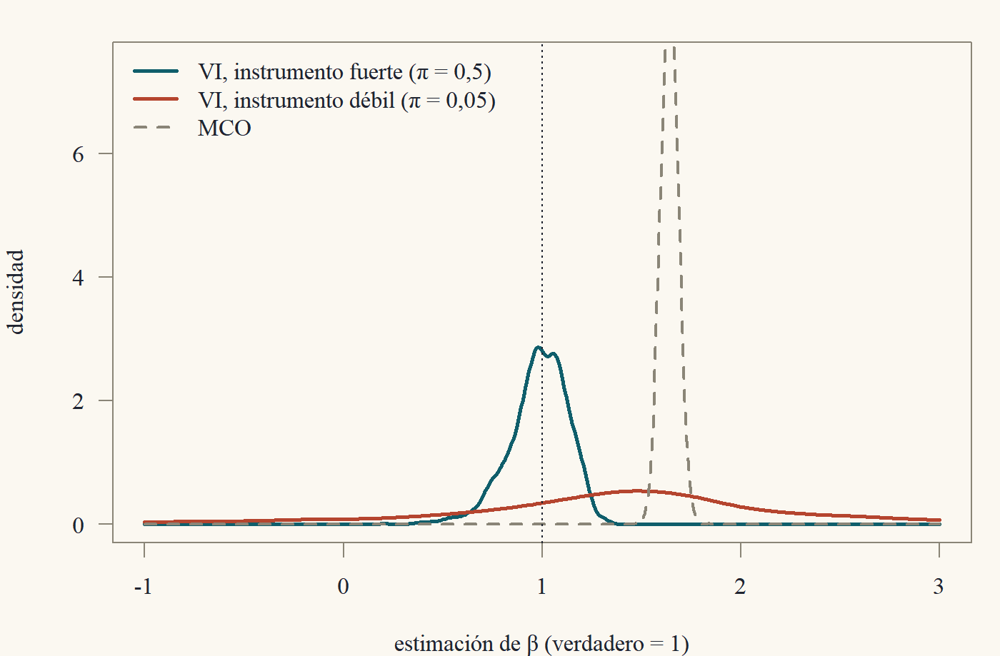

::: {.content-visible when-format="html"}
<a class="descarga-pdf" href="clase-10.pdf">Descargar esta clase en PDF</a>
:::

# El supuesto que no se puede probar

Durante nueve clases hemos visto que MCO es consistente para el coeficiente de proyección lineal $\beta = \mathbb{E}[xx']^{-1}\mathbb{E}[xy]$. Eso es un hecho matemático, sin condiciones. Pero muchas veces **ese no es el $\beta$ que nos interesa**. Queremos el efecto *causal* de la educación sobre el salario, el efecto de un precio sobre la cantidad demandada, el efecto de la policía sobre el crimen. Y el coeficiente de proyección no tiene por qué coincidir con esos efectos.

Formalmente, escribimos un **modelo estructural**
$$
y_i = x_i'\beta + u_i,
$$
donde ahora $\beta$ es el parámetro causal y $u_i$ son todos los demás determinantes de $y_i$. Decimos que el regresor $x_{ij}$ es **endógeno** si $\mathbb{E}[x_{ij}u_i]\ne0$ y **exógeno** si $\mathbb{E}[x_{ij}u_i] = 0$. Cuando algún regresor es endógeno, el $\beta$ estructural y el de proyección son distintos, y MCO estima el equivocado.

Esta clase trata de cómo recuperar el $\beta$ estructural con ayuda externa: una variable, el **instrumento**, que mueve a $x$ pero no está relacionada con $u$.[^wright]

[^wright]: Las variables instrumentales fueron inventadas por Philip Wright en 1928, en un apéndice de un libro sobre... aranceles a los aceites vegetales. El apéndice contenía la primera solución al problema de identificar oferta y demanda. Durante décadas hubo un debate sobre si lo había escrito Philip o su hijo Sewall, el famoso genetista que inventó el análisis de senderos. Un análisis estilométrico de 2003 (Stock y Trebbi) concluyó que fue Philip. La econometría resolviendo sus propios misterios.

# Tres fuentes de endogeneidad

**1. Variables omitidas.** Si el modelo verdadero es $y = x'\beta + \gamma w + e$ con $\mathbb{E}[xe] = 0$ pero $w$ no se observa, entonces $u = \gamma w + e$ y $\mathbb{E}[xu] = \gamma\mathbb{E}[xw]\ne0$ si $w$ está correlacionada con $x$. Es el sesgo por variable omitida de la Clase 8 (habilidad y educación).

**2. Error de medida.** Si $x = x^* + v$ con error clásico, vimos en la Clase 8 que $y = \beta x + (u - \beta v)$ y $\operatorname{Cov}(x, u - \beta v) = -\beta\sigma_v^2\ne0$.

**3. Simultaneidad.** Cuando $y$ y $x$ se determinan juntos. El ejemplo canónico es la oferta y la demanda:
$$
\text{Demanda: } q_i = \alpha_d + \beta_dp_i + u_i^d, \qquad \text{Oferta: } q_i = \alpha_s + \beta_sp_i + u_i^s.
$$
El precio de equilibrio resuelve el sistema: $p_i = \dfrac{\alpha_s - \alpha_d + u_i^s - u_i^d}{\beta_d - \beta_s}$. **El precio depende de los shocks de demanda**, así que en la ecuación de demanda el regresor $p$ está correlacionado con el error $u^d$. Regresar $q$ sobre $p$ no estima ni la oferta ni la demanda: estima una mezcla de ambas (Ejercicio 10.1).

::: {#thm-inconsistencia}
## Inconsistencia de MCO con endogeneidad
Si $y_i = x_i'\beta + u_i$ con $(y_i, x_i)$ i.i.d., $Q = \mathbb{E}[x_ix_i']\succ0$ y momentos finitos, entonces
$$
\hat\beta_{\text{MCO}}\xrightarrow{p}\beta + Q^{-1}\mathbb{E}[x_iu_i].
$$
En particular, MCO es inconsistente para el $\beta$ estructural si $\mathbb{E}[x_iu_i]\ne0$.
:::

::: {.proof}
Es la demostración de consistencia de la Clase 7, sin usar $\mathbb{E}[x_iu_i] = 0$: $\hat\beta = \beta + \hat Q^{-1}\frac1n\sum_ix_iu_i\xrightarrow{p}\beta + Q^{-1}\mathbb{E}[x_iu_i]$ por la LGN y la función continua.
:::

# El estimador de variables instrumentales

## El caso simple

Empecemos con un regresor endógeno y una constante: $y_i = \alpha + \beta x_i + u_i$ con $\mathbb{E}[u_i] = 0$ y $\operatorname{Cov}(x_i,u_i)\ne0$. Supongamos que tenemos una variable $z_i$ que cumple:

::: {.callout-caution title="Condiciones de un instrumento válido"}
- **Exogeneidad (o exclusión):** $\operatorname{Cov}(z_i, u_i) = 0$. El instrumento no está relacionado con los determinantes no observados de $y$; solo afecta a $y$ a través de $x$.
- **Relevancia:** $\operatorname{Cov}(z_i, x_i)\ne0$. El instrumento efectivamente mueve al regresor.
:::

Con esto, $\beta$ queda determinado por los momentos poblacionales. Tomando covarianza con $z_i$ en ambos lados del modelo,
$$
\operatorname{Cov}(z_i, y_i) = \beta\operatorname{Cov}(z_i, x_i) + \operatorname{Cov}(z_i,u_i) = \beta\operatorname{Cov}(z_i,x_i),
$$
y, por relevancia,
$$
\beta = \frac{\operatorname{Cov}(z_i,y_i)}{\operatorname{Cov}(z_i,x_i)}.
$$ {#eq-beta-vi}
Esta es una **fórmula de identificación**: escribe el parámetro causal en términos de momentos de variables observables. El principio de analogía hace el resto:
$$
\hat\beta_{\text{VI}} = \frac{\sum_i(z_i - \bar z)(y_i - \bar y)}{\sum_i(z_i - \bar z)(x_i - \bar x)}.
$$

Compara con MCO, que es $\widehat{\operatorname{Cov}}(x,y)/\widehat{\operatorname{Var}}(x)$: VI reemplaza "$x$ consigo mismo" por "$x$ con $z$" en el denominador, y "$x$ con $y$" por "$z$ con $y$" en el numerador. Solo usa la variación de $x$ que viene de $z$, que por exogeneidad está "limpia" de $u$.

Hay otra forma de escribir @eq-beta-vi que da mucha intuición. Dividiendo numerador y denominador por $\operatorname{Var}(z)$,
$$
\beta = \frac{\operatorname{Cov}(z,y)/\operatorname{Var}(z)}{\operatorname{Cov}(z,x)/\operatorname{Var}(z)} = \frac{\text{efecto de } z \text{ en } y \text{ (forma reducida)}}{\text{efecto de } z \text{ en } x \text{ (primera etapa)}}.
$$
Si el instrumento sube $x$ en 2 unidades y sube $y$ en 1 unidad, y solo afecta a $y$ a través de $x$, entonces cada unidad de $x$ sube $y$ en $1/2$. Es una regla de tres.

::: {#exm-wald}
## El estimador de Wald
Si $z_i\in\{0,1\}$ es binario (por ejemplo, haber sido sorteado para recibir un voucher escolar), entonces (Ejercicio 10.3)
$$
\beta = \frac{\mathbb{E}[y\mid z = 1] - \mathbb{E}[y\mid z = 0]}{\mathbb{E}[x\mid z = 1] - \mathbb{E}[x\mid z = 0]}.
$$
Angrist (1990) usó el sorteo de reclutamiento para Vietnam como instrumento del servicio militar: los números de sorteo bajos aumentaban la probabilidad de ir a la guerra, y el sorteo era literalmente aleatorio. El cociente entre la diferencia de ingresos y la diferencia en la probabilidad de haber servido estima el efecto del servicio militar sobre los ingresos.
:::

## El caso general: exactamente identificado

Con $k$ regresores en $x_i$ (algunos exógenos, que sirven como sus propios instrumentos, y algunos endógenos) y $k$ instrumentos en $z_i$, las condiciones son:

::: {.callout-caution title="Supuestos de VI (exactamente identificado)"}
- **VI1:** $(y_i, x_i, z_i)$ i.i.d. y $y_i = x_i'\beta + u_i$.
- **VI2 (exogeneidad):** $\mathbb{E}[z_iu_i] = 0$.
- **VI3 (relevancia):** $Q_{zx} = \mathbb{E}[z_ix_i']$ ($k\times k$) es invertible.
:::

De VI2, $\mathbb{E}[z_i(y_i - x_i'\beta)] = 0$, es decir, $\mathbb{E}[z_iy_i] = Q_{zx}\beta$, y por VI3,
$$
\beta = Q_{zx}^{-1}\mathbb{E}[z_iy_i], \qquad \hat\beta_{\text{VI}} = \Big(\sum_iz_ix_i'\Big)^{-1}\sum_iz_iy_i = (Z'X)^{-1}Z'y.
$$
Con $z_i = x_i$ (todos los regresores exógenos), esto es MCO. MCO es el caso particular de VI en que cada regresor es su propio instrumento.

# Mínimos cuadrados en dos etapas

¿Qué pasa si tenemos **más instrumentos que regresores endógenos**? Por ejemplo, para la educación podríamos usar la distancia a la universidad más cercana *y* el trimestre de nacimiento. Con $\ell>k$ instrumentos, $Z'X$ es $\ell\times k$ y no se puede invertir. Tenemos más ecuaciones ($\mathbb{E}[z_iu_i] = 0$ son $\ell$ ecuaciones) que incógnitas ($k$). El modelo está **sobreidentificado**.

::: {.callout-caution title="Supuestos de MC2E"}
- **VI1** como antes, con $z_i\in\mathbb{R}^\ell$, $\ell\ge k$.
- **VI2:** $\mathbb{E}[z_iu_i] = 0$.
- **VI3′ (condición de rango):** $Q_{zz} = \mathbb{E}[z_iz_i']\succ0$ y $Q_{zx} = \mathbb{E}[z_ix_i']$ ($\ell\times k$) tiene rango $k$.
:::

La condición de rango implica la **condición de orden** $\ell\ge k$: se necesitan al menos tantos instrumentos como regresores (contando los exógenos, que son sus propios instrumentos). Equivalentemente: al menos un instrumento excluido por cada regresor endógeno.

La idea de MC2E es combinar los $\ell$ instrumentos en $k$ "instrumentos óptimos": las **proyecciones de los regresores sobre los instrumentos**.

::: {#def-mc2e}
## MC2E
Sea $P_Z = Z(Z'Z)^{-1}Z'$. El estimador de **mínimos cuadrados en dos etapas** es
$$
\hat\beta_{\text{MC2E}} = (X'P_ZX)^{-1}X'P_Zy.
$$
:::

El nombre viene de la siguiente interpretación, que es un teorema:

::: {#thm-dos-etapas}
## MC2E son dos regresiones
Sea $\hat X = P_ZX$ la matriz de valores ajustados de regresar cada columna de $X$ sobre $Z$ (**primera etapa**). Entonces:

1. $\hat\beta_{\text{MC2E}} = (\hat X'\hat X)^{-1}\hat X'y$: es MCO de $y$ sobre $\hat X$ (**segunda etapa**).
2. $\hat\beta_{\text{MC2E}} = (\hat X'X)^{-1}\hat X'y$: es VI con instrumentos $\hat X$.
3. Si $\ell = k$ y $Z'X$ es invertible, $\hat\beta_{\text{MC2E}} = (Z'X)^{-1}Z'y = \hat\beta_{\text{VI}}$.
:::

::: {.callout-note title="Borrador"}
Todo sale de que $P_Z$ es simétrica e idempotente (Clase 1). (1): $\hat X'\hat X = X'P_Z'P_ZX = X'P_ZX$ y $\hat X'y = X'P_Zy$. (2): $\hat X'X = X'P_Z'X = X'P_ZX$. (3): con $\ell = k$, las matrices $Z'X$ y $X'Z$ son cuadradas e invertibles, así que puedo separar la inversa de un producto en producto de inversas y cancelar.
:::

::: {.proof}
Como $P_Z$ es simétrica e idempotente, $\hat X'\hat X = X'P_ZP_ZX = X'P_ZX$, $\hat X'X = X'P_ZX$ y $\hat X'y = X'P_Zy$. Sustituyendo en la definición se obtienen (1) y (2).

(3) Si $\ell = k$ y $Z'X$ es invertible (y por lo tanto también $X'Z = (Z'X)'$), usando $(ABC)^{-1} = C^{-1}B^{-1}A^{-1}$ para matrices cuadradas invertibles,
$$
(X'Z(Z'Z)^{-1}Z'X)^{-1}X'Z(Z'Z)^{-1}Z'y = (Z'X)^{-1}(Z'Z)(X'Z)^{-1}X'Z(Z'Z)^{-1}Z'y = (Z'X)^{-1}Z'y.
$$
:::

::: {.callout-warning title="No hagas las dos etapas a mano"}
Aunque (1) dice que MC2E es "regresar $y$ sobre $\hat X$", los **errores estándar** de esa segunda regresión hecha a mano son incorrectos: el programa calcula los residuos como $y - \hat X\hat\beta$, cuando los correctos son $y - X\hat\beta$ (con los regresores originales). Usa siempre el comando de VI/MC2E de tu software.
:::

# Propiedades asintóticas

A diferencia de MCO, **VI no es insesgado** en muestras finitas (ni siquiera tiene media finita en el caso exactamente identificado con un instrumento, bajo normalidad). Su justificación es enteramente asintótica.

::: {#thm-consistencia-vi}
## Consistencia de MC2E
Bajo VI1, VI2, VI3′ y momentos finitos, $\hat\beta_{\text{MC2E}}\xrightarrow{p}\beta$.
:::

::: {.proof}
Sustituyendo $y = X\beta + u$,
$$
\hat\beta_{\text{MC2E}} = \beta + (X'P_ZX)^{-1}X'P_Zu.
$$
Escribimos todo en promedios, con $\hat Q_{xz} = \frac1nX'Z$, $\hat Q_{zz} = \frac1nZ'Z$, $\hat Q_{zx} = \frac1nZ'X$:
$$
\hat\beta_{\text{MC2E}} - \beta = \big(\hat Q_{xz}\hat Q_{zz}^{-1}\hat Q_{zx}\big)^{-1}\hat Q_{xz}\hat Q_{zz}^{-1}\Big(\frac1n\sum_iz_iu_i\Big).
$$
(Los factores $n$ se cancelan: $X'P_ZX = n\,\hat Q_{xz}\hat Q_{zz}^{-1}\hat Q_{zx}$ y $X'P_Zu = n\,\hat Q_{xz}\hat Q_{zz}^{-1}\frac1nZ'u$.) Por la LGN, $\hat Q_{xz}\xrightarrow{p}Q_{xz}$, $\hat Q_{zz}\xrightarrow{p}Q_{zz}$, $\hat Q_{zx}\xrightarrow{p}Q_{zx}$ y $\frac1n\sum z_iu_i\xrightarrow{p}\mathbb{E}[z_iu_i] = 0$ por VI2.

La matriz $Q_{xz}Q_{zz}^{-1}Q_{zx}$ es invertible: es de la forma $C'AC$ con $A = Q_{zz}^{-1}\succ0$ y $C = Q_{zx}$ de rango columna completo $k$ (VI3′), así que es definida positiva (Clase 1). Por el teorema de la función continua,
$$
\hat\beta_{\text{MC2E}} - \beta\xrightarrow{p}(Q_{xz}Q_{zz}^{-1}Q_{zx})^{-1}Q_{xz}Q_{zz}^{-1}\cdot0 = 0.
$$
:::

Nota exactamente dónde entra cada supuesto: **exogeneidad** hace que el último factor tienda a cero; **relevancia** (la condición de rango) hace que la inversa del frente exista en el límite. Si el instrumento es irrelevante, estamos dividiendo por algo que tiende a cero, y todo se descontrola (sección de instrumentos débiles).

::: {#thm-normalidad-vi}
## Distribución asintótica de MC2E
Bajo los supuestos anteriores, con $\Omega_z = \mathbb{E}[u_i^2z_iz_i']$ finita,
$$
\sqrt n(\hat\beta_{\text{MC2E}} - \beta)\xrightarrow{d}N(0, V), \qquad V = A\,\Omega_z\,A', \quad A = (Q_{xz}Q_{zz}^{-1}Q_{zx})^{-1}Q_{xz}Q_{zz}^{-1}.
$$
Bajo homocedasticidad ($\mathbb{E}[u_i^2\mid z_i] = \sigma^2$), $\Omega_z = \sigma^2Q_{zz}$ y $V = \sigma^2(Q_{xz}Q_{zz}^{-1}Q_{zx})^{-1}$.
:::

::: {.proof}
De la demostración anterior, $\sqrt n(\hat\beta_{\text{MC2E}} - \beta) = \hat A\cdot\frac{1}{\sqrt n}\sum_iz_iu_i$ con $\hat A = (\hat Q_{xz}\hat Q_{zz}^{-1}\hat Q_{zx})^{-1}\hat Q_{xz}\hat Q_{zz}^{-1}\xrightarrow{p}A$. Los $z_iu_i$ son i.i.d. con media cero (VI2) y varianza $\Omega_z$, así que por el TCL, $\frac{1}{\sqrt n}\sum_iz_iu_i\xrightarrow{d}N(0,\Omega_z)$. Por Slutsky, $\sqrt n(\hat\beta - \beta)\xrightarrow{d}N(0, A\Omega_zA')$.

Bajo homocedasticidad, por la LEI, $\Omega_z = \mathbb{E}[\mathbb{E}[u_i^2\mid z_i]z_iz_i'] = \sigma^2Q_{zz}$. Sea $H = Q_{xz}Q_{zz}^{-1}Q_{zx}$. Entonces
$$
A\Omega_zA' = \sigma^2H^{-1}Q_{xz}Q_{zz}^{-1}Q_{zz}Q_{zz}^{-1}Q_{zx}H^{-1} = \sigma^2H^{-1}HH^{-1} = \sigma^2H^{-1}.
$$
:::

La varianza se estima por analogía, con $\hat u_i = y_i - x_i'\hat\beta_{\text{MC2E}}$ (¡con $x_i$, no con $\hat x_i$!) y $\hat\sigma^2 = \frac1n\sum\hat u_i^2$, o con la versión robusta $\hat\Omega_z = \frac1n\sum\hat u_i^2z_iz_i'$. En la práctica, con $\ell = k = 1$ y constante, la varianza homocedástica de la pendiente es $\sigma^2\operatorname{Var}(z)/\operatorname{Cov}(z,x)^2 = \dfrac{\sigma^2}{\operatorname{Var}(x)\,\rho_{xz}^2}$: es la varianza de MCO **dividida por la correlación al cuadrado entre instrumento y regresor**. Con $\rho_{xz} = 0{,}1$, la varianza es 100 veces la de MCO. **VI es caro.**

# Instrumentos débiles

La fórmula anterior ya advierte el problema: si $\operatorname{Cov}(z,x)$ es chica, VI es muy impreciso. Pero el problema es peor que una varianza grande: **la aproximación asintótica deja de funcionar**. Con un instrumento débil, en muestras de tamaño realista:

- MC2E está **sesgado hacia MCO**. Con muchos instrumentos débiles, el sesgo puede ser casi tan grande como el de MCO.
- La distribución de $\hat\beta$ está lejos de ser normal, con colas muy gordas.
- Los tests $t$ rechazan con probabilidad mucho mayor que el nivel nominal.

{#fig-iv-debil width=85%}

La intuición del sesgo hacia MCO: la primera etapa $\hat X = P_ZX$ se estima con error. Cuando el instrumento es débil, la mayor parte de la variación de $\hat X$ es ruido de estimación, y ese ruido es un ajuste de $X$ que incluye la parte endógena. En el extremo en que el instrumento es completamente irrelevante, $\hat X$ es "puro ajuste por azar" de $X$, y MC2E se comporta como MCO.

**Diagnóstico.** Con un regresor endógeno, se reporta el estadístico $F$ de la primera etapa (el test de que los coeficientes de los instrumentos excluidos son cero en la regresión de $x$ sobre $z$). La regla práctica de Staiger y Stock (1997) es desconfiar si $F<10$. Trabajos más recientes (Lee, McCrary, Moreira y Porter, 2022) muestran que, para que un test $t$ al 5 % tenga el tamaño correcto con la regla usual de $\pm1{,}96$, el umbral debería ser mucho mayor (del orden de $104$), y proponen ajustar los valores críticos en función del $F$. Con instrumentos débiles conviene usar procedimientos robustos, como el test de Anderson–Rubin, cuyo tamaño es correcto sin importar la fuerza del instrumento.

# ★ Postgrado: optimalidad de MC2E, Hausman y sobreidentificación

::: {.callout-important title="★ Postgrado"}
Mostramos que MC2E es el mejor estimador de VI bajo homocedasticidad, construimos el test de Hausman de endogeneidad y el test de Sargan de restricciones de sobreidentificación.
:::

## MC2E es el mejor uso lineal de los instrumentos

Con $\ell>k$ instrumentos, cualquier combinación lineal $W'z_i$ (con $W$ fija de $\ell\times k$ y $W'Q_{zx}$ invertible) da un instrumento válido de dimensión $k$. El estimador de VI correspondiente, $\hat\beta_W = (W'Z'X)^{-1}W'Z'y$, es consistente y, bajo homocedasticidad, su varianza asintótica es (mismo argumento que @thm-normalidad-vi)
$$
V_W = \sigma^2(W'Q_{zx})^{-1}W'Q_{zz}W(Q_{xz}W)^{-1}.
$$

::: {#thm-mc2e-optimo}
## Optimalidad de MC2E
Bajo homocedasticidad, $V_W\succeq\sigma^2(Q_{xz}Q_{zz}^{-1}Q_{zx})^{-1}$ para toda $W$ admisible, con igualdad si $W = Q_{zz}^{-1}Q_{zx}$ (que es la $W$ implícita en MC2E).
:::

::: {.proof}
Sea $G = Q_{zz}^{1/2}W(Q_{xz}W)^{-1}$ ($\ell\times k$) y $F = Q_{zz}^{-1/2}Q_{zx}$ ($\ell\times k$). Entonces $V_W/\sigma^2 = G'G$ (usando que $(W'Q_{zx})^{-1} = ((Q_{xz}W)^{-1})'$), $F'F = Q_{xz}Q_{zz}^{-1}Q_{zx}$ y
$$
F'G = Q_{xz}Q_{zz}^{-1/2}Q_{zz}^{1/2}W(Q_{xz}W)^{-1} = I_k.
$$
Sea $P_F = F(F'F)^{-1}F'$, la proyección sobre $\operatorname{col}(F)$. Como $I - P_F$ es simétrica e idempotente,
$$
0\preceq G'(I - P_F)G = G'G - G'F(F'F)^{-1}F'G = G'G - (F'F)^{-1},
$$
usando $G'F = (F'G)' = I$. Luego $V_W/\sigma^2 = G'G\succeq(F'F)^{-1} = (Q_{xz}Q_{zz}^{-1}Q_{zx})^{-1}$. Si $W = Q_{zz}^{-1}Q_{zx}$, entonces $G = Q_{zz}^{-1/2}Q_{zx}(F'F)^{-1} = F(F'F)^{-1}\in\operatorname{col}(F)$ y la desigualdad es igualdad.
:::

Es, una vez más, la estructura de Gauss–Markov: una proyección ortogonal y un término semidefinido positivo que sobra.

## El test de Hausman

¿Cómo sabemos si $x$ es endógeno? Si es exógeno, MCO y MC2E son ambos consistentes, y MCO es más eficiente (bajo homocedasticidad, MCO es el caso de MC2E con los instrumentos "óptimos" $x$). Si es endógeno, solo MC2E es consistente. Hausman (1978) propuso comparar ambos:
$$
H = n(\hat\beta_{\text{MC2E}} - \hat\beta_{\text{MCO}})'\big(\hat V_{\text{MC2E}} - \hat V_{\text{MCO}}\big)^{-}(\hat\beta_{\text{MC2E}} - \hat\beta_{\text{MCO}})\xrightarrow{d}\chi^2_{r}
$$
bajo $H_0$ (exogeneidad), donde $(\cdot)^-$ es una inversa generalizada y $r$ el número de regresores endógenos sospechosos. La razón de que la varianza de la diferencia sea la **diferencia** de varianzas es un resultado general, el "lema de Hausman": si $\hat\theta_e$ es asintóticamente eficiente y $\hat\theta_c$ es otro estimador consistente, entonces $\operatorname{Cov}_a(\hat\theta_e, \hat\theta_c - \hat\theta_e) = 0$; si no lo fuera, alguna combinación de ambos le ganaría a $\hat\theta_e$ (Ejercicio 10.7). Así, $\operatorname{Var}_a(\hat\theta_c - \hat\theta_e) = \operatorname{Var}_a(\hat\theta_c) - \operatorname{Var}_a(\hat\theta_e)$.

Una versión equivalente y más práctica (el **test de regresión aumentada** de Durbin–Wu–Hausman): estimar la primera etapa, guardar sus residuos $\hat v$, agregarlos como regresor en la ecuación estructural estimada por MCO, y testear (con errores robustos) si su coeficiente es cero. La lógica: $\hat v$ es la parte de $x$ no explicada por los instrumentos, que es la parte potencialmente endógena.

## Restricciones de sobreidentificación

Con $\ell>k$, tenemos $\ell - k$ condiciones de momentos "de sobra", y podemos testear si son compatibles entre sí. El **test de Sargan** (homocedástico) es: regresar los residuos de MC2E $\hat u$ sobre todos los instrumentos $Z$ y calcular
$$
S = nR^2\xrightarrow{d}\chi^2_{\ell - k}
$$
bajo $H_0:\mathbb{E}[z_iu_i] = 0$. (La versión robusta es el test $J$ de Hansen, que veremos en Econometría 2 con el método generalizado de momentos.) **Advertencia importante:** el test solo tiene poder si algunos instrumentos son válidos y otros no, y *supone* que al menos $k$ son válidos. Si todos los instrumentos son inválidos de la misma manera, el test no lo detecta. No reemplaza al argumento económico sobre la exogeneidad, que es, al final del día, lo que hace creíble a un instrumento.[^argumento]

[^argumento]: Esta es la lección más importante de la clase y quizás del curso. La exogeneidad de un instrumento **no se puede testear** con los datos (con $\ell = k$ es literalmente imposible: el estimador fuerza $\frac1n\sum z_i\hat u_i = 0$). Se defiende con conocimiento del problema: por qué el sorteo es aleatorio, por qué la distancia a la universidad no afecta el salario por otras vías, por qué la lluvia afecta la oferta de café pero no su demanda. La econometría te da la matemática; la credibilidad la pones tú.

# Resumen

- Si $\mathbb{E}[x_iu_i]\ne0$, MCO converge a $\beta + Q^{-1}\mathbb{E}[x_iu_i]$ (@thm-inconsistencia). Fuentes: omitidas, error de medida, simultaneidad.
- Un instrumento debe ser exógeno ($\mathbb{E}[zu] = 0$) y relevante ($\operatorname{rango}\mathbb{E}[zx'] = k$).
- Caso simple: $\beta = \operatorname{Cov}(z,y)/\operatorname{Cov}(z,x)$ = forma reducida / primera etapa.
- MC2E $= (X'P_ZX)^{-1}X'P_Zy$: MCO de $y$ sobre $\hat X = P_ZX$ (@thm-dos-etapas).
- MC2E es consistente y asintóticamente normal (@thm-consistencia-vi, @thm-normalidad-vi), pero no insesgado; con instrumentos débiles, la aproximación asintótica falla.

# Ejercicios

**Ejercicio 10.1.** En el modelo de oferta y demanda de esta clase, con $u^d$ y $u^s$ no correlacionados de varianzas $\sigma_d^2$ y $\sigma_s^2$, demuestra que la pendiente de MCO de $q$ sobre $p$ converge a
$$
\frac{\beta_d\sigma_s^2 + \beta_s\sigma_d^2}{\sigma_s^2 + \sigma_d^2}.
$$
Interpreta los casos $\sigma_d^2 = 0$ y $\sigma_s^2 = 0$.

::: {.callout-tip collapse="true" title="Solución 10.1"}
Sea $\Delta = \beta_d - \beta_s$. Entonces $p = (\text{cte} + u^s - u^d)/\Delta$ y $\operatorname{Var}(p) = (\sigma_s^2 + \sigma_d^2)/\Delta^2$. Usando la ecuación de demanda, $\operatorname{Cov}(p,q) = \beta_d\operatorname{Var}(p) + \operatorname{Cov}(p,u^d) = \beta_d\operatorname{Var}(p) - \sigma_d^2/\Delta$. Luego el límite es $\beta_d - \dfrac{\sigma_d^2/\Delta}{(\sigma_s^2 + \sigma_d^2)/\Delta^2} = \beta_d - \dfrac{\sigma_d^2(\beta_d - \beta_s)}{\sigma_s^2 + \sigma_d^2} = \dfrac{\beta_d\sigma_s^2 + \beta_s\sigma_d^2}{\sigma_s^2 + \sigma_d^2}$. Si $\sigma_d^2 = 0$ (solo se mueve la oferta), los equilibrios trazan la curva de demanda y MCO estima $\beta_d$. Si $\sigma_s^2 = 0$, estima la oferta. En general, un promedio ponderado. Por eso un instrumento para la demanda es un "desplazador de la oferta" (lluvia, costos): mueve la oferta a lo largo de una demanda fija.
:::

**Ejercicio 10.2.** Demuestra que en el caso simple con constante, $\hat\beta_{\text{VI}}\xrightarrow{p}\beta + \dfrac{\operatorname{Cov}(z,u)}{\operatorname{Cov}(z,x)}$ si se relaja la exogeneidad. Compara con el sesgo de MCO, $\operatorname{Cov}(x,u)/\operatorname{Var}(x)$, y argumenta por qué un instrumento "casi exógeno" pero débil puede ser peor que MCO.

::: {.callout-tip collapse="true" title="Solución 10.2"}
Por la LGN, $\hat\beta_{\text{VI}}\xrightarrow{p}\operatorname{Cov}(z,y)/\operatorname{Cov}(z,x) = \beta + \operatorname{Cov}(z,u)/\operatorname{Cov}(z,x)$. Escribiendo en correlaciones: sesgo de VI $= \dfrac{\rho_{zu}}{\rho_{zx}}\dfrac{\sigma_u}{\sigma_x}$ y sesgo de MCO $= \rho_{xu}\dfrac{\sigma_u}{\sigma_x}$. VI tiene menor sesgo asintótico solo si $|\rho_{zu}/\rho_{zx}|<|\rho_{xu}|$. Con $\rho_{zx}$ chico (instrumento débil), una violación minúscula de la exogeneidad se amplifica enormemente. Por ejemplo, con $\rho_{zu} = 0{,}02$, $\rho_{zx} = 0{,}05$ y $\rho_{xu} = 0{,}3$: VI tiene sesgo proporcional a $0{,}4$ y MCO a $0{,}3$.
:::

**Ejercicio 10.3.** Demuestra la fórmula del estimador de Wald (@exm-wald) a partir de @eq-beta-vi.

::: {.callout-tip collapse="true" title="Solución 10.3"}
Con $z$ binaria y $p = P(z = 1)$: $\operatorname{Cov}(z,y) = \mathbb{E}[zy] - \mathbb{E}[z]\mathbb{E}[y] = p\,\mathbb{E}[y\mid z = 1] - p(p\mathbb{E}[y\mid z = 1] + (1 - p)\mathbb{E}[y\mid z = 0]) = p(1-p)(\mathbb{E}[y\mid z = 1] - \mathbb{E}[y\mid z = 0])$. Lo mismo con $x$. El factor $p(1-p)$ se cancela en el cociente.
:::

**Ejercicio 10.4.** En $y = \beta_0 + \beta_1x_1 + \beta_2x_2 + u$, con $x_1$ exógeno, $x_2$ endógeno, y dos instrumentos excluidos $z_1, z_2$: ¿cuál es la matriz $Z$? ¿Cuántas restricciones de sobreidentificación hay? Escribe la primera etapa.

::: {.callout-tip collapse="true" title="Solución 10.4"}
$Z = [\iota\;\;x_1\;\;z_1\;\;z_2]$ ($\ell = 4$), $X = [\iota\;\;x_1\;\;x_2]$ ($k = 3$). Hay $\ell - k = 1$ restricción de sobreidentificación. La primera etapa relevante es $x_2 = \pi_0 + \pi_1x_1 + \pi_2z_1 + \pi_3z_2 + v$: los exógenos incluidos **siempre** van en la primera etapa. (Las columnas $\iota$ y $x_1$ de $X$ se "proyectan" sobre sí mismas.) La relevancia exige $(\pi_2,\pi_3)\ne(0,0)$.
:::

**Ejercicio 10.5.** Muestra que si en la primera etapa se omite el regresor exógeno $x_1$ (es decir, se regresa $x_2$ solo sobre $(1, z_1, z_2)$) y luego se hace la segunda etapa de $y$ sobre $(1, x_1, \hat x_2)$, el estimador resultante es en general inconsistente. (Es el error de la "regresión prohibida" en su versión más simple.)

::: {.callout-tip collapse="true" title="Solución 10.5"}
Sea $\hat x_2$ la proyección sobre $(1,z_1,z_2)$ y $x_2 = \hat x_2 + \hat v$. La ecuación es $y = \beta_0 + \beta_1x_1 + \beta_2\hat x_2 + (\beta_2\hat v + u)$. Para consistencia, el nuevo error debe ser ortogonal a $x_1$. Pero $\hat v$ es ortogonal a $(1,z_1,z_2)$, **no** a $x_1$: si $x_1$ y $x_2$ están correlacionados después de controlar por los $z$, entonces $\mathbb{E}[x_1\hat v]\ne0$ y el estimador es inconsistente. Con $x_1$ en la primera etapa, $\hat v$ es ortogonal a $x_1$ por construcción.
:::

**Ejercicio 10.6 ★.** Supón que el instrumento es **irrelevante**: $\operatorname{Cov}(z,x) = 0$. Con $y = \beta x + u$, $x = \pi z + v$ con $\pi = 0$, y $(z_i, u_i, v_i)$ normales con $z$ independiente de $(u,v)$, $\operatorname{Var}(z) = \operatorname{Var}(u) = \operatorname{Var}(v) = 1$ y $\operatorname{Corr}(u,v) = \rho$, muestra que $\hat\beta_{\text{VI}} - \beta$ converge en distribución a un cociente de normales, centrado en $\rho$ (el sesgo de MCO).

::: {.callout-tip collapse="true" title="Solución 10.6 ★"}
$\hat\beta_{\text{VI}} - \beta = \dfrac{n^{-1/2}\sum z_iu_i}{n^{-1/2}\sum z_ix_i} = \dfrac{n^{-1/2}\sum z_iu_i}{n^{-1/2}\sum z_iv_i}$ (sin constante, por simplicidad). Por el TCL, $(n^{-1/2}\sum z_iu_i, n^{-1/2}\sum z_iv_i)\xrightarrow{d}(\xi_u,\xi_v)$ normal bivariada con varianzas 1 y correlación $\rho$. Por la función continua (el cociente es continuo salvo en un conjunto de probabilidad cero), $\hat\beta_{\text{VI}} - \beta\xrightarrow{d}\xi_u/\xi_v$. Escribiendo $\xi_u = \rho\xi_v + \sqrt{1 - \rho^2}\,\eta$ con $\eta$ independiente, $\xi_u/\xi_v = \rho + \sqrt{1 - \rho^2}\,\eta/\xi_v$: el sesgo de MCO más una **Cauchy** escalada. No converge a $\beta$, está centrado (en mediana) en el sesgo de MCO, y no tiene media. Es el villano de la Clase 6.
:::

**Ejercicio 10.7 ★.** (Lema de Hausman.) Sean $\hat\theta_e$ y $\hat\theta_c$ dos estimadores escalares con $\sqrt n(\hat\theta_e - \theta, \hat\theta_c - \theta)$ asintóticamente normal, y $\hat\theta_e$ con la menor varianza asintótica entre todas las combinaciones $\hat\theta_\lambda = \hat\theta_e + \lambda(\hat\theta_c - \hat\theta_e)$. Demuestra que $\operatorname{Cov}_a(\hat\theta_e, \hat\theta_c - \hat\theta_e) = 0$.

::: {.callout-tip collapse="true" title="Solución 10.7 ★"}
Sea $d = \hat\theta_c - \hat\theta_e$. $\operatorname{Var}_a(\hat\theta_\lambda) = \operatorname{Var}_a(\hat\theta_e) + 2\lambda\operatorname{Cov}_a(\hat\theta_e, d) + \lambda^2\operatorname{Var}_a(d)$. Es una parábola en $\lambda$ con mínimo en $\lambda = 0$ (por eficiencia de $\hat\theta_e$), así que su derivada en $0$, $2\operatorname{Cov}_a(\hat\theta_e,d)$, debe ser cero. (Si fuera positiva, un $\lambda$ negativo pequeño reduciría la varianza; si fuera negativa, uno positivo.) Todos los $\hat\theta_\lambda$ son consistentes, así que compiten legítimamente con $\hat\theta_e$.
:::
